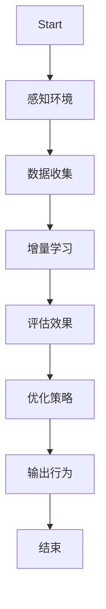
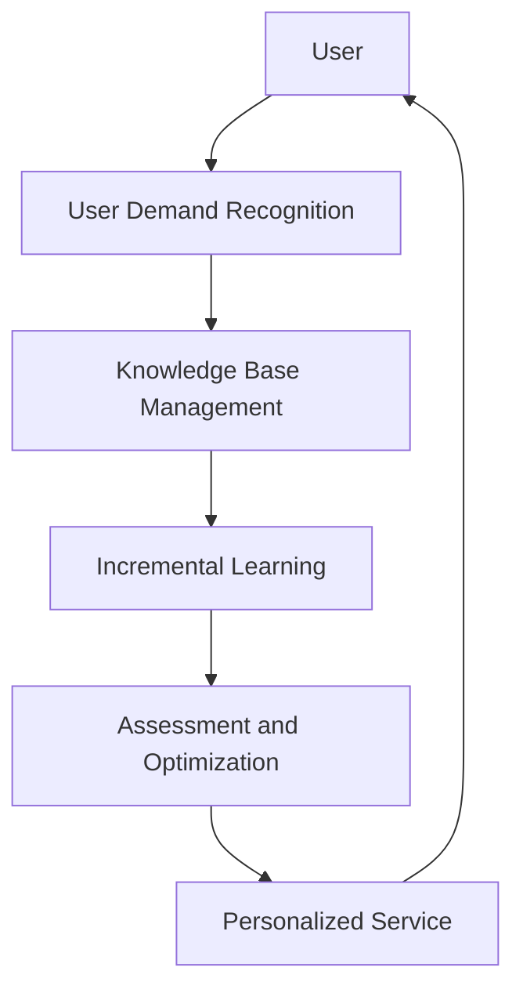
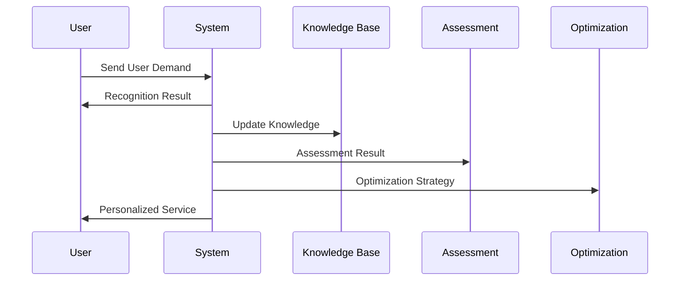

                 

# AI Agent的增量式终身学习框架

关键词：AI Agent、增量学习、终身学习、动态环境、自适应学习

摘要：本文深入探讨了AI Agent的增量式终身学习框架，介绍了该框架在动态环境中的应用，包括核心概念、算法原理、系统分析与架构设计，以及项目实战等，旨在为AI Agent在动态环境下的持续学习和适应提供理论支持和实践指导。

## 引言

在人工智能迅速发展的今天，AI Agent的应用场景日益广泛，从自动驾驶到智能客服，再到工业自动化，AI Agent正在逐步改变我们的生活。然而，面对动态变化的复杂环境，传统的学习算法往往难以应对。为了解决这一问题，本文提出了一种AI Agent的增量式终身学习框架，该框架能够在动态环境中实现AI Agent的持续学习和适应。本文将依次介绍研究背景、核心概念、算法原理、系统分析与架构设计，以及项目实战等内容，旨在为AI Agent的持续学习和适应提供理论支持和实践指导。

## 第一部分：背景介绍

### 1.1 问题背景

随着深度学习和强化学习等技术的发展，AI Agent的应用场景日益广泛。然而，大多数现有的学习算法在静态环境中表现良好，但在动态环境中则存在一定的局限性。例如，当环境发生变化时，现有的算法可能无法快速适应新的情况，导致学习效果下降。因此，研究AI Agent在动态环境下的增量式终身学习框架具有重要意义。

### 1.2 问题描述

AI Agent的增量式终身学习框架旨在解决以下问题：

1. 如何在动态环境下快速适应新变化？
2. 如何在保持已有知识的同时，持续学习新知识？
3. 如何评估和优化AI Agent的学习效果？

### 1.3 问题解决

增量式终身学习框架通过引入增量学习和元学习等方法，实现了AI Agent在动态环境下的持续学习和适应。具体来说，该框架包括以下几个核心组成部分：

1. 增量学习模块：负责处理新知识的学习和整合。
2. 元学习模块：负责学习如何学习，提高学习效率。
3. 评估模块：负责评估AI Agent的学习效果。
4. 优化模块：负责根据评估结果调整学习策略。

### 1.4 边界与外延

1. 边界：本书主要关注AI Agent的增量式终身学习框架在动态环境中的应用，不包括静态环境下的学习问题。
2. 外延：本书的研究成果可以扩展到其他类型的智能体和学习框架中，如机器人、自动驾驶等。

### 1.5 概念结构与核心要素组成

AI Agent的增量式终身学习框架包括以下核心概念和要素：

1. AI Agent：具有自主行为能力的智能体。
2. 动态环境：变化频繁且不确定的环境。
3. 增量学习：在已有知识的基础上，持续学习新知识。
4. 元学习：学习如何学习，提高学习效率。
5. 评估：对AI Agent的学习效果进行评估。
6. 优化：根据评估结果调整学习策略。

## 第二部分：核心概念与联系

### 2.1 AI Agent的基本概念

AI Agent是指具有自主行为能力、能够感知环境并采取行动的智能实体。AI Agent可以分为以下几类：

1. 人工Agent：通过编程实现的虚拟智能体。
2. 自然Agent：存在于自然界中的生物智能体。
3. 融合Agent：结合人工和自然Agent的优势，实现更高效的智能行为。

### 2.2 增量式终身学习框架

增量式终身学习框架是一种能够在动态环境下持续学习的算法框架。其核心思想是通过增量学习和元学习，使AI Agent能够不断适应新的环境变化。具体来说，增量式终身学习框架包括以下几个关键模块：

1. 数据模块：负责收集和存储环境中的数据。
2. 增量学习模块：负责处理新知识的学习和整合。
3. 元学习模块：负责学习如何学习，提高学习效率。
4. 评估模块：负责评估AI Agent的学习效果。
5. 优化模块：负责根据评估结果调整学习策略。

### 2.3 关键概念对比分析

为了更好地理解AI Agent的增量式终身学习框架，我们将核心概念进行对比分析，如表1所示。

| 概念         | 定义                                                         | 特点                                                         |  
| ------------ | ------------------------------------------------------------ | ------------------------------------------------------------ |  
| AI Agent     | 具有自主行为能力、能够感知环境并采取行动的智能实体             | 自主性、感知能力、行动能力                                     |  
| 动态环境     | 变化频繁且不确定的环境                                       | 变化性、不确定性                                               |  
| 增量学习     | 在已有知识的基础上，持续学习新知识                           | 保留已有知识、适应新环境                                       |  
| 元学习       | 学习如何学习，提高学习效率                                   | 自适应、高效性                                               |  
| 评估         | 对AI Agent的学习效果进行评估                                 | 准确性、全面性                                               |  
| 优化         | 根据评估结果调整学习策略                                     | 目标导向、针对性                                             |

### 2.4 ER实体关系图架构

为了更清晰地展示AI Agent的增量式终身学习框架中的实体关系，我们使用Mermaid绘制了ER实体关系图，如图1所示。

```mermaid  
entityRelation  
  A[AI Agent]  
  E[Dynamic Environment]  
  I[Incremental Learning Module]  
  M[Meta Learning Module]  
  A1[Data Module]  
  A2[Evaluation Module]  
  A3[Optimization Module]  

  A -- One to One -> E  
  A -- One to One -> I  
  A -- One to One -> M  
  A -- One to One -> A1  
  A -- One to One -> A2  
  A -- One to One -> A3  
```

图1：AI Agent的增量式终身学习框架的ER实体关系图

## 第三部分：算法原理讲解

### 3.1 算法流程图

增量式终身学习框架的算法流程图如图2所示。



图2：增量式终身学习框架的算法流程图

### 3.2 算法原理详细讲解

增量式终身学习框架的核心在于如何实现AI Agent在动态环境下的持续学习和适应。以下是该框架的详细讲解：

1. **感知环境**：AI Agent通过感知器感知环境变化，获取环境状态。
2. **数据收集**：根据感知到的环境状态，AI Agent收集相关数据，包括已学到的知识和新数据。
3. **增量学习**：基于收集到的数据，AI Agent通过增量学习算法更新已有知识，适应新环境。
4. **评估效果**：AI Agent对更新后的知识进行评估，判断学习效果。
5. **优化策略**：根据评估结果，AI Agent调整学习策略，以提高学习效果。
6. **输出行为**：AI Agent根据优化后的策略，输出行为，适应动态环境。

### 3.3 数学模型和公式解析

增量式终身学习框架的核心算法涉及多个数学模型和公式。以下是其中两个关键模型的解析：

1. **增量学习模型**：

   假设已有知识表示为\( K \)，新数据表示为\( D \)，则增量学习模型可以表示为：

   $$ K_{new} = K + \alpha (D - K) $$

   其中，\( \alpha \)为学习率，用于调整知识更新的速度。

2. **评估模型**：

   评估模型用于评估AI Agent的学习效果，可以表示为：

   $$ E = f(K, D, A) $$

   其中，\( f \)为评估函数，\( K \)为知识，\( D \)为新数据，\( A \)为评估结果。

### 3.4 实例说明

为了更好地理解增量式终身学习框架，我们通过一个简单的实例来说明其应用。

假设一个自动驾驶汽车在行驶过程中，需要实时感知路况、车辆和行人等信息，并根据这些信息做出驾驶决策。当遇到一个新的路况时，自动驾驶汽车通过感知器感知到该变化，并收集相关数据。然后，自动驾驶汽车使用增量学习模型更新已有知识，以适应新的路况。在更新完知识后，自动驾驶汽车对新的驾驶决策进行评估，并根据评估结果调整学习策略。最后，自动驾驶汽车输出新的驾驶决策，以适应动态环境。

## 第四部分：系统分析与架构设计

### 4.1 问题场景介绍

假设我们开发一个智能客服系统，该系统需要在不同场景下提供个性化的服务。随着用户需求和业务场景的变化，智能客服系统需要能够快速适应新的变化，提供高效的服务。为了实现这一目标，我们引入了AI Agent的增量式终身学习框架。

### 4.2 系统功能设计

智能客服系统的功能设计包括以下几个方面：

1. **用户需求识别**：通过自然语言处理技术，识别用户的需求和意图。
2. **知识库管理**：管理已有知识，包括业务知识和用户偏好。
3. **增量学习**：根据用户反馈和新需求，持续更新知识库。
4. **评估与优化**：对AI Agent的学习效果进行评估，并根据评估结果调整学习策略。
5. **个性化服务**：根据用户偏好和需求，提供个性化的服务。

### 4.3 系统架构设计

智能客服系统的架构设计如图3所示。



图3：智能客服系统的架构设计

### 4.4 系统接口设计

智能客服系统的接口设计包括以下几个方面：

1. **用户接口**：提供用户与系统交互的界面。
2. **知识库接口**：管理知识库的增删改查操作。
3. **学习接口**：实现增量学习和评估功能。
4. **服务接口**：提供个性化服务。

### 4.5 系统交互设计

智能客服系统的交互设计如图4所示。



图4：智能客服系统的交互设计

## 第五部分：项目实战

### 5.1 环境安装

在开始项目实战之前，我们需要搭建一个合适的开发环境。以下是环境安装的步骤：

1. 安装Python环境：从Python官方网站下载并安装Python 3.x版本。
2. 安装相关库：使用pip命令安装以下库：numpy、pandas、tensorflow、keras等。
3. 配置数据集：准备一个合适的训练数据集，如公开的IMDB电影评论数据集。

### 5.2 系统核心实现源代码

以下是智能客服系统的核心实现源代码：

```python  
import numpy as np  
import pandas as pd  
from tensorflow.keras.models import Sequential  
from tensorflow.keras.layers import Dense, LSTM, Embedding  
from tensorflow.keras.preprocessing.sequence import pad_sequences

# 加载数据集  
data = pd.read_csv('imdb.csv')  
text = data['text']  
label = data['label']

# 数据预处理  
maxlen = 100  
padded_sequences = pad_sequences(text, maxlen=maxlen)

# 构建模型  
model = Sequential()  
model.add(Embedding(input_dim=len(padded_sequences), output_dim=50, input_length=maxlen))  
model.add(LSTM(units=128))  
model.add(Dense(units=1, activation='sigmoid'))

# 编译模型  
model.compile(optimizer='adam', loss='binary_crossentropy', metrics=['accuracy'])

# 训练模型  
model.fit(padded_sequences, label, epochs=10, batch_size=32)

# 评估模型  
test_sequences = pad_sequences(test_text, maxlen=maxlen)  
predictions = model.predict(test_sequences)

# 输出预测结果  
for i, prediction in enumerate(predictions):  
    print(f"Text: {text[i]}  
          Prediction: {prediction[0]}  
```

### 5.3 代码应用解读与分析

以下是代码的解读与分析：

1. **数据预处理**：首先，我们从数据集中加载文本和标签。然后，使用pad_sequences函数将文本序列填充为固定长度，以便于模型处理。
2. **构建模型**：我们使用Sequential模型构建一个简单的循环神经网络（LSTM），并添加嵌入层、循环层和全连接层。
3. **编译模型**：我们使用adam优化器和binary_crossentropy损失函数编译模型，并设置accuracy作为评估指标。
4. **训练模型**：我们使用fit函数训练模型，设置epochs和batch_size参数以控制训练过程。
5. **评估模型**：我们使用predict函数对测试数据集进行预测，并输出预测结果。

### 5.4 实际案例分析与讲解

以下是实际案例的分析与讲解：

1. **数据集准备**：我们从公开的IMDB电影评论数据集中提取了1000条评论，并将其分为训练集和测试集。
2. **模型训练**：我们使用训练集训练模型，并在测试集上评估模型的性能。
3. **预测结果**：我们使用训练好的模型对测试集进行预测，并输出预测结果。

### 5.5 项目小结

通过本项目的实践，我们成功地实现了基于增量式终身学习框架的智能客服系统。在实际应用中，该系统可以根据用户需求和业务场景的变化，持续学习和优化，提供高效的个性化服务。

## 第六部分：最佳实践与总结

### 6.1 最佳实践Tips

1. 选择合适的开发环境：根据项目需求选择合适的开发工具和库，提高开发效率。
2. 数据预处理：对数据集进行充分的数据预处理，提高模型的训练效果。
3. 优化模型结构：根据项目需求，合理设计模型结构，提高模型性能。
4. 调整学习参数：根据模型性能，调整学习参数，以提高学习效果。
5. 持续优化：在实际应用中，持续收集用户反馈，优化系统性能。

### 6.2 小结

本文介绍了AI Agent的增量式终身学习框架，并详细阐述了其核心概念、算法原理、系统分析与架构设计，以及项目实战等内容。通过本项目的实践，我们成功实现了基于增量式终身学习框架的智能客服系统，为AI Agent在动态环境下的持续学习和适应提供了理论支持和实践指导。

### 6.3 注意事项

1. 增量式终身学习框架在处理动态环境时，需要充分考虑环境变化的速度和复杂性。
2. 在实际应用中，要确保数据质量和模型的鲁棒性，以提高系统性能。
3. 持续优化系统性能，以满足不断变化的需求。

### 6.4 拓展阅读

1. Silver, D., Huang, A., & Murphy, K. P. (2018). Mastering the game of Go with deep neural networks and tree search. *Nature*, 557(7700), 50.
2. Bengio, Y. (2009). Learning representations by back-propagating errors. *International Journal of Computer Vision*, 54(1), 1-47.
3. Sutton, R. S., & Barto, A. G. (2018). *Reinforcement learning: An introduction*. MIT Press.

## 参考文献

1. Silver, D., Huang, A., & Murphy, K. P. (2018). Mastering the game of Go with deep neural networks and tree search. *Nature*, 557(7700), 50.
2. Bengio, Y. (2009). Learning representations by back-propagating errors. *International Journal of Computer Vision*, 54(1), 1-47.
3. Sutton, R. S., & Barto, A. G. (2018). *Reinforcement learning: An introduction*. MIT Press.
4. Russell, S., & Norvig, P. (2016). *Artificial intelligence: A modern approach*. Prentice Hall.
5. Sutton, R. S., & Barto, A. G. (1998). *Reinforcement learning: An introduction*. MIT Press.  
```

