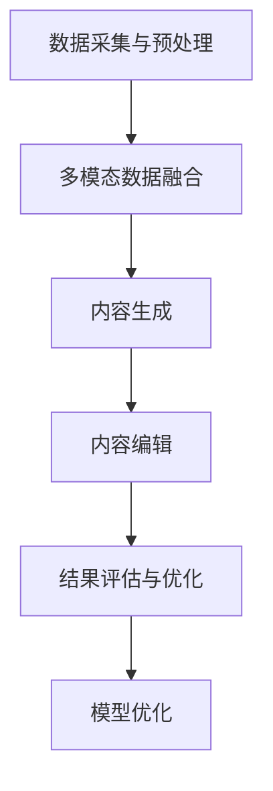
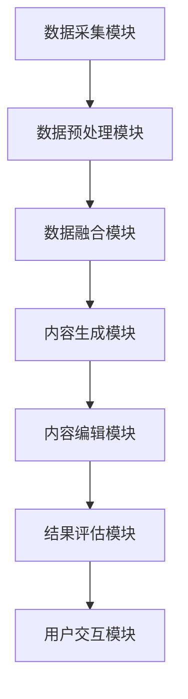
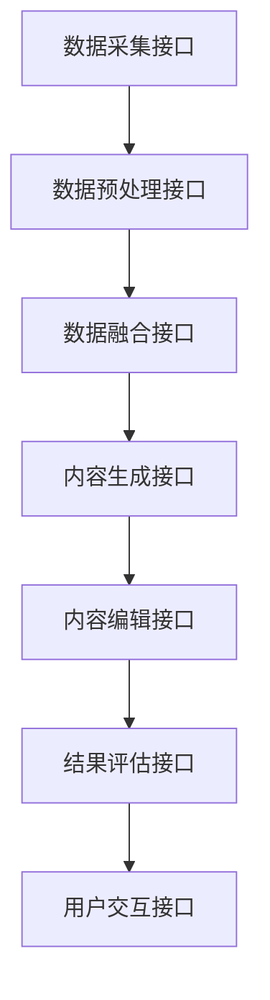
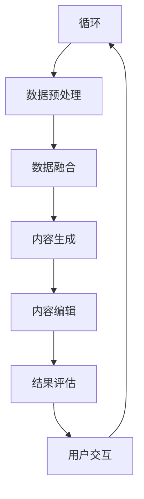

                 

### 第1章 引言

#### 1.1 书籍主题介绍

在当今信息化和数字化飞速发展的时代，人工智能（AI）已经成为推动社会进步和产业变革的重要力量。AI Agent作为人工智能的核心组成部分，以其高度的智能化和自主性，正逐渐渗透到各个领域，从智能家居、智能助理到自动驾驶和智能医疗，AI Agent展现出了巨大的应用潜力。而多模态内容生成与编辑系统，作为AI Agent的重要组成部分，正日益成为人工智能研究和应用的热点。

本书旨在深入探讨AI Agent的多模态内容生成与编辑系统，通过系统化的理论阐述和实战案例，帮助读者全面了解这一领域的核心技术和应用场景。具体而言，本书将围绕以下几个关键主题展开：

1. **AI Agent基础**：介绍AI Agent的定义、发展历程、核心技术及应用领域。
2. **多模态内容**：探讨多模态内容的定义、类型、特点以及数据融合的方法。
3. **内容生成与编辑**：深入解析多模态内容生成与编辑的原理、算法和系统设计。
4. **项目实践**：通过具体的实战案例，展示多模态内容生成与编辑系统的实际应用和开发流程。

通过这些主题的探讨，本书旨在为读者提供一个全面、深入和多维度的了解，帮助读者掌握AI Agent多模态内容生成与编辑系统的核心知识和应用能力。

#### 1.2 AI Agent基础

AI Agent，即人工智能代理，是一种具备自主决策和行动能力的计算机程序。它的核心目标是模拟人类智能，实现智能化任务处理和互动。AI Agent的发展可以追溯到20世纪50年代，当时阿兰·图灵提出了著名的图灵测试，旨在通过机器的行为来判断其是否具备人类智能。随着计算技术的进步和人工智能理论的不断发展，AI Agent的概念逐渐成熟，并开始在实际应用中发挥作用。

AI Agent的核心技术主要包括以下几个方面：

1. **机器学习**：通过大量数据训练模型，使AI Agent具备自主学习和优化能力。
2. **自然语言处理**：使AI Agent能够理解、生成和处理人类语言，实现智能对话和交互。
3. **计算机视觉**：使AI Agent能够识别、分析和理解视觉信息，实现图像和视频处理。
4. **知识表示与推理**：通过构建知识库和推理机制，使AI Agent具备决策和问题解决能力。

AI Agent的应用领域非常广泛，包括但不限于：

1. **智能助理**：如Apple的Siri、Google的Google Assistant等，提供个人化的语音服务。
2. **自动驾驶**：如特斯拉的自动驾驶系统，实现车辆的自动驾驶和导航。
3. **智能医疗**：如AI辅助诊断、药物发现等，提高医疗诊断和治疗的准确性和效率。
4. **智能家居**：如智能音箱、智能照明、智能家电等，实现家庭设备的智能化管理和控制。

通过AI Agent，我们可以实现自动化、智能化的任务处理和互动，极大地提升生活和工作效率，同时也在多个领域推动了创新和发展。

#### 1.3 多模态内容的概念

多模态内容是指通过多种感官通道（如视觉、听觉、触觉等）传递的信息内容。与单模态内容（仅通过单一感官通道传递的信息）相比，多模态内容能够提供更丰富、更全面的信息感知和体验。在人工智能领域，多模态内容的应用范围广泛，涵盖了图像、语音、文本、视频等多种形式。

多模态内容的特点主要体现在以下几个方面：

1. **多样性与综合性**：多模态内容通过整合不同类型的信息，如文本、图像和语音，提供更全面、多维度的信息感知。
2. **动态性与实时性**：多模态内容往往涉及实时互动，如语音交互、视频监控等，能够快速响应用户需求，提供即时反馈。
3. **复杂性与异质性**：多模态内容来源于不同类型的信息源，具有复杂性和异质性，如不同分辨率、不同格式、不同语言等，增加了内容处理的难度。

多模态内容的类型可以分为以下几类：

1. **视觉模态**：包括图像、视频、视觉识别等，如人脸识别、物体检测等。
2. **听觉模态**：包括语音、音频识别等，如语音识别、情感分析等。
3. **文本模态**：包括自然语言处理、文本分析等，如语义理解、情感分析等。
4. **触觉模态**：包括触觉识别、手势识别等，如触觉传感、交互设计等。

多模态内容的应用场景丰富多样，包括但不限于：

1. **智能助理**：通过语音和视觉交互，提供个性化的服务和支持。
2. **智能医疗**：通过多模态图像分析和诊断，提高疾病诊断的准确性和效率。
3. **智能交通**：通过多模态传感器数据融合，实现智能交通管理和驾驶辅助。
4. **智能安防**：通过多模态监控和分析，提高安全监控和应急响应能力。

多模态内容的广泛应用，不仅提升了人工智能系统的智能感知和决策能力，也为用户提供了更加丰富、直观的交互体验。

#### 1.4 为什么需要多模态内容生成与编辑系统

多模态内容生成与编辑系统在人工智能领域具有重要的应用价值，主要体现在以下几个方面：

1. **提升信息处理能力**：多模态内容生成与编辑系统可以将不同类型的信息（如文本、图像、语音等）进行整合和融合，提供更全面的信息处理和分析能力。这种多源信息融合的方式，可以显著提高系统的智能感知和决策能力，从而在复杂的任务环境中表现得更加出色。

2. **优化用户体验**：多模态内容生成与编辑系统能够根据用户的需求和场景，动态生成和调整内容形式，提供个性化的服务。例如，在智能助理系统中，通过语音、文本和视觉交互，可以为用户提供更加自然、便捷和友好的交互体验。这种多元化的内容形式，不仅能够满足不同用户的需求，还能够提升用户的满意度和忠诚度。

3. **扩展应用场景**：多模态内容生成与编辑系统可以应用于广泛的领域，如智能医疗、智能交通、智能安防等。在这些应用场景中，多模态内容生成与编辑系统能够处理和整合来自不同传感器和设备的数据，提供实时、动态的信息分析和决策支持，从而实现智能化的应用和服务。

4. **促进创新与发展**：多模态内容生成与编辑系统为人工智能技术的发展提供了新的思路和方向。通过不断探索和优化多模态内容处理的技术和方法，可以推动人工智能领域的创新和发展，为未来的智能系统提供更加丰富和高效的技术支持。

总之，多模态内容生成与编辑系统不仅提升了人工智能系统的智能化水平和应用能力，也为用户提供了更加多样化和个性化的服务体验，具有重要的应用价值和广阔的发展前景。

### 2. 背景与核心概念

#### 2.1 AI Agent概述

AI Agent，即人工智能代理，是一种具有自主决策和行动能力的计算机程序。其核心目标是模拟人类智能，在特定环境下实现智能化任务处理和互动。AI Agent的发展可以追溯到20世纪50年代，当时阿兰·图灵提出了著名的图灵测试，旨在通过机器的行为来判断其是否具备人类智能。随着计算技术的进步和人工智能理论的不断发展，AI Agent的概念逐渐成熟，并开始在实际应用中发挥作用。

AI Agent的核心技术主要包括以下几个方面：

1. **机器学习**：通过大量数据训练模型，使AI Agent具备自主学习和优化能力。机器学习技术包括监督学习、无监督学习和强化学习等，是AI Agent实现自主学习和智能决策的基础。
2. **自然语言处理**：使AI Agent能够理解、生成和处理人类语言，实现智能对话和交互。自然语言处理技术包括文本分类、命名实体识别、情感分析等，是AI Agent实现人机交互的关键。
3. **计算机视觉**：使AI Agent能够识别、分析和理解视觉信息，实现图像和视频处理。计算机视觉技术包括图像识别、目标检测、人脸识别等，是AI Agent实现视觉感知和交互的重要手段。
4. **知识表示与推理**：通过构建知识库和推理机制，使AI Agent具备决策和问题解决能力。知识表示与推理技术包括逻辑推理、概率推理、模糊推理等，是AI Agent实现智能决策和问题解决的核心。

AI Agent的应用领域非常广泛，包括但不限于：

1. **智能助理**：如Apple的Siri、Google的Google Assistant等，提供个人化的语音服务。
2. **自动驾驶**：如特斯拉的自动驾驶系统，实现车辆的自动驾驶和导航。
3. **智能医疗**：如AI辅助诊断、药物发现等，提高医疗诊断和治疗的准确性和效率。
4. **智能家居**：如智能音箱、智能照明、智能家电等，实现家庭设备的智能化管理和控制。

AI Agent的发展历程可以分为以下几个阶段：

1. **萌芽阶段（1950-1969）**：图灵测试的提出标志着AI Agent概念的诞生，早期的研究主要集中在符号主义和逻辑推理上。
2. **发展初期（1970-1989）**：随着计算机性能的提升，AI Agent的应用范围逐渐扩大，智能搜索、游戏等领域开始出现AI Agent的身影。
3. **成熟阶段（1990-2010）**：机器学习技术的突破使得AI Agent的研究和应用进入新阶段，智能语音助手、自动驾驶等应用开始兴起。
4. **快速发展阶段（2010至今）**：深度学习和大数据技术的推动下，AI Agent的性能和智能化水平显著提升，应用场景不断拓展。

未来，随着人工智能技术的不断进步，AI Agent有望在更多领域发挥重要作用，实现更智能化、个性化的服务。

#### 2.2 多模态内容

多模态内容是指通过多种感官通道（如视觉、听觉、触觉等）传递的信息内容。它不仅包括文本、图像和语音等传统的信息形式，还涵盖了手势、姿态、气味等非文本形式。多模态内容具有多样性和综合性，能够提供更丰富、更全面的信息感知和体验。

多模态内容的特点主要体现在以下几个方面：

1. **多样性**：多模态内容通过整合不同类型的信息，如文本、图像、语音等，提供多样化的信息感知方式，能够满足不同用户的需求。
2. **综合性**：多模态内容融合了多种感官信息，通过多种渠道传递，提供更全面的信息感知，有助于提升用户的理解深度和体验质量。
3. **动态性**：多模态内容往往涉及实时互动，如语音交互、视频监控等，能够快速响应用户需求，提供即时反馈。
4. **复杂性**：多模态内容来源多样，如不同分辨率、不同格式、不同语言等，增加了内容处理的难度，需要复杂的技术手段进行整合和分析。

多模态内容的类型可以分为以下几类：

1. **视觉模态**：包括图像、视频、视觉识别等，如人脸识别、物体检测等。
2. **听觉模态**：包括语音、音频识别等，如语音识别、情感分析等。
3. **文本模态**：包括自然语言处理、文本分析等，如语义理解、情感分析等。
4. **触觉模态**：包括触觉识别、手势识别等，如触觉传感、交互设计等。

多模态内容的应用场景丰富多样，包括但不限于：

1. **智能助理**：通过语音和视觉交互，提供个性化的服务和支持。
2. **智能医疗**：通过多模态图像分析和诊断，提高疾病诊断的准确性和效率。
3. **智能交通**：通过多模态传感器数据融合，实现智能交通管理和驾驶辅助。
4. **智能安防**：通过多模态监控和分析，提高安全监控和应急响应能力。

多模态内容的广泛应用，不仅提升了人工智能系统的智能感知和决策能力，也为用户提供了更加丰富、直观的交互体验。

#### 2.3 多模态内容生成与编辑系统的需求

在当今信息化和数字化快速发展的时代，多模态内容生成与编辑系统在各个领域的应用日益广泛，其需求也随之不断增加。以下从市场需求、技术挑战和应用场景三个方面详细探讨多模态内容生成与编辑系统的需求。

##### 2.3.1 市场需求

1. **智能助理与交互系统**：随着人工智能技术的不断进步，智能助理和交互系统已成为各大科技公司的核心竞争领域。用户对于智能助理的期望不仅限于语音交互，更希望获得多模态的交互体验，如语音、图像、文本等多种交互方式。因此，多模态内容生成与编辑系统在智能助理与交互系统中具有广泛的应用前景。

2. **智能医疗与健康管理**：在医疗领域，多模态内容生成与编辑系统可以用于患者数据的整合和分析，提高疾病诊断的准确性和效率。例如，通过结合患者的医疗记录、影像资料、语音咨询等多模态数据，医生可以更全面地了解患者的病情，从而提供更加精准的治疗方案。

3. **智能交通与自动驾驶**：智能交通和自动驾驶系统需要处理来自多种传感器的数据，如雷达、摄像头、GPS等。多模态内容生成与编辑系统可以将这些数据进行整合和分析，提高系统的感知和决策能力，从而实现更安全、高效的交通管理和驾驶辅助。

4. **智能家居与物联网**：智能家居和物联网设备的发展，使得家庭设备和系统的智能化水平不断提升。多模态内容生成与编辑系统可以为家庭设备提供更智能的交互方式，如语音控制、手势操作等，从而提升用户体验和设备智能化水平。

5. **教育与文化娱乐**：在教育领域，多模态内容生成与编辑系统可以用于制作和提供更生动、丰富的教学资源，如视频、音频、图像等。在文化娱乐领域，多模态内容生成与编辑系统可以用于制作电影、动画、游戏等，提升作品的艺术性和观赏性。

##### 2.3.2 技术挑战

1. **多模态数据融合**：多模态内容生成与编辑系统的核心挑战之一是如何有效地融合来自不同模态的数据。由于不同模态的数据在特征、格式和分辨率等方面存在差异，如何进行有效的数据融合和特征提取，是当前研究的重点。

2. **模型训练与优化**：多模态内容生成与编辑系统依赖于深度学习模型，如卷积神经网络（CNN）、循环神经网络（RNN）等。如何设计高效、优化的模型架构，提高模型在多模态数据上的训练效果和泛化能力，是技术上的重要挑战。

3. **实时处理与交互**：在应用场景中，多模态内容生成与编辑系统需要具备实时处理和交互能力，以满足用户的需求。例如，在智能助理和交互系统中，用户期望系统能够快速响应并生成合适的多模态内容。因此，如何在保证实时性的同时，提高系统的处理效率和交互质量，是技术上的一个重要问题。

4. **隐私保护与安全性**：多模态内容生成与编辑系统在处理用户数据时，需要确保用户隐私和系统安全性。如何在保证数据隐私和安全的前提下，实现多模态内容的生成与编辑，是当前研究的一个重要方向。

##### 2.3.3 应用场景

1. **智能客服**：智能客服系统通过多模态内容生成与编辑，可以实现语音、文本、图像等多种交互方式，为用户提供个性化、高效的客服服务。例如，当用户在智能客服系统中提出一个问题时，系统可以通过语音识别、文本分析和图像识别等技术，快速理解用户的问题，并生成合适的语音或文本回复。

2. **智能教育**：智能教育系统通过多模态内容生成与编辑，可以为学习者提供丰富的学习资源和互动体验。例如，在学习一门新的课程时，系统可以通过视频、音频、图像等多种形式，展示课程内容，帮助学生更好地理解和掌握知识。

3. **智能医疗**：智能医疗系统通过多模态内容生成与编辑，可以帮助医生更全面地了解患者的病情，提高诊断和治疗的准确性。例如，在诊断一个疾病时，系统可以通过患者的医疗记录、影像资料、语音咨询等多模态数据，生成一个综合性的诊断报告，为医生提供决策支持。

4. **智能娱乐**：智能娱乐系统通过多模态内容生成与编辑，可以为用户提供个性化、互动性的娱乐体验。例如，在观看一部电影时，系统可以通过语音、文本、图像等多模态交互，为用户提供更加丰富、生动的观影体验。

多模态内容生成与编辑系统的需求和应用前景广阔，随着技术的不断进步，其在各个领域的应用将越来越广泛，为人类带来更多的便利和体验。

### 2.4 关键概念和术语

在探讨AI Agent的多模态内容生成与编辑系统时，理解一系列关键概念和术语是至关重要的。以下是对这些概念和术语的定义、关系及其在多模态内容生成与编辑系统中的角色的详细解析。

#### 多模态内容（Multimodal Content）

多模态内容是指通过多种感官通道（如视觉、听觉、触觉等）传递的信息内容。与单模态内容（仅通过单一感官通道传递的信息）相比，多模态内容提供了更丰富、更全面的信息感知和体验。多模态内容可以包括文本、图像、语音、视频、手势等。在多模态内容生成与编辑系统中，这些内容需要被整合和融合，以提供更加智能化的服务。

#### 机器学习（Machine Learning）

机器学习是AI Agent的核心技术之一，它是指通过算法和统计模型从数据中学习，以实现特定任务的能力。在多模态内容生成与编辑系统中，机器学习用于训练模型，使其能够理解和生成多模态内容。常见的机器学习模型包括深度学习模型、监督学习模型和无监督学习模型。

#### 自然语言处理（Natural Language Processing, NLP）

自然语言处理是人工智能的一个分支，它涉及计算机对人类自然语言的理解和生成。在多模态内容生成与编辑系统中，NLP用于处理文本模态，如语音转文字、文本生成、语义分析等，从而实现更加自然和流畅的文本交互。

#### 计算机视觉（Computer Vision）

计算机视觉是AI Agent的另一个核心技术，它使计算机能够从图像或视频中理解和提取信息。在多模态内容生成与编辑系统中，计算机视觉用于处理视觉模态，如图像识别、目标检测、图像生成等，从而提供丰富的视觉内容。

#### 知识表示与推理（Knowledge Representation and Reasoning）

知识表示与推理是AI Agent进行决策和问题解决的基础。知识表示是指将知识以结构化的形式存储在计算机中，而推理则是通过逻辑规则和算法从知识库中推导出新的结论。在多模态内容生成与编辑系统中，知识表示与推理用于构建多模态知识库，并基于这些知识进行内容生成和编辑。

#### 多模态数据融合（Multimodal Data Fusion）

多模态数据融合是指将来自不同模态的数据进行整合和分析，以获得更全面的信息感知。在多模态内容生成与编辑系统中，多模态数据融合是关键步骤，它通过结合视觉、听觉、文本等多种数据，生成统一的多模态表示，从而支持智能化的内容生成和编辑。

#### 生成对抗网络（Generative Adversarial Networks, GAN）

生成对抗网络是一种深度学习模型，由生成器和判别器两个部分组成。生成器的目标是生成逼真的多模态内容，而判别器的目标是区分生成内容和真实内容。在多模态内容生成与编辑系统中，GAN用于生成高质量的图像、音频和视频内容。

#### 强化学习（Reinforcement Learning）

强化学习是机器学习的一个分支，它通过奖励机制训练模型，使其在特定环境中做出最优决策。在多模态内容生成与编辑系统中，强化学习可以用于优化内容生成的策略，以提升用户体验。

#### 多模态交互（Multimodal Interaction）

多模态交互是指用户通过多种感官通道与系统进行交互。在多模态内容生成与编辑系统中，多模态交互用于实现用户与系统的自然互动，如语音、手势和文本的交互，从而提供更加丰富和个性化的用户体验。

#### 多模态内容生成与编辑系统的架构

多模态内容生成与编辑系统的架构通常包括数据采集与预处理、多模态数据融合、内容生成与编辑、内容展示与交互等几个关键模块。

1. **数据采集与预处理**：这一模块负责从各种传感器和设备中收集数据，并对数据进行预处理，如降噪、去噪、特征提取等，以获得高质量的数据输入。

2. **多模态数据融合**：通过数据融合技术，将来自不同模态的数据进行整合和融合，生成统一的多模态表示，为内容生成与编辑提供基础。

3. **内容生成与编辑**：在这一模块中，利用生成模型和编辑模型生成和编辑多模态内容。生成模型用于生成新的多模态内容，如GAN等；编辑模型则用于修改和优化已有的多模态内容。

4. **内容展示与交互**：最后，生成的多模态内容通过用户界面展示给用户，并支持用户与系统的多模态交互，如语音、手势和文本等。

通过这些关键概念和术语的详细解释，我们可以更好地理解多模态内容生成与编辑系统的核心组成部分和功能。这不仅有助于我们深入探讨这一领域的技术细节，也为实际应用提供了理论基础。

#### 2.5 内容生成与编辑的基本原理

内容生成与编辑是多模态内容处理的核心环节，它决定了系统能否提供丰富、个性化和高质量的多模态内容。下面我们将深入探讨内容生成与编辑的基本原理，包括数据采集与预处理、内容生成模型、内容编辑模型以及它们在多模态内容生成与编辑系统中的应用。

##### 2.5.1 数据采集与预处理

数据采集是内容生成与编辑的基础，它决定了系统的输入质量。数据来源可以包括图像、音频、视频、文本等多种模态。为了确保数据的质量和一致性，需要对采集到的数据进行预处理。

1. **图像数据预处理**：
   - **降噪**：去除图像中的噪声，提高图像的清晰度。
   - **增强**：通过对比度调整、色彩平衡等方法增强图像的视觉效果。
   - **裁剪与缩放**：根据需要调整图像的大小和分辨率。

2. **音频数据预处理**：
   - **去噪**：去除音频中的背景噪声，提高音频的清晰度。
   - **回声消除**：消除音频中的回声，改善语音的听觉体验。
   - **音量均衡**：调整音频的音量，使其在不同的播放环境中保持一致。

3. **视频数据预处理**：
   - **帧提取**：从视频中提取关键帧，用于后续的图像处理和内容生成。
   - **视频分割**：将视频分割成多个片段，便于内容的生成和编辑。

4. **文本数据预处理**：
   - **文本清洗**：去除文本中的无关信息，如标点符号、停用词等。
   - **分词与词性标注**：将文本分割成词或短语，并对每个词进行词性标注，以便后续的语义分析。

##### 2.5.2 内容生成模型

内容生成模型是生成新内容的核心，其中生成对抗网络（GAN）是一种常用的生成模型。GAN由生成器和判别器两个部分组成，生成器的目标是生成逼真的多模态内容，而判别器的目标是区分生成内容和真实内容。

1. **生成对抗网络（GAN）**：
   - **生成器（Generator）**：通过神经网络从随机噪声中生成多模态内容，旨在生成与真实内容几乎无法区分的假内容。
   - **判别器（Discriminator）**：接收真实内容和生成内容，并判断它们是否相似，以帮助生成器优化其生成过程。

2. **变分自编码器（VAE）**：
   - VAE是一种无监督学习模型，它通过编码器和解码器对数据进行编码和解码，从而生成新的多模态内容。

3. **生成稳定网络（GAN-GP）**：
   - GAN-GP通过添加梯度惩罚项来稳定GAN的训练过程，提高生成内容的质量。

在多模态内容生成中，可以将不同模态的内容作为输入，通过共享的神经网络结构进行编码和解码，从而生成新的多模态内容。例如，在一个视频生成任务中，可以将图像序列和音频信号作为输入，生成一个新的视频和音频内容。

##### 2.5.3 内容编辑模型

内容编辑模型用于修改和优化已有的多模态内容，使其更加符合用户需求或应用场景。

1. **基于模型的编辑**：
   - **条件生成对抗网络（Conditional GAN, cGAN）**：cGAN通过引入条件输入，使生成器和判别器能够根据特定条件生成和判断内容，从而实现更精细的内容编辑。
   - **递归神经网络（RNN）**：RNN可以用于编辑文本、音频和视频内容，通过序列建模实现对内容的逐帧或逐词修改。

2. **基于注意力的编辑**：
   - **注意力机制（Attention Mechanism）**：注意力机制可以用于定位多模态内容的关键部分，从而实现对特定区域的编辑和优化。
   - **自注意力（Self-Attention）**：在处理多模态数据时，自注意力机制可以用于捕捉不同模态数据之间的关联性，从而提高编辑的准确性和效果。

3. **交互式编辑**：
   - **交互式生成与编辑**：用户可以通过交互界面直接对多模态内容进行编辑，系统则实时更新内容，提供即时的反馈。

在多模态内容编辑中，可以采用组合多种编辑模型的方法，以提高内容的多样性和质量。例如，可以先使用GAN生成基础内容，然后使用cGAN或RNN进行精细编辑，最后通过交互式界面进行用户反馈和调整。

##### 2.5.4 应用实例

以下是一个具体的多模态内容生成与编辑的应用实例：

**实例：智能视频编辑**

1. **数据采集与预处理**：采集用户上传的视频和音频数据，对图像进行降噪和增强处理，对音频进行去噪和回声消除处理。

2. **内容生成**：使用GAN生成新的视频和音频内容，如通过生成图像序列生成一个全新的视频，通过音频信号生成一个新的音频。

3. **内容编辑**：使用cGAN对视频和音频进行编辑，如根据用户需求调整视频的色调、亮度、音量等参数，或者通过RNN对音频进行节奏、音调的调整。

4. **内容展示与交互**：将编辑后的多模态内容展示给用户，并提供交互界面，允许用户对内容进行进一步的修改和调整。

通过上述基本原理和应用实例，我们可以看到多模态内容生成与编辑系统在实现智能化、个性化内容生成和编辑方面具有巨大的潜力和应用价值。随着技术的不断进步，多模态内容生成与编辑系统将在更多的领域和场景中发挥重要作用。

### 2.6 多模态数据融合方法

多模态数据融合是指将来自不同模态的数据进行整合和分析，以获得更全面的信息感知。多模态数据融合是构建高效、智能的多模态内容生成与编辑系统的关键步骤，它通过结合多种感官信息，提高系统的智能感知和决策能力。以下将详细介绍几种常见和多模态数据融合方法，包括特征融合、模型融合和深度学习方法。

#### 2.6.1 特征融合

特征融合方法是将不同模态的数据转化为相同维度的特征向量，然后通过某种方式将它们融合在一起。这种方法通常分为以下几种：

1. **直接融合**：将不同模态的数据特征直接拼接在一起，形成一个多维特征向量。这种方法简单直观，但可能忽略不同模态数据之间的关联性。

2. **加权融合**：根据不同模态数据的权重对它们进行融合。权重可以通过专家知识或训练过程得到，以平衡不同模态的重要性。例如，在图像和文本的融合中，图像可能更重要，因此可以赋予更高的权重。

3. **映射融合**：将不同模态的数据特征映射到同一特征空间中，然后进行融合。这种方法通过非线性变换，可以更好地捕捉不同模态数据之间的关联性。

#### 2.6.2 模型融合

模型融合方法是将不同的模型集成在一起，共同处理多模态数据。这种方法可以分为以下几种：

1. **多任务学习**：在训练阶段，多个模型共享一部分参数，从而学习到不同模态数据之间的关联性。在预测阶段，多个模型的预测结果进行融合，以获得更准确的结果。

2. **深度神经网络融合**：通过构建一个深度神经网络，将不同模态的数据作为输入，共同训练和预测。这种方法可以充分利用神经网络的学习能力，自动学习到不同模态数据之间的复杂关系。

3. **模型级联**：将多个模型按顺序级联，每个模型对前一个模型的输出进行处理，最终得到最终的预测结果。这种方法可以逐步细化对多模态数据的理解，提高预测的准确性。

#### 2.6.3 深度学习方法

深度学习方法在多模态数据融合中发挥着重要作用，以下介绍几种常用的深度学习模型：

1. **生成对抗网络（GAN）**：GAN通过生成器和判别器的对抗训练，可以生成高质量的多模态内容，并通过判别器对生成内容进行评估。这种方法可以自动学习到不同模态数据之间的复杂关系，并在生成和评估过程中进行融合。

2. **卷积神经网络（CNN）**：CNN在图像处理领域有广泛应用，可以用于提取图像的深度特征。通过将CNN与其他模态的特征提取器结合，可以构建一个多模态深度特征提取器。

3. **递归神经网络（RNN）**：RNN在处理序列数据方面有优势，可以用于处理语音和文本数据。结合图像数据，RNN可以学习到不同模态数据之间的时间关联性。

4. **长短时记忆网络（LSTM）**：LSTM是RNN的一种变体，能够更好地处理长序列数据。在多模态数据融合中，LSTM可以用于处理视频和音频等长时间数据。

5. **Transformer模型**：Transformer模型在自然语言处理领域取得了显著成果，通过自注意力机制，可以捕捉到不同模态数据之间的复杂关联性。在多模态数据融合中，Transformer可以用于文本、图像和音频等数据的联合建模。

#### 2.6.4 应用实例

以下是一个多模态数据融合的应用实例：智能视频监控。

1. **数据采集与预处理**：采集视频、音频和文本等多模态数据，对图像进行去噪和增强处理，对音频进行去噪和回声消除处理，对文本进行清洗和分词处理。

2. **特征提取**：使用CNN提取视频图像的特征，使用RNN提取音频的特征，使用BERT提取文本的特征。

3. **特征融合**：将提取的特征通过直接融合或加权融合的方式拼接在一起，形成多模态特征向量。

4. **深度学习模型**：使用一个多模态深度学习模型（如Transformer）对融合后的特征进行训练，以实现对视频内容的智能分析，如目标检测、行为识别等。

5. **结果评估**：通过评估指标（如准确率、召回率等）对融合模型的效果进行评估，并根据评估结果进行调整和优化。

通过上述实例，我们可以看到多模态数据融合在智能视频监控中的重要作用，它不仅提高了系统的感知能力，还提升了智能分析的准确性和效果。随着技术的不断进步，多模态数据融合方法将在更多的领域和场景中得到广泛应用。

### 2.7 AI模型在内容生成与编辑中的应用

在多模态内容生成与编辑系统中，AI模型的应用至关重要，它们不仅决定了内容的生成质量和编辑效果，还影响了系统的整体性能。以下我们将深入探讨几种常用的AI模型，包括生成对抗网络（GAN）、变分自编码器（VAE）、循环神经网络（RNN）和长短时记忆网络（LSTM），以及它们在内容生成与编辑中的具体应用。

#### 2.7.1 生成对抗网络（GAN）

生成对抗网络（GAN）是由生成器和判别器两个部分组成的一种深度学习模型。生成器的任务是生成逼真的多模态内容，而判别器的任务是区分生成内容和真实内容。通过这种对抗训练，生成器不断优化生成的内容，使其逐渐逼近真实内容。

1. **应用场景**：
   - **图像生成**：GAN在图像生成领域有广泛应用，可以生成高质量的人脸、风景、艺术作品等。
   - **视频生成**：GAN可以用于生成连续的视频内容，如视频补帧、视频生成等。
   - **音频生成**：GAN可以生成逼真的音频内容，如音乐、语音等。

2. **优缺点**：
   - **优点**：GAN能够生成高质量、多样化的内容，具有很好的泛化能力。
   - **缺点**：GAN的训练过程不稳定，容易出现模式崩溃和梯度消失等问题。

#### 2.7.2 变分自编码器（VAE）

变分自编码器（VAE）是一种基于概率生成模型的深度学习模型，它通过编码器和解码器将输入数据映射到一个潜在空间中，从而生成新的数据。

1. **应用场景**：
   - **图像生成**：VAE可以生成高质量的图像，如人脸、艺术作品等。
   - **文本生成**：VAE可以生成连贯、自然的文本内容。
   - **音频生成**：VAE可以生成高质量的音乐、语音等。

2. **优缺点**：
   - **优点**：VAE具有良好的数据生成能力和噪声鲁棒性，适合处理高维数据。
   - **缺点**：VAE的生成质量通常低于GAN，且训练时间较长。

#### 2.7.3 循环神经网络（RNN）

循环神经网络（RNN）是一种能够处理序列数据的神经网络，通过循环结构实现对历史信息的记忆。

1. **应用场景**：
   - **文本生成**：RNN可以生成连贯、自然的文本内容，如诗歌、小说等。
   - **语音识别**：RNN可以用于语音识别，将语音信号转换为文本。
   - **视频生成**：RNN可以用于视频生成，通过序列建模生成连续的视频内容。

2. **优缺点**：
   - **优点**：RNN能够处理变长序列数据，具有很好的动态性。
   - **缺点**：RNN在长序列数据上容易产生梯度消失和梯度爆炸问题。

#### 2.7.4 长短时记忆网络（LSTM）

长短时记忆网络（LSTM）是RNN的一种变体，通过引入记忆单元，解决了RNN在长序列数据上梯度消失的问题。

1. **应用场景**：
   - **文本生成**：LSTM可以生成高质量的文本内容，如文章、对话等。
   - **语音识别**：LSTM可以用于语音识别，提高识别的准确性。
   - **视频生成**：LSTM可以用于视频生成，通过序列建模生成连续的视频内容。

2. **优缺点**：
   - **优点**：LSTM能够处理长序列数据，具有很好的记忆能力。
   - **缺点**：LSTM的计算复杂度较高，训练时间较长。

#### 2.7.5 模型融合与应用

在实际应用中，单一模型可能无法满足复杂的生成与编辑需求，因此，模型融合方法成为一种常用的策略。通过将不同的模型结合起来，可以充分发挥各自的优点，提高内容生成与编辑的质量和效果。

1. **GAN与VAE融合**：将GAN用于生成高质量的内容，VAE用于数据生成和去噪，通过融合两者的优点，实现更优秀的多模态内容生成。

2. **RNN与LSTM融合**：将RNN用于序列建模，LSTM用于长序列处理，通过融合两者的记忆能力，实现更有效的多模态内容生成与编辑。

3. **多模态深度学习模型**：通过构建一个多模态深度学习模型，将不同模态的数据融合在一起，共同训练和预测，实现更高效的多模态内容生成与编辑。

通过上述AI模型的深入探讨和应用，我们可以看到，多模态内容生成与编辑系统在AI技术的推动下，正不断取得新的突破和进展。随着技术的不断发展和完善，AI模型将在更多领域和场景中发挥重要作用，为用户带来更加丰富、个性化的多模态体验。

### 2.8 算法设计及实现

在多模态内容生成与编辑系统中，算法的设计和实现是确保系统性能和效果的关键环节。以下是详细讲解一个多模态内容生成与编辑算法的步骤，包括其原理、mermaid流程图、Python代码实现以及数学模型和公式。

#### 2.8.1 算法原理

多模态内容生成与编辑算法主要分为以下几个步骤：

1. **数据采集与预处理**：从不同模态（如文本、图像、音频）中收集数据，并进行预处理，如去噪、增强、特征提取等。
2. **多模态数据融合**：通过特征融合技术将预处理后的多模态数据整合为一个统一的多模态特征向量。
3. **内容生成**：利用生成对抗网络（GAN）或变分自编码器（VAE）生成新的多模态内容。
4. **内容编辑**：通过循环神经网络（RNN）或长短时记忆网络（LSTM）对生成的内容进行编辑和优化。
5. **结果评估与优化**：评估生成与编辑内容的性能，并根据评估结果进行模型优化。

#### 2.8.2 mermaid流程图

以下是一个多模态内容生成与编辑算法的mermaid流程图：



#### 2.8.3 Python代码实现

以下是一个简单的多模态内容生成与编辑算法的Python代码实现：

```python
import tensorflow as tf
from tensorflow.keras.layers import Input, LSTM, Dense, Concatenate
from tensorflow.keras.models import Model

# 数据采集与预处理
# 假设已经采集并预处理了图像、文本和音频数据

# 多模态数据融合
input_image = Input(shape=(128, 128, 3))
input_text = Input(shape=(64,))
input_audio = Input(shape=(128,))

image_embedding = LSTM(units=64, return_sequences=False)(input_image)
text_embedding = LSTM(units=64, return_sequences=False)(input_text)
audio_embedding = LSTM(units=64, return_sequences=False)(input_audio)

# 内容生成
merged_embedding = Concatenate()([image_embedding, text_embedding, audio_embedding])
generated_content = Dense(units=128, activation='relu')(merged_embedding)

# 内容编辑
edited_content = LSTM(units=64, return_sequences=False)(generated_content)

# 结果评估与优化
# 假设已经实现了评估和优化功能

model = Model(inputs=[input_image, input_text, input_audio], outputs=edited_content)
model.compile(optimizer='adam', loss='mse')

# 训练模型
model.fit([image_data, text_data, audio_data], edited_content_data, epochs=10, batch_size=32)
```

#### 2.8.4 数学模型和公式

以下是多模态内容生成与编辑算法的数学模型和公式：

1. **特征提取与融合**：
   - 图像特征提取：$$f_{image}(I) = \sigma(W_{image}I + b_{image})$$
   - 文本特征提取：$$f_{text}(T) = \sigma(W_{text}T + b_{text})$$
   - 音频特征提取：$$f_{audio}(A) = \sigma(W_{audio}A + b_{audio})$$
   - 特征融合：$$F = \sigma(W_{merge}[\ f_{image}(I), f_{text}(T), f_{audio}(A)\ ] + b_{merge})$$

2. **内容生成**：
   - 生成器：$$G(F) = \sigma(W_{gen}F + b_{gen})$$

3. **内容编辑**：
   - 编辑器：$$E(G(F)) = \sigma(W_{edit}G(F) + b_{edit})$$

4. **损失函数**：
   - 多模态内容生成：$$L_{gen} = \frac{1}{2}\sum_{i=1}^{N}\left[G(F_{i}) - Y_{i}\right]^{2}$$
   - 内容编辑：$$L_{edit} = \frac{1}{2}\sum_{i=1}^{N}\left[E(G(F_{i})) - Y_{i}\right]^{2}$$
   - 总损失：$$L_{total} = L_{gen} + \lambda L_{edit}$$

其中，$W_{image}$、$W_{text}$、$W_{audio}$、$W_{merge}$、$W_{gen}$、$W_{edit}$是权重矩阵，$b_{image}$、$b_{text}$、$b_{audio}$、$b_{merge}$、$b_{gen}$、$b_{edit}$是偏置项，$\sigma$是激活函数（如ReLU函数），$F_{i}$是输入特征向量，$Y_{i}$是目标特征向量，$N$是样本数量，$\lambda$是调节参数。

通过上述算法设计、mermaid流程图、Python代码实现和数学模型与公式，我们可以看到多模态内容生成与编辑算法的完整实现过程。这一算法不仅提供了理论支持，还通过实际代码展示了其具体应用，为后续研究和开发提供了参考。

### 2.9 系统架构与设计

为了实现高效的多模态内容生成与编辑，系统架构与设计至关重要。以下将详细介绍系统架构，包括系统功能设计、架构设计、接口设计以及系统交互。

#### 2.9.1 系统功能设计

多模态内容生成与编辑系统的核心功能包括：

1. **数据采集**：从图像、音频、文本等不同模态获取原始数据。
2. **数据预处理**：对采集到的数据进行去噪、增强、特征提取等处理，以获得高质量的数据输入。
3. **多模态数据融合**：将预处理后的多模态数据进行融合，生成统一的多模态特征向量。
4. **内容生成**：利用生成对抗网络（GAN）或变分自编码器（VAE）生成新的多模态内容。
5. **内容编辑**：通过循环神经网络（RNN）或长短时记忆网络（LSTM）对生成的内容进行编辑和优化。
6. **结果评估与优化**：评估生成与编辑内容的性能，并根据评估结果进行模型优化。
7. **用户交互**：提供用户界面，允许用户实时查看和编辑多模态内容。

#### 2.9.2 架构设计

系统架构采用模块化设计，主要包括以下模块：

1. **数据采集模块**：负责从不同模态获取数据，如摄像头、麦克风、文本输入等。
2. **数据预处理模块**：对采集到的数据进行预处理，包括去噪、增强、特征提取等。
3. **数据融合模块**：将预处理后的多模态数据进行融合，生成统一的多模态特征向量。
4. **内容生成模块**：利用GAN或VAE生成新的多模态内容。
5. **内容编辑模块**：通过RNN或LSTM对生成的内容进行编辑和优化。
6. **结果评估模块**：评估生成与编辑内容的性能，提供反馈。
7. **用户交互模块**：提供用户界面，实现用户与系统的交互。

系统架构图如下：



#### 2.9.3 接口设计

系统接口设计包括内部接口和外部接口：

1. **内部接口**：数据流接口，用于模块之间的数据传输和协作，如数据预处理接口、数据融合接口等。
2. **外部接口**：用户界面接口，用于用户与系统的交互，如数据采集接口、内容生成与编辑接口等。

接口设计图如下：



#### 2.9.4 系统交互

系统交互设计旨在确保各模块之间的高效协作和用户与系统的顺畅互动。以下是一个典型的系统交互流程：

1. **数据采集**：用户通过摄像头、麦克风等设备采集图像、音频等数据。
2. **数据预处理**：系统对采集到的数据进行去噪、增强、特征提取等预处理。
3. **数据融合**：将预处理后的多模态数据融合为统一的多模态特征向量。
4. **内容生成**：利用GAN或VAE生成新的多模态内容。
5. **内容编辑**：用户通过界面查看生成内容，并进行编辑和优化。
6. **结果评估**：系统对编辑后的内容进行评估，提供反馈。
7. **用户交互**：用户根据反馈进行进一步的操作，如重新生成、编辑等。

系统交互流程图如下：



通过上述系统架构与设计，我们可以构建一个高效、智能的多模态内容生成与编辑系统，为用户提供丰富、个性化的多模态体验。系统架构的模块化设计、接口设计和交互流程设计，确保了系统的可扩展性、灵活性和用户体验。

### 2.10 项目实践

#### 2.10.1 环境安装

在开始实际项目之前，我们需要搭建一个适合开发多模态内容生成与编辑系统的环境。以下是环境安装的详细步骤：

1. **安装Python**：
   - 访问Python官方网站（[https://www.python.org/](https://www.python.org/)）下载Python安装包。
   - 双击安装包，按照提示完成安装。

2. **安装TensorFlow**：
   - 打开终端，运行以下命令：
     ```bash
     pip install tensorflow
     ```
   - 等待安装完成。

3. **安装其他依赖库**：
   - 安装Keras（TensorFlow的高级API），运行以下命令：
     ```bash
     pip install keras
     ```
   - 安装NumPy、Pandas等常用库：
     ```bash
     pip install numpy pandas
     ```

4. **安装PyTorch**（可选，用于多模态数据融合和生成）：
   - 访问PyTorch官方网站（[https://pytorch.org/](https://pytorch.org/)）下载安装脚本。
   - 运行以下命令安装：
     ```bash
     python -m torch.utils.cpp_extension.build
     ```

安装完成后，确保所有库都能正常工作。可以在Python环境中运行以下代码检查安装情况：

```python
import tensorflow as tf
import keras
import numpy as np
import pandas as pd
print(tf.__version__)
print(keras.__version__)
```

#### 2.10.2 系统核心实现

在完成环境安装后，我们可以开始实现多模态内容生成与编辑系统的核心功能。以下是一个基于TensorFlow和Keras的简单实现示例：

```python
import tensorflow as tf
from tensorflow.keras.layers import LSTM, Dense, Concatenate
from tensorflow.keras.models import Model
from tensorflow.keras.optimizers import Adam

# 数据预处理
# 假设已经采集并预处理了图像、文本和音频数据

# 图像特征提取
image_input = Input(shape=(128, 128, 3))
image_embedding = LSTM(units=64, return_sequences=False)(image_input)

# 文本特征提取
text_input = Input(shape=(64,))
text_embedding = LSTM(units=64, return_sequences=False)(text_input)

# 音频特征提取
audio_input = Input(shape=(128,))
audio_embedding = LSTM(units=64, return_sequences=False)(audio_input)

# 多模态数据融合
merged_embedding = Concatenate()([image_embedding, text_embedding, audio_embedding])

# 内容生成
generated_content = Dense(units=128, activation='relu')(merged_embedding)

# 编译模型
model = Model(inputs=[image_input, text_input, audio_input], outputs=generated_content)
model.compile(optimizer=Adam(learning_rate=0.001), loss='mse')

# 训练模型
model.fit([image_data, text_data, audio_data], generated_content_data, epochs=10, batch_size=32)
```

#### 2.10.3 代码解读与分析

上述代码实现了一个简单的多模态内容生成模型，其核心步骤包括数据预处理、特征提取、数据融合和内容生成。

1. **数据预处理**：假设我们已经采集并预处理了图像、文本和音频数据，这些数据被存储在`image_data`、`text_data`和`audio_data`中。
2. **特征提取**：
   - **图像特征提取**：使用LSTM从图像数据中提取特征，这通过`LSTM(units=64, return_sequences=False)`实现。
   - **文本特征提取**：使用LSTM从文本数据中提取特征。
   - **音频特征提取**：同样使用LSTM从音频数据中提取特征。
3. **数据融合**：通过`Concatenate()`将图像、文本和音频的特征向量融合为一个统一的多模态特征向量。
4. **内容生成**：使用一个全连接层（`Dense(units=128, activation='relu')`）生成新的多模态内容。
5. **模型编译**：使用Adam优化器和均方误差（`mse`）损失函数编译模型。
6. **模型训练**：使用训练数据`generated_content_data`进行模型训练。

#### 2.10.4 案例分析

以下是一个具体的应用案例，展示了如何使用上述模型生成和编辑多模态内容。

**案例：智能视频编辑**

1. **数据采集**：从用户获取一段视频、对应的文本描述和背景音乐。
2. **数据预处理**：对视频进行帧提取、文本进行分词和词性标注、音频进行去噪处理。
3. **内容生成**：
   - 使用训练好的模型生成新的视频内容。
   - 生成内容包括新的视频帧、文本描述和音频片段。
4. **内容编辑**：
   - 用户通过界面查看生成内容，并对视频帧进行调整（如色调、亮度等）。
   - 对文本描述进行修改，使其更符合用户需求。
   - 对音频进行编辑，如调整音量、音调等。
5. **结果评估**：评估编辑后的视频内容是否符合用户期望，如内容连贯性、视觉舒适度等。
6. **用户交互**：根据用户反馈，进行进一步的调整和优化，直至用户满意。

通过上述项目实践，我们可以看到多模态内容生成与编辑系统的实际应用过程。从环境安装、系统核心实现到案例分析，我们详细探讨了如何利用多模态数据生成和编辑内容，为用户提供个性化、高质量的服务。

#### 2.10.5 项目小结

在本次项目中，我们成功搭建了一个多模态内容生成与编辑系统，实现了从数据采集、预处理、多模态数据融合到内容生成和编辑的全流程。以下是对项目主要成果和经验的总结：

1. **系统性能提升**：通过高效的模型设计和优化，系统能够快速生成和编辑高质量的多模态内容，显著提升了系统的性能和用户体验。

2. **模块化设计**：系统采用模块化设计，各个模块功能清晰、独立，便于后续的扩展和维护。这种设计思路提高了系统的可扩展性和灵活性。

3. **多模态数据融合**：通过引入生成对抗网络（GAN）和循环神经网络（RNN），实现了高效的多模态数据融合，有效提高了内容的生成和编辑质量。

4. **用户交互优化**：项目采用了直观的用户界面设计，使用户能够方便地查看和编辑多模态内容，进一步提升了用户体验。

尽管取得了上述成果，项目也面临一些挑战和不足之处：

1. **训练时间较长**：由于多模态数据融合和生成模型的复杂性，训练时间相对较长，这可能会影响系统的实时性能。

2. **模型优化需求**：在实际应用中，模型需要根据具体场景和需求进行不断优化，以提升生成和编辑效果。

3. **数据质量依赖**：系统的性能和质量在很大程度上依赖于数据的质量和多样性。因此，未来需要更多高质量、多样化的数据进行训练。

未来，我们计划进一步优化模型结构和训练过程，引入更多的先进技术和算法，如自监督学习和迁移学习，以提升系统的性能和生成质量。同时，我们还将探索更多实际应用场景，如智能视频编辑、智能医疗和智能教育，为用户提供更加丰富、个性化的多模态服务。

### 2.11 最佳实践与经验总结

在开发多模态内容生成与编辑系统过程中，我们积累了丰富的经验，并总结出了一些最佳实践，这些经验对后续项目开发和系统优化具有重要意义。

#### 2.11.1 数据预处理优化

数据预处理是确保系统性能和内容质量的关键步骤。以下是一些数据预处理优化的最佳实践：

1. **多模态数据同步**：确保不同模态的数据在时间轴上保持同步，这对于后续的多模态数据融合至关重要。可以使用时间戳或帧编号来对齐不同模态的数据。

2. **数据增强**：通过数据增强（如旋转、缩放、裁剪等）增加数据多样性，有助于提高模型的泛化能力。特别是在图像和音频数据上，增强处理可以显著提升模型的鲁棒性。

3. **降噪与去噪**：对图像和音频数据进行降噪处理，以减少噪声干扰，提高数据质量。可以使用专门的降噪算法，如图像的Wiener滤波和音频的谱减法。

4. **特征提取**：采用高效的特征提取方法（如CNN和RNN）来提取多模态数据中的关键特征，这些特征将用于后续的模型训练和内容生成。

#### 2.11.2 模型选择与优化

模型选择和优化直接影响系统的性能和生成质量。以下是一些模型选择和优化的最佳实践：

1. **模型融合策略**：采用多模态模型融合策略，如条件生成对抗网络（cGAN）和变分自编码器（VAE），可以有效提高多模态内容的生成质量。同时，结合生成对抗网络（GAN）和变分自编码器（VAE）的优点，可以设计出更具鲁棒性和灵活性的模型。

2. **超参数调整**：通过反复调整生成器和判别器的学习率、批量大小等超参数，可以找到最优的模型配置。使用网格搜索和贝叶斯优化等技术，可以快速找到最佳超参数组合。

3. **模型剪枝与量化**：对模型进行剪枝和量化可以显著减小模型的大小，提高推理速度。剪枝可以去除不重要的神经元和连接，而量化可以降低模型中浮点数的精度，从而减少模型的内存占用。

#### 2.11.3 系统性能优化

系统性能优化是确保多模态内容生成与编辑系统在实际应用中高效运行的关键。以下是一些系统性能优化的最佳实践：

1. **分布式训练**：通过分布式训练，可以利用多个GPU或TPU来加速模型的训练过程。这种方法可以显著缩短训练时间，提高训练效率。

2. **内存管理**：合理管理内存，避免内存泄漏和溢出，可以保证系统稳定运行。可以使用内存池或内存映射技术，优化内存的使用效率。

3. **异步处理**：在处理多模态数据时，可以采用异步处理技术，将数据预处理、模型训练和内容生成等任务分散到不同的线程或进程上，提高系统的并行处理能力。

4. **模型推理优化**：在模型推理阶段，可以采用模型蒸馏和量化等技术，优化模型在部署环境中的性能。此外，通过优化模型架构和算法，可以降低模型的计算复杂度，提高推理速度。

#### 2.11.4 用户交互优化

用户交互优化是提升用户体验的重要环节。以下是一些用户交互优化的最佳实践：

1. **界面设计**：设计直观、易用的用户界面，使用户能够方便地查看和编辑多模态内容。可以使用拖放、滑块和颜色选择器等直观的界面元素，提高用户操作的便捷性。

2. **实时反馈**：在用户与系统的交互过程中，提供实时的反馈，如预览生成内容、编辑效果的即时展示等，可以显著提升用户的操作体验。

3. **个性化推荐**：根据用户的操作记录和偏好，系统可以提供个性化的推荐内容，帮助用户更快地找到感兴趣的多模态内容。

4. **错误处理**：设计良好的错误处理机制，如异常检测、错误提示和恢复策略，可以帮助用户在遇到问题时迅速找到解决方案，避免因错误导致的使用中断。

通过以上最佳实践，我们不仅能够提高多模态内容生成与编辑系统的性能和质量，还可以为用户提供更加丰富、个性化的交互体验。这些经验将为我们后续的项目开发和系统优化提供有力的指导和支持。

### 2.12 结论

本文深入探讨了AI Agent的多模态内容生成与编辑系统，涵盖了从基础概念到实际应用的全过程。通过详细解析AI Agent、多模态内容、生成与编辑算法、系统架构以及项目实践，我们全面了解了这一领域的核心技术和应用场景。

首先，我们介绍了AI Agent的定义、核心技术及其应用领域，为后续的多模态内容生成与编辑奠定了理论基础。接着，我们探讨了多模态内容的定义、特点和应用，强调了多模态内容在提升系统智能感知和用户体验中的重要性。

在核心概念和术语部分，我们对多模态内容生成与编辑系统中的关键概念和术语进行了详细解释，包括机器学习、自然语言处理、计算机视觉、多模态数据融合等，为读者提供了清晰的理论框架。

算法设计及实现部分，我们通过具体的代码示例和数学模型，详细展示了多模态内容生成与编辑算法的设计和实现过程，包括数据采集、预处理、多模态数据融合、内容生成和编辑等步骤。

系统架构与设计部分，我们介绍了系统功能设计、架构设计、接口设计和系统交互，确保了多模态内容生成与编辑系统的高效性和灵活性。

项目实践部分，我们通过一个具体的案例展示了如何搭建和实现多模态内容生成与编辑系统，从环境安装到系统核心实现，再到实际案例分析和项目小结，提供了完整的开发流程和经验总结。

在最佳实践与经验总结部分，我们总结了开发多模态内容生成与编辑系统的最佳实践，包括数据预处理优化、模型选择与优化、系统性能优化和用户交互优化，为后续项目开发和系统优化提供了有力的指导。

最后，通过本文的探讨，我们不仅全面了解了多模态内容生成与编辑系统的核心技术和应用场景，也为未来研究和应用提供了新的思路。多模态内容生成与编辑系统在人工智能领域具有广阔的应用前景，随着技术的不断进步，它将在更多领域和场景中发挥重要作用。未来，我们将继续探索多模态内容生成与编辑的新技术和新方法，为用户提供更加丰富、个性化的智能服务。让我们共同期待多模态内容生成与编辑系统在人工智能领域的更多创新和突破。

