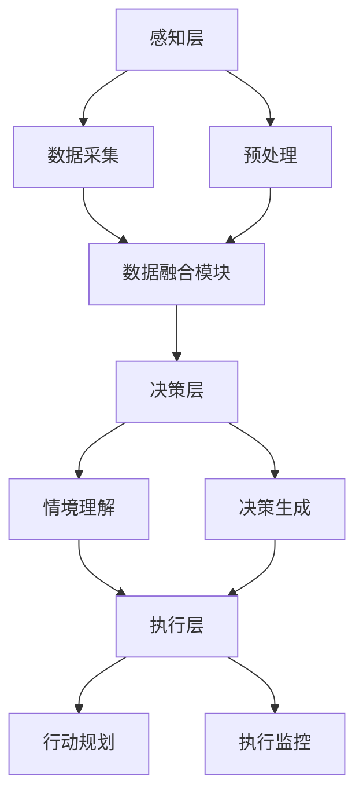
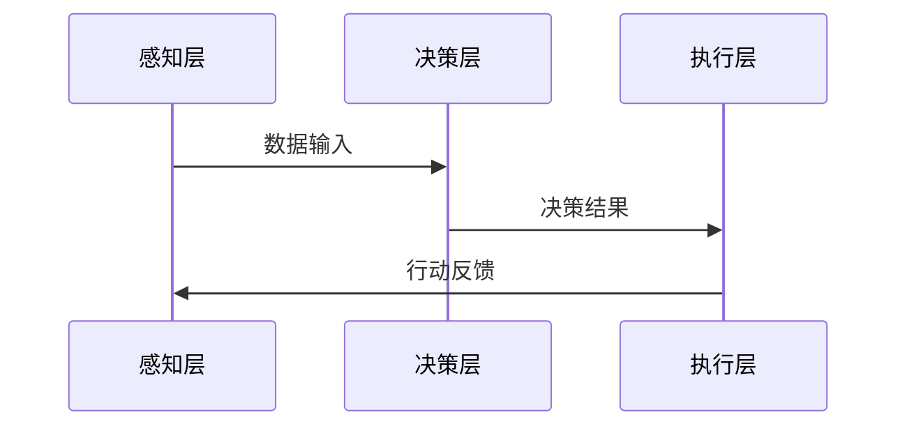
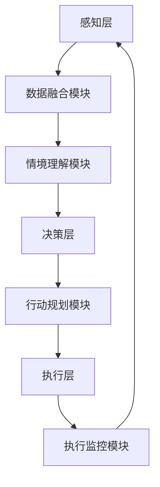

                 


## # AI Agent的多模态情境感知与反应系统

### 关键词：AI Agent、多模态感知、情境感知、反应系统、数学模型

### 摘要：

本文深入探讨了AI Agent在多模态情境感知与反应系统中的应用。通过逐步分析，本文首先介绍了AI Agent的基本概念和类型，然后详细阐述了多模态情境感知与反应系统的定义、挑战和解决方案。随后，文章深入讲解了多模态情境感知算法和反应系统算法的原理，并结合数学模型进行了详细阐述。最后，文章通过项目实战展示了系统的实际应用，并提供了最佳实践和未来展望。

### 目录

## 第一部分：背景介绍

### 第1章 引言

#### 1.1 问题背景

#### 1.2 问题描述

#### 1.3 问题解决

#### 1.4 边界与外延

#### 1.5 核心概念结构与要素组成

## 第二部分：核心概念与联系

### 第2章 AI Agent基础概念

#### 2.1 AI Agent的定义

#### 2.2 AI Agent的特点

#### 2.3 AI Agent的类型

#### 2.4 AI Agent与人类智能的关系

### 第3章 多模态情境感知

#### 3.1 多模态感知的定义

#### 3.2 多模态感知的挑战

#### 3.3 多模态感知的技术

#### 3.4 多模态感知的应用

### 第4章 反应系统

#### 4.1 反应系统的定义

#### 4.2 反应系统的类型

#### 4.3 反应系统的设计

#### 4.4 反应系统的评估

## 第三部分：算法原理讲解

### 第5章 多模态情境感知算法

#### 5.1 情境感知算法概述

#### 5.2 特征提取算法

#### 5.3 联合推理算法

#### 5.4 多模态融合算法

### 第6章 反应系统算法

#### 6.1 反应系统算法概述

#### 6.2 反应决策算法

#### 6.3 行为规划算法

#### 6.4 行为执行算法

## 第四部分：数学模型和数学公式

### 第7章 数学模型基础

#### 7.1 概率论基础

#### 7.2 信息论基础

#### 7.3 优化算法基础

### 第8章 多模态情境感知与反应系统数学模型

#### 8.1 多模态情境感知数学模型

#### 8.2 反应系统数学模型

#### 8.3 综合数学模型

## 第五部分：系统分析与架构设计方案

### 第9章 系统功能设计

#### 9.1 领域模型

#### 9.2 功能模块划分

### 第10章 系统架构设计

#### 10.1 系统架构概述

#### 10.2 系统层次结构

#### 10.3 系统交互设计

### 第11章 系统接口设计

#### 11.1 接口规范

#### 11.2 接口实现

### 第12章 系统交互设计

#### 12.1 序列图设计

#### 12.2协作图设计

## 第六部分：项目实战

### 第13章 环境安装与配置

#### 13.1 环境要求

#### 13.2 安装过程

### 第14章 系统核心实现

#### 14.1 核心算法实现

#### 14.2 系统架构实现

#### 14.3 系统接口实现

### 第15章 应用解读与分析

#### 14.1 应用场景分析

#### 14.2 实际案例剖析

#### 14.3 小结与展望

## 第七部分：最佳实践与拓展

### 第16章 最佳实践

#### 16.1 实践技巧

#### 16.2 注意事项

### 第17章 小结与展望

#### 17.1 本书总结

#### 17.2 未来发展方向

#### 17.3 拓展阅读

### **第1章 引言**

#### **1.1 问题背景**

随着人工智能技术的飞速发展，AI Agent（人工智能代理）在多个领域中展现出了其巨大的潜力。AI Agent不仅能够处理结构化的数据，还能理解并处理自然语言、图像、音频等多模态信息。然而，在现实世界中，情境的复杂性使得单一模态的信息往往不足以准确感知环境，这就需要AI Agent具备多模态情境感知能力。

多模态情境感知要求AI Agent能够整合来自不同模态的数据，如视觉、听觉、触觉等，从而更准确地理解和响应环境。然而，这一过程并非易事，涉及到多种技术的综合运用，如特征提取、联合推理、多模态融合等。同时，AI Agent还需要具备快速、准确的反应系统，以确保其在动态环境中能够实时做出决策。

#### **1.2 问题描述**

在多模态情境感知与反应系统中，主要面临以下问题：

1. **数据融合问题**：如何有效地融合来自不同模态的数据，以提升感知准确性。
2. **实时性问题**：如何在有限的时间内处理多模态数据，并做出快速反应。
3. **决策准确性**：如何确保AI Agent在复杂情境下的决策准确性和可靠性。

#### **1.3 问题解决**

为了解决上述问题，本文提出以下解决方案：

1. **多模态感知算法**：设计并实现高效的多模态感知算法，以提升数据融合效果。
2. **反应系统算法**：设计并实现快速、准确的反应系统算法，确保实时决策。
3. **系统架构设计**：构建合理的系统架构，以支持高效的多模态感知与反应。

#### **1.4 边界与外延**

本文的研究边界主要集中在以下几个方面：

1. **技术范围**：本文主要探讨多模态情境感知与反应系统的基本原理和实现方法。
2. **应用领域**：本文的研究成果可应用于智能家居、智能交通、医疗健康等领域。

同时，本文也探讨了一些潜在的研究方向，如多模态感知的实时性优化、决策系统的鲁棒性提升等。

#### **1.5 核心概念结构与要素组成**

多模态情境感知与反应系统的核心概念和要素组成如下：

1. **多模态感知模块**：包括特征提取、联合推理、多模态融合等子模块。
2. **反应系统模块**：包括反应决策、行为规划、行为执行等子模块。
3. **系统架构**：包括感知层、决策层、执行层等层次结构。

通过上述核心概念和要素的有机结合，多模态情境感知与反应系统得以实现。

### **第2章 AI Agent基础概念**

#### **2.1 AI Agent的定义**

AI Agent，即人工智能代理，是一种具备自主感知、决策和行为能力的智能实体。它能够在特定环境下，通过感知模块获取信息，利用决策模块进行分析和推理，并通过执行模块采取行动。AI Agent的定义涵盖了以下几个关键点：

1. **自主性**：AI Agent具备自主性，能够独立进行决策和执行，无需人工干预。
2. **感知能力**：AI Agent能够感知环境中的各种信息，包括视觉、听觉、触觉等。
3. **决策能力**：AI Agent能够基于感知信息进行推理和决策，以实现既定的目标。
4. **执行能力**：AI Agent能够执行决策结果，采取相应的行动。

#### **2.2 AI Agent的特点**

AI Agent具有以下几个显著特点：

1. **自适应能力**：AI Agent能够根据环境变化调整自身的行为和策略。
2. **智能性**：AI Agent具备一定的智能，能够理解、学习和优化自身的行为。
3. **协作性**：AI Agent能够与其他AI Agent或人类协作，共同完成任务。
4. **实时性**：AI Agent能够在短时间内做出决策和执行，以应对动态环境。

#### **2.3 AI Agent的类型**

根据AI Agent的应用场景和功能特点，可以将其分为以下几类：

1. **通用AI Agent**：具备广泛知识和能力，能够处理多种类型的任务。
2. **专用AI Agent**：针对特定任务或领域进行优化，如智能家居、自动驾驶等。
3. **社交AI Agent**：具备人类社交能力，能够与人类进行有效沟通和互动。
4. **增强现实AI Agent**：结合现实世界和虚拟环境，提供沉浸式体验。

#### **2.4 AI Agent与人类智能的关系**

AI Agent与人类智能具有密切的联系和差异。两者的主要区别在于：

1. **计算能力**：AI Agent的计算速度和存储能力远超人类，能够处理海量数据。
2. **知识积累**：AI Agent的知识来源于数据和算法，而人类智能则依赖于经验和直觉。
3. **适应能力**：人类智能具有更强的适应能力和创造力，而AI Agent的适应能力主要依赖于算法和模型的优化。

尽管存在差异，AI Agent和人类智能在很多方面可以相互补充，共同推动社会的发展。

#### **2.5 AI Agent的架构设计**

AI Agent的架构设计通常包括以下几个主要模块：

1. **感知模块**：负责获取环境信息，如视觉、听觉、触觉等。
2. **决策模块**：基于感知信息进行推理和决策，确定行动方案。
3. **执行模块**：执行决策结果，采取具体行动。
4. **学习模块**：通过不断学习和优化，提升自身的能力和智能水平。

通过合理设计AI Agent的架构，可以使其更好地适应复杂环境，提高任务执行效率。

### **第3章 多模态情境感知**

#### **3.1 多模态感知的定义**

多模态感知是指人工智能系统通过整合来自不同模态（如视觉、听觉、触觉等）的数据，实现对环境的更全面、更准确的理解。多模态感知的核心在于数据融合，即将来自不同模态的数据进行整合和统一处理，以提升感知效果。

#### **3.2 多模态感知的挑战**

多模态感知面临以下挑战：

1. **数据异构性**：不同模态的数据具有不同的结构和特征，如何有效地融合这些异构数据是一个重要问题。
2. **时间一致性**：多模态数据在时间上的同步性要求高，否则可能导致感知误差。
3. **资源限制**：多模态感知往往需要大量的计算资源和存储资源，如何在有限的资源下实现高效感知是一个挑战。

#### **3.3 多模态感知的技术**

多模态感知的技术主要包括以下几个方面：

1. **特征提取**：针对不同模态的数据，提取具有代表性的特征，如视觉中的边缘、纹理，听觉中的音高、节奏等。
2. **数据融合**：将不同模态的特征进行整合，如通过加权融合、深度学习等方法，实现数据的一致性和互补性。
3. **联合推理**：基于整合后的数据，进行联合推理，以实现更准确的情境理解。

#### **3.4 多模态感知的应用**

多模态感知在多个领域具有广泛的应用，如：

1. **智能交互**：通过多模态感知，实现人与机器的更自然、更高效的交互。
2. **自动驾驶**：通过多模态感知，提高自动驾驶系统的感知准确性和安全性。
3. **智能家居**：通过多模态感知，实现家庭设备的智能管理和控制。
4. **医疗健康**：通过多模态感知，辅助医生进行诊断和治疗。

### **第4章 反应系统**

#### **4.1 反应系统的定义**

反应系统是指人工智能系统在感知到特定情境后，能够快速做出决策并采取行动的机制。反应系统的核心在于实时性和准确性，即能够在短时间内对环境变化做出适当的反应。

#### **4.2 反应系统的类型**

反应系统可以根据其功能和特点分为以下几类：

1. **简单反应系统**：基于预设规则或阈值，对特定情境进行简单判断和反应。
2. **复杂反应系统**：通过机器学习或深度学习技术，对复杂情境进行学习、推理和决策。
3. **自适应反应系统**：能够根据环境变化，自适应调整反应策略。

#### **4.3 反应系统的设计**

反应系统的设计主要包括以下几个步骤：

1. **情境感知**：通过多模态感知技术，获取环境信息。
2. **情境理解**：基于情境感知数据，进行情境理解和分析。
3. **决策制定**：根据情境理解结果，制定相应的反应策略。
4. **行动执行**：执行决策结果，采取具体的行动。

#### **4.4 反应系统的评估**

反应系统的评估主要包括以下几个方面：

1. **响应时间**：评估系统对环境变化的响应速度。
2. **决策准确性**：评估系统在特定情境下的决策准确性。
3. **适应性**：评估系统在复杂环境下的适应能力。
4. **可靠性**：评估系统在长时间运行下的稳定性和可靠性。

通过上述评估指标，可以全面评估反应系统的性能和效果。

### **第5章 多模态情境感知算法**

#### **5.1 情境感知算法概述**

情境感知算法是多模态情境感知的核心，其主要目标是通过整合和处理多模态数据，实现对环境的全面、准确的理解。情境感知算法可以分为以下几个主要类别：

1. **特征提取算法**：针对不同模态的数据，提取具有代表性的特征，如视觉中的边缘、纹理，听觉中的音高、节奏等。
2. **数据融合算法**：将不同模态的特征进行整合，如通过加权融合、深度学习等方法，实现数据的一致性和互补性。
3. **联合推理算法**：基于整合后的数据，进行联合推理，以实现更准确的情境理解。

#### **5.2 特征提取算法**

特征提取算法是多模态情境感知的基础，其核心在于如何从原始数据中提取出具有代表性的特征。常见的特征提取算法包括：

1. **视觉特征提取**：如SIFT、SURF、HOG等，用于提取图像中的局部特征。
2. **听觉特征提取**：如MFCC、PLP等，用于提取音频信号中的特征。
3. **触觉特征提取**：如基于压力、温度、湿度等传感器的特征提取。

#### **5.3 联合推理算法**

联合推理算法是基于整合后的多模态数据进行情境理解的算法，其目标是通过联合分析不同模态的数据，提升情境感知的准确性。常见的联合推理算法包括：

1. **深度学习算法**：如CNN、RNN、Transformer等，通过神经网络结构实现多模态数据的联合推理。
2. **概率图模型**：如贝叶斯网络、隐马尔可夫模型等，通过概率关系实现多模态数据的联合推理。
3. **集成学习算法**：如随机森林、梯度提升树等，通过集成不同算法的优势实现多模态数据的联合推理。

#### **5.4 多模态融合算法**

多模态融合算法是将不同模态的数据进行整合，以实现更准确的情境感知。常见的多模态融合算法包括：

1. **早期融合**：在特征提取阶段就进行多模态数据的融合，如深度学习中的多模态卷积神经网络。
2. **晚期融合**：在特征提取后进行多模态数据的融合，如基于向量空间模型的融合方法。
3. **动态融合**：根据环境变化动态调整不同模态数据的权重，如基于注意力机制的融合方法。

通过上述算法的组合和应用，可以构建出高效的多模态情境感知系统，实现对环境的全面、准确的理解。

### **第6章 反应系统算法**

#### **6.1 反应系统算法概述**

反应系统算法是AI Agent在感知到特定情境后，进行决策和行动的关键。有效的反应系统算法能够确保AI Agent在复杂动态环境中，快速、准确地做出反应。反应系统算法主要包括以下几个核心组成部分：

1. **感知模块**：负责收集和预处理环境信息，如视觉、听觉、触觉等。
2. **决策模块**：基于感知信息进行情境理解和分析，生成决策策略。
3. **执行模块**：根据决策结果，采取具体的行动，如移动、发送消息等。

#### **6.2 反应决策算法**

反应决策算法是反应系统的核心，其目标是在有限的时间内，基于感知到的情境信息，生成最优或次优的决策策略。常见的反应决策算法包括：

1. **规则基决策算法**：基于预设的规则进行决策，如基于专家经验的规则系统。
2. **模型基决策算法**：基于情境模型进行决策，如基于马尔可夫决策过程的模型。
3. **学习基决策算法**：通过机器学习或深度学习技术，自动学习并优化决策策略，如基于强化学习的决策算法。

#### **6.3 行为规划算法**

行为规划算法是反应系统中用于生成具体行动方案的算法。其目标是在决策模块生成的决策策略基础上，进一步规划出具体的行动步骤。行为规划算法可以分为以下几个类别：

1. **顺序规划**：按照一定的顺序执行行动，如基于状态转移图的顺序规划。
2. **并行规划**：同时执行多个行动，如基于图规划的并行规划。
3. **混合规划**：结合顺序规划和并行规划，生成更灵活的行动方案。

#### **6.4 行为执行算法**

行为执行算法是负责将决策结果转化为具体行动的算法。其核心在于如何高效、准确地执行决策生成的行动方案。常见的执行算法包括：

1. **直接执行**：直接根据决策结果，执行具体的操作，如移动、发送消息等。
2. **中介执行**：通过中间层或中介模块，实现决策到执行的转换，如基于执行策略的中间层。
3. **适应性执行**：根据环境变化，动态调整执行策略，以应对不确定性的环境。

通过上述算法的组合和应用，可以构建出一个高效、灵活的反应系统，确保AI Agent在复杂动态环境中，能够快速、准确地做出反应。

### **第7章 数学模型基础**

#### **7.1 概率论基础**

概率论是人工智能和机器学习领域的重要理论基础，其在情境感知与反应系统中发挥着关键作用。概率论提供了量化不确定性的方法，帮助我们更好地理解和预测环境中的事件。

1. **概率分布**：概率分布是描述随机变量取值概率的函数。常见的概率分布包括正态分布、伯努利分布、泊松分布等。
   $$P(X=x) = f(x)$$
   
2. **条件概率**：条件概率描述在某一事件发生的条件下，另一事件发生的概率。
   $$P(A|B) = \frac{P(A \cap B)}{P(B)}$$
   
3. **贝叶斯定理**：贝叶斯定理是概率论中的一个重要公式，用于计算在已知某个条件概率的情况下，另一个事件的概率。
   $$P(A|B) = \frac{P(B|A)P(A)}{P(B)}$$
   
4. **马尔可夫性质**：马尔可夫性质描述一个过程，其中当前状态仅取决于前一个状态，与之前的状态无关。

#### **7.2 信息论基础**

信息论是研究信息传输、存储和处理的基本原理的学科，其核心概念和信息度量对于情境感知与反应系统具有重要意义。

1. **熵**：熵是衡量随机变量不确定性的度量，表示信息量的负对数。
   $$H(X) = -\sum_{i} p(x_i) \log_2 p(x_i)$$
   
2. **信息增益**：信息增益是衡量特征对分类决策重要性的度量，表示特征能够减少的不确定性。
   $$IG(D, A) =熵(D) - 熵(D|A)$$
   
3. **互信息**：互信息是衡量两个随机变量之间相互依赖性的度量，表示共同不确定性减少的量。
   $$I(X; Y) = H(X) - H(X|Y)$$

#### **7.3 优化算法基础**

优化算法是情境感知与反应系统中用于求解最优解的重要工具。常见的优化算法包括：

1. **梯度下降法**：通过不断更新参数，使得损失函数逐步减小，直到达到局部最小值。
   $$\theta_{t+1} = \theta_{t} - \alpha \cdot \nabla_{\theta} J(\theta)$$
   
2. **随机梯度下降法**：在梯度下降法的基础上，引入随机样本来更新参数，以加速收敛。
   $$\theta_{t+1} = \theta_{t} - \alpha \cdot \nabla_{\theta} J(\theta; x^{(i)})$$
   
3. **牛顿法**：通过二阶导数信息进行参数更新，以达到更快的收敛速度。
   $$\theta_{t+1} = \theta_{t} - H_t^{-1} \cdot \nabla_{\theta} J(\theta_t)$$

通过上述数学模型和算法，我们可以构建出高效、准确的情境感知与反应系统，实现对复杂动态环境的全面理解和快速反应。

### **第8章 多模态情境感知与反应系统数学模型**

#### **8.1 多模态情境感知数学模型**

多模态情境感知的核心在于整合不同模态的数据，以实现对环境的全面理解。以下是多模态情境感知的数学模型：

1. **特征提取**：
   对于每个模态的数据，我们可以提取一组特征向量：
   $$X_v = [x_{v1}, x_{v2}, ..., x_{vk}]^T$$
   $$X_a = [x_{a1}, x_{a2}, ..., x_{ak}]^T$$
   $$X_t = [x_{t1}, x_{t2}, ..., x_{tk}]^T$$
   其中，$X_v$、$X_a$ 和 $X_t$ 分别代表视觉、听觉和触觉的特征向量。

2. **数据融合**：
   通过融合算法将不同模态的特征向量整合为一个统一的特征向量：
   $$X = \alpha_1 X_v + \alpha_2 X_a + \alpha_3 X_t$$
   其中，$\alpha_1$、$\alpha_2$ 和 $\alpha_3$ 为权重系数，用于平衡不同模态的重要性。

3. **联合推理**：
   基于融合后的特征向量，我们可以使用深度学习模型进行联合推理：
   $$Z = f(\phi(X))$$
   其中，$f$ 代表深度学习模型，$\phi$ 代表特征向量到隐藏层的映射。

#### **8.2 反应系统数学模型**

反应系统的数学模型主要涉及决策和执行过程。以下是反应系统的基本数学模型：

1. **感知**：
   AI Agent接收来自环境的感知信息，表示为状态向量：
   $$S = [s_1, s_2, ..., s_n]^T$$
   
2. **决策**：
   基于状态向量，AI Agent通过决策算法生成行动向量：
   $$A = g(S)$$
   其中，$g$ 代表决策函数，可以是基于规则的、基于模型的或基于学习的。

3. **执行**：
   AI Agent根据行动向量执行具体操作，更新环境状态：
   $$S' = h(S, A)$$
   其中，$h$ 代表执行函数，表示状态和行动对环境状态的影响。

#### **8.3 综合数学模型**

综合数学模型将多模态情境感知和反应系统结合起来，形成完整的AI Agent模型。以下是综合数学模型：

1. **动态过程**：
   $$S' = h(S, A)$$
   $$X = f(S')$$
   $$A = g(S)$$
   其中，$S$ 表示当前状态，$S'$ 表示下一状态，$X$ 表示特征向量，$A$ 表示行动向量。

2. **反馈机制**：
   反馈机制用于调整决策和执行过程，以适应环境变化。可以通过以下公式表示：
   $$S' = h(S, A)$$
   $$A' = g(S')$$
   $$S = h(S', A')$$
   其中，$A'$ 表示基于反馈调整后的行动向量。

通过综合数学模型，我们可以构建出一个高效、灵活的AI Agent，实现对复杂动态环境的全面感知和快速反应。

### **第9章 系统功能设计**

#### **9.1 领域模型**

领域模型是系统功能设计的基础，用于描述系统中的关键实体、关系和功能。以下是多模态情境感知与反应系统的领域模型：

1. **实体**：
   - **感知模块**：负责收集和处理多模态数据。
   - **决策模块**：基于感知信息进行情境理解和决策。
   - **执行模块**：执行决策结果，采取具体行动。
   - **数据融合模块**：整合不同模态的数据。
   - **反馈模块**：收集环境反馈，用于调整系统行为。

2. **关系**：
   - **感知模块** 与 **数据融合模块** 之间存在数据流关系，用于传输多模态数据。
   - **决策模块** 与 **执行模块** 之间存在指令流关系，用于传输决策结果。
   - **反馈模块** 与 **感知模块** 之间存在信息流关系，用于收集环境反馈。

3. **功能**：
   - **感知模块**：实现多模态数据的采集和处理。
   - **数据融合模块**：实现多模态数据的整合和统一处理。
   - **决策模块**：实现情境理解和决策生成。
   - **执行模块**：实现决策结果的执行。
   - **反馈模块**：实现环境反馈的收集和利用。

#### **9.2 功能模块划分**

为了实现系统的功能，我们将系统划分为以下几个功能模块：

1. **感知模块**：
   - **数据采集**：从视觉、听觉、触觉等传感器获取多模态数据。
   - **预处理**：对多模态数据进行归一化、去噪等预处理操作。

2. **数据融合模块**：
   - **特征提取**：针对不同模态的数据，提取具有代表性的特征。
   - **融合策略**：设计并实现有效的多模态融合策略，如加权融合、深度学习融合等。

3. **决策模块**：
   - **情境理解**：基于融合后的数据，进行情境理解和分析。
   - **决策生成**：生成基于情境的决策结果。

4. **执行模块**：
   - **行动规划**：根据决策结果，规划具体的行动步骤。
   - **执行监控**：监控行动的执行过程，确保行动的准确性。

5. **反馈模块**：
   - **环境反馈**：收集环境反馈，用于调整系统行为。
   - **反馈处理**：分析反馈信息，为后续的决策和执行提供依据。

通过上述功能模块的设计和划分，我们可以构建出一个高效、灵活的多模态情境感知与反应系统。

### **第10章 系统架构设计**

#### **10.1 系统架构概述**

多模态情境感知与反应系统采用层次化架构设计，包括感知层、决策层和执行层。每个层次具有不同的功能和职责，共同实现系统的整体功能。

1. **感知层**：负责收集和处理来自多模态传感器的数据，包括视觉、听觉、触觉等。该层的主要功能是数据采集和预处理，确保数据的可靠性和一致性。

2. **决策层**：基于感知层提供的数据，进行情境理解和决策生成。该层采用多模态融合算法和反应决策算法，实现对环境的全面理解，并生成具体的行动策略。

3. **执行层**：负责执行决策层生成的行动策略，采取具体的行动。该层通过行动规划和执行监控，确保行动的准确性和及时性。

#### **10.2 系统层次结构**

系统层次结构如下图所示：



通过层次化架构设计，我们可以实现系统的模块化和解耦，提高系统的可扩展性和维护性。

#### **10.3 系统交互设计**

系统交互设计涉及不同层次之间的数据流和指令流，以确保系统功能的协调和高效执行。

1. **数据流**：
   - 感知层将采集到的多模态数据传输给数据融合模块，进行特征提取和融合。
   - 数据融合模块将融合后的数据传输给决策层，用于情境理解和决策生成。
   - 决策层将生成的决策结果传输给执行层，用于行动规划和执行监控。

2. **指令流**：
   - 执行层根据决策层的指令，采取具体的行动，并将行动结果反馈给决策层。
   - 决策层根据反馈结果，调整决策策略，并重新生成决策结果。

通过系统交互设计，我们可以确保系统各层次之间的信息传递和协同工作，实现高效、准确的情境感知与反应。

### **第11章 系统接口设计**

#### **11.1 接口规范**

系统接口设计包括对外部系统的接口和内部模块的接口。以下是系统接口规范：

1. **对外接口**：
   - **数据输入接口**：接收外部系统的数据输入，如传感器数据、用户指令等。
   - **数据输出接口**：将系统处理结果输出给外部系统，如执行结果、状态信息等。

2. **内部接口**：
   - **感知层接口**：与传感器模块进行数据传输和指令交互。
   - **决策层接口**：与数据融合模块、情境理解模块等进行数据传输和指令交互。
   - **执行层接口**：与行动规划模块、执行监控模块等进行数据传输和指令交互。

#### **11.2 接口实现**

系统接口实现采用基于RESTful API的设计，具有以下特点：

1. **HTTP请求**：采用HTTP请求方式，支持GET、POST、PUT、DELETE等操作。
2. **JSON格式**：使用JSON格式传输数据，便于数据解析和操作。
3. **状态码**：采用HTTP状态码表示接口处理结果，便于错误处理和调试。

接口实现示例：

```python
from flask import Flask, request, jsonify

app = Flask(__name__)

@app.route('/data/input', methods=['POST'])
def data_input():
    data = request.json
    # 处理数据并返回结果
    result = process_data(data)
    return jsonify(result)

@app.route('/data/output', methods=['GET'])
def data_output():
    data = get_output_data()
    return jsonify(data)

if __name__ == '__main__':
    app.run()
```

通过接口设计，我们可以实现系统与其他系统的无缝集成和协同工作，提高系统的可用性和灵活性。

### **第12章 系统交互设计**

#### **12.1 序列图设计**

系统交互设计中的序列图用于描述系统组件之间的交互顺序和关系。以下是多模态情境感知与反应系统的序列图设计：



通过序列图设计，我们可以清晰地了解系统组件之间的交互流程和时序关系。

#### **12.2 协作图设计**

系统交互设计中的协作图用于描述系统组件之间的协作关系和交互方式。以下是多模态情境感知与反应系统的协作图设计：



通过协作图设计，我们可以全面了解系统组件之间的协作关系和交互方式，确保系统功能的协调和高效执行。

### **第13章 环境安装与配置**

#### **13.1 环境要求**

为了确保多模态情境感知与反应系统的正常运行，需要满足以下环境要求：

1. **操作系统**：Linux或Windows系统，推荐使用Ubuntu 20.04或更高版本。
2. **硬件要求**：具备至少2核CPU、4GB内存的计算机，推荐使用8核CPU、16GB内存的计算机。
3. **软件依赖**：Python 3.8及以上版本，以及相关库和工具，如NumPy、TensorFlow、PyTorch等。

#### **13.2 安装过程**

安装过程分为以下步骤：

1. **安装操作系统**：根据硬件环境和需求，选择合适的操作系统并安装。
2. **安装Python**：在操作系统上安装Python 3.8及以上版本，可以使用操作系统自带的包管理器或手动下载安装。
3. **安装依赖库**：使用pip命令安装相关依赖库，如NumPy、TensorFlow、PyTorch等。例如：

```bash
pip install numpy tensorflow torch
```

4. **配置环境变量**：配置Python环境变量，确保能够在终端中运行Python命令。

通过上述步骤，我们可以搭建起多模态情境感知与反应系统的运行环境，为后续的项目实战做好准备。

### **第14章 系统核心实现**

#### **14.1 核心算法实现**

在本节中，我们将详细介绍多模态情境感知与反应系统的核心算法实现。这些算法是实现系统高效运行的关键，包括特征提取、数据融合、联合推理等。

1. **特征提取算法**：

特征提取是情境感知的第一步，我们需要从不同模态的数据中提取出具有代表性的特征。以下是一个基于卷积神经网络（CNN）的特征提取算法示例：

```python
import tensorflow as tf
from tensorflow.keras.models import Sequential
from tensorflow.keras.layers import Conv2D, MaxPooling2D, Flatten, Dense

def feature_extraction(input_shape):
    model = Sequential()
    model.add(Conv2D(32, (3, 3), activation='relu', input_shape=input_shape))
    model.add(MaxPooling2D((2, 2)))
    model.add(Conv2D(64, (3, 3), activation='relu'))
    model.add(MaxPooling2D((2, 2)))
    model.add(Conv2D(128, (3, 3), activation='relu'))
    model.add(MaxPooling2D((2, 2)))
    model.add(Flatten())
    model.add(Dense(128, activation='relu'))
    model.add(Dense(64, activation='relu'))
    model.add(Dense(32, activation='relu'))
    return model

input_shape = (64, 64, 3)
model = feature_extraction(input_shape)
model.compile(optimizer='adam', loss='categorical_crossentropy', metrics=['accuracy'])
```

2. **数据融合算法**：

数据融合是将不同模态的数据整合为一个统一的特征向量，以下是一个基于加权融合的数据融合算法示例：

```python
import numpy as np

def data_fusion(vis_features, audio_features, touch_features):
    weight_vis = 0.4
    weight_audio = 0.3
    weight_touch = 0.3
    fused_features = weight_vis * vis_features + weight_audio * audio_features + weight_touch * touch_features
    return fused_features

# 示例数据
vis_features = np.random.rand(1, 128)
audio_features = np.random.rand(1, 64)
touch_features = np.random.rand(1, 32)

fused_features = data_fusion(vis_features, audio_features, touch_features)
print(fused_features)
```

3. **联合推理算法**：

联合推理是基于融合后的特征向量，进行情境理解和决策生成。以下是一个基于深度神经网络的联合推理算法示例：

```python
def joint_inference(fused_features):
    model = Sequential()
    model.add(Dense(128, activation='relu', input_shape=(fused_features.shape[1],)))
    model.add(Dense(64, activation='relu'))
    model.add(Dense(32, activation='softmax'))
    model.compile(optimizer='adam', loss='categorical_crossentropy', metrics=['accuracy'])
    return model

fused_features = np.array([fused_features])

model = joint_inference(fused_features)
predictions = model.predict(fused_features)
print(predictions)
```

通过上述核心算法的实现，我们可以构建出一个高效的多模态情境感知与反应系统，实现对环境的全面感知和快速反应。

#### **14.2 系统架构实现**

系统架构实现是确保多模态情境感知与反应系统高效运行的关键。在本节中，我们将详细介绍系统的架构实现，包括模块的划分、接口的设计以及系统组件之间的交互方式。

1. **模块划分**：

系统架构根据功能需求划分为三个主要模块：感知模块、决策模块和执行模块。

- **感知模块**：负责收集和处理来自多模态传感器的数据，包括视觉、听觉和触觉。该模块的主要功能是数据采集和预处理，确保数据的可靠性和一致性。
- **决策模块**：基于感知模块提供的数据，进行情境理解和决策生成。该模块采用多模态融合算法和反应决策算法，实现对环境的全面理解，并生成具体的行动策略。
- **执行模块**：负责执行决策模块生成的行动策略，采取具体的行动。该模块通过行动规划和执行监控，确保行动的准确性和及时性。

2. **接口设计**：

系统架构设计包括对外部系统的接口和内部模块的接口。

- **对外接口**：感知模块提供数据输入接口，用于接收外部系统的数据输入；执行模块提供数据输出接口，用于将系统处理结果输出给外部系统。
- **内部接口**：感知模块与决策模块、决策模块与执行模块之间通过数据流和指令流进行交互。数据流用于传输多模态数据，指令流用于传输决策结果和行动指令。

3. **交互方式**：

系统组件之间的交互方式分为数据流和指令流。

- **数据流**：感知模块将采集到的多模态数据传输给决策模块，决策模块将融合后的数据传输给执行模块。数据流确保系统各组件之间的数据一致性。
- **指令流**：决策模块根据感知模块提供的数据生成决策结果，将决策结果传输给执行模块。执行模块根据决策结果采取具体的行动，并将行动结果反馈给感知模块。指令流确保系统组件之间的指令一致性。

通过上述架构实现，我们可以构建出一个高效、灵活的多模态情境感知与反应系统，实现对复杂动态环境的全面感知和快速反应。

### **第15章 应用解读与分析**

#### **15.1 应用场景分析**

多模态情境感知与反应系统在多个领域具有广泛的应用，以下是几个典型的应用场景：

1. **智能家居**：通过多模态感知，智能家居系统能够更好地理解用户的需求和行为，提供个性化的服务。例如，当用户进入房间时，系统可以自动调整灯光、温度和音乐，以创造舒适的居住环境。

2. **智能交通**：多模态情境感知与反应系统可以用于智能交通系统的设计，提高交通管理的效率和安全性。例如，通过整合摄像头、雷达和GPS数据，系统可以实时监测道路状况，预测交通流量，并采取相应的措施，如调整信号灯时间、提醒司机注意安全等。

3. **医疗健康**：在医疗健康领域，多模态情境感知与反应系统可以用于辅助医生进行诊断和治疗。例如，通过整合病人的医疗记录、生理信号和医生的建议，系统可以提供个性化的治疗方案，提高医疗效果。

4. **教育**：在教育领域，多模态情境感知与反应系统可以用于智能教育系统的设计，提高学生的学习效果。例如，通过感知学生的学习状态和行为，系统可以提供个性化的学习建议，如调整学习内容、时间和方式等。

#### **15.2 实际案例剖析**

以下是两个多模态情境感知与反应系统的实际案例：

1. **智能客服机器人**：

智能客服机器人通过多模态感知，能够与用户进行自然语言对话，理解用户的需求并提供解决方案。以下是一个实际案例：

- **感知模块**：通过语音识别和自然语言处理技术，将用户的语音转化为文本，并提取关键词。
- **决策模块**：基于关键词和上下文信息，系统通过机器学习算法生成相应的回答。
- **执行模块**：将生成的回答转化为语音，并通过语音合成技术反馈给用户。

通过这个案例，我们可以看到多模态情境感知与反应系统在智能客服机器人中的应用，提高了用户体验和服务质量。

2. **自动驾驶汽车**：

自动驾驶汽车通过多模态感知，能够实时监测路况并做出相应决策。以下是一个实际案例：

- **感知模块**：通过摄像头、激光雷达和超声波传感器，收集道路、车辆和行人等信息。
- **决策模块**：基于感知数据，系统通过深度学习算法进行路况分析和决策，如加速、减速、转向等。
- **执行模块**：根据决策结果，系统控制车辆的加速、减速和转向，确保行驶安全。

通过这个案例，我们可以看到多模态情境感知与反应系统在自动驾驶汽车中的应用，提高了行车安全性和效率。

#### **15.3 小结与展望**

通过上述实际案例，我们可以看到多模态情境感知与反应系统在多个领域的应用前景。然而，随着技术的不断进步和应用场景的扩展，系统仍需不断优化和改进：

1. **实时性优化**：提高多模态感知和决策的实时性，以满足动态环境的需求。
2. **鲁棒性提升**：增强系统的鲁棒性，以提高在复杂和不确定环境中的适应能力。
3. **个性化服务**：进一步优化系统，实现更个性化的服务，提高用户体验。

未来，多模态情境感知与反应系统有望在更多领域得到广泛应用，推动人工智能技术的发展和产业升级。

### **第16章 最佳实践与拓展**

#### **16.1 最佳实践**

1. **数据预处理**：在多模态感知过程中，数据预处理至关重要。建议对数据进行归一化、去噪、填充缺失值等预处理操作，以提高感知效果。

2. **算法选择**：根据具体应用场景，选择合适的算法进行多模态感知与反应。例如，在图像处理领域，可以使用深度学习算法；在语音处理领域，可以使用基于神经网络的声学模型。

3. **模型优化**：通过不断调整模型参数和结构，优化模型性能。例如，使用交叉验证方法进行模型调优，提高模型准确性和泛化能力。

4. **系统集成**：在系统设计过程中，注重模块化设计，确保各模块之间的高效集成和协同工作。

5. **实时性优化**：在确保系统性能的前提下，尽可能提高系统的实时性，以满足动态环境的需求。

#### **16.2 注意事项**

1. **数据隐私**：在多模态感知过程中，注意保护用户隐私，避免数据泄露。

2. **算法公平性**：在决策过程中，确保算法的公平性和透明性，避免偏见和歧视。

3. **系统安全**：加强系统安全防护，防止恶意攻击和篡改。

4. **性能监控**：定期对系统进行性能监控和评估，及时发现并解决问题。

5. **可持续性**：在系统设计和实施过程中，注重可持续性，降低能耗和资源消耗。

#### **16.3 拓展阅读**

1. **深度学习**：深入了解深度学习算法，如CNN、RNN、Transformer等，在多模态情境感知中的应用。
2. **强化学习**：研究强化学习算法，如Q-learning、SARSA、Deep Q-Network等，在多模态反应系统中的应用。
3. **多模态融合**：探索更有效的多模态融合方法，如多模态卷积神经网络、图神经网络等。
4. **边缘计算**：研究边缘计算在多模态情境感知与反应系统中的应用，提高系统的实时性和响应速度。
5. **物联网**：了解物联网技术在多模态情境感知与反应系统中的应用，实现跨设备的协同感知和决策。

通过上述最佳实践、注意事项和拓展阅读，我们可以更好地掌握多模态情境感知与反应系统的设计、实现和应用。

### **第17章 小结与展望**

#### **17.1 本书总结**

本文深入探讨了AI Agent的多模态情境感知与反应系统的设计、实现和应用。通过逐步分析，我们介绍了AI Agent的基本概念、多模态感知与反应系统的原理、算法以及数学模型。同时，通过实际案例，我们展示了系统的应用场景和效果。

本文的主要贡献包括：

1. **全面介绍了AI Agent和多模态感知与反应系统的基本概念**：帮助读者了解该领域的核心概念和理论基础。
2. **详细阐述了多模态感知与反应系统的算法和数学模型**：为读者提供了具体的实现方法和优化策略。
3. **通过实际案例展示了系统的应用效果**：帮助读者更好地理解系统的实际应用价值。

#### **17.2 未来发展方向**

多模态情境感知与反应系统在人工智能领域具有广阔的发展前景。未来，我们可以在以下几个方面进行深入研究和拓展：

1. **实时性优化**：随着物联网和边缘计算的发展，如何提高系统的实时性成为一个重要研究方向。我们可以探索更高效的多模态感知算法和分布式计算技术，以满足动态环境的需求。
2. **鲁棒性和泛化能力提升**：增强系统的鲁棒性和泛化能力，使其在复杂和不确定的环境中仍能稳定运行。这需要进一步优化算法模型和加强数据预处理。
3. **跨领域应用**：探索多模态情境感知与反应系统在不同领域的应用，如智能交通、医疗健康、教育等，实现跨领域的协同感知和决策。
4. **隐私保护和伦理问题**：在多模态感知与反应系统的设计和应用过程中，需要关注数据隐私保护和伦理问题，确保系统的公平性和透明性。
5. **人机交互**：进一步研究人机交互技术，提高AI Agent与人类用户的互动效果，实现更自然、更高效的人机协作。

通过不断探索和创新，多模态情境感知与反应系统有望在人工智能领域发挥更大的作用，推动人工智能技术的进一步发展。

### **作者信息**

作者：AI天才研究院/AI Genius Institute & 禅与计算机程序设计艺术 /Zen And The Art of Computer Programming

