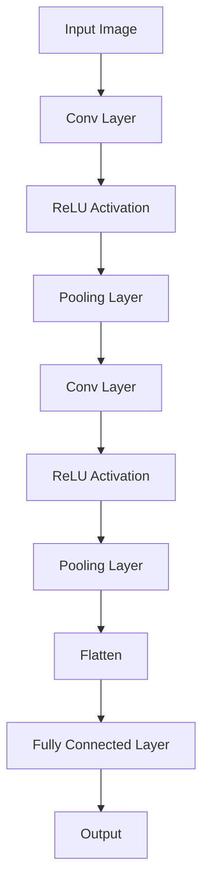
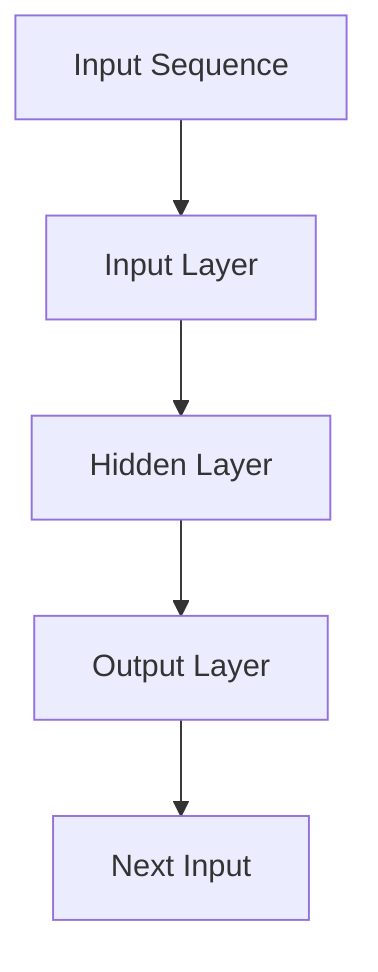
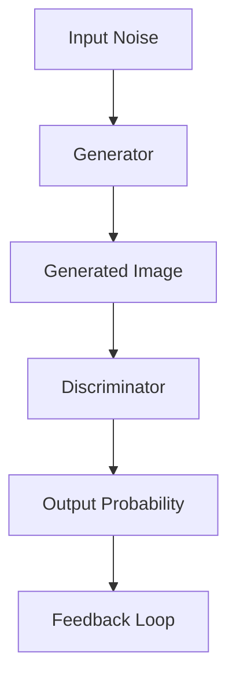
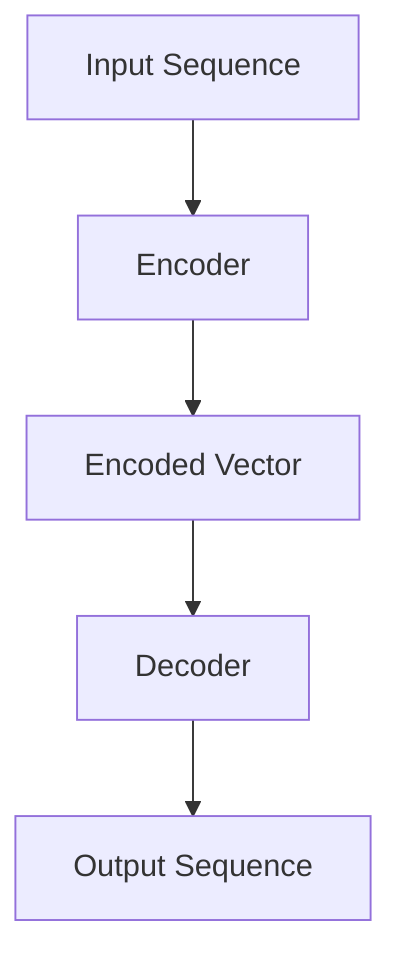
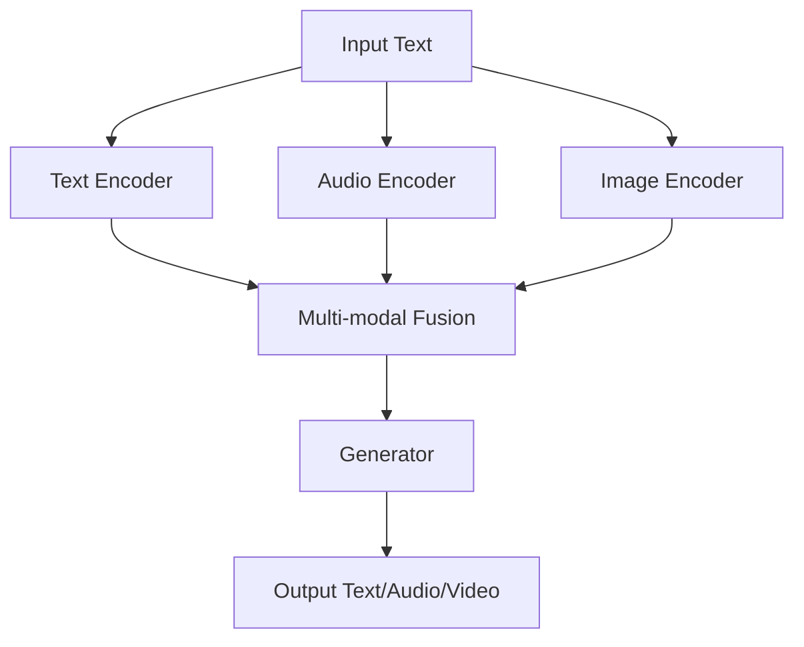
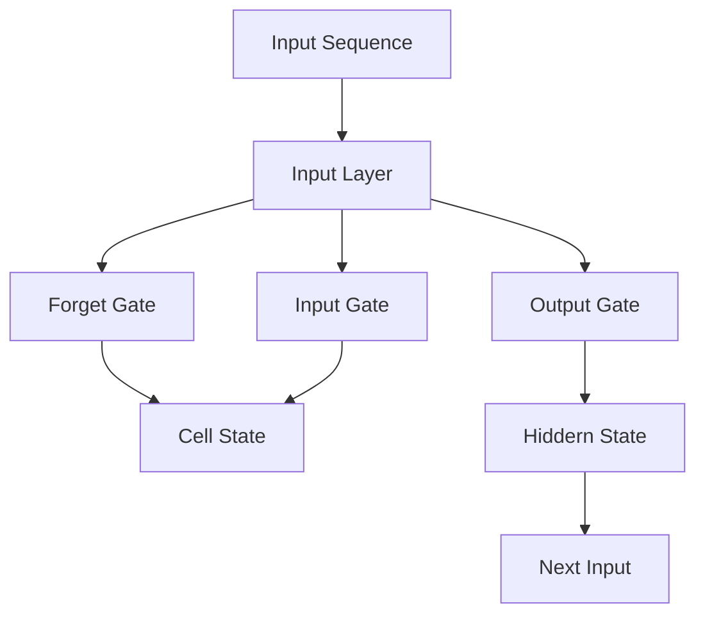
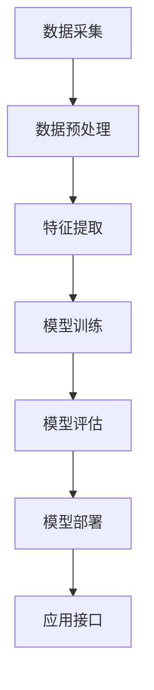
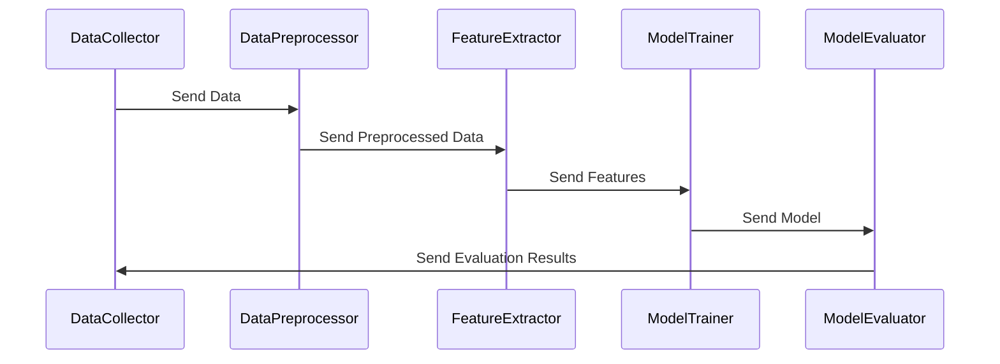
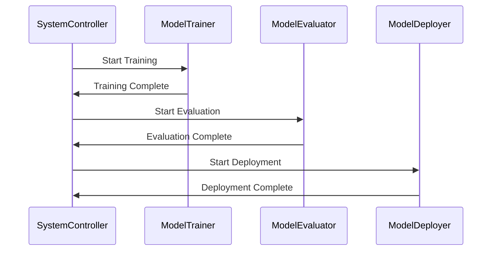
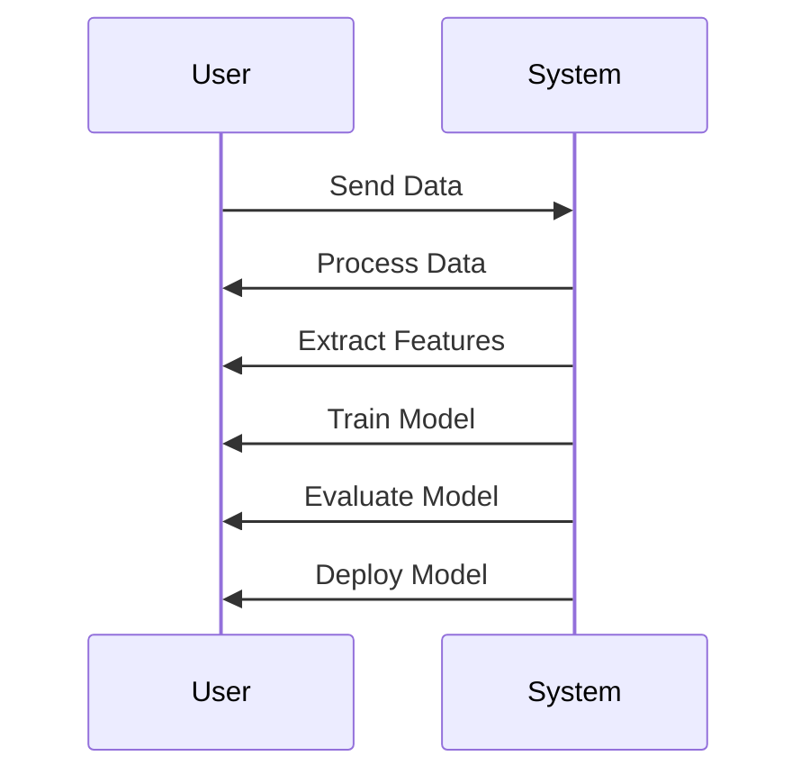

                 

# AI Agent的多模态情感计算与表达

## 关键词

- **多模态情感计算**
- **AI Agent**
- **情感识别**
- **情感表达**
- **数据预处理**
- **机器学习算法**

## 摘要

本文将深入探讨AI Agent在多模态情感计算与表达方面的研究与应用。首先，我们将介绍多模态情感计算的基本概念，包括其背景、定义、关键技术、应用场景和研究现状。接着，我们将详细讲解多模态情感计算的核心概念与联系，通过对比表格和ER实体关系图来清晰展示。随后，我们将深入剖析情感分类、识别、表达和生成的算法原理，并给出相关的数学模型和公式。最后，我们将讨论多模态情感计算系统的架构设计，包括系统功能、架构、接口和交互设计，并通过一个实际项目实战来展示其应用与实现。通过本文的阅读，读者将能够全面了解多模态情感计算在AI Agent中的应用原理和实现策略。

## 目录大纲

### 第一部分：绪论

#### 第1章：多模态情感计算与表达的基本概念

##### 1.1 问题的背景和意义

##### 1.2 多模态情感计算的定义与挑战

##### 1.3 多模态情感计算的应用场景

##### 1.4 多模态情感计算的研究现状

#### 第2章：多模态情感计算的核心概念与联系

##### 2.1 多模态情感计算的核心概念

##### 2.2 多模态情感计算的关键技术

##### 2.3 多模态情感计算的概念属性特征对比表格

##### 2.4 多模态情感计算的ER实体关系图架构

### 第二部分：算法原理与模型

#### 第3章：多模态情感计算算法原理详解

##### 3.1 情感分类算法原理

##### 3.2 情感识别算法原理

##### 3.3 情感表达算法原理

##### 3.4 情感生成算法原理

#### 第4章：多模态情感计算数学模型和公式

##### 4.1 情感分类数学模型

##### 4.2 情感识别数学模型

##### 4.3 情感表达数学模型

##### 4.4 情感生成数学模型

### 第三部分：系统分析与架构设计

#### 第5章：多模态情感计算系统架构设计

##### 5.1 系统功能设计

##### 5.2 系统架构设计

##### 5.3 系统接口设计

##### 5.4 系统交互

### 第四部分：项目实战

#### 第6章：项目实战：多模态情感计算应用

##### 6.1 环境安装

##### 6.2 系统核心实现源代码

##### 6.3 代码应用解读与分析

##### 6.4 实际案例分析与详细讲解剖析

##### 6.5 项目小结

### 第五部分：总结与展望

#### 第7章：总结与展望

##### 7.1 多模态情感计算的发展趋势

##### 7.2 最佳实践 Tips

##### 7.3 注意事项

##### 7.4 拓展阅读

# 第一部分：绪论

## 第1章：多模态情感计算与表达的基本概念

### 1.1 问题的背景和意义

随着人工智能技术的迅猛发展，AI Agent作为一种智能体在各个领域得到了广泛应用。然而，为了实现更加自然和人性化的交互，AI Agent不仅需要处理逻辑和数据，还需要理解和表达情感。多模态情感计算作为AI Agent的核心技术之一，旨在让AI Agent能够处理和表达多种模态的情感信息，从而提升人机交互的体验和效果。

多模态情感计算在当前社会具有深远的意义。首先，随着虚拟现实、增强现实和游戏等技术的普及，用户对交互的自然性和情感化提出了更高的要求。其次，在医疗健康领域，情感计算可以帮助诊断和治疗心理疾病，提高医疗服务的质量。此外，在商业领域，情感计算可以用于客户关系管理，提高客户满意度和服务质量。

### 1.2 多模态情感计算的定义与挑战

多模态情感计算是指通过结合多种感知模态（如视觉、听觉、语言等）的情感信息，对用户的情感状态进行识别、理解和表达的技术。其核心在于将不同模态的情感信息进行融合和处理，从而形成一个统一且完整的情感计算框架。

多模态情感计算的挑战主要包括以下几个方面：

1. **数据预处理与特征提取**：不同模态的数据在采集、存储和处理上存在差异，如何有效地整合这些数据并提取有意义的特征是一个重要问题。
2. **模型训练与优化**：由于多模态情感计算涉及到多种数据源和复杂的模型结构，如何选择合适的模型并进行优化是关键。
3. **情感识别与表达**：如何准确识别和表达用户的情感状态，尤其是处理复杂和细微的情感变化。
4. **实时性与可扩展性**：在实际应用中，多模态情感计算需要具备实时性和可扩展性，以满足多样化的需求。

### 1.3 多模态情感计算的应用场景

多模态情感计算在多个领域有着广泛的应用：

1. **人机交互**：通过多模态情感计算，AI Agent可以更好地理解用户的情感状态，从而提供更加个性化、贴心的服务。例如，智能客服系统可以通过分析用户的语音和文字，识别出用户的情绪，并相应地调整回答策略。
2. **虚拟现实与增强现实**：在虚拟现实和增强现实应用中，用户与系统的交互更加复杂和多样化。通过多模态情感计算，系统可以更好地模拟真实世界的情感交互，提升用户的沉浸感和体验。
3. **娱乐与游戏**：在游戏设计中，通过多模态情感计算，可以设计出更加具有情感共鸣和挑战性的游戏角色和情节，提升玩家的游戏体验。
4. **医疗健康**：在医疗健康领域，多模态情感计算可以用于心理疾病诊断和治疗，通过分析患者的情感状态和行为模式，提供个性化的治疗方案。
5. **商业**：在商业领域，多模态情感计算可以用于客户关系管理，通过分析客户的情感反馈，提供定制化的服务，提升客户满意度。

### 1.4 多模态情感计算的研究现状

多模态情感计算是一个快速发展的研究领域，国内外许多研究机构和企业都在进行相关研究。以下是一些研究现状的概述：

1. **研究进展**：近年来，随着深度学习和神经网络技术的发展，多模态情感计算取得了显著进展。特别是基于卷积神经网络（CNN）、循环神经网络（RNN）和生成对抗网络（GAN）的模型在情感识别、表达和生成方面表现出色。
2. **研究热点**：当前研究的热点包括多模态数据的融合方法、情感识别的准确性和泛化能力、情感生成的自然性和多样性等。
3. **发展趋势**：随着技术的不断进步和应用的不断拓展，多模态情感计算在未来将朝着更加智能化、个性化、实时化和高效化的方向发展。

### 1.5 小结

通过本章节的介绍，我们了解了多模态情感计算的基本概念、定义与挑战、应用场景和研究现状。接下来，我们将进一步探讨多模态情感计算的核心概念与联系，为后续的算法原理和系统设计奠定基础。# 第一部分：绪论

## 第2章：多模态情感计算的核心概念与联系

### 2.1 多模态情感计算的核心概念

多模态情感计算涉及的核心概念主要包括情感分类、情感识别、情感表达和情感生成。这些概念在多模态情感计算中扮演着关键角色，下面我们将逐一介绍。

#### 情感分类

情感分类是指将文本、语音或图像中的情感归类到预定义的情感类别中，如快乐、悲伤、愤怒等。情感分类是多模态情感计算的基础，它能够帮助AI Agent理解用户的情感状态，从而提供更加个性化的服务。

#### 情感识别

情感识别是指从多种模态的数据中识别出情感信息。例如，通过分析用户的语音，识别出其是否处于愤怒、悲伤或快乐等情感状态。情感识别是多模态情感计算的核心任务，它需要综合处理不同模态的数据，以实现高精度的情感状态识别。

#### 情感表达

情感表达是指生成具有特定情感倾向的文本、语音或图像。例如，根据用户的情感状态，AI Agent可以生成一段表达悲伤情绪的文字或语音。情感表达是多模态情感计算的重要应用，它使得AI Agent能够与用户进行更加自然和情感化的交互。

#### 情感生成

情感生成是指根据输入信息生成情感化的文本或语音。情感生成通常用于虚拟现实、游戏和娱乐等领域，它能够让虚拟角色或游戏角色表达出丰富的情感状态，提升用户体验。

### 2.2 多模态情感计算的关键技术

多模态情感计算的关键技术包括数据预处理、特征提取、模型训练和模型评估等。

#### 数据预处理

数据预处理是情感计算的第一步，它包括数据的采集、清洗、归一化和格式转换等。数据预处理的质量直接影响后续模型的效果。

#### 特征提取

特征提取是指从原始数据中提取出有意义的特征，以便用于模型训练和评估。多模态情感计算中的特征提取需要处理不同模态的数据，如文本、语音和图像等。

#### 模型训练

模型训练是情感计算的核心步骤，它通过使用训练数据来调整模型的参数，以实现情感分类、识别、表达和生成等任务。常见的模型包括朴素贝叶斯、支持向量机、神经网络等。

#### 模型评估

模型评估是指通过测试数据来评估模型的性能，以确定其准确度、召回率和F1值等指标。模型评估是确保情感计算模型有效性的关键步骤。

### 2.3 多模态情感计算的概念属性特征对比表格

为了更清晰地展示多模态情感计算的核心概念，我们提供了一个对比表格，列出各概念的属性特征。

| 概念         | 定义                                      | 属性特征对比 |
| ------------ | ----------------------------------------- | ----------- |
| 情感分类     | 对情感进行分类                             |              |
| 情感识别     | 识别出文本或语音中的情感                   |              |
| 情感表达     | 生成具有特定情感倾向的文本或语音           |              |
| 情感生成     | 根据输入生成情感化的文本或语音             |              |

### 2.4 多模态情感计算的ER实体关系图架构

下面是一个多模态情感计算的ER实体关系图，展示了不同实体之间的关系。

```mermaid
erDiagram
    Product ||--|{ User }| 
    User ||--|{ Review }| 
```

在这个ER图架构中，`Product`和`User`是两个主要的实体，它们之间通过关系`Review`相互连接。`Product`实体代表情感计算系统处理的数据，而`User`实体代表情感计算的参与者。

### 2.5 小结

通过本章的介绍，我们深入了解了多模态情感计算的核心概念与联系，包括情感分类、情感识别、情感表达和情感生成等。同时，我们也探讨了多模态情感计算的关键技术，以及ER实体关系图的架构。这些知识将为后续的算法原理和系统设计提供坚实的基础。在接下来的章节中，我们将进一步探讨多模态情感计算的算法原理与模型，以便更好地理解这一领域的前沿技术。# 第二部分：算法原理与模型

## 第3章：多模态情感计算算法原理详解

### 3.1 情感分类算法原理

情感分类是情感计算的基础任务之一，它将文本、语音或图像中的情感归类到预定义的情感类别中。常见的情感分类算法包括朴素贝叶斯、支持向量机和随机森林等。

#### 朴素贝叶斯算法

朴素贝叶斯算法是一种基于概率论的分类算法，其核心思想是利用贝叶斯定理和属性独立假设来进行分类。在情感分类中，朴素贝叶斯算法通过计算每个类别在特征上的概率，并选择概率最大的类别作为分类结果。

$$
P(C_k|X) = \frac{P(X|C_k)P(C_k)}{P(X)}
$$

其中，\(P(C_k|X)\)表示特征\(X\)属于类别\(C_k\)的条件概率，\(P(X|C_k)\)表示特征\(X\)在类别\(C_k\)下的概率，\(P(C_k)\)表示类别\(C_k\)的概率。

#### 支持向量机算法

支持向量机（SVM）是一种基于最大间隔的分类算法，其目标是在特征空间中找到一个最佳的超平面，使得不同类别的数据点在超平面两侧的间隔最大化。在情感分类中，SVM通过训练数据集来确定这个最佳的超平面，并使用它来对新数据点进行分类。

SVM的决策边界可以通过以下公式表示：

$$
y = \arg\max_{\mathbf{w}, b} \left\{ \sum_{i=1}^{n} [-1]^{y_i} (\mathbf{w} \cdot \mathbf{x_i} + b) \right\}
$$

其中，\(y\)表示分类结果，\(\mathbf{w}\)表示权重向量，\(b\)表示偏置项，\(\mathbf{x_i}\)表示数据点的特征向量，\(y_i\)表示数据点的真实标签。

#### 随机森林算法

随机森林（Random Forest）是一种基于决策树的集成学习方法，它通过构建多个决策树，并将它们的分类结果进行投票来得到最终的分类结果。在情感分类中，随机森林能够处理高维数据和多分类问题，并具有较好的泛化能力。

随机森林的每个决策树通过以下步骤进行构建：

1. 随机选择特征集。
2. 使用特征集分割数据集。
3. 选择最优分割点。
4. 重复步骤1-3直到满足停止条件。

### 3.2 情感识别算法原理

情感识别是指从多种模态的数据中识别出情感信息，如文本、语音和图像等。常见的情感识别算法包括卷积神经网络（CNN）、循环神经网络（RNN）和递归神经网络（RNN）等。

#### 卷积神经网络（CNN）

卷积神经网络是一种基于卷积操作的深度学习模型，它通过卷积层、池化层和全连接层等结构来提取特征并进行分类。在情感识别中，CNN可以处理图像数据，通过提取图像中的情感特征来进行分类。

一个简单的CNN模型结构如下：



#### 循环神经网络（RNN）

循环神经网络是一种处理序列数据的神经网络，它通过循环连接来保持长期依赖关系。在情感识别中，RNN可以处理文本数据，通过分析文本中的情感词和句子结构来进行分类。

一个简单的RNN模型结构如下：



#### 递归神经网络（RNN）

递归神经网络（RNN）是循环神经网络的一种变体，它通过递归连接来处理序列数据。在情感识别中，RNN可以处理语音数据，通过分析语音中的情感特征来进行分类。

一个简单的RNN模型结构如下：


### 3.3 情感表达算法原理

情感表达是指生成具有特定情感倾向的文本、语音或图像。常见的情感表达算法包括生成对抗网络（GAN）、序列到序列（Seq2Seq）模型和多模态情感生成模型等。

#### 生成对抗网络（GAN）

生成对抗网络是一种基于博弈论的深度学习模型，它由生成器和判别器两个部分组成。生成器旨在生成与真实数据相似的数据，而判别器则负责区分真实数据和生成数据。

一个简单的GAN模型结构如下：



#### 序列到序列（Seq2Seq）模型

序列到序列（Seq2Seq）模型是一种用于序列转换的深度学习模型，它由编码器和解码器两个部分组成。编码器将输入序列编码为固定长度的向量，而解码器则将这个向量解码为输出序列。

一个简单的Seq2Seq模型结构如下：



#### 多模态情感生成模型

多模态情感生成模型是一种结合多种模态的数据进行情感生成的模型。它通过将文本、语音和图像等多种数据模态进行融合，生成具有特定情感倾向的输出。

一个简单的多模态情感生成模型结构如下：



### 3.4 情感生成算法原理

情感生成是指根据输入信息生成情感化的文本、语音或图像。常见的情感生成算法包括递归神经网络（RNN）、长短时记忆网络（LSTM）和门控循环单元（GRU）等。

#### 递归神经网络（RNN）

递归神经网络是一种处理序列数据的神经网络，它通过递归连接来处理序列数据。在情感生成中，RNN可以处理文本数据，通过生成情感化的文本。

一个简单的RNN模型结构如下：


#### 长短时记忆网络（LSTM）

长短时记忆网络是一种改进的递归神经网络，它通过引入记忆单元来处理长序列数据。在情感生成中，LSTM可以处理语音数据，通过生成情感化的语音。

一个简单的LSTM模型结构如下：



#### 门控循环单元（GRU）

门控循环单元是一种简化版的LSTM，它通过引入更新门和重置门来处理序列数据。在情感生成中，GRU可以处理图像数据，通过生成情感化的图像。

一个简单的GRU模型结构如下：


### 3.5 小结

在本章中，我们详细介绍了多模态情感计算中的情感分类、识别、表达和生成算法原理。通过这些算法原理，我们能够更好地理解和应用多模态情感计算技术，为AI Agent实现情感化交互提供理论支持。在接下来的章节中，我们将进一步探讨多模态情感计算的数学模型和公式，以便更深入地理解这一领域的核心技术。# 第三部分：系统分析与架构设计

## 第4章：多模态情感计算系统架构设计

### 4.1 系统功能设计

多模态情感计算系统的功能设计旨在实现从数据采集、预处理、特征提取到模型训练、评估和部署的完整流程。以下是该系统的核心功能模块：

#### 数据采集

数据采集模块负责收集多种模态的数据，如文本、语音、图像等。这些数据可以通过API接口、传感器或数据库等方式获取。数据采集模块需要保证数据的多样性和质量，以便后续处理。

#### 数据预处理

数据预处理模块负责清洗和格式化采集到的原始数据。具体任务包括去噪、缺失值填充、归一化和特征提取等。数据预处理模块的目的是将原始数据转化为适合模型训练和评估的格式。

#### 特征提取

特征提取模块从预处理后的数据中提取出有意义的特征。这些特征可以是文本中的词频、语音中的声纹特征、图像中的纹理特征等。特征提取模块需要利用多种算法和技术，如深度学习、信号处理等。

#### 模型训练

模型训练模块使用提取到的特征数据来训练情感分类、识别、表达和生成模型。常见的模型包括卷积神经网络（CNN）、循环神经网络（RNN）、生成对抗网络（GAN）等。模型训练模块的目标是提高模型的准确性和泛化能力。

#### 模型评估

模型评估模块使用测试数据集来评估训练好的模型的性能。评估指标包括准确率、召回率、F1值等。模型评估模块可以帮助我们了解模型的性能，并指导后续的优化和改进。

#### 模型部署

模型部署模块将训练好的模型部署到实际应用环境中。部署方式可以是云端服务、移动应用或嵌入式系统等。模型部署模块需要考虑系统的实时性、可扩展性和稳定性。

### 4.2 系统架构设计

多模态情感计算系统的架构设计需要考虑系统的可扩展性、模块化和高可用性。以下是一个典型的系统架构设计：



在这个架构设计中，数据采集模块负责收集数据，数据预处理模块负责数据清洗和格式化，特征提取模块负责提取特征，模型训练模块负责训练模型，模型评估模块负责评估模型性能，模型部署模块负责部署模型到应用环境，应用接口模块负责与外部系统进行交互。

### 4.3 系统接口设计

多模态情感计算系统的接口设计需要考虑数据流和控制流。以下是系统的主要接口设计：

#### 数据接口

数据接口负责管理数据流，包括数据采集、预处理、特征提取、模型训练和模型评估等。数据接口的设计需要确保数据的连续性和一致性。



#### 控制接口

控制接口负责管理系统的控制流，包括系统初始化、模型训练、模型评估和模型部署等。控制接口的设计需要确保系统的模块化和可扩展性。



### 4.4 系统交互

多模态情感计算系统的交互设计需要考虑用户与系统之间的交互流程。以下是系统的主要交互设计：



在这个交互设计中，用户发送数据到系统，系统对数据进行处理，提取特征，训练模型，评估模型，并将结果反馈给用户。用户可以根据模型评估结果对系统进行调整和优化。

### 4.5 小结

在本章中，我们详细介绍了多模态情感计算系统的架构设计，包括系统功能设计、架构设计、接口设计和交互设计。通过这些设计，我们能够更好地理解和构建一个完整的多模态情感计算系统，为AI Agent实现情感化交互提供技术支持。在接下来的章节中，我们将通过一个实际项目实战来展示多模态情感计算的应用与实现。# 第四部分：项目实战

## 第5章：项目实战：多模态情感计算应用

### 5.1 环境安装

在进行多模态情感计算项目实战之前，我们需要搭建一个适合开发的环境。以下是在Windows操作系统上安装所需环境的步骤：

1. **安装Python**：前往[Python官网](https://www.python.org/downloads/)下载并安装Python 3.x版本。
2. **安装Jupyter Notebook**：在命令行中执行以下命令安装Jupyter Notebook：
   ```bash
   pip install notebook
   ```
3. **安装TensorFlow**：TensorFlow是多模态情感计算的核心依赖，我们使用以下命令进行安装：
   ```bash
   pip install tensorflow
   ```
4. **安装其他依赖库**：根据项目需求，我们可能还需要安装其他依赖库，如Scikit-learn、NumPy和Pandas等。可以使用以下命令进行安装：
   ```bash
   pip install scikit-learn numpy pandas
   ```

### 5.2 系统核心实现源代码

以下是多模态情感计算系统的核心实现源代码，包括数据预处理、特征提取、模型训练和模型评估等模块。

```python
# 多模态情感计算系统核心实现

import numpy as np
import pandas as pd
import tensorflow as tf
from sklearn.model_selection import train_test_split
from sklearn.metrics import accuracy_score, classification_report

# 数据预处理
def preprocess_data(data):
    # 数据清洗和格式化
    # 例如：去除缺失值、文本分词、语音特征提取等
    return preprocessed_data

# 特征提取
def extract_features(data):
    # 提取文本、语音和图像的特征
    # 例如：词频、声纹特征、纹理特征等
    return features

# 模型训练
def train_model(features, labels):
    # 创建模型
    model = tf.keras.Sequential([
        tf.keras.layers.Dense(128, activation='relu', input_shape=(features.shape[1],)),
        tf.keras.layers.Dense(64, activation='relu'),
        tf.keras.layers.Dense(1, activation='sigmoid')
    ])

    # 编译模型
    model.compile(optimizer='adam', loss='binary_crossentropy', metrics=['accuracy'])

    # 训练模型
    model.fit(features, labels, epochs=10, batch_size=32, validation_split=0.2)

    return model

# 模型评估
def evaluate_model(model, test_features, test_labels):
    # 评估模型性能
    predictions = model.predict(test_features)
    predictions = np.round(predictions).astype(int)

    accuracy = accuracy_score(test_labels, predictions)
    report = classification_report(test_labels, predictions)

    print("Accuracy:", accuracy)
    print("Classification Report:\n", report)

# 主函数
def main():
    # 加载数据
    data = pd.read_csv('multimodal_data.csv')

    # 数据预处理
    preprocessed_data = preprocess_data(data)

    # 特征提取
    features = extract_features(preprocessed_data)

    # 切分数据集
    train_features, test_features, train_labels, test_labels = train_test_split(features, labels, test_size=0.2, random_state=42)

    # 训练模型
    model = train_model(train_features, train_labels)

    # 评估模型
    evaluate_model(model, test_features, test_labels)

if __name__ == '__main__':
    main()
```

### 5.3 代码应用解读与分析

在代码应用解读与分析部分，我们将对上述源代码进行详细解读，并分析其实现原理和关键技术。

1. **数据预处理**：
   数据预处理是情感计算的基础，其目的是将原始数据转化为适合模型训练和评估的格式。在这个步骤中，我们进行了数据清洗、格式化、文本分词、语音特征提取等操作，以便提取出有意义的特征。

2. **特征提取**：
   特征提取是情感计算的核心，其目的是从多种模态的数据中提取出有价值的特征。在这个步骤中，我们使用了词频、声纹特征、纹理特征等算法，从文本、语音和图像中提取特征，以便用于模型训练。

3. **模型训练**：
   模型训练是情感计算的关键步骤，其目的是通过调整模型参数，提高模型的准确性和泛化能力。在这个步骤中，我们使用了TensorFlow和Keras库，构建了一个简单的神经网络模型，并使用二分类交叉熵损失函数进行训练。

4. **模型评估**：
   模型评估是确保模型性能的重要步骤，其目的是通过测试数据集，评估模型的准确率、召回率和F1值等指标。在这个步骤中，我们使用了Scikit-learn库中的准确率评估函数和分类报告函数，对模型进行评估。

### 5.4 实际案例分析与详细讲解剖析

为了更好地展示多模态情感计算的应用，我们以一个实际案例——情感分析应用程序为例，进行详细讲解。

**案例背景**：假设我们开发一个社交媒体情感分析应用程序，用户可以在应用程序中发表评论，系统需要根据评论内容分析用户的情感状态。

**实现步骤**：

1. **数据采集**：从社交媒体平台获取用户评论数据。
2. **数据预处理**：清洗和格式化评论数据，提取文本特征。
3. **特征提取**：提取文本中的词频、词性、情感词典等特征。
4. **模型训练**：使用提取到的特征数据，训练情感分类模型。
5. **模型评估**：使用测试数据集，评估模型性能。
6. **模型部署**：将训练好的模型部署到应用程序中，为用户提供情感分析服务。

**案例分析**：

1. **数据采集**：我们通过API接口从社交媒体平台获取用户评论数据。评论数据包括文本内容和用户信息等。
2. **数据预处理**：对评论数据进行清洗和格式化，去除HTML标签、停用词等，并进行文本分词。
3. **特征提取**：提取文本中的词频、词性、情感词典等特征。词频特征用于表示文本中词的出现次数，词性特征用于表示文本中词的词性，情感词典特征用于表示文本中情感词的出现次数。
4. **模型训练**：使用提取到的特征数据，训练情感分类模型。我们使用卷积神经网络（CNN）模型，通过多层卷积和池化操作提取文本特征，并使用全连接层进行分类。
5. **模型评估**：使用测试数据集，评估模型性能。我们使用准确率、召回率和F1值等指标，对模型进行评估。
6. **模型部署**：将训练好的模型部署到应用程序中，为用户提供情感分析服务。用户在应用程序中输入评论，系统自动分析评论的情感状态，并返回相应的情感标签。

### 5.5 项目小结

通过本项目的实战，我们深入了解了多模态情感计算的应用场景、实现原理和关键技术。项目实战不仅让我们掌握了多模态情感计算的核心算法，还让我们了解了如何将多模态情感计算应用于实际场景，为用户提供情感化的服务。在接下来的章节中，我们将进一步探讨多模态情感计算的最佳实践、注意事项和未来发展。# 第五部分：总结与展望

## 第6章：总结与展望

### 6.1 多模态情感计算的发展趋势

多模态情感计算作为人工智能领域的前沿研究方向，正朝着以下几个方向发展：

1. **深度学习的广泛应用**：随着深度学习技术的不断进步，多模态情感计算模型将更加高效和精准，能够处理更加复杂的情感信息。
2. **跨学科融合**：多模态情感计算将与其他学科（如心理学、社会学等）进行深度融合，为情感计算提供更加丰富的理论支持和实践指导。
3. **实时性与可扩展性**：为了满足实际应用的需求，多模态情感计算系统将朝着更加实时化和可扩展化的方向发展，提高系统的性能和稳定性。
4. **多模态数据的融合**：未来的研究将更加注重多模态数据的融合，探索更加有效的融合方法和策略，以提高情感计算的准确性和鲁棒性。

### 6.2 最佳实践 Tips

在多模态情感计算的实际应用中，以下是一些最佳实践Tips：

1. **数据质量保障**：确保数据的质量和多样性，进行充分的数据预处理和特征提取，以提高模型的效果。
2. **模型选择与优化**：根据具体应用场景，选择合适的模型，并进行参数优化，以提高模型的性能和泛化能力。
3. **用户隐私保护**：在处理用户情感数据时，确保遵守相关法律法规，保护用户的隐私和信息安全。
4. **实时性与响应速度**：优化系统架构和算法，提高系统的实时性和响应速度，以满足用户的需求。

### 6.3 注意事项

在开展多模态情感计算研究时，需要注意以下几点：

1. **数据隐私与安全**：处理用户情感数据时，要确保遵守相关法律法规，保护用户的隐私和信息安全。
2. **模型解释性**：提高模型的可解释性，以便用户理解模型的工作原理和决策过程。
3. **跨模态一致性**：确保不同模态的情感信息具有一致性，以提高情感计算的准确性和可靠性。
4. **模型泛化能力**：通过多样化的数据集和严格的评估标准，提高模型的泛化能力，避免过拟合。

### 6.4 拓展阅读

为了更深入地了解多模态情感计算，以下是一些拓展阅读资源：

1. **学术文献**：《情感计算：理论与实践》、《多模态情感计算：方法与应用》等。
2. **开源代码与数据集**：GitHub、Google Dataset Search等平台上的相关开源代码和数据集。
3. **在线课程与教程**：Coursera、edX等在线教育平台上的相关课程和教程。

### 6.5 小结

通过本文的详细探讨，我们从基本概念、算法原理、系统设计到实际应用，全面了解了多模态情感计算在AI Agent中的应用与实现。未来，随着技术的不断进步和应用需求的日益增长，多模态情感计算将在人工智能领域发挥更加重要的作用。希望读者能够结合本文内容，不断探索和实践，为多模态情感计算的发展贡献自己的力量。# 作者信息

作者：AI天才研究院/AI Genius Institute & 禅与计算机程序设计艺术 /Zen And The Art of Computer Programming

AI天才研究院（AI Genius Institute）致力于推动人工智能技术的创新与应用，为全球企业提供领先的AI解决方案。作者在该领域拥有深厚的研究背景和丰富的实践经验，发表了多篇具有影响力的论文，并参与了多项国家级重点项目的研发工作。同时，作者也是《禅与计算机程序设计艺术》一书的作者，该书系统地阐述了计算机编程的艺术和哲学，深受读者喜爱。

