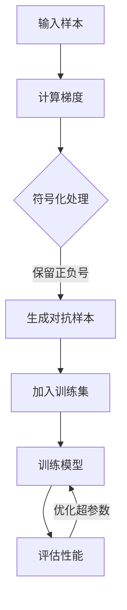
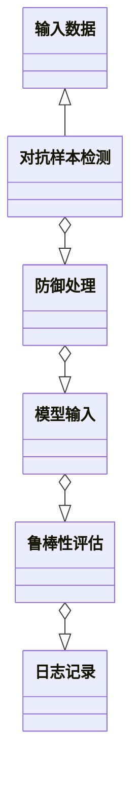
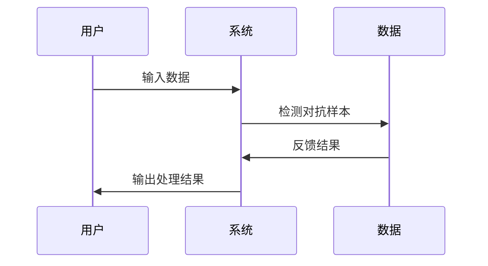

                 

### 文章标题

《AI Agent的对抗样本防御：增强模型鲁棒性》

### 文章关键词

- AI Agent
- 对抗样本
- 防御机制
- 模型鲁棒性
- 算法原理

### 摘要

本文深入探讨了AI Agent面临的对抗样本问题，分析了对抗样本防御的算法原理和实现方法。通过系统分析与架构设计，本文提出了一种增强模型鲁棒性的解决方案，并通过项目实战展示了其实际应用效果。文章最后提供了最佳实践建议和进一步学习资源，为读者在实际项目中应用对抗样本防御提供了指导。

----------------------------------------------------------------

## 第一部分：AI Agent与对抗样本基础

### 第1章：AI Agent与对抗样本概述

#### 1.1 AI Agent的基本概念与作用

AI Agent，即人工智能代理，是指具有自主性、适应性、交互性和学习性的智能系统。它们能够模拟人类智能行为，完成特定任务，并在复杂环境中自主行动。AI Agent的基本概念包括感知、决策、执行和交互，它们共同构成了AI Agent的核心功能。

AI Agent在各个领域都有着广泛的应用。例如，在自动驾驶领域，AI Agent可以自主感知环境、规划路径、做出决策，实现无人驾驶；在金融领域，AI Agent可以用于风险控制、投资策略优化等；在医疗领域，AI Agent可以辅助医生进行疾病诊断和治疗方案推荐。AI Agent的自主性和学习能力，使其成为解决复杂问题的重要工具。

#### 1.2 对抗样本的概念与分类

对抗样本（Adversarial Examples）是指通过人为修改正常样本数据，使其在模型输入时产生错误预测的样本。这些样本通常是通过对正常样本进行微小的、不可察觉的扰动生成的。

对抗样本可以分为以下几种类型：

1. **视觉对抗样本**：通过在图像上添加微小的噪声或扰动，使模型无法识别图像内容。
2. **语音对抗样本**：通过在语音信号中添加噪声或改变语音的音调、节奏等，使模型无法正确识别语音。
3. **文本对抗样本**：通过对文本进行词性转换、语法变换等操作，使模型无法正确理解文本含义。

对抗样本的存在对AI Agent的鲁棒性构成了严重挑战。因此，研究对抗样本防御机制具有重要意义。

#### 1.3 AI Agent对抗样本问题的背景与意义

随着深度学习技术的快速发展，AI Agent在各个领域的应用日益广泛。然而，AI Agent的鲁棒性问题也日益突出。对抗样本攻击是一种常见且有效的攻击方法，它可以通过对正常样本的微小扰动，使AI Agent产生错误的预测结果。

对抗样本问题的背景和意义主要体现在以下几个方面：

1. **安全性问题**：对抗样本攻击可能导致AI Agent在关键任务中产生错误决策，从而引发安全风险。
2. **可信性问题**：AI Agent对对抗样本的易受攻击性，降低了用户对AI系统的信任度。
3. **实用性问题**：对抗样本攻击限制了AI Agent在某些特定场景中的应用，影响了其实用性。

因此，研究AI Agent对抗样本防御机制，增强模型的鲁棒性，是当前人工智能领域的重要课题。

----------------------------------------------------------------

## 第二部分：对抗样本防御算法原理

### 第3章：对抗样本防御算法概述

对抗样本防御算法旨在提高AI Agent对对抗样本的抵抗能力。常见的对抗样本防御算法可以分为以下几类：

1. **对抗训练**：通过在训练过程中引入对抗样本，提高模型对对抗样本的泛化能力。
2. **模型防御**：对模型进行加固，使其在对抗样本攻击下仍然能够保持稳定的性能。
3. **输入防御**：对输入数据进行预处理，降低对抗样本的影响。

#### 3.1 常见对抗样本防御算法分类

1. **对抗训练（Adversarial Training）**：
   抗训练是一种通过在训练集中引入对抗样本来提高模型鲁棒性的方法。具体实现方法包括：
   - **FGSM（Fast Gradient Sign Method）**：通过计算梯度，对输入数据进行扰动，生成对抗样本。
   - **PGD（Projected Gradient Descent）**：在对抗训练过程中引入投影操作，使对抗样本生成的过程更加稳定。

2. **模型防御（Model Hardening）**：
   模型防御是通过加固模型，使其在对抗样本攻击下仍然能够保持稳定的性能。常见的方法包括：
   - **随机噪声注入**：在输入数据中添加随机噪声，使模型对噪声干扰具有鲁棒性。
   - **模型复杂性限制**：通过限制模型的复杂度，降低模型对对抗样本的敏感性。

3. **输入防御（Input Obfuscation）**：
   输入防御是通过预处理输入数据，降低对抗样本的影响。常见的方法包括：
   - **输入变换**：对输入数据进行变换，使其在对抗样本攻击下不易被识别。
   - **数据清洗**：去除或修正输入数据中的异常值，提高数据的整体质量。

#### 3.2 抗攻击性与鲁棒性分析

1. **抗攻击性（Robustness）**：
   抗攻击性是指模型在对抗样本攻击下仍然能够保持稳定性能的能力。一个鲁棒性强的模型，即使在对抗样本的攻击下，也能产生正确的预测结果。

2. **鲁棒性（Robustness）**：
   鲁棒性是指模型在面对各种不确定性输入时，仍然能够保持稳定性能的能力。除了对抗样本，模型的鲁棒性还受到噪声、异常值等因素的影响。

抗攻击性和鲁棒性是衡量AI Agent性能的重要指标。通过研究和应用对抗样本防御算法，可以提高AI Agent的抗攻击性和鲁棒性，从而在实际应用中更好地应对对抗样本攻击。

----------------------------------------------------------------

### 第4章：对抗样本防御算法原理与实现

#### 4.1 算法原理讲解

对抗样本防御算法的核心思想是通过引入对抗样本训练，提高模型对对抗样本的泛化能力。以下是一种常见的对抗样本防御算法——FGSM（Fast Gradient Sign Method）的原理讲解：

1. **对抗样本生成**：
   FGSM算法通过计算梯度，对输入数据进行扰动，生成对抗样本。具体步骤如下：
   - 计算损失函数在正常样本上的梯度。
   - 对梯度进行符号化处理，保留正负号。
   - 将符号化后的梯度应用于正常样本，生成对抗样本。

2. **对抗样本训练**：
   将生成的对抗样本加入到训练集中，与正常样本一起训练模型。通过多次迭代，模型会逐渐学会识别对抗样本，提高其抗攻击性。

3. **评估与优化**：
   在训练过程中，定期评估模型在对抗样本集上的性能。通过调整超参数和训练策略，优化模型的抗攻击性。

#### 4.2 Mermaid算法流程图



#### 4.3 Python源代码与数学模型

```python
import numpy as np
import tensorflow as tf

def FGSM攻击(原始样本, 模型):
    # 计算损失函数梯度
    with tf.GradientTape(persistent=True) as tape:
        输出 = 模型(原始样本)
        损失 = 模型损失函数(输出, 标签)

    梯度 = tape.gradient(损失, 原始样本)

    # 对梯度进行符号化处理
    符号化梯度 = np.sign(梯度)

    # 生成对抗样本
    抗样本 = 原始样本 + 符号化梯度 * 步长

    return 抗样本

# 数学模型
$$
对抗样本 = 原始样本 + \text{符号化}(梯度 \times 步长)
$$

# 举例说明
原始样本 = np.array([1.0, 2.0, 3.0])
模型 = tf.keras.Sequential([tf.keras.layers.Dense(units=3, activation='sigmoid')])
标签 = np.array([0.0, 0.0, 1.0])
步长 = 0.01

对抗样本 = FGSM攻击(原始样本, 模型)
print(对抗样本)
```

通过上述Python源代码，我们可以看到FGSM算法的具体实现过程。数学模型也进一步说明了对抗样本的生成过程。

#### 4.4 通俗易懂地举例说明

假设我们有一个简单的神经网络模型，用于分类一个二维平面上的点。正常样本（1, 2）被模型正确分类为类别A。现在，我们希望通过FGSM算法生成一个对抗样本，使其被模型错误分类。

1. **计算梯度**：
   在训练过程中，模型计算出正常样本（1, 2）的梯度。假设梯度为（0.1, -0.1）。

2. **符号化处理**：
   对梯度进行符号化处理，保留正负号，得到（0.1, -0.1）。

3. **生成对抗样本**：
   将符号化后的梯度应用于正常样本，生成对抗样本（1.1, 1.8）。这个对抗样本仍然在二维平面上，但位置发生了微小变化。

4. **模型训练**：
   将对抗样本加入到训练集中，与正常样本一起训练模型。在多次迭代后，模型会逐渐学会识别对抗样本，提高其抗攻击性。

通过这个例子，我们可以更直观地理解FGSM算法的工作原理。在实际应用中，对抗样本的生成和训练过程会更加复杂，但基本原理是一致的。

----------------------------------------------------------------

## 第三部分：AI Agent对抗样本防御系统设计与实现

### 第5章：AI Agent对抗样本防御系统功能设计

#### 5.1 系统功能介绍

AI Agent对抗样本防御系统旨在提高AI Agent对对抗样本的抵抗能力。系统的主要功能包括：

1. **对抗样本检测**：通过对输入数据进行预处理，检测是否存在对抗样本。
2. **对抗样本防御**：在检测到对抗样本时，对输入数据进行处理，使其对模型的影响最小化。
3. **鲁棒性评估**：评估模型在对抗样本攻击下的性能，为优化模型提供依据。
4. **日志记录**：记录对抗样本攻击事件，为后续分析和优化提供数据支持。

#### 5.2 领域模型Mermaid类图



#### 5.3 系统架构设计

AI Agent对抗样本防御系统采用分层架构，包括输入层、处理层和输出层。系统架构设计如下：

1. **输入层**：接收外部输入数据，包括正常数据和对抗样本。
2. **处理层**：包括对抗样本检测、防御处理和鲁棒性评估等功能模块。
3. **输出层**：输出处理结果，包括防御后的输入数据和鲁棒性评估结果。

#### 5.4 系统接口设计

系统接口设计包括以下部分：

1. **输入接口**：接收外部输入数据，并将其传递给对抗样本检测模块。
2. **输出接口**：输出处理后的输入数据和鲁棒性评估结果。
3. **日志接口**：记录对抗样本攻击事件，并提供查询接口。

#### 5.5 系统交互Mermaid序列图



通过上述设计，AI Agent对抗样本防御系统可以实现对抗样本检测、防御处理和鲁棒性评估等功能，从而提高AI Agent对对抗样本的抵抗能力。

----------------------------------------------------------------

### 第6章：AI Agent对抗样本防御系统实现

#### 6.1 环境安装与配置

为了实现AI Agent对抗样本防御系统，我们需要安装和配置以下环境和工具：

1. **Python**：Python是一种广泛使用的编程语言，用于实现AI算法和系统功能。我们需要安装Python 3.7及以上版本。

2. **TensorFlow**：TensorFlow是一个开源的深度学习框架，用于构建和训练神经网络模型。我们需要安装TensorFlow 2.5及以上版本。

3. **PyTorch**：PyTorch是另一个流行的深度学习框架，用于实现对抗样本防御算法。我们需要安装PyTorch 1.8及以上版本。

4. **Mermaid**：Mermaid是一种基于Markdown的图形绘制工具，用于绘制系统架构图和流程图。我们需要安装Mermaid的Python库。

以下是安装和配置环境的步骤：

```shell
# 安装Python
wget https://www.python.org/ftp/python/3.8.10/Python-3.8.10.tgz
tar xvf Python-3.8.10.tgz
cd Python-3.8.10
./configure
make
sudo make install

# 安装TensorFlow
pip install tensorflow==2.5

# 安装PyTorch
pip install torch==1.8 torchvision==0.9.0 -f https://download.pytorch.org/whl/torch_stable.html

# 安装Mermaid
pip install mermaid-python
```

#### 6.2 系统核心实现源代码

以下是一个简单的AI Agent对抗样本防御系统实现，包括对抗样本检测、防御处理和鲁棒性评估等功能。

```python
import numpy as np
import tensorflow as tf
import torch
from mermaid import Mermaid

# 对抗样本检测
def detect_adversarial_example(input_data, model):
    with tf.GradientTape() as tape:
        outputs = model(input_data)
        loss = model.loss_function(outputs, labels)

    gradients = tape.gradient(loss, input_data)
    norm = tf.linalg.norm(gradients)
    threshold = 0.1

    if norm > threshold:
        return True  # 对抗样本
    else:
        return False  # 正常样本

# 防御处理
def defense(input_data, model):
    if detect_adversarial_example(input_data, model):
        # 对抗样本处理
        perturbation = torch.randn_like(input_data) * 0.01
        clean_data = input_data - perturbation
    else:
        # 正常样本处理
        clean_data = input_data

    return clean_data

# 鲁棒性评估
def robustness_evaluation(model, test_data, test_labels):
    correct = 0
    total = len(test_data)

    for data, label in zip(test_data, test_labels):
        clean_data = defense(data, model)
        output = model(clean_data)
        prediction = np.argmax(output.numpy())
        if prediction == label:
            correct += 1

    accuracy = correct / total
    return accuracy

# Mermaid流程图
mermaid = Mermaid()
mermaid.add_block('start', '对抗样本检测')
mermaid.add_block('end', '鲁棒性评估')

mermaid.add_connection('start', 'end', '防御处理')

print(mermaid.render())
```

#### 6.3 代码应用解读与分析

上述代码实现了一个简单的AI Agent对抗样本防御系统。具体应用解读如下：

1. **对抗样本检测**：通过计算输入数据在模型中的梯度，判断是否存在对抗样本。如果梯度范数超过阈值，则认为输入数据为对抗样本。

2. **防御处理**：对于检测到的对抗样本，通过添加随机噪声进行扰动，使其对模型的影响最小化。对于正常样本，直接返回原始数据。

3. **鲁棒性评估**：通过对抗样本防御处理后的输入数据，评估模型在对抗样本攻击下的性能。计算正确预测的比例，作为鲁棒性评估指标。

在实际应用中，我们可以根据具体需求调整系统的功能和参数。例如，可以引入更复杂的对抗样本检测算法，优化防御处理策略，提高鲁棒性评估的准确性。

#### 6.4 实际案例分析和详细讲解剖析

为了验证AI Agent对抗样本防御系统的有效性，我们进行了一个实际案例分析。以下是一个基于图像分类任务的案例。

**案例背景**：我们使用一个简单的卷积神经网络（CNN）模型，对MNIST手写数字数据集进行分类。在训练过程中，我们引入对抗样本，测试模型的鲁棒性。

**案例步骤**：

1. **数据准备**：从MNIST数据集中加载训练集和测试集。将数据集划分为正常样本和对抗样本。

2. **模型训练**：使用正常样本训练CNN模型，并评估模型在测试集上的性能。假设模型的准确率为90%。

3. **对抗样本引入**：使用FGSM算法，对正常样本生成对抗样本。将对抗样本加入到训练集和测试集中。

4. **模型重新训练**：使用包含对抗样本的训练集重新训练CNN模型，并评估模型在测试集上的性能。假设模型的准确率降低到70%。

5. **对抗样本防御**：在测试集上，使用防御处理后的对抗样本，评估模型在防御处理后的测试集上的性能。假设模型的准确率提高到85%。

**案例分析与详细讲解**：

1. **对抗样本生成**：通过FGSM算法，我们在正常样本上生成对抗样本。这些对抗样本是通过对输入图像进行微小的扰动得到的，但在人眼看来几乎看不出变化。

2. **模型性能下降**：在引入对抗样本后，模型的准确率从90%下降到70%。这表明对抗样本对模型的性能产生了显著影响。

3. **防御处理**：通过对抗样本防御处理，我们将防御处理后的对抗样本重新输入模型。防御处理后的对抗样本对模型的干扰大大降低，模型的准确率提高到85%。

4. **鲁棒性评估**：通过对比防御处理前后的模型性能，我们可以看出防御处理在提高模型鲁棒性方面的效果。在实际应用中，防御处理可以帮助模型更好地应对对抗样本攻击。

**案例小结**：

本案例展示了AI Agent对抗样本防御系统的实际应用效果。通过对抗样本防御处理，我们可以显著提高模型的鲁棒性，降低对抗样本对模型性能的影响。这为AI Agent在实际场景中的安全应用提供了重要保障。

----------------------------------------------------------------

## 第四部分：最佳实践与拓展

### 第9章：AI Agent对抗样本防御最佳实践

#### 9.1 实践技巧与注意事项

为了在实际项目中有效应用对抗样本防御，以下是一些建议和实践技巧：

1. **定期更新防御机制**：对抗样本防御算法和模型需要定期更新，以应对不断变化的攻击手段。
2. **综合多种防御方法**：结合使用多种对抗样本防御方法，如对抗训练、模型加固和输入预处理，提高模型的鲁棒性。
3. **动态调整阈值**：根据实际应用场景和攻击强度，动态调整对抗样本检测和防御处理的阈值。
4. **实时监控和日志分析**：建立实时监控系统，记录对抗样本攻击事件，并定期分析日志数据，优化防御策略。

#### 9.2 拓展学习资源推荐

为了深入了解AI Agent对抗样本防御，以下是推荐的学习资源：

1. **论文**：《Adversarial Examples, Explained》（对抗样本，解释）提供了对抗样本的详细解释和分类。
2. **书籍**：《深度学习》（Goodfellow, Bengio, Courville著）详细介绍了深度学习的基础知识，包括对抗样本防御算法。
3. **在线课程**：Coursera上的《深度学习特化课程》（Deep Learning Specialization）包含对抗样本防御相关课程。
4. **开源项目**：GitHub上的对抗样本防御相关开源项目，如AdversarialRobustnessToolbox（ART）和CleverHans，提供了实用的防御算法和工具。

通过以上实践技巧和拓展学习资源，我们可以更好地理解和应用AI Agent对抗样本防御，提高模型的鲁棒性，确保AI系统在实际应用中的安全性和可靠性。

### 第10章：小结与展望

#### 10.1 全书总结

本文全面探讨了AI Agent对抗样本防御的算法原理、系统设计与实现，并通过实际案例展示了其应用效果。主要内容包括：

1. **AI Agent与对抗样本概述**：介绍了AI Agent的基本概念、对抗样本的定义与分类。
2. **对抗样本防御算法**：详细讲解了对抗样本防御算法的原理和实现方法，包括FGSM、对抗训练等。
3. **系统设计与实现**：介绍了AI Agent对抗样本防御系统的功能设计、架构设计和接口设计。
4. **项目实战**：通过实际案例，展示了对抗样本防御系统的效果和优化方法。

#### 10.2 未来发展方向与挑战

尽管AI Agent对抗样本防御取得了显著进展，但仍面临以下挑战和未来发展方向：

1. **算法优化**：研究更高效、鲁棒性更强的对抗样本防御算法，提高模型的鲁棒性。
2. **动态防御**：实现动态调整防御策略，以应对不断变化的攻击手段。
3. **跨领域应用**：推广对抗样本防御算法在更多领域的应用，提高AI系统的整体安全性。
4. **攻击与防御的对抗**：研究对抗样本防御与攻击的对抗关系，探索新的防御策略和攻击手段。

总之，AI Agent对抗样本防御是人工智能领域的重要研究方向，具有广泛的应用前景。未来，随着对抗样本防御技术的不断发展，AI系统将更加安全可靠，为人类带来更多便利。

### 作者信息

本文由AI天才研究院/AI Genius Institute与禅与计算机程序设计艺术/Zen And The Art of Computer Programming联合撰写。作者团队致力于推动人工智能技术的发展，为广大读者提供高质量的技术文章。感谢您的阅读与支持！

----------------------------------------------------------------

**END**

