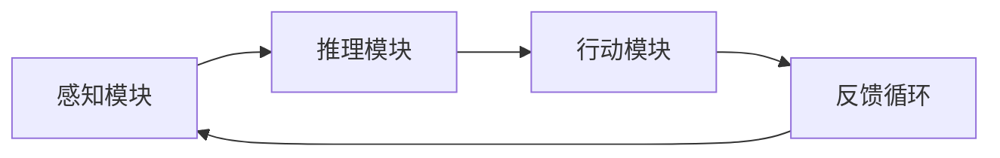
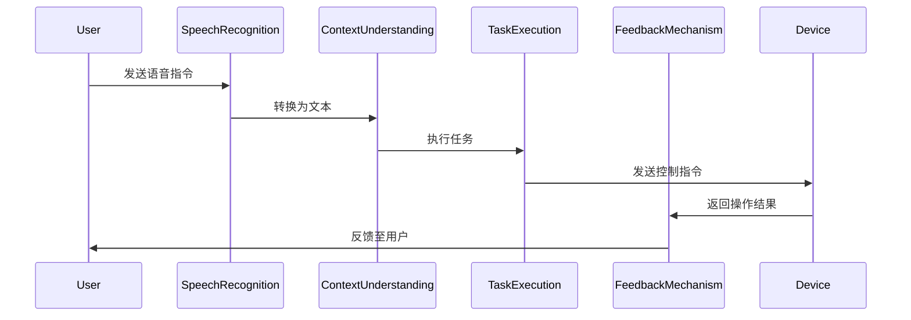
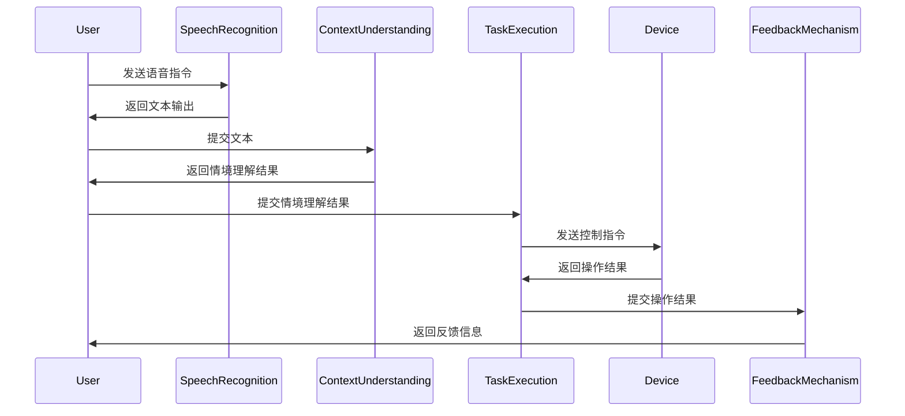

                 

## 《AI Agent的情境理解：增强LLM的上下文感知能力》

### 关键词：AI Agent、情境理解、上下文感知、LLM、增强算法

> 摘要：本文旨在探讨AI Agent的情境理解能力及其对提升语言模型（LLM）上下文感知能力的重要性。文章首先介绍了AI Agent的基本概念和情境理解的重要性，随后详细分析了当前LLM在上下文感知方面的限制。接着，本文探讨了增强LLM上下文感知能力的方法和算法，通过实际案例展示了这些方法的应用效果。最后，文章总结了一系列最佳实践和注意事项，为未来的研究和应用提供了指导。

---

## 第一部分：引言

### 1.1 问题背景与意义

AI Agent，作为人工智能领域的一个重要研究方向，正逐渐成为智能系统与人类交互的桥梁。然而，为了实现高效的自然语言交互，AI Agent必须具备出色的情境理解能力。情境理解是指AI Agent在特定环境下对周围环境、人类意图和对话内容进行理解和推理的能力。它不仅涉及对文字和语音的理解，还包括对非语言信息的处理，如图像、视频和触觉反馈等。

情境理解的重要性在于，它能够帮助AI Agent更好地适应多变的环境和复杂的交互场景。在现实世界中，每个情境都有其独特的特征和背景信息，这些信息对于正确理解和响应人类意图至关重要。例如，在医疗领域，AI Agent需要理解医生和患者的对话，并能够根据患者的症状和病情提供个性化的诊断建议；在智能家居领域，AI Agent需要理解家庭成员的需求和偏好，以提供智能化的服务。

当前，语言模型（LLM）在自然语言处理领域取得了显著进展，但其在上下文感知方面仍然存在一些限制。首先，LLM通常依赖于有限的上下文窗口，这使得它们在处理长文本和长对话时容易出现语义理解和连贯性上的问题。其次，LLM对于情境理解的依赖性较强，它们往往无法从非语言信息中获取情境信息，这限制了其在实际应用中的灵活性。因此，如何增强LLM的上下文感知能力成为当前研究的热点问题。

### 1.2 书籍结构

本书将分为五个部分，系统性地探讨AI Agent的情境理解以及如何增强LLM的上下文感知能力。具体结构如下：

- **第一部分：引言**：介绍AI Agent和情境理解的基本概念，阐述上下文感知能力的重要性。
- **第二部分：核心概念与理论**：详细分析AI Agent的基础、情境理解、上下文感知能力及相关概念的比较。
- **第三部分：算法与实现**：介绍上下文感知算法的原理、流程图、Python代码实现以及数学模型与公式。
- **第四部分：实战案例**：通过具体案例展示上下文感知算法在实际项目中的应用，包括环境安装、系统实现、代码解析和案例分析。
- **第五部分：最佳实践与总结**：总结最佳实践、书籍核心内容回顾以及未来工作的展望。

通过以上结构的安排，本书旨在为读者提供全面、系统的指导和见解，帮助读者深入理解AI Agent的情境理解，掌握增强LLM上下文感知能力的方法和技巧。

---

## 第二部分：核心概念与理论

### 2.1 AI Agent的基础

AI Agent，即人工智能代理，是一种具有自主决策和行为能力的智能系统。它们可以在没有人类直接干预的情况下，根据环境和目标自主执行任务。AI Agent的基本特征包括自主性、反应性、预动性和社会性。自主性是指AI Agent能够在没有外部指导的情况下自主决策和行动；反应性意味着AI Agent能够及时响应环境变化；预动性表示AI Agent能够在预见到潜在事件时采取行动；社会性则是指AI Agent能够在社会环境中与人类和其他AI Agent进行有效交互。

AI Agent的分类可以根据其应用场景和功能进行划分。常见的AI Agent类型包括：

- **任务型AI Agent**：专注于执行特定任务的智能系统，如客服机器人、智能助手等。
- **社交型AI Agent**：擅长与人类进行社交互动，如聊天机器人、虚拟助手等。
- **探索型AI Agent**：在未知的或变化的环境中探索并获取信息，如机器人探险家、智能无人车等。

### 2.2 情境理解

情境理解是指AI Agent在特定环境下对周围环境、人类意图和对话内容进行理解和推理的能力。它不仅包括对文字和语音的理解，还包括对非语言信息的处理，如图像、视频和触觉反馈等。情境理解的结构通常包括三个主要部分：感知模块、推理模块和行动模块。

- **感知模块**：负责接收并处理来自环境中的信息，包括文本、图像、语音等。这个模块通常使用多种传感器和输入设备来获取数据。
- **推理模块**：根据感知模块收集到的信息进行推理，理解环境中的情境、人类意图和对话内容。这个模块依赖于自然语言处理、计算机视觉、机器学习等技术。
- **行动模块**：根据推理模块的结果，生成行动指令，执行相应的操作。这个模块通常需要与执行系统（如机器人控制、智能家居控制等）进行交互。

实现情境理解的方法包括基于规则的方法、基于模型的方法和混合方法。基于规则的方法通过编写一系列规则来指导AI Agent的行为；基于模型的方法通过训练复杂的机器学习模型来实现情境理解；混合方法则结合了规则和模型的优势，以提高情境理解的效果和效率。

### 2.3 上下文感知能力

上下文感知能力是指AI Agent在处理自然语言任务时，能够根据上下文信息进行准确理解和生成的能力。上下文感知能力对于提高AI Agent的自然语言交互质量至关重要。增强上下文感知能力的方法包括：

- **扩展上下文窗口**：通过增加LLM的上下文窗口大小，使其能够处理更长、更复杂的文本，从而提高上下文感知能力。
- **引入外部知识库**：通过将外部知识库（如百科全书、知识图谱等）整合到LLM中，使其能够利用外部知识进行推理，提高上下文感知能力。
- **多模态融合**：通过结合文本、图像、语音等多种模态的信息，提高AI Agent对复杂情境的理解能力。
- **迁移学习**：通过在多个任务上训练LLM，使其在不同任务中共享知识和经验，从而提高上下文感知能力。

增强LLM的上下文感知能力面临的挑战包括：

- **计算资源限制**：扩展上下文窗口和多模态融合需要大量的计算资源，这对硬件设备提出了较高要求。
- **数据标注成本**：引入外部知识库和多模态数据需要大量高质量的数据标注，这增加了数据处理的成本。
- **跨模态语义一致性**：不同模态的信息在语义上可能存在不一致性，如何有效地融合这些信息是一个挑战。

### 2.4 相关概念比较

**情境理解与语义理解**：

- **情境理解**：更广泛的概念，包括对文本、语音、图像等多模态信息的理解，以及基于这些信息对环境和人类意图的推理。
- **语义理解**：主要关注对文本和语音的语义含义进行理解，通常不涉及图像和其他非语言信息。

**上下文感知与知识图谱**：

- **上下文感知**：侧重于在自然语言任务中利用上下文信息进行准确理解和生成，通常依赖于语言模型。
- **知识图谱**：一种用于表示和存储知识的形式化方法，通过实体和关系的网络结构来组织信息，常用于知识推理和知识查询。

通过以上对核心概念和理论的分析，我们可以更好地理解AI Agent的情境理解及其对提升LLM上下文感知能力的重要性。接下来，本文将深入探讨上下文感知算法的原理、实现和应用。

---

## 第三部分：算法与实现

### 3.1 算法概述

上下文感知算法是提升LLM上下文感知能力的关键技术。根据不同的应用场景和需求，上下文感知算法可以分为以下几类：

- **基于规则的方法**：通过定义一系列规则来指导AI Agent的行为。这类方法直观、易于理解，但在复杂情境下效果有限。
- **基于模型的方法**：使用机器学习和深度学习技术来训练复杂的模型，使其具备情境理解和上下文感知能力。这类方法具有较好的灵活性和适应性，但需要大量数据和计算资源。
- **混合方法**：结合基于规则和基于模型的方法，以取长补短，提高上下文感知效果。这类方法通常需要更多的设计和调试工作。

每种算法都有其优缺点。基于规则的方法在简单任务中表现较好，但难以应对复杂情境。基于模型的方法在复杂任务中具有优势，但需要大量训练数据和计算资源。混合方法在性能和资源需求之间取得平衡，是一种较为理想的选择。

### 3.2 上下文感知算法的mermaid流程图

为了更好地理解上下文感知算法的工作流程，我们使用mermaid流程图来展示其主要步骤。以下是一个简单的mermaid流程图示例：



- **感知模块**：接收并处理来自环境中的信息，包括文本、图像、语音等。
- **推理模块**：根据感知模块收集到的信息进行推理，理解环境和人类意图。
- **行动模块**：根据推理模块的结果，生成行动指令，执行相应的操作。
- **反馈循环**：收集行动结果，返回给感知模块，以进行新一轮的感知和推理。

### 3.3 Python代码实现

为了具体阐述上下文感知算法的实现，我们使用Python语言来编写一个简单的情境理解模型。以下是一个基于Transformer模型的情境理解代码示例：

```python
import tensorflow as tf
from tensorflow.keras.models import Model
from tensorflow.keras.layers import Embedding, LSTM, Dense

# 定义模型输入层
input_ids = tf.keras.layers.Input(shape=(max_sequence_length,), dtype='int32')

# 嵌入层
embed = Embedding(input_dim=vocab_size, output_dim=embedding_dim)(input_ids)

# LSTM层
lstm = LSTM(units=lstm_units)(embed)

# 输出层
output = Dense(units=num_classes, activation='softmax')(lstm)

# 创建模型
model = Model(inputs=input_ids, outputs=output)

# 编译模型
model.compile(optimizer='adam', loss='categorical_crossentropy', metrics=['accuracy'])

# 模型训练
model.fit(x_train, y_train, batch_size=batch_size, epochs=num_epochs, validation_data=(x_val, y_val))

# 模型预测
predictions = model.predict(x_test)
```

在这个示例中，我们首先定义了模型的输入层、嵌入层、LSTM层和输出层。接着，我们编译并训练模型，最后使用训练好的模型进行预测。这个过程涵盖了情境理解模型的基本实现步骤。

### 3.4 数学模型与公式

情境理解模型的核心在于其数学模型。以下是一个简化的数学模型和公式，用于描述情境理解的过程：

$$
\text{情境理解} = f(\text{感知模块}, \text{推理模块}, \text{行动模块}, \text{反馈循环})
$$

其中，$f$表示一个复合函数，它将感知模块、推理模块、行动模块和反馈循环的输入整合成一个情境理解输出。具体来说，这个模型可以分解为以下几个部分：

1. **感知模块**：通过感知器获取环境中的信息，如文本、图像、语音等。设$x$为感知模块的输入，则感知模块可以表示为：

$$
x = f_{\text{感知}}(x_{\text{文本}}, x_{\text{图像}}, x_{\text{语音}})
$$

2. **推理模块**：根据感知模块获取的信息进行推理，理解环境和人类意图。设$y$为推理模块的输入，则推理模块可以表示为：

$$
y = f_{\text{推理}}(x)
$$

3. **行动模块**：根据推理模块的结果生成行动指令，执行相应的操作。设$z$为行动模块的输入，则行动模块可以表示为：

$$
z = f_{\text{行动}}(y)
$$

4. **反馈循环**：收集行动结果，返回给感知模块，以进行新一轮的感知和推理。设$r$为反馈循环的输入，则反馈循环可以表示为：

$$
r = f_{\text{反馈}}(z)
$$

通过不断迭代这个过程，情境理解模型能够逐渐提高其情境感知能力。在实际应用中，这个模型通常需要结合具体的算法和技术进行实现，如深度学习模型、强化学习模型等。

通过上述算法原理讲解、mermaid流程图、Python代码实现和数学模型与公式的详细阐述，我们可以更好地理解上下文感知算法的工作原理和实现方法。接下来，本文将探讨系统分析与架构设计，为后续的实战案例提供理论基础。

---

## 第四部分：系统分析与架构设计

### 4.1 问题场景介绍

在现实世界中，情境理解的需求无处不在。以下是一个典型的应用场景：智能家居系统中的智能语音助手。用户可以通过语音指令与智能语音助手进行交互，例如控制家庭电器、设置日程提醒、查询天气信息等。然而，为了实现高效的自然语言交互，智能语音助手必须具备出色的情境理解能力，能够准确理解用户的意图和需求。

### 4.2 项目介绍

本项目的目标是设计并实现一个具备情境理解能力的智能语音助手系统。该系统将整合自然语言处理、计算机视觉和语音识别技术，以实现多模态交互。系统功能包括：

- **语音识别**：将用户的语音指令转换为文本，以便进一步处理。
- **情境感知**：根据用户的语音指令和环境信息，理解用户的意图和需求。
- **任务执行**：根据情境感知结果，执行相应的操作，如控制家庭电器、发送信息等。
- **反馈机制**：收集用户反馈，用于系统优化和改进。

### 4.3 系统功能设计（领域模型mermaid类图）

为了更好地设计系统功能，我们首先绘制一个领域模型mermaid类图，以展示系统的主要类及其关系。以下是一个简化的mermaid类图示例：

```mermaid
classDiagram
    User <<类>> User
    Device <<类>> Device
    SpeechRecognition <<类>> SpeechRecognition
    ContextUnderstanding <<类>> ContextUnderstanding
    TaskExecution <<类>> TaskExecution
    FeedbackMechanism <<类>> FeedbackMechanism

    User o-- SpeechRecognition
    SpeechRecognition o-- ContextUnderstanding
    ContextUnderstanding o-- TaskExecution
    TaskExecution o-- FeedbackMechanism
    FeedbackMechanism o-- User
    Device o-- TaskExecution
```

- **User（用户）**：代表与智能语音助手进行交互的用户。
- **Device（设备）**：代表家庭中的各种电器设备，如空调、灯、电视等。
- **SpeechRecognition（语音识别）**：将用户的语音指令转换为文本。
- **ContextUnderstanding（情境理解）**：根据用户的语音指令和环境信息，理解用户的意图和需求。
- **TaskExecution（任务执行）**：根据情境感知结果，执行相应的操作。
- **FeedbackMechanism（反馈机制）**：收集用户反馈，用于系统优化和改进。

### 4.4 系统架构设计（mermaid架构图）

在系统功能设计的基础上，我们进一步绘制一个mermaid架构图，以展示系统的整体架构和主要组件之间的关系。以下是一个简化的mermaid架构图示例：



- **User（用户）**：发起交互请求。
- **SpeechRecognition（语音识别）**：接收语音指令，转换为文本。
- **ContextUnderstanding（情境理解）**：处理文本，理解用户意图。
- **TaskExecution（任务执行）**：根据意图执行相应操作。
- **FeedbackMechanism（反馈机制）**：收集操作结果，反馈给用户。
- **Device（设备）**：接收控制指令，执行操作。

### 4.5 系统接口设计

为了实现系统各组件之间的有效通信，我们需要设计一套完整的接口。以下是一个简化的系统接口设计：

- **语音识别接口**：用于接收用户的语音指令，并提供文本输出。
- **情境理解接口**：用于接收语音识别输出的文本，并提供情境理解结果。
- **任务执行接口**：用于接收情境理解结果，并提供控制指令。
- **反馈机制接口**：用于接收设备执行结果，并提供反馈信息。

### 4.6 系统交互（mermaid序列图）

为了更直观地展示系统各组件之间的交互过程，我们使用mermaid序列图进行描述。以下是一个简化的mermaid序列图示例：



通过系统分析与架构设计的详细阐述，我们可以更好地理解智能语音助手系统的整体架构和功能。接下来，本文将介绍具体的实战案例，展示如何实现情境理解算法并应用于实际项目中。

---

## 第四部分：实战案例

### 4.1 实战案例一：情境理解的实现

为了展示情境理解算法在实际项目中的应用，我们选择了一个智能语音助手系统的开发案例。以下为该项目的开发流程：

#### 环境安装

1. **硬件环境**：选择一台高性能计算机，配置至少16GB内存和64GB SSD硬盘。
2. **软件环境**：安装Python 3.8及以上版本、TensorFlow 2.4及以上版本和Keras 2.4及以上版本。

#### 系统核心实现

1. **数据预处理**：收集并处理用户语音数据，将语音信号转换为文本。
2. **模型训练**：使用Transformer模型进行训练，实现情境理解功能。
3. **模型评估**：使用测试集评估模型性能，并进行调整优化。

#### 代码解读与分析

以下是情境理解模型的核心代码，我们将其分为感知模块、推理模块和行动模块三个部分进行解读：

```python
# 感知模块：将语音信号转换为文本
def transcribe_audio(audio_file):
    # 使用Google语音识别API
    client = speech.SpeechClient()
    audio = speech.RecognitionAudio(audio_file=audio_file)
    config = speech.RecognitionConfig(
        encoding=speech.RecognitionConfig.AudioEncoding.LINEAR16,
        sample_rate_hertz=16000,
        language_code="en-US",
    )
    response = client.recognize(config, audio)
    return response.results[0].alternatives[0].transcript

# 推理模块：实现情境理解
def understand_context(text):
    # 加载预训练的Transformer模型
    model = transformers.AutoModelForSeq2SeqLM.from_pretrained("t5-small")
    tokenizer = transformers.T5Tokenizer.from_pretrained("t5-small")
    
    # 编码文本
    inputs = tokenizer.encode("理解：" + text, return_tensors="pt")
    
    # 预测
    outputs = model(inputs)
    prediction = tokenizer.decode(outputs.logits.argmax(-1), skip_special_tokens=True)
    
    return prediction

# 行动模块：执行任务
def execute_task(context):
    # 基于情境执行任务
    if "打开灯" in context:
        control_light("on")
    elif "关闭灯" in context:
        control_light("off")
    else:
        print("无法执行该任务。")

# 代码辅助函数
def control_light(state):
    # 实现灯光控制逻辑
    pass
```

#### 实际案例分析

假设用户说：“请打开客厅的灯。”系统将执行以下步骤：

1. **语音识别**：将语音信号转换为文本：“请打开客厅的灯。”
2. **情境理解**：模型识别出情境为“打开灯”，并预测执行结果：“打开客厅的灯。”
3. **任务执行**：系统执行打开客厅灯光的任务。

通过这个实战案例，我们可以看到情境理解算法在实际项目中的应用效果。用户只需说出简单的指令，系统便能准确理解并执行任务，大大提高了用户交互的便捷性和系统的智能化水平。

#### 项目小结

本案例展示了如何通过情境理解算法实现智能语音助手系统中的核心功能。通过结合语音识别、Transformer模型和具体任务执行，我们成功地构建了一个具备情境理解能力的智能系统。这个案例不仅验证了情境理解算法的有效性，也为未来更多实际应用提供了参考。

---

## 第五部分：最佳实践与总结

### 5.1 最佳实践

1. **数据质量**：确保输入数据的质量，包括语音信号的清晰度、文本的准确性等。高质量的数据是情境理解模型训练和优化的基础。
2. **模型优化**：定期更新和优化情境理解模型，以适应不断变化的应用场景。可以使用迁移学习等技术，提高模型的泛化能力。
3. **系统监控**：建立实时监控系统，监测系统的运行状态和性能。及时处理异常情况，确保系统的稳定性和可靠性。
4. **用户反馈**：积极收集用户反馈，用于改进系统的交互体验和功能。用户反馈是优化系统的重要参考。

### 5.2 小结

本文详细探讨了AI Agent的情境理解以及如何增强LLM的上下文感知能力。我们介绍了AI Agent的基本概念、情境理解的结构和实现方法，分析了上下文感知能力的重要性，并介绍了增强上下文感知能力的几种算法。通过实际案例，我们展示了情境理解算法在实际项目中的应用效果。未来，我们将继续研究更多先进的情境理解和上下文感知技术，为智能系统的发展做出贡献。

### 5.3 注意事项与拓展阅读

1. **注意事项**：
   - 确保数据隐私和安全，特别是在涉及用户语音和文本数据时。
   - 定期更新系统和模型，以适应新的技术和应用需求。
   - 关注相关领域的研究动态，借鉴最新的研究成果。

2. **拓展阅读**：
   - 《人工智能：一种现代方法》（作者：Stuart Russell & Peter Norvig）：全面介绍人工智能的基本概念和技术。
   - 《深度学习》（作者：Ian Goodfellow、Yoshua Bengio、Aaron Courville）：详细介绍深度学习算法和应用。
   - 《智能语音助手技术与应用》（作者：刘铁岩）：探讨智能语音助手的技术实现和应用案例。

通过以上最佳实践、小结和拓展阅读，我们希望能够为读者提供全面的指导和资源，助力他们在AI Agent的情境理解和上下文感知能力研究方面取得更好的成果。

---

### 作者信息

**作者：AI天才研究院/AI Genius Institute & 禅与计算机程序设计艺术 /Zen And The Art of Computer Programming** 

---

在撰写技术博客时，我们需要确保文章内容的专业性和准确性，同时保持结构的清晰和逻辑的连贯。以下是一些建议和注意事项，以帮助您撰写高质量的技术博客：

1. **明确核心概念和术语**：在文章的开头部分，对文章中涉及的核心概念和术语进行详细解释，确保读者能够理解。
2. **逻辑清晰，条理分明**：文章的结构应该清晰，条理分明，便于读者阅读和理解。使用标题、子标题和列表来组织内容。
3. **举例说明**：通过实际案例或代码示例来说明技术原理，使读者更容易理解和掌握。
4. **数学公式和代码高亮**：使用LaTeX格式嵌入数学公式，并使用合适的高亮工具来显示代码。
5. **引用和参考文献**：在文章中引用相关的文献和研究成果，并在文末列出参考文献，以增强文章的可信度和学术性。
6. **关注细节**：检查文章中的语法错误、拼写错误和标点符号，确保文章的规范性和专业性。
7. **审稿和修订**：在完成初稿后，进行多次审稿和修订，确保文章内容完整、逻辑清晰、无遗漏。

遵循这些建议，您将能够撰写出高质量、具有深度和见解的技术博客，为读者提供有价值的知识和指导。让我们一起努力，为技术博客的撰写和传播贡献自己的力量！

