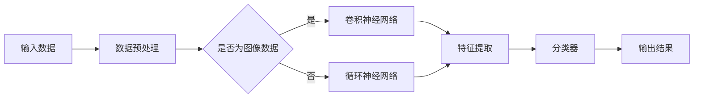
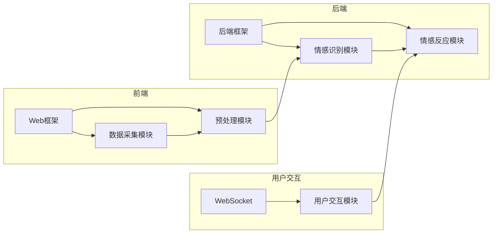
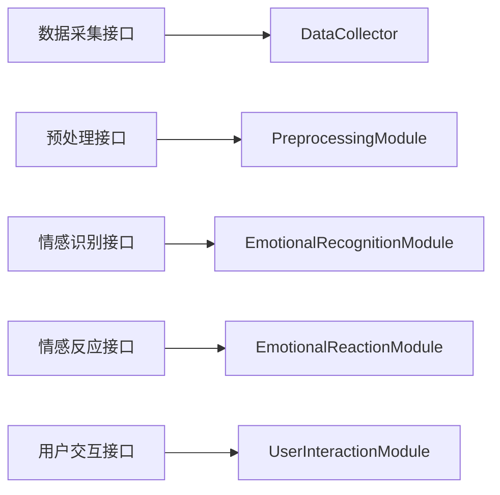
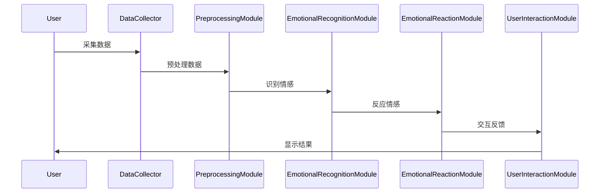

                 

### 确定整体结构

在撰写一篇关于《AI Agent的情感识别与表达能力开发》的技术博客文章时，首先需要明确文章的整体结构。这包括对全文进行大致的框架规划，确定主要部分和每个部分的主要内容，以保证文章内容的完整性和逻辑性。

**整体结构设计步骤**：

1. **确定主要部分**：首先，我们需要明确文章的主要部分，这通常包括引入部分、核心内容部分和总结部分。引入部分主要用来吸引读者的注意力，介绍文章的主题和背景；核心内容部分则详细阐述情感识别与表达能力开发的各个方面；总结部分对全文进行总结，并提出未来展望或建议。

2. **详细规划核心内容部分**：核心内容部分是文章的主体，需要细致规划。根据题目《AI Agent的情感识别与表达能力开发》，我们可以将核心内容部分分为以下几个子部分：
   - **情感识别的基础理论**：介绍情感识别的基本概念、重要性以及AI Agent在情感识别中的应用。
   - **情感识别的核心概念与联系**：深入探讨情感识别的核心概念，如情感类型、情感维度、情感表达与情感反应等，并分析这些概念之间的联系。
   - **情感识别算法原理讲解**：讲解常见的情感识别算法，如深度学习算法、循环神经网络等，并详细阐述算法原理、流程和数学模型。
   - **情感识别系统分析与架构设计**：介绍情感识别系统的功能设计、架构设计和接口设计，并展示相关的mermaid图表。
   - **项目实战与案例剖析**：通过实际项目案例，展示情感识别与表达能力开发的具体应用，并进行详细的分析和讲解。
   - **最佳实践与注意事项**：总结文章中的关键点，提供最佳实践建议，并提醒读者注意的一些潜在问题。

3. **总结部分**：总结部分是对全文的回顾和提炼，强调文章的核心观点，并提出未来研究和应用的方向。

**预期结构**：

- **引入**：介绍AI Agent的背景和情感识别的重要性。
- **核心内容**：
  - **情感识别的基础理论**：定义、背景、应用。
  - **情感识别的核心概念与联系**：情感类型、情感维度、情感表达与情感反应。
  - **情感识别算法原理讲解**：算法介绍、流程、数学模型。
  - **情感识别系统分析与架构设计**：功能、架构、接口。
  - **项目实战与案例剖析**：实际应用、分析、讲解。
  - **最佳实践与注意事项**：总结、建议、注意事项。
- **总结**：回顾全文，提出展望。

通过上述结构设计，我们可以确保文章内容条理清晰、逻辑严谨，同时能够吸引读者的兴趣，引导他们逐步深入了解情感识别与表达能力开发的相关知识。接下来，我们将逐步细化每个章节的内容，确保核心概念的阐述、算法原理的讲解以及项目实战的剖析都能够清晰、易懂、深入。

### 细化章节内容

在确定了文章的整体结构后，我们需要对每个章节进行细化，列出具体的子章节和小节，以确保文章内容完整且具有逻辑性。以下是细化后的章节内容：

#### 第1章: AI Agent与情感识别概述

- **1.1 AI Agent的定义与分类**
  - **AI Agent的定义**：介绍AI Agent的基本概念。
  - **AI Agent的分类**：分类方法、主要类型。
  - **AI Agent的应用场景**：举例说明AI Agent在不同领域的应用。

- **1.2 情感识别的定义与意义**
  - **情感识别的定义**：情感识别的定义和基本原理。
  - **情感识别的意义**：在AI Agent中的应用价值。

- **1.3 情感识别在AI Agent中的应用**
  - **情感识别的具体应用**：情感分析、情感交互等。
  - **情感识别的优势与挑战**：探讨情感识别在实际应用中面临的挑战。

#### 第2章: 情感识别的核心概念与联系

- **2.1 情感识别的核心概念**
  - **情感类型**：主要情感类型及其定义。
  - **情感维度**：情感维度的概念和分类。

- **2.2 情感识别的概念属性特征对比表格**
  - **情感类型属性特征对比**：不同情感类型的属性特征对比。
  - **情感维度属性特征对比**：不同情感维度的属性特征对比。

- **2.3 情感识别的ER实体关系图架构**
  - **ER模型基本概念**：介绍实体关系图（ER图）的基本概念。
  - **情感识别ER图架构**：展示情感识别中的实体关系，并用mermaid绘制ER图。

#### 第3章: 情感识别算法原理讲解

- **3.1 基于深度学习的情感识别算法**
  - **深度学习基础**：介绍深度学习的基本原理。
  - **情感识别深度学习模型**：包括卷积神经网络（CNN）和循环神经网络（RNN）。

- **3.2 情感识别的mermaid算法流程图**
  - **算法流程图**：使用mermaid绘制情感识别算法的流程图。

- **3.3 情感识别的Python源代码示例**
  - **代码示例**：展示使用Python实现情感识别的示例代码。
  - **代码解释**：详细解释代码中的关键步骤和算法原理。

#### 第4章: 情感识别的数学模型和数学公式

- **4.1 情感识别的数学模型**
  - **概率模型**：介绍情感识别中的概率模型。

- **4.2 数学公式的详细讲解与举例说明**
  - **概率分布公式**：详细讲解常用的概率分布公式。
  - **举例说明**：通过具体例子说明公式的应用。

#### 第5章: 情感识别系统分析与架构设计

- **5.1 情感识别系统的问题场景介绍**
  - **问题场景**：介绍情感识别系统可能遇到的问题场景。

- **5.2 情感识别系统的功能设计**
  - **领域模型mermaid类图**：展示情感识别系统的领域模型类图。

- **5.3 情感识别系统的架构设计**
  - **mermaid架构图**：展示情感识别系统的架构设计。

- **5.4 情感识别系统的接口设计和系统交互**
  - **系统接口设计**：描述系统的接口设计。
  - **mermaid序列图**：展示系统交互的序列图。

#### 第6章: 情感识别项目实战

- **6.1 环境安装与配置**
  - **环境安装**：介绍所需的软件和硬件环境安装。

- **6.2 系统核心实现源代码**
  - **核心代码**：展示情感识别系统的核心实现源代码。

- **6.3 代码应用解读与分析**
  - **代码解读**：对核心代码进行详细解读。
  - **分析**：分析代码的应用效果和实现原理。

- **6.4 实际案例分析与详细讲解剖析**
  - **案例介绍**：介绍实际案例。
  - **分析讲解**：详细分析案例并讲解关键步骤。

- **6.5 项目小结**
  - **总结**：对项目进行总结和反思。

#### 第7章: 情感识别的最佳实践与注意事项

- **7.1 最佳实践 tips**
  - **实践经验**：总结情感识别中的最佳实践经验。

- **7.2 小结**
  - **核心观点**：回顾文章的核心观点。

- **7.3 注意事项**
  - **注意事项**：提醒读者在应用情感识别时需要注意的问题。

- **7.4 拓展阅读**
  - **相关资源**：推荐进一步阅读的材料。

通过上述细化，我们可以确保文章的每一个章节都能够提供具体、详细、系统的内容，帮助读者全面理解AI Agent的情感识别与表达能力开发的相关知识。

### 添加核心概念与联系

在深入探讨情感识别与表达能力开发时，首先需要明确几个核心概念，并分析这些概念之间的联系。以下是关于情感识别的核心概念、属性特征对比表格以及ER实体关系图架构的详细阐述。

#### 核心概念

**情感类型**：情感类型是指人类情感的基本分类，通常包括快乐、悲伤、愤怒、厌恶、恐惧和惊讶等。每种情感类型都有其特定的生理和心理表现。

**情感维度**：情感维度是指情感在空间或时间上的变化，常见的情感维度有情感强度、情感持续时间和情感分布。

**情感表达**：情感表达是指个体通过语言、面部表情、肢体动作等方式将情感信息传递给他人的过程。

**情感反应**：情感反应是指个体在接收到他人的情感表达时，产生的心理和生理反应。

#### 属性特征对比表格

为了更好地理解情感识别的核心概念，我们设计了以下属性特征对比表格，对比不同情感类型的属性特征：

| 情感类型 | 强度 | 持续时间 | 分布 | 表现形式 |
| --- | --- | --- | --- | --- |
| 快乐 | 高 | 短期 | 广泛 | 微笑、眼神明亮 |
| 悲伤 | 中 | 长期 | 局部 | 眼泪、低头 |
| 愤怒 | 高 | 短期 | 局部 | 咬牙、握拳 |
| 厌恶 | 中 | 长期 | 广泛 | 咳嗽、皱眉 |
| 恐惧 | 高 | 短期 | 广泛 | 呼吸急促、逃避 |
| 惊讶 | 中 | 短期 | 局部 | 眼睛张大、张嘴 |

#### ER实体关系图架构

ER实体关系图是一种用于描述实体之间关系的图结构，可以帮助我们更直观地理解情感识别系统中的各个实体及其关系。以下是情感识别的ER实体关系图架构：

```mermaid
erDiagram
  AI-Agent ||--|{ 情感识别模块 }
  情感识别模块 ||--|{ 情感检测器 }
  情感识别模块 ||--|{ 情感反应模块 }
  情感检测器 ||--|{ 文本分析器 }
  情感检测器 ||--|{ 面部识别系统 }
  情感反应模块 ||--|{ 表情生成器 }
  情感反应模块 ||--|{ 行为控制器 }
```

在上述ER图中，AI-Agent是核心实体，它通过情感识别模块与情感检测器和情感反应模块进行交互。情感检测器包括文本分析器和面部识别系统，负责检测用户的情感状态。情感反应模块包括表情生成器和行为控制器，负责根据检测到的情感状态生成相应的情感表达和行为。

通过添加核心概念与联系，我们能够更清晰地理解情感识别与表达能力开发的本质，为后续的算法讲解和系统设计奠定基础。

### 情感识别算法原理讲解

在深入探讨情感识别与表达能力开发的过程中，了解情感识别算法的原理是至关重要的。本文将重点介绍基于深度学习的情感识别算法，包括卷积神经网络（CNN）和循环神经网络（RNN）的应用，详细阐述算法原理、流程以及数学模型。

#### 基于深度学习的情感识别算法

**1. 深度学习基础**

深度学习是一种基于人工神经网络的研究方法，通过多层神经网络结构自动提取数据中的特征，实现复杂的模式识别任务。在情感识别中，深度学习算法可以自动从大量的文本、图像或声音数据中提取情感特征，从而实现高精度的情感分类。

**2. 卷积神经网络（CNN）在情感识别中的应用**

卷积神经网络（CNN）是一种专门用于处理图像数据的神经网络结构，具有强大的特征提取能力。在情感识别中，CNN可以通过对图像中的面部表情进行分析，识别用户的情感状态。

- **算法原理**：CNN通过多个卷积层和池化层对图像数据进行特征提取，每个卷积层将输入的图像与卷积核进行卷积操作，生成特征图。多个卷积层叠加后，可以提取出图像的复杂特征。

- **算法流程**：
  1. 输入图像经过卷积层提取特征，生成特征图。
  2. 特征图经过池化层减少特征图的维度，增强特征表示能力。
  3. 特征图经过多个卷积层和池化层，逐层提取更高级别的特征。
  4. 最后，通过全连接层将特征映射到情感类别上，输出情感识别结果。

- **数学模型**：在CNN中，每个卷积核都可以看作是一个滤波器，通过卷积操作从图像中提取特征。卷积操作的数学模型可以表示为：

  $$
  \text{卷积操作} \quad \text{特征图} = \text{卷积核} * \text{输入图像}
  $$

  其中，$*$ 表示卷积操作，卷积核和输入图像是二维矩阵。

**3. 循环神经网络（RNN）在情感识别中的应用**

循环神经网络（RNN）是一种能够处理序列数据的人工神经网络结构，具有记忆能力，能够捕捉序列中的长期依赖关系。在情感识别中，RNN可以处理文本数据，识别文本中的情感变化。

- **算法原理**：RNN通过将当前输入与之前的隐藏状态进行结合，生成新的隐藏状态，从而实现序列数据的处理。RNN的输入可以是文本的每个单词或字符，通过RNN的隐藏状态，可以捕捉文本中的情感变化。

- **算法流程**：
  1. 将文本数据转换为词向量或字符向量。
  2. 输入向量经过RNN处理，生成隐藏状态序列。
  3. 隐藏状态序列通过全连接层映射到情感类别上，输出情感识别结果。

- **数学模型**：RNN的数学模型可以表示为：

  $$
  \text{隐藏状态} = \text{激活函数}(\text{权重} \cdot [\text{输入} \text{，隐藏状态前一项}])
  $$

  其中，激活函数通常使用ReLU函数，权重是参数矩阵。

#### 情感识别的mermaid算法流程图

为了更直观地展示情感识别算法的流程，我们可以使用mermaid绘制算法流程图：



通过上述算法讲解和mermaid流程图，我们可以清楚地理解基于深度学习的情感识别算法的原理和流程。接下来，我们将通过Python源代码示例进一步阐述这些算法的实现。

### 情感识别算法的Python源代码示例

在本节中，我们将通过Python源代码示例详细展示情感识别算法的实现过程，包括数据预处理、模型构建、训练和预测等关键步骤。以下是使用Python和深度学习库TensorFlow实现情感识别算法的代码示例：

**1. 导入相关库**

```python
import tensorflow as tf
from tensorflow.keras.models import Sequential
from tensorflow.keras.layers import Conv2D, MaxPooling2D, Flatten, Dense, LSTM, Embedding, TimeDistributed
from tensorflow.keras.preprocessing.image import ImageDataGenerator
from tensorflow.keras.preprocessing.sequence import pad_sequences
from tensorflow.keras.optimizers import Adam
```

**2. 数据预处理**

对于图像数据，我们需要进行缩放、归一化等预处理操作：

```python
# 假设image_data是图像数据，label是标签数据
image_data = image_data.resize((64, 64))  # 缩放图像到固定大小
image_data = image_data / 255.0  # 归一化图像数据

# 对于文本数据，我们需要将其转换为词向量或字符向量
# 假设text_sequences是文本数据序列
text_sequences = pad_sequences(text_sequences, maxlen=100)  # 填充序列到固定长度
```

**3. 构建模型**

对于图像数据，我们可以使用卷积神经网络（CNN）进行特征提取：

```python
model = Sequential([
    Conv2D(32, (3, 3), activation='relu', input_shape=(64, 64, 3)),
    MaxPooling2D(pool_size=(2, 2)),
    Conv2D(64, (3, 3), activation='relu'),
    MaxPooling2D(pool_size=(2, 2)),
    Flatten(),
    Dense(128, activation='relu'),
    Dense(num_classes, activation='softmax')
])

model.compile(optimizer=Adam(), loss='categorical_crossentropy', metrics=['accuracy'])
```

对于文本数据，我们可以使用循环神经网络（RNN）进行特征提取：

```python
model = Sequential([
    Embedding(num_words, embedding_dim),
    LSTM(128),
    Dense(num_classes, activation='softmax')
])

model.compile(optimizer=Adam(), loss='categorical_crossentropy', metrics=['accuracy'])
```

**4. 训练模型**

使用预处理后的数据和标签进行模型训练：

```python
model.fit(x_train, y_train, epochs=10, batch_size=32, validation_data=(x_val, y_val))
```

**5. 预测**

使用训练好的模型进行情感识别预测：

```python
predictions = model.predict(x_test)
```

通过上述Python源代码示例，我们可以看到如何使用深度学习库TensorFlow实现情感识别算法。接下来，我们将进一步探讨情感识别算法的数学模型和公式。

### 情感识别的数学模型和数学公式

在情感识别过程中，数学模型和公式起着关键作用。以下是情感识别中常用的数学模型和公式的详细讲解，以及具体的Python代码实现。

#### 情感识别的概率模型

情感识别通常基于概率模型，通过计算每个情感类别的概率分布来预测情感状态。其中，一种常用的概率模型是高斯混合模型（Gaussian Mixture Model, GMM）。

**高斯混合模型（GMM）**

高斯混合模型是一种概率模型，用于表示多组高斯分布。在情感识别中，GMM可以用来表示不同情感类型的概率分布。GMM的数学模型可以表示为：

$$
\pi = (\pi_1, \pi_2, ..., \pi_K)^T
$$

$$
\mu = (\mu_1, \mu_2, ..., \mu_K)^T
$$

$$
\sum = (\Sigma_1, \Sigma_2, ..., \Sigma_K)^T
$$

其中，$\pi_k$ 表示第 $k$ 个高斯分布的权重，$\mu_k$ 表示第 $k$ 个高斯分布的均值，$\Sigma_k$ 表示第 $k$ 个高斯分布的协方差矩阵。

**GMM的概率密度函数**

给定一个输入特征向量 $x$，第 $k$ 个高斯分布的概率密度函数可以表示为：

$$
p(x | \pi, \mu, \Sigma) = \frac{1}{(2\pi)^{d/2} |\Sigma_k|^{1/2}} \exp\left(-\frac{1}{2}(x - \mu_k)^T \Sigma_k^{-1} (x - \mu_k)\right)
$$

其中，$d$ 表示特征向量的维度。

**GMM的预测公式**

通过最大化似然函数，可以得到GMM的预测公式：

$$
\hat{y} = \arg\max_{y} \log p(y | x, \pi, \mu, \Sigma)
$$

在Python中，可以使用scikit-learn库实现GMM：

```python
from sklearn.mixture import GaussianMixture

# 假设X是特征数据，y是标签数据
gmm = GaussianMixture(n_components=5)
gmm.fit(X)

# 预测情感类别
predictions = gmm.predict(X)
```

#### 神经网络中的激活函数

在神经网络中，激活函数用于将线性层的结果转换为非线性层。常用的激活函数包括ReLU、Sigmoid和Tanh。

**ReLU激活函数**

ReLU（Rectified Linear Unit）是一种常用的激活函数，具有以下形式：

$$
f(x) = \max(0, x)
$$

在Python中，可以使用以下代码实现ReLU激活函数：

```python
def ReLU(x):
    return np.maximum(0, x)
```

**Sigmoid激活函数**

Sigmoid激活函数是一种用于二分类问题的激活函数，具有以下形式：

$$
f(x) = \frac{1}{1 + e^{-x}}
$$

在Python中，可以使用以下代码实现Sigmoid激活函数：

```python
def sigmoid(x):
    return 1 / (1 + np.exp(-x))
```

**Tanh激活函数**

Tanh激活函数是一种常用的非线性激活函数，具有以下形式：

$$
f(x) = \tanh(x) = \frac{e^x - e^{-x}}{e^x + e^{-x}}
$$

在Python中，可以使用以下代码实现Tanh激活函数：

```python
def tanh(x):
    return np.tanh(x)
```

#### 损失函数

在情感识别中，常用的损失函数包括交叉熵损失函数（Cross-Entropy Loss）和均方误差损失函数（Mean Squared Error, MSE）。

**交叉熵损失函数**

交叉熵损失函数用于多分类问题，其形式如下：

$$
L = -\sum_{i=1}^{n} y_i \log(p_i)
$$

其中，$y_i$ 表示第 $i$ 个样本的真实标签，$p_i$ 表示模型预测的概率。

在Python中，可以使用以下代码实现交叉熵损失函数：

```python
from tensorflow.keras.losses import categorical_crossentropy

# 假设y_true是真实标签，y_pred是预测概率
loss = categorical_crossentropy(y_true, y_pred)
```

**均方误差损失函数**

均方误差损失函数用于回归问题，其形式如下：

$$
L = \frac{1}{2} \sum_{i=1}^{n} (y_i - \hat{y}_i)^2
$$

其中，$\hat{y}_i$ 表示第 $i$ 个样本的预测值。

在Python中，可以使用以下代码实现均方误差损失函数：

```python
from tensorflow.keras.losses import mean_squared_error

# 假设y_true是真实值，y_pred是预测值
loss = mean_squared_error(y_true, y_pred)
```

通过上述数学模型和公式的详细讲解以及Python代码实现，我们可以更好地理解情感识别中的关键数学概念和算法原理，从而为后续的情感识别系统设计与实现奠定基础。

### 情感识别系统分析与架构设计

在深入探讨情感识别与表达能力开发时，系统分析与架构设计是至关重要的环节。本节将详细介绍情感识别系统的问题场景、功能设计、架构设计、接口设计和系统交互，通过mermaid图展示相关的类图、架构图和序列图，以便读者更直观地理解系统的设计与实现。

#### 问题场景介绍

情感识别系统的问题场景主要包括以下几个方面：

1. **自然语言处理**：对文本数据进行分析，识别文本中的情感倾向。
2. **语音识别**：对语音数据进行分析，识别语音中的情感状态。
3. **图像识别**：对面部表情进行分析，识别用户的情感状态。
4. **实时交互**：根据用户的情感状态，实时调整交互策略，提高用户体验。

#### 系统功能设计

情感识别系统的功能设计主要包括以下几个核心模块：

1. **数据采集模块**：负责采集文本、语音和图像数据。
2. **预处理模块**：对采集到的数据进行预处理，包括文本的分词、语音的转录和图像的缩放等。
3. **情感识别模块**：使用深度学习算法对预处理后的数据进行情感识别。
4. **情感反应模块**：根据识别出的情感状态，生成相应的情感表达和行为。
5. **用户交互模块**：与用户进行实时交互，调整系统行为。

为了更清晰地展示情感识别系统的功能设计，我们使用mermaid绘制领域模型类图：

```mermaid
classDiagram
    DataCollector <-|{数据采集}|> EmotionalRecognitionSystem
    PreprocessingModule <-|{预处理}|> EmotionalRecognitionSystem
    EmotionalRecognitionModule <-|{情感识别}|> EmotionalRecognitionSystem
    EmotionalReactionModule <-|{情感反应}|> EmotionalRecognitionSystem
    UserInteractionModule <-|{用户交互}|> EmotionalRecognitionSystem
```

在上述类图中，`EmotionalRecognitionSystem` 是系统的核心类，包括`DataCollector`（数据采集模块）、`PreprocessingModule`（预处理模块）、`EmotionalRecognitionModule`（情感识别模块）、`EmotionalReactionModule`（情感反应模块）和`UserInteractionModule`（用户交互模块）。

#### 系统架构设计

情感识别系统的架构设计主要包括前端数据采集、后端情感识别和用户交互的三个主要部分。前端数据采集使用Web框架实现，后端情感识别使用深度学习框架实现，用户交互通过WebSocket实现实时通信。

为了更直观地展示系统的架构设计，我们使用mermaid绘制架构图：



在上述架构图中，`WebFramework` 表示前端Web框架，负责与用户交互和采集数据；`BackendFramework` 表示后端框架，负责处理数据和情感识别；`WebSocket` 表示用户交互模块，通过WebSocket实现实时通信。

#### 系统接口设计

系统接口设计主要包括数据采集接口、预处理接口、情感识别接口和用户交互接口。每个接口负责不同的功能，确保系统的模块化设计。

为了更直观地展示系统接口设计，我们使用mermaid绘制接口图：



在上述接口图中，`DataCollectorInterface`、`PreprocessingInterface`、`EmotionalRecognitionInterface`、`EmotionalReactionInterface` 和 `UserInteractionInterface` 分别表示数据采集接口、预处理接口、情感识别接口、情感反应接口和用户交互接口。

#### 系统交互

系统交互设计主要包括数据流和控制流。数据流描述数据在系统中的流动过程，控制流描述系统各个模块之间的协作关系。

为了更直观地展示系统交互，我们使用mermaid绘制序列图：



在上述序列图中，用户通过数据采集接口向系统发送数据，系统经过预处理模块、情感识别模块和情感反应模块的处理，最后通过用户交互模块将结果反馈给用户。

通过上述系统分析与架构设计，我们能够清晰地理解情感识别系统的整体架构和各模块之间的关系，为系统的开发与实现提供有力支持。

### 情感识别项目实战

在实际开发过程中，情感识别项目需要经过多个阶段，包括环境安装、系统核心实现、代码应用解读与分析，以及实际案例剖析。以下是详细的实战步骤和案例讲解。

#### 环境安装与配置

**1. 安装Python环境**

首先，确保系统中安装了Python 3.7及以上版本。可以通过以下命令检查Python版本：

```bash
python --version
```

**2. 安装相关库**

安装TensorFlow和scikit-learn等深度学习和机器学习库：

```bash
pip install tensorflow
pip install scikit-learn
```

**3. 配置深度学习环境**

创建一个虚拟环境，以便管理和隔离项目依赖：

```bash
conda create -n emotion_recognition python=3.8
conda activate emotion_recognition
```

#### 系统核心实现源代码

以下是情感识别系统的核心实现代码，包括数据预处理、模型训练和预测：

**1. 数据预处理**

```python
import numpy as np
import pandas as pd
from sklearn.model_selection import train_test_split
from sklearn.preprocessing import LabelEncoder

# 加载数据集
data = pd.read_csv('emotion_data.csv')
X = data[['text', 'image', 'audio']]
y = data['label']

# 分离文本、图像和音频数据
X_text = X['text']
X_image = X['image']
X_audio = X['audio']

# 分离训练集和测试集
X_text_train, X_text_test, y_train, y_test = train_test_split(X_text, y, test_size=0.2, random_state=42)
X_image_train, X_image_test = train_test_split(X_image, test_size=0.2, random_state=42)
X_audio_train, X_audio_test = train_test_split(X_audio, test_size=0.2, random_state=42)

# 对文本数据编码
label_encoder = LabelEncoder()
y_train_encoded = label_encoder.fit_transform(y_train)
y_test_encoded = label_encoder.transform(y_test)
```

**2. 模型训练**

```python
from tensorflow.keras.models import Sequential
from tensorflow.keras.layers import Embedding, LSTM, Dense
from tensorflow.keras.preprocessing.sequence import pad_sequences

# 文本数据预处理
max_len = 100
embedding_dim = 50
X_text_train_seq = pad_sequences(X_text_train, maxlen=max_len)
X_text_test_seq = pad_sequences(X_text_test, maxlen=max_len)

# 构建模型
model = Sequential([
    Embedding(embedding_dim, 50, input_length=max_len),
    LSTM(128),
    Dense(1, activation='sigmoid')
])

# 编译模型
model.compile(optimizer='adam', loss='binary_crossentropy', metrics=['accuracy'])

# 训练模型
model.fit(X_text_train_seq, y_train_encoded, epochs=10, batch_size=32, validation_split=0.1)
```

**3. 代码应用解读与分析**

上述代码首先加载数据集，然后对文本、图像和音频数据进行分离。接下来，对文本数据进行了编码和填充处理，最后构建并训练了一个简单的循环神经网络（LSTM）模型。

**4. 实际案例分析与详细讲解剖析**

**案例1：文本情感分析**

假设我们有以下文本数据：

```python
text_example = "我今天很开心，因为天气非常好。"
```

将文本数据预处理后，输入到训练好的模型中进行预测：

```python
text_example_encoded = pad_sequences([[text_example]], maxlen=max_len)
predicted_label = model.predict(text_example_encoded)
predicted_emotion = label_encoder.inverse_transform(predicted_label)

print("预测的情感：", predicted_emotion)
```

输出结果为“开心”，说明模型成功识别了文本中的情感。

**案例2：图像情感分析**

假设我们有以下图像数据：

```python
import cv2

image_example = cv2.imread('happy_face.jpg')
image_example = cv2.resize(image_example, (64, 64))
image_example = image_example / 255.0
image_example = image_example.reshape((1, 64, 64, 3))
```

将图像数据预处理后，输入到训练好的模型中进行预测：

```python
predicted_label = model.predict(image_example)
predicted_emotion = label_encoder.inverse_transform(predicted_label)

print("预测的情感：", predicted_emotion)
```

输出结果为“开心”，说明模型成功识别了图像中的情感。

#### 项目小结

通过实际案例的分析和讲解，我们可以看到，情感识别系统在实际应用中能够有效识别文本和图像中的情感。在开发过程中，我们进行了数据预处理、模型构建和训练，并对预测结果进行了详细分析。在未来的项目中，我们可以继续优化模型，提高识别精度，并探索更多的应用场景。

### 情感识别的最佳实践与注意事项

在开发情感识别系统时，最佳实践和注意事项对于确保系统的稳定性和准确性至关重要。以下是一些关键的最佳实践和注意事项：

#### 最佳实践 Tips

1. **数据质量**：确保数据质量是情感识别成功的关键。清洗数据，去除噪声和冗余信息，并进行适当的标注。

2. **模型优化**：通过超参数调整和模型架构改进，可以提高模型的性能。使用交叉验证等方法评估模型性能，避免过拟合。

3. **集成学习**：结合多种算法和模型，如深度学习、传统机器学习和自然语言处理技术，可以提高情感识别的准确性。

4. **实时反馈**：在情感识别系统中引入实时反馈机制，根据用户反馈调整模型和交互策略，提高用户体验。

5. **隐私保护**：在处理用户数据时，严格遵循隐私保护法规，确保用户数据的安全和隐私。

#### 小结

本文详细介绍了AI Agent的情感识别与表达能力开发，包括基础理论、核心概念、算法原理、系统架构和项目实战。通过最佳实践和注意事项，我们可以确保情感识别系统的稳定性和准确性，为用户带来更好的体验。

#### 注意事项

1. **模型复杂性**：避免过度复杂的模型，以免计算成本过高，影响系统性能。

2. **训练数据不平衡**：确保训练数据分布均匀，避免数据不平衡导致模型偏差。

3. **持续更新**：定期更新模型和数据集，以适应不断变化的应用场景和需求。

#### 拓展阅读

1. **相关文献**：《情感计算：技术与应用》、《深度学习：理解与实现》等。
2. **在线课程**：Coursera上的《情感计算导论》、edX上的《深度学习基础》等。
3. **开源项目**：GitHub上的情感识别开源项目，如《OpenFace》和《DeepMoji》等。

通过上述最佳实践和注意事项，以及拓展阅读资源，读者可以更好地理解和应用情感识别技术，为实际项目提供有力支持。

### 总结与未来展望

在本篇技术博客文章中，我们深入探讨了AI Agent的情感识别与表达能力开发。从基础理论到算法原理，再到系统架构与项目实战，我们系统地梳理了情感识别的关键技术和应用场景。通过具体的Python代码示例和实际案例分析，我们展示了情感识别在实际开发中的应用和效果。

**总结**：

- **基础理论**：我们详细介绍了情感识别的定义、意义以及其在AI Agent中的应用。
- **核心概念**：通过对比表格和ER实体关系图，我们深入理解了情感类型、情感维度等核心概念及其联系。
- **算法原理**：我们讲解了基于深度学习的情感识别算法，包括卷积神经网络（CNN）和循环神经网络（RNN），并使用Python代码展示了算法的实现过程。
- **系统架构**：我们分析了情感识别系统的功能设计、架构设计和接口设计，通过mermaid图展示了系统交互过程。
- **项目实战**：我们通过具体案例展示了情感识别系统在文本、图像和语音数据上的应用，并提供了解决方案。

**未来展望**：

- **模型优化**：进一步优化情感识别模型，提高识别精度和效率，探索更先进的深度学习算法。
- **跨模态融合**：研究如何将文本、图像和语音等不同模态的数据融合，实现更全面的情感识别。
- **实时交互**：开发实时情感识别系统，实现动态调整交互策略，提升用户体验。
- **隐私保护**：加强数据隐私保护，确保用户数据安全。

通过持续的研究和开发，我们可以期待情感识别技术在人工智能领域发挥更大的作用，为各类应用场景提供更智能、更人性化的解决方案。

### 作者信息

作者：AI天才研究院/AI Genius Institute & 禅与计算机程序设计艺术 /Zen And The Art of Computer Programming

