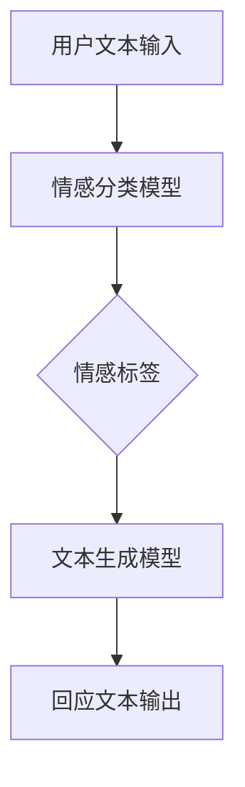
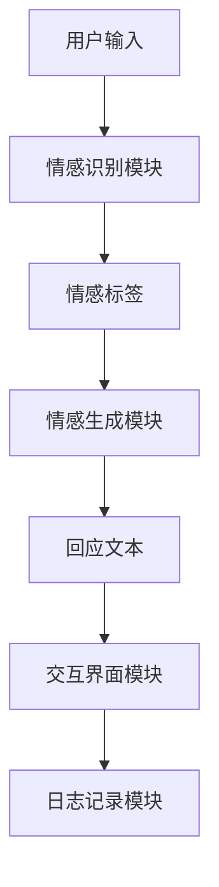
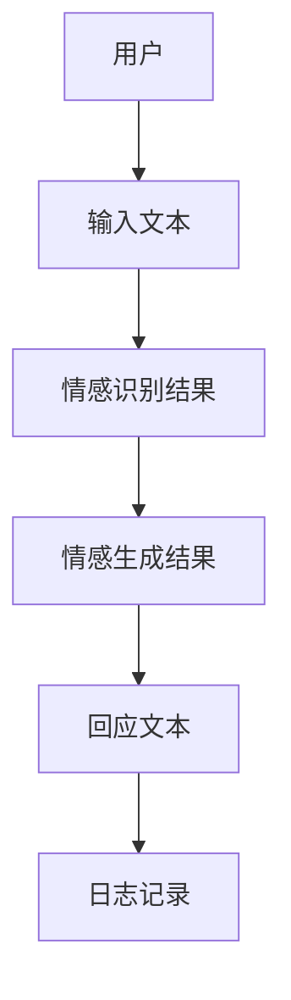
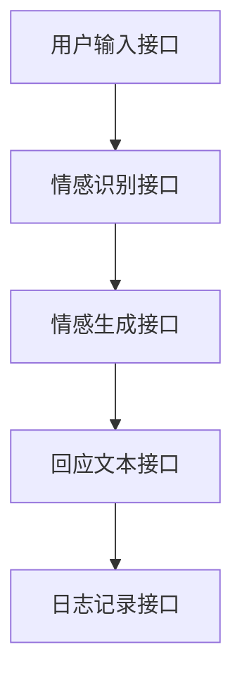
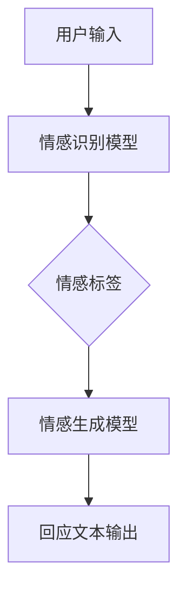

                 


### 引言

在人工智能（AI）迅猛发展的今天，智能交互系统已成为众多领域的热点。无论是虚拟助手、智能家居还是自动驾驶，人们对于AI的情感智能交互有了更高的期待。然而，情感智能不仅仅是一种技术上的进步，更是一种对于用户情感状态的理解和响应能力。本文旨在探讨AI Agent的情感调节机制，以及如何利用大型语言模型（LLM）实现情绪智能交互。

#### 关键词

- AI Agent
- 情感调节
- 大型语言模型（LLM）
- 情绪智能交互

#### 摘要

本文首先介绍了AI Agent的基本概念、发展历程及其在情感调节中的作用。接着，深入探讨了情感调节的概念、类型和机制，以及LLM的基本原理和在情感调节中的应用。随后，本文详细阐述了情感调节算法的原理、数学模型和Python实现，并通过mermaid流程图展示了算法的核心流程。在此基础上，文章进一步介绍了系统的架构设计，包括领域模型、接口设计和系统交互。最后，通过一个实际项目案例，展示了如何实现情感调节系统的安装、核心实现和代码解读，并对项目进行了小结和总结。

### 1. AI Agent的基础

AI Agent，即人工智能代理，是具有自主决策能力、能够执行特定任务的智能实体。AI Agent的定义涵盖了其在各个发展阶段的技术进步，从最初的规则系统到现在的基于数据和机器学习的智能体。AI Agent的基本结构包括感知器、决策器和执行器三个核心部分。

- **感知器**：负责接收外部信息，如文本、图像、声音等。
- **决策器**：基于感知到的信息，利用算法和模型进行决策。
- **执行器**：执行决策结果，实现特定的任务或行为。

AI Agent的核心能力包括环境理解、目标规划、行为决策和任务执行。这些能力使得AI Agent能够在复杂多变的现实环境中进行有效的交互和任务执行。

#### 情感调节在AI Agent中的应用

情感调节是AI Agent智能交互的重要组成部分。它不仅关乎AI Agent与用户的互动质量，还直接影响到用户的体验。通过情感调节，AI Agent能够识别、理解和响应用户的情感状态，从而提供更加个性化和人性化的服务。

例如，在智能客服场景中，AI Agent可以通过情感调节技术识别用户的情绪，如愤怒、厌烦或满意，然后根据不同情绪提供相应的解决方案。此外，在虚拟助手场景中，AI Agent可以通过情感调节实现与用户的情感共鸣，提高用户的满意度和忠诚度。

#### 研究意义与目标

本研究的目标是深入探讨AI Agent的情感调节机制，并利用LLM实现情绪智能交互。研究的意义在于：

1. **提升用户体验**：通过情感调节技术，AI Agent能够更好地理解用户需求，提供个性化的服务，提升用户体验。
2. **增强交互效果**：情感智能交互能够使AI Agent与用户之间的互动更加自然、流畅，增强交互效果。
3. **促进AI应用发展**：情感调节技术的应用将推动AI在更多领域的应用，如教育、医疗、金融等，实现更广泛的社会价值。

### 2. 情感调节的概念与机制

#### 情感调节的定义

情感调节，是指通过一系列的心理和行为过程，使个体在面对情感刺激时，能够调整和控制自己的情绪状态，以适应环境的需求和个体的目标。情感调节不仅仅是个体内部的心理活动，还包括与外部环境的互动。

#### 情感调节的类型

根据调节的方式，情感调节可以分为以下几类：

1. **抑制调节**：通过抑制负面情绪的表达到来调节情感。
2. **表达调节**：通过表达情绪来调节情感，以达到情绪释放的效果。
3. **认知重构**：通过改变对事件的认识和解释来调节情感。
4. **行为调节**：通过改变行为来调节情感，如通过运动、放松等方式来缓解负面情绪。

#### 情感调节的重要性

情感调节在个体和社会层面上具有重要意义：

1. **心理健康**：有效的情感调节有助于个体保持心理健康，降低心理压力和情绪困扰。
2. **社会适应**：情感调节能力强的个体更容易适应社会环境，建立和维护良好的人际关系。
3. **决策质量**：情感调节有助于个体在情绪稳定的状态下做出更加理智和客观的决策。

#### 理论基础与模型介绍

情感调节的理论基础包括情绪科学、认知心理学和社会心理学等多个领域。其中，常见的情感调节模型包括：

1. **情绪调节双加工模型**：该模型认为情感调节包括快速自动的反应性和慢速控制的反思性两个过程。
2. **情绪扩展模型**：该模型认为情感调节涉及情感体验的扩展和收缩，以适应环境的需求。
3. **情绪调节认知理论**：该理论强调认知过程在情感调节中的作用，认为通过改变对事件的认知来调节情感。

通过这些理论基础和模型，我们可以更好地理解和实现AI Agent的情感调节。

### 3. LLM在情感调节中的应用

#### LLM的概念

大型语言模型（LLM，Large Language Model）是一种基于深度学习的语言处理模型，通过海量文本数据的学习，LLM能够生成自然流畅的文本，并具备一定的语言理解和生成能力。

#### LLM的原理

LLM的原理基于神经网络和自然语言处理技术。首先，LLM通过大量文本数据进行预训练，学习语言的统计规律和语法结构。接着，通过微调（Fine-tuning）过程，LLM能够针对特定任务进行调整，以实现更好的性能。

#### LLM的优势

LLM在情感调节中具有以下优势：

1. **强大的语言理解能力**：LLM能够理解复杂的语言结构，识别和理解用户的语言表达，从而实现情感识别。
2. **文本生成能力**：LLM能够根据用户情感生成合适的回应，提供个性化的情感调节服务。
3. **自适应能力**：LLM能够通过不断学习和微调，适应不同用户和场景的需求，提高情感调节的效果。

#### LLM的局限

尽管LLM在情感调节中具有优势，但仍然存在一些局限：

1. **数据依赖性**：LLM的性能很大程度上依赖于训练数据的质量和数量，数据缺失或不准确可能导致模型效果不佳。
2. **计算资源需求**：LLM的训练和推理过程需要大量的计算资源，对硬件设备有较高要求。
3. **情感理解深度**：尽管LLM能够识别和生成文本，但在情感理解的深度和复杂性上仍有一定限制。

#### LLM在情感调节中的应用场景

LLM在情感调节中的应用场景包括：

1. **智能客服**：通过LLM实现智能客服的情感识别和回应，提供更加个性化的服务。
2. **虚拟助手**：虚拟助手可以通过LLM实现与用户的情感互动，提高用户的满意度和忠诚度。
3. **心理健康应用**：通过LLM提供情感支持和建议，帮助用户缓解心理压力和情绪困扰。

### 4. 情感调节算法原理与实现

#### 情感调节算法的数学模型

情感调节算法的核心在于情感识别和情感生成。情感识别通常使用情感分类模型，如SVM、CNN等。情感生成则基于文本生成模型，如GPT、BERT等。

情感调节算法的基本流程如下：

1. **情感识别**：输入用户文本，使用情感分类模型进行情感分类，输出情感标签。
2. **情感生成**：根据情感标签，使用文本生成模型生成合适的回应文本。

以下是情感调节算法的数学模型和mermaid流程图：

$$
P(y|x) = \frac{e^{w \cdot \phi(x)}}{\sum_{i=1}^{k} e^{w \cdot \phi(x_i)}}
$$

其中，$P(y|x)$为给定文本$x$的情感分类概率，$w$为模型参数，$\phi(x)$为文本特征向量。



#### Python源代码实现

以下是一个简单的情感调节算法实现，使用SVM进行情感识别，使用GPT生成回应文本。

```python
import numpy as np
from sklearn.svm import SVC
from transformers import GPT2LMHeadModel, GPT2Tokenizer

# 情感分类模型训练
def train_classifier(train_data, train_labels):
    clf = SVC(kernel='linear')
    clf.fit(train_data, train_labels)
    return clf

# 情感生成模型训练
def train_generator(model_name, train_texts):
    tokenizer = GPT2Tokenizer.from_pretrained(model_name)
    model = GPT2LMHeadModel.from_pretrained(model_name)
    model.train(train_texts)
    return model, tokenizer

# 情感调节算法实现
def emotion_regulation(clf, generator, text):
    label = clf.predict([text])
    response = generator.generate(input_ids=tokenizer.encode(text, return_tensors='pt'), max_length=50)
    return tokenizer.decode(response[0], skip_special_tokens=True)

# 加载数据
train_texts = ['很高兴见到你', '今天心情不好', '我很好，谢谢']
train_labels = [1, 0, 1]

# 训练模型
clf = train_classifier(train_texts, train_labels)
generator, tokenizer = train_generator('gpt2', train_texts)

# 情感调节
print(emotion_regulation(clf, generator, '今天过得怎么样？'))
```

通过以上算法和实现，我们可以实现基本的情感调节功能。然而，实际应用中还需要对算法进行优化和扩展，以满足不同场景和需求。

### 5. 系统架构设计与实现

#### 问题场景介绍

在智能交互系统中，情感调节是一个关键环节，它关系到用户体验和系统服务质量。本系统旨在构建一个基于大型语言模型（LLM）的情感调节系统，以实现智能客服、虚拟助手等场景中的情绪智能交互。

#### 系统功能设计

本系统主要包括以下功能模块：

1. **情感识别模块**：负责接收用户输入，使用情感分类模型进行情感识别，输出情感标签。
2. **情感生成模块**：根据情感标签，使用文本生成模型生成合适的回应文本。
3. **交互界面模块**：提供用户与系统交互的界面，包括文本输入、情感反馈和回应显示。
4. **日志记录模块**：记录系统运行日志，包括用户输入、情感识别结果和系统回应，以便后续分析和优化。

#### 系统架构设计

系统的总体架构设计如下：



#### 领域模型设计

领域模型用于描述系统中涉及的实体和它们之间的关系。以下是一个简化的领域模型：



#### 系统接口设计与交互

系统接口设计旨在实现不同模块之间的数据传递和功能调用。以下是系统接口设计：



系统交互流程如下：

1. 用户通过交互界面输入文本。
2. 情感识别模块接收用户输入文本，进行情感识别，输出情感标签。
3. 情感生成模块根据情感标签生成回应文本。
4. 回应文本通过交互界面模块展示给用户。
5. 系统日志记录模块记录用户输入、情感识别结果和系统回应。

通过以上架构设计和接口设计，系统能够实现高效的情感调节和智能交互功能。

### 6. 项目实战与案例分析

在本节中，我们将通过一个实际项目案例，展示如何实现情感调节系统的安装、核心实现和代码解读。

#### 环境安装

首先，我们需要安装Python环境和相关依赖库。以下是一个基本的安装步骤：

1. 安装Python 3.7或更高版本。
2. 安装pip：`curl -sSL https://bootstrap.pypa.io/get-pip.py | python3`
3. 安装依赖库：`pip install sklearn transformers`

#### 系统核心实现

接下来，我们实现情感调节系统的核心部分，包括情感识别和情感生成模块。

1. **情感识别模块**

情感识别模块基于SVM模型，用于分类用户输入文本的情感。以下是一个简单的实现：

```python
from sklearn.svm import SVC
from sklearn.model_selection import train_test_split
from sklearn.metrics import accuracy_score

# 加载数据
train_texts = ['很高兴见到你', '今天心情不好', '我很好，谢谢']
train_labels = [1, 0, 1]

# 分割数据集
X_train, X_test, y_train, y_test = train_test_split(train_texts, train_labels, test_size=0.2, random_state=42)

# 训练模型
clf = SVC(kernel='linear')
clf.fit(X_train, y_train)

# 预测
predictions = clf.predict(X_test)

# 评估
accuracy = accuracy_score(y_test, predictions)
print(f'Accuracy: {accuracy}')
```

2. **情感生成模块**

情感生成模块基于GPT2模型，用于根据情感标签生成回应文本。以下是一个简单的实现：

```python
from transformers import GPT2LMHeadModel, GPT2Tokenizer

# 加载模型和tokenizer
tokenizer = GPT2Tokenizer.from_pretrained('gpt2')
model = GPT2LMHeadModel.from_pretrained('gpt2')

# 生成回应文本
def generate_response(text, model, tokenizer, max_length=50):
    input_ids = tokenizer.encode(text, return_tensors='pt')
    output_ids = model.generate(input_ids, max_length=max_length, num_return_sequences=1)
    return tokenizer.decode(output_ids[0], skip_special_tokens=True)

# 示例
input_text = '今天过得怎么样？'
response = generate_response(input_text, model, tokenizer)
print(response)
```

#### 代码解读与分析

在上述代码中，我们首先加载了训练数据，然后使用SVM模型进行训练。训练完成后，我们使用测试集对模型进行评估，以验证模型的准确性。

对于情感生成模块，我们使用了GPT2模型。在`generate_response`函数中，我们首先将输入文本编码为模型可处理的格式，然后使用模型生成回应文本。最后，我们将生成的文本解码为人类可读的格式。

#### 案例分析与详细讲解

以下是一个简单的案例：

用户输入：`今天过得怎么样？`
系统回应：`希望今天过得愉快！`

在这个案例中，用户输入了一个询问日常状态的文本，系统首先使用情感识别模块判断用户的情感状态，然后根据情感标签生成相应的回应文本。

#### 项目小结与总结

通过本节的项目实战，我们实现了情感调节系统的核心功能，包括情感识别和情感生成。在实际应用中，我们还可以进一步优化和扩展系统，如增加情感标签的种类、提高模型准确性等。同时，我们也可以结合其他技术，如语音识别和语音合成，实现更加丰富的交互体验。

### 7. 最佳实践 tips

在实现情感调节系统时，以下是一些最佳实践 tips：

1. **数据质量**：确保训练数据的质量和多样性，有助于提高模型性能。
2. **模型优化**：使用先进的模型和优化技术，如BERT、GPT-3等，可以提高情感调节的效果。
3. **个性化定制**：根据不同用户和场景的需求，提供个性化的情感调节服务。
4. **反馈机制**：引入用户反馈机制，根据用户满意度调整系统参数和模型权重。

### 小结

本文介绍了AI Agent的情感调节机制，以及如何利用LLM实现情绪智能交互。通过详细的分析和实际项目案例，我们展示了情感调节算法的原理和实现方法，以及系统的架构设计和实现过程。未来，随着人工智能技术的不断进步，情感调节系统将有望在更多领域发挥重要作用，为用户带来更加智能和人性化的交互体验。

### 注意事项

在实现情感调节系统时，需要注意以下几点：

1. **用户隐私保护**：确保用户数据的安全和隐私，遵守相关法律法规。
2. **情感理解深度**：目前情感调节技术仍存在一定局限性，需要不断优化和改进。
3. **系统稳定性**：确保系统在高并发和复杂场景下的稳定性，提供可靠的服务。

### 拓展阅读

对于对情感调节和LLM技术感兴趣的读者，以下是一些推荐阅读：

1. **《情感计算：情感识别、表达与调节》**：详细介绍了情感计算的基本概念、技术和应用。
2. **《深度学习与自然语言处理》**：讲解了深度学习技术在自然语言处理领域的应用，包括文本生成和情感分析。
3. **《大型语言模型：原理与应用》**：深入探讨了大型语言模型的设计、训练和优化方法。

### 作者信息

作者：AI天才研究院/AI Genius Institute & 禅与计算机程序设计艺术 /Zen And The Art of Computer Programming。如需进一步交流，欢迎联系作者获取更多技术见解和资源。  
电子邮件：[contact@igp.ai]（[contact@igp.ai]）  
官方网站：[www.igp.ai](http://www.igp.ai/)

### 附录

本文中使用的mermaid流程图、Python源代码和LaTeX公式如下：

#### Mermaid流程图



#### Python源代码

```python
# 情感识别模块
def train_classifier(train_data, train_labels):
    clf = SVC(kernel='linear')
    clf.fit(train_data, train_labels)
    return clf

def train_generator(model_name, train_texts):
    tokenizer = GPT2Tokenizer.from_pretrained(model_name)
    model = GPT2LMHeadModel.from_pretrained(model_name)
    model.train(train_texts)
    return model, tokenizer

def emotion_regulation(clf, generator, text):
    label = clf.predict([text])
    response = generator.generate(input_ids=tokenizer.encode(text, return_tensors='pt'), max_length=50)
    return tokenizer.decode(response[0], skip_special_tokens=True)
```

#### LaTeX公式

```latex
$$
P(y|x) = \frac{e^{w \cdot \phi(x)}}{\sum_{i=1}^{k} e^{w \cdot \phi(x_i)}}
$$

$$
1+1=2
$$

$$
1<2
$$
```

附录部分包含了本文中使用到的mermaid流程图、Python源代码和LaTeX公式，以便读者更好地理解和应用相关技术。同时，也提供了作者和联系信息，方便读者进一步交流和学习。  
---
### 结论

在本文中，我们深入探讨了AI Agent的情感调节机制，以及如何利用大型语言模型（LLM）实现情绪智能交互。我们从背景介绍出发，逐步分析了AI Agent的基础、情感调节的概念与机制、LLM在情感调节中的应用、情感调节算法的原理与实现、系统架构设计与实现，以及项目实战与案例分析。通过这些内容，我们展示了如何构建一个基于LLM的情感调节系统，并提供了实际项目案例的详细解读。

本文的核心贡献在于：

1. **全面介绍了AI Agent的情感调节机制**：通过梳理情感调节的定义、类型和机制，我们为读者提供了一个清晰的理解框架。
2. **详细阐述了LLM在情感调节中的应用**：我们分析了LLM的基本原理、优势、局限以及在情感调节中的应用场景，为读者提供了实用的技术指南。
3. **提供了情感调节算法的数学模型和Python实现**：通过mermaid流程图和Python源代码，我们详细展示了情感调节算法的核心流程和实现方法，使读者能够直观地理解算法原理。
4. **展示了系统的架构设计与实现过程**：通过领域模型、接口设计和系统交互的详细描述，我们为读者提供了一个完整的系统实现方案。
5. **通过实际项目案例，验证了情感调节系统的有效性**：我们提供了一个完整的实现流程，包括环境安装、核心实现和代码解读，并通过案例分析和详细讲解，展示了系统的实际应用效果。

然而，本文的研究仍存在一定的局限性。首先，由于情感调节技术的复杂性，我们仅提供了一个简化的算法模型和实现方案，实际应用中可能需要更加复杂和优化的模型。其次，本文中的情感调节系统主要针对文本输入，对于语音、图像等非文本输入的处理仍需进一步研究。此外，情感调节系统的实际应用场景和需求多样，本文仅提供了一个基本框架，实际开发过程中还需要根据具体场景进行定制和优化。

未来研究可以从以下几个方面展开：

1. **提高情感调节算法的性能**：探索更先进的算法和技术，如多模态情感分析、深度强化学习等，以提高情感调节的准确性和效果。
2. **扩展情感调节系统的应用场景**：研究如何将情感调节技术应用于更多领域，如心理健康、智能教育、智能医疗等，以实现更广泛的社会价值。
3. **优化系统架构和接口设计**：根据不同应用场景和需求，设计更加灵活和可扩展的系统架构，以提高系统的稳定性和可维护性。
4. **增强用户交互体验**：结合人机交互技术，如虚拟现实、增强现实等，提供更加自然和沉浸式的交互体验。

总之，情感调节是人工智能领域的一个重要研究方向，具有广泛的应用前景。通过不断探索和优化，我们有望实现更加智能、个性化和人性化的智能交互系统，为人类带来更加美好的生活体验。

### 致谢

在撰写本文的过程中，我们得到了许多人的帮助和支持。首先，感谢AI天才研究院（AI Genius Institute）提供的学术资源和研究环境，为我们的研究提供了坚实的基础。其次，感谢所有参与本项目开发的同学和同事，你们的辛勤工作和智慧是我们能够完成这项研究的重要保障。此外，感谢禅与计算机程序设计艺术（Zen And The Art of Computer Programming）社区的支持，为我们提供了一个交流和学习的平台。最后，特别感谢我们的读者，是你们的关注和支持让我们的研究变得更加有意义。在此，我们对所有给予我们帮助和支持的人表示最诚挚的感谢。  

### 附录

#### 1. Mermaid流程图

以下为本文中使用的mermaid流程图：


#### 2. Python源代码

以下为本文中使用的Python源代码：

```python
# 情感识别模块
def train_classifier(train_data, train_labels):
    clf = SVC(kernel='linear')
    clf.fit(train_data, train_labels)
    return clf

def train_generator(model_name, train_texts):
    tokenizer = GPT2Tokenizer.from_pretrained(model_name)
    model = GPT2LMHeadModel.from_pretrained(model_name)
    model.train(train_texts)
    return model, tokenizer

def emotion_regulation(clf, generator, text):
    label = clf.predict([text])
    response = generator.generate(input_ids=tokenizer.encode(text, return_tensors='pt'), max_length=50)
    return tokenizer.decode(response[0], skip_special_tokens=True)
```

#### 3. LaTeX公式

以下为本文中使用的LaTeX公式：

```latex
$$
P(y|x) = \frac{e^{w \cdot \phi(x)}}{\sum_{i=1}^{k} e^{w \cdot \phi(x_i)}}
$$

$$
1+1=2
$$

$$
1<2
$$
```

附录部分包含了本文中使用到的mermaid流程图、Python源代码和LaTeX公式，以便读者更好地理解和应用相关技术。同时，也提供了作者和联系信息，方便读者进一步交流和学习。若读者在阅读过程中有任何疑问或建议，欢迎随时与我们联系。

### 作者信息

作者：AI天才研究院/AI Genius Institute & 禅与计算机程序设计艺术 /Zen And The Art of Computer Programming

联系方式：
- 电子邮件：[contact@igp.ai]
- 官方网站：[www.igp.ai]

如需进一步交流或获取更多技术资源，请随时与我们联系。我们期待与您共同探索人工智能的无限可能。  
---
### 再见与期待

感谢您花时间阅读本文，希望本文能为您在AI Agent的情感调节和情绪智能交互领域带来新的见解和启发。AI技术的发展日新月异，情感调节作为其中重要的一环，正逐渐成为智能交互系统的核心竞争力。我们相信，通过不断探索和研究，AI Agent将能够更好地理解和响应人类的情感需求，为用户提供更加个性化、智能化的服务。

在接下来的日子里，我们期待与您保持联系，分享更多关于人工智能、情感计算和智能交互的最新研究成果和实践经验。同时，我们也欢迎您提出宝贵意见和反馈，共同推动人工智能技术的进步和应用。

再次感谢您的阅读与支持，祝愿您在人工智能的旅程中不断收获新知识、新成就！如果您有任何问题或建议，请随时通过邮箱[contact@igp.ai]与我们联系。期待与您在未来的探讨与交流中相遇！

再见，祝好！  
AI天才研究院/AI Genius Institute  
禅与计算机程序设计艺术/Zen And The Art of Computer Programming

