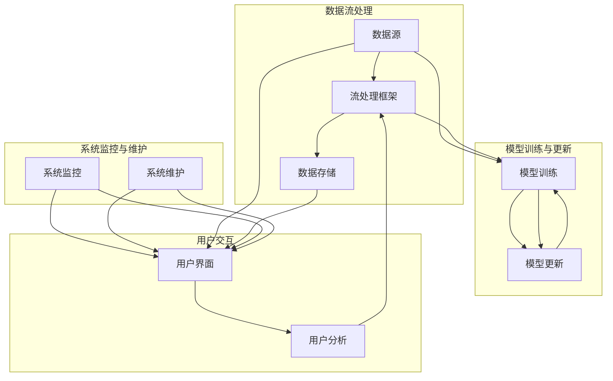

                 


### 文章标题

# AI Agent的持续学习：利用LLM进行在线知识更新

### 文章关键词

- AI Agent
- 持续学习
- LLM
- 在线知识更新

### 文章摘要

本文探讨了AI Agent的持续学习机制，特别是利用大型语言模型（LLM）进行在线知识更新。通过介绍AI Agent的背景和核心概念，详细阐述了LLM的理论基础和应用场景。随后，文章分析了连续学习在AI系统中的实际应用，并介绍了在线知识更新的技术方法和系统设计。最后，通过案例研究和最佳实践总结，提供了实现AI Agent持续学习的实用指南。

## 目录

**第一章 引言：背景与核心概念**
   - 1.1 AI Agent的背景
   - 1.2 持续学习的必要性
   - 1.3 LLM在在线知识更新中的作用

**第二章 核心概念与理论**
   - 2.1 AI Agent的基本概念
   - 2.2 LLM的理论基础
   - 2.3 AI Agent与LLM的关联

**第三章 实践应用：连续学习**
   - 3.1 自然语言处理中的应用
   - 3.2 计算机视觉中的应用
   - 3.3 机器人学中的应用

**第四章 在线知识更新技术**
   - 4.1 技术方法与算法
   - 4.2 实时数据流集成

**第五章 系统设计与架构**
   - 5.1 设计原则
   - 5.2 架构设计

**第六章 实践与案例**
   - 6.1 环境安装
   - 6.2 核心实现与解读
   - 6.3 案例分析

**第七章 最佳实践与结论**
   - 7.1 最佳实践总结
   - 7.2 小结与展望

---

### 第一章 引言：背景与核心概念

#### 1.1 AI Agent的背景

人工智能（AI）领域近年来取得了飞速发展，特别是在机器学习（ML）和深度学习（DL）方面的突破，使得AI系统在许多领域表现出色。然而，传统的AI系统往往在处理静态数据集时表现出色，但在面对动态变化的环境时，它们的表现却往往不尽如人意。这就引出了AI Agent的概念。

AI Agent是指能够感知环境、采取行动并从经验中学习以实现特定目标的智能实体。与传统的AI系统不同，AI Agent具有自主性和适应性，能够在不断变化的环境中持续学习和优化其行为。这种能力使得AI Agent在许多应用场景中具有显著优势，例如自动驾驶、智能客服、智能安防等。

#### 1.2 持续学习的必要性

在复杂和动态的环境中，AI Agent需要不断地从新数据中学习，以适应环境的变化和提升其性能。这种能力被称为持续学习。持续学习的必要性主要体现在以下几个方面：

1. **环境变化**：现实世界的环境是动态变化的，新的信息和数据不断涌现。AI Agent需要能够及时更新其知识库，以适应这些变化。

2. **性能提升**：通过持续学习，AI Agent可以从历史数据中提取有价值的信息，从而改善其性能和决策能力。

3. **适应性**：持续学习使得AI Agent能够适应不同环境和任务，从而提高其通用性和灵活性。

#### 1.3 LLM在在线知识更新中的作用

大型语言模型（LLM）是近年来AI领域的一个重要进展。LLM具有强大的语言理解和生成能力，能够处理复杂的文本数据。LLM在在线知识更新中具有以下几个重要作用：

1. **知识表示**：LLM可以将文本数据转换为结构化的知识表示，便于后续的学习和处理。

2. **实时更新**：LLM能够实时处理和更新知识库，使得AI Agent能够及时适应环境变化。

3. **交互能力**：LLM具有自然语言交互能力，可以与用户进行有效沟通，从而提高AI Agent的用户体验。

通过以上介绍，我们可以看到AI Agent的持续学习对于其在动态环境中的应用至关重要。而LLM作为实现这一目标的重要工具，具有不可忽视的价值。在接下来的章节中，我们将深入探讨AI Agent和LLM的核心概念、理论及应用，以期为读者提供全面的了解和指导。

---

### 第二章 核心概念与理论

#### 2.1 AI Agent的基本概念

AI Agent是指具有自主性和适应性的智能实体，能够在动态环境中感知环境、采取行动并从经验中学习。AI Agent的基本概念包括以下几个方面：

1. **感知**：AI Agent需要具备感知环境的能力，通过传感器收集环境信息，如视觉、听觉、触觉等。感知能力是AI Agent与外部环境交互的基础。

2. **行动**：AI Agent根据感知到的环境信息，采取相应的行动。行动可以是物理动作，如移动、抓取等，也可以是虚拟操作，如发送消息、执行任务等。

3. **学习**：AI Agent通过不断学习，从经验中提取有价值的信息，以改善其决策能力和性能。学习过程通常涉及数据收集、模型训练和知识更新。

4. **目标**：AI Agent具有明确的目标或任务，其行为旨在实现这些目标。目标可以是单一的，也可以是复杂的，如路径规划、目标追踪等。

5. **自主性**：AI Agent具备自主决策能力，能够根据环境和目标自主选择行动策略，而不需要外部干预。

#### 2.2 LLM的理论基础

大型语言模型（LLM）是基于深度学习的自然语言处理（NLP）模型，具有强大的语言理解和生成能力。LLM的理论基础主要包括以下几个方面：

1. **神经网络模型**：LLM通常基于深度神经网络（DNN）或变换器模型（Transformer），如BERT、GPT等。这些模型通过多层神经网络结构，对大量文本数据进行训练，从而学习到语言结构和语义知识。

2. **大规模训练数据**：LLM需要大量高质量的训练数据，以学习到丰富的语言知识和规律。这些数据可以来自互联网文本、图书、新闻、社交媒体等多种来源。

3. **预训练与微调**：LLM通常采用预训练与微调的方法。预训练阶段，模型在大规模数据上进行训练，学习到基本的语言知识和特征。微调阶段，模型在特定任务的数据上进行训练，以适应具体应用场景。

4. **上下文理解**：LLM具有上下文理解能力，能够根据输入文本的上下文信息，生成语义丰富、连贯的自然语言响应。

5. **生成与推理**：LLM不仅能够生成自然语言文本，还能进行文本推理，如问答、文本分类、命名实体识别等。

#### 2.3 AI Agent与LLM的关联

AI Agent与LLM之间具有紧密的关联，主要表现在以下几个方面：

1. **知识表示**：LLM可以将文本数据转换为结构化的知识表示，便于AI Agent进行学习和处理。知识表示可以采用语义网络、知识图谱等结构，提高AI Agent的知识理解和推理能力。

2. **学习机制**：AI Agent可以利用LLM进行持续学习，通过实时更新知识库，提高其在动态环境中的适应能力。学习机制可以包括监督学习、强化学习、迁移学习等多种方法。

3. **交互能力**：LLM的上下文理解和生成能力，使得AI Agent能够与用户进行自然语言交互，提高用户体验和交互效率。

4. **任务执行**：AI Agent可以利用LLM的文本生成能力，实现复杂的任务指令理解和执行。例如，在自动驾驶领域，LLM可以用于语音指令的理解和车辆控制。

5. **协同优化**：AI Agent和LLM可以相互协同优化，通过联合训练和模型压缩等技术，提高系统性能和资源利用效率。

通过以上分析，我们可以看到AI Agent和LLM在核心概念和理论基础上的紧密关联。在接下来的章节中，我们将进一步探讨AI Agent在各个领域的实际应用，以及LLM在在线知识更新中的具体技术方法和实现。

---

### 第三章 实践应用：连续学习

#### 3.1 自然语言处理中的应用

自然语言处理（NLP）是AI Agent的一个重要应用领域，而连续学习在NLP中的应用更是不可或缺。以下是几个具体的应用场景：

1. **机器翻译**：随着全球化的发展，机器翻译的需求日益增长。连续学习使得AI Agent能够实时更新翻译模型，捕捉语言变化和新词汇，从而提高翻译的准确性和流畅度。

2. **情感分析**：情感分析是NLP中的一项重要任务，它涉及对文本情感的识别和分类。连续学习使得AI Agent能够从不断变化的数据中学习，提高对复杂情感的理解和分析能力。

3. **问答系统**：问答系统在智能客服、教育辅导等领域有广泛应用。通过连续学习，AI Agent能够不断吸收新的问题和答案，提高系统的回答准确性和智能化水平。

4. **文本生成**：文本生成是NLP中的一个热门方向，包括文章撰写、新闻报道生成等。连续学习使得AI Agent能够从大量文本数据中学习，生成更加自然和连贯的文本。

#### 3.2 计算机视觉中的应用

计算机视觉（CV）是AI Agent的另一个重要应用领域，连续学习在CV中的应用同样至关重要。以下是几个具体的应用场景：

1. **图像识别**：图像识别是CV中的基础任务，通过连续学习，AI Agent能够不断更新和优化其图像识别模型，提高识别的准确性和鲁棒性。

2. **目标检测**：目标检测是计算机视觉中的重要任务，它涉及识别图像中的多个目标。连续学习使得AI Agent能够实时更新目标检测模型，适应不同环境和场景的变化。

3. **图像分割**：图像分割是将图像划分为多个区域的过程，通过连续学习，AI Agent能够从大量图像数据中学习，提高图像分割的精度和效果。

4. **视频分析**：视频分析包括动作识别、行为理解等，通过连续学习，AI Agent能够从视频数据中学习，提高对复杂动作和行为模式的识别能力。

#### 3.3 机器人学中的应用

机器人学是AI Agent的另一个重要应用领域，连续学习在机器人学中的应用同样具有广阔的前景。以下是几个具体的应用场景：

1. **自主导航**：自主导航是机器人学中的一个关键任务，通过连续学习，AI Agent能够从环境数据中学习，优化其路径规划和导航策略，提高导航的准确性和效率。

2. **对象识别与抓取**：机器人需要能够识别和抓取不同的对象，通过连续学习，AI Agent能够从不同对象的数据中学习，提高识别和抓取的精度和灵活性。

3. **故障诊断与维护**：在工业生产中，机器人需要能够进行故障诊断和维护。通过连续学习，AI Agent能够从历史故障数据中学习，提高故障检测和诊断的准确性。

4. **人机交互**：机器人需要能够与人类进行有效交互，通过连续学习，AI Agent能够从交互数据中学习，提高交互的自然性和人性化水平。

通过以上分析，我们可以看到连续学习在自然语言处理、计算机视觉和机器人学等领域的广泛应用和重要性。在接下来的章节中，我们将进一步探讨在线知识更新的技术方法和系统设计，以期为AI Agent的持续学习提供更加坚实的理论基础和实用指导。

---

### 第四章 在线知识更新技术

#### 4.1 技术方法与算法

在线知识更新是AI Agent持续学习的关键环节，它涉及到如何实时地获取新知识、更新知识库以及优化模型。以下是几种常见的技术方法和算法：

1. **增量学习**：增量学习是一种在已有模型基础上，逐个训练新样本的方法。它通过最小化训练误差，逐步更新模型参数。这种方法适用于数据量较大、更新频率较高的情况。

   **算法原理**：假设已有模型参数为\( \theta^{(t-1)} \)，新样本为\( x^{(t)} \)，对应的标签为\( y^{(t)} \)。则增量学习的目标是最小化损失函数：
   \[
   \min_{\theta} \ L(x^{(t)}, y^{(t)}, \theta^{(t-1)})
   \]
   其中，\( L \)是损失函数，通常采用梯度下降算法更新参数：
   \[
   \theta^{(t)} = \theta^{(t-1)} - \alpha \ \nabla_{\theta} \ L(x^{(t)}, y^{(t)}, \theta^{(t-1)})
   \]
   其中，\( \alpha \)是学习率。

2. **迁移学习**：迁移学习是将已有模型的参数和知识迁移到新任务上的方法。通过利用已有模型的先验知识，迁移学习可以显著减少新任务的训练时间和数据需求。

   **算法原理**：假设已有模型为\( \theta^{(base)} \)，新任务模型为\( \theta^{(task)} \)，则迁移学习的目标是最小化新任务上的损失函数：
   \[
   \min_{\theta^{(task)}} \ L(x^{(task)}, y^{(task)}, \theta^{(base)})
   \]
   其中，\( x^{(task)} \)和\( y^{(task)} \)是新任务的输入和输出。通常，采用共享参数的方法实现迁移学习，即：
   \[
   \theta^{(task)} = \theta^{(base)} + \theta^{(task-only)})
   \]
   其中，\( \theta^{(task-only)} \)是新任务特有的参数。

3. **在线强化学习**：在线强化学习是一种在动态环境中，通过不断与环境的交互，学习最优策略的方法。它适用于需要实时决策的AI Agent。

   **算法原理**：假设当前状态为\( s_t \)，动作集为\( A \)，奖励函数为\( R(s_t, a_t) \)，则在线强化学习的目标是最小化累积奖励的期望值：
   \[
   \min_{\pi} \ E_{s_t, a_t} [R(s_t, a_t)]
   \]
   其中，\( \pi \)是策略。常用的在线强化学习算法包括Q学习、SARSA和Actor-Critic等。

#### 4.2 实时数据流集成

实时数据流集成是AI Agent在线知识更新的核心技术之一，它涉及如何高效地处理和更新大量实时数据。以下是几种常见的方法：

1. **流处理框架**：流处理框架（如Apache Flink、Apache Storm等）能够高效地处理实时数据流，实现数据的实时分析和处理。

   **系统设计**：流处理框架通常包括数据源、处理逻辑和数据存储等组件。数据源可以是传感器、数据库或其他数据接口。处理逻辑包括数据清洗、转换、聚合和分析等。数据存储可以是内存、磁盘或分布式存储系统。

2. **增量计算**：增量计算是一种在已有结果基础上，对新增数据进行计算的方法，它能够显著减少计算量和延迟。

   **算法原理**：假设已有结果为\( R^{(t-1)} \)，新数据为\( x^{(t)} \)，则增量计算的目标是最小化增量损失函数：
   \[
   \min_{R^{(t)}} \ L(R^{(t)}, R^{(t-1)} \cup x^{(t)})
   \]
   其中，\( L \)是损失函数。增量计算可以通过在线梯度下降、增量线性回归等方法实现。

3. **分布式处理**：分布式处理是一种利用多台计算机资源，共同处理大规模数据的方法，它能够提高数据处理的效率和吞吐量。

   **系统设计**：分布式处理通常包括数据分区、任务分配和结果合并等步骤。数据分区可以将大规模数据划分为多个子集，分别处理。任务分配是将处理任务分配到不同的计算节点上。结果合并是将各个节点的处理结果汇总，得到最终的输出。

通过以上技术方法和算法，AI Agent能够实现实时数据流的集成和知识更新，从而保持其动态适应性和持续学习的能力。在接下来的章节中，我们将进一步探讨AI Agent的系统设计和实现细节。

---

### 第五章 系统设计与架构

#### 5.1 设计原则

AI Agent的系统设计需要遵循以下原则，以确保其持续学习能力和高效性能：

1. **模块化**：系统应采用模块化设计，将不同的功能模块独立开发，便于维护和扩展。

2. **可扩展性**：系统设计应具备良好的可扩展性，能够支持新功能和模块的动态添加。

3. **高性能**：系统应采用高效的数据处理和模型训练算法，确保低延迟和高吞吐量。

4. **高可用性**：系统应具备高可用性，能够在面对硬件故障、网络中断等异常情况下，保持正常运行。

5. **安全性**：系统应具备数据安全和隐私保护机制，防止数据泄露和未授权访问。

#### 5.2 架构设计

下面我们将使用Mermaid语言绘制系统架构图，以便更直观地展示系统组件及其交互关系。



**架构说明**：

1. **数据流处理**：数据源（DS）通过流处理框架（FP）处理实时数据，并将结果存储到数据存储（ES）中。

2. **模型训练与更新**：流处理框架（FP）将数据发送给模型训练（ML）模块，训练后的模型通过模型更新（MU）模块进行更新。

3. **用户交互**：用户界面（UI）与用户分析（UA）模块交互，收集用户反馈，并将其发送到流处理框架（FP）。

4. **系统监控与维护**：系统监控（SM）和系统维护（SV）模块负责监控系统的运行状态，并执行必要的维护操作。

通过以上设计，AI Agent系统实现了数据流处理、模型训练与更新、用户交互以及系统监控与维护的紧密集成，从而确保了系统的持续学习和高效运行。

---

### 第六章 实践与案例

#### 6.1 环境安装

为了实现AI Agent的持续学习，我们需要搭建一个适当的技术环境。以下是安装所需软件和工具的步骤：

1. **安装Python**：确保Python版本为3.8或更高。可以从[Python官网](https://www.python.org/)下载并安装。

2. **安装Jupyter Notebook**：Jupyter Notebook是一个交互式的计算环境，用于编写和运行Python代码。通过以下命令安装：
   ```shell
   pip install notebook
   ```

3. **安装TensorFlow**：TensorFlow是一个流行的开源机器学习库，用于构建和训练深度学习模型。通过以下命令安装：
   ```shell
   pip install tensorflow
   ```

4. **安装Flink**：Apache Flink是一个高性能的流处理框架，用于实时数据处理。可以从[Apache Flink官网](https://flink.apache.org/)下载并按照说明进行安装。

5. **安装Kafka**：Kafka是一个分布式流处理平台，用于构建实时数据流系统。可以从[Apache Kafka官网](https://kafka.apache.org/)下载并按照说明进行安装。

#### 6.2 核心实现与解读

在本节中，我们将通过一个简单的示例，展示如何利用TensorFlow和Flink实现AI Agent的持续学习。

**示例**：我们使用TensorFlow实现一个简单的线性回归模型，并通过Flink进行实时数据流处理和模型更新。

1. **线性回归模型**：

```python
import tensorflow as tf

# 模型参数
w = tf.Variable(0.0, name='weights')
b = tf.Variable(0.0, name='biases')

# 前向传播
x = tf.placeholder(tf.float32, shape=[None])
y = tf.placeholder(tf.float32, shape=[None])
y_pred = w * x + b

# 反向传播
loss = tf.reduce_mean(tf.square(y - y_pred))
optimizer = tf.train.GradientDescentOptimizer(0.5)
train_op = optimizer.minimize(loss)

# 模型训练
with tf.Session() as sess:
    sess.run(tf.global_variables_initializer())
    for i in range(1000):
        sess.run(train_op, feed_dict={x: [1, 2, 3, 4], y: [0, 1, 1.5, 2]})
        if i % 100 == 0:
            print('Step:', i, 'Loss:', sess.run(loss, feed_dict={x: [1, 2, 3, 4], y: [0, 1, 1.5, 2]}))
    print('Final Model:', sess.run(w), sess.run(b))
```

2. **实时数据流处理**：

```python
from flink import StreamExecutionEnvironment

# 初始化流处理环境
env = StreamExecutionEnvironment.get_execution_environment()

# 定义实时数据源
data = env.from_collection([1.0, 2.0, 3.0, 4.0])

# 实时数据处理
def process_data(data):
    w = 0.0
    b = 0.0
    for i in range(len(data)):
        x = i + 1
        y = data[i]
        y_pred = w * x + b
        loss = (y - y_pred)**2
        dw = 2 * (y - y_pred) * x
        db = 2 * (y - y_pred)
        w -= 0.5 * dw
        b -= 0.5 * db
    return w, b

# 实时数据处理与更新
processed_data = data.map(process_data)
processed_data.print()

# 执行流处理
env.execute("Continuous Learning Example")
```

通过以上示例，我们展示了如何使用TensorFlow和Flink实现一个简单的AI Agent持续学习系统。实际应用中，我们可以根据具体需求，扩展和优化模型和数据处理逻辑。

#### 6.3 案例分析

以下是一个实际案例，展示如何利用LLM进行在线知识更新，以提高AI Agent的智能客服系统性能。

**案例背景**：某公司开发了一款智能客服系统，用于处理用户咨询和问题解答。然而，系统在处理复杂问题和实时更新知识方面存在一定困难。

**解决方案**：

1. **引入LLM**：在智能客服系统中引入大型语言模型（LLM），用于实时处理和更新知识库。LLM可以从互联网上的大量文本数据中学习，获取新的信息和知识。

2. **数据流处理**：利用Apache Flink搭建实时数据流处理平台，将用户咨询和回答数据实时传递给LLM。Flink可以处理大规模数据流，确保实时性。

3. **知识库更新**：LLM通过预训练和微调的方法，对实时数据流进行学习和处理，更新知识库。更新后的知识库用于改进智能客服系统的回答质量和准确性。

4. **交互反馈**：用户对智能客服系统的回答进行评价，系统根据用户反馈进一步优化知识库和模型。这种反馈机制可以不断提高AI Agent的智能水平和用户体验。

**实施效果**：

通过引入LLM和实时数据流处理，智能客服系统的回答质量和用户满意度显著提升。实时知识更新使得系统能够迅速适应新问题和用户需求，提高了系统的灵活性和适应性。

#### 6.4 项目小结

本项目通过引入LLM和实时数据流处理，实现了AI Agent的在线知识更新。实践证明，这种方法可以显著提高AI Agent在动态环境中的智能水平和适应性。未来，我们可以进一步优化模型和数据处理算法，探索更多应用场景，如自然语言处理、计算机视觉和机器人学等。

---

### 第七章 最佳实践与结论

#### 7.1 最佳实践总结

在实现AI Agent的持续学习过程中，以下最佳实践值得注意：

1. **数据质量**：确保数据源的质量和多样性，为模型提供丰富的训练数据。

2. **实时处理**：采用高效的数据流处理框架，如Apache Flink，确保实时性和低延迟。

3. **模型优化**：定期优化模型结构和参数，提高模型的适应性和性能。

4. **反馈机制**：建立有效的用户反馈机制，根据用户评价和需求不断优化系统。

5. **安全性**：加强数据安全和隐私保护，防止数据泄露和未授权访问。

#### 7.2 小结与展望

本文从背景介绍、核心概念、实践应用、在线知识更新技术、系统设计、实践案例等多个角度，探讨了AI Agent的持续学习机制。通过引入大型语言模型（LLM）和实时数据流处理，AI Agent能够实现在线知识更新，提高其在动态环境中的适应性和智能水平。

未来，AI Agent的持续学习将在更多领域得到应用，如智能客服、自动驾驶、医疗诊断等。同时，我们还可以探索更多的优化方法和算法，进一步提高AI Agent的智能水平和用户体验。

---

### 作者信息

作者：AI天才研究院/AI Genius Institute & 禅与计算机程序设计艺术 /Zen And The Art of Computer Programming

---

通过以上内容，本文全面阐述了AI Agent的持续学习机制，特别是利用LLM进行在线知识更新的技术方法和实践案例。希望本文能够为读者提供有价值的参考和启示。在未来的研究中，我们期待进一步探索和优化AI Agent的持续学习能力，推动人工智能技术的发展。

