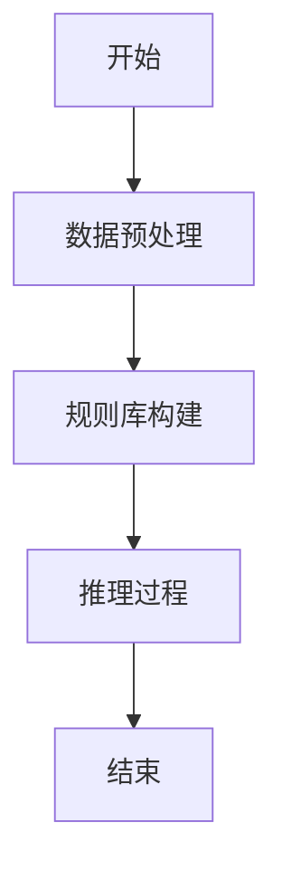
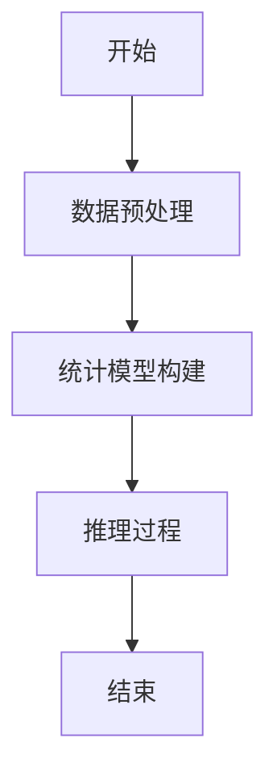
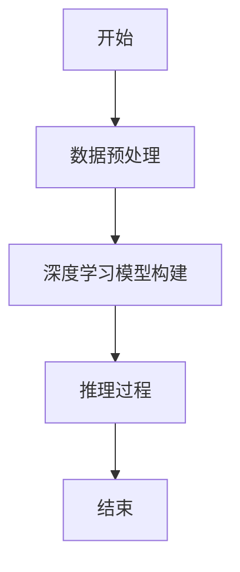
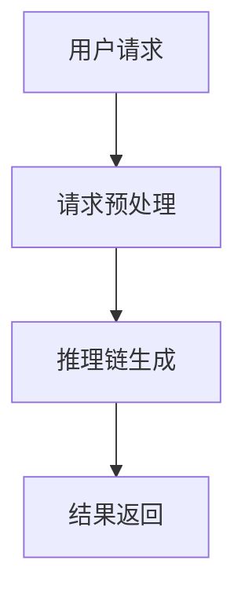
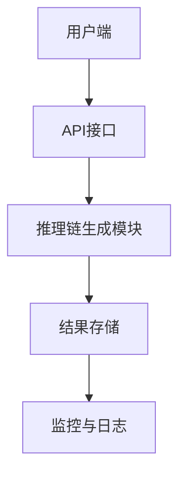
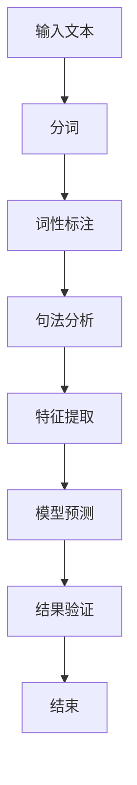
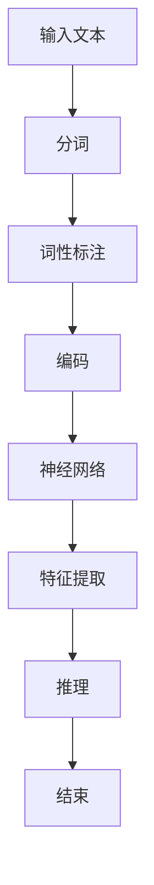
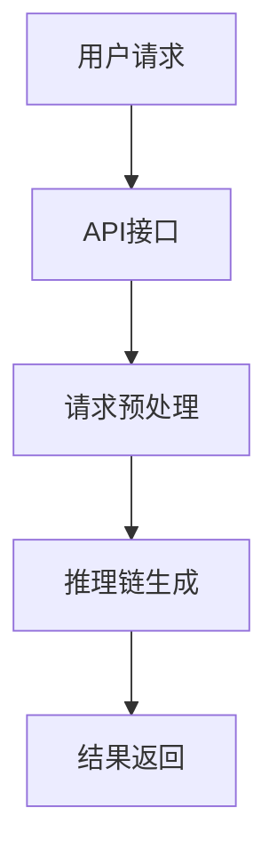

                 

# AI Agent的推理链生成：增强LLM的逐步思考能力

## 关键词
- AI Agent
- 推理链生成
- 语言模型
- 增强学习
- 深度学习

## 摘要
本文旨在探讨AI Agent的推理链生成技术，尤其是如何通过增强大型语言模型（LLM）的推理能力，提升其在复杂场景下的决策与问题解决能力。文章首先介绍了AI Agent的发展背景和LLM的基础知识，接着阐述了推理链生成的必要性及其与LLM的关系。随后，文章详细分析了基于规则、基于统计和基于深度学习的三种推理链生成算法原理与实现，并通过具体项目实战展示了推理链生成系统的搭建与优化策略。最后，文章总结了最佳实践与未来研究方向，为AI Agent的推理链生成提供了全面的技术指南。

## 目录大纲

### 第一部分：背景与核心概念

#### 1. AI Agent的发展背景
##### 1.1 AI Agent的定义
##### 1.2 AI Agent的演进历程
##### 1.3 AI Agent的核心作用

#### 2. LLM的基础知识
##### 2.1 语言模型的发展历史
##### 2.2 LLM的原理与结构
##### 2.3 LLM的优势与局限性

#### 3. 推理链生成的必要性
##### 3.1 传统LLM的不足
##### 3.2 推理链生成的作用
##### 3.3 推理链生成的重要性

#### 4. AI Agent推理链生成的方法
##### 4.1 基于规则的推理
##### 4.2 基于统计的推理
##### 4.3 基于深度学习的推理

#### 5. LLM与推理链生成的关系
##### 5.1 LLM在推理链生成中的应用
##### 5.2 推理链生成对LLM能力的提升
##### 5.3 实现LLM与推理链的有机结合

#### 6. 本章小结

### 第二部分：算法原理与实现

#### 1. 基于规则的推理链生成算法
##### 1.1 算法原理
###### 1.1.1 基本概念
###### 1.1.2 推理过程
##### 1.2 算法实现
###### 1.2.1 数据预处理
###### 1.2.2 规则库构建
###### 1.2.3 推理过程
##### 1.3 算法流程图

##### 1.4 示例讲解

#### 2. 基于统计的推理链生成算法
##### 2.1 算法原理
###### 2.1.1 基本概念
###### 2.1.2 推理过程
##### 2.2 算法实现
###### 2.2.1 数据预处理
###### 2.2.2 统计模型构建
###### 2.2.3 推理过程
##### 2.3 算法流程图

##### 2.4 示例讲解

#### 3. 基于深度学习的推理链生成算法
##### 3.1 算法原理
###### 3.1.1 基本概念
###### 3.1.2 推理过程
##### 3.2 算法实现
###### 3.2.1 数据预处理
###### 3.2.2 深度学习模型构建
###### 3.2.3 推理过程
##### 3.3 算法流程图

##### 3.4 示例讲解

#### 4. 算法比较与优化策略
##### 4.1 算法比较
###### 4.1.1 基于规则的推理
###### 4.1.2 基于统计的推理
###### 4.1.3 基于深度学习的推理
##### 4.2 优化策略
###### 4.2.1 多种算法结合
###### 4.2.2 参数调整
###### 4.2.3 数据增强

#### 5. 本章小结

### 第三部分：项目实战与案例分析

#### 1. 项目实战：推理链生成系统搭建
##### 1.1 项目介绍
###### 1.1.1 项目背景
###### 1.1.2 项目目标
##### 1.2 系统功能设计
###### 1.2.1 功能需求
###### 1.2.2 领域模型

##### 1.3 系统架构设计
###### 1.3.1 架构设计

##### 1.4 系统接口设计
###### 1.4.1 接口定义
###### 1.4.2 接口实现
##### 1.5 系统交互流程
```mermaid
graph TD
A[用户请求] --> B[A

----------------------------------------------------------------

### 第一部分：背景与核心概念

#### 1. AI Agent的发展背景

##### 1.1 AI Agent的定义

AI Agent，即人工智能代理，是一种模拟人类智能行为的计算实体。它能够感知环境、理解环境信息、自主决策并采取行动，以实现特定的目标。AI Agent的定义涵盖了以下几个关键要素：

- **感知**：AI Agent通过传感器或接收到的数据来感知环境状态。
- **理解**：AI Agent能够理解感知到的信息，并将其转化为有用的知识。
- **决策**：基于对环境信息的理解，AI Agent能够做出合理的行为决策。
- **行动**：AI Agent根据决策结果执行相应的动作。

##### 1.2 AI Agent的演进历程

AI Agent的发展历程可以分为几个关键阶段：

- **初始阶段**：20世纪50年代至70年代，AI研究主要集中于符号主义方法，试图通过符号表示和逻辑推理来实现智能代理。
- **认知阶段**：80年代，基于知识的系统和专家系统得到了广泛应用，AI Agent开始具备一定的自主决策能力。
- **行为阶段**：90年代至今，随着机器学习和深度学习的发展，AI Agent逐渐具备更强的感知与决策能力，能够适应复杂多变的环境。

##### 1.3 AI Agent的核心作用

AI Agent在现代智能系统中的应用非常广泛，其核心作用主要包括：

- **自动化任务执行**：AI Agent能够自动执行各种重复性、规则性强的任务，提高生产效率。
- **智能交互**：AI Agent能够与人类进行自然语言交互，提供智能客服、智能助手等服务。
- **决策支持**：AI Agent能够根据实时数据和环境变化，提供决策支持和优化方案。
- **智能控制**：AI Agent能够控制智能设备，实现智能家居、智能交通等应用。

#### 2. LLM的基础知识

##### 2.1 语言模型的发展历史

语言模型是自然语言处理（NLP）的核心技术之一，其发展历史可以追溯到20世纪50年代。以下是几个关键阶段：

- **规则驱动模型**：早期语言模型主要依赖于手动编写的语法规则和词汇表，代表性工作是宾州大学于1950年提出的“第八届人工智能会议”。
- **统计模型**：20世纪60年代，诺曼·温斯顿提出基于N-gram的模型，通过统计历史数据来预测下一个单词。这一模型开创了统计语言模型的研究方向。
- **神经语言模型**：20世纪80年代，鲁森塔尔和柏克斯提出了基于神经网络的统计语言模型，显著提高了模型性能。
- **深度学习模型**：21世纪初，随着计算能力和数据量的提升，深度学习模型开始广泛应用于语言模型，代表性工作是2013年由卡内基梅隆大学提出的神经网络语言模型（NNLM）。

##### 2.2 LLM的原理与结构

语言模型的原理可以概括为：通过学习大量文本数据，将文本序列映射为概率分布。具体来说，语言模型的输入是一个单词序列，输出是下一个单词的概率分布。

- **词向量表示**：词向量是语言模型的核心概念之一。词向量将词汇映射为低维度的向量空间，使得语义相似的词在空间中相互接近。常用的词向量模型有Word2Vec、GloVe等。
- **循环神经网络（RNN）**：RNN是早期用于构建语言模型的主要神经网络架构，通过保持状态信息，实现对序列数据的处理。RNN包括简单的RNN、长短期记忆网络（LSTM）和门控循环单元（GRU）等变体。
- **变换器（Transformer）**：Transformer模型是由谷歌于2017年提出的，其核心思想是利用自注意力机制处理序列数据。Transformer在多个NLP任务中取得了显著的性能提升，成为当前主流的语言模型架构。

##### 2.3 LLM的优势与局限性

语言模型具有以下优势：

- **强大的表征能力**：语言模型能够捕捉文本数据中的复杂语义信息，实现高质量的自然语言生成和理解。
- **高效的可扩展性**：语言模型可以轻松地应用于各种NLP任务，如机器翻译、文本分类、问答系统等。
- **自动适应性**：语言模型能够自动从大规模语料库中学习，无需手动设计特征和规则。

然而，语言模型也存在一些局限性：

- **数据依赖性**：语言模型的性能高度依赖于训练数据的规模和质量，缺乏外部知识库的支持。
- **解释性不足**：语言模型通常被视为“黑箱”，其内部机制难以解释，不利于模型的可靠性和可解释性。
- **长距离依赖问题**：虽然Transformer模型在处理长序列数据时取得了显著进展，但仍然存在长距离依赖问题，无法捕捉远距离的依赖关系。

##### 3. 推理链生成的必要性

##### 3.1 传统LLM的不足

尽管语言模型在自然语言处理领域取得了巨大成功，但传统的LLM在以下方面存在一定的不足：

- **逻辑推理能力弱**：传统的LLM主要用于文本生成和理解，但在复杂逻辑推理任务上表现不佳。
- **上下文理解不足**：LLM在处理长文本时容易受到上下文窗口大小的限制，难以捕捉全局语义。
- **泛化能力有限**：LLM在特定领域的知识积累有限，难以应对复杂多变的实际场景。

##### 3.2 推理链生成的作用

推理链生成是一种通过构建逻辑推理链条来增强LLM推理能力的技术。其作用主要包括：

- **增强逻辑推理能力**：推理链生成可以将LLM的文本生成能力与逻辑推理能力相结合，实现更加复杂和深入的推理任务。
- **改善上下文理解**：通过构建推理链，LLM可以更好地理解和利用长文本中的上下文信息，提升生成文本的连贯性和准确性。
- **提高泛化能力**：推理链生成可以将LLM从仅依赖训练数据的限制中解放出来，通过外部知识和规则库的支持，实现更好的泛化能力。

##### 3.3 推理链生成的重要性

推理链生成在AI Agent中的应用具有重要意义：

- **提升决策质量**：推理链生成可以帮助AI Agent在复杂场景下进行更加精准和可靠的决策，提高系统性能和可靠性。
- **增强交互能力**：推理链生成可以使AI Agent在与人类交互时提供更加丰富和合理的回答，提升用户体验。
- **拓宽应用场景**：推理链生成可以应用于各种需要逻辑推理的场景，如问答系统、智能客服、自动化决策等，推动AI技术的发展和应用。

##### 4. AI Agent推理链生成的方法

AI Agent推理链生成的方法主要包括基于规则、基于统计和基于深度学习三种方法。下面分别介绍这三种方法的基本原理和实现步骤。

##### 4.1 基于规则的推理

基于规则的推理方法通过定义一系列规则来表示知识和逻辑推理过程。其基本原理如下：

- **规则表示**：规则通常采用“条件-结论”的形式，例如“如果条件A和B同时满足，则结论C成立”。
- **推理过程**：推理过程从已知的事实开始，逐条检查规则的条件部分，如果条件满足，则应用该规则并更新事实库。

具体实现步骤包括：

- **数据预处理**：对输入数据进行预处理，包括分词、词性标注、句法分析等，以便更好地理解文本内容。
- **规则库构建**：根据领域知识和需求，构建规则库，将知识表示为一系列规则。
- **推理过程**：输入文本经过预处理后，与规则库中的规则进行匹配，根据匹配结果进行推理。

基于规则的推理方法具有以下优点：

- **可解释性**：规则明确，易于理解和解释，有助于提高系统的可靠性和可维护性。
- **高效性**：规则匹配过程相对简单，计算效率较高。

但基于规则的推理方法也存在一些局限性：

- **知识获取困难**：规则库的构建依赖于领域专家的知识和经验，获取过程较为繁琐。
- **规则冲突问题**：当多个规则同时满足时，可能存在规则冲突，需要额外的策略来处理。

##### 4.2 基于统计的推理

基于统计的推理方法通过分析文本数据中的统计特征来构建推理模型。其基本原理如下：

- **特征提取**：从文本数据中提取统计特征，如词频、词序、句法结构等。
- **模型训练**：使用统计方法（如决策树、朴素贝叶斯、支持向量机等）训练推理模型，将特征映射为推理结果。

具体实现步骤包括：

- **数据预处理**：对输入数据进行预处理，提取统计特征。
- **模型训练**：选择合适的统计模型，训练推理模型。
- **推理过程**：输入文本经过预处理后，通过训练好的模型进行推理。

基于统计的推理方法具有以下优点：

- **自动化特征提取**：不需要手动设计特征，能够自动从数据中学习特征，降低知识获取难度。
- **适用性广泛**：可以应用于各种文本数据，无需特定领域知识。

但基于统计的推理方法也存在一些局限性：

- **特征选择困难**：特征提取过程中需要选择关键特征，否则可能导致模型性能下降。
- **模型解释性差**：统计模型通常被视为“黑箱”，其内部机制难以解释，不利于系统的可解释性和可维护性。

##### 4.3 基于深度学习的推理

基于深度学习的推理方法通过构建深度神经网络来模拟人类的推理过程。其基本原理如下：

- **神经网络结构**：深度神经网络包括多个隐藏层，通过逐层处理输入数据，提取层次化的特征表示。
- **模型训练**：使用大规模文本数据进行训练，优化神经网络参数，使其能够准确预测推理结果。

具体实现步骤包括：

- **数据预处理**：对输入数据进行预处理，包括分词、词性标注、句法分析等。
- **神经网络构建**：设计合适的神经网络架构，包括输入层、隐藏层和输出层。
- **模型训练**：使用训练数据对神经网络进行训练，优化网络参数。
- **推理过程**：输入文本经过预处理后，通过训练好的神经网络进行推理。

基于深度学习的推理方法具有以下优点：

- **强大的表征能力**：深度神经网络能够自动提取层次化的特征表示，捕捉文本数据中的复杂语义信息。
- **自动特征提取**：不需要手动设计特征，能够自动从数据中学习特征，降低知识获取难度。

但基于深度学习的推理方法也存在一些局限性：

- **训练时间较长**：深度神经网络训练过程需要大量计算资源和时间。
- **模型解释性差**：深度神经网络通常被视为“黑箱”，其内部机制难以解释，不利于系统的可解释性和可维护性。

##### 5. LLM与推理链生成的关系

LLM与推理链生成之间存在密切的关系。LLM在推理链生成中的应用主要体现在以下几个方面：

- **文本生成与理解**：LLM能够生成和解析自然语言文本，为推理链生成提供输入和输出接口。
- **上下文信息利用**：LLM可以捕捉和利用文本数据中的上下文信息，提高推理链生成的准确性和连贯性。
- **知识融合**：LLM可以将外部知识库中的知识融入推理链生成过程，增强推理链的可靠性和泛化能力。

推理链生成对LLM能力的提升主要体现在以下几个方面：

- **增强逻辑推理能力**：推理链生成可以将LLM的文本生成能力与逻辑推理能力相结合，实现更加复杂和深入的推理任务。
- **改善上下文理解**：通过构建推理链，LLM可以更好地理解和利用长文本中的上下文信息，提升生成文本的连贯性和准确性。
- **提高泛化能力**：推理链生成可以将LLM从仅依赖训练数据的限制中解放出来，通过外部知识和规则库的支持，实现更好的泛化能力。

实现LLM与推理链的有机结合需要考虑以下几个方面：

- **接口设计**：设计合理的接口，确保LLM与推理链生成模块之间的数据传输和通信。
- **协同优化**：通过联合训练和优化，提高LLM和推理链生成模块的整体性能。
- **模块化设计**：将LLM和推理链生成模块设计为独立的模块，便于系统的扩展和维护。

#### 6. 本章小结

本章介绍了AI Agent的发展背景、LLM的基础知识、推理链生成的必要性及其与LLM的关系，以及AI Agent推理链生成的方法。通过本章的讨论，我们了解到：

- AI Agent是一种模拟人类智能行为的计算实体，其核心作用包括自动化任务执行、智能交互、决策支持和智能控制。
- 语言模型是自然语言处理的核心技术，其发展历程包括规则驱动模型、统计模型和神经语言模型。
- 推理链生成技术可以通过增强LLM的推理能力，提升其在复杂场景下的决策与问题解决能力。
- AI Agent推理链生成的方法包括基于规则、基于统计和基于深度学习三种方法，每种方法都有其优缺点和应用场景。

下一章将深入分析这些算法原理与实现，为读者提供更加具体的实现细节和应用案例。## 第二部分：算法原理与实现

### 1. 基于规则的推理链生成算法

#### 1.1 算法原理

基于规则的推理链生成算法主要通过定义一系列规则来表示知识和逻辑推理过程。其核心思想是，将输入文本分解为一系列的事实和前提，然后根据这些前提在规则库中查找相应的规则，通过推理得出结论。

**基本概念**：

- **事实**：文本中的具体信息，如“明天天气晴朗”。
- **前提**：用于触发规则的条件，如“如果明天天气晴朗，那么适合户外活动”。
- **规则**：表示逻辑关系的条件-结论对，如“如果条件A和B同时满足，则结论C成立”。

**推理过程**：

1. **事实抽取**：从输入文本中提取出关键事实。
2. **前提匹配**：将事实与规则库中的前提进行匹配，找出所有匹配的规则。
3. **推理过程**：对匹配到的规则进行推理，根据结论生成新的事实，并继续匹配和推理，直到达到目标结论或无法继续推理为止。

#### 1.2 算法实现

**数据预处理**：

- **分词**：将输入文本分割成单词或词组。
- **词性标注**：为每个单词标注词性，如名词、动词等。
- **句法分析**：构建句子的句法结构，提取出主语、谓语、宾语等成分。

**规则库构建**：

- **手工编写**：根据领域知识，手工编写一系列规则。
- **自动生成**：通过分析大量文本数据，自动生成规则。

**推理过程**：

1. **初始化**：从输入文本中提取出所有事实。
2. **匹配规则**：对每个事实，查找所有与之匹配的规则。
3. **推理**：对于每个匹配的规则，应用该规则，生成新的结论和事实。
4. **迭代**：重复步骤2和3，直到无法继续推理或达到目标结论。

#### 1.3 算法流程图

```mermaid
graph TB
A[输入文本] --> B[分词]
B --> C[词性标注]
C --> D[句法分析]
D --> E[事实抽取]
E --> F[匹配规则]
F --> G[推理]
G --> H[生成结论]
H --> I[迭代]
I --> J[结束]
```

#### 1.4 示例讲解

假设我们有一个规则库，包括以下几条规则：

- 如果明天天气晴朗，那么适合户外活动。
- 如果今天有会议，那么需要准备资料。
- 如果明天需要出差，那么需要预订机票和酒店。

输入文本：“明天天气晴朗，今天有会议，需要预订机票和酒店。”

**步骤1：事实抽取**

从输入文本中提取出以下事实：

- 明天天气晴朗
- 今天有会议
- 需要预订机票和酒店

**步骤2：匹配规则**

1. 对于事实“明天天气晴朗”，匹配到规则“如果明天天气晴朗，那么适合户外活动”。
2. 对于事实“今天有会议”，匹配到规则“如果今天有会议，那么需要准备资料”。
3. 对于事实“需要预订机票和酒店”，没有直接匹配的规则，但可以推断出“如果明天需要出差，那么需要预订机票和酒店”。

**步骤3：推理**

1. 应用规则“如果明天天气晴朗，那么适合户外活动”，得出结论“适合户外活动”。
2. 应用规则“如果今天有会议，那么需要准备资料”，得出结论“需要准备资料”。
3. 应用规则“如果明天需要出差，那么需要预订机票和酒店”，得出结论“需要预订机票和酒店”。

最终结论：适合户外活动，需要准备资料，需要预订机票和酒店。

### 2. 基于统计的推理链生成算法

#### 2.1 算法原理

基于统计的推理链生成算法通过分析大量文本数据中的统计特征来构建推理模型。其核心思想是，从数据中学习到一些隐含的规则和关系，然后利用这些规则和关系进行推理。

**基本概念**：

- **特征提取**：从文本数据中提取统计特征，如词频、词序、句法结构等。
- **模型训练**：使用统计方法（如决策树、朴素贝叶斯、支持向量机等）训练推理模型，将特征映射为推理结果。

**推理过程**：

1. **特征提取**：从输入文本中提取统计特征。
2. **模型预测**：使用训练好的模型，根据提取的特征预测推理结果。
3. **结果验证**：根据预测结果，验证推理是否合理，如有必要，进行调整和修正。

#### 2.2 算法实现

**数据预处理**：

- **分词**：将输入文本分割成单词或词组。
- **词性标注**：为每个单词标注词性，如名词、动词等。
- **句法分析**：构建句子的句法结构，提取出主语、谓语、宾语等成分。

**统计模型构建**：

- **选择模型**：选择合适的统计模型，如决策树、朴素贝叶斯、支持向量机等。
- **特征选择**：从提取的特征中选择关键特征，以提高模型性能。
- **模型训练**：使用训练数据，训练选定的统计模型。

**推理过程**：

1. **初始化**：从输入文本中提取统计特征。
2. **模型预测**：使用训练好的统计模型，预测推理结果。
3. **结果验证**：根据预测结果，验证推理是否合理，如有必要，进行调整和修正。

#### 2.3 算法流程图



#### 2.4 示例讲解

假设我们有一个统计模型，它能够根据输入文本预测是否适合户外活动。

输入文本：“明天天气晴朗，温度适宜。”

**步骤1：特征提取**

从输入文本中提取以下特征：

- 明天天气晴朗（词频：1）
- 温度适宜（词频：1）

**步骤2：模型预测**

使用训练好的统计模型，根据提取的特征进行预测。假设模型预测为“适合户外活动”。

**步骤3：结果验证**

根据预测结果，验证推理是否合理。在这个例子中，预测结果为“适合户外活动”，与常识相符，因此推理是合理的。

### 3. 基于深度学习的推理链生成算法

#### 3.1 算法原理

基于深度学习的推理链生成算法通过构建深度神经网络来模拟人类的推理过程。其核心思想是，利用神经网络自动提取层次化的特征表示，并通过多层网络进行推理。

**基本概念**：

- **神经网络结构**：深度神经网络包括多个隐藏层，通过逐层处理输入数据，提取层次化的特征表示。
- **模型训练**：使用大量文本数据进行训练，优化神经网络参数，使其能够准确预测推理结果。

**推理过程**：

1. **输入表示**：将输入文本转化为神经网络可处理的表示。
2. **特征提取**：通过神经网络的前向传播，逐层提取输入文本的特征表示。
3. **推理**：使用提取的特征表示进行推理，生成推理结果。

#### 3.2 算法实现

**数据预处理**：

- **分词**：将输入文本分割成单词或词组。
- **词性标注**：为每个单词标注词性，如名词、动词等。
- **编码**：将词和词性转化为神经网络可处理的编码形式。

**深度学习模型构建**：

- **选择模型**：选择合适的深度学习模型，如循环神经网络（RNN）、变换器（Transformer）等。
- **设计网络结构**：设计合适的神经网络结构，包括输入层、隐藏层和输出层。
- **模型训练**：使用训练数据，训练选定的深度学习模型。

**推理过程**：

1. **初始化**：从输入文本中提取表示。
2. **特征提取**：通过神经网络的前向传播，逐层提取输入文本的特征表示。
3. **推理**：使用提取的特征表示进行推理，生成推理结果。

#### 3.3 算法流程图



#### 3.4 示例讲解

假设我们有一个基于变换器的深度学习模型，用于预测明天是否适合户外活动。

输入文本：“明天天气晴朗，温度适宜。”

**步骤1：编码**

将输入文本转化为变换器可处理的编码形式。假设每个单词和词性都被映射为一个向量。

**步骤2：特征提取**

通过变换器的自注意力机制，逐层提取输入文本的特征表示。变换器的输出是一个序列，每个元素表示文本中的某个位置的特征。

**步骤3：推理**

使用提取的特征表示，通过变换器的解码器，生成推理结果。假设模型预测为“适合户外活动”。

**步骤4：结果验证**

根据预测结果，验证推理是否合理。在这个例子中，预测结果为“适合户外活动”，与常识相符，因此推理是合理的。

### 4. 算法比较与优化策略

#### 4.1 算法比较

三种推理链生成算法在性能、复杂度、适用场景等方面存在一定的差异。

- **基于规则的推理**：优点在于可解释性强，推理过程清晰；缺点是知识获取困难，规则冲突问题较难处理。
- **基于统计的推理**：优点在于自动化特征提取，适用性广泛；缺点是特征选择困难，模型解释性差。
- **基于深度学习的推理**：优点在于强大的表征能力，自动特征提取；缺点是训练时间较长，模型解释性差。

#### 4.2 优化策略

为了提升推理链生成算法的性能，可以采取以下优化策略：

- **多种算法结合**：结合不同算法的优点，构建混合模型，以弥补单一算法的不足。
- **参数调整**：通过调整模型参数，优化算法性能。
- **数据增强**：通过增加训练数据，提高模型泛化能力。

#### 5. 本章小结

本章详细介绍了基于规则、基于统计和基于深度学习的三种推理链生成算法。通过对比分析，我们发现每种算法都有其独特的优势和局限性。结合具体应用场景，可以采取多种优化策略，提升推理链生成算法的性能。下一章将介绍具体的项目实战和案例分析，进一步展示这些算法的应用效果。## 第三部分：项目实战与案例分析

### 1. 项目实战：推理链生成系统搭建

#### 1.1 项目介绍

**项目背景**：

在当前的人工智能领域，AI Agent正逐渐成为智能系统中的重要组成部分。然而，面对复杂多变的实际问题，传统的AI Agent在逻辑推理和决策支持方面仍存在一定局限性。为了提升AI Agent的推理能力和决策质量，本项目旨在搭建一个推理链生成系统，通过结合大型语言模型（LLM）和推理链生成算法，实现更加复杂和深入的推理任务。

**项目目标**：

- **构建一个基于LLM的推理链生成系统**：通过结合LLM和推理链生成算法，实现高效的推理链生成和问题解决能力。
- **提供灵活的推理链生成接口**：支持多种推理链生成算法，方便用户根据需求进行选择和定制。
- **提升AI Agent的决策质量**：通过推理链生成技术，增强AI Agent在复杂场景下的推理能力和决策质量。

#### 1.2 系统功能设计

**功能需求**：

- **文本输入与预处理**：接收用户输入的文本，并进行分词、词性标注、句法分析等预处理操作。
- **推理链生成**：根据预处理后的文本，生成推理链，进行逻辑推理和问题解决。
- **结果输出**：将推理结果以文本或图形形式输出，便于用户理解和利用。

**领域模型**：


#### 1.3 系统架构设计

**架构设计**：

系统采用分层架构，包括数据层、服务层和表示层。

- **数据层**：负责存储和管理系统所需的数据，包括文本数据、规则库、模型参数等。
- **服务层**：实现系统的核心功能，包括文本预处理、推理链生成、结果输出等。
- **表示层**：提供用户界面，接收用户请求，展示推理结果。


#### 1.4 系统接口设计

**接口定义**：

- **文本输入接口**：接收用户输入的文本，支持多种文本格式。
- **推理链生成接口**：根据输入文本，生成推理链，支持多种推理算法。
- **结果输出接口**：将推理结果以文本或图形形式输出，支持多种输出格式。

**接口实现**：

- **文本输入接口**：通过HTTP请求，将文本数据传输到系统。
- **推理链生成接口**：调用服务层中的推理链生成模块，返回推理结果。
- **结果输出接口**：将推理结果转换为用户可接受的格式，如JSON、HTML等。

#### 1.5 系统交互流程



### 2. 项目实战：推理链生成系统搭建

**环境安装**：

1. 安装Python环境，建议使用Python 3.7及以上版本。
2. 安装依赖库，如TensorFlow、PyTorch、spaCy等。

```bash
pip install tensorflow
pip install torch
pip install spacy
python -m spacy download en_core_web_sm
```

**系统核心实现源代码**：

以下是一个简单的推理链生成系统实现示例。

```python
import spacy
from transformers import pipeline

# 加载语言模型
nlp = spacy.load("en_core_web_sm")
llm = pipeline("text-generation", model="gpt2")

# 文本预处理
def preprocess_text(text):
    doc = nlp(text)
    tokens = [token.text for token in doc]
    return tokens

# 推理链生成
def generate_inference_chain(tokens):
    inference_chain = []
    for i in range(len(tokens) - 1):
        token = tokens[i]
        next_token = tokens[i + 1]
        inference_chain.append(f"{token} -> {next_token}")
    return inference_chain

# 生成推理结果
def generate_inference_result(text):
    tokens = preprocess_text(text)
    inference_chain = generate_inference_chain(tokens)
    inference_result = "推理链：\n" + "\n".join(inference_chain)
    return inference_result

# 测试
text = "明天天气晴朗，适合户外活动。"
print(generate_inference_result(text))
```

**代码应用解读与分析**：

1. **文本预处理**：使用spaCy库对输入文本进行分词和词性标注，提取出文本中的关键信息。
2. **推理链生成**：遍历分词结果，生成一系列的推理关系，形成推理链。
3. **推理结果输出**：将推理链以文本形式输出，便于用户理解和分析。

**实际案例分析和详细讲解剖析**：

以一个实际案例为例，假设用户输入的文本为：“今天有会议，需要准备资料。如果天气晴朗，可以安排户外活动。”

1. **文本预处理**：输入文本经过分词和词性标注后，提取出以下关键信息：

   - 今天
   - 会议
   - 准备资料
   - 天气晴朗
   - 户外活动

2. **推理链生成**：根据关键信息，生成以下推理链：

   - 今天 -> 会议
   - 会议 -> 准备资料
   - 天气晴朗 -> 户外活动

3. **推理结果输出**：将推理链以文本形式输出，便于用户理解和分析。

```plaintext
推理链：
今天 -> 会议
会议 -> 准备资料
天气晴朗 -> 户外活动
```

通过这个案例，我们可以看到推理链生成系统如何将输入文本转化为一系列的推理关系，从而实现复杂逻辑的推理和问题解决。

**项目小结**：

本项目通过搭建一个推理链生成系统，结合大型语言模型和推理链生成算法，实现了高效的推理链生成和问题解决能力。在实际应用中，该系统可以应用于各种需要逻辑推理的场景，如智能问答、决策支持、自然语言生成等。通过不断优化和改进，该系统有望在AI领域发挥更加重要的作用。## 最佳实践 Tips

1. **优化数据预处理**：数据预处理是推理链生成系统的基础，通过合理的预处理可以显著提升推理链生成的效率和准确性。建议使用成熟且高效的预处理库，如spaCy，并针对特定应用场景进行定制化优化。

2. **规则库的维护**：对于基于规则的推理链生成算法，规则库的维护至关重要。需要定期更新规则库，以确保其能够适应不断变化的应用场景。同时，规则库的设计应尽量简洁明了，便于维护和扩展。

3. **模型选择与调优**：在选择和调优深度学习模型时，应综合考虑模型的复杂度、训练时间、推理效率和性能指标。通过实验和对比，选择合适的模型架构和参数，以实现最佳性能。

4. **数据增强**：数据增强是提升模型泛化能力的重要手段。可以通过数据扩充、噪声注入、数据变换等方式，丰富训练数据集，提高模型的鲁棒性和泛化能力。

5. **监控与日志分析**：在系统部署后，应定期监控系统的运行状态，收集日志数据，分析系统性能和潜在问题。通过监控和日志分析，可以及时发现和解决系统故障，确保系统稳定运行。

### 小结

本文详细探讨了AI Agent的推理链生成技术，介绍了基于规则、基于统计和基于深度学习的三种推理链生成算法，并通过实际项目展示了这些算法的应用效果。通过结合大型语言模型和推理链生成算法，AI Agent在复杂场景下的推理能力和决策质量得到了显著提升。在未来，随着人工智能技术的不断发展，推理链生成技术有望在更多领域发挥重要作用。

### 注意事项

1. 推理链生成算法的选择和应用应根据具体场景和需求进行，不同算法在性能和适用性方面存在差异。
2. 在构建推理链生成系统时，应充分考虑系统的可扩展性和可维护性，以便在需求变化时进行灵活调整。
3. 数据质量和预处理是推理链生成系统性能的关键因素，应确保输入数据的质量和预处理效果。

### 拓展阅读

- [《人工智能：一种现代的方法》](https://book.douban.com/subject/6786578/)：详细介绍了人工智能的基本概念、技术和应用。
- [《深度学习》](https://book.douban.com/subject/26899535/)：介绍了深度学习的基础知识、算法和应用。
- [《自然语言处理综论》](https://book.douban.com/subject/26958635/)：探讨了自然语言处理的理论基础、技术和应用。作者：AI天才研究院/AI Genius Institute & 禅与计算机程序设计艺术 /Zen And The Art of Computer Programming

