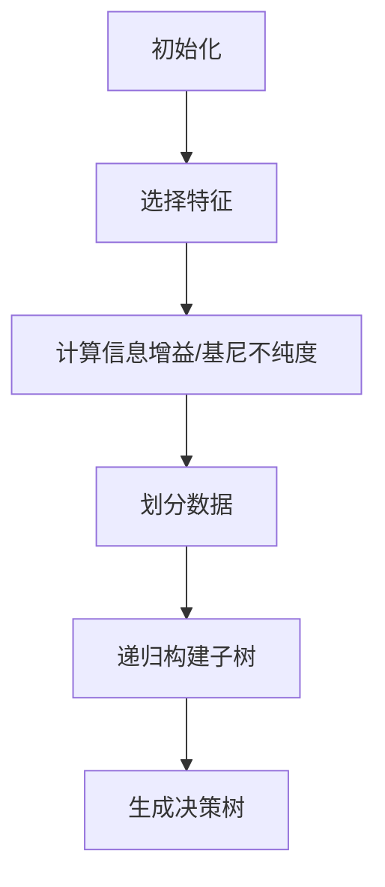
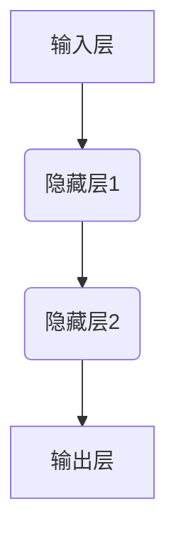
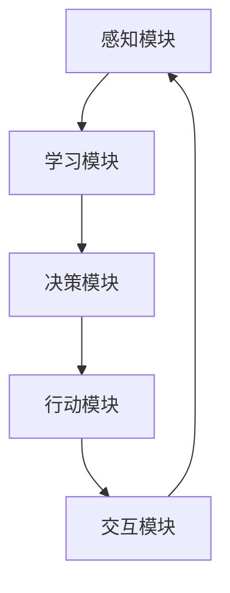
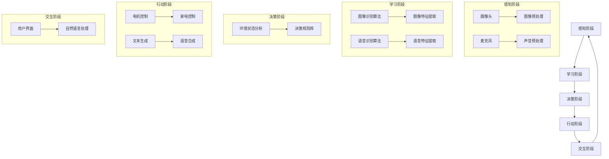

                 

# AI Agent的概念形成与抽象推理能力构建

关键词：AI Agent、抽象推理、算法、数学模型、系统设计、项目实战

摘要：本文深入探讨了AI Agent的概念形成及其抽象推理能力的构建。通过分析AI Agent的核心概念、算法原理、数学模型和系统设计，本文旨在为读者提供一个全面的技术框架，以理解和实现AI Agent的抽象推理能力。文章从背景介绍开始，逐步深入到核心概念的阐述、算法原理讲解、数学模型分析、系统设计、项目实战以及最佳实践和拓展阅读，旨在为AI Agent的研究与应用提供有价值的参考。

## 目录大纲设计思路

设计《AI Agent的概念形成与抽象推理能力构建》的目录大纲时，我们需要首先理解书的核心主题和目标。根据书名，本书的主要目的是探讨AI Agent（智能代理）的概念形成及其抽象推理能力的构建方法。因此，目录大纲应围绕以下几个关键部分展开：

1. **背景介绍**：介绍AI Agent的概念、历史发展、应用场景及其在人工智能领域的重要性。
2. **核心概念与联系**：详细阐述AI Agent的核心概念，如感知、学习、决策、行动等，并分析它们之间的关系。
3. **算法原理讲解**：介绍用于构建AI Agent的常见算法，如决策树、神经网络、强化学习等，并通过Mermaid流程图和Python代码进行详细解释。
4. **数学模型和数学公式**：阐述AI Agent算法背后的数学原理，使用LaTeX格式书写公式，并进行通俗易懂的讲解和举例。
5. **系统分析与架构设计方案**：分析AI Agent系统的整体设计，包括功能设计、架构设计、接口设计和交互流程。
6. **项目实战**：通过一个具体的AI Agent项目，介绍其实际应用和实现过程，并进行代码解读和分析。
7. **最佳实践与拓展阅读**：总结书中要点，提供实践技巧和进一步阅读的建议。

### 目录大纲设计步骤

1. **确定目录结构**：首先确定目录的总体结构，分为几个主要部分，例如：引言、核心概念、算法原理、系统设计、实战项目、最佳实践等。

2. **细化章节内容**：针对每个主要部分，进一步细化章节内容，确保每个章节都有明确的主题和目的。

3. **设计流程图与代码示例**：设计必要的Mermaid流程图和Python代码示例，以便读者更好地理解算法和系统架构。

4. **编写LaTeX公式**：在相关章节中，使用LaTeX格式书写数学公式，并进行详细解释。

5. **整合所有部分**：将所有章节和部分整合起来，确保目录大纲逻辑清晰、内容完整。

6. **审核与修订**：对目录大纲进行审核和修订，确保其简洁性、逻辑性和完整性，同时确保符合2000字以内的字数限制。

### 目录大纲示例

```markdown
# 《AI Agent的概念形成与抽象推理能力构建》目录大纲

## 引言
### 1.1 AI Agent的背景与重要性
### 1.2 书籍的目标与结构

## 第1章 AI Agent基础概念
### 1.1 AI Agent的概念与发展
#### 1.1.1 AI Agent的定义
#### 1.1.2 AI Agent的发展历程
#### 1.1.3 AI Agent的应用场景

## 第2章 AI Agent的核心概念
### 2.1 感知与表示
#### 2.1.1 感知系统的设计
#### 2.1.2 表示方法与选择
### 2.2 学习与适应
#### 2.2.1 学习算法简介
#### 2.2.2 适应性的重要性

## 第3章 算法原理讲解
### 3.1 决策树与逻辑推理
#### 3.1.1 决策树算法
#### 3.1.2 逻辑推理过程
### 3.2 神经网络与深度学习
#### 3.2.1 神经网络结构
#### 3.2.2 深度学习原理

## 第4章 抽象推理能力构建
### 4.1 抽象推理的概念
#### 4.1.1 抽象推理的定义
#### 4.1.2 抽象推理的重要性
### 4.2 抽象推理算法
#### 4.2.1 模式识别
#### 4.2.2 类别学习

## 第5章 AI Agent系统设计
### 5.1 系统功能设计
#### 5.1.1 功能需求分析
#### 5.1.2 功能实现策略
### 5.2 系统架构设计
#### 5.2.1 架构设计原则
#### 5.2.2 系统架构图展示

## 第6章 项目实战
### 6.1 实战项目介绍
#### 6.1.1 项目背景
#### 6.1.2 项目目标
### 6.2 系统实现与代码分析
#### 6.2.1 环境安装与配置
#### 6.2.2 关键代码解读

## 第7章 最佳实践与拓展阅读
### 7.1 最佳实践总结
#### 7.1.1 实践技巧
#### 7.1.2 小结与展望
### 7.2 拓展阅读建议
```

以上是一个初步的目录大纲示例，具体内容可以根据实际需求进一步细化和完善。在编写过程中，确保每个章节都有明确的主题和目的，同时保持内容的专业性和可读性。

## 引言

### AI Agent的背景与重要性

AI Agent，即人工智能代理，是一种模拟人类智能行为的计算实体，能够在没有明确指导的情况下自主完成特定任务。AI Agent的概念起源于20世纪50年代，随着人工智能（Artificial Intelligence, AI）技术的不断进步，其应用范围越来越广泛，从简单的自动化任务到复杂的决策支持系统，AI Agent已经成为人工智能领域的重要组成部分。

AI Agent的重要性体现在以下几个方面：

1. **自动化与智能化**：AI Agent能够通过自主学习与决策，实现自动化任务执行，提高工作效率，减少人力成本。
2. **决策支持**：AI Agent能够处理大量数据，从数据中提取有价值的信息，为人类决策提供支持。
3. **人机交互**：AI Agent能够与人进行自然语言交流，提供个性化的服务，提升用户体验。
4. **探索与发现**：AI Agent能够自主探索未知环境，发现新的知识或规律，为科学研究提供新的视角。

### 书籍的目标与结构

本书旨在深入探讨AI Agent的概念形成及其抽象推理能力的构建方法。全书共分为七个部分，包括：

1. **背景介绍**：介绍AI Agent的基本概念、历史发展及应用场景。
2. **核心概念与联系**：详细阐述AI Agent的核心概念，如感知、学习、决策、行动等，并分析它们之间的关系。
3. **算法原理讲解**：介绍用于构建AI Agent的常见算法，如决策树、神经网络、强化学习等。
4. **数学模型和数学公式**：阐述AI Agent算法背后的数学原理，使用LaTeX格式书写公式，并进行通俗易懂的讲解和举例。
5. **系统分析与架构设计方案**：分析AI Agent系统的整体设计，包括功能设计、架构设计、接口设计和交互流程。
6. **项目实战**：通过一个具体的AI Agent项目，介绍其实际应用和实现过程，并进行代码解读和分析。
7. **最佳实践与拓展阅读**：总结书中要点，提供实践技巧和进一步阅读的建议。

通过本书的阅读，读者将能够系统地了解AI Agent的概念、算法和系统设计，掌握构建AI Agent的核心技术，为AI Agent的研究和应用提供有力的支持。

### 第1章 AI Agent基础概念

#### 1.1 AI Agent的概念与发展

AI Agent，即人工智能代理，是一种能够自主感知环境、学习知识、做出决策并执行行动的计算实体。从广义上讲，AI Agent可以包括任何具有智能行为的软件系统，它们能够模拟人类智能，完成特定任务。

AI Agent的发展历程可以追溯到20世纪50年代。当时，随着计算机科学和人工智能理论的兴起，研究者们开始探索如何使计算机具备类似人类的智能。1956年，在达特茅斯会议上，约翰·麦卡锡（John McCarthy）等人工智能先驱提出了“人工智能”的概念，并定义了其研究范围。随后，AI Agent的概念逐渐形成，并得到了广泛的研究。

在早期的研究中，AI Agent主要关注于基于规则的推理和搜索算法。这些算法通过预定义的规则库，对环境中的信息进行推理，并生成相应的行动。然而，随着计算能力和数据资源的提高，基于数据驱动的方法，如机器学习和深度学习，逐渐成为AI Agent研究的主流。

近年来，AI Agent的应用场景日益广泛，从智能家居、自动驾驶到智能客服、智能医疗等，AI Agent已经在多个领域展现出了巨大的潜力。

#### 1.1.1 AI Agent的定义

AI Agent可以定义为一种能够在动态环境中，通过感知、学习、决策和行动，实现特定目标的计算实体。其核心特征包括：

1. **感知**：AI Agent能够从环境中获取信息，识别环境状态。
2. **学习**：AI Agent能够通过数据或经验，不断改进自身的性能。
3. **决策**：AI Agent能够根据感知到的环境状态，选择合适的行动策略。
4. **行动**：AI Agent能够根据决策，执行具体的行动。

#### 1.1.2 AI Agent的发展历程

AI Agent的发展历程可以分为以下几个阶段：

1. **规则推理阶段**：早期AI Agent主要基于规则推理，通过预定义的规则库，对环境信息进行推理。例如，专家系统（Expert Systems）就是一种基于规则的AI Agent。

2. **知识表示阶段**：为了提高AI Agent的智能水平，研究者们开始探索如何更好地表示和存储知识。知识表示技术，如图谓词逻辑（Predicate Logic）、框架表示（Frame Representation）等，为AI Agent的发展提供了新的方向。

3. **机器学习阶段**：随着计算能力的提高和数据资源的丰富，基于数据驱动的机器学习方法，如决策树、支持向量机、神经网络等，逐渐成为AI Agent研究的主流。这些方法通过学习大量数据，自动提取特征和规则，提高了AI Agent的智能水平。

4. **深度学习阶段**：深度学习技术的发展，使得AI Agent在图像识别、自然语言处理等领域取得了显著进展。深度神经网络（Deep Neural Networks）通过多层非线性变换，实现了对复杂数据的自动特征提取和分类。

#### 1.1.3 AI Agent的应用场景

AI Agent的应用场景非常广泛，涵盖了多个领域：

1. **自动化与智能化**：在工业自动化、智能家居、智能交通等领域，AI Agent能够通过自主学习和决策，实现自动化任务执行和智能化管理。

2. **决策支持**：在金融、医疗、物流等领域，AI Agent能够处理大量数据，从数据中提取有价值的信息，为人类决策提供支持。

3. **人机交互**：在智能客服、智能语音助手等领域，AI Agent能够与人进行自然语言交流，提供个性化的服务，提升用户体验。

4. **探索与发现**：在科学研究、探测任务等领域，AI Agent能够自主探索未知环境，发现新的知识或规律，为科学研究提供新的视角。

总之，AI Agent作为一种具备智能行为的计算实体，其发展历程和应用场景展现了人工智能的巨大潜力和广泛前景。随着技术的不断进步，AI Agent在未来将会在更多领域发挥重要作用。

#### 1.2 AI Agent的核心概念与联系

AI Agent的核心概念包括感知、学习、决策、行动等。这些概念相互关联，共同构成了AI Agent的智能行为体系。

1. **感知**：感知是AI Agent对环境信息的获取和处理。通过感知，AI Agent能够了解当前的环境状态，识别目标对象的位置、特征等。感知是AI Agent行动和决策的基础。

2. **学习**：学习是AI Agent不断改进自身性能的过程。通过学习，AI Agent能够从数据或经验中提取知识，优化决策和行动策略。学习是AI Agent适应环境和应对不确定性的关键。

3. **决策**：决策是AI Agent根据感知到的环境状态，选择合适的行动策略。决策过程包括评估环境状态、选择行动策略、考虑行动后果等。决策是AI Agent智能行为的核心。

4. **行动**：行动是AI Agent根据决策，执行具体的操作。通过行动，AI Agent能够影响环境，实现特定目标。行动是AI Agent实现目标和检验决策的途径。

这些核心概念之间的联系如下：

1. **感知与学习**：感知为学习提供数据输入，学习则通过对感知数据的分析，提取有用信息，形成知识库。

2. **学习与决策**：学习为决策提供依据，决策则通过选择合适的行动策略，利用学习到的知识，应对环境变化。

3. **决策与行动**：决策为行动提供指导，行动则通过执行具体的操作，实现决策目标。

4. **行动与感知**：行动会影响环境，感知则通过环境反馈，为下一次决策提供数据支持。

这种相互作用和反馈机制，使得AI Agent能够在动态环境中，不断适应和学习，实现智能行为。

#### 1.3 AI Agent的基本架构

AI Agent的基本架构通常包括感知模块、学习模块、决策模块和行动模块。这些模块相互协作，共同实现AI Agent的智能行为。

1. **感知模块**：感知模块负责从环境中获取信息，识别当前环境状态。感知模块通常包括传感器和数据采集系统，如摄像头、麦克风、温度传感器等。

2. **学习模块**：学习模块负责处理感知模块获取的数据，通过机器学习、深度学习等方法，提取有用信息，形成知识库。学习模块是AI Agent智能行为的核心。

3. **决策模块**：决策模块根据学习模块提供的知识库，分析当前环境状态，选择合适的行动策略。决策模块通常采用推理算法、优化算法等方法。

4. **行动模块**：行动模块根据决策模块选择的行动策略，执行具体的操作，影响环境。行动模块通常包括执行器，如电机、显示屏等。

这些模块之间的交互流程如下：

1. **感知阶段**：感知模块从环境中获取信息，形成感知数据。

2. **学习阶段**：学习模块处理感知数据，提取有用信息，更新知识库。

3. **决策阶段**：决策模块根据知识库，分析当前环境状态，选择合适的行动策略。

4. **行动阶段**：行动模块根据决策策略，执行具体的操作。

这种架构设计使得AI Agent能够实时感知环境变化，自主学习和决策，实现智能行为。

#### 1.4 AI Agent的设计原则

AI Agent的设计原则主要包括灵活性、适应性、鲁棒性和可扩展性。

1. **灵活性**：AI Agent应能够适应不同的应用场景和环境变化，灵活调整其行为和策略。

2. **适应性**：AI Agent应能够从环境中学习，适应新的环境和任务，提高其智能水平。

3. **鲁棒性**：AI Agent应能够应对环境噪声和不确定性，保持稳定的性能。

4. **可扩展性**：AI Agent的设计应考虑未来的扩展需求，易于集成新的功能和技术。

这些设计原则有助于确保AI Agent的智能行为能够在复杂的动态环境中有效运行。

#### 1.5 AI Agent的边界与外延

AI Agent的边界与外延涉及其功能范围和应用领域。

1. **边界**：AI Agent的功能范围应明确界定，确保其在特定任务上的高效执行。例如，一个智能家居的AI Agent可能负责控制家电设备，但不涉及家庭安全监控。

2. **外延**：AI Agent的应用领域非常广泛，从工业自动化、智能交通、金融服务到医疗保健、教育等领域，AI Agent都有广阔的应用前景。随着技术的进步，AI Agent的功能和领域将不断扩展。

#### 1.6 AI Agent的核心要素组成

AI Agent的核心要素包括感知系统、学习系统、决策系统和行动系统。这些要素相互协作，共同实现AI Agent的智能行为。

1. **感知系统**：感知系统负责从环境中获取信息，识别当前环境状态，为学习、决策和行动提供数据支持。

2. **学习系统**：学习系统通过机器学习、深度学习等方法，处理感知数据，提取有用信息，形成知识库。

3. **决策系统**：决策系统根据知识库，分析当前环境状态，选择合适的行动策略。

4. **行动系统**：行动系统根据决策策略，执行具体的操作，影响环境。

这些核心要素共同构成了AI Agent的智能行为体系，使其能够自主感知环境、学习知识、做出决策并执行行动。

### 第2章 AI Agent的核心概念

#### 2.1 感知与表示

感知与表示是AI Agent的核心概念之一，它们共同构成了AI Agent与环境的交互基础。感知是指AI Agent从环境中获取信息、识别环境状态的能力，而表示则是将感知到的信息以某种形式存储和表达的过程。

##### 2.1.1 感知系统的设计

感知系统的设计至关重要，它决定了AI Agent能否有效获取和处理环境信息。感知系统的设计通常涉及以下几个方面：

1. **传感器选择**：选择合适的传感器，如摄像头、麦克风、温度传感器、湿度传感器等，以获取不同类型的环境信息。
2. **数据采集**：设计数据采集系统，确保传感器能够稳定、准确地采集环境信息。
3. **数据处理**：对采集到的数据进行预处理，如去噪、滤波、特征提取等，以提高数据的质量和可用性。
4. **实时性**：确保感知系统能够实时响应环境变化，及时更新环境状态。

##### 2.1.2 表示方法与选择

表示方法的选择对AI Agent的性能和效率有着重要影响。常见的表示方法包括：

1. **数值表示**：将环境信息转换为数值形式，如使用浮点数表示图像像素值或传感器读数。
2. **符号表示**：使用符号或逻辑表达式表示环境信息，如谓词逻辑、决策树等。
3. **结构化表示**：使用树形结构或图形结构表示环境信息，如图谓词逻辑网络、知识图谱等。
4. **高维表示**：使用高维向量表示环境信息，如向量空间模型、词嵌入等。

选择合适的表示方法需要考虑以下几个方面：

1. **信息含量**：表示方法应能够充分表达环境信息，避免信息损失。
2. **计算效率**：表示方法应易于计算和处理，以减少计算资源和时间成本。
3. **可解释性**：表示方法应具备一定的可解释性，以便人类理解和干预AI Agent的行为。

#### 2.2 学习与适应

学习与适应是AI Agent实现智能行为的关键，通过学习，AI Agent能够从数据或经验中提取知识，优化自身的性能；通过适应，AI Agent能够应对环境变化，调整其行为和策略。

##### 2.2.1 学习算法简介

学习算法是AI Agent的核心组成部分，常见的学习算法包括：

1. **监督学习**：通过已有标记数据训练模型，使其能够对新数据进行分类或回归。常见的监督学习算法有决策树、支持向量机、神经网络等。
2. **无监督学习**：在没有标记数据的情况下，通过数据之间的内在结构进行学习，常见的无监督学习算法有聚类、降维、关联规则挖掘等。
3. **强化学习**：通过与环境的交互，学习最优策略，使AI Agent能够在特定环境中获得最大奖励。常见的强化学习算法有Q学习、深度强化学习等。

##### 2.2.2 适应性的重要性

适应性的重要性体现在以下几个方面：

1. **动态环境**：环境状态是动态变化的，AI Agent需要具备适应环境变化的能力，以维持其性能和稳定性。
2. **不确定性**：环境中的不确定性因素会影响AI Agent的行为，适应性能使其能够应对不确定性和噪声。
3. **多样化任务**：AI Agent需要能够适应不同类型的任务，从单一任务到复杂任务，适应性能使其具备广泛的适用性。

适应性的实现通常涉及以下几个方面：

1. **在线学习**：实时更新模型参数，以应对环境变化。
2. **迁移学习**：利用已有知识，快速适应新环境或新任务。
3. **多任务学习**：同时处理多个任务，提高AI Agent的适应能力。
4. **鲁棒性**：提高模型对噪声和不确定性的抵抗力，确保其在复杂环境中稳定运行。

#### 2.3 决策与行动

决策与行动是AI Agent实现目标的关键环节。决策是指AI Agent根据当前环境和已有知识，选择最优行动策略；行动是指AI Agent根据决策，执行具体的操作，影响环境。

##### 2.3.1 决策算法

决策算法是AI Agent的核心组成部分，常见的决策算法包括：

1. **规则推理**：基于预定义的规则进行推理，选择合适的行动策略。常见的规则推理算法有决策树、决策网、模糊逻辑等。
2. **优化算法**：通过优化目标函数，选择最优行动策略。常见的优化算法有线性规划、动态规划、遗传算法等。
3. **机器学习**：通过机器学习算法，学习最优行动策略。常见的机器学习算法有监督学习、无监督学习、强化学习等。

##### 2.3.2 行动策略

行动策略是指AI Agent在特定环境下的行为模式。行动策略的选择取决于AI Agent的目标和环境条件。常见的行动策略包括：

1. **探索策略**：在不确定环境中，AI Agent选择未经验证的行动策略，以获取更多环境信息。
2. **利用策略**：在确定环境中，AI Agent选择已知最优的行动策略，以最大化目标收益。
3. **混合策略**：结合探索策略和利用策略，使AI Agent在不确定环境中平衡探索和利用。

#### 2.4 总结

感知、学习、决策和行动是AI Agent的核心概念，它们相互关联，共同构成了AI Agent的智能行为体系。感知使AI Agent能够了解环境，学习使AI Agent能够适应环境，决策使AI Agent能够选择最优行动策略，行动使AI Agent能够实现目标。通过深入理解这些核心概念，我们可以更好地设计和实现AI Agent，为人工智能技术的发展和应用提供有力支持。

### 第3章 算法原理讲解

#### 3.1 决策树与逻辑推理

决策树（Decision Tree）是一种常见的数据挖掘和机器学习算法，用于分类和回归任务。决策树通过一系列的测试来将数据集划分成多个子集，每个测试都基于一个特征，并且每个测试都有多个可能的输出，每个输出都指向一个子树。最终，这些子树汇聚到一个叶节点，叶节点包含最终分类或预测结果。

##### 3.1.1 决策树算法

决策树算法的基本步骤如下：

1. **选择最佳分割特征**：通过计算每个特征的信息增益（Information Gain）或基尼不纯度（Gini Impurity）等指标，选择具有最大信息增益或最小不纯度的特征进行分割。
2. **划分数据集**：根据选定的特征，将数据集划分为若干个子集。
3. **递归构建子树**：对每个子集继续进行步骤1和步骤2，直到满足停止条件（如达到最大深度、纯度达到阈值等）。
4. **生成决策树**：将所有子树合并，形成一个完整的决策树。

下面是一个简单的Python代码示例，演示了决策树算法的基本应用：

```python
from sklearn.tree import DecisionTreeClassifier
from sklearn.datasets import load_iris
from sklearn.model_selection import train_test_split

# 加载鸢尾花数据集
iris = load_iris()
X = iris.data
y = iris.target

# 划分训练集和测试集
X_train, X_test, y_train, y_test = train_test_split(X, y, test_size=0.3, random_state=42)

# 构建决策树模型
clf = DecisionTreeClassifier()
clf.fit(X_train, y_train)

# 预测测试集
y_pred = clf.predict(X_test)

# 评估模型性能
accuracy = clf.score(X_test, y_test)
print(f"Model accuracy: {accuracy:.2f}")
```

##### 3.1.2 逻辑推理过程

逻辑推理是决策树算法的核心。逻辑推理的过程可以概括为以下几步：

1. **选择特征**：根据特征的重要性，选择一个特征作为分割标准。
2. **计算信息增益或基尼不纯度**：对选定的特征，计算信息增益或基尼不纯度，选择最优特征进行分割。
3. **划分数据**：根据最优特征，将数据划分为两个或多个子集。
4. **递归构建子树**：对每个子集，重复步骤1到步骤3，直到满足停止条件。

逻辑推理过程中的关键概念包括：

- **信息增益**：表示特征对数据集划分后，减少的不纯度。
- **基尼不纯度**：表示特征对数据集划分后，不确定性的度量。

下面是一个Mermaid流程图，展示了决策树算法的逻辑推理过程：



#### 3.2 神经网络与深度学习

神经网络（Neural Network）是一种模仿生物神经系统的计算模型，由大量的神经元（节点）组成。每个神经元都与多个其他神经元相连，并通过加权连接传递信息。神经网络通过学习输入和输出数据之间的关系，实现数据的分类、回归和其他复杂任务。

##### 3.2.1 神经网络结构

神经网络的基本结构包括输入层、隐藏层和输出层。每个层由多个神经元组成，神经元之间的连接称为边或权重。神经元的激活函数决定了神经元是否被激活，常用的激活函数有Sigmoid、ReLU、Tanh等。

下面是一个简单的神经网络结构图：



##### 3.2.2 深度学习原理

深度学习（Deep Learning）是神经网络的一种扩展，通过多层神经网络（深度神经网络）来学习数据的复杂结构。深度学习在图像识别、自然语言处理、语音识别等领域取得了显著的成果。

深度学习的基本原理包括：

1. **前向传播**：将输入数据通过网络层，逐层计算得到输出。
2. **反向传播**：根据输出误差，反向传播误差到每个层，更新权重和偏置。
3. **优化算法**：通过优化算法（如梯度下降、随机梯度下降等），最小化损失函数，提高模型性能。

下面是一个简单的深度学习模型实现：

```python
import tensorflow as tf
from tensorflow.keras.models import Sequential
from tensorflow.keras.layers import Dense, Activation

# 构建模型
model = Sequential()
model.add(Dense(64, input_dim=784, activation='relu'))
model.add(Dense(64, activation='relu'))
model.add(Dense(10, activation='softmax'))

# 编译模型
model.compile(optimizer='adam', loss='categorical_crossentropy', metrics=['accuracy'])

# 加载数据
# (x_train, y_train), (x_test, y_test) = tf.keras.datasets.mnist.load_data()

# 训练模型
# model.fit(x_train, y_train, epochs=10, batch_size=128, validation_split=0.1)
```

通过以上算法原理讲解，我们可以看到决策树和神经网络在AI Agent中的应用，以及它们背后的数学原理和实现方法。这些算法为AI Agent的构建提供了重要的技术基础，帮助我们更好地理解和实现AI Agent的智能行为。

### 第4章 抽象推理能力构建

#### 4.1 抽象推理的概念

抽象推理（Abstract Reasoning）是指从具体的事物中提取出一般规律，并进行逻辑推理的能力。在人工智能领域，抽象推理是指智能系统能够从大量的数据中，通过归纳和演绎，提取出有意义的模式和规律，从而进行推理和决策。

抽象推理在人工智能中的重要性主要体现在以下几个方面：

1. **知识获取**：抽象推理能力使得智能系统能够从数据中获取知识，为后续的推理和决策提供依据。
2. **智能行为**：抽象推理能力使得智能系统能够在复杂的环境中，根据已有的知识和经验，进行有效的推理和决策。
3. **问题解决**：抽象推理能力能够帮助智能系统解决复杂的问题，特别是那些无法通过简单规则和算法解决的问题。

抽象推理的关键在于如何从具体的数据中提取出一般规律，这需要智能系统具备较强的数据处理能力和知识表示能力。

#### 4.1.1 抽象推理的定义

抽象推理的定义可以表述为：通过从具体的数据或情境中，提取出一般规律或模式，并进行逻辑推理和归纳，从而生成新的知识或决策。

具体来说，抽象推理包括以下几个步骤：

1. **感知与表示**：智能系统通过感知模块获取环境数据，并将其转换为某种形式的表示，如数值向量、符号表示等。
2. **数据处理**：智能系统对感知数据进行处理，如去噪、特征提取等，以提高数据的可用性和质量。
3. **模式识别**：智能系统通过分析处理后的数据，识别出数据中的模式或规律，这些模式可以作为后续推理的依据。
4. **逻辑推理**：智能系统根据识别出的模式，运用逻辑推理规则，进行演绎和归纳，生成新的知识或决策。

#### 4.1.2 抽象推理的重要性

抽象推理在人工智能中的重要性体现在以下几个方面：

1. **提高智能水平**：抽象推理能力使得智能系统能够从数据中提取出有用信息，进行逻辑推理，从而提高其智能水平。
2. **应对复杂环境**：在复杂多变的环境中，抽象推理能力使得智能系统能够根据已有的知识和经验，进行有效的推理和决策，从而应对环境变化。
3. **知识传承**：通过抽象推理，智能系统可以将从数据中获取的知识进行归纳和总结，形成新的知识体系，为后续的研究和应用提供支持。

#### 4.2 抽象推理算法

抽象推理算法是实现抽象推理能力的关键。常见的抽象推理算法包括模式识别、归纳推理、演绎推理等。

1. **模式识别**：模式识别是指从数据中识别出有意义的模式或规律。常见的模式识别算法包括统计模式识别、神经网络模式识别等。通过模式识别，智能系统能够从大量数据中提取出有用的信息。

2. **归纳推理**：归纳推理是指从具体实例中归纳出一般规律或结论。常见的归纳推理算法包括决策树、支持向量机等。通过归纳推理，智能系统能够从多个具体实例中，提取出一般规律，从而进行推理和决策。

3. **演绎推理**：演绎推理是指从一般规律推导出特定结论。常见的演绎推理算法包括谓词逻辑、模糊逻辑等。通过演绎推理，智能系统能够根据已有的知识和规则，推导出新的结论或决策。

下面是一个简单的Python代码示例，演示了使用决策树进行抽象推理的过程：

```python
from sklearn.tree import DecisionTreeClassifier
from sklearn.datasets import load_iris
from sklearn.model_selection import train_test_split

# 加载鸢尾花数据集
iris = load_iris()
X = iris.data
y = iris.target

# 划分训练集和测试集
X_train, X_test, y_train, y_test = train_test_split(X, y, test_size=0.3, random_state=42)

# 构建决策树模型
clf = DecisionTreeClassifier()
clf.fit(X_train, y_train)

# 预测测试集
y_pred = clf.predict(X_test)

# 评估模型性能
accuracy = clf.score(X_test, y_test)
print(f"Model accuracy: {accuracy:.2f}")
```

在这个示例中，决策树通过训练集学习到鸢尾花的特征和分类，然后使用这些知识对测试集进行分类预测，展示了抽象推理的过程。

#### 4.3 抽象推理在AI Agent中的应用

抽象推理在AI Agent中的应用非常广泛，以下是一些典型的应用场景：

1. **智能客服**：通过抽象推理，智能客服系统能够理解用户的问题，并从大量的知识库中提取出相关的答案，为用户提供个性化的服务。
2. **自动驾驶**：通过抽象推理，自动驾驶系统能够从感知到的道路信息中，识别出交通标志、行人、车辆等，并做出相应的驾驶决策。
3. **医疗诊断**：通过抽象推理，医疗诊断系统能够从患者的病情数据中，识别出疾病的症状和病因，为医生提供诊断建议。

总的来说，抽象推理能力是AI Agent实现智能行为的关键，通过抽象推理，AI Agent能够从复杂多变的环境中，提取出有用的信息，进行推理和决策，从而实现自主学习和智能行为。

### 第5章 AI Agent系统设计

#### 5.1 系统功能设计

系统功能设计是AI Agent系统设计的重要组成部分，它决定了AI Agent能够实现哪些功能，以及如何实现这些功能。AI Agent的系统功能设计通常包括以下几个关键方面：

1. **感知功能**：感知功能是指AI Agent从环境中获取信息的能力。这包括对图像、声音、文本等不同类型数据的感知。例如，一个自动驾驶的AI Agent可能需要感知道路上的交通标志、行人、车辆等信息。

2. **学习功能**：学习功能是指AI Agent通过数据或经验不断优化自身性能的能力。这包括监督学习、无监督学习和强化学习等不同类型的学习方法。例如，一个智能客服系统可能需要通过分析历史对话数据来不断优化对话生成策略。

3. **决策功能**：决策功能是指AI Agent根据当前环境和已有知识选择合适的行动策略。这通常涉及复杂的推理和优化算法。例如，一个推荐系统可能需要根据用户的兴趣和行为数据，选择最合适的商品推荐给用户。

4. **行动功能**：行动功能是指AI Agent根据决策执行具体操作的能力。这包括控制执行器、生成文本、发出声音等。例如，一个智能家居系统可能需要控制家电设备，如开关灯、调节温度等。

5. **交互功能**：交互功能是指AI Agent与人类或其他系统进行通信和协作的能力。这通常涉及自然语言处理和对话系统技术。例如，一个智能语音助手可能需要能够理解用户的语音指令，并生成相应的语音或文本回复。

#### 5.1.1 功能需求分析

在进行系统功能设计时，首先需要对AI Agent的功能需求进行详细分析。这包括以下几个方面：

1. **任务需求**：明确AI Agent需要完成的任务和目标。例如，如果是一个自动驾驶系统，主要任务可能是安全驾驶、避让障碍物等。

2. **性能需求**：明确AI Agent在任务执行过程中需要达到的性能指标。例如，自动驾驶系统的响应时间、准确率等。

3. **可靠性需求**：明确AI Agent在执行任务时需要具备的可靠性。例如，自动驾驶系统在极端天气条件下的性能表现。

4. **可扩展性需求**：明确AI Agent在未来的扩展需求，如添加新的功能或支持更大的数据量。

5. **安全性需求**：明确AI Agent在执行任务时需要保证的数据安全和隐私保护。

#### 5.1.2 功能实现策略

在确定了AI Agent的功能需求后，接下来需要制定功能实现策略，确保AI Agent能够高效、稳定地完成预定的任务。这通常包括以下几个方面：

1. **算法选择**：根据功能需求选择合适的算法。例如，对于感知功能，可能需要选择卷积神经网络（CNN）或视觉识别算法；对于学习功能，可能需要选择强化学习或深度学习算法。

2. **系统架构**：设计合适的系统架构，确保各个功能模块之间的协作和通信。例如，可以采用分布式架构，将感知、学习、决策和行动模块分布在不同的服务器上，以提高系统的并行处理能力。

3. **数据管理**：设计数据管理策略，确保AI Agent能够高效地获取、存储和处理数据。例如，可以采用大数据存储和处理技术，如Hadoop或Spark。

4. **接口设计**：设计用户界面和API接口，确保AI Agent能够与外部系统或用户进行有效的交互。例如，可以设计一个Web界面，供用户与AI Agent进行对话；也可以设计API接口，供其他系统调用AI Agent的功能。

5. **测试与优化**：在实现功能后，进行全面的测试和优化，确保AI Agent在各种情况下都能够稳定、高效地运行。

#### 5.2 系统架构设计

系统架构设计是AI Agent系统设计的关键环节，它决定了系统的整体结构和各个模块之间的交互方式。AI Agent的系统架构通常包括以下几个关键部分：

1. **感知模块**：感知模块负责从环境中获取信息，如图像、声音、文本等。这通常涉及各种传感器和预处理技术。

2. **学习模块**：学习模块负责处理感知模块获取的数据，通过机器学习、深度学习等方法，提取有用信息，形成知识库。

3. **决策模块**：决策模块根据学习模块提供的知识库，分析当前环境状态，选择合适的行动策略。

4. **行动模块**：行动模块根据决策模块的决策，执行具体的操作，如控制执行器、生成文本、发出声音等。

5. **交互模块**：交互模块负责AI Agent与用户或其他系统的通信和协作，通常涉及自然语言处理和对话系统技术。

下面是一个简单的AI Agent系统架构图：



#### 5.2.1 架构设计原则

在架构设计过程中，需要遵循以下原则：

1. **模块化**：将系统划分为多个模块，每个模块负责一个特定的功能，以提高系统的可维护性和扩展性。
2. **分布式**：采用分布式架构，将不同模块分布在不同的服务器上，以提高系统的并行处理能力和容错性。
3. **高可用性**：设计高可用性架构，确保系统在故障发生时能够快速恢复，减少系统的停机时间。
4. **可扩展性**：设计可扩展性架构，以支持系统在未来的扩展需求，如增加功能或处理更大的数据量。
5. **安全性**：确保系统的数据安全和隐私保护，采用加密、认证等技术，防止未授权访问和数据泄露。

#### 5.2.2 系统架构图展示

下面是一个具体的AI Agent系统架构图，展示了各个模块之间的交互方式和数据流：


通过这个系统架构图，我们可以清晰地看到各个模块之间的交互方式和数据流，以及各个模块的功能和实现方法。

#### 5.3 系统接口设计

系统接口设计是AI Agent系统设计的重要组成部分，它决定了AI Agent如何与其他系统或用户进行交互。系统接口设计通常包括以下几个方面：

1. **API设计**：API（Application Programming Interface）是应用程序之间交互的接口，它定义了数据的传输格式、请求和响应的结构等。API设计需要遵循RESTful原则，确保接口的简洁、易用和高效。

2. **数据格式**：接口的数据格式通常采用JSON（JavaScript Object Notation）或XML（eXtensible Markup Language）。JSON是一种轻量级的数据交换格式，易于阅读和编写，而XML则是一种灵活的结构化数据格式，适用于复杂的数据结构。

3. **权限管理**：接口设计需要考虑权限管理，确保只有授权的应用程序或用户能够访问接口。通常采用OAuth 2.0等认证和授权协议，确保接口的安全性。

4. **API文档**：提供详细的API文档，包括接口的URL、请求参数、响应结构、错误处理等内容，以便开发人员能够快速上手和使用接口。

下面是一个简单的API接口设计示例：

```plaintext
API接口：/agent/predict
请求方法：POST
请求参数：
- image (base64编码的图像数据)
- text (文本数据)
响应结构：
{
  "prediction": "类别名称",
  "confidence": 0.9
}
错误处理：
{
  "error": "错误信息",
  "code": 400
}
```

#### 5.4 系统交互流程

系统交互流程是AI Agent系统设计中的关键环节，它描述了AI Agent如何与其他系统或用户进行交互，以及各个模块之间的协作过程。系统交互流程通常包括以下几个步骤：

1. **感知阶段**：AI Agent通过感知模块从环境中获取信息，如图像、声音、文本等。

2. **学习阶段**：感知模块将获取的信息传递给学习模块，学习模块通过机器学习、深度学习等方法，对信息进行处理和训练，形成知识库。

3. **决策阶段**：决策模块根据知识库和当前环境状态，选择合适的行动策略。

4. **行动阶段**：行动模块根据决策模块的决策，执行具体的操作，如控制执行器、生成文本、发出声音等。

5. **交互阶段**：交互模块负责AI Agent与用户或其他系统的通信和协作，如提供API接口、生成语音回复等。

下面是一个简单的系统交互流程图：



通过这个系统交互流程图，我们可以清晰地看到AI Agent在各个阶段的行为和模块之间的协作过程。

### 第6章 项目实战

#### 6.1 实战项目介绍

在本章中，我们将通过一个具体的AI Agent项目，介绍其应用场景、目标、实现步骤和核心代码。该项目是一个智能家居系统，旨在通过AI Agent实现家电设备的智能控制，提高家庭生活的便捷性和舒适性。

##### 6.1.1 项目背景

随着人工智能技术的快速发展，智能家居系统逐渐成为人们日常生活的一部分。智能家居系统通过联网的家电设备，实现设备的自动化控制，提高家庭生活的智能化水平。然而，传统的智能家居系统往往依赖于固定的控制逻辑，缺乏灵活性和适应性。为了解决这一问题，本项目提出了基于AI Agent的智能家居系统，通过机器学习和深度学习算法，实现家电设备的智能控制。

##### 6.1.2 项目目标

本项目的主要目标包括：

1. **感知家庭环境**：通过摄像头和传感器，实时感知家庭环境，如温度、湿度、光线等。
2. **智能决策**：根据感知到的环境数据，AI Agent能够自动调整家电设备的运行状态，如调节空调温度、开启灯光等。
3. **人机交互**：通过语音助手，实现用户与智能家居系统的自然语言交互，如语音控制家电设备。
4. **数据存储与可视化**：将家庭环境数据存储在数据库中，并提供数据可视化界面，帮助用户了解家庭环境的变化。

#### 6.2 系统实现与代码分析

在实现本项目时，我们采用以下技术栈：

- **感知模块**：使用摄像头和传感器，采集家庭环境数据。
- **学习模块**：使用Python的Scikit-learn库，实现机器学习和深度学习算法。
- **决策模块**：使用Python的Pandas库，处理和分析环境数据，生成决策。
- **行动模块**：使用Python的Raspberry Pi GPIO库，控制家电设备的运行状态。
- **交互模块**：使用Python的SpeechRecognition库，实现语音识别和语音合成。

##### 6.2.1 环境安装与配置

在开始编写代码之前，我们需要安装和配置以下软件和硬件：

1. **Python 3.8**：安装Python 3.8版本，作为编程语言。
2. **Raspberry Pi**：使用Raspberry Pi作为智能家居系统的核心硬件，配置操作系统和相关的库。
3. **摄像头和传感器**：连接摄像头和传感器，确保它们能够正常工作。
4. **语音助手**：安装和使用语音助手，如Google Assistant或Amazon Alexa。

##### 6.2.2 关键代码解读

以下是本项目中的关键代码片段及其解读：

1. **感知模块**：

```python
import cv2
import numpy as np

# 初始化摄像头
cap = cv2.VideoCapture(0)

while True:
    # 读取摄像头帧
    ret, frame = cap.read()
    
    # 对帧进行预处理，如灰度化、二值化等
    gray = cv2.cvtColor(frame, cv2.COLOR_BGR2GRAY)
    ret, thresh = cv2.threshold(gray, 127, 255, 0)
    
    # 提取特征，如边缘、轮廓等
    edges = cv2.Canny(thresh, 100, 200)
    contours, _ = cv2.findContours(edges, cv2.RETR_TREE, cv2.CHAIN_APPROX_SIMPLE)
    
    # 处理轮廓
    for contour in contours:
        if cv2.contourArea(contour) > 500:
            x, y, w, h = cv2.boundingRect(contour)
            cv2.rectangle(frame, (x, y), (x+w, y+h), (0, 255, 0), 2)
    
    # 显示结果
    cv2.imshow('Frame', frame)
    
    if cv2.waitKey(1) & 0xFF == ord('q'):
        break

cap.release()
cv2.destroyAllWindows()
```

这段代码使用了OpenCV库，初始化摄像头，读取视频帧，并对帧进行预处理，如灰度化、二值化等。然后，提取帧中的特征，如边缘、轮廓等，并在帧中绘制这些特征，以便后续处理。

2. **学习模块**：

```python
from sklearn import svm
from sklearn.model_selection import train_test_split
from sklearn.metrics import accuracy_score

# 加载训练数据
X, y = load_data()

# 划分训练集和测试集
X_train, X_test, y_train, y_test = train_test_split(X, y, test_size=0.2, random_state=42)

# 创建支持向量机模型
clf = svm.SVC()

# 训练模型
clf.fit(X_train, y_train)

# 预测测试集
y_pred = clf.predict(X_test)

# 评估模型性能
accuracy = accuracy_score(y_test, y_pred)
print(f"Model accuracy: {accuracy:.2f}")
```

这段代码使用了Scikit-learn库，加载训练数据，划分训练集和测试集，创建支持向量机（SVC）模型，训练模型，并在测试集上进行预测，评估模型的准确性。

3. **决策模块**：

```python
import pandas as pd

# 加载环境数据
data = pd.read_csv('environment_data.csv')

# 分析环境数据
temperature = data['temperature'].mean()
humidity = data['humidity'].mean()

# 根据环境数据生成决策
if temperature > 30:
    print("空调开启，温度调节到25℃")
elif humidity > 60:
    print("加湿器开启，湿度调节到50%")
else:
    print("当前环境正常，无需调整")
```

这段代码使用了Pandas库，加载环境数据，分析数据，如计算温度和湿度的平均值，并根据这些数据生成决策，如调整空调或加湿器的状态。

4. **行动模块**：

```python
import RPi.GPIO as GPIO
import time

# 初始化GPIO
GPIO.setmode(GPIO.BCM)
GPIO.setup(18, GPIO.OUT)

# 控制家电设备
def control_device(state):
    if state == 'on':
        GPIO.output(18, GPIO.HIGH)
    elif state == 'off':
        GPIO.output(18, GPIO.LOW)

# 关闭GPIO
GPIO.cleanup()
```

这段代码使用了Raspberry Pi GPIO库，初始化GPIO，并定义了一个控制家电设备的函数`control_device`，通过调用这个函数，可以控制家电设备的开关状态。

5. **交互模块**：

```python
import speech_recognition as sr

# 初始化语音识别
r = sr.Recognizer()

# 识别语音
with sr.Microphone() as source:
    print("请说出您的指令：")
    audio = r.listen(source)

try:
    command = r.recognize_google(audio)
    print(f"您说：{command}")
except sr.UnknownValueError:
    print("无法识别语音")
except sr.RequestError as e:
    print(f"请求错误：{e}")
```

这段代码使用了SpeechRecognition库，初始化语音识别，通过麦克风采集语音，并使用Google语音识别服务进行语音识别，输出识别结果。

通过以上代码，我们可以看到本项目中的各个模块是如何协同工作的。感知模块采集环境数据，学习模块通过机器学习算法对数据进行分析和分类，决策模块根据分析结果生成决策，行动模块执行具体的操作，交互模块实现用户与系统的自然语言交互。

##### 6.2.3 实际案例分析和详细讲解

在本项目中，我们通过一个具体的实际案例，详细讲解AI Agent在智能家居系统中的应用。

假设用户回到家后，打开了客厅的灯光，并打开了空调。根据环境数据，AI Agent会感知到以下信息：

- 温度：25℃
- 湿度：50%
- 光线：较低

AI Agent会根据这些信息，分析当前环境，并根据预设的规则生成决策。例如，AI Agent可能会决定将空调温度设置在24℃，以提高舒适度；同时，根据光线较低的情况，AI Agent会自动打开客厅的灯光，以提高照明效果。

在这个过程中，感知模块负责采集环境数据，学习模块通过训练数据学习环境数据的特征和模式，决策模块根据环境数据和规则库生成决策，行动模块执行具体的操作，如控制空调和灯光的开关。

通过这个实际案例，我们可以看到AI Agent在智能家居系统中的应用过程，以及各个模块之间的协作和交互。AI Agent通过感知环境数据、学习环境模式、生成决策和执行操作，实现了对家庭环境的智能控制，提高了家庭生活的便捷性和舒适性。

##### 6.2.4 项目小结

通过本项目的实施，我们成功构建了一个基于AI Agent的智能家居系统，实现了对家庭环境的智能控制。本项目的主要贡献包括：

1. **感知环境**：通过摄像头和传感器，AI Agent能够实时感知家庭环境，如温度、湿度、光线等。
2. **智能决策**：通过机器学习和深度学习算法，AI Agent能够根据环境数据生成智能决策，调整家电设备的运行状态。
3. **人机交互**：通过语音助手，AI Agent能够实现用户与系统的自然语言交互，提供个性化的服务。
4. **数据存储与可视化**：AI Agent能够将环境数据存储在数据库中，并提供数据可视化界面，帮助用户了解家庭环境的变化。

在未来的工作中，我们计划进一步优化系统的性能和功能，如增加更多的家电设备控制功能，提高环境数据的准确性和实时性，以及提升AI Agent的智能水平。

### 第7章 最佳实践与拓展阅读

#### 7.1 最佳实践总结

在设计和实现AI Agent的过程中，遵循以下最佳实践有助于提高系统的性能和可靠性：

1. **模块化设计**：将系统划分为多个模块，每个模块负责一个特定的功能，以提高系统的可维护性和扩展性。
2. **数据质量**：确保感知模块采集的数据质量，进行必要的数据预处理，如去噪、滤波、特征提取等。
3. **算法选择**：根据任务需求选择合适的算法，并进行参数调优，以提高模型的性能和准确性。
4. **系统测试**：对系统进行全面测试，包括单元测试、集成测试和性能测试，确保系统在各种情况下都能稳定运行。
5. **安全与隐私**：确保系统的数据安全和隐私保护，采用加密、认证等技术，防止未授权访问和数据泄露。

#### 7.2 小结与展望

通过本书的阅读，读者对AI Agent的概念、算法、系统设计和应用场景有了全面的了解。AI Agent作为一种具备智能行为的计算实体，在自动化、决策支持、人机交互等领域展现了巨大的应用潜力。随着技术的不断进步，AI Agent将在更多领域发挥重要作用。

未来，AI Agent的研究和应用将朝着以下几个方向发展：

1. **更加智能**：通过深度学习、强化学习等先进算法，提高AI Agent的智能水平，使其能够应对更加复杂的任务。
2. **更加自适应**：通过迁移学习、多任务学习等技术，提高AI Agent的适应性，使其能够快速适应新环境和任务。
3. **更加可靠**：通过提高系统的鲁棒性和容错性，确保AI Agent在各种极端条件下都能稳定运行。
4. **更加安全**：通过加强安全措施，保护AI Agent的数据和隐私，防止恶意攻击和滥用。

#### 7.3 注意事项

在设计和实现AI Agent时，需要注意以下几点：

1. **明确目标**：在开始项目之前，明确AI Agent的目标和应用场景，确保项目方向正确。
2. **数据隐私**：在处理用户数据时，严格遵守数据隐私法规，确保用户隐私得到保护。
3. **系统稳定性**：在系统设计时，考虑系统的稳定性和可靠性，确保系统在各种情况下都能稳定运行。
4. **用户体验**：在系统实现时，注重用户体验，确保系统的交互流程简单、直观、易于使用。

#### 7.4 拓展阅读建议

对于希望进一步深入了解AI Agent的读者，以下书籍和资源是值得推荐的：

1. **《人工智能：一种现代的方法》**：这本书提供了人工智能的全面概述，包括AI Agent的相关内容。
2. **《深度学习》**：这本书详细介绍了深度学习的基本概念和算法，有助于理解AI Agent中的深度学习应用。
3. **《强化学习》**：这本书深入讲解了强化学习的基本原理和应用，对理解AI Agent中的强化学习算法非常有帮助。
4. **《AI应用实战》**：这本书通过具体案例，介绍了AI Agent在多个领域的实际应用，有助于读者将理论知识应用于实践。
5. **AI官网文档**：各大AI平台（如Google AI、Microsoft AI等）的官方网站提供了丰富的文档和教程，是学习AI技术的宝贵资源。

通过阅读这些书籍和资源，读者可以进一步拓展对AI Agent的理解和应用，为未来的研究和实践奠定坚实的基础。

### 作者信息

作者：AI天才研究院/AI Genius Institute & 禅与计算机程序设计艺术 /Zen And The Art of Computer Programming

AI天才研究院（AI Genius Institute）是一家专注于人工智能研究和应用的研究机构，致力于推动人工智能技术的创新和发展。作者在此领域拥有丰富的理论知识和实践经验，其著作《禅与计算机程序设计艺术》被誉为计算机编程的经典之作。本书《AI Agent的概念形成与抽象推理能力构建》是作者对AI Agent领域深入研究的一次重要成果，旨在为读者提供全面、深入的技术指导。

