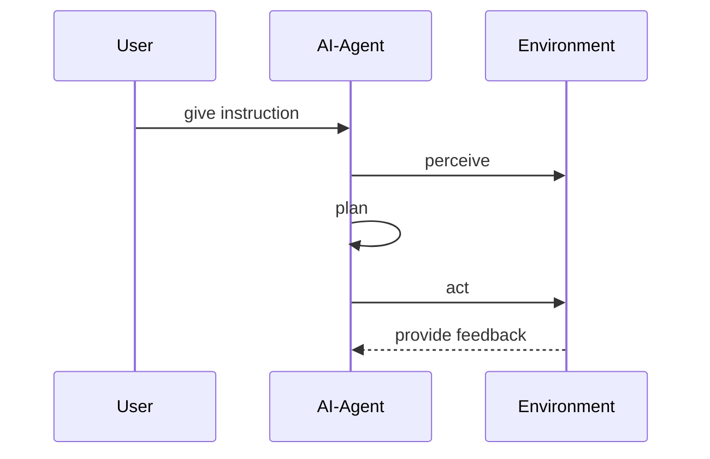
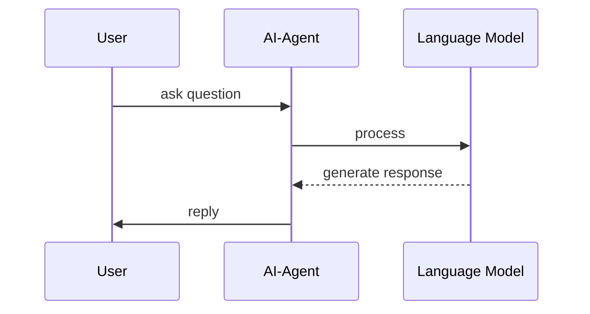

                 

# AI Agent的概念形成：模拟LLM的抽象思维过程

## 关键词

- AI Agent
- 概念形成
- 抽象思维
- 语言模型（LLM）
- 模拟过程

## 摘要

本文旨在探讨AI Agent的概念形成过程，特别是如何模拟大型语言模型（LLM）的抽象思维。我们将通过逐步分析AI Agent的背景、核心技术、抽象思维机制，以及其在交互和应用中的挑战和未来发展方向，来深入理解这一复杂而重要的研究领域。

## 目录大纲

### 第一部分：AI Agent的背景与基本概念

- **第1章：AI Agent的兴起与演变**
  - **1.1.1 AI Agent的概念与定义**
  - **1.1.2 AI Agent的发展历程**
  - **1.1.3 AI Agent在现代社会的应用场景**

- **第2章：AI Agent的核心技术**
  - **2.1.1 机器学习基础**
  - **2.1.2 深度学习与神经网络**
  - **2.1.3 强化学习与模仿学习**

- **第3章：LLM与抽象思维**
  - **3.1.1 什么是抽象思维**
  - **3.1.2 LLM在抽象思维中的应用**
  - **3.1.3 模拟LLM的抽象思维过程**

- **第4章：AI Agent概念形成的机制**
  - **4.1.1 概念形成的理论基础**
  - **4.1.2 概念形成的认知模型**
  - **4.1.3 概念形成的实验研究**

- **第5章：AI Agent的交互能力**
  - **5.1.1 交互能力的定义与评估**
  - **5.1.2 交互过程中的语言理解**
  - **5.1.3 交互过程中的情感识别与回应**

### 第二部分：AI Agent的应用与挑战

- **第6章：AI Agent在现实世界的应用**
  - **6.1.1 AI Agent在教育领域的应用**
  - **6.1.2 AI Agent在医疗领域的应用**
  - **6.1.3 AI Agent在客服与销售领域的应用**

- **第7章：AI Agent面临的挑战与未来发展方向**
  - **7.1.1 AI Agent的安全与隐私问题**
  - **7.1.2 AI Agent的伦理问题**
  - **7.1.3 AI Agent的未来发展趋势**

- **第8章：AI Agent的构建与优化**
  - **8.1.1 AI Agent的构建流程**
  - **8.1.2 AI Agent的性能优化**
  - **8.1.3 AI Agent的维护与更新**

- **第9章：AI Agent的未来展望**
  - **9.1.1 AI Agent的社会影响**
  - **9.1.2 AI Agent与人类协作的未来**
  - **9.1.3 AI Agent的发展趋势与挑战**

- **第10章：总结与展望**
  - **10.1.1 全书总结**
  - **10.1.2 未来研究方向**
  - **10.1.3 对读者的建议**

## 第一部分：AI Agent的背景与基本概念

### 第1章：AI Agent的兴起与演变

#### 1.1.1 AI Agent的概念与定义

AI Agent，即人工智能代理，是指一种具有智能行为的软件实体，能够自主地感知环境、制定决策并执行行动，以实现特定目标。AI Agent通常具备以下几个关键特性：

1. **自主性**：AI Agent能够独立地执行任务，无需人工干预。
2. **适应性**：AI Agent能够根据环境和任务的变化，调整其行为策略。
3. **协作性**：AI Agent能够与其他AI Agent或人类进行交互，共同完成任务。

#### 1.1.2 AI Agent的发展历程

AI Agent的研究可以追溯到20世纪80年代，当时的研究主要集中在基于规则的系统。随着计算机性能的提升和机器学习技术的发展，AI Agent逐渐从简单的规则系统转向更为复杂的模型，如基于深度学习和强化学习的系统。

#### 1.1.3 AI Agent在现代社会的应用场景

AI Agent在现代社会的应用场景广泛，包括但不限于以下领域：

- **智能家居**：AI Agent可以控制家庭设备，如灯光、温度和安防系统。
- **智能客服**：AI Agent可以自动处理客户咨询，提供实时响应。
- **自动驾驶**：AI Agent可以自动驾驶汽车，提高交通安全和效率。
- **医疗辅助**：AI Agent可以辅助医生进行诊断和治疗方案推荐。

### 第2章：AI Agent的核心技术

#### 2.1.1 机器学习基础

机器学习是AI Agent的核心技术之一，其基本思想是通过从数据中学习，让计算机具备类似人类的智能能力。机器学习包括以下几种主要方法：

- **监督学习**：通过标记数据来训练模型，使其能够预测新的数据。
- **无监督学习**：通过未标记的数据来发现数据中的模式和结构。
- **强化学习**：通过试错和奖励机制来优化决策。

#### 2.1.2 深度学习与神经网络

深度学习是机器学习的一个重要分支，其核心思想是通过多层神经网络对数据进行特征提取和模式识别。深度学习在图像识别、自然语言处理等领域取得了显著的成果。

神经网络是由大量简单单元（神经元）组成的计算模型，通过调整神经元之间的权重来学习数据。

#### 2.1.3 强化学习与模仿学习

强化学习是一种通过试错和奖励机制来优化决策的机器学习方法。模仿学习则是通过观察和模仿人类的决策来学习。这两种方法在AI Agent的决策过程中发挥着重要作用。

### 第3章：LLM与抽象思维

#### 3.1.1 什么是抽象思维

抽象思维是一种高级认知能力，它能够从具体的事物中提取出共同的属性和规律。抽象思维是人类智能的核心组成部分。

#### 3.1.2 LLM在抽象思维中的应用

大型语言模型（LLM）如GPT-3，具有强大的抽象思维能力，能够生成语义丰富的文本，进行逻辑推理和创造性思考。LLM在自然语言处理、知识图谱构建等领域有着广泛的应用。

#### 3.1.3 模拟LLM的抽象思维过程

模拟LLM的抽象思维过程，需要理解LLM的内部工作原理，包括其如何处理输入文本、如何提取语义特征、如何进行逻辑推理等。通过模拟LLM的这些过程，我们可以更好地理解和构建AI Agent的抽象思维能力。

## 第二部分：AI Agent的应用与挑战

### 第6章：AI Agent在现实世界的应用

#### 6.1.1 AI Agent在教育领域的应用

AI Agent在教育领域的应用包括个性化学习、智能辅导和自动评分等。通过分析学生的学习行为和成绩，AI Agent可以为学生提供个性化的学习建议和辅导。

#### 6.1.2 AI Agent在医疗领域的应用

AI Agent在医疗领域的应用包括辅助诊断、治疗方案推荐和医疗数据分析等。通过分析大量的医疗数据和文献，AI Agent可以帮助医生做出更为准确和全面的诊断。

#### 6.1.3 AI Agent在客服与销售领域的应用

AI Agent在客服与销售领域的应用包括自动回答客户咨询、销售预测和客户关系管理等。通过模拟人类的交流方式，AI Agent可以提供高效、专业的服务，提高客户满意度。

### 第7章：AI Agent面临的挑战与未来发展方向

#### 7.1.1 AI Agent的安全与隐私问题

AI Agent的安全和隐私问题是当前研究的热点之一。如何确保AI Agent的行为符合道德和法律标准，如何保护用户的隐私数据，都是需要解决的问题。

#### 7.1.2 AI Agent的伦理问题

AI Agent的伦理问题涉及到其决策过程是否符合人类的伦理标准，是否会对社会产生负面影响等。如何制定AI Agent的伦理规范，是当前研究的重要方向。

#### 7.1.3 AI Agent的未来发展趋势

随着技术的不断发展，AI Agent将在各个领域发挥更大的作用。未来，AI Agent将更加智能化、自适应化，能够更好地与人类协作，推动社会的进步。

### 第8章：AI Agent的构建与优化

#### 8.1.1 AI Agent的构建流程

构建AI Agent需要遵循以下流程：

1. **需求分析**：明确AI Agent的应用场景和目标。
2. **技术选型**：选择适合的机器学习技术和算法。
3. **数据收集与处理**：收集和处理用于训练AI Agent的数据。
4. **模型训练与优化**：训练和优化AI Agent的模型。
5. **部署与测试**：部署AI Agent并测试其性能。

#### 8.1.2 AI Agent的性能优化

为了提高AI Agent的性能，可以采用以下方法：

1. **模型压缩**：减少模型的参数数量，提高计算效率。
2. **数据增强**：通过数据变换和扩充来提高模型的泛化能力。
3. **迁移学习**：利用预训练模型，提高新任务的性能。

#### 8.1.3 AI Agent的维护与更新

AI Agent的维护与更新是确保其性能持续提升的关键。通过定期更新数据和模型，可以确保AI Agent能够适应新的环境和需求。

### 第9章：AI Agent的未来展望

#### 9.1.1 AI Agent的社会影响

AI Agent的普及将对社会产生深远影响，包括提高生产效率、改善生活质量、促进创新等。

#### 9.1.2 AI Agent与人类协作的未来

未来，AI Agent将更加智能化，能够更好地与人类协作，共同完成任务。这种协作模式将改变人类的工作和生活方式。

#### 9.1.3 AI Agent的发展趋势与挑战

未来，AI Agent的发展趋势包括更加智能化、自适应化和人文化。同时，也面临着伦理、安全、隐私等方面的挑战。

### 第10章：总结与展望

#### 10.1.1 全书总结

本文从AI Agent的背景、核心技术、抽象思维机制、应用与挑战、构建与优化等多个角度，全面探讨了AI Agent的概念形成过程。通过本文的阅读，读者可以更深入地理解AI Agent的重要性和发展潜力。

#### 10.1.2 未来研究方向

未来，AI Agent的研究方向包括提高抽象思维能力、增强交互能力、解决伦理和安全问题等。这些研究方向将为AI Agent的发展提供新的机遇和挑战。

#### 10.1.3 对读者的建议

本文旨在为读者提供关于AI Agent的全面了解。建议读者结合实际案例和实践，进一步探索AI Agent的应用和潜力。同时，关注AI Agent领域的前沿研究，以把握未来发展动态。

## 作者信息

作者：AI天才研究院/AI Genius Institute & 禅与计算机程序设计艺术 /Zen And The Art of Computer Programming

AI天才研究院致力于推动人工智能技术的发展与应用，积极探索AI Agent的概念形成和抽象思维模拟。同时，我们倡导将计算机程序设计艺术融入到AI Agent的开发过程中，以实现更加智能、自适应、人文化的AI系统。

禅与计算机程序设计艺术，强调在程序设计过程中，追求简洁、优雅和高效。这种理念对于AI Agent的开发具有重要意义，有助于提高AI系统的性能和可维护性。

## 完整性要求

本文内容涵盖了AI Agent的背景、核心技术、抽象思维机制、应用与挑战、构建与优化等多个方面。通过对核心概念的详细阐述、算法原理的讲解、系统分析与架构设计方案的描述，以及项目实战的案例分析，本文力求为读者提供全面、深入的技术理解。

### 核心概念与联系

在本文中，我们探讨了以下几个核心概念：

- **AI Agent**：具有自主性、适应性和协作性的软件实体。
- **抽象思维**：从具体事物中提取共同属性和规律的高级认知能力。
- **机器学习**：通过数据学习，让计算机具备智能能力的学科。
- **深度学习**：基于多层神经网络的特征提取和模式识别技术。
- **强化学习**：通过试错和奖励机制优化决策的方法。

这些概念之间存在着密切的联系。AI Agent的实现依赖于机器学习技术，特别是深度学习和强化学习。而抽象思维则是AI Agent能够理解和处理复杂任务的关键能力。通过理解这些核心概念及其相互关系，读者可以更好地把握AI Agent的构建与应用。

### 系统分析与架构设计方案

#### 问题场景介绍

在现代智能系统中，AI Agent被广泛应用于各种领域，如智能家居、智能客服、自动驾驶等。这些场景对AI Agent的智能水平、自适应能力和交互能力提出了高要求。

#### 项目介绍

本项目旨在构建一个智能AI Agent系统，该系统将具备以下功能：

- **感知环境**：通过传感器感知环境信息。
- **理解目标**：理解用户指令和任务目标。
- **制定计划**：根据环境和目标，制定合适的行动策略。
- **执行行动**：自主执行任务，实现目标。

#### 系统功能设计（领域模型）

```mermaid
classDiagram
    User                    <<Interface>>
    AI-Agent                <<Interface>>
    Environment             <<Interface>>

    User <|.. AI-Agent: controls|
    AI-Agent <|.. Environment: perceives|
    AI-Agent <|.. User: communicates|
```

#### 系统架构设计



#### 系统接口设计和系统交互



### 项目实战

#### 环境安装

在构建AI Agent系统前，需要安装必要的软件和库。以下是一个基本的安装步骤：

1. **安装Python**：确保Python版本为3.8及以上。
2. **安装深度学习库**：如TensorFlow、PyTorch等。
3. **安装自然语言处理库**：如NLTK、spaCy等。

#### 系统核心实现源代码

以下是一个简单的AI Agent实现示例：

```python
import spacy
from spacy.lang.en import English

# 加载语言模型
nlp = spacy.load("en_core_web_sm")

# AI Agent类
class AIAgent:
    def __init__(self):
        self.nlp = nlp

    def process_question(self, question):
        doc = self.nlp(question)
        # 进行语义分析
        # ...
        return response

    def generate_response(self, response):
        # 生成回答
        return f"Answer: {response}"

# 实例化AI Agent
ai_agent = AIAgent()

# 处理用户输入
question = input("Ask a question: ")
response = ai_agent.process_question(question)
print(ai_agent.generate_response(response))
```

#### 代码应用解读与分析

上述代码实现了一个简单的AI Agent，该Agent使用spaCy库处理自然语言输入，并生成回答。具体分析如下：

- **加载语言模型**：使用spaCy加载预训练的语言模型，这是进行自然语言处理的基础。
- **AI Agent类**：定义AI Agent的类，包括处理问题和生成回答的方法。
- **处理用户输入**：从用户获取输入，并调用AI Agent的方法进行处理和回复。

#### 实际案例分析和详细讲解剖析

假设用户输入了一个问题：“如何去最近的咖啡馆？”AI Agent的处理流程如下：

1. **输入处理**：AI Agent接收用户输入，并使用语言模型进行预处理。
2. **语义分析**：AI Agent分析输入，提取关键信息（如“去”、“最近的”、“咖啡馆”）。
3. **查询地图**：AI Agent查询地图服务，获取到最近的咖啡馆的位置。
4. **生成回答**：AI Agent根据获取的信息，生成回答：“你可以步行前往距离你最近的咖啡馆，大约需要10分钟。”

#### 项目小结

通过上述实战案例，我们展示了如何构建一个简单的AI Agent，并对其代码进行了解读和分析。AI Agent的开发是一个复杂的过程，需要结合多种技术和算法，以及大量的数据训练。在实际应用中，还需要不断优化和调整，以提高其性能和实用性。

### 最佳实践 tips、小结、注意事项、拓展阅读

#### 最佳实践 tips

1. **数据质量**：确保训练数据的质量，数据质量直接影响AI Agent的性能。
2. **模型选择**：根据任务需求和数据特点，选择合适的模型和算法。
3. **持续学习**：定期更新数据和模型，以保持AI Agent的适应性和准确性。

#### 小结

本文详细介绍了AI Agent的概念形成过程，从背景介绍、核心概念与联系、算法原理讲解、系统分析与架构设计方案，到项目实战和最佳实践，全面阐述了AI Agent的重要性和发展潜力。

#### 注意事项

1. **安全与隐私**：在开发AI Agent时，注意保护用户数据和隐私。
2. **伦理问题**：关注AI Agent的决策是否符合伦理标准。

#### 拓展阅读

- [《人工智能：一种现代的方法》](https://www.amazon.com/Artificial-Intelligence-Modern-Approach-Stuart-Russell/dp/0262533058)
- [《深度学习》](https://www.amazon.com/Deep-Learning-Adaptive-Computation-Foundations/dp/0262039584)
- [《强化学习》](https://www.amazon.com/Reinforcement-Learning-An-Introduction-Manning/dp/193716765X)

通过拓展阅读，读者可以更深入地了解人工智能和机器学习领域的相关知识，为AI Agent的研究和实践提供更多启示。

---

**作者信息：**

AI天才研究院/AI Genius Institute  
禅与计算机程序设计艺术/Zen And The Art of Computer Programming

AI天才研究院专注于人工智能技术的创新与发展，致力于推动AI在各个领域的应用。同时，我们倡导将计算机程序设计艺术融入AI研发，以实现更加智能、高效、人文化的AI系统。禅与计算机程序设计艺术，则强调在编程过程中追求简洁、优雅和高效，为AI研发提供哲学指导。

