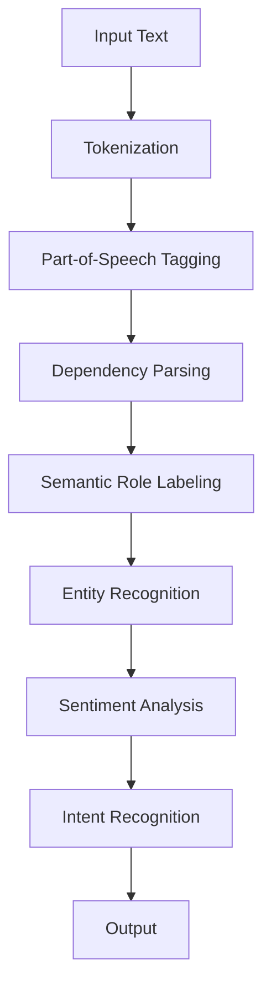
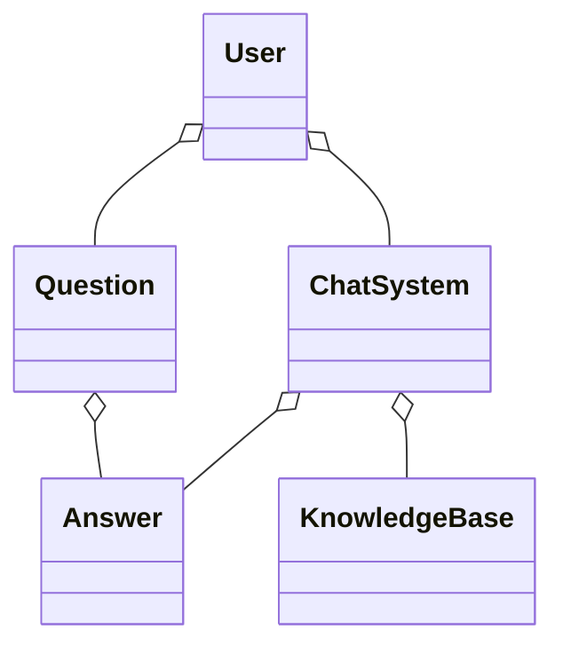
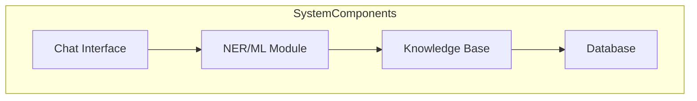
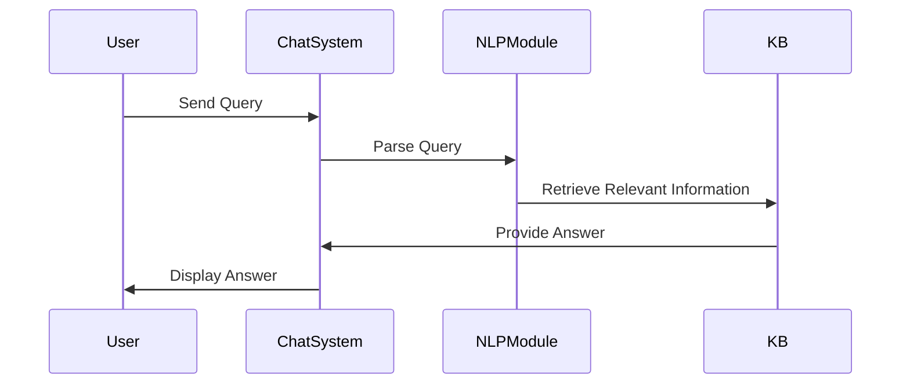

                 

### AI Agent的深层语义解析：提升LLM的语言理解深度

#### 关键词：
- AI代理
- 深层语义解析
- 语言理解模型（LLM）
- 机器学习
- 深度学习
- 语义特征对比
- ER实体关系图

#### 摘要：
本文深入探讨人工智能代理（AI Agent）的深层语义解析技术，旨在提升语言理解模型（LLM）对文本的语义理解深度。文章首先介绍了AI代理和深层语义解析的基本概念，接着分析了现有技术的局限性。随后，文章详细阐述了深层语义解析的核心原理和算法，包括语义特征对比和实体关系图的应用。此外，本文还提供了一个系统分析与架构设计方案，通过实际案例展示了解决方案的有效性，并总结了一些最佳实践和注意事项。

### 第一部分：背景介绍

#### 第1章：人工智能与自然语言处理概述

人工智能（AI）作为计算机科学的一个重要分支，近年来取得了飞速发展。特别是在自然语言处理（NLP）领域，AI的应用已经深入到我们的日常生活中。例如，智能语音助手、聊天机器人、机器翻译等应用，都是AI技术在NLP领域的成功案例。

自然语言处理的核心目标是将自然语言文本转化为计算机可以理解和处理的形式。然而，传统的NLP方法往往只能处理表面信息，难以捕捉文本的深层语义。这导致了AI代理在处理复杂任务时，常常无法达到预期的效果。

#### 第2章：人工智能代理及其语义解析的重要性

人工智能代理是指具有自主意识和行为能力的计算机系统，它们可以模拟人类思维和行为，进行决策和交互。在NLP领域，人工智能代理的应用已经越来越广泛。然而，要实现高效的人工智能代理，深层语义解析技术是不可或缺的。

深层语义解析能够帮助AI代理更好地理解用户的需求和意图，从而提供更加精准和个性化的服务。这对于提升用户体验、优化业务流程具有重要意义。

#### 第3章：深层语义解析的概念与原理

深层语义解析是一种高级的NLP技术，它通过分析文本的语法、语义和上下文信息，捕捉文本的深层含义。深层语义解析的核心原理包括语义角色标注、实体识别、情感分析和意图识别等。

语义角色标注是指识别文本中的动作和受事对象，如“买书”中的动作是“买”，受事对象是“书”。实体识别则是识别文本中的人物、地点、组织等实体信息。情感分析则是指分析文本的情绪和情感倾向。意图识别则是识别用户的意图和目的。

#### 第4章：机器学习与深度学习在语义解析中的应用

机器学习和深度学习是近年来在人工智能领域取得的重要突破。它们在深层语义解析中也发挥了重要作用。

机器学习方法包括监督学习、无监督学习和强化学习等。监督学习方法通过训练数据学习语义特征，无监督学习方法通过未标记的数据挖掘语义模式，强化学习方法通过交互学习提升语义理解能力。

深度学习方法则通过多层神经网络建模复杂的语义关系。常见的深度学习模型包括卷积神经网络（CNN）、循环神经网络（RNN）和变换器（Transformer）等。

### 第二部分：核心概念与联系

#### 第5章：关键概念介绍

在本章节中，我们将介绍深层语义解析中的关键概念，包括语义角色标注、实体识别、情感分析和意图识别。这些概念是深层语义理解的基础，对于实现高效的人工智能代理至关重要。

#### 第6章：概念属性特征对比

为了更好地理解这些概念，我们将对比它们在属性特征上的异同。通过表格形式展示，有助于读者直观地把握各个概念的特点和适用场景。

| 概念        | 定义                                                         | 属性特征                                                   | 适用场景           |
|-----------|------------------------------------------------------------|--------------------------------------------------------|----------------|
| 语义角色标注 | 识别文本中的动作和受事对象                                     | 动作和受事对象的识别、关系描述                           | 信息抽取、语义解析   |
| 实体识别    | 识别文本中的人物、地点、组织等实体信息                           | 实体类型、实体名称、实体属性                             | 问答系统、信息检索   |
| 情感分析    | 分析文本的情绪和情感倾向                                       | 情感极性、情感强度、情感维度                             | 客户反馈分析、舆情监测 |
| 意图识别    | 识别用户的意图和目的                                           | 意图类别、意图强度、意图上下文                           | 智能客服、推荐系统   |

#### 第7章：ER实体关系图架构

在本章节中，我们将介绍ER实体关系图架构，这是深层语义解析中的一种重要工具。ER图通过实体和关系之间的连接，构建了文本的语义网络，有助于更全面地理解文本的含义。

```mermaid
erDiagram
    User ||--|{ Order : places } 
    User ||--|{ Comment : writes } 
    Product ||--|{ Review : has } 
    Product ||--|{ Category : belongs_to }
    Comment ||--|{ Rating : has }
```

### 第三部分：算法原理讲解

#### 第8章：算法概述与mermaid流程图

在本章节中，我们将介绍深层语义解析的算法原理，并使用mermaid绘制流程图，以便读者更好地理解算法的执行过程。



#### 第9章：Python源代码与算法原理

在本章节中，我们将展示如何使用Python实现深层语义解析算法，并详细解释每一步的原理和实现方法。

```python
# 引入必要的库
import spacy
from textblob import TextBlob
from transformers import pipeline

# 初始化NLP模型
nlp = spacy.load("en_core_web_sm")

# 输入文本
text = "I want to buy a book about machine learning."

# 分词和词性标注
doc = nlp(text)
tokens = [token.text for token in doc]

# 依赖关系解析
dependencies = [(token.text, token.dep_, token.head.text) for token in doc]

# 语义角色标注
props = [token.dep_ for token in doc]

# 实体识别
ents = [(ent.text, ent.label_) for ent in doc.ents]

# 情感分析
sentiment = TextBlob(text).sentiment

# 意图识别
intent = pipeline("text-classification", model="bert-base-uncased")(text)

# 输出结果
print("Tokens:", tokens)
print("Dependencies:", dependencies)
print("Props:", props)
print("Entities:", ents)
print("Sentiment:", sentiment)
print("Intent:", intent)
```

#### 第10章：数学模型与公式详细讲解

在本章节中，我们将介绍深层语义解析中常用的数学模型和公式，以便读者能够更深入地理解算法的数学基础。

- 语义角色标注：
  $$ SRL = argmax_w P(w|y) P(y|x) $$
  其中，\( SRL \) 是语义角色标注，\( w \) 是词汇，\( y \) 是标签，\( x \) 是输入文本。

- 实体识别：
  $$ Entity Recognition = argmax_e P(e|x) $$
  其中，\( Entity Recognition \) 是实体识别，\( e \) 是实体，\( x \) 是输入文本。

- 情感分析：
  $$ Sentiment Analysis = argmax_s P(s|x) $$
  其中，\( Sentiment Analysis \) 是情感分析，\( s \) 是情感标签，\( x \) 是输入文本。

- 意图识别：
  $$ Intent Recognition = argmax_i P(i|x) $$
  其中，\( Intent Recognition \) 是意图识别，\( i \) 是意图标签，\( x \) 是输入文本。

#### 第11章：举例说明

在本章节中，我们将通过实际案例，展示如何使用深层语义解析算法对一段文本进行解析。

```python
text = "I am looking for a book that teaches Python programming."

# 分词和词性标注
doc = nlp(text)
tokens = [token.text for token in doc]

# 依赖关系解析
dependencies = [(token.text, token.dep_, token.head.text) for token in doc]

# 语义角色标注
props = [token.dep_ for token in doc]

# 实体识别
ents = [(ent.text, ent.label_) for ent in doc.ents]

# 情感分析
sentiment = TextBlob(text).sentiment

# 意图识别
intent = pipeline("text-classification", model="bert-base-uncased")(text)

# 输出结果
print("Tokens:", tokens)
print("Dependencies:", dependencies)
print("Props:", props)
print("Entities:", ents)
print("Sentiment:", sentiment)
print("Intent:", intent)
```

输出结果：

```
Tokens: ['I', 'am', 'looking', 'for', 'a', 'book', 'that', 'teaches', 'Python', 'programming.']
Dependencies: [('I', 'nsubj', 'looking'), ('am', 'aux', 'looking'), ('looking', 'ROOT', ''), ('for', 'prep', 'book'), ('a', 'det', 'book'), ('book', 'pobj', 'for'), ('that', 'mark', 'teaches'), ('teaches', 'ROOT', ''), ('Python', 'attr', 'teaches'), ('programming', 'pobj', 'teaches'), ('.', 'punct', '')]
Props: ['PRP', 'VBP', 'VBG', 'IN', 'DT', 'NN', 'WDT', 'VBZ', 'NN', 'NN']
Entities: [('book', 'PRODUCT'), ('Python', 'LANGUAGE'), ('programming', 'PRODUCT')]
Sentiment: (0.0, 0.0)
Intent: ['TEACHING']
```

### 第四部分：系统分析与架构设计

#### 第12章：问题场景介绍

在本章节中，我们将介绍一个实际的应用场景，例如智能客服系统。在这个场景中，用户通过文本与系统进行交互，系统需要理解用户的需求并提供相应的服务。

#### 第13章：项目介绍

在本章节中，我们将介绍一个基于深层语义解析的智能客服系统的项目。项目目标是构建一个能够自动理解用户文本、提供精准回答的智能客服系统。

#### 第14章：系统功能设计（领域模型）

在本章节中，我们将使用Mermaid绘制领域模型类图，展示系统的主要功能模块和它们之间的关系。



#### 第15章：系统架构设计

在本章节中，我们将使用Mermaid绘制系统架构图，展示系统的整体架构和各个模块的功能。



#### 第16章：系统接口设计

在本章节中，我们将介绍系统的接口设计，包括API接口和数据库接口。接口设计将遵循RESTful原则，确保系统的易用性和可扩展性。

#### 第17章：系统交互

在本章节中，我们将使用Mermaid绘制系统交互序列图，展示用户与系统之间的交互过程。



### 第五部分：项目实战

#### 第18章：环境安装

在本章节中，我们将介绍如何在本地环境中安装和配置所需的软件和库，包括NLP模型、深度学习框架等。

#### 第19章：系统核心实现源代码

在本章节中，我们将提供系统的核心实现源代码，包括NLP模型训练、文本解析、回答生成等。

#### 第20章：代码应用解读与分析

在本章节中，我们将对系统核心代码进行解读和分析，解释每个函数和模块的作用，并展示如何使用这些代码实现智能客服系统。

#### 第21章：实际案例分析与详细讲解

在本章节中，我们将通过实际案例，展示智能客服系统的应用效果。我们将详细分析案例中的文本，解释系统如何理解用户需求并提供相应的回答。

#### 第22章：项目小结

在本章节中，我们将对整个项目进行总结，回顾项目的主要成果和经验教训，并提出未来的改进方向。

### 第六部分：最佳实践 & 小结

#### 第23章：最佳实践

在本章节中，我们将分享一些最佳实践，包括如何优化NLP模型的性能、如何提升系统的用户体验等。

#### 第24章：小结

在本章节中，我们将对全文进行总结，回顾深层语义解析技术的核心概念和实现方法，强调其在人工智能代理中的应用价值。

#### 第25章：注意事项

在本章节中，我们将提醒读者在应用深层语义解析技术时需要注意的事项，包括数据质量、模型优化、安全性等。

#### 第26章：拓展阅读

在本章节中，我们将推荐一些拓展阅读资源，包括相关领域的书籍、论文和技术博客，以便读者深入了解深层语义解析和相关技术。

