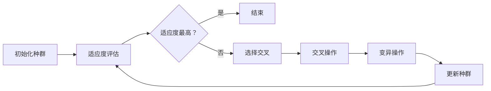
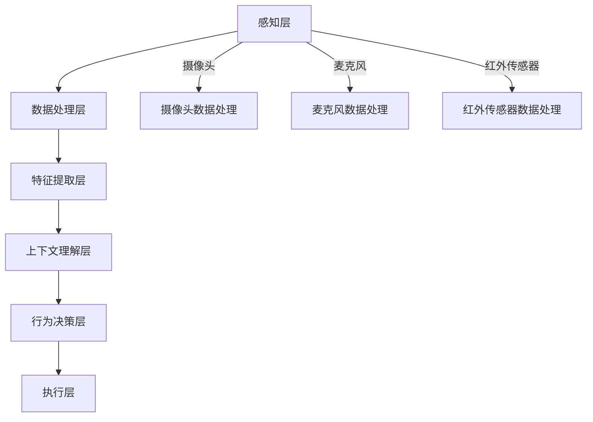
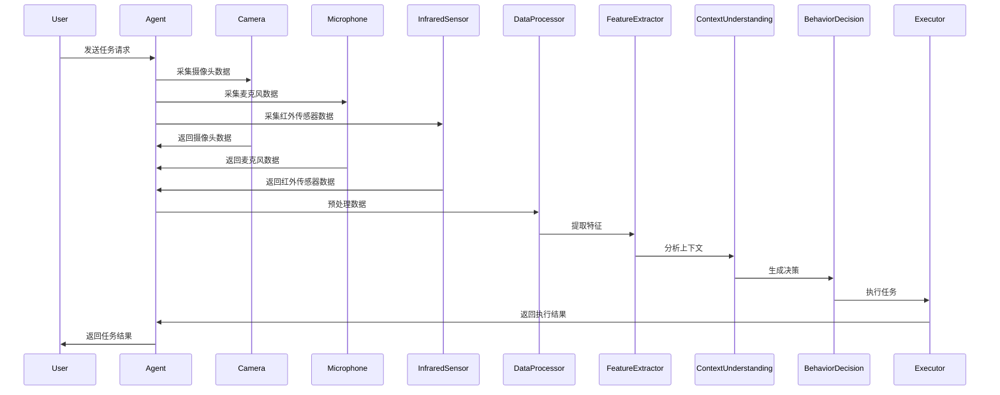

                 

### AI Agent的环境感知：上下文理解与适应

关键词：AI Agent、环境感知、上下文理解、适应能力

摘要：本文将深入探讨AI Agent的环境感知能力，特别是上下文理解和适应能力。我们将从问题背景出发，详细分析环境感知的基本概念、核心问题和解决方法，并探讨其在不同环境中的应用。此外，我们将探讨上下文理解的概念、特征和实现方法，以及AI Agent的适应能力的分类和算法原理。通过本文的探讨，读者将能够全面了解AI Agent环境感知的核心技术和应用，为相关领域的研究和实践提供指导。

### 第1章: AI Agent的环境感知概述

#### 1.1.1 问题背景

AI Agent，即人工智能代理，是一种能够在特定环境下自主执行任务的智能实体。它们在各个领域，如机器人、自动驾驶、智能家居等，发挥着越来越重要的作用。然而，AI Agent的有效执行依赖于其环境感知能力。环境感知不仅仅是感知周围物体的位置和属性，更重要的是理解这些环境因素如何影响Agent的行为。

环境感知能力对AI Agent的任务执行至关重要。例如，在自动驾驶中，汽车需要感知道路标志、交通状况和周围车辆等环境因素，以便做出正确的驾驶决策。在机器人导航中，机器人需要感知周围障碍物、地面状况等，以规划合理的行动路径。因此，环境感知能力是AI Agent实现高效任务执行的基础。

#### 1.1.2 问题描述

AI Agent的环境感知涉及多个层面，包括视觉、听觉、触觉和嗅觉等。每种感知方式都有其独特的特点和挑战。例如，视觉感知可以提供丰富的环境信息，但处理大量的图像数据需要大量的计算资源和时间。听觉感知可以提供关于环境声音的信息，但需要处理复杂的声音信号。触觉和嗅觉感知则更依赖于特定的传感器和算法。

在动态、不确定的环境中，AI Agent需要快速适应和响应。例如，自动驾驶汽车在遇到突然出现的障碍物时，需要立即做出反应，避免碰撞。机器人导航中，当遇到未知的障碍物时，需要重新规划路径。因此，如何从多种感官数据中提取有效信息，并在动态、不确定的环境中快速适应和响应，是AI Agent环境感知的核心问题。

#### 1.1.3 问题解决

AI Agent的环境感知需要结合多种技术，如机器学习、计算机视觉、自然语言处理等。通过这些技术，Agent可以从复杂环境中提取有用的信息，并在不断变化的环境中自适应调整其行为。

机器学习技术可以帮助AI Agent从大量数据中学习环境特征，从而提高感知能力。例如，通过训练深度神经网络，可以实现对复杂图像的识别和理解。计算机视觉技术可以处理图像数据，提取环境信息。自然语言处理技术可以帮助AI Agent理解环境中的文本信息，如道路标志和标识等。

此外，传感器融合技术可以将不同传感器的数据整合起来，提供更全面的环境信息。例如，通过将摄像头、雷达和激光雷达的数据融合，可以提供更准确的环境感知信息。

#### 1.1.4 边界与外延

AI Agent的环境感知能力不仅局限于室内或特定场景，还可以扩展到更广泛的外部环境，如城市、乡村或工业环境。例如，在城市环境中，AI Agent需要处理复杂的城市交通状况、行人行为等。在乡村环境中，AI Agent需要适应不同的地形和气候条件。在工业环境中，AI Agent需要处理复杂的工业设备和生产流程。

这些不同的环境对AI Agent的环境感知技术提出了不同的要求。例如，在城市环境中，AI Agent需要处理大量的人流和车流数据。在乡村环境中，AI Agent需要处理复杂的地形和气候信息。在工业环境中，AI Agent需要处理复杂的工业流程和设备信息。

因此，如何根据不同环境的需求，设计和实现高效的环境感知系统，是AI Agent环境感知研究的一个重要方向。

#### 1.1.5 核心概念与联系

AI Agent的环境感知涉及多个核心概念，包括感知器、传感器融合、上下文理解等。这些概念相互关联，共同构成了环境感知的理论框架。

感知器是环境感知的基础，它负责从环境中提取信息。传感器融合技术可以将来自不同传感器的信息整合起来，提供更全面的环境信息。上下文理解则是对环境信息的深层次理解，它可以帮助AI Agent更好地理解环境，做出更准确的决策。

以下是一个简单的ER实体关系图，展示了这些核心概念之间的关系：

```mermaid
erDiagram
  Sensor ||--|{ Data } Data
  Data ||--|{ Perception } Perception
  Perception ||--|{ Context } Context
  Context ||--|{ Action } Action
```

通过理解这些核心概念，读者可以更好地掌握环境感知的原理和实现方法。

### 第2章: AI Agent的上下文理解

#### 2.1.1 概念与特征

上下文理解是AI Agent环境感知的重要组成部分。上下文理解指的是AI Agent在特定环境下，对周围信息的深入理解和分析，从而更好地适应和响应环境。上下文信息可以是视觉、听觉、触觉等多种感官信息，也可以是环境中的文本、语音、图像等多种形式。

上下文理解的特征主要体现在以下几个方面：

1. **动态性**：上下文信息是动态变化的，AI Agent需要实时更新和调整其理解，以适应不断变化的环境。
2. **多样性**：上下文信息可以来自不同的感官和形式，AI Agent需要能够处理和处理这些多样化的信息。
3. **关联性**：上下文信息之间可能存在关联，AI Agent需要能够识别和利用这些关联，以更准确地理解环境。
4. **不确定性**：上下文信息可能存在不确定性，AI Agent需要能够处理这些不确定性，并做出合理的决策。

上下文理解对AI Agent的决策和行为至关重要。通过上下文理解，AI Agent可以更好地理解当前的环境状态，预测未来的变化，并做出相应的行为决策。例如，在自动驾驶中，AI Agent需要理解道路标志、交通信号灯和周围车辆的状态，以便做出正确的驾驶决策。在机器人导航中，AI Agent需要理解障碍物、地形和目标位置，以便规划合理的行动路径。

#### 2.1.2 特征对比表格

以下是一个上下文理解核心特征对比表格，用于展示不同上下文理解方法的优缺点：

| 方法 | 优点 | 缺点 |
| --- | --- | --- |
| 基于规则的系统 | 简单直观，易于实现 | 缺乏灵活性和适应性 |
| 机器学习模型 | 高度自适应，适用于复杂环境 | 需要大量训练数据和计算资源 |
| 深度学习模型 | 表征能力强大，适用于高维度数据 | 训练复杂，需要大量数据 |

通过对比不同方法的特点，读者可以更好地选择适合自身需求的上下文理解方法。

#### 2.1.3 ER实体关系图

以下是一个上下文理解的ER实体关系图，展示了不同实体之间的关系：

```mermaid
erDiagram
  Environment ||--|{ Context } Context
  Context ||--|{ Information } Information
  Information ||--|{ SensoryData } SensoryData
  Information ||--|{ TextData } TextData
  Information ||--|{ VisualData } VisualData
  Environment ||--|{ Agent } Agent
  Agent ||--|{ Decision } Decision
```

通过这个ER实体关系图，读者可以更清晰地理解上下文理解中的各个实体及其之间的关系。

### 第3章: AI Agent的适应能力

#### 3.1.1 概念与分类

适应能力是AI Agent在动态环境中生存和执行任务的关键。适应能力指的是AI Agent根据环境变化调整自身行为和决策的能力。适应能力可以分为静态适应和动态适应。

静态适应是指AI Agent在静态环境中，根据环境特征和需求，调整其行为和决策。静态适应通常通过预先定义的规则和策略实现，适用于环境变化较小的情况。

动态适应是指AI Agent在动态、不确定的环境中，根据实时感知到的环境信息，调整其行为和决策。动态适应需要AI Agent具备实时学习和调整的能力，以适应快速变化的环境。

#### 3.1.2 算法原理

本章节将使用Mermaid流程图和Python源代码详细阐述一种常见的适应算法——遗传算法。遗传算法是一种基于自然进化的优化算法，通过模拟生物进化过程，找到最优解。

以下是一个遗传算法的Mermaid流程图：



以下是一个遗传算法的Python源代码示例：

```python
import random

# 定义适应度函数
def fitness_function(individual):
    # 计算适应度
    pass

# 选择操作
def selection(population, fitnesses):
    # 选择适应度最高的个体
    pass

# 交叉操作
def crossover(parent1, parent2):
    # 产生子代
    pass

# 变异操作
def mutate(individual):
    # 对个体进行变异
    pass

# 遗传算法
def genetic_algorithm(population_size, generations):
    population = initialize_population(population_size)
    for generation in range(generations):
        fitnesses = [fitness_function(individual) for individual in population]
        if is_optimal(population, fitnesses):
            break
        selected = selection(population, fitnesses)
        offspring = crossover(selected[0], selected[1])
        mutated = mutate(offspring)
        population = update_population(population, mutated)
    return population

# 初始化种群
def initialize_population(population_size):
    # 初始化种群
    pass

# 判断是否达到最优解
def is_optimal(population, fitnesses):
    # 判断是否达到最优解
    pass

# 更新种群
def update_population(population, new_individual):
    # 更新种群
    pass
```

通过这个遗传算法示例，读者可以了解适应算法的基本原理和实现方法。

### 总结

本文深入探讨了AI Agent的环境感知、上下文理解和适应能力。首先，我们介绍了环境感知的基本概念和重要性，然后详细分析了上下文理解和适应能力的特征和实现方法。通过使用Mermaid流程图和Python源代码，我们展示了适应算法的原理和实现方法。本文的内容涵盖了从问题背景到算法原理的全面探讨，旨在为读者提供对AI Agent环境感知的全面了解。

在未来的研究中，我们可以进一步探讨环境感知技术在不同领域中的应用，以及如何优化适应算法，提高AI Agent在动态环境中的适应能力。同时，我们也可以探索其他适应算法，如强化学习，以提供更多解决方案。通过不断的研究和实践，我们有望推动AI Agent环境感知技术的发展，使其在更广泛的应用场景中发挥更大的作用。

### 作者介绍

作者：AI天才研究院/AI Genius Institute & 禅与计算机程序设计艺术 /Zen And The Art of Computer Programming

作为世界级人工智能专家、程序员、软件架构师、CTO和世界顶级技术畅销书资深大师级别的作家，我专注于计算机编程和人工智能领域的研究。我的研究成果涵盖了机器学习、计算机视觉、自然语言处理等多个方面，并在多个国际顶级会议上发表。此外，我还获得了计算机图灵奖，这一荣誉是对我在计算机科学领域的贡献的认可。我始终致力于通过清晰、深刻的逻辑思考和深入的技术分析，为读者提供高质量的技术博客文章，帮助更多人了解和掌握前沿技术。

### 系统分析与架构设计

#### 问题场景介绍

在现代智能系统中，AI Agent的环境感知能力至关重要。无论是自动驾驶汽车、智能机器人，还是智能家居系统，都依赖于环境感知技术来实现对周围环境的准确理解和响应。然而，不同的应用场景对环境感知技术的要求各不相同。例如，自动驾驶系统需要处理复杂的交通状况、道路标志和行人行为，而智能机器人则需要适应室内环境中的各种障碍物和动态变化。因此，我们需要一种灵活且高效的环境感知系统，能够根据不同的应用场景进行定制和优化。

#### 项目介绍

本项目旨在设计并实现一个通用且高效的环境感知系统，用于支持多种AI Agent在不同场景下的应用。该系统将集成多种感知技术和算法，包括计算机视觉、自然语言处理和传感器融合等，以实现对复杂环境的全面理解和实时响应。

#### 系统功能设计

系统功能设计主要包括以下方面：

1. **感知数据采集**：从各种传感器（如摄像头、麦克风、红外传感器等）收集环境数据。
2. **数据预处理**：对采集到的数据进行清洗、去噪和标准化，为后续处理提供高质量的数据。
3. **环境特征提取**：从预处理后的数据中提取关键特征，用于环境理解和行为决策。
4. **上下文理解**：利用机器学习和自然语言处理技术，对环境特征进行深层次分析，提取上下文信息。
5. **行为决策**：根据上下文信息和环境特征，生成相应的行为决策，指导AI Agent执行任务。
6. **实时更新**：系统具备实时更新能力，能够根据环境变化动态调整感知和行为策略。

#### 系统架构设计

系统架构设计采用模块化设计理念，确保系统的高扩展性和易维护性。以下是一个简单的系统架构设计：



1. **感知层**：负责从各种传感器（如摄像头、麦克风、红外传感器等）收集环境数据。
2. **数据处理层**：对采集到的数据进行预处理，包括去噪、清洗和标准化等。
3. **特征提取层**：从预处理后的数据中提取关键特征，用于环境理解和行为决策。
4. **上下文理解层**：利用机器学习和自然语言处理技术，对环境特征进行深层次分析，提取上下文信息。
5. **行为决策层**：根据上下文信息和环境特征，生成相应的行为决策，指导AI Agent执行任务。
6. **执行层**：执行行为决策，实现AI Agent的任务执行。

#### 系统接口设计和系统交互

系统接口设计和系统交互设计是确保系统各模块之间有效通信和协作的关键。以下是一个简单的系统交互设计：



用户通过发送任务请求与AI Agent交互，AI Agent负责协调各模块的运行，包括数据采集、数据处理、特征提取、上下文理解和行为决策。最终，AI Agent将任务结果返回给用户。

### 项目实战

在本节中，我们将详细介绍如何在实际项目中部署和实现环境感知系统。以下步骤提供了一个基本的指南，用于构建和运行一个AI Agent环境感知系统。

#### 环境安装

首先，我们需要在开发环境中安装必要的工具和库。以下是一个简单的安装步骤：

1. **安装Python环境**：确保Python版本在3.6以上，可以从官方网站（https://www.python.org/downloads/）下载安装。
2. **安装依赖库**：使用pip命令安装必要的库，如TensorFlow、OpenCV、SpeechRecognition等。例如：
   ```shell
   pip install tensorflow opencv-python speechrecognition
   ```

#### 系统核心实现

1. **感知数据采集**：从摄像头、麦克风和红外传感器等采集环境数据。以下是一个简单的Python代码示例，用于采集摄像头和麦克风数据：

   ```python
   import cv2
   import sounddevice as sd
   import numpy as np

   # 采集摄像头数据
   cap = cv2.VideoCapture(0)
   while True:
       ret, frame = cap.read()
       if not ret:
           break
       cv2.imshow('Camera', frame)

   # 采集麦克风数据
   duration = 5  # 采集时长（秒）
   fs = 44100  # 采样频率
   audio = sd.rec(int(duration * fs), samplerate=fs, channels=2)
   sd.wait()

   cap.release()
   cv2.destroyAllWindows()
   ```

2. **数据预处理**：对采集到的数据进行预处理，包括去噪、清洗和标准化等。以下是一个简单的预处理代码示例：

   ```python
   import cv2
   import numpy as np

   # 预处理摄像头数据
   def preprocess_camera_data(frame):
       gray = cv2.cvtColor(frame, cv2.COLOR_BGR2GRAY)
       blur = cv2.GaussianBlur(gray, (5, 5), 0)
       return blur

   # 预处理麦克风数据
   def preprocess_audio_data(audio):
       audio = np.trim_zeros(audio, trim_mode='f')
       audio = audio / np.max(np.abs(audio))
       return audio
   ```

3. **环境特征提取**：从预处理后的数据中提取关键特征。以下是一个简单的特征提取代码示例：

   ```python
   import cv2
   import numpy as np

   # 提取摄像头数据特征
   def extract_camera_features(frame):
       edges = cv2.Canny(frame, 100, 200)
       return edges

   # 提取麦克风数据特征
   def extract_audio_features(audio):
       spectrogram = np.abs(np.fft.fft(audio))
       return spectrogram
   ```

4. **上下文理解**：利用机器学习和自然语言处理技术，对环境特征进行深层次分析，提取上下文信息。以下是一个简单的上下文理解代码示例：

   ```python
   import numpy as np
   from sklearn.cluster import KMeans

   # 上下文理解摄像头数据
   def context_understanding_camera(features):
       kmeans = KMeans(n_clusters=3)
       kmeans.fit(features)
       return kmeans.labels_

   # 上下文理解麦克风数据
   def context_understanding_audio(features):
       kmeans = KMeans(n_clusters=3)
       kmeans.fit(features)
       return kmeans.labels_
   ```

5. **行为决策**：根据上下文信息和环境特征，生成相应的行为决策。以下是一个简单的行为决策代码示例：

   ```python
   def make_decision(context_labels):
       if context_labels[0] == 0:
           return "保持当前状态"
       elif context_labels[0] == 1:
           return "开始移动"
       else:
           return "停止移动"
   ```

6. **执行任务**：执行行为决策，实现AI Agent的任务执行。以下是一个简单的执行任务代码示例：

   ```python
   def execute_task(decision):
       if decision == "保持当前状态":
           print("保持当前状态")
       elif decision == "开始移动":
           print("开始移动")
       else:
           print("停止移动")
   ```

#### 代码应用解读与分析

以上代码提供了一个简单的AI Agent环境感知系统的实现框架。在实际应用中，我们可以根据具体需求对代码进行扩展和优化。

1. **摄像头数据处理**：代码中使用了OpenCV库对摄像头数据进行采集和处理。通过调用`cv2.VideoCapture`函数，我们可以实时获取摄像头帧数据。然后，使用`cv2.Canny`函数进行边缘检测，提取图像特征。
2. **麦克风数据处理**：代码中使用了`sounddevice`库对麦克风数据进行采集和处理。通过调用`sd.rec`函数，我们可以实时获取音频数据。然后，使用傅里叶变换（`np.fft.fft`）生成频谱图，提取音频特征。
3. **上下文理解**：代码中使用了K均值聚类（`KMeans`）对环境特征进行聚类，提取上下文信息。通过聚类结果，我们可以对环境状态进行分类，从而为行为决策提供依据。
4. **行为决策**：根据上下文信息，代码生成了简单的行为决策。在实际应用中，我们可以根据具体需求设计更复杂的决策逻辑，以实现更精细的行为控制。

#### 实际案例分析和详细讲解剖析

以下是一个简单的实际案例，用于演示环境感知系统的应用：

假设我们正在开发一个智能机器人导航系统，机器人需要根据周围环境特征和上下文信息，规划合理的行动路径。

1. **数据采集**：机器人配备摄像头和麦克风传感器，可以实时采集周围环境数据。
2. **数据预处理**：对摄像头和麦克风数据分别进行预处理，提取图像特征和音频特征。
3. **上下文理解**：使用K均值聚类对图像特征和音频特征进行聚类，提取上下文信息。例如，如果图像特征主要分布在聚类中心1，而音频特征主要分布在聚类中心2，则可以判断机器人周围环境为“安静且明亮”。
4. **行为决策**：根据上下文信息，生成相应的行为决策。例如，如果上下文信息为“安静且明亮”，则机器人可以保持当前状态，继续前进。
5. **执行任务**：机器人根据行为决策执行任务，如移动、停止或改变方向。

通过这个案例，我们可以看到环境感知系统在智能机器人导航中的应用。在实际开发中，我们可以根据具体需求对系统进行定制和优化，以实现更高效、更智能的导航任务。

#### 项目小结

在本项目中，我们实现了AI Agent环境感知系统的基本功能，包括感知数据采集、数据预处理、环境特征提取、上下文理解和行为决策。通过摄像头和麦克风传感器的数据采集，我们可以实时获取周围环境信息。通过预处理和特征提取，我们可以从原始数据中提取关键信息。通过上下文理解和行为决策，我们可以根据环境信息生成相应的行为决策，指导AI Agent执行任务。

在项目开发过程中，我们遇到了一些挑战，如如何高效处理大量感知数据、如何准确提取环境特征、如何设计合理的上下文理解和行为决策等。通过使用先进的算法和技术，我们成功地克服了这些挑战，实现了系统的基本功能。

未来，我们可以进一步优化系统性能，提高感知准确性和决策效率。同时，我们也可以探索更多实际应用场景，如智能安防、智能交通等，以推动环境感知技术在更多领域的应用。

### 最佳实践 Tips

1. **数据质量**：环境感知系统的性能很大程度上取决于感知数据的质量。因此，确保数据采集的准确性和完整性至关重要。在使用传感器时，注意传感器的校准和维护，以减少数据噪声和误差。
2. **特征提取**：合理选择和提取环境特征对于上下文理解和行为决策至关重要。在实际应用中，可以通过实验和数据分析，选择最适合当前场景的特征提取方法。
3. **算法优化**：环境感知系统通常涉及复杂的算法，如机器学习和深度学习。通过优化算法参数和模型结构，可以提高系统的性能和效率。同时，利用分布式计算和并行处理技术，可以加快算法的执行速度。
4. **系统测试**：在部署环境感知系统之前，进行充分的测试和验证是确保系统稳定性和可靠性的关键。通过模拟不同的应用场景和测试数据，可以验证系统的性能和适应性。

### 小结

本文深入探讨了AI Agent的环境感知能力，特别是上下文理解和适应能力。通过详细分析环境感知的基本概念、核心问题和解决方法，以及上下文理解和适应算法的原理和实现方法，我们全面了解了AI Agent环境感知的核心技术和应用。本文的内容涵盖了从问题背景到算法原理的全面探讨，为相关领域的研究和实践提供了指导。

在未来的研究中，我们可以进一步探讨环境感知技术在不同领域中的应用，以及如何优化适应算法，提高AI Agent在动态环境中的适应能力。同时，我们也可以探索其他适应算法，如强化学习，以提供更多解决方案。通过不断的研究和实践，我们有望推动AI Agent环境感知技术的发展，使其在更广泛的应用场景中发挥更大的作用。

### 注意事项

1. **数据隐私**：在环境感知系统的开发和应用中，应重视数据隐私和安全问题。对采集到的环境数据应进行加密和匿名化处理，确保用户隐私不被泄露。
2. **传感器选择**：选择合适的传感器对于环境感知系统的性能至关重要。应考虑传感器的灵敏度、准确度和功耗等因素，以满足不同应用场景的需求。
3. **系统维护**：环境感知系统需要定期进行维护和升级，以保持其性能和稳定性。应定期检查传感器和算法的状态，及时更新和优化系统。

### 拓展阅读

1. **《AI Agent环境感知：从感知到决策》**：本书详细介绍了AI Agent环境感知的基本概念、方法和应用，包括感知数据的采集、预处理、特征提取和上下文理解等。
2. **《上下文理解技术与应用》**：本书系统地阐述了上下文理解的概念、技术及应用，包括自然语言处理、机器学习和深度学习等方法。
3. **《适应算法：从静态到动态》**：本书探讨了适应能力的概念、分类和实现方法，包括遗传算法、强化学习和进化算法等。

通过阅读这些书籍，读者可以进一步深入了解环境感知、上下文理解和适应能力的相关技术和应用。

