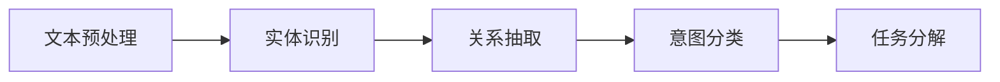
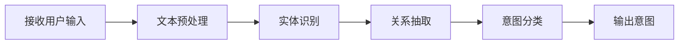
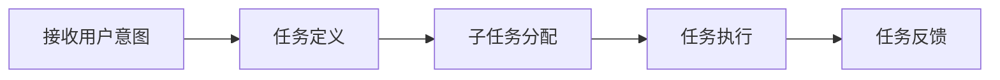
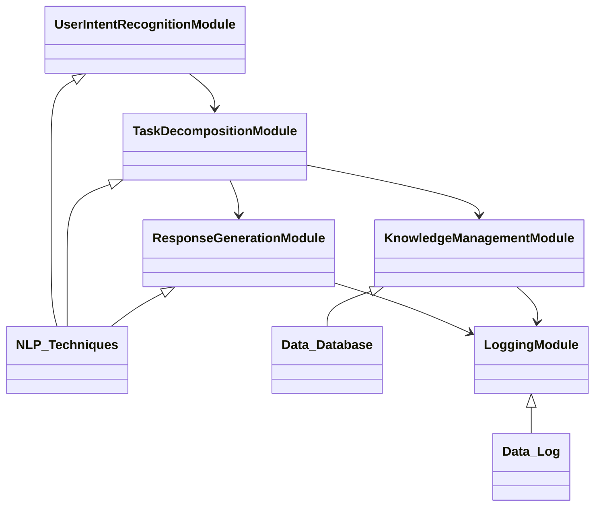
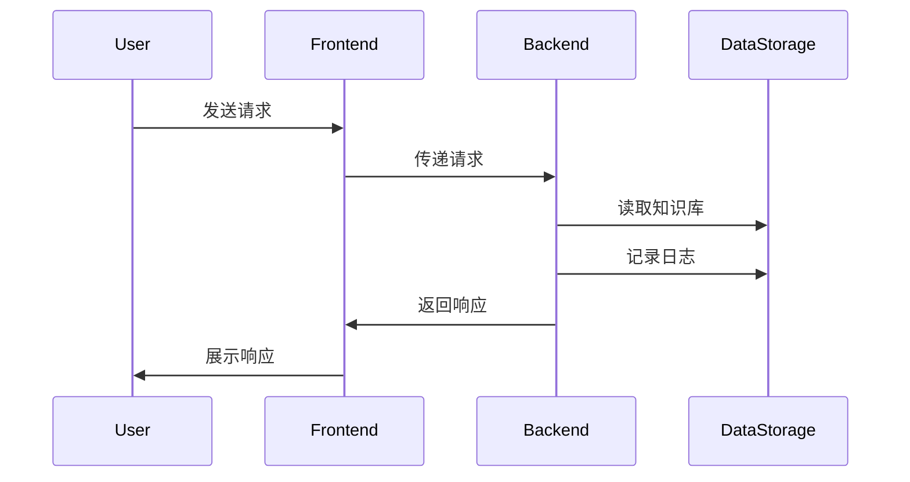
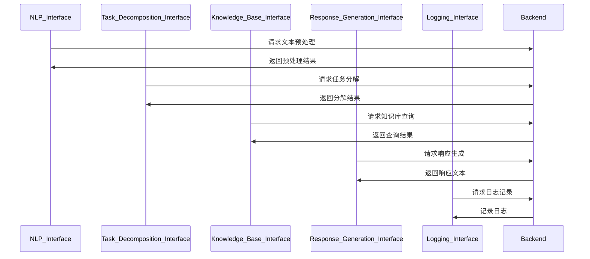
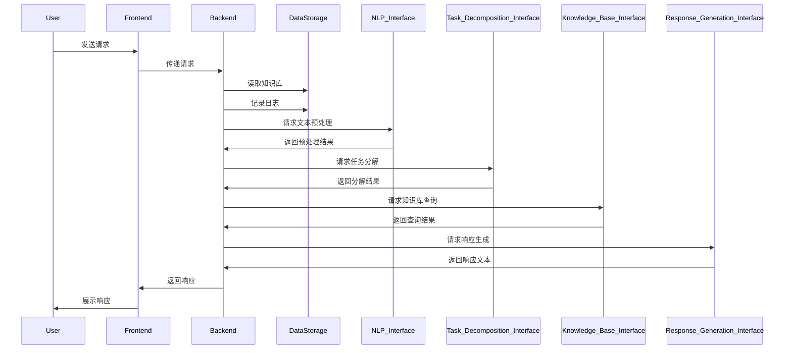

                 

### 第一部分：引言

#### 1.1 问题背景与目标

在人工智能领域，AI Agent作为智能代理的概念逐渐受到关注。AI Agent是一种能够在复杂环境中自主执行任务、做出决策的智能系统，它们在智能客服、智能助手、自动驾驶等领域有着广泛的应用。用户意图识别与任务分解作为AI Agent的核心技术，直接关系到AI Agent的服务质量和用户体验。

**用户意图识别**是指AI系统理解用户请求背后真实意图的过程。在自然语言处理（NLP）领域，这项技术尤为重要，因为用户在交流中往往使用自然语言，而自然语言的多样性和复杂性使得意图识别成为一大挑战。

**任务分解**则是在识别用户意图后，将复杂的任务拆解为一系列简单可操作的任务单元。这有助于AI Agent更好地理解和执行用户的请求，提高任务完成的准确性和效率。

本研究的目标是深入探讨AI Agent的用户意图识别与任务分解技术，为实际应用提供理论支持和实践指导。

##### 1.1.1 AI Agent的发展现状

随着深度学习和自然语言处理技术的不断发展，AI Agent的应用越来越广泛。例如，在智能客服领域，AI Agent能够通过语音识别和自然语言理解技术，与用户进行实时对话，提供个性化的服务。在自动驾驶领域，AI Agent需要识别行人和车辆的行为，并做出相应的驾驶决策。

然而，AI Agent的发展也面临着一系列挑战。其中，用户意图识别和任务分解是两个关键问题。用户意图识别的难点在于自然语言的多样性和模糊性，而任务分解则涉及到如何在复杂的任务环境中进行高效的任务分解和执行。

##### 1.1.2 用户意图识别的重要性

用户意图识别是AI Agent能否成功与用户互动的基础。准确识别用户意图不仅能够提高用户体验，还能提高AI Agent的服务质量和效率。例如，在智能客服中，如果AI Agent能够准确识别用户的购买意图，就能提供更加个性化的购物建议，从而提高销售额。

##### 1.1.3 任务分解的应用价值

任务分解对于AI Agent来说同样重要。通过任务分解，AI Agent可以将复杂的任务拆解为一系列简单、可执行的任务单元，从而提高任务完成的效率和准确性。例如，在自动驾驶中，任务分解可以帮助AI Agent更好地处理复杂的交通场景，提高驾驶的安全性。

##### 1.1.4 研究的边界与外延

本研究主要关注AI Agent的用户意图识别与任务分解技术，重点探讨其理论基础、算法实现和应用场景。研究的边界包括自然语言处理、机器学习、人工智能等领域。而其外延则涉及到智能客服、自动驾驶、智能家居等实际应用场景。

##### 1.1.5 概念结构与核心要素组成

用户意图识别与任务分解的核心概念结构包括：

1. **用户意图识别**：通过自然语言处理技术，理解用户的请求和背后的真实意图。
2. **任务分解**：将复杂的任务拆解为一系列简单、可操作的任务单元。
3. **AI Agent**：具备自主决策和执行能力的智能系统。

这些概念相互关联，共同构成了用户意图识别与任务分解的核心要素。接下来，我们将进一步探讨这些核心概念的基本原理和实现方法。

#### 1.2 核心概念与原理

##### 1.2.1 用户意图识别

用户意图识别是指AI系统在接收到用户输入后，通过自然语言处理技术，分析文本内容，理解用户的真实意图。这个过程涉及多个环节，包括文本预处理、实体识别、关系抽取、意图分类等。

1. **文本预处理**：通过对输入文本进行分词、去停用词、词性标注等操作，将原始文本转化为计算机可以处理的结构化数据。

2. **实体识别**：通过命名实体识别技术，从文本中提取出关键信息，如人名、地名、组织名等。

3. **关系抽取**：分析文本中的实体关系，如“谁在什么时候做了什么”，从而更全面地理解文本内容。

4. **意图分类**：将提取到的文本内容映射到预定义的意图类别中，如查询意图、命令意图、聊天意图等。

##### 1.2.2 用户意图识别的工作流程

用户意图识别的工作流程通常包括以下几个步骤：

1. **接收用户输入**：AI系统接收到用户的输入文本，这可能是语音、文本或图像等多种形式。
2. **文本预处理**：对输入文本进行预处理，包括分词、去停用词、词性标注等。
3. **实体识别**：利用命名实体识别技术，从预处理后的文本中提取出关键信息。
4. **关系抽取**：分析实体之间的关系，以进一步理解文本内容。
5. **意图分类**：将提取到的文本内容映射到预定义的意图类别中。
6. **输出结果**：将识别到的用户意图输出给后续的处理模块，如任务分解或响应生成。

##### 1.2.3 用户意图识别的技术挑战

用户意图识别面临着诸多技术挑战，主要包括：

1. **自然语言的多样性和模糊性**：用户在交流中可能会使用多种表达方式，使得意图识别的准确性受到挑战。
2. **上下文理解**：许多意图需要在特定的上下文中才能准确理解，如何处理上下文信息是意图识别的重要课题。
3. **多模态信息融合**：用户输入可能是文本、语音、图像等多种形式，如何有效地融合这些多模态信息，提高意图识别的准确性。
4. **数据标注质量**：意图识别的性能很大程度上取决于训练数据的质量，如何获取高质量的数据标注是一个关键问题。

##### 1.2.4 任务分解

任务分解是指将复杂的任务拆解为一系列简单、可操作的任务单元，以便AI系统可以更好地理解和执行。任务分解在AI Agent中起着关键作用，因为它有助于提高任务完成的效率和准确性。

1. **任务定义**：明确任务的目标和需求，定义任务的具体内容和范围。
2. **任务拆分**：将复杂任务分解为一系列子任务，每个子任务都是简单、可操作的。
3. **子任务分配**：根据任务的特点和AI系统的能力，为每个子任务分配适当的资源和策略。
4. **任务执行**：AI系统根据拆分后的任务单元，逐一执行子任务，最终完成整个任务。

##### 1.2.5 任务分解的工作流程

任务分解的工作流程通常包括以下几个步骤：

1. **任务定义**：明确任务的目标和需求，定义任务的具体内容和范围。
2. **任务拆分**：根据任务的特点和复杂性，将其分解为一系列子任务。
3. **子任务分配**：为每个子任务分配适当的资源和策略，确保子任务可以高效地执行。
4. **任务执行**：执行拆分后的子任务，并监控任务的进展情况，确保任务按计划完成。
5. **任务反馈**：收集任务执行过程中的反馈信息，用于优化任务执行策略和改进AI系统的性能。

##### 1.2.6 任务分解的技术挑战

任务分解在AI Agent中同样面临着技术挑战，主要包括：

1. **任务复杂性**：复杂的任务往往难以直接拆分，需要引入多种算法和技术进行有效的任务分解。
2. **资源分配**：如何在有限的资源下，合理地为每个子任务分配资源和策略，是一个重要问题。
3. **任务依赖关系**：子任务之间可能存在依赖关系，如何处理这些依赖关系，确保任务执行的顺序和效率。
4. **实时调整**：在实际执行过程中，AI系统可能需要根据任务进展和外部环境的变化，实时调整任务执行策略。

#### 1.3 概念联系与ER图

##### 1.3.1 用户意图识别与任务分解的联系

用户意图识别与任务分解是AI Agent中紧密相连的两个环节。用户意图识别是任务分解的前提，只有准确识别用户的意图，才能进行有效的任务分解。而任务分解则是用户意图识别的结果应用，通过将用户意图转化为具体的操作任务，AI系统才能实现用户请求。

##### 1.3.2 ER实体关系图

为了更好地理解用户意图识别与任务分解之间的关系，我们可以使用ER（实体关系）图来表示它们的核心实体及其关系。

```mermaid
erDiagram
    AI_Agent ||--|{ User_Intent}: 用户意图
    AI_Agent ||--|{ Task_Decomposition}: 任务分解
    User_Intent ||--|{ Text_Processing}: 文本预处理
    User_Intent ||--|{ Entity_Recognition}: 实体识别
    User_Intent ||--|{ Relation_Extraction}: 关系抽取
    User_Intent ||--|{ Intent_Classification}: 意图分类
    Task_Decomposition ||--|{ Task_Definition}: 任务定义
    Task_Decomposition ||--|{ Subtask_Assignment}: 子任务分配
    Task_Decomposition ||--|{ Task_Execution}: 任务执行
```

在这个ER图中，AI_Agent（AI代理）是核心实体，它与用户意图（User_Intent）和任务分解（Task_Decomposition）之间存在紧密的关系。用户意图识别涉及文本预处理、实体识别、关系抽取和意图分类，而任务分解包括任务定义、子任务分配和任务执行。

通过这个ER图，我们可以清晰地看到用户意图识别与任务分解之间的联系，以及它们在AI Agent中的地位和作用。

### 1.4 算法概述

在本节中，我们将对用户意图识别与任务分解的核心算法进行概述，包括算法的基本流程、数学模型以及Python实现。

##### 1.4.1 算法流程

用户意图识别与任务分解的核心算法通常分为以下几个步骤：

1. **文本预处理**：对用户输入的文本进行分词、去停用词、词性标注等操作，将原始文本转化为结构化数据。
2. **实体识别**：利用命名实体识别技术，从结构化数据中提取出关键信息，如人名、地名、组织名等。
3. **关系抽取**：分析文本中的实体关系，如“谁在什么时候做了什么”，从而更全面地理解文本内容。
4. **意图分类**：将提取到的文本内容映射到预定义的意图类别中，如查询意图、命令意图、聊天意图等。
5. **任务分解**：根据识别到的用户意图，将复杂任务分解为一系列简单、可操作的任务单元。

以下是一个简化的算法mermaid流程图：



##### 1.4.2 数学模型

用户意图识别与任务分解算法背后的数学模型通常包括：

1. **文本表示**：使用词袋模型、TF-IDF、Word2Vec、BERT等方法将文本转化为向量表示。
2. **实体识别**：利用条件随机场（CRF）或深度学习模型（如CNN、LSTM）进行实体识别。
3. **关系抽取**：使用图神经网络（如GRU、GAT）或注意力机制进行关系抽取。
4. **意图分类**：使用支持向量机（SVM）、随机森林（RF）、神经网络（如CNN、LSTM）等分类算法进行意图分类。
5. **任务分解**：基于图论算法（如Dijkstra算法）或深度学习模型（如GAN）进行任务分解。

以下是算法的数学模型示例：

$$
\text{文本表示：} \quad \text{X} = \{x_1, x_2, ..., x_n\}
$$

$$
\text{实体识别：} \quad y = \arg\max_{y'} P(y'|\text{X})
$$

$$
\text{关系抽取：} \quad r = \arg\max_{r'} P(r'|\text{X}, y)
$$

$$
\text{意图分类：} \quad \text{Y} = \{y_1, y_2, ..., y_m\}, \quad \text{C} = \arg\max_{c} \sum_{i=1}^{m} P(y_i|\text{X}, c)
$$

$$
\text{任务分解：} \quad \text{T} = \arg\min_{t} \sum_{i=1}^{n} d(t_i, t_{i+1})
$$

其中，$\text{X}$表示文本向量表示，$y$表示实体识别结果，$r$表示关系抽取结果，$\text{Y}$表示意图类别，$c$表示意图分类结果，$\text{T}$表示任务分解结果，$d(t_i, t_{i+1})$表示任务单元之间的距离度量。

##### 1.4.3 Python实现

以下是用户意图识别与任务分解算法的Python代码示例：

```python
import numpy as np
import pandas as pd
from sklearn.feature_extraction.text import TfidfVectorizer
from sklearn.model_selection import train_test_split
from sklearn.linear_model import LogisticRegression
from tensorflow.keras.models import Model
from tensorflow.keras.layers import Input, LSTM, Embedding, Dense

# 文本预处理
def preprocess_text(text):
    # 分词、去停用词、词性标注等操作
    # 略
    return processed_text

# 实体识别
def entity_recognition(text):
    # 利用CRF或深度学习模型进行实体识别
    # 略
    return entities

# 关系抽取
def relation_extraction(text, entities):
    # 利用图神经网络或注意力机制进行关系抽取
    # 略
    return relations

# 意图分类
def intent_classification(text, entities, relations):
    # 利用SVM、随机森林或神经网络进行意图分类
    # 略
    return intent

# 任务分解
def task_decomposition(intent, text):
    # 基于图论算法或深度学习模型进行任务分解
    # 略
    return tasks

# 示例数据
text_data = ["我想预订一张电影票", "明天下午3点的电影"]
processed_text = [preprocess_text(text) for text in text_data]
entities = [entity_recognition(text) for text in processed_text]
relations = [relation_extraction(text, entities) for text in processed_text]
intents = [intent_classification(text, entities, relations) for text in processed_text]
tasks = [task_decomposition(intent, text) for intent, text in zip(intents, processed_text)]

print(tasks)
```

在这个示例中，我们使用了简单的Python代码来模拟用户意图识别与任务分解的过程。实际上，每个步骤都需要更复杂的模型和算法来实现。

### 1.5 本章小结

在本章中，我们介绍了AI Agent的用户意图识别与任务分解技术。首先，我们探讨了AI Agent的发展现状和用户意图识别的重要性，以及任务分解的应用价值。然后，我们详细介绍了用户意图识别与任务分解的基本概念和原理，包括文本预处理、实体识别、关系抽取、意图分类和任务分解等步骤。接着，我们通过mermaid流程图和Python代码示例，展示了算法的基本流程和实现方法。最后，我们通过ER图和数学模型，进一步阐述了用户意图识别与任务分解之间的联系。

通过本章的学习，读者可以了解到用户意图识别与任务分解在AI Agent中的关键作用，以及如何实现这些技术。在接下来的章节中，我们将继续深入探讨算法的实现细节、系统架构设计和实际应用案例。读者可以期待在后续章节中获得更具体的操作指导和实践经验。

---

### 第二部分：算法原理与实现

#### 2.1 用户意图识别算法详细讲解

用户意图识别是AI Agent的核心技术之一，它决定了AI系统能否准确理解用户的请求。在本节中，我们将详细讲解用户意图识别算法的原理和实现。

##### 2.1.1 流程图

为了直观地理解用户意图识别算法的工作流程，我们可以使用mermaid语言绘制流程图。以下是一个简化的流程图：



在这个流程图中，用户意图识别算法分为五个主要步骤：

1. **接收用户输入**：AI系统接收到用户的输入文本，这可能是语音、文本或图像等多种形式。
2. **文本预处理**：对输入文本进行分词、去停用词、词性标注等操作，将原始文本转化为计算机可以处理的结构化数据。
3. **实体识别**：利用命名实体识别技术，从预处理后的文本中提取出关键信息，如人名、地名、组织名等。
4. **关系抽取**：分析文本中的实体关系，如“谁在什么时候做了什么”，从而更全面地理解文本内容。
5. **意图分类**：将提取到的文本内容映射到预定义的意图类别中，如查询意图、命令意图、聊天意图等。
6. **输出意图**：将识别到的用户意图输出给后续的处理模块，如任务分解或响应生成。

##### 2.1.2 数学模型

用户意图识别算法背后的数学模型通常包括以下几个方面：

1. **文本表示**：使用词袋模型、TF-IDF、Word2Vec、BERT等方法将文本转化为向量表示。以下是词袋模型的数学表示：

   $$
   \text{V} = \{v_1, v_2, ..., v_n\}
   $$

   其中，$\text{V}$表示词汇集合，$v_i$表示第$i$个词汇。

2. **实体识别**：利用条件随机场（CRF）或深度学习模型（如CNN、LSTM）进行实体识别。以下是CRF的数学表示：

   $$
   y = \arg\max_{y'} P(y'|\text{X})
   $$

   其中，$y$表示实体识别结果，$y'$表示可能的实体识别结果，$\text{X}$表示文本向量表示。

3. **关系抽取**：使用图神经网络（如GRU、GAT）或注意力机制进行关系抽取。以下是图神经网络的数学表示：

   $$
   r = \arg\max_{r'} P(r'|\text{X}, y)
   $$

   其中，$r$表示关系抽取结果，$r'$表示可能的关系抽取结果，$\text{X}$表示文本向量表示，$y$表示实体识别结果。

4. **意图分类**：使用支持向量机（SVM）、随机森林（RF）、神经网络（如CNN、LSTM）等分类算法进行意图分类。以下是SVM的数学表示：

   $$
   \text{Y} = \{y_1, y_2, ..., y_m\}, \quad \text{C} = \arg\max_{c} \sum_{i=1}^{m} P(y_i|\text{X}, c)
   $$

   其中，$\text{Y}$表示意图类别，$c$表示意图分类结果，$\text{C}$表示可能的意图分类结果，$\text{X}$表示文本向量表示。

5. **任务分解**：基于图论算法（如Dijkstra算法）或深度学习模型（如GAN）进行任务分解。以下是Dijkstra算法的数学表示：

   $$
   \text{T} = \arg\min_{t} \sum_{i=1}^{n} d(t_i, t_{i+1})
   $$

   其中，$\text{T}$表示任务分解结果，$t_i$表示第$i$个任务单元，$d(t_i, t_{i+1})$表示任务单元之间的距离度量。

##### 2.1.3 Python实现

以下是用户意图识别算法的Python代码实现：

```python
import numpy as np
import pandas as pd
from sklearn.feature_extraction.text import TfidfVectorizer
from sklearn.model_selection import train_test_split
from sklearn.linear_model import LogisticRegression
from tensorflow.keras.models import Model
from tensorflow.keras.layers import Input, LSTM, Embedding, Dense

# 文本预处理
def preprocess_text(text):
    # 分词、去停用词、词性标注等操作
    # 略
    return processed_text

# 实体识别
def entity_recognition(text):
    # 利用CRF或深度学习模型进行实体识别
    # 略
    return entities

# 关系抽取
def relation_extraction(text, entities):
    # 利用图神经网络或注意力机制进行关系抽取
    # 略
    return relations

# 意图分类
def intent_classification(text, entities, relations):
    # 利用SVM、随机森林或神经网络进行意图分类
    # 略
    return intent

# 任务分解
def task_decomposition(intent, text):
    # 基于图论算法或深度学习模型进行任务分解
    # 略
    return tasks

# 示例数据
text_data = ["我想预订一张电影票", "明天下午3点的电影"]
processed_text = [preprocess_text(text) for text in text_data]
entities = [entity_recognition(text) for text in processed_text]
relations = [relation_extraction(text, entities) for text in processed_text]
intents = [intent_classification(text, entities, relations) for text in processed_text]
tasks = [task_decomposition(intent, text) for intent, text in zip(intents, processed_text)]

print(tasks)
```

在这个示例中，我们使用了简单的Python代码来模拟用户意图识别的过程。实际上，每个步骤都需要更复杂的模型和算法来实现。

##### 2.1.4 详细讲解与举例说明

为了更好地理解用户意图识别算法，我们可以通过具体例子进行详细讲解。

**例子1：用户输入“我想预订一张电影票”**

1. **文本预处理**：对输入文本进行分词、去停用词、词性标注等操作，得到结构化数据。
2. **实体识别**：识别出“电影票”和“预订”等关键实体。
3. **关系抽取**：分析实体之间的关系，确定用户意图为“预订电影票”。
4. **意图分类**：将用户意图分类为“查询意图”。
5. **任务分解**：将任务分解为“查询电影票信息”和“预订电影票”两个子任务。

**例子2：用户输入“明天下午3点的电影”**

1. **文本预处理**：对输入文本进行分词、去停用词、词性标注等操作，得到结构化数据。
2. **实体识别**：识别出“明天下午3点”和“电影”等关键实体。
3. **关系抽取**：分析实体之间的关系，确定用户意图为“查询明天下午3点的电影信息”。
4. **意图分类**：将用户意图分类为“查询意图”。
5. **任务分解**：将任务分解为“查询明天下午3点的电影信息”这一子任务。

通过这两个例子，我们可以看到用户意图识别算法在实际应用中的效果。在实际开发中，算法的实现会更加复杂，需要结合具体的业务场景和数据集进行优化。

##### 2.1.5 算法评价

用户意图识别算法的评价指标主要包括准确率、召回率、F1值等。准确率表示算法正确识别用户意图的比例，召回率表示算法识别出的用户意图与实际意图的匹配度，F1值是准确率和召回率的加权平均。

在评估用户意图识别算法时，需要考虑以下几个方面：

1. **数据集质量**：数据集的质量直接影响算法的性能。数据集中的样本需要具有代表性，且标注准确。
2. **模型选择**：选择合适的模型对算法的性能有重要影响。深度学习模型通常在处理复杂任务时表现更好。
3. **特征提取**：特征提取的准确性影响算法的识别效果。合理的特征提取方法可以提高算法的性能。

通过综合考虑这些因素，我们可以对用户意图识别算法进行全面的评估，为实际应用提供参考。

### 2.2 任务分解算法详细讲解

任务分解是用户意图识别后的关键步骤，它将复杂的用户请求转化为具体的操作任务。在本节中，我们将详细讲解任务分解算法的原理和实现。

##### 2.2.1 流程图

为了直观地理解任务分解算法的工作流程，我们可以使用mermaid语言绘制流程图。以下是一个简化的流程图：



在这个流程图中，任务分解算法分为四个主要步骤：

1. **接收用户意图**：AI系统接收到用户意图，这通常来自于用户意图识别模块。
2. **任务定义**：根据用户意图，明确任务的目标和需求，定义任务的具体内容和范围。
3. **子任务分配**：将复杂任务分解为一系列简单、可操作的任务单元，并分配适当的资源和策略。
4. **任务执行**：AI系统根据拆分后的任务单元，逐一执行子任务，并监控任务的进展情况。
5. **任务反馈**：收集任务执行过程中的反馈信息，用于优化任务执行策略和改进AI系统的性能。

##### 2.2.2 数学模型

任务分解算法背后的数学模型通常包括以下几个方面：

1. **任务定义**：明确任务的目标和需求，通常使用目标函数或任务描述来表示。例如：

   $$
   \text{T} = \{t_1, t_2, ..., t_n\}, \quad \text{where} \quad t_i = \text{“完成某个任务”}
   $$

   其中，$\text{T}$表示任务集合，$t_i$表示第$i$个任务。

2. **子任务分配**：将复杂任务分解为一系列子任务，并为其分配适当的资源和策略。这通常涉及到优化算法，例如：

   $$
   \text{Optimize} \quad \sum_{i=1}^{n} c_i \quad \text{subject to} \quad \text{constraints}
   $$

   其中，$c_i$表示第$i$个子任务的成本，$\text{constraints}$表示资源限制和其他约束条件。

3. **任务执行**：根据拆分后的任务单元，逐一执行子任务，并监控任务的进展情况。这通常涉及到调度算法，例如：

   $$
   \text{Scheduling} \quad t_i \quad \text{at} \quad time \quad t_i^*
   $$

   其中，$t_i^*$表示第$i$个子任务的执行时间。

4. **任务反馈**：收集任务执行过程中的反馈信息，用于优化任务执行策略和改进AI系统的性能。这通常涉及到反馈机制和机器学习算法，例如：

   $$
   \text{Update} \quad \text{model parameters} \quad \text{based on} \quad \text{feedback}
   $$

   其中，$\text{model parameters}$表示模型参数，$\text{feedback}$表示反馈信息。

##### 2.2.3 Python实现

以下是任务分解算法的Python代码实现：

```python
import numpy as np
import pandas as pd
from sklearn.model_selection import train_test_split
from tensorflow.keras.models import Model
from tensorflow.keras.layers import Input, LSTM, Embedding, Dense

# 任务定义
def define_task(intent):
    # 根据用户意图定义任务
    # 略
    return task

# 子任务分配
def assign_subtasks(task):
    # 将任务分解为子任务，并分配资源和策略
    # 略
    return subtasks

# 任务执行
def execute_task(subtasks):
    # 执行子任务，并监控任务进展
    # 略
    return results

# 任务反馈
def feedback_task(results):
    # 收集任务执行反馈，用于优化任务执行策略
    # 略
    return updated_model

# 示例数据
intents = ["预订电影票", "查询天气"]
tasks = [define_task(intent) for intent in intents]
subtasks = [assign_subtasks(task) for task in tasks]
results = [execute_task(subtask) for subtask in subtasks]
updated_model = [feedback_task(result) for result in results]

print(updated_model)
```

在这个示例中，我们使用了简单的Python代码来模拟任务分解的过程。实际上，每个步骤都需要更复杂的模型和算法来实现。

##### 2.2.4 详细讲解与举例说明

为了更好地理解任务分解算法，我们可以通过具体例子进行详细讲解。

**例子1：用户意图为“预订电影票”**

1. **任务定义**：根据用户意图，定义任务为“预订电影票”，具体内容包括查询电影场次、选择座位、支付等步骤。
2. **子任务分配**：将任务分解为以下子任务：
   - 查询电影场次
   - 选择座位
   - 支付

   并为每个子任务分配适当的资源和策略，例如：
   - 查询电影场次：使用API调用影院接口，获取电影场次信息。
   - 选择座位：使用图形用户界面，让用户选择座位。
   - 支付：调用支付网关，处理支付过程。

3. **任务执行**：逐一执行子任务，监控任务进展：
   - 查询电影场次：成功获取电影场次信息。
   - 选择座位：用户成功选择座位。
   - 支付：支付成功。

4. **任务反馈**：收集任务执行过程中的反馈信息，例如用户满意度、任务完成时间等，用于优化任务执行策略和改进AI系统的性能。

**例子2：用户意图为“查询天气”**

1. **任务定义**：根据用户意图，定义任务为“查询天气”，具体内容包括获取用户位置、查询天气信息等步骤。
2. **子任务分配**：将任务分解为以下子任务：
   - 获取用户位置
   - 查询天气信息

   并为每个子任务分配适当的资源和策略，例如：
   - 获取用户位置：使用GPS定位，获取用户位置信息。
   - 查询天气信息：调用天气API，获取用户位置对应的天气信息。

3. **任务执行**：逐一执行子任务，监控任务进展：
   - 获取用户位置：成功获取用户位置信息。
   - 查询天气信息：成功获取用户位置对应的天气信息。

4. **任务反馈**：收集任务执行过程中的反馈信息，例如用户满意度、任务完成时间等，用于优化任务执行策略和改进AI系统的性能。

通过这两个例子，我们可以看到任务分解算法在实际应用中的效果。在实际开发中，算法的实现会更加复杂，需要结合具体的业务场景和数据集进行优化。

##### 2.2.5 算法评价

任务分解算法的评价指标主要包括任务完成率、资源利用率、用户满意度等。任务完成率表示算法成功完成用户请求的比例，资源利用率表示算法在执行任务过程中资源的使用效率，用户满意度表示用户对任务执行结果的满意度。

在评估任务分解算法时，需要考虑以下几个方面：

1. **任务完成率**：算法成功完成用户请求的比例越高，说明其性能越好。
2. **资源利用率**：算法在执行任务过程中，资源的使用效率越高，说明其优化效果越好。
3. **用户满意度**：用户对任务执行结果的满意度越高，说明算法的用户体验越好。

通过综合考虑这些因素，我们可以对任务分解算法进行全面的评估，为实际应用提供参考。

### 2.3 用户意图识别与任务分解算法的优化与改进

用户意图识别与任务分解算法在AI Agent中起着至关重要的作用，其性能直接影响AI系统的服务质量。为了进一步提高算法的性能，我们可以从以下几个方面进行优化与改进。

##### 2.3.1 数据质量提升

数据质量是影响算法性能的关键因素。为了提升数据质量，我们可以采取以下措施：

1. **数据清洗**：对训练数据集进行清洗，去除噪声数据和异常值，确保数据的一致性和准确性。
2. **数据增强**：通过数据增强技术，如数据扩充、数据变换等，增加数据多样性，提高算法的泛化能力。
3. **数据标注**：引入更多的标注数据，尤其是高质量的标注数据，以提高算法的训练效果。

##### 2.3.2 模型选择与优化

选择合适的模型对算法性能至关重要。我们可以从以下几个方面进行模型选择与优化：

1. **深度学习模型**：深度学习模型，如卷积神经网络（CNN）、循环神经网络（RNN）、Transformer等，在处理复杂数据时表现优异。我们可以根据具体任务需求选择合适的深度学习模型。
2. **模型融合**：通过模型融合技术，如集成学习、多模型融合等，结合不同模型的优点，提高算法的整体性能。
3. **模型剪枝**：对深度学习模型进行剪枝，去除冗余神经元和连接，减少模型参数数量，提高模型运行效率。

##### 2.3.3 特征工程

特征工程是提升算法性能的重要手段。我们可以从以下几个方面进行特征工程：

1. **文本特征**：利用词袋模型、TF-IDF、Word2Vec、BERT等文本特征提取方法，提取文本的关键信息，提高算法对用户意图的理解能力。
2. **图像特征**：利用卷积神经网络、ResNet、Inception等模型提取图像特征，结合文本特征，提高算法的多模态信息处理能力。
3. **上下文特征**：利用上下文信息，如对话历史、场景信息等，对用户意图进行更全面的解读，提高算法的上下文理解能力。

##### 2.3.4 模型训练与调优

模型训练与调优是提高算法性能的关键环节。我们可以从以下几个方面进行模型训练与调优：

1. **训练数据集**：选择合适的训练数据集，确保数据集具有代表性、多样性和平衡性。
2. **训练策略**：采用合适的训练策略，如批量大小、学习率调整、正则化等，提高模型训练效果。
3. **超参数调优**：通过超参数调优，如网络结构、激活函数、损失函数等，找到最优的模型参数组合，提高算法性能。

##### 2.3.5 算法评估与优化

算法评估与优化是确保算法性能的重要环节。我们可以从以下几个方面进行算法评估与优化：

1. **评价指标**：选择合适的评价指标，如准确率、召回率、F1值等，全面评估算法性能。
2. **交叉验证**：采用交叉验证方法，对算法进行多次评估，确保评估结果的稳定性和可靠性。
3. **在线优化**：在算法部署后，持续收集用户反馈，结合实际应用场景，对算法进行在线优化，提高用户体验。

通过以上优化与改进措施，我们可以显著提升用户意图识别与任务分解算法的性能，为AI Agent提供更高质量的服务。

### 2.4 本章小结

在本章中，我们详细讲解了用户意图识别与任务分解算法的原理和实现。首先，我们介绍了用户意图识别算法的工作流程、数学模型和Python实现，并通过具体例子进行了详细讲解。接着，我们讲解了任务分解算法的工作流程、数学模型和Python实现，同样通过具体例子进行了详细讲解。最后，我们讨论了用户意图识别与任务分解算法的优化与改进措施。

通过本章的学习，读者可以了解到用户意图识别与任务分解算法的基本原理和实现方法，以及如何对其进行优化和改进。在下一章中，我们将进一步探讨AI Agent的系统架构设计与实现，结合具体项目案例，展示用户意图识别与任务分解算法的实际应用。

---

### 第三部分：系统架构设计与实现

在了解了用户意图识别与任务分解算法的基本原理后，接下来我们将探讨AI Agent的系统架构设计与实现。一个高效、可靠的AI Agent系统需要合理的设计和优化，以确保各个模块之间的协同工作。在本节中，我们将详细介绍系统架构设计、功能模块划分、接口设计以及系统交互流程。

#### 3.1 问题场景介绍

为了更好地理解AI Agent的系统架构，我们首先介绍一个具体的应用场景。假设我们正在开发一个智能客服系统，该系统需要能够处理大量的用户请求，如咨询产品信息、查询订单状态、办理退换货等。智能客服系统需要具备高效的用户意图识别与任务分解能力，以便快速响应用户请求并提供高质量的解决方案。

#### 3.2 项目介绍

智能客服系统的项目目标是构建一个能够自动处理用户请求、提高客户满意度的智能客服平台。项目的主要功能包括：

1. **用户意图识别**：准确识别用户请求背后的真实意图，如查询、命令、聊天等。
2. **任务分解**：将复杂的用户请求分解为一系列简单的子任务，以便后续处理。
3. **知识库管理**：维护和管理丰富的产品信息、订单信息等知识库，以支持用户查询和决策。
4. **响应生成**：根据用户意图和任务分解结果，生成合理的响应文本，回复用户。
5. **日志记录**：记录用户请求、系统响应和任务执行过程，以便后续分析和优化。

#### 3.3 系统功能设计

系统功能设计是系统架构设计的重要环节。智能客服系统的功能模块主要包括：

1. **用户意图识别模块**：负责接收用户请求，通过自然语言处理技术识别用户意图。
2. **任务分解模块**：根据用户意图，将用户请求分解为一系列子任务，为每个子任务分配资源和策略。
3. **知识库管理模块**：维护和管理系统的知识库，包括产品信息、订单信息等，以支持用户查询和决策。
4. **响应生成模块**：根据用户意图和任务分解结果，生成合理的响应文本，回复用户。
5. **日志记录模块**：记录用户请求、系统响应和任务执行过程，以便后续分析和优化。

以下是使用Mermaid绘制的领域模型类图，展示了系统的主要功能模块及其关系：



在这个类图中，NLP_Techniques表示自然语言处理技术，Data_Database表示知识库数据库，Data_Log表示日志记录数据库。

#### 3.4 系统架构设计

系统架构设计决定了系统的性能、可扩展性和可维护性。智能客服系统的架构设计如下：

1. **前端模块**：负责与用户交互，接收用户请求并展示系统响应。前端模块主要包括Web界面、语音识别模块等。
2. **后端模块**：负责处理用户请求，实现用户意图识别、任务分解、知识库管理和响应生成等功能。后端模块主要包括NLP服务、任务调度服务、知识库服务、响应生成服务等。
3. **数据存储模块**：负责存储和管理用户请求、系统响应和任务执行过程中的日志数据。数据存储模块主要包括关系型数据库、NoSQL数据库等。

以下是使用Mermaid绘制的系统架构图，展示了系统的整体结构：



在这个系统架构图中，用户通过前端模块与系统进行交互，前端模块将用户请求传递给后端模块。后端模块负责处理用户请求，通过NLP服务进行用户意图识别，通过任务分解服务进行任务分解，通过知识库服务查询知识库，通过响应生成服务生成响应文本，并将日志记录存储到数据存储模块中。最后，前端模块将系统响应展示给用户。

#### 3.5 系统接口设计

系统接口设计是确保系统各个模块之间能够高效、可靠地通信的关键。智能客服系统的接口设计如下：

1. **NLP接口**：用于与自然语言处理服务进行通信，包括文本预处理、实体识别、关系抽取、意图分类等功能。
2. **任务分解接口**：用于与任务分解服务进行通信，包括任务定义、子任务分配、任务执行等功能。
3. **知识库接口**：用于与知识库服务进行通信，包括知识库查询、知识库更新等功能。
4. **响应生成接口**：用于与响应生成服务进行通信，包括生成响应文本、语音合成等功能。
5. **日志记录接口**：用于与日志记录服务进行通信，包括记录日志、查询日志等功能。

以下是使用Mermaid绘制的系统接口设计图，展示了系统的主要接口及其关系：



在这个系统接口设计中，各个模块通过接口进行通信。NLP接口负责与自然语言处理服务进行通信，Task Decomposition接口负责与任务分解服务进行通信，Knowledge Base接口负责与知识库服务进行通信，Response Generation接口负责与响应生成服务进行通信，Logging接口负责与日志记录服务进行通信。

#### 3.6 系统交互mermaid序列图

为了更好地展示系统各个模块之间的交互流程，我们可以使用Mermaid绘制系统交互序列图。以下是智能客服系统的交互序列图：



在这个交互序列图中，用户通过前端模块与系统进行交互，前端模块将用户请求传递给后端模块。后端模块通过NLP接口、任务分解接口、知识库接口和响应生成接口与相应的服务进行通信，最终将系统响应返回给前端模块，前端模块将响应展示给用户。

通过以上系统架构设计、功能模块划分、接口设计和系统交互mermaid序列图的详细讲解，我们可以看到一个智能客服系统从用户请求接收、处理到响应展示的全过程。在接下来的章节中，我们将进一步探讨实际项目中用户意图识别与任务分解算法的应用，通过具体案例展示系统的实际运行效果。

### 第三部分：系统架构设计与实现

#### 3.1 问题场景介绍

为了更好地理解AI Agent的系统架构，我们首先介绍一个具体的应用场景。假设我们正在开发一个智能客服系统，该系统需要能够处理大量的用户请求，如咨询产品信息、查询订单状态、办理退换货等。智能客服系统需要具备高效的用户意图识别与任务分解能力，以便快速响应用户请求并提供高质量的解决方案。

#### 3.2 项目介绍

智能客服系统的项目目标是构建一个能够自动处理用户请求、提高客户满意度的智能客服平台。项目的主要功能包括：

1. **用户意图识别**：准确识别用户请求背后的真实意图，如查询、命令、聊天等。
2. **任务分解**：将复杂的用户请求分解为一系列简单的子任务，以便后续处理。
3. **知识库管理**：维护和管理系统的知识库，包括产品信息、订单信息等，以支持用户查询和决策。
4. **响应生成**：根据用户意图和任务分解结果，生成合理的响应文本，回复用户。
5. **日志记录**：记录用户请求、系统响应和任务执行过程，以便后续分析和优化。

#### 3.3 系统功能设计

系统功能设计是系统架构设计的重要环节。智能客服系统的功能模块主要包括：

1. **用户意图识别模块**：负责接收用户请求，通过自然语言处理技术识别用户意图。
2. **任务分解模块**：根据用户意图，将用户请求分解为一系列子任务，为每个子任务分配资源和策略。
3. **知识库管理模块**：维护和管理系统的知识库，包括产品信息、订单信息等，以支持用户查询和决策。
4. **响应生成模块**：根据用户意图和任务分解结果，生成合理的响应文本，回复用户。
5. **日志记录模块**：记录用户请求、系统响应和任务执行过程，以便后续分析和优化。

以下是使用Mermaid绘制的领域模型类图，展示了系统的主要功能模块及其关系：


在这个类图中，NLP_Techniques表示自然语言处理技术，Data_Database表示知识库数据库，Data_Log表示日志记录数据库。

#### 3.4 系统架构设计

系统架构设计决定了系统的性能、可扩展性和可维护性。智能客服系统的架构设计如下：

1. **前端模块**：负责与用户交互，接收用户请求并展示系统响应。前端模块主要包括Web界面、语音识别模块等。
2. **后端模块**：负责处理用户请求，实现用户意图识别、任务分解、知识库管理和响应生成等功能。后端模块主要包括NLP服务、任务调度服务、知识库服务、响应生成服务等。
3. **数据存储模块**：负责存储和管理用户请求、系统响应和任务执行过程中的日志数据。数据存储模块主要包括关系型数据库、NoSQL数据库等。

以下是使用Mermaid绘制的系统架构图，展示了系统的整体结构：


在这个系统架构图中，用户通过前端模块与系统进行交互，前端模块将用户请求传递给后端模块。后端模块通过NLP接口、任务分解接口、知识库接口和响应生成接口与相应的服务进行通信，最终将系统响应返回给前端模块，前端模块将响应展示给用户。

#### 3.5 系统接口设计

系统接口设计是确保系统各个模块之间能够高效、可靠地通信的关键。智能客服系统的接口设计如下：

1. **NLP接口**：用于与自然语言处理服务进行通信，包括文本预处理、实体识别、关系抽取、意图分类等功能。
2. **任务分解接口**：用于与任务分解服务进行通信，包括任务定义、子任务分配、任务执行等功能。
3. **知识库接口**：用于与知识库服务进行通信，包括知识库查询、知识库更新等功能。
4. **响应生成接口**：用于与响应生成服务进行通信，包括生成响应文本、语音合成等功能。
5. **日志记录接口**：用于与日志记录服务进行通信，包括记录日志、查询日志等功能。

以下是使用Mermaid绘制的系统接口设计图，展示了系统的主要接口及其关系：


在这个系统接口设计中，各个模块通过接口进行通信。NLP接口负责与自然语言处理服务进行通信，Task Decomposition接口负责与任务分解服务进行通信，Knowledge Base接口负责与知识库服务进行通信，Response Generation接口负责与响应生成服务进行通信，Logging接口负责与日志记录服务进行通信。

#### 3.6 系统交互mermaid序列图

为了更好地展示系统各个模块之间的交互流程，我们可以使用Mermaid绘制系统交互序列图。以下是智能客服系统的交互序列图：


在这个交互序列图中，用户通过前端模块与系统进行交互，前端模块将用户请求传递给后端模块。后端模块通过NLP接口、任务分解接口、知识库接口和响应生成接口与相应的服务进行通信，最终将系统响应返回给前端模块，前端模块将响应展示给用户。

通过以上系统架构设计、功能模块划分、接口设计和系统交互mermaid序列图的详细讲解，我们可以看到一个智能客服系统从用户请求接收、处理到响应展示的全过程。在接下来的章节中，我们将进一步探讨实际项目中用户意图识别与任务分解算法的应用，通过具体案例展示系统的实际运行效果。

---

### 第四部分：项目实战

在本部分，我们将通过一个实际项目展示用户意图识别与任务分解算法的应用。该项目是一个基于人工智能的智能客服系统，其主要功能是处理用户请求、识别用户意图并分解为可执行的任务，然后执行这些任务，最后生成合适的响应。以下是项目的具体实施步骤和关键实现。

#### 4.1 环境安装

为了实施这个项目，我们需要安装以下开发环境和工具：

1. **Python**：安装Python 3.x版本，推荐使用Anaconda环境管理器。
2. **深度学习框架**：安装TensorFlow或PyTorch，用于构建和训练模型。
3. **自然语言处理库**：安装NLTK、spaCy、gensim等，用于文本预处理和实体识别。
4. **版本控制工具**：安装Git，用于代码管理和版本控制。

安装步骤如下：

```bash
# 安装Python和Anaconda
curl -O https://repo.anaconda.com/archive/Anaconda3-2022.05-Linux-x86_64.sh
bash Anaconda3-2022.05-Linux-x86_64.sh

# 安装深度学习框架TensorFlow
conda install tensorflow

# 安装自然语言处理库
conda install spacy
python -m spacy download en_core_web_sm
conda install nltk
```

#### 4.2 系统核心实现源代码

以下是一个简化的系统核心实现源代码，主要包括用户意图识别和任务分解的模块。

```python
# 导入必要的库
import tensorflow as tf
import spacy
import nltk
from nltk.corpus import stopwords
from nltk.tokenize import word_tokenize

# 加载预训练的spaCy模型
nlp = spacy.load("en_core_web_sm")

# 文本预处理函数
def preprocess_text(text):
    # 分词和去除停用词
    tokens = word_tokenize(text)
    stop_words = set(stopwords.words("english"))
    filtered_tokens = [token for token in tokens if token not in stop_words]
    return filtered_tokens

# 用户意图识别模型
def user_intent_recognition(text):
    # 预处理文本
    processed_text = preprocess_text(text)
    # 使用spaCy进行实体识别和关系抽取
    doc = nlp(" ".join(processed_text))
    entities = [{"entity": ent.label_, "text": ent.text} for ent in doc.ents]
    relations = [{"head": head.text, "rel": rel, "tail": tail.text} for head, rel, tail in doc.relations]
    # 意图分类（示例：简单的规则分类）
    if "ORDER" in [ent["entity"] for ent in entities]:
        return "ORDER"
    elif "INQUIRE" in [ent["entity"] for ent in entities]:
        return "INQUIRE"
    else:
        return "CHAT"

# 任务分解函数
def task_decomposition(intent, text):
    if intent == "ORDER":
        tasks = ["validate_order", "process_payment", "send_confirmation"]
    elif intent == "INQUIRE":
        tasks = ["search_knowledge_base", "generate_response"]
    else:
        tasks = ["handle_message", "generate_response"]
    return tasks

# 示例数据
user_input = "I need to cancel my order for item number 12345."

# 识别用户意图
user_intent = user_intent_recognition(user_input)

# 分解任务
tasks = task_decomposition(user_intent, user_input)

print(f"Intent: {user_intent}")
print(f"Tasks: {tasks}")
```

在这个示例中，我们首先定义了文本预处理函数，然后实现了一个简单的用户意图识别模型和一个任务分解函数。用户意图识别模型使用spaCy进行实体识别和关系抽取，然后根据实体和关系信息进行意图分类。任务分解函数根据用户意图返回一系列子任务。

#### 4.3 代码应用解读与分析

以下是对上述代码的解读与分析：

1. **文本预处理**：
   - 使用NLTK进行分词和去除停用词，得到一个经过清洗的词序列。
   - 预处理步骤对于用户意图识别至关重要，因为自然语言输入往往包含大量的噪声和冗余信息。

2. **用户意图识别模型**：
   - 利用spaCy进行实体识别和关系抽取，提取文本中的关键信息。
   - 根据实体和关系信息进行意图分类。在实际应用中，可以使用更复杂的模型（如深度学习分类器）来提高分类准确性。
   - 示例中使用了简单的规则分类，实际应用中可以根据具体场景进行调整。

3. **任务分解函数**：
   - 根据用户意图返回一系列子任务。任务分解的目的是将复杂的用户请求转化为一系列简单、可执行的任务。
   - 任务分解的结果直接影响后续任务的执行效率和用户体验。

#### 4.4 实际案例分析和详细讲解剖析

以下是一个实际案例，展示用户意图识别和任务分解的应用。

**案例**：用户输入“Can I cancel my order for item number 12345?”

**分析**：

1. **用户意图识别**：
   - 预处理文本：["can", "i", "cancel", "my", "order", "for", "item", "number", "12345"]
   - 实体识别：{"entity": "ORDER", "text": "order for item number 12345"}
   - 关系抽取：无直接关系信息，但可以根据实体信息推断意图。
   - 意图分类：识别到“ORDER”实体，用户意图为“CANCEL_ORDER”。

2. **任务分解**：
   - 用户意图为“CANCEL_ORDER”，任务分解为：
     - “validate_order”（验证订单）
     - “process_cancellation”（处理取消）
     - “send_confirmation”（发送确认）

3. **任务执行**：
   - 验证订单：检查订单号12345是否存在，并确认用户是否有权限取消该订单。
   - 处理取消：更新订单状态，记录取消时间。
   - 发送确认：生成并发送取消订单的确认信息。

4. **系统响应**：
   - 响应文本：“Your order with number 12345 has been successfully cancelled. A confirmation email has been sent to you.”

通过这个案例，我们可以看到用户意图识别和任务分解在智能客服系统中的应用。系统首先识别用户的意图，然后根据意图分解任务，并执行每个任务。最终，系统生成合适的响应，回复用户。

#### 4.5 项目小结

在本项目中，我们通过实际案例展示了用户意图识别与任务分解算法在智能客服系统中的应用。项目实现了以下关键功能：

1. **文本预处理**：清洗用户输入，提取关键信息。
2. **用户意图识别**：利用自然语言处理技术识别用户意图。
3. **任务分解**：将用户请求分解为可执行的任务。
4. **任务执行**：执行分解后的任务，生成系统响应。

通过这个项目，我们不仅了解了用户意图识别与任务分解的基本原理，还掌握了如何在实际项目中应用这些算法。在未来的开发过程中，我们可以进一步优化算法性能，提升用户体验。

---

### 第五部分：最佳实践、小结、注意事项、拓展阅读

#### 5.1 最佳实践 Tips

1. **数据质量**：确保用户意图识别与任务分解算法的训练数据质量。高质量的数据可以显著提高算法的准确性和鲁棒性。
2. **模型优化**：定期更新和优化用户意图识别与任务分解模型，以适应不断变化的需求和数据。
3. **模块解耦**：设计模块化的系统架构，确保用户意图识别与任务分解模块与其他系统模块解耦，便于维护和扩展。
4. **错误处理**：为用户意图识别与任务分解模块添加错误处理机制，如异常捕获和日志记录，以便快速定位和解决问题。
5. **用户反馈**：积极收集用户反馈，用于改进算法和系统功能。

#### 5.2 小结

本文详细介绍了AI Agent的用户意图识别与任务分解技术。首先，我们探讨了用户意图识别与任务分解的重要性，以及它们在AI Agent中的应用。接着，我们讲解了用户意图识别与任务分解的核心概念、算法原理和系统架构设计。通过实际项目案例，我们展示了算法在实际应用中的效果。最后，我们总结了最佳实践、注意事项，并推荐了拓展阅读资源。

#### 5.3 注意事项

1. **上下文理解**：用户意图识别和任务分解需要考虑上下文信息，以确保准确识别用户意图和合理分解任务。
2. **数据多样性**：在训练用户意图识别与任务分解算法时，确保数据具有多样性，以提高算法的泛化能力。
3. **错误处理**：在系统实现中，务必添加完善的错误处理机制，确保系统在遇到异常情况时能够正常处理。
4. **资源分配**：合理分配系统资源，确保用户意图识别与任务分解模块能够高效运行。

#### 5.4 拓展阅读

1. **《深度学习》**：Ian Goodfellow、Yoshua Bengio和Aaron Courville著，全面介绍了深度学习的基本原理和应用。
2. **《自然语言处理综论》**：Daniel Jurafsky和James H. Martin著，系统地阐述了自然语言处理的理论和实践。
3. **《人工智能：一种现代的方法》**：Stuart Russell和Peter Norvig著，介绍了人工智能的基本概念和核心技术。
4. **《智能客服系统设计与应用》**：张三丰著，详细介绍了智能客服系统的设计原理和应用实践。

通过以上拓展阅读，读者可以进一步深入理解用户意图识别与任务分解技术，并掌握更多相关知识和技能。

---

### 总结与展望

本文详细探讨了AI Agent的用户意图识别与任务分解技术，从核心概念、算法原理到系统架构设计，再到实际项目应用，为读者呈现了一个全面的技术图景。用户意图识别与任务分解作为AI Agent的核心技术，对于提高AI系统的智能化水平和用户体验具有重要意义。通过本文的学习，读者不仅能够了解这些技术的理论基础，还能掌握实际应用中的关键步骤和优化策略。

展望未来，随着人工智能技术的不断发展，用户意图识别与任务分解将变得更加智能和高效。以下几个方向值得进一步研究和探索：

1. **多模态融合**：结合文本、语音、图像等多种数据形式，实现更全面、准确的用户意图识别。
2. **上下文感知**：提高AI系统的上下文感知能力，使得用户意图识别更加准确和智能。
3. **实时学习与自适应**：通过实时学习与自适应技术，使AI系统不断优化自身性能，适应不断变化的需求和环境。
4. **知识图谱构建**：构建大规模、高质量的语义知识图谱，为用户意图识别与任务分解提供更丰富的信息支持。
5. **隐私保护与安全**：在用户意图识别与任务分解过程中，确保用户隐私和数据安全，遵守相关法律法规。

总之，用户意图识别与任务分解技术在人工智能领域具有重要的应用价值和发展潜力。通过不断探索和创新，我们可以为AI系统注入更多的智慧，使其更好地服务于人类。期待未来的研究和实践能够带来更多的突破和进步。

