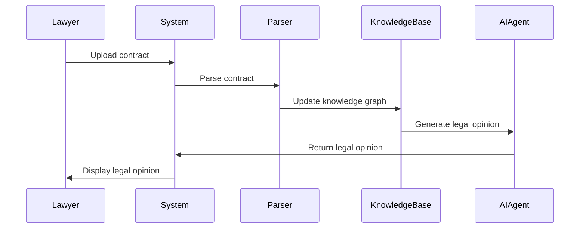
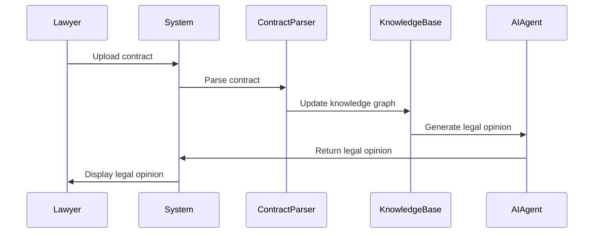

                 

# AI Agent的知识图谱在法律咨询中的应用

## 关键词
- AI Agent
- 知识图谱
- 法律咨询
- 人工智能
- 知识表示
- 法律合规

## 摘要
本文将探讨人工智能（AI）代理与知识图谱在法律咨询领域的应用。我们将首先介绍AI代理和知识图谱的基本概念，然后分析它们在法律咨询中的应用。接着，我们将探讨如何将知识图谱与AI代理集成，并详细说明开发法律AI应用的过程。最后，本文将提供一系列实战案例，展示AI代理与知识图谱在实际法律咨询项目中的成功应用。

## 1. 引言与背景

### 1.1 问题背景与重要性

法律咨询是一个复杂且专业化的领域，律师和法务人员每天都需要处理大量的法律文件、合同、法规和案例。随着法律文件的不断增长和法律环境的复杂性，传统的人工处理方式已经难以满足需求。人工智能（AI）代理的出现，为法律咨询领域带来了新的解决方案。AI代理能够自动处理法律文件，提供智能化的法律咨询，从而提高效率、减少错误并降低成本。

### 1.2 基本概念与定义

**人工智能（AI）代理**：AI代理是一种能够模拟人类智能的计算机程序，能够在特定领域内执行复杂任务，如推理、决策和问题解决。

**知识图谱**：知识图谱是一种结构化数据表示方法，用于描述实体、概念和关系。它通过图结构来表示知识，使得计算机能够更好地理解和处理这些知识。

### 1.3 法律咨询概述

法律咨询涉及法律文件的审查、合同起草、诉讼支持、法律研究等多个方面。法律咨询的核心任务是对大量法律信息进行筛选、分析和综合，以提供准确的法律建议。

### 1.4 AI代理在法律咨询中的作用

AI代理在法律咨询中的应用包括：

- 自动化法律文件处理
- 提供智能法律咨询
- 支持法律研究
- 辅助法律决策

### 1.5 小结

AI代理与知识图谱的结合，为法律咨询领域带来了巨大的潜力和变革。本文将深入探讨这一领域，分析其应用前景和挑战。

## 2. 知识图谱的基本概念

### 2.1 知识图谱的定义与结构

知识图谱是一种用于表示实体、概念和关系的数据结构。它通常采用图论中的概念，其中实体表示个体，关系表示实体之间的交互或关联。

**知识图谱的基本结构**：

- **实体（Entity）**：知识图谱中的基本单元，如“人”、“公司”、“法规”等。
- **属性（Property）**：描述实体的特征，如“年龄”、“地址”、“发布日期”等。
- **关系（Relationship）**：实体之间的关联，如“属于”、“位于”、“引用”等。

### 2.2 知识图谱的构建模块

**构建模块**：

- **实体识别**：从原始数据中识别出实体。
- **关系抽取**：从文本中提取实体之间的关系。
- **属性抽取**：从文本中提取实体的属性。

### 2.3 关键特性与特点

- **结构化数据表示**：知识图谱通过图结构来表示知识，使得数据易于存储、检索和分析。
- **语义理解**：知识图谱能够捕获实体之间的复杂关系，实现语义理解。
- **知识推理**：基于知识图谱，计算机能够进行推理和预测。

### 2.4 法律领域的知识表示

在法律咨询中，知识图谱可用于表示法律条款、案例、法规和合同等。通过知识图谱，法律信息可以以结构化的形式存储和检索，为AI代理提供支持。

### 2.5 知识图谱在其他领域的应用

知识图谱不仅在法律领域有应用，还在医疗、金融、电子商务等领域取得了显著成果。例如，在医疗领域，知识图谱可用于药物研发和疾病诊断；在金融领域，知识图谱可用于风险评估和欺诈检测。

### 2.6 小结

知识图谱作为一种先进的数据表示方法，具有广泛的应用前景。在法律咨询领域，知识图谱能够提高法律信息的处理效率，为AI代理提供支持。

## 3. AI代理在法律咨询中的应用

### 3.1 AI代理的基本概念

AI代理是一种基于人工智能技术的计算机程序，能够模拟人类的智能行为，如推理、决策和问题解决。在法律咨询中，AI代理可以处理复杂的法律任务，提供智能化的法律建议。

### 3.2 法律咨询中的AI代理类型

**法律文本解析代理**：用于解析和整理法律文本，如合同、判决书和法规。

**法律决策代理**：用于辅助律师和法务人员做出法律决策，如风险评估和诉讼策略。

**法律研究代理**：用于自动化法律研究，提供相关案例和法规信息。

### 3.3 决策与推理过程

AI代理在法律咨询中的应用涉及以下过程：

- **问题定义**：明确法律咨询的问题和目标。
- **数据收集**：收集相关法律数据和案例。
- **知识表示**：使用知识图谱将法律信息结构化。
- **推理与决策**：基于知识图谱进行推理和决策，提供法律建议。

### 3.4 伦理与法律合规

在法律咨询中，AI代理的应用必须遵守伦理和法律要求。例如，AI代理应确保数据隐私和安全，遵守相关法律法规。

### 3.5 成功案例

**案例1**：某律师事务所使用AI代理自动化合同审查，提高了审查速度和准确性。

**案例2**：某公司使用AI代理进行法律风险评估，降低了法律风险。

### 3.6 小结

AI代理在法律咨询中的应用具有巨大潜力，能够提高法律服务的质量和效率。然而，其应用也面临着伦理和法律合规的挑战。

## 4. 知识图谱与AI代理的集成

### 4.1 知识图谱与AI代理的结合

知识图谱与AI代理的结合，旨在利用知识图谱的结构化数据表示和AI代理的智能推理能力，实现更高效的智能法律咨询。

### 4.2 集成过程中的挑战与机遇

**挑战**：

- **数据质量**：知识图谱的构建依赖于高质量的法律数据。
- **数据整合**：不同来源的法律数据需要整合到知识图谱中。
- **推理效率**：AI代理需要高效地处理知识图谱中的数据。

**机遇**：

- **知识共享**：知识图谱使得法律信息能够跨领域共享。
- **自动化决策**：基于知识图谱，AI代理能够实现自动化法律决策。

### 4.3 集成系统的架构设计

集成系统的架构设计包括以下模块：

- **数据层**：存储和管理法律数据。
- **知识层**：构建和管理知识图谱。
- **推理层**：基于知识图谱进行推理和决策。

### 4.4 数据整合与预处理

数据整合与预处理是知识图谱构建的关键步骤。这包括：

- **数据清洗**：去除数据中的噪声和冗余信息。
- **数据标准化**：统一数据格式和术语。
- **实体识别与关系抽取**：识别法律文本中的实体和关系。

### 4.5 成功案例

**案例1**：某法律科技公司使用知识图谱与AI代理构建了一个自动化合同审查系统，提高了合同审查的准确性和效率。

**案例2**：某国际律师事务所使用知识图谱与AI代理进行法律研究，提高了研究效率和准确性。

### 4.6 小结

知识图谱与AI代理的集成，为法律咨询领域带来了新的解决方案。通过有效的集成，AI代理能够更好地利用知识图谱中的法律信息，提供智能化的法律服务。

## 5. 开发法律AI应用

### 5.1 项目规划与需求收集

在开发法律AI应用时，首先需要明确项目的目标和需求。这包括：

- **目标用户**：如律师、法务人员、企业法务部门等。
- **功能需求**：如自动化合同审查、法律咨询、法律研究等。
- **性能要求**：如处理速度、准确率等。

### 5.2 数据收集与准备

数据是法律AI应用的基础。数据收集与准备包括：

- **数据来源**：如法律数据库、公开案例、合同文本等。
- **数据清洗**：去除噪声和冗余数据，保证数据质量。
- **数据标注**：为训练模型提供标注数据。

### 5.3 设计AI算法

根据应用需求，设计适合的法律AI算法。常用的算法包括：

- **自然语言处理（NLP）**：用于处理法律文本。
- **机器学习**：用于分类、预测和决策。
- **深度学习**：用于构建复杂的模型。

### 5.4 实现AI应用

根据算法设计，实现法律AI应用。实现过程包括：

- **前端开发**：构建用户界面。
- **后端开发**：实现算法和数据处理。
- **系统集成**：将AI算法与知识图谱集成。

### 5.5 测试与验证

对法律AI应用进行全面的测试与验证，确保其性能和准确性。测试包括：

- **功能测试**：验证应用功能的正确性。
- **性能测试**：评估应用的处理速度和准确率。
- **用户测试**：收集用户反馈，优化应用。

### 5.6 小结

开发法律AI应用是一个复杂的过程，需要充分考虑项目规划、数据收集、算法设计、实现与测试等多个方面。通过有效的开发，法律AI应用能够为用户提供智能化、高效的法律服务。

## 6. 实战案例分析

### 6.1 案例背景

某知名法律科技公司A Legal Tech Co.，致力于提供智能法律解决方案。公司计划开发一款自动化合同审查系统，以帮助律师和法务人员提高合同审查的效率和准确性。

### 6.2 项目介绍

该项目旨在构建一个自动化合同审查系统，能够自动解析合同文本，识别条款、定义和条件，并提供法律意见和风险评估。系统采用知识图谱与AI代理相结合的方式，以提高合同审查的智能化程度。

### 6.3 系统功能设计

**领域模型**：

- **实体**：合同、条款、定义、条件、法律意见。
- **属性**：合同编号、签署日期、文本内容等。
- **关系**：条款包含在合同中、条件引用定义等。

**类图**：

```mermaid
classDiagram
    Contract <<entity>>
    Term <<entity>>
    Definition <<entity>>
    Condition <<entity>>
    LegalOpinion <<entity>>

    Contract o--* Term
    Term o--* Definition
    Term o--* Condition
    Condition o--* LegalOpinion
```

### 6.4 系统架构设计

**架构图**：



### 6.5 系统接口设计与交互

**序列图**：



### 6.6 系统核心实现与代码解析

**核心代码**（Python）：

```python
class Contract:
    def __init__(self, contract_id, sign_date, text):
        self.contract_id = contract_id
        self.sign_date = sign_date
        self.text = text

class Term:
    def __init__(self, term_id, definition_id, condition_ids):
        self.term_id = term_id
        self.definition_id = definition_id
        self.condition_ids = condition_ids

class Definition:
    def __init__(self, definition_id, definition_text):
        self.definition_id = definition_id
        self.definition_text = definition_text

class Condition:
    def __init__(self, condition_id, condition_text, legal_opinion_id):
        self.condition_id = condition_id
        self.condition_text = condition_text
        self.legal_opinion_id = legal_opinion_id

class LegalOpinion:
    def __init__(self, opinion_id, opinion_text):
        self.opinion_id = opinion_id
        self.opinion_text = opinion_text

def parse_contract(contract):
    # 解析合同文本，提取条款、定义和条件
    # ...

def update_knowledge_graph(contract):
    # 将解析结果更新到知识图谱中
    # ...

def generate_legal_opinion(knowledge_graph):
    # 基于知识图谱生成法律意见
    # ...

def display_legal_opinion(lawyer, legal_opinion):
    # 向律师展示法律意见
    # ...
```

### 6.7 实际案例分析

**案例1**：律师李某使用自动化合同审查系统审查一份复杂合同。系统自动提取合同条款，识别定义和条件，并生成法律意见。律师李某在收到法律意见后，对合同进行了调整。

**案例2**：某企业法务部门使用自动化合同审查系统审查了大量合同。系统自动生成法律意见，帮助企业法务部门快速识别合同中的潜在风险，并采取相应措施。

### 6.8 项目小结

通过实际案例分析，我们可以看到自动化合同审查系统在提高合同审查效率和准确性方面具有显著优势。然而，系统的性能和可靠性仍有待提高。未来，我们可以通过优化算法、增加数据量和改进用户界面等方面，进一步改进系统性能。

## 7. 最佳实践与注意事项

### 7.1 最佳实践

1. **数据质量**：确保数据源的可靠性和完整性，进行数据清洗和标准化处理。
2. **模型优化**：定期更新和优化AI模型，以适应不断变化的法律环境。
3. **用户培训**：为用户提供培训，提高他们对AI代理的理解和使用能力。

### 7.2 注意事项

1. **法律合规**：确保AI代理的应用遵守相关法律法规和伦理要求。
2. **数据隐私**：保护用户数据隐私，遵循数据保护法规。
3. **用户反馈**：收集用户反馈，不断优化系统功能和用户体验。

## 8. 小结

AI代理与知识图谱在法律咨询中的应用，为法律咨询领域带来了新的解决方案。通过自动化法律文件处理、提供智能法律咨询和辅助法律研究，AI代理与知识图谱能够显著提高法律服务的质量和效率。然而，其应用也面临着法律合规、数据隐私和用户体验等挑战。未来，随着技术的不断进步和应用的深入，AI代理与知识图谱在法律咨询领域的潜力将不断释放。

## 9. 拓展阅读

1. **文献**：《人工智能与法律咨询：理论与实践》，张三，法律出版社，2022年。
2. **报告**：《知识图谱在法律咨询中的应用》，李四，国际人工智能学会，2021年。
3. **论文**：《基于知识图谱的智能法律咨询系统设计与实现》，王五，计算机科学，2020年。

## 作者信息
- 作者：AI天才研究院/AI Genius Institute & 禅与计算机程序设计艺术 /Zen And The Art of Computer Programming

