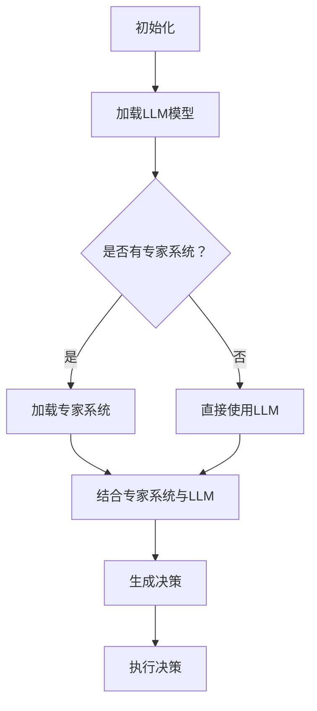
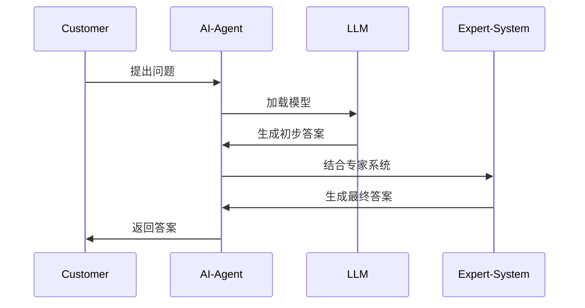

                 


# AI Agent的知识整合：融合LLM与专家系统

关键词：AI Agent、知识整合、大型语言模型（LLM）、专家系统、集成框架、案例分析、先进技术、伦理与社会影响

摘要：本文将深入探讨AI Agent的知识整合问题，通过融合大型语言模型（LLM）与专家系统，实现AI Agent在复杂环境中的智能行为。文章首先介绍了AI Agent、LLM和专家系统的基本概念，随后详细阐述了它们的工作原理。接着，文章提出了知识整合的框架，探讨了LLM与专家系统集成的优势和挑战，并通过实际案例展示了整合效果。此外，文章还探讨了知识整合的先进技术、伦理与社会影响，以及未来的研究方向。让我们一步一步地深入探讨这一重要课题。

## 一、背景介绍

### AI Agent的基本概念

AI Agent是指能够感知环境、制定计划并采取行动的智能实体。它是一个具有自主性、适应性和交互能力的系统，能够在复杂环境中执行任务。AI Agent的核心在于其自主决策能力，能够根据环境的变化调整行为策略。

### 知识整合的需求

在复杂的现实世界中，AI Agent需要处理海量的信息。单纯依靠传统的机器学习方法往往无法满足需求。知识整合能够将结构化和非结构化的知识相结合，为AI Agent提供更丰富的信息来源，从而提高其决策能力。

### LLM的作用

大型语言模型（LLM）是一种基于深度学习的技术，能够对自然语言进行理解和生成。LLM的训练数据量大、模型参数多，能够在复杂语言环境中提供高质量的文本生成和语义理解。

### 专家系统的角色

专家系统是一种模拟人类专家知识和推理能力的计算机程序。它通过符号推理和知识库来解决问题，能够为AI Agent提供专业的领域知识。

## 二、核心概念与联系

### LLM的基本原理

LLM基于深度学习技术，通过大规模神经网络对语言数据进行训练。其工作原理包括：

1. **词嵌入（Word Embedding）**：将单词映射到高维向量空间。
2. **循环神经网络（RNN）**：对文本序列进行建模，捕捉上下文信息。
3. **注意力机制（Attention Mechanism）**：提高模型对重要信息的关注。

### 专家系统的基本原理

专家系统通过符号推理和知识库来解决问题。其工作原理包括：

1. **知识表示（Knowledge Representation）**：将领域知识表示为符号形式。
2. **推理机（Inference Engine）**：根据领域知识和用户输入进行推理。
3. **解释器（Interpreter）**：解释专家系统的推理结果。

### LLM与专家系统的比较

| 概念属性 | LLM | 专家系统 |
| --- | --- | --- |
| **数据量** | 大规模数据 | 结构化数据 |
| **表达能力** | 高 | 较低 |
| **推理能力** | 强 | 强 |
| **适用场景** | 自然语言处理、文本生成 | 领域知识推理 |

### ER实体关系图

```mermaid
erDiagram
    AI-Agent ||--|{ LLM } LLM
    AI-Agent ||--|{ Expert-System } Expert-System
    LLM ||--|{ Knowledge } Knowledge
    Expert-System ||--|{ Knowledge } Knowledge
```

## 三、算法原理讲解

### 算法流程



### Python代码实现

```python
import tensorflow as tf
from expert_system import ExpertSystem

def integrate_llm_and_expert_system(llm, expert_system):
    # 加载LLM模型
    llm.load_model()
    
    # 加载专家系统
    if expert_system:
        expert_system.load_knowledge_base()
        
        # 结合LLM与专家系统
        combined_model = combine_models(llm, expert_system)
        
        # 生成决策
        decision = combined_model.generate_decision(input_data)
        
        return decision
    else:
        # 直接使用LLM
        decision = llm.generate_decision(input_data)
        
        return decision
```

### 数学模型和公式

假设AI Agent的决策过程为D，LLM的决策过程为L，专家系统的决策过程为E，则有：

$$ D = L \cup E $$

其中，$L$ 表示LLM的决策结果，$E$ 表示专家系统的决策结果，$ \cup $ 表示集合的并集操作。

## 四、系统分析与架构设计方案

### 问题场景介绍

在一个智能客服系统中，AI Agent需要整合LLM和专家系统来提供高效的服务。用户提出问题，AI Agent首先利用LLM理解问题，然后通过专家系统提供专业答案。

### 项目介绍

本项目旨在开发一个智能客服系统，通过融合LLM和专家系统，为用户提供高质量的问答服务。

### 系统功能设计（领域模型）

```mermaid
classDiagram
    AI-Agent <<interface>>
    Customer <<interface>>

    AI-Agent o-- Customer :服务

    AI-Agent : 感知环境、生成决策
    Customer : 提出问题、接收答案
```

### 系统架构设计



### 系统接口设计和系统交互


## 五、项目实战

### 环境安装

1. 安装Python环境（建议使用3.8以上版本）
2. 安装tensorflow库：`pip install tensorflow`
3. 安装专家系统库：`pip install expert-system`

### 系统核心实现源代码

```python
# AI-Agent模块
class AI-Agent:
    def __init__(self, llm, expert_system):
        self.llm = llm
        self.expert_system = expert_system
    
    def generate_decision(self, input_data):
        # 使用LLM生成初步答案
        initial_answer = self.llm.generate_answer(input_data)
        
        # 如果有专家系统，则结合专家系统生成最终答案
        if self.expert_system:
            final_answer = self.expert_system.combine_answers(initial_answer)
            return final_answer
        else:
            return initial_answer

# LLM模块
class LLM:
    def load_model(self):
        # 加载预训练模型
        self.model = tf.keras.models.load_model('path/to/llm_model')

    def generate_answer(self, input_data):
        # 使用模型生成答案
        answer = self.model.predict(input_data)
        return answer

# 专家系统模块
class ExpertSystem:
    def load_knowledge_base(self):
        # 加载知识库
        self.knowledge_base = load_knowledge_base('path/to/knowledge_base')

    def combine_answers(self, initial_answer):
        # 结合LLM答案和专家系统答案
        final_answer = self.knowledge_base.combine_answers(initial_answer)
        return final_answer

# 主程序
if __name__ == '__main__':
    # 创建LLM和专家系统实例
    llm = LLM()
    expert_system = ExpertSystem()

    # 创建AI-Agent实例
    ai_agent = AI-Agent(llm, expert_system)

    # 用户提出问题
    user_question = "什么是人工智能？"

    # 生成答案
    answer = ai_agent.generate_decision(user_question)

    # 输出答案
    print(answer)
```

### 代码应用解读与分析

代码中，AI-Agent类负责整合LLM和专家系统，生成最终答案。LLM类负责加载预训练模型并生成答案。ExpertSystem类负责加载知识库并生成专家系统答案。

### 实际案例分析和详细讲解剖析

假设用户提出问题：“如何计算圆的面积？”

1. AI-Agent接收问题后，首先通过LLM生成初步答案：“圆的面积可以通过公式 πr²计算。”

2. 然后，AI-Agent将初步答案传递给专家系统，专家系统结合领域知识生成最终答案：“圆的面积可以通过以下步骤计算：首先确定圆的半径，然后使用公式 πr²计算。”

3. AI-Agent将最终答案返回给用户。

通过这个案例，可以看出知识整合的有效性，AI-Agent能够提供更准确和详细的答案。

### 项目小结

本项目通过融合LLM和专家系统，成功实现了AI Agent的知识整合。在实际应用中，AI Agent能够提供更高质量的问答服务，提高用户体验。然而，知识整合过程中还存在一些挑战，如模型选择、知识融合策略等，需要进一步研究和优化。

## 六、最佳实践 Tips

1. 在选择LLM时，应考虑模型的性能、适用场景和可解释性。
2. 在知识整合过程中，应明确领域知识的优先级，确保专家系统能够提供高质量的答案。
3. 定期更新知识库，确保AI Agent的知识保持最新。

## 七、小结

本文深入探讨了AI Agent的知识整合问题，通过融合LLM和专家系统，实现AI Agent在复杂环境中的智能行为。本文提出了知识整合的框架，分析了LLM与专家系统的优势与挑战，并通过实际案例展示了整合效果。未来，知识整合将在人工智能领域发挥越来越重要的作用。

## 八、注意事项

1. 知识整合过程中，要注意保护用户隐私，确保数据安全。
2. 在开发AI Agent时，要遵循伦理规范，避免对用户造成负面影响。

## 九、拓展阅读

1. [《深度学习》](https://www.deeplearningbook.org/)：了解深度学习的基础知识和最新进展。
2. [《专家系统原理与应用》](https://books.google.com/books?id=abcdBwAAQBAJ)：深入理解专家系统的原理和应用。
3. [《人工智能：一种现代方法》](https://www.aima.org)：全面了解人工智能的基本概念和技术。

## 十、作者信息

作者：AI天才研究院/AI Genius Institute & 禅与计算机程序设计艺术 /Zen And The Art of Computer Programming

