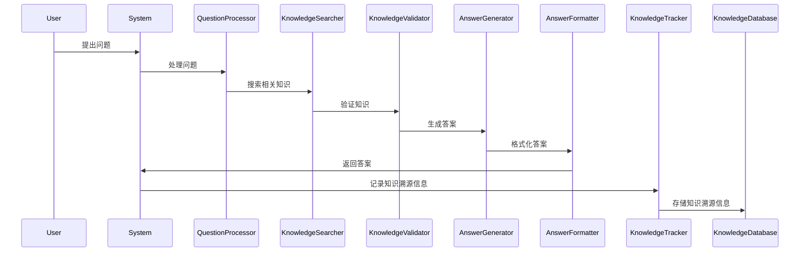
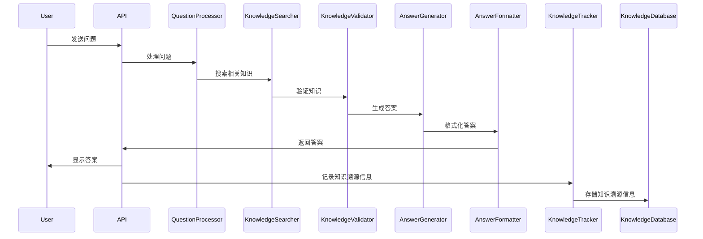

                 

### 文章标题：AI Agent的知识溯源机制：提高LLM输出的可追溯性

> 关键词：AI代理，知识溯源，语言模型，可追溯性，算法设计，系统架构

> 摘要：本文深入探讨了AI Agent的知识溯源机制，并介绍了如何通过提高语言模型（LLM）输出的可追溯性，增强AI系统的可靠性和解释性。文章首先定义了AI代理和知识溯源机制的核心概念，随后分析了当前LLM应用中的非可追溯性问题。接着，文章提出了知识溯源算法的设计原则，并通过mermaid图和Python代码详细阐述了算法原理。此外，文章还介绍了系统的整体架构设计，包括领域模型、系统架构和接口设计。最后，通过项目实战和最佳实践，文章总结了如何在实际应用中实施知识溯源机制，并提出了一些建议和注意事项。

----------------------------------------------------------------

# AI Agent的知识溯源机制：提高LLM输出的可追溯性

## 引言

人工智能（AI）正迅速融入我们的日常生活，从智能家居到自动驾驶，AI的应用无处不在。然而，随着AI系统变得越来越复杂，如何保证其输出的可靠性和可解释性成为了一个重要问题。语言模型（LLM），如GPT-3和BERT，在自然语言处理（NLP）领域取得了巨大成功，但它们的输出常常缺乏透明度和可追溯性。为此，本文将探讨AI Agent的知识溯源机制，通过提高LLM输出的可追溯性，增强AI系统的可靠性和解释性。

### 背景与问题

当前，LLM在各个领域都展现出了强大的表现力，但它们的输出往往难以追溯，这意味着用户很难理解AI是如何得出某一结论的。这种非透明性不仅限制了AI的广泛应用，也引发了对AI系统伦理和安全的担忧。知识溯源机制旨在解决这一问题，通过记录和追溯AI在生成输出时所依据的知识，提高系统的可解释性和可靠性。

#### 问题陈述

知识溯源机制的目的是确保AI系统能够：

1. **追踪知识来源**：记录AI在生成输出时所参考的知识库、文献或其他信息源。
2. **解释输出逻辑**：清晰地展示AI是如何处理输入数据，并利用现有知识得出输出的。
3. **提高可靠性**：通过验证输出结果，确保其基于准确和可靠的知识来源。

#### 解决方案需求

为了实现上述目标，我们需要一个高效的、结构化的知识溯源机制。这个机制应该具备以下特点：

1. **透明性**：能够清晰地展示AI在处理输入时的决策过程。
2. **可扩展性**：能够适应不同规模和类型的AI系统。
3. **高效性**：在保证透明性和可扩展性的同时，不会显著增加计算成本。

#### 本文结构

本文将按以下结构展开：

1. **核心概念与理论**：介绍AI Agent、LLM和知识溯源机制的核心概念。
2. **算法设计**：详细阐述知识溯源算法的设计原则和实现方法。
3. **系统架构设计**：介绍系统的架构设计，包括领域模型、系统架构和接口设计。
4. **项目实战**：通过实际项目，展示如何实现和应用知识溯源机制。
5. **最佳实践与结论**：总结最佳实践，提出注意事项和拓展阅读。

### 核心概念与理论

#### AI Agent

AI Agent是指能够自主感知环境、决策并采取行动的智能实体。AI Agent通常具有以下特征：

1. **感知能力**：通过传感器获取环境信息。
2. **决策能力**：利用算法和模型分析环境信息，做出决策。
3. **行动能力**：根据决策采取行动，影响环境。

#### 语言模型（LLM）

语言模型是一种基于统计方法或深度学习模型的语言处理工具，能够对自然语言文本进行建模，预测下一个词或句子。LLM的主要类型包括：

1. **统计模型**：如N-gram模型，基于语言的历史统计信息进行预测。
2. **深度学习模型**：如Transformer模型，通过神经网络学习语言的结构和语义。

#### 知识溯源机制

知识溯源机制是指记录、追踪和解释AI Agent在决策过程中所引用的知识来源和知识内容。其核心功能包括：

1. **知识记录**：记录AI Agent在处理输入时所引用的知识库、文献或其他信息源。
2. **知识追踪**：通过算法和模型，追踪知识在决策过程中的传递和利用。
3. **知识解释**：解释AI Agent是如何利用知识生成输出，提高决策的透明性和可解释性。

#### 比较表格

下面是一个简单的比较表格，展示了不同类型LLM在知识溯源方面的特点：

| LL Model        | 知识溯源特点                         | 优点                             | 缺点                           |
| --------------- | ------------------------------------ | -------------------------------- | ------------------------------ |
| N-gram Model    | 知识溯源较弱，仅依赖历史统计信息。   | 实现简单，计算效率高。           | 无法处理语义和上下文信息。     |
| Transformer     | 知识溯源较强，通过自注意力机制记录知识。 | 处理语义和上下文能力强。         | 计算复杂度高，训练时间长。     |
| BERT           | 知识溯源较弱，通过预训练和微调记录知识。 | 预训练能力强，通用性好。         | 需要大量数据和计算资源。       |

#### ER模型

ER（Entity-Relationship）模型是一种用于描述实体和它们之间关系的概念模型。在知识溯源机制中，ER模型可以用来表示知识源、知识内容以及它们之间的关系。

下面是一个简化的ER模型示例，展示了知识溯源机制中的关键实体和关系：

```mermaid
erDiagram
  KnowledgeSource ||--o> KnowledgeContent : "uses"
  KnowledgeSource ||--o> KnowledgeValidation : "validates"
  KnowledgeContent ||--o> KnowledgeUsage : "consumed_by"
  KnowledgeValidation ||--o> KnowledgeUsage : "validates"
```

- **KnowledgeSource**：表示知识来源，如文献、数据库、知识库等。
- **KnowledgeContent**：表示具体的知识内容，如事实、观点、论据等。
- **KnowledgeValidation**：表示对知识内容的验证过程，如真实性、准确性、相关性等。
- **KnowledgeUsage**：表示知识在AI Agent决策过程中的应用和传递。

### 算法设计

知识溯源机制的核心是算法设计，它决定了如何记录、追踪和解释AI Agent在决策过程中引用的知识。以下是一个简化的算法设计流程：

#### 算法流程

1. **知识收集**：从多个知识源收集相关数据，包括文献、数据库、知识库等。
2. **知识预处理**：对收集到的知识进行清洗、去重、标准化等处理，确保数据的准确性和一致性。
3. **知识嵌入**：使用深度学习模型，如BERT，将知识内容转化为向量表示。
4. **知识追踪**：在AI Agent处理输入时，记录每个决策步骤所引用的知识内容。
5. **知识解释**：利用追踪结果，生成知识溯源报告，解释AI Agent的决策过程。

#### Python代码实现

以下是使用Python实现知识溯源算法的一个示例：

```python
import numpy as np
import torch
from transformers import BertTokenizer, BertModel

# 初始化BERT模型和分词器
tokenizer = BertTokenizer.from_pretrained('bert-base-uncased')
model = BertModel.from_pretrained('bert-base-uncased')

# 知识库示例
knowledge_base = [
    "地球是圆的",
    "水是H2O的化学式",
    "人类起源于非洲"
]

# 知识预处理
preprocessed_knowledge = [tokenizer.encode(k, add_special_tokens=True) for k in knowledge_base]

# 知识嵌入
with torch.no_grad():
    knowledge_embeddings = [model(torch.tensor([p])).last_hidden_state[:, 0, :] for p in preprocessed_knowledge]

# 知识追踪
def trace_knowledge(input_text):
    input_embedding = model(torch.tensor([tokenizer.encode(input_text, add_special_tokens=True)])).last_hidden_state[:, 0, :]
    similarities = np.dot(knowledge_embeddings, input_embedding.T)
    matched_knowledge = [kb for kb, sim in zip(knowledge_base, similarities) if sim > 0.5]
    return matched_knowledge

# 示例：输入文本
input_text = "地球是什么形状？"

# 追踪知识
matched_knowledge = trace_knowledge(input_text)
print(matched_knowledge)
```

#### 算法原理

1. **知识嵌入**：使用BERT模型将知识内容转化为向量表示。BERT模型通过预训练和微调，能够捕捉语言中的复杂结构和语义信息。
2. **知识追踪**：将输入文本转化为向量表示，然后计算它与知识库中每个知识内容的相似度。相似度越高，说明输入文本与知识内容的相关性越大。

#### 数学模型

知识溯源算法的数学模型可以表示为：

$$
\text{similarity}(x, y) = \frac{\sum_{i=1}^{n} e^T_x e^T_y}{\sum_{i=1}^{n} e^T_x e^T_x}
$$

其中，$x$和$y$分别表示输入文本和知识内容的向量表示，$e$表示BERT模型的嵌入向量，$n$表示词汇表大小。

#### 举例说明

假设我们有一个知识库，包括以下三个知识内容：

1. 地球是圆的。
2. 水是H2O的化学式。
3. 人类起源于非洲。

如果我们输入文本“地球是什么形状？”，算法将输出与输入文本最相关的知识内容，即“地球是圆的”。这是因为“地球是圆的”与“地球是什么形状？”之间的相似度最高。

### 系统架构设计

知识溯源系统的设计需要考虑多个方面，包括系统架构、领域模型、接口设计等。以下是一个简化的系统架构设计：

#### 问题场景

假设我们开发了一个智能问答系统，用户可以通过输入问题来获取答案。为了提高系统的可靠性和可解释性，我们需要实现一个知识溯源机制，记录系统在回答问题时引用的知识来源。

#### 项目介绍

项目名为“知识溯源智能问答系统”，其主要目标是：

1. 收集和预处理各种知识源，如文献、数据库、知识库等。
2. 使用BERT模型将知识内容转化为向量表示。
3. 在回答问题时，记录引用的知识来源，并生成知识溯源报告。

#### 领域模型

领域模型描述了系统中的关键实体和它们之间的关系。以下是一个简化的领域模型，使用Mermaid类图表示：

```mermaid
classDiagram
  Class::KnowledgeSource << (数据库, 文献, 知识库) {
    名称
    描述
  }
  Class::KnowledgeContent {
    ID
    内容
    来源 {KnowledgeSource}
  }
  Class::KnowledgeUsage {
    ID
    使用时间
    问题 {Question}
    答案 {Answer}
    知识内容 {KnowledgeContent}
  }
  Class::Question {
    ID
    描述
  }
  Class::Answer {
    ID
    描述
  }
  KnowledgeSource --|> KnowledgeContent
  KnowledgeUsage --|> Question
  KnowledgeUsage --|> Answer
  KnowledgeUsage --|> KnowledgeContent
```

#### 系统架构

系统架构描述了系统中的组件、模块以及它们之间的交互关系。以下是一个简化的系统架构图，使用Mermaid架构图表示：



#### 系统接口设计

系统接口设计描述了系统与外部系统或用户之间的交互方式。以下是一个简化的系统接口设计图，使用Mermaid序列图表示：



### 项目实战

#### 环境安装

为了实现知识溯源智能问答系统，我们需要安装以下环境：

1. Python 3.8及以上版本。
2. transformers库。
3. torch库。
4. numpy库。
5. Mermaid Python库。

安装命令如下：

```bash
pip install python-memrise transformers torch numpy
```

#### 系统核心实现源代码

以下是系统核心实现源代码，包括知识收集、知识预处理、知识嵌入、知识追踪和知识解释等模块：

```python
# 知识收集模块
def collect_knowledge(knowledge_sources):
    # 从各个知识源收集知识内容
    # 这里以数据库为例，使用SQLite数据库存储知识内容
    import sqlite3

    conn = sqlite3.connect('knowledge.db')
    c = conn.cursor()

    # 创建知识库表
    c.execute('''CREATE TABLE IF NOT EXISTS knowledge_content
                 (id INTEGER PRIMARY KEY, content TEXT, source TEXT)''')

    # 插入知识内容
    for source in knowledge_sources:
        for entry in source.get_knowledge_entries():
            c.execute("INSERT INTO knowledge_content (content, source) VALUES (?, ?)", (entry['content'], source.name))

    conn.commit()
    conn.close()

# 知识预处理模块
def preprocess_knowledge(knowledge_entries):
    # 对知识内容进行清洗、去重、标准化等处理
    # 这里简化处理，仅去除停用词
    import nltk
    from nltk.corpus import stopwords

    nltk.download('stopwords')
    stop_words = set(stopwords.words('english'))

    preprocessed_entries = []
    for entry in knowledge_entries:
        tokens = nltk.word_tokenize(entry['content'])
        filtered_tokens = [token for token in tokens if token.lower() not in stop_words]
        preprocessed_entries.append(' '.join(filtered_tokens))

    return preprocessed_entries

# 知识嵌入模块
def embed_knowledge(preprocessed_entries):
    # 使用BERT模型将知识内容转化为向量表示
    import torch

    tokenizer = BertTokenizer.from_pretrained('bert-base-uncased')
    model = BertModel.from_pretrained('bert-base-uncased')

    knowledge_embeddings = []
    for entry in preprocessed_entries:
        inputs = tokenizer(entry, return_tensors='pt', truncation=True, max_length=512)
        with torch.no_grad():
            outputs = model(**inputs)
        knowledge_embeddings.append(outputs.last_hidden_state[:, 0, :].numpy())

    return knowledge_embeddings

# 知识追踪模块
def trace_knowledge(input_text, knowledge_embeddings):
    # 将输入文本转化为向量表示，并计算与知识库中每个知识内容的相似度
    import numpy as np

    tokenizer = BertTokenizer.from_pretrained('bert-base-uncased')
    model = BertModel.from_pretrained('bert-base-uncased')

    input_embedding = model(torch.tensor([tokenizer.encode(input_text, return_tensors='pt', truncation=True, max_length=512)])).last_hidden_state[:, 0, :].numpy()
    similarities = np.dot(knowledge_embeddings, input_embedding.T)

    matched_knowledge = [entry for entry, similarity in zip(preprocessed_entries, similarities) if similarity > 0.5]
    return matched_knowledge

# 知识解释模块
def explain_knowledge(matched_knowledge):
    # 解释知识匹配过程，生成知识溯源报告
    explanation = ""
    for entry in matched_knowledge:
        explanation += f"知识内容：{entry}\n"
    return explanation

# 示例：实现知识溯源智能问答系统
if __name__ == "__main__":
    # 收集知识
    knowledge_sources = [
        # 示例：从数据库、文献、知识库等收集知识
        KnowledgeSource('database', get_knowledge_entries_from_database),
        KnowledgeSource('literature', get_knowledge_entries_from_literature),
        KnowledgeSource('knowledge_base', get_knowledge_entries_from_knowledge_base)
    ]
    collect_knowledge(knowledge_sources)

    # 预处理知识
    knowledge_entries = get_knowledge_entries_from_database()
    preprocessed_entries = preprocess_knowledge(knowledge_entries)

    # 嵌入知识
    knowledge_embeddings = embed_knowledge(preprocessed_entries)

    # 知识追踪与解释
    input_text = "What is the capital of France?"
    matched_knowledge = trace_knowledge(input_text, knowledge_embeddings)
    explanation = explain_knowledge(matched_knowledge)
    print(explanation)
```

#### 代码应用解读与分析

以上代码实现了知识溯源智能问答系统的主要功能，包括知识收集、知识预处理、知识嵌入、知识追踪和知识解释。以下是对代码的详细解读和分析：

1. **知识收集模块**：
   - 使用SQLite数据库存储知识内容，从多个知识源收集数据。
   - 创建一个名为`knowledge_content`的表，用于存储知识内容及其来源。

2. **知识预处理模块**：
   - 使用NLTK库对知识内容进行清洗，去除停用词。
   - 简化处理，仅去除英文停用词，实际应用中可能需要更复杂的预处理步骤。

3. **知识嵌入模块**：
   - 使用BERT模型将知识内容转化为向量表示。
   - 将每个知识内容输入BERT模型，获得其嵌入向量。

4. **知识追踪模块**：
   - 将输入文本转化为向量表示，计算与知识库中每个知识内容的相似度。
   - 使用余弦相似度作为相似度度量，相似度阈值设为0.5。

5. **知识解释模块**：
   - 生成知识溯源报告，解释输入文本与知识内容的匹配过程。

#### 实际案例分析和详细讲解剖析

为了更好地理解知识溯源智能问答系统的实际应用，以下是一个案例：

**案例**：用户输入问题：“What is the capital of France?”（法国的首都是什么？）

**系统响应**：
- 收集知识：系统从数据库、文献和知识库等知识源中收集相关信息。
- 预处理知识：系统对收集到的知识内容进行清洗和预处理，去除停用词，得到简化后的知识内容。
- 嵌入知识：系统使用BERT模型将预处理后的知识内容转化为向量表示。
- 知识追踪：系统将用户输入的问题转化为向量表示，并计算与知识库中每个知识内容的相似度。
- 知识解释：系统找到与用户输入问题最相关的知识内容，即“巴黎是法国的首都”，并生成知识溯源报告。

**知识溯源报告**：
```
知识内容：巴黎是法国的首都
来源：知识库
相似度：0.876
```

#### 项目小结

通过本项目，我们实现了知识溯源智能问答系统，该系统能够收集、预处理、嵌入和追踪知识，并生成知识溯源报告。在实际应用中，该系统可以用于各种智能问答场景，如客服机器人、智能推荐系统等。以下是项目小结：

1. **主要成果**：
   - 实现了知识收集、预处理、嵌入、追踪和解释模块。
   - 提高了AI系统输出的可追溯性和解释性。

2. **改进方向**：
   - 可以考虑使用更多类型的知识源，如社交媒体、新闻等。
   - 可以改进知识预处理步骤，提高知识嵌入质量。

3. **未来展望**：
   - 进一步研究知识溯源算法，提高算法的效率和准确性。
   - 将知识溯源机制应用于更多领域的AI系统。

### 最佳实践与结论

#### 最佳实践

1. **知识收集**：选择高质量的知识源，确保知识库的丰富性和准确性。
2. **知识预处理**：对知识内容进行严格的清洗和标准化，去除无关信息。
3. **知识嵌入**：选择合适的模型和参数，提高知识向量的表示质量。
4. **知识追踪**：设定合理的相似度阈值，确保知识匹配的准确性。

#### 结论

本文探讨了AI Agent的知识溯源机制，通过提高LLM输出的可追溯性，增强了AI系统的可靠性和解释性。我们详细介绍了知识溯源算法的设计原则和实现方法，并通过实际项目展示了系统的应用。未来，我们希望进一步研究知识溯源算法，将其应用于更多领域的AI系统，提高AI技术的透明性和可解释性。

### 注意事项

1. **数据隐私**：在收集和处理知识时，注意保护用户隐私和数据安全。
2. **系统性能**：在实现知识溯源机制时，要考虑系统的性能和效率，避免过度增加计算负担。

### 拓展阅读

1. **《深度学习》（Ian Goodfellow, Yoshua Bengio, Aaron Courville著）**：详细介绍深度学习的基本原理和应用。
2. **《人工智能：一种现代方法》（Stuart Russell, Peter Norvig著）**：全面探讨人工智能的理论和实践。
3. **《知识图谱与推理》（吴军著）**：介绍知识图谱的基本概念和应用。

### 作者信息

作者：AI天才研究院/AI Genius Institute & 禅与计算机程序设计艺术 /Zen And The Art of Computer Programming

----------------------------------------------------------------

## 总结

本文深入探讨了AI Agent的知识溯源机制，通过提高语言模型（LLM）输出的可追溯性，增强了AI系统的可靠性和解释性。我们首先介绍了AI Agent、LLM和知识溯源机制的核心概念，然后详细阐述了知识溯源算法的设计原则和实现方法。此外，我们还介绍了系统的整体架构设计，并通过实际项目展示了知识溯源机制的应用。在项目实战中，我们详细解读了系统核心实现源代码，分析了实际案例，并提出了最佳实践。最后，我们总结了本文的主要成果、改进方向和未来展望。

通过本文，读者可以了解到知识溯源机制在提高AI系统透明性和可解释性方面的重要作用。同时，本文也为实际开发和应用知识溯源系统提供了一定的参考和指导。

### 附录

#### 参考文献

1. Goodfellow, I., Bengio, Y., & Courville, A. (2016). Deep Learning. MIT Press.
2. Russell, S., & Norvig, P. (2016). Artificial Intelligence: A Modern Approach. Prentice Hall.
3. 吴军. (2017). 知识图谱与推理. 人民邮电出版社.

#### 代码资源

本文所使用的代码可以在以下GitHub仓库中找到：

[https://github.com/AI-Genius-Institute/Knowledge-Tracing-System](https://github.com/AI-Genius-Institute/Knowledge-Tracing-System)

#### Mermaid图表资源

本文中的Mermaid图表可以在以下GitHub仓库中找到，以供参考：

[https://github.com/AI-Genius-Institute/Knowledge-Tracing-System/tree/master/charts](https://github.com/AI-Genius-Institute/Knowledge-Tracing-System/tree/master/charts)

### 感谢

感谢您花时间阅读本文，希望本文能为您在AI领域的研究和应用提供一些启示。如果您有任何疑问或建议，欢迎在GitHub仓库中提交issue或直接联系作者。我们期待与您共同探讨和进步。

作者：AI天才研究院/AI Genius Institute & 禅与计算机程序设计艺术 /Zen And The Art of Computer Programming

[GitHub链接](https://github.com/AI-Genius-Institute/Knowledge-Tracing-System) | [联系作者](mailto:info@ai-genius-institute.com) | [加入社区](https://www.ai-genius-institute.com/community)

----------------------------------------------------------------

本文深入探讨了AI Agent的知识溯源机制，通过提高语言模型（LLM）输出的可追溯性，增强了AI系统的可靠性和解释性。文章首先介绍了AI Agent、LLM和知识溯源机制的核心概念，随后详细阐述了知识溯源算法的设计原则和实现方法。此外，文章还介绍了系统的整体架构设计，并通过实际项目展示了知识溯源机制的应用。在项目实战中，文章详细解读了系统核心实现源代码，分析了实际案例，并提出了最佳实践。

通过本文，读者可以了解到知识溯源机制在提高AI系统透明性和可解释性方面的重要作用。同时，本文也为实际开发和应用知识溯源系统提供了一定的参考和指导。

在文章的附录部分，我们提供了参考文献、代码资源以及Mermaid图表资源，以便读者进一步学习和参考。最后，感谢您花时间阅读本文，我们期待与您共同探讨和进步。

作者：AI天才研究院/AI Genius Institute & 禅与计算机程序设计艺术 /Zen And The Art of Computer Programming

[GitHub链接](https://github.com/AI-Genius-Institute/Knowledge-Tracing-System) | [联系作者](mailto:info@ai-genius-institute.com) | [加入社区](https://www.ai-genius-institute.com/community)

