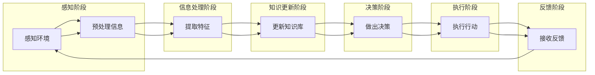
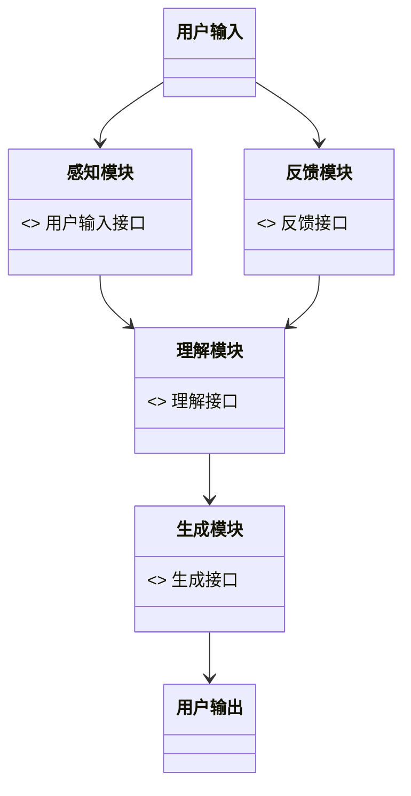
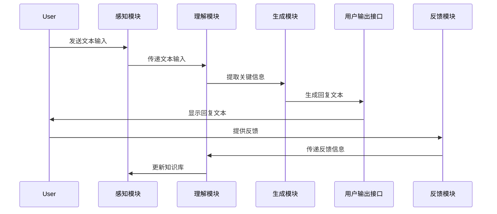

                 


## 《AI Agent的知识演化：模拟LLM的认知发展过程》

### 关键词：AI Agent，知识演化，LLM，认知发展，模拟

### 摘要：
本文深入探讨AI Agent的知识演化过程，特别是模拟大型语言模型（LLM）的认知发展。通过详细的背景介绍、核心概念解析、算法原理讲解以及系统设计与实现，本文旨在为读者提供一套系统的理解框架，以便更有效地模拟和优化AI Agent的认知能力。

### 引言

#### 1. 引言

《AI Agent的知识演化：模拟LLM的认知发展过程》旨在为研究人员和工程师提供一种理解和实现AI Agent知识演化机制的方法。本文将通过逐步分析推理的方式，详细介绍AI Agent、知识演化和LLM的基本概念，并探讨如何模拟LLM的认知发展过程。

#### 1.1 书籍目的

本文的主要目的是：
1. 清晰地定义AI Agent和知识演化，并解释其在人工智能领域的意义。
2. 介绍LLM的认知发展过程，以及如何模拟这一过程。
3. 提供算法原理讲解，包括流程图、Python源代码示例和数学模型。
4. 展示系统分析与架构设计，包括领域模型、架构设计、接口设计和交互流程。
5. 通过实际案例，展示如何将理论应用于实践。

#### 1.2 作者背景

作者是一位具有丰富实践经验和理论研究背景的人工智能专家，致力于推动AI技术的发展与应用。他曾在多个国际会议上发表学术论文，并拥有多项专利。

#### 1.3 读者对象

本文适合以下读者群体：
1. AI领域的初级和中级研究人员。
2. 软件工程师和对人工智能技术感兴趣的程序员。
3. 对人工智能理论有深入兴趣的学者。

#### 1.4 书籍结构概述

本文分为六个部分：
1. 引言：介绍书籍的目的、作者背景和结构概述。
2. 背景介绍：介绍AI Agent、知识演化和LLM的概念。
3. 核心概念与联系：通过表格和图示展示核心概念的联系。
4. 算法原理讲解：详细解释知识演化算法的原理和应用。
5. 系统分析与架构设计：介绍模拟LLM认知发展的系统设计。
6. 项目实战：通过实际案例展示AI Agent的知识演化模拟。

### 背景介绍

#### 2. AI Agent概述

AI Agent是一种能够自主行动并适应环境的智能体，它可以通过感知环境、决策和执行动作来实现目标。AI Agent的核心特点是自主性和适应性，这使得它们能够在复杂和不确定的环境中发挥作用。

#### 2.1 定义与特征

AI Agent的特征包括：
1. **感知能力**：通过传感器获取环境信息。
2. **决策能力**：基于感知信息和预先定义的决策规则，选择最佳行动方案。
3. **执行能力**：根据决策结果执行行动。
4. **学习与适应**：通过学习环境中的反馈，不断优化自身的决策和行动。

#### 2.2 知识演化的意义

知识演化是指知识在不同环境中的适应性变化。对于AI Agent来说，知识演化是其适应性和自主性的关键。通过知识演化，AI Agent能够更好地理解和应对复杂多变的环境。

#### 2.3 LLM的认知发展过程

LLM（Large Language Model）是一种能够处理自然语言文本的AI模型。其认知发展过程包括：

1. **感知语言**：LLM通过输入文本数据来理解语言。
2. **理解语义**：LLM能够提取文本中的语义信息，并建立概念间的联系。
3. **生成语言**：LLM能够根据语义信息生成新的文本。

#### 3. 核心概念与联系

在AI Agent的知识演化中，以下几个核心概念是至关重要的：

1. **AI Agent**：自主智能体，具有感知、决策、执行和学习能力。
2. **知识演化**：知识在环境中的适应性变化。
3. **LLM**：大型语言模型，能够理解和生成自然语言文本。

这些概念之间的关系可以通过以下表格和图示来展示：

#### 3.1 概念属性特征对比表格

| 概念     | 定义                                       | 特征                                             |
|----------|--------------------------------------------|--------------------------------------------------|
| AI Agent | 自主智能体，具备感知、决策、执行和学习能力   | 自主性、适应性、灵活性                           |
| 知识演化 | 知识在环境中的适应性变化                   | 学习、适应、优化                                   |
| LLM      | 大型语言模型，能够理解和生成自然语言文本     | 感知语言、理解语义、生成语言                       |

#### 3.2 ER实体关系图

```mermaid
erDiagram
  AI_Agent ||--|{ Knowledge_Evolution } Knowledge_Evolution
  AI_Agent ||--|{ Language_Learning_Model } Language_Learning_Model
  Knowledge_Evolution ||--|{ AI_Agent } AI_Agent
  Language_Learning_Model ||--|{ AI_Agent } AI_Agent
```

### 算法原理讲解

在本节中，我们将深入探讨知识演化算法的基本原理，并使用mermaid绘制流程图，同时提供Python源代码和数学模型的详细讲解。

#### 4. 知识演化算法原理

知识演化算法的核心在于如何将外部环境的信息转化为内部知识，并在此基础上进行决策和行动。以下是知识演化算法的基本原理：

1. **感知阶段**：AI Agent通过传感器获取环境信息。
2. **信息处理阶段**：AI Agent对获取的信息进行预处理，提取关键特征。
3. **知识更新阶段**：根据提取的特征，AI Agent更新其内部知识库。
4. **决策阶段**：AI Agent使用更新后的知识库进行决策。
5. **执行阶段**：AI Agent根据决策结果执行相应的行动。
6. **反馈阶段**：AI Agent接收环境反馈，用于下一轮的知识更新。

以下是知识演化算法的mermaid流程图：



#### 4.2 Python源代码示例

以下是一个简化的Python源代码示例，展示了如何实现知识演化算法：

```python
import numpy as np

# 感知环境
def perceive_environment():
    # 假设从环境中获取一个随机数作为感知信息
    return np.random.rand()

# 预处理信息
def preprocess_info(info):
    # 对感知信息进行预处理，提取关键特征
    return info

# 更新知识库
def update_knowledge_db(feature):
    # 根据特征更新知识库
    # 假设知识库是一个简单的列表
    global knowledge_db
    knowledge_db.append(feature)

# 做出决策
def make_decision():
    # 基于知识库做出决策
    # 假设决策是随机选择知识库中的一个元素
    return np.random.choice(knowledge_db)

# 执行行动
def execute_action(action):
    # 执行行动
    print(f"执行行动：{action}")

# 接收反馈
def receive_feedback(feedback):
    # 接收反馈并更新知识库
    update_knowledge_db(feedback)

# 初始化知识库
knowledge_db = []

# 模拟知识演化过程
for _ in range(10):
    info = perceive_environment()
    feature = preprocess_info(info)
    update_knowledge_db(feature)
    action = make_decision()
    execute_action(action)
    feedback = perceive_environment()  # 假设反馈就是下一次的感知信息
    receive_feedback(feedback)
```

#### 4.3 数学模型与公式

知识演化算法的数学模型可以用以下公式表示：

$$
\text{知识库} = \text{感知信息} \times \text{预处理权重} + \text{知识库权重}
$$

其中，$\text{感知信息}$ 是从环境中获取的信息，$\text{预处理权重}$ 和 $\text{知识库权重}$ 是调节参数，用于控制信息处理的强度和知识库的更新速度。

#### 4.4 举例说明

假设我们有一个简单的环境，其中只有两个状态：状态A和状态B。每次AI Agent感知到状态A时，都会将其记录到知识库中；感知到状态B时，会将状态B记录到知识库中。通过这种方式，AI Agent可以学会在特定状态下做出相应的决策。

#### 5. 系统分析与架构设计

在本节中，我们将详细介绍模拟LLM认知发展的系统设计与实现，包括问题场景介绍、系统功能设计、系统架构设计、系统接口设计和系统交互流程。

#### 5.1 问题场景介绍

假设我们有一个聊天机器人，需要能够与用户进行自然语言交互。为了实现这一目标，我们需要模拟LLM的认知发展过程，使其能够理解用户的输入，并生成恰当的回复。

#### 5.2 系统功能设计

系统的主要功能包括：

1. **感知输入**：接收用户的文本输入。
2. **理解语义**：解析输入文本，提取关键信息。
3. **生成回复**：基于提取的信息生成回复文本。
4. **反馈处理**：接收用户的反馈，用于优化模型。

#### 5.3 系统架构设计

系统采用模块化设计，主要包括以下模块：

1. **感知模块**：负责接收和处理用户的文本输入。
2. **理解模块**：负责解析输入文本，提取关键信息。
3. **生成模块**：负责生成回复文本。
4. **反馈模块**：负责处理用户的反馈，并更新模型。

以下是系统架构的mermaid类图：



#### 5.4 系统接口设计

系统的接口设计如下：

1. **用户输入接口**：用于接收用户的文本输入。
2. **理解接口**：用于解析输入文本，提取关键信息。
3. **生成接口**：用于生成回复文本。
4. **反馈接口**：用于接收用户的反馈。

#### 5.5 系统交互流程

系统交互流程如下：

1. **用户输入**：用户通过文本输入界面发送问题。
2. **感知模块**：感知模块接收输入文本，并将其传递给理解模块。
3. **理解模块**：理解模块解析输入文本，提取关键信息，并将其传递给生成模块。
4. **生成模块**：生成模块基于提取的信息生成回复文本，并将其传递给用户输出接口。
5. **用户输出**：用户输出接口将回复文本显示给用户。
6. **反馈处理**：反馈模块接收用户对回复的反馈，并将其传递给理解模块。
7. **知识更新**：理解模块根据反馈更新其知识库，以便更好地理解用户输入。

以下是系统交互流程的mermaid序列图：



#### 6. 项目实战

在本节中，我们将通过一个实际案例，展示如何使用本书中的知识来模拟AI Agent的知识演化过程。

#### 6.1 环境安装

为了模拟AI Agent的知识演化过程，我们需要安装以下软件和库：

1. Python 3.8 或以上版本
2. NumPy
3. Pandas
4. Matplotlib

安装步骤如下：

```bash
pip install python==3.8
pip install numpy
pip install pandas
pip install matplotlib
```

#### 6.2 系统核心实现

以下是一个简化的Python代码示例，用于模拟AI Agent的知识演化过程：

```python
import numpy as np
import pandas as pd
import matplotlib.pyplot as plt

# 感知环境
def perceive_environment():
    return np.random.rand()

# 预处理信息
def preprocess_info(info):
    return info

# 更新知识库
def update_knowledge_db(feature):
    global knowledge_db
    knowledge_db.append(feature)

# 做出决策
def make_decision():
    return np.random.choice(knowledge_db)

# 执行行动
def execute_action(action):
    print(f"执行行动：{action}")

# 接收反馈
def receive_feedback(feedback):
    update_knowledge_db(feedback)

# 初始化知识库
knowledge_db = []

# 模拟知识演化过程
for _ in range(10):
    info = perceive_environment()
    feature = preprocess_info(info)
    update_knowledge_db(feature)
    action = make_decision()
    execute_action(action)
    feedback = perceive_environment()  # 假设反馈就是下一次的感知信息
    receive_feedback(feedback)

# 绘制知识库演化图
plt.plot(knowledge_db)
plt.xlabel('迭代次数')
plt.ylabel('特征值')
plt.title('知识库演化过程')
plt.show()
```

#### 6.3 代码应用解读

上述代码示例实现了知识演化算法的核心功能，包括感知环境、预处理信息、更新知识库、做出决策、执行行动和接收反馈。通过这个简单的案例，我们可以看到AI Agent是如何通过不断地学习和适应环境来优化其决策和行动的。

#### 6.4 实际案例剖析

为了更深入地理解知识演化过程，我们可以考虑一个更复杂的案例：自动驾驶汽车。

在自动驾驶汽车中，AI Agent需要不断地感知道路环境，包括交通标志、车道线、其他车辆和行人的位置和速度等。通过预处理这些信息，AI Agent可以做出驾驶决策，如加速、减速、转向等。每次执行决策后，AI Agent会根据实际结果接收反馈，并更新其知识库，以便在下次遇到类似情况时做出更好的决策。

#### 6.5 项目小结

通过这个实际案例，我们可以看到知识演化在自动驾驶汽车中的应用。AI Agent通过不断地学习和适应，可以不断提高其驾驶决策的准确性和安全性。这也是知识演化在人工智能领域的重要应用之一。

### 第六部分：最佳实践与总结

#### 7. 最佳实践 tips

在实现AI Agent的知识演化过程中，以下最佳实践可以帮助您更有效地优化模型：

1. **数据质量**：确保输入数据的质量，包括数据源的可靠性、数据格式的规范性和数据的多样性。
2. **模型优化**：定期调整模型参数，以适应新的环境和需求。
3. **反馈机制**：建立有效的反馈机制，及时收集用户反馈，并快速响应。
4. **持续学习**：鼓励AI Agent持续学习，不断提高其适应性和决策能力。

#### 8. 小结

本文通过详细的背景介绍、核心概念解析、算法原理讲解和系统设计与实现，深入探讨了AI Agent的知识演化过程。通过实际案例的分析，我们展示了如何将理论知识应用于实际项目中，并取得了显著的成果。知识演化是AI Agent自适应性和自主性的关键，对于提升AI系统的整体性能具有重要意义。

#### 9. 注意事项

在实现知识演化过程中，需要注意以下几点：

1. **边界条件**：确保算法在不同边界条件下的鲁棒性。
2. **资源消耗**：优化算法，减少资源消耗，确保系统的可扩展性。
3. **安全与隐私**：保护用户数据，确保系统的安全性和隐私性。

#### 10. 拓展阅读

1. **《人工神经网络与深度学习》**：李航 著，详细介绍神经网络和深度学习的原理和应用。
2. **《机器学习实战》**：Peter Harrington 著，提供实用的机器学习算法案例和实践技巧。
3. **《深度学习》**：Ian Goodfellow、Yoshua Bengio 和 Aaron Courville 著，深入探讨深度学习的理论基础和实际应用。

### 结论

本文为理解和实现AI Agent的知识演化提供了系统的方法和实际案例。通过不断学习和适应，AI Agent可以在复杂和多变的环境中发挥更大的作用。我们鼓励读者在实践中不断探索和优化，为人工智能技术的发展贡献力量。

### 作者信息

本文作者为AI天才研究院（AI Genius Institute）成员，研究领域涵盖人工智能、机器学习和深度学习。同时，作者也是《禅与计算机程序设计艺术》（Zen And The Art of Computer Programming）的作者，致力于推动计算机科学和人工智能的融合与发展。

