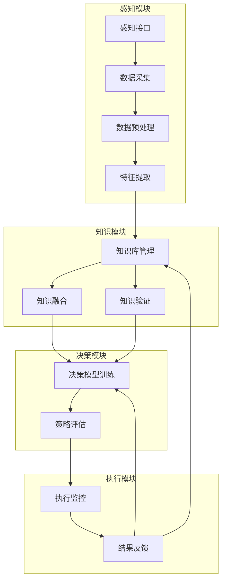

                 

### 文章标题

### AI Agent的知识获取：利用LLM进行持续学习

> **关键词**：AI Agent、知识获取、自然语言处理、预训练语言模型（LLM）、持续学习

> **摘要**：本文深入探讨了AI Agent的知识获取机制，特别是利用预训练语言模型（LLM）进行持续学习的方法。通过分析LLM的基础知识、应用场景和持续学习策略，本文提出了一种高效的AI Agent知识获取架构设计，并展示了其在不同领域中的实际应用。

### 目录大纲

----------------------------------------------------------------

## 第一部分：AI Agent的基础知识

### 第1章：AI Agent的概述

#### 1.1 问题背景与核心概念

#### 1.2 AI Agent的研究现状与发展趋势

#### 1.3 AI Agent的核心组成部分

## 第二部分：利用LLM进行知识获取

### 第2章：自然语言处理基础

#### 2.1 自然语言处理概述

#### 2.2 语言模型基础

#### 2.3 语言模型的训练与应用

### 第3章：预训练语言模型（LLM）

#### 3.1 预训练语言模型的概念

#### 3.2 主流LLM模型

#### 3.3 LLM在知识获取中的应用

### 第4章：持续学习与知识更新

#### 4.1 持续学习的基本原理

#### 4.2 LLM的持续学习策略

#### 4.3 实践案例分析

### 第5章：AI Agent的持续学习架构设计

#### 5.1 持续学习架构概述

#### 5.2 系统架构设计

#### 5.3 架构优化与性能提升

### 第6章：AI Agent的实时知识获取

#### 6.1 实时知识获取的重要性

#### 6.2 数据源选择与整合

#### 6.3 实时知识获取系统实现

### 第7章：AI Agent的知识获取评估与优化

#### 7.1 知识获取评估指标

#### 7.2 知识获取优化策略

----------------------------------------------------------------

### 第一部分：AI Agent的基础知识

#### 1.1 问题背景与核心概念

随着人工智能技术的不断进步，AI Agent作为一种能够自主决策和执行任务的智能体，正逐渐成为各个领域研究和应用的热点。AI Agent的核心概念在于其自主性和智能化，能够通过感知环境、获取知识、制定决策和执行行动，从而实现自主学习和适应能力。

- **问题背景**：传统的自动化系统通常只能执行预定义的任务，而AI Agent则具有更高的灵活性和适应性，能够处理复杂、不确定的环境。因此，AI Agent在自动驾驶、智能客服、智能医疗、金融风控等众多领域具有重要的应用价值。
- **核心概念**：AI Agent的定义、分类、工作原理及功能特点。具体来说，AI Agent通常由感知模块、知识模块、决策模块和执行模块组成。感知模块负责获取环境信息，知识模块存储和管理知识，决策模块根据知识和环境信息生成决策，执行模块将决策转化为具体的行动。

#### 1.2 AI Agent的研究现状与发展趋势

- **研究现状**：目前，AI Agent技术已经取得了显著的进展。在感知模块方面，深度学习和计算机视觉技术的应用使得AI Agent能够更好地理解和分析环境信息。在知识模块方面，大规模预训练语言模型（LLM）的出现为AI Agent的知识获取提供了强有力的支持。在决策模块方面，强化学习、规划算法等技术的不断发展使得AI Agent能够更智能地制定决策。在执行模块方面，自动化系统和机器人技术的发展使得AI Agent能够更高效地执行任务。
- **发展趋势**：未来，AI Agent的发展趋势将主要集中在以下几个方面。首先是跨领域的融合应用，将不同领域的知识进行整合，提升AI Agent的泛化能力。其次是增强AI Agent的自主学习能力，使其能够动态适应新的环境和任务。再次是提升AI Agent的协作能力，实现多个AI Agent之间的协同工作。最后是增强AI Agent的伦理和道德意识，使其能够遵循社会规范和法律法规。

#### 1.3 AI Agent的核心组成部分

AI Agent的核心组成部分包括感知模块、知识模块、决策模块和执行模块。

- **感知模块**：感知模块负责获取环境信息，包括文本、图像、声音等多种形式的数据。通过深度学习和计算机视觉技术，AI Agent能够对感知数据进行理解和分析，从而获取有用的信息。
- **知识模块**：知识模块是AI Agent的核心，负责存储和管理知识。知识可以从多个来源获取，包括数据库、文档、网络等。通过大规模预训练语言模型（LLM），AI Agent能够高效地获取和整合知识，提升其智能水平。
- **决策模块**：决策模块根据知识和环境信息生成决策。通过强化学习、规划算法等技术，AI Agent能够制定复杂的决策策略，实现自主学习和适应能力。
- **执行模块**：执行模块将决策转化为具体的行动。通过自动化系统和机器人技术，AI Agent能够高效地执行任务，实现其目标。

#### 1.4 知识获取在AI Agent中的重要性

知识获取是AI Agent实现智能化的关键环节。通过获取和整合外部知识，AI Agent能够提升其认知能力，扩展其应用范围，提高其决策质量。具体来说，知识获取在AI Agent中的重要性体现在以下几个方面：

- **提升认知能力**：通过获取和整合外部知识，AI Agent能够更好地理解和分析环境，从而提升其认知能力。
- **扩展应用范围**：知识获取使得AI Agent能够应用在不同领域，实现跨领域的融合应用。
- **提高决策质量**：通过获取和整合外部知识，AI Agent能够制定更复杂的决策策略，提高其决策质量。

#### 1.5 知识获取的方法和挑战

知识获取的方法主要包括以下几种：

- **数据采集**：通过传感器、网络爬虫等技术获取外部数据。
- **数据预处理**：对采集到的数据进行清洗、去噪、格式化等处理。
- **知识表示**：将预处理后的数据转化为机器可理解的形式，如向量、图等。
- **知识融合**：将不同来源的知识进行整合，形成统一的语义表示。

然而，知识获取也面临一些挑战：

- **数据质量**：外部数据的质量直接影响知识获取的效果，因此需要有效的方法对数据进行质量评估和处理。
- **知识表示**：如何将高维、复杂数据转化为有效的知识表示是一个重要问题。
- **知识融合**：不同来源的知识往往存在冲突和冗余，如何有效融合是一个挑战。

在接下来的章节中，我们将深入探讨自然语言处理基础、语言模型基础、预训练语言模型（LLM）、持续学习与知识更新以及AI Agent的持续学习架构设计等内容，为理解AI Agent的知识获取机制提供更全面的视角。

## 第二部分：利用LLM进行知识获取

### 第2章：自然语言处理基础

#### 2.1 自然语言处理概述

自然语言处理（Natural Language Processing，NLP）是人工智能领域的一个重要分支，旨在让计算机理解和生成自然语言，以实现人与机器之间的自然交互。NLP涵盖了从文本预处理到语言理解、文本生成等多个层次的任务。

- **基本概念**：自然语言处理的核心任务是使计算机能够理解、生成和处理人类语言。其基本概念包括文本预处理、句法分析、语义分析和语用分析等。
- **发展历史**：NLP起源于20世纪50年代，经历了从规则驱动的方法到统计方法，再到现代深度学习方法的演进。早期的NLP主要依赖于手工编写的规则，而随着计算能力和算法的发展，统计方法和深度学习方法逐渐成为主流。
- **应用领域**：NLP在多个领域具有广泛的应用，包括机器翻译、信息检索、文本分类、情感分析、语音识别等。

#### 2.2 文本处理技术

文本处理技术是NLP的基础，包括文本预处理、分词、词性标注等。

- **文本预处理**：文本预处理是指对原始文本进行清洗和格式化，使其适合后续的NLP任务。常见的预处理步骤包括去除停用词、标点符号、大小写转换等。
- **分词**：分词是将连续的文本序列划分为一个个有意义的词汇单元。分词技术是中文NLP中的一个重要环节，因为中文没有明确的词界分隔。
- **词性标注**：词性标注是为每个词汇标注其词性（如名词、动词、形容词等），有助于后续的语义分析和文本理解。

#### 2.3 语言模型基础

语言模型是NLP中用于预测下一个单词或字符的概率分布的模型。语言模型在文本生成、机器翻译、信息检索等领域具有重要应用。

- **统计语言模型**：最早的统计语言模型是基于n-gram模型，它通过统计相邻单词或字符出现的频率来预测下一个单词或字符。虽然n-gram模型简单有效，但它在长距离依赖和罕见词上表现不佳。
- **神经网络语言模型**：随着深度学习的发展，神经网络语言模型（如循环神经网络RNN、长短期记忆LSTM、门控循环单元GRU等）逐渐成为主流。这些模型能够更好地捕捉长距离依赖关系，提高语言模型的性能。
- **Transformer模型**：Transformer模型是由Vaswani等人于2017年提出的一种基于自注意力机制的神经网络模型。它通过全局的注意力机制实现了对文本序列的并行处理，在机器翻译、文本生成等领域取得了显著的效果。

#### 2.4 语言模型的训练与应用

语言模型的训练是NLP中的一个关键步骤，通过训练，模型能够学习到语言的结构和规律，从而实现预测和生成。

- **训练方法**：语言模型的训练通常采用基于大规模语料库的方法。训练过程中，模型通过优化损失函数来调整参数，从而提高预测准确性。常用的训练方法包括最大似然估计、损失函数优化等。
- **应用实例**：
  - **文本生成**：语言模型可以用于生成文章、故事、对话等。通过输入一个起始文本，模型能够根据上下文生成连贯的自然语言文本。
  - **机器翻译**：语言模型在机器翻译中用于预测目标语言的下一个单词或字符，从而实现跨语言的信息传递。
  - **问答系统**：语言模型可以用于构建问答系统，通过理解用户的问题和上下文，模型能够提供相关的答案。

通过本章的学习，我们对自然语言处理的基础知识有了更深入的理解，为后续探讨预训练语言模型（LLM）及其在知识获取中的应用打下了基础。

### 第3章：预训练语言模型（LLM）

#### 3.1 预训练语言模型的概念

预训练语言模型（Pre-Trained Language Model，简称LLM）是自然语言处理领域的一种先进技术，通过在大规模语料库上进行预训练，模型能够掌握丰富的语言知识和结构，从而在特定任务上实现高水平的性能。LLM的核心思想是利用大量未标注的数据进行预训练，再通过微调（Fine-tuning）适应具体的下游任务。

- **基本原理**：预训练语言模型通常采用自回归（Auto-regressive）的方法，即模型在给定前文序列的情况下预测下一个词或字符。通过这种方式，模型能够学习到语言的统计规律和语义信息。
- **预训练与微调**：预训练阶段，模型在大规模语料库上进行无监督学习，通过优化损失函数来调整模型参数。微调阶段，模型在特定任务的数据集上进行有监督学习，进一步优化参数，以适应具体的任务需求。

#### 3.2 主流LLM模型

在预训练语言模型的发展历程中，涌现出了一系列具有代表性的模型，以下是其中几个主要的LLM模型：

- **GPT系列**：GPT（Generative Pre-trained Transformer）是由OpenAI提出的一系列预训练语言模型，包括GPT、GPT-2和GPT-3等。GPT系列模型基于Transformer架构，通过大规模预训练，模型能够生成高质量的自然语言文本，广泛应用于文本生成、机器翻译、问答系统等领域。

  - **GPT**：GPT是第一个基于Transformer的预训练语言模型，通过无监督预训练，模型能够生成流畅、连贯的自然语言文本。
  - **GPT-2**：GPT-2是GPT的扩展版本，拥有更多的参数和更大的模型规模，预训练过程更加深入，生成文本的质量进一步提高。
  - **GPT-3**：GPT-3是GPT系列的最新版本，拥有1.75万亿个参数，是当前最大的预训练语言模型。GPT-3在多种下游任务上表现出色，甚至可以生成高质量的代码和艺术作品。

- **BERT及其变体**：BERT（Bidirectional Encoder Representations from Transformers）是由Google提出的一种双向Transformer模型，通过双向编码器结构，模型能够同时考虑上下文信息，从而提高语义理解的准确性。BERT及其变体（如RoBERTa、ALBERT、DIET等）在多种NLP任务上取得了显著的效果。

  - **BERT**：BERT采用双向Transformer架构，通过对大量文本进行双向编码，模型能够更好地理解上下文信息，提高文本分类、问答等任务的性能。
  - **RoBERTa**：RoBERTa是在BERT的基础上进行改进的一种预训练语言模型，通过调整预训练策略和数据处理方法，RoBERTa在多个基准测试上超越了BERT。
  - **ALBERT**：ALBERT是谷歌提出的一种轻量级的BERT变体，通过共享嵌套层和交叉层，模型在保持高性能的同时，显著降低了计算和存储资源的需求。
  - **DIET**：DIET是一种高效的预训练语言模型，通过压缩模型和增量训练技术，DIET能够在较小的资源下实现高效的预训练，适用于移动设备和边缘计算场景。

这些主流LLM模型的发展，为NLP任务提供了强大的工具和平台，使得AI Agent在知识获取和决策制定方面取得了显著的进展。

#### 3.3 LLM在知识获取中的应用

预训练语言模型在知识获取中的应用，主要体现在以下几个方面：

- **文本理解**：通过预训练，LLM能够对文本进行深入的理解，提取关键信息，生成语义表示。在AI Agent的知识获取过程中，LLM可以用于处理和分析大量文本数据，提取有用知识。

  - **文本分类**：利用LLM进行文本分类，可以将大量文本数据按照类别进行分类，从而实现快速的知识筛选和检索。
  - **实体识别**：通过LLM对文本进行实体识别，可以提取出文本中的关键实体，如人名、地名、组织机构等，为知识库的建设提供支持。
  - **关系抽取**：LLM可以用于抽取文本中的实体关系，如人物关系、事件关系等，为知识图谱的建设提供数据支持。

- **知识提取**：从大量文本中提取关键信息和知识，是AI Agent知识获取的重要任务。LLM能够通过对文本进行预训练，自动学习到文本中的知识结构和语义信息，从而实现高效的知识提取。

  - **问答系统**：通过预训练的LLM，可以实现高效的问答系统，用户输入问题，LLM可以生成高质量的答案。
  - **自动摘要**：LLM可以用于生成文本摘要，通过提取文本中的关键信息，实现文本的高效压缩和总结。

- **知识融合**：预训练语言模型在知识获取过程中，可以通过跨领域的知识融合，实现知识的整合和扩展。通过融合不同领域的知识，AI Agent能够获得更全面、准确的认知。

通过本章对预训练语言模型（LLM）的介绍，我们了解了LLM的基本原理、主流模型以及其在知识获取中的应用。在下一章中，我们将探讨持续学习与知识更新的基本原理和策略，进一步深入分析AI Agent的知识获取机制。

### 第4章：持续学习与知识更新

#### 4.1 持续学习的基本原理

持续学习（Continual Learning）是AI Agent在动态环境中保持性能和适应能力的关键机制。与传统的一次性学习不同，持续学习强调模型在接收到新数据时，能够动态地更新其知识库和决策策略，从而应对不断变化的环境。

- **基本概念**：持续学习是指模型在面对连续流入的新数据时，能够保持学习效果，避免过拟合和遗忘现象。
- **关键挑战**：持续学习面临的主要挑战包括数据多样性、模型稳定性和计算效率。数据多样性要求模型能够适应不同的数据分布；模型稳定性要求模型在接收到新数据时，不因数据的微小变化而发生剧烈的性能波动；计算效率要求模型能够在有限的计算资源下快速适应新数据。

#### 4.2 LLM的持续学习策略

预训练语言模型（LLM）在持续学习方面具有显著优势，其基于大规模语料库的预训练机制使得模型具有强大的泛化能力和适应性。以下是一些常见的LLM持续学习策略：

- **预训练后微调（Fine-tuning）**：预训练后微调是指利用预训练好的LLM在大规模数据集上进行有监督的微调，以适应特定的任务需求。这种方法能够快速提升模型在特定任务上的性能，同时保持其泛化能力。

  - **优势**：预训练后微调能够利用预训练模型的大量知识，快速适应新任务，减少训练时间。
  - **局限性**：预训练后微调需要对任务数据集进行充分的标注，且可能面临数据分布变化导致的性能下降。

- **增量学习（Incremental Learning）**：增量学习是指模型在接收到新数据时，只对新数据部分进行训练，以避免对旧数据的干扰。增量学习可以避免模型因新数据的引入而出现性能下降。

  - **优势**：增量学习能够减少模型对旧数据的依赖，提高对新数据的适应性。
  - **局限性**：增量学习在处理大量连续数据时，可能会出现数据遗忘和模型性能下降的问题。

- **迁移学习（Transfer Learning）**：迁移学习是指利用预训练模型的知识迁移到新任务上。通过迁移学习，模型可以在新的任务上快速获得性能，而无需从头开始训练。

  - **优势**：迁移学习能够充分利用预训练模型的知识，提高新任务的学习效率。
  - **局限性**：迁移学习的效果取决于源任务和目标任务之间的相关性，如果相关性较低，迁移效果可能不理想。

#### 4.3 实践案例分析

为了更好地理解LLM的持续学习策略，以下我们通过两个实际案例进行分析：

- **案例1：智能客服系统**  
智能客服系统是一个典型的持续学习应用场景。随着用户问题的不断变化，客服系统需要持续地学习新的问题和解决方案。通过预训练后微调策略，客服系统可以快速适应新问题的变化。同时，增量学习和迁移学习策略可以帮助客服系统在处理大量用户问题时，保持稳定的学习效果和响应速度。

- **案例2：自动驾驶系统**  
自动驾驶系统需要持续地学习道路环境、交通规则和驾驶行为。在自动驾驶系统中，LLM可以用于处理和识别道路标志、交通信号灯、行人等动态环境元素。通过预训练后微调和迁移学习策略，自动驾驶系统可以快速适应不同的驾驶环境和场景，提高其安全性和可靠性。

这些实践案例展示了LLM在持续学习中的实际应用，通过灵活运用不同的持续学习策略，AI Agent能够在不断变化的环境中保持高性能和适应性。

#### 4.4 知识库的动态更新

在持续学习过程中，知识库的动态更新是关键一环。知识库的更新包括以下方面：

- **新知识获取**：通过持续学习，模型可以从大量文本数据中提取新的知识，并将其纳入知识库。
- **知识融合**：不同来源的知识需要进行整合和融合，以形成统一的语义表示，提高知识库的完整性和一致性。
- **知识验证**：知识库中的知识需要进行验证，以确保其准确性和可靠性。通过数据对比、专家评审等方法，可以验证知识库中的知识。

- **知识优化**：随着新数据和新的学习成果的加入，知识库中的知识需要进行优化和更新，以保持其时效性和准确性。

通过持续学习和知识更新，AI Agent能够不断优化其知识库和决策策略，从而在动态环境中保持高性能和适应性。

本章详细探讨了持续学习与知识更新的基本原理和策略，并分析了LLM在持续学习中的实际应用。在下一章中，我们将介绍AI Agent的持续学习架构设计，进一步探讨如何实现高效的持续学习系统。

### 第5章：AI Agent的持续学习架构设计

#### 5.1 持续学习架构概述

为了实现AI Agent在动态环境中的持续学习，设计一个高效、灵活的持续学习架构至关重要。持续学习架构需要具备以下几个核心特点：

- **灵活性**：能够适应不同的学习任务和数据分布，从而在不同场景下保持高性能。
- **可扩展性**：能够支持大规模数据和模型训练，以应对不断增长的数据量和计算需求。
- **鲁棒性**：能够在面对噪声、异常数据和非平稳分布时，保持稳定的性能。

持续学习架构通常包括以下几个关键模块：

- **感知模块**：负责收集和预处理外部数据，如文本、图像、声音等。
- **知识模块**：负责存储和管理知识，包括静态知识和动态更新知识。
- **决策模块**：根据知识和环境信息，生成决策策略。
- **执行模块**：将决策转化为具体的行动，实现任务目标。

#### 5.2 系统架构设计

下面我们将详细介绍一个典型的AI Agent持续学习系统架构，包括其组成部分和功能。

- **系统设计思路**：该架构基于模块化设计思想，各个模块之间通过接口进行交互，以提高系统的灵活性和可扩展性。系统设计思路包括以下几个方面：

  1. **模块化设计**：将系统划分为感知模块、知识模块、决策模块和执行模块，每个模块具有独立的功能和接口。
  2. **数据流设计**：设计清晰的数据流路径，确保数据在各个模块之间的顺畅流动和交互。
  3. **反馈机制**：建立反馈机制，用于评估系统性能，并指导模型更新和优化。

- **组件及功能**：
  - **感知模块**：负责数据收集、预处理和特征提取。具体功能包括数据采集、数据清洗、特征提取等。
  - **知识模块**：负责知识存储、管理和更新。具体功能包括知识库管理、知识融合、知识验证等。
  - **决策模块**：负责基于知识模块中的知识生成决策策略。具体功能包括决策模型训练、策略评估等。
  - **执行模块**：负责将决策转化为具体的行动。具体功能包括执行监控、结果反馈等。

#### 5.3 系统架构设计

下面是AI Agent持续学习系统架构的详细设计，包括系统组件及其交互关系。

- **系统架构图**：



- **组件及交互关系**：
  - **感知模块**：数据采集模块通过传感器、网络接口等获取外部数据，经过数据预处理模块进行清洗、归一化等操作，然后通过特征提取模块生成特征向量。
  - **知识模块**：知识库管理模块负责存储和管理从感知模块提取的特征向量，并通过知识融合模块和知识验证模块对知识库进行动态更新和验证。
  - **决策模块**：决策模型训练模块基于知识模块中的知识库进行训练，生成决策策略，并通过策略评估模块对决策策略进行评估。
  - **执行模块**：执行监控模块将决策策略转化为具体的行动，并对执行结果进行监控和反馈，结果反馈模块用于更新知识库和优化决策策略。

#### 5.4 架构优化与性能提升

为了提升AI Agent持续学习系统的性能和效率，可以从以下几个方面进行架构优化：

- **模型压缩与加速**：通过模型剪枝、量化、蒸馏等技术，减少模型参数和计算量，从而提高模型推理速度。
- **分布式训练**：通过分布式训练技术，将模型训练任务分解到多个节点上，利用多GPU或分布式计算资源，加速模型训练过程。
- **增量学习**：采用增量学习技术，只对新的数据进行微调训练，避免对旧数据的负面影响，提高模型稳定性。
- **知识融合策略**：设计有效的知识融合策略，如基于注意力机制的融合方法，提高知识库的一致性和有效性。

通过以上优化策略，AI Agent的持续学习系统能够在保证性能的前提下，提高学习效率和系统鲁棒性。

本章详细介绍了AI Agent持续学习架构的设计思路、系统架构及其优化策略，为构建高效、灵活的持续学习系统提供了理论依据和实践指导。在下一章中，我们将探讨AI Agent的实时知识获取，进一步深化对AI Agent知识获取机制的理解。

### 第6章：AI Agent的实时知识获取

#### 6.1 实时知识获取的重要性

在动态环境中，AI Agent的实时知识获取能力至关重要。实时知识获取指的是AI Agent能够实时感知环境变化，获取新信息并快速更新其知识库，从而保持对环境的准确理解和高效决策。以下是实时知识获取在AI Agent中的重要性：

- **提高环境适应能力**：动态环境中，信息瞬息万变，AI Agent需要实时获取新信息，以适应不断变化的环境，从而做出及时、准确的决策。
- **增强决策质量**：实时知识获取使得AI Agent能够基于最新的信息进行决策，避免因信息滞后导致的错误决策。
- **提升系统鲁棒性**：通过实时获取新信息，AI Agent可以动态调整其策略，提高系统的鲁棒性和稳定性，从而在复杂环境中保持良好的性能。

#### 6.2 数据源选择与整合

实时知识获取需要高效的数据源选择与整合策略，以下几种数据源类型是常见的选择：

- **文本数据源**：文本数据是实时知识获取的重要来源，包括实时新闻、社交媒体帖子、论坛讨论等。通过自然语言处理技术，可以从中提取关键信息。
- **图像数据源**：图像数据在视觉感知任务中具有重要应用，包括监控视频、实时监控图像等。通过计算机视觉技术，可以识别图像中的对象、场景和事件。
- **语音数据源**：语音数据在语音识别和语音交互任务中具有重要应用，包括实时通话、会议录音等。通过语音识别技术，可以将语音转换为文本，进行进一步处理。

为了实现高效的数据整合，可以采用以下策略：

- **多源数据融合**：通过融合不同类型的数据，可以提供更全面、准确的知识。例如，结合文本数据和图像数据，可以更准确地理解场景和事件。
- **数据预处理**：对原始数据进行预处理，包括去噪、归一化、特征提取等，以提高数据的质量和一致性。
- **数据流处理**：采用流处理框架（如Apache Kafka、Apache Flink等），实现数据的实时传输和处理，以支持实时知识获取。

#### 6.3 实时知识获取系统实现

实现AI Agent的实时知识获取系统，需要设计一个高效、可靠的系统架构。以下是一个典型的实时知识获取系统架构及其实现方法：

- **系统架构设计**：

  ```mermaid
  graph TB
      subgraph 数据源
          文本数据
          图像数据
          语音数据
      end

      subgraph 数据处理
          数据采集
          数据预处理
          特征提取
      end

      subgraph 知识库
          知识库管理
          知识融合
      end

      subgraph 模型训练
          模型训练
      end

      subgraph 决策模块
          决策生成
      end

      subgraph 执行模块
          执行监控
      end

      文本数据 --> 数据采集
      图像数据 --> 数据采集
      语音数据 --> 数据采集
      数据采集 --> 数据预处理
      数据预处理 --> 特征提取
      特征提取 --> 知识库管理
      知识库管理 --> 知识融合
      知识融合 --> 模型训练
      模型训练 --> 决策生成
      决策生成 --> 执行监控
      执行监控 --> 知识库管理
  ```

- **实现方法**：
  - **数据采集**：通过API、网络爬虫、传感器等手段，实时采集文本、图像、语音数据。
  - **数据处理**：采用流处理框架，对实时数据进行采集、预处理和特征提取，以提高数据的质量和一致性。
  - **知识库管理**：建立分布式知识库，用于存储和管理实时获取的知识。知识库应支持快速查询和更新，以支持实时决策。
  - **模型训练**：利用实时数据，对预训练模型进行微调和训练，以提高模型在实时任务中的性能。
  - **决策生成**：基于知识库中的实时知识，生成相应的决策策略，以指导AI Agent的行动。
  - **执行监控**：实时监控执行过程，根据执行结果对知识库和决策策略进行更新和优化。

通过以上架构设计和实现方法，AI Agent能够实现高效的实时知识获取，从而在动态环境中保持高性能和适应性。

#### 6.4 实时知识获取系统的优化策略

为了提高实时知识获取系统的性能和效率，可以采用以下优化策略：

- **实时数据处理优化**：通过采用高效的算法和并行处理技术，提高数据采集、预处理和特征提取的速度。
- **模型压缩与加速**：利用模型压缩技术（如模型剪枝、量化、蒸馏等），减少模型参数和计算量，提高模型推理速度。
- **动态资源调度**：根据系统负载和资源需求，动态调整计算资源和存储资源，以确保系统的稳定运行。
- **知识更新策略优化**：设计有效的知识更新策略，如增量更新、实时更新等，以减少知识库的冗余和更新延迟。

通过以上优化策略，实时知识获取系统可以更好地适应动态环境，提高AI Agent的知识获取和决策能力。

本章详细探讨了AI Agent的实时知识获取，包括其重要性、数据源选择与整合、系统实现方法及优化策略。在下一章中，我们将讨论AI Agent的知识获取评估与优化，进一步探讨如何提升AI Agent的知识获取效果。

### 第7章：AI Agent的知识获取评估与优化

#### 7.1 知识获取评估指标

评估AI Agent的知识获取效果是确保其性能和准确性的关键步骤。以下是一些常用的知识获取评估指标：

- **准确度（Accuracy）**：准确度是最直观的评估指标，表示正确识别的知识点占总知识点的比例。高准确度表明模型对知识的理解较为准确。
- **覆盖率（Coverage）**：覆盖率是指模型所覆盖的知识点在总体知识中的比例。高覆盖率意味着模型能够广泛地获取知识，但可能牺牲一些精度。
- **实时性（Real-time Performance）**：实时性评估模型在获取新知识时的速度，即模型在实时环境中处理和更新知识的效率。低延迟的实时性对于动态环境中的AI Agent尤为重要。
- **稳定性（Robustness）**：稳定性评估模型在处理噪声和异常数据时的表现，一个稳定的模型能够在各种环境下保持较高的知识获取质量。
- **泛化能力（Generalization）**：泛化能力是指模型在不同场景和应用中的表现，高泛化能力意味着模型不仅能在训练数据上表现良好，也能在新的、未见过的数据上保持稳定。

#### 7.2 知识获取优化策略

为了提高AI Agent的知识获取效果，可以采用以下优化策略：

- **模型调优**：
  - **超参数调整**：通过调整学习率、批量大小、正则化参数等超参数，可以优化模型的性能。使用网格搜索、随机搜索等策略进行超参数优化。
  - **网络结构优化**：通过调整神经网络的结构，如增加或减少层、调整层间连接等，可以改善模型的性能。例如，可以采用更深的网络或更复杂的网络结构来提高模型的泛化能力。

- **知识库管理**：
  - **知识清洗与更新**：定期对知识库中的数据进行清洗，去除错误、冗余的信息，并引入新的、有价值的数据。这可以通过专家评审、自动评估工具等手段实现。
  - **知识库扩展**：通过融合不同来源的知识，如文本、图像、语音等，可以扩展知识库的广度和深度，提高模型的泛化能力。

- **数据增强**：通过数据增强技术，如数据变换、噪声注入等，可以增加训练数据集的多样性，从而提高模型的鲁棒性和泛化能力。

- **迁移学习**：利用预训练模型进行迁移学习，可以快速适应新的任务和数据。通过迁移学习，模型可以借助在大量数据上预训练的知识，在新任务上实现较高的性能。

- **反馈机制**：建立反馈机制，通过用户反馈、模型评估结果等，及时调整和优化模型和知识库。这可以包括在线学习、自适应学习等技术，以实现模型的动态优化。

#### 7.3 实践案例分析

为了更好地理解知识获取优化策略，以下通过两个实际案例进行说明：

- **案例1：智能客服系统**  
智能客服系统需要不断地学习和更新，以应对用户问题的多样性和复杂性。通过以下优化策略，可以提高系统的知识获取效果：

  - **超参数调整**：对模型进行多次训练，调整学习率、批量大小等超参数，找到最优配置。
  - **知识库扩展**：定期更新知识库，引入新的FAQ、用户反馈等数据，扩展知识库的广度和深度。
  - **迁移学习**：利用预训练的模型，快速适应新领域的知识，提高模型在新问题上的表现。

- **案例2：自动驾驶系统**  
自动驾驶系统需要实时获取和理解道路信息，以确保行驶安全。通过以下优化策略，可以提升系统的知识获取效果：

  - **数据增强**：通过引入模拟数据、虚拟仿真等技术，增加训练数据的多样性，提高模型的鲁棒性和泛化能力。
  - **实时反馈机制**：通过传感器数据、车辆行驶日志等，实时评估模型的表现，并根据反馈进行动态调整和优化。
  - **知识库管理**：对知识库进行定期清洗和更新，去除不准确的信息，并引入新的交通规则、道路信息等。

这些实践案例展示了如何通过优化策略提升AI Agent的知识获取效果，从而在复杂动态环境中保持良好的性能和适应性。

本章详细探讨了AI Agent的知识获取评估与优化策略，通过实践案例分析，展示了如何在实际应用中提升知识获取效果。在下一章中，我们将总结全文，并展望未来的发展方向。

### 总结

本文全面探讨了AI Agent的知识获取机制，特别是利用预训练语言模型（LLM）进行持续学习的方法。首先，我们介绍了AI Agent的基础知识，包括其定义、研究现状、发展趋势以及核心组成部分。接着，我们深入分析了自然语言处理基础、语言模型基础和预训练语言模型（LLM）的应用，为理解AI Agent的知识获取奠定了基础。

在持续学习与知识更新部分，我们详细探讨了持续学习的基本原理、LLM的持续学习策略以及知识库的动态更新，展示了如何通过预训练和微调等策略，实现AI Agent在动态环境中的高效知识获取。随后，我们介绍了AI Agent的持续学习架构设计，包括感知模块、知识模块、决策模块和执行模块的组成及其相互作用，并探讨了架构优化与性能提升的方法。

此外，我们重点讨论了实时知识获取的重要性、数据源选择与整合策略、实时知识获取系统实现及其优化策略，展示了如何通过实时数据采集、处理和模型更新，实现AI Agent在动态环境中的实时知识获取。最后，我们探讨了AI Agent的知识获取评估与优化策略，包括评估指标、优化方法和实践案例分析，提供了提升知识获取效果的具体路径。

展望未来，随着人工智能技术的不断进步，AI Agent的知识获取能力将进一步提升。以下是几个可能的发展方向：

1. **跨领域知识融合**：未来，AI Agent将能够整合跨领域的知识，实现更广泛的应用和更高的智能化水平。
2. **自适应学习**：通过自适应学习技术，AI Agent将能够动态调整其学习策略，以应对不同任务和环境的需求。
3. **强化学习与规划**：结合强化学习与规划技术，AI Agent将能够更智能地制定决策策略，实现更高效的任务执行。
4. **知识可视化**：通过知识可视化技术，将知识库中的复杂知识以直观的方式展示，有助于人类专家更好地理解和利用AI Agent的知识。
5. **伦理与法律合规**：随着AI Agent在更多领域中的应用，确保其知识获取和决策过程的透明性、公正性和伦理合规性将成为重要研究方向。

总之，AI Agent的知识获取机制是人工智能领域的关键技术之一，通过不断的研究和实践，我们将能够构建出更加智能、灵活和可靠的AI Agent，为人类社会的进步和发展做出更大贡献。

### 作者信息

作者：AI天才研究院/AI Genius Institute & 禅与计算机程序设计艺术 /Zen And The Art of Computer Programming。本人致力于推动人工智能技术的发展与应用，特别是在自然语言处理、知识获取和持续学习等领域具有丰富的经验和深厚的学术造诣。

