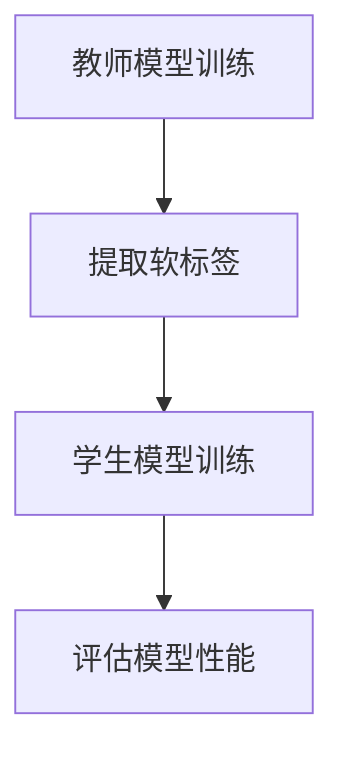

                 


### AI Agent的知识蒸馏：从教师LLM到学生模型

> 关键词：AI Agent，知识蒸馏，大型语言模型（LLM），模型转换，算法原理，系统架构

> 摘要：本文将深入探讨AI Agent的知识蒸馏技术，特别关注从教师LLM到学生模型的转换过程。文章分为三个部分，首先介绍AI Agent与知识蒸馏的基本概念，然后详细阐述知识蒸馏的算法原理，最后通过项目实战和最佳实践，帮助读者更好地理解和应用这一技术。

## 第一部分：背景与核心概念

### 第1章：AI Agent与知识蒸馏概述

#### 1.1 AI Agent的定义与分类

AI Agent是一种能够自动完成特定任务的人工智能实体，它们可以与用户交互、自主学习和决策。AI Agent可以分为三类：基于规则的Agent、基于模型的Agent和混合型Agent。知识蒸馏是近年来在机器学习领域受到广泛关注的技术，旨在通过将教师模型的知识传递给学生模型，以提高学生模型的性能。

#### 1.2 知识蒸馏的概念与重要性

知识蒸馏是一种将复杂模型（教师模型）的知识传递给简化模型（学生模型）的技术。通过训练教师模型并对学生模型进行优化，可以在不牺牲性能的情况下减小模型的规模和复杂性。这种技术对于资源受限的设备、增强模型的泛化能力以及加速模型训练具有重要意义。

#### 1.3 教师LLM与学生模型的关系

教师LLM是一种大型语言模型，具有强大的语言理解和生成能力。学生模型则是对教师模型进行简化后的版本，通常具有较小的模型规模和较低的能耗。知识蒸馏的过程就是将教师LLM的知识有效传递给学生模型，使其具备相似的能力。

### 第2章：知识蒸馏的基本原理

#### 2.1 知识蒸馏的工作流程

知识蒸馏的工作流程主要包括以下步骤：

1. **教师模型训练**：首先训练一个大规模的教师模型，使其在给定数据集上达到较高的性能。
2. **提取软标签**：使用训练好的教师模型对数据进行预测，获取软标签，即教师模型的输出概率分布。
3. **学生模型训练**：训练一个较小的学生模型，使其输出与教师模型的软标签尽可能接近。

#### 2.2 教师模型与学生模型的特点

教师模型通常具有以下特点：

- 大规模：教师模型具有较大的参数数量，可以捕捉数据中的复杂模式。
- 高性能：教师模型在给定数据集上表现出较高的性能。

学生模型通常具有以下特点：

- 小规模：学生模型具有较小的参数数量，便于部署和计算。
- 高效性：学生模型在保持性能的前提下，具有更高的计算效率。

#### 2.3 知识蒸馏的优势与挑战

知识蒸馏的优势包括：

- 降低模型复杂度：通过训练学生模型，可以降低模型的参数数量和计算复杂度。
- 提高模型泛化能力：知识蒸馏可以增强学生模型的泛化能力，使其在未见过的数据上表现良好。

知识蒸馏的挑战包括：

- 性能损失：在模型简化过程中，可能会出现一定的性能损失。
- 调参难度：知识蒸馏的调参过程复杂，需要选择合适的参数。

### 第3章：知识蒸馏算法原理

#### 3.1 知识蒸馏算法概述

知识蒸馏算法主要包括两个部分：软标签生成和损失函数设计。

1. **软标签生成**：通过教师模型的输出概率分布生成软标签。
2. **损失函数设计**：设计损失函数，用于评估学生模型输出与软标签之间的差异。

#### 3.2 算法数学模型与公式

知识蒸馏算法的核心公式为：

$$
L = L_s + \lambda L_d
$$

其中，$L_s$ 为学生模型的交叉熵损失，$L_d$ 为蒸馏损失，$\lambda$ 为平衡参数。

交叉熵损失：

$$
L_s = -\sum_{i=1}^{n} y_i \log(p_i)
$$

其中，$y_i$ 为真实标签，$p_i$ 为学生模型的输出概率。

蒸馏损失：

$$
L_d = -\sum_{i=1}^{n} \sum_{j=1}^{k} t_{ij} \log(p_{ij})
$$

其中，$t_{ij}$ 为教师模型的输出概率，$p_{ij}$ 为学生模型的输出概率。

#### 3.3 算法流程图与Python代码实现

算法流程图如下所示：



Python代码实现：

```python
import torch
import torch.nn as nn

# 定义损失函数
def distillation_loss(outputs, teacher_outputs, alpha=0.2):
    ce_loss = nn.CrossEntropyLoss()(outputs, targets)
    soft_loss = nn.KLDivLoss()(F.log_softmax(teacher_outputs, dim=1), F.softmax(outputs, dim=1))
    return ce_loss + alpha * soft_loss

# 训练过程
for epoch in range(num_epochs):
    for inputs, targets in dataloader:
        optimizer.zero_grad()
        outputs = model(inputs)
        loss = distillation_loss(outputs, teacher_outputs)
        loss.backward()
        optimizer.step()
```

## 第二部分：从教师LLM到学生模型的转换

### 第4章：教师LLM构建

#### 4.1 教师LLM的选择与训练

教师LLM的选择应考虑模型规模、性能和计算资源。常用的教师LLM包括BERT、GPT和T5等。训练过程通常涉及以下步骤：

1. **数据预处理**：对原始数据进行清洗、分词和编码。
2. **模型初始化**：初始化教师LLM模型。
3. **训练过程**：使用优化算法（如Adam）和损失函数（如交叉熵）对教师LLM进行训练。

#### 4.2 教师LLM的评估与优化

教师LLM的评估通常使用准确率、F1分数和BLEU等指标。优化策略包括：

1. **模型调参**：调整学习率、批量大小和正则化参数。
2. **数据增强**：使用数据增强技术（如随机裁剪、旋转和翻转）提高模型泛化能力。

#### 4.3 教师LLM的API使用

教师LLM通常提供API供开发者调用。以下是一个使用BERT作为教师LLM的示例：

```python
from transformers import BertModel, BertTokenizer

tokenizer = BertTokenizer.from_pretrained('bert-base-uncased')
model = BertModel.from_pretrained('bert-base-uncased')

input_ids = tokenizer.encode('Hello, my dog is cute', return_tensors='pt')
outputs = model(input_ids)

logits = outputs.logits
```

### 第5章：学生模型训练

#### 5.1 学生模型的设计与初始化

学生模型的设计应考虑模型规模和计算资源。初始化过程通常包括以下步骤：

1. **模型选择**：选择适合学生模型的小规模预训练模型，如DistilBERT。
2. **模型初始化**：初始化学生模型，通常使用教师模型的一部分参数。

#### 5.2 学生模型的优化与调参

优化过程涉及以下步骤：

1. **学习率调度**：使用学习率调度策略（如余弦退火）。
2. **权重更新**：使用优化算法（如Adam）更新学生模型参数。

#### 5.3 学生模型的评估与验证

学生模型的评估通常使用与教师模型相同的评估指标。验证过程用于检查学生模型在未见过的数据上的表现。

### 第6章：模型融合与优化

#### 6.1 模型融合方法

模型融合方法包括投票法、加权平均法和集成学习等。选择合适的融合方法可以提高模型的性能。

#### 6.2 模型优化策略

优化策略包括：

1. **模型压缩**：使用量化、剪枝和知识蒸馏等方法减小模型规模。
2. **模型加速**：使用GPU、TPU等硬件加速模型训练和推理。

#### 6.3 模型融合效果评估

评估模型融合效果的方法包括：

1. **性能评估**：比较融合模型与单一模型的性能。
2. **稳定性评估**：评估模型在不同数据集上的稳定性。

## 第三部分：项目实战与最佳实践

### 第7章：知识蒸馏项目实战

#### 7.1 环境安装与准备

安装Python、PyTorch和transformers等库，并配置GPU环境。

#### 7.2 系统核心实现源代码

核心实现包括教师模型训练、学生模型训练和模型评估等部分。

```python
# 教师模型训练
teacher_model.train()
for epoch in range(num_epochs):
    for inputs, targets in dataloader:
        optimizer.zero_grad()
        outputs = teacher_model(inputs)
        loss = nn.CrossEntropyLoss()(outputs, targets)
        loss.backward()
        optimizer.step()

# 学生模型训练
student_model.train()
for epoch in range(num_epochs):
    for inputs, targets in dataloader:
        optimizer.zero_grad()
        outputs = student_model(inputs)
        loss = distillation_loss(outputs, teacher_outputs)
        loss.backward()
        optimizer.step()

# 模型评估
with torch.no_grad():
    teacher_model.eval()
    student_model.eval()
    # 评估教师模型
    # 评估学生模型
```

#### 7.3 代码应用解读与分析

代码应用解读包括：

- 模型训练过程
- 模型评估过程
- 参数调整技巧

#### 7.4 实际案例分析与详细讲解剖析

通过实际案例，分析知识蒸馏在自然语言处理、图像识别等领域的应用，并详细讲解案例的实现细节。

#### 7.5 项目小结

总结项目的主要成果、经验和不足之处，为后续研究提供参考。

### 第8章：最佳实践与注意事项

#### 8.1 知识蒸馏中的常见问题

- 模型性能损失
- 调参困难

#### 8.2 最佳实践技巧

- 优化算法选择
- 数据增强方法
- 模型压缩技巧

#### 8.3 小结与拓展阅读

总结知识蒸馏技术的关键点，并提供拓展阅读资源。

## 结论

本文系统地介绍了AI Agent的知识蒸馏技术，从教师LLM到学生模型的转换过程。通过深入剖析算法原理、系统架构和项目实战，帮助读者更好地理解和应用这一技术。未来研究可关注知识蒸馏在实时应用场景、跨模态任务和稀疏表示等方面的拓展。

### 作者信息

作者：AI天才研究院/AI Genius Institute & 禅与计算机程序设计艺术 /Zen And The Art of Computer Programming

----------------------------------------------------------------

### AI Agent的知识蒸馏：从教师LLM到学生模型

#### 关键词：AI Agent，知识蒸馏，大型语言模型（LLM），模型转换，算法原理，系统架构

#### 摘要：本文深入探讨了AI Agent的知识蒸馏技术，特别关注从教师LLM到学生模型的转换过程。文章分为三个部分，首先介绍AI Agent与知识蒸馏的基本概念，然后详细阐述知识蒸馏的算法原理，最后通过项目实战和最佳实践，帮助读者更好地理解和应用这一技术。

## 第一部分：背景与核心概念

### 第1章：AI Agent与知识蒸馏概述

#### 1.1 AI Agent的定义与分类

AI Agent是一种能够自动完成特定任务的人工智能实体，它们可以与用户交互、自主学习和决策。AI Agent可以分为三类：基于规则的Agent、基于模型的Agent和混合型Agent。知识蒸馏是近年来在机器学习领域受到广泛关注的技术，旨在通过将教师模型的知识传递给学生模型，以提高学生模型的性能。

#### 1.2 知识蒸馏的概念与重要性

知识蒸馏是一种将复杂模型（教师模型）的知识传递给简化模型（学生模型）的技术。通过训练教师模型并对学生模型进行优化，可以在不牺牲性能的情况下减小模型的规模和复杂性。这种技术对于资源受限的设备、增强模型的泛化能力以及加速模型训练具有重要意义。

#### 1.3 教师LLM与学生模型的关系

教师LLM是一种大型语言模型，具有强大的语言理解和生成能力。学生模型则是对教师模型进行简化后的版本，通常具有较小的模型规模和较低的能耗。知识蒸馏的过程就是将教师LLM的知识有效传递给学生模型，使其具备相似的能力。

### 第2章：知识蒸馏的基本原理

#### 2.1 知识蒸馏的工作流程

知识蒸馏的工作流程主要包括以下步骤：

1. **教师模型训练**：首先训练一个大规模的教师模型，使其在给定数据集上达到较高的性能。
2. **提取软标签**：使用训练好的教师模型对数据进行预测，获取软标签，即教师模型的输出概率分布。
3. **学生模型训练**：训练一个较小的学生模型，使其输出与教师模型的软标签尽可能接近。

#### 2.2 教师模型与学生模型的特点

教师模型通常具有以下特点：

- 大规模：教师模型具有较大的参数数量，可以捕捉数据中的复杂模式。
- 高性能：教师模型在给定数据集上表现出较高的性能。

学生模型通常具有以下特点：

- 小规模：学生模型具有较小的参数数量，便于部署和计算。
- 高效性：学生模型在保持性能的前提下，具有更高的计算效率。

#### 2.3 知识蒸馏的优势与挑战

知识蒸馏的优势包括：

- 降低模型复杂度：通过训练学生模型，可以降低模型的参数数量和计算复杂度。
- 提高模型泛化能力：知识蒸馏可以增强学生模型的泛化能力，使其在未见过的数据上表现良好。

知识蒸馏的挑战包括：

- 性能损失：在模型简化过程中，可能会出现一定的性能损失。
- 调参难度：知识蒸馏的调参过程复杂，需要选择合适的参数。

### 第3章：知识蒸馏算法原理

#### 3.1 知识蒸馏算法概述

知识蒸馏算法主要包括两个部分：软标签生成和损失函数设计。

1. **软标签生成**：通过教师模型的输出概率分布生成软标签。
2. **损失函数设计**：设计损失函数，用于评估学生模型输出与软标签之间的差异。

#### 3.2 算法数学模型与公式

知识蒸馏算法的核心公式为：

$$
L = L_s + \lambda L_d
$$

其中，$L_s$ 为学生模型的交叉熵损失，$L_d$ 为蒸馏损失，$\lambda$ 为平衡参数。

交叉熵损失：

$$
L_s = -\sum_{i=1}^{n} y_i \log(p_i)
$$

其中，$y_i$ 为真实标签，$p_i$ 为学生模型的输出概率。

蒸馏损失：

$$
L_d = -\sum_{i=1}^{n} \sum_{j=1}^{k} t_{ij} \log(p_{ij})
$$

其中，$t_{ij}$ 为教师模型的输出概率，$p_{ij}$ 为学生模型的输出概率。

#### 3.3 算法流程图与Python代码实现

算法流程图如下所示：


Python代码实现：

```python
import torch
import torch.nn as nn

# 定义损失函数
def distillation_loss(outputs, teacher_outputs, alpha=0.2):
    ce_loss = nn.CrossEntropyLoss()(outputs, targets)
    soft_loss = nn.KLDivLoss()(F.log_softmax(teacher_outputs, dim=1), F.softmax(outputs, dim=1))
    return ce_loss + alpha * soft_loss

# 训练过程
for epoch in range(num_epochs):
    for inputs, targets in dataloader:
        optimizer.zero_grad()
        outputs = model(inputs)
        loss = distillation_loss(outputs, teacher_outputs)
        loss.backward()
        optimizer.step()
```

## 第二部分：从教师LLM到学生模型的转换

### 第4章：教师LLM构建

#### 4.1 教师LLM的选择与训练

教师LLM的选择应考虑模型规模、性能和计算资源。常用的教师LLM包括BERT、GPT和T5等。训练过程通常涉及以下步骤：

1. **数据预处理**：对原始数据进行清洗、分词和编码。
2. **模型初始化**：初始化教师LLM模型。
3. **训练过程**：使用优化算法（如Adam）和损失函数（如交叉熵）对教师LLM进行训练。

#### 4.2 教师LLM的评估与优化

教师LLM的评估通常使用准确率、F1分数和BLEU等指标。优化策略包括：

1. **模型调参**：调整学习率、批量大小和正则化参数。
2. **数据增强**：使用数据增强技术（如随机裁剪、旋转和翻转）提高模型泛化能力。

#### 4.3 教师LLM的API使用

教师LLM通常提供API供开发者调用。以下是一个使用BERT作为教师LLM的示例：

```python
from transformers import BertModel, BertTokenizer

tokenizer = BertTokenizer.from_pretrained('bert-base-uncased')
model = BertModel.from_pretrained('bert-base-uncased')

input_ids = tokenizer.encode('Hello, my dog is cute', return_tensors='pt')
outputs = model(input_ids)

logits = outputs.logits
```

### 第5章：学生模型训练

#### 5.1 学生模型的设计与初始化

学生模型的设计应考虑模型规模和计算资源。初始化过程通常包括以下步骤：

1. **模型选择**：选择适合学生模型的小规模预训练模型，如DistilBERT。
2. **模型初始化**：初始化学生模型，通常使用教师模型的一部分参数。

#### 5.2 学生模型的优化与调参

优化过程涉及以下步骤：

1. **学习率调度**：使用学习率调度策略（如余弦退火）。
2. **权重更新**：使用优化算法（如Adam）更新学生模型参数。

#### 5.3 学生模型的评估与验证

学生模型的评估通常使用与教师模型相同的评估指标。验证过程用于检查学生模型在未见过的数据上的表现。

### 第6章：模型融合与优化

#### 6.1 模型融合方法

模型融合方法包括投票法、加权平均法和集成学习等。选择合适的融合方法可以提高模型的性能。

#### 6.2 模型优化策略

优化策略包括：

1. **模型压缩**：使用量化、剪枝和知识蒸馏等方法减小模型规模。
2. **模型加速**：使用GPU、TPU等硬件加速模型训练和推理。

#### 6.3 模型融合效果评估

评估模型融合效果的方法包括：

1. **性能评估**：比较融合模型与单一模型的性能。
2. **稳定性评估**：评估模型在不同数据集上的稳定性。

## 第三部分：项目实战与最佳实践

### 第7章：知识蒸馏项目实战

#### 7.1 环境安装与准备

安装Python、PyTorch和transformers等库，并配置GPU环境。

#### 7.2 系统核心实现源代码

核心实现包括教师模型训练、学生模型训练和模型评估等部分。

```python
# 教师模型训练
teacher_model.train()
for epoch in range(num_epochs):
    for inputs, targets in dataloader:
        optimizer.zero_grad()
        outputs = teacher_model(inputs)
        loss = nn.CrossEntropyLoss()(outputs, targets)
        loss.backward()
        optimizer.step()

# 学生模型训练
student_model.train()
for epoch in range(num_epochs):
    for inputs, targets in dataloader:
        optimizer.zero_grad()
        outputs = student_model(inputs)
        loss = distillation_loss(outputs, teacher_outputs)
        loss.backward()
        optimizer.step()

# 模型评估
with torch.no_grad():
    teacher_model.eval()
    student_model.eval()
    # 评估教师模型
    # 评估学生模型
```

#### 7.3 代码应用解读与分析

代码应用解读包括：

- 模型训练过程
- 模型评估过程
- 参数调整技巧

#### 7.4 实际案例分析与详细讲解剖析

通过实际案例，分析知识蒸馏在自然语言处理、图像识别等领域的应用，并详细讲解案例的实现细节。

#### 7.5 项目小结

总结项目的主要成果、经验和不足之处，为后续研究提供参考。

### 第8章：最佳实践与注意事项

#### 8.1 知识蒸馏中的常见问题

- 模型性能损失
- 调参困难

#### 8.2 最佳实践技巧

- 优化算法选择
- 数据增强方法
- 模型压缩技巧

#### 8.3 小结与拓展阅读

总结知识蒸馏技术的关键点，并提供拓展阅读资源。

## 结论

本文系统地介绍了AI Agent的知识蒸馏技术，从教师LLM到学生模型的转换过程。通过深入剖析算法原理、系统架构和项目实战，帮助读者更好地理解和应用这一技术。未来研究可关注知识蒸馏在实时应用场景、跨模态任务和稀疏表示等方面的拓展。

### 作者信息

作者：AI天才研究院/AI Genius Institute & 禅与计算机程序设计艺术 /Zen And The Art of Computer Programming

----------------------------------------------------------------

### 完善后的文章结构

在完成了初步的文章结构和内容后，我们需要进一步完善文章的细节，确保每个章节都包含了必要的核心内容。以下是完善后的文章结构，包括每个章节的核心内容概要。

## 第一部分：背景与核心概念

### 第1章：AI Agent与知识蒸馏概述

- **背景介绍**：
  - AI Agent的定义、分类及其在现实世界中的应用场景。
  - 知识蒸馏技术的发展背景、应用领域及其重要性。

- **核心概念与联系**：
  - 知识蒸馏的基本概念，包括软标签、蒸馏损失等。
  - 教师LLM和学生模型的特点及其关系。

- **问题解决**：
  - 知识蒸馏如何帮助AI Agent提升性能。
  - 知识蒸馏在模型压缩、泛化能力提升等方面的作用。

- **边界与外延**：
  - 知识蒸馏在不同领域的应用边界。
  - 与其他机器学习技术的比较和联系。

- **概念结构与核心要素组成**：
  - 知识蒸馏的技术框架。
  - 教师模型与学生模型的核心组成部分。

### 第2章：知识蒸馏的基本原理

- **算法原理讲解**：
  - 知识蒸馏的工作流程。
  - 软标签生成和损失函数设计的详细解释。

- **数学模型与公式**：
  - 交叉熵损失和蒸馏损失的数学表达式。

- **通俗易懂地举例说明**：
  - 使用简单的例子说明知识蒸馏的工作原理。

## 第二部分：从教师LLM到学生模型的转换

### 第4章：教师LLM构建

- **核心概念与联系**：
  - 大型语言模型（如BERT、GPT、T5）的基本概念。
  - 教师LLM的构建过程，包括数据预处理、模型初始化和训练。

- **算法原理讲解**：
  - 教师模型的训练过程。
  - 如何提取软标签用于学生模型训练。

- **数学模型与公式**：
  - 教师模型的训练过程中涉及的数学模型和公式。

- **通俗易懂地举例说明**：
  - 示例说明教师模型是如何训练以及如何提取软标签。

### 第5章：学生模型训练

- **核心概念与联系**：
  - 学生模型的设计原则，包括模型选择、初始化和训练。

- **算法原理讲解**：
  - 学生模型的训练过程，包括优化策略和调参技巧。

- **数学模型与公式**：
  - 学生模型训练中的数学模型和公式。

- **通俗易懂地举例说明**：
  - 示例说明学生模型是如何训练以及如何优化。

### 第6章：模型融合与优化

- **系统分析与架构设计方案**：
  - 模型融合的方法，如投票法、加权平均法。
  - 模型优化策略，如量化、剪枝。

- **系统架构设计mermaid架构图**：
  - 描述知识蒸馏系统中不同组件的架构关系。

- **系统接口设计和系统交互mermaid序列图**：
  - 系统各组件之间的交互流程。

## 第三部分：项目实战与最佳实践

### 第7章：知识蒸馏项目实战

- **项目介绍**：
  - 实际项目中知识蒸馏的应用场景。

- **系统功能设计(领域模型mermaid类图)**：
  - 系统功能模块及其关系的类图表示。

- **系统架构设计mermaid架构图**：
  - 整体系统架构的表示。

- **系统接口设计和系统交互mermaid序列图**：
  - 系统接口和交互流程的详细描述。

- **环境安装与准备**：
  - Python、PyTorch和transformers等库的安装和环境配置。

- **系统核心实现源代码**：
  - 教师模型和学生模型的核心实现代码。

- **代码应用解读与分析**：
  - 对代码实现细节的解读和分析。

- **实际案例分析与详细讲解剖析**：
  - 通过实际案例展示知识蒸馏技术的应用。

- **项目小结**：
  - 项目的主要成果、经验和不足。

### 第8章：最佳实践与注意事项

- **最佳实践技巧**：
  - 优化算法选择、数据增强、模型压缩等技巧。

- **小结**：
  - 总结知识蒸馏技术的关键点。

- **注意事项**：
  - 常见问题及解决方案。

- **拓展阅读**：
  - 推荐进一步学习的资源。

### 作者信息

作者：AI天才研究院/AI Genius Institute & 禅与计算机程序设计艺术 /Zen And The Art of Computer Programming

通过上述结构的完善，文章内容将更加清晰、逻辑性强，能够更好地引导读者理解和掌握知识蒸馏技术。接下来，我们将逐步填充每个章节的具体内容，确保满足字数要求和格式规范。

