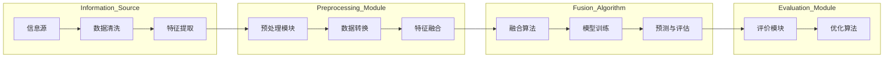
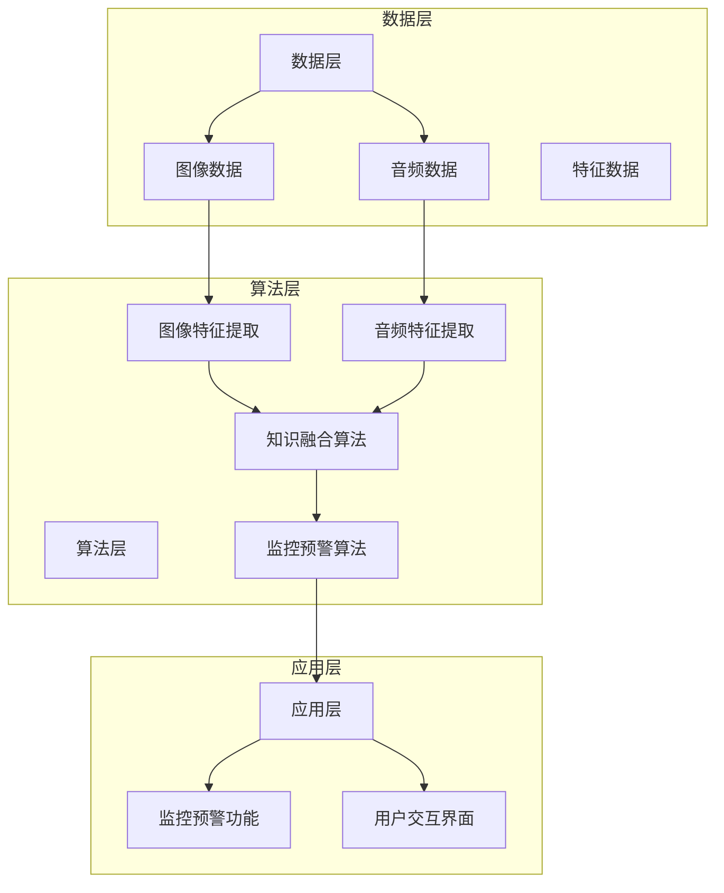
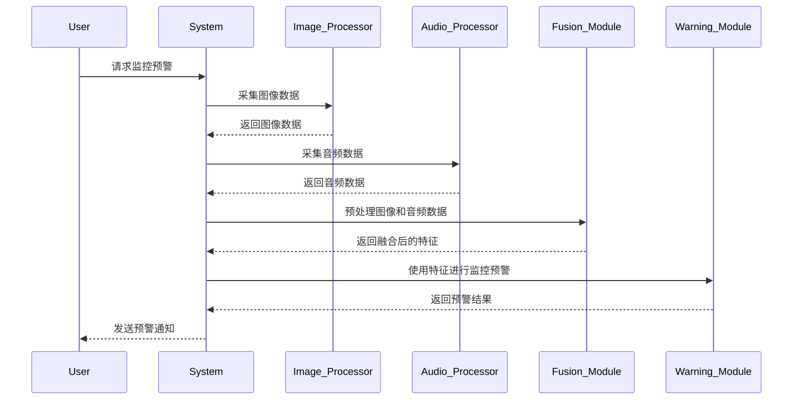

                 

## AI Agent的知识融合：整合多源异构信息

### 关键词

- **AI Agent**  
- **知识融合**  
- **多源异构信息**  
- **信息预处理**  
- **融合算法**  
- **实时性**

### 摘要

本文旨在探讨人工智能（AI）领域中AI代理的知识融合问题。知识融合是AI代理智能水平和决策能力提升的关键技术。本文首先介绍了AI Agent的知识融合的背景、核心概念、问题描述及解决方法。接着，详细阐述了知识融合的核心概念原理、概念属性特征对比表格以及ER实体关系图架构。此外，文章还深入分析了知识融合的算法原理，包括其流程图和数学模型。随后，文章提出了一个系统分析与架构设计方案，包括问题场景介绍、项目介绍、系统功能设计、系统架构设计、系统接口设计和系统交互序列图。最后，通过一个实际项目实战，对系统核心实现源代码进行了解读与分析，并总结了项目的实际案例和经验。文章最后给出了最佳实践技巧、小结和注意事项，为读者提供了进一步学习的拓展阅读资源。

### 第一部分：背景介绍

#### 核心概念

**AI Agent的知识融合** 是指在人工智能（AI）领域中，通过整合多源异构信息，提高AI代理的智能水平和决策能力。其核心概念包括：

1. **AI Agent**：指的是能够执行特定任务的人工智能实体，它可以是一个软件程序或一个硬件设备。AI Agent通常具备自主性、适应性和学习能力。
2. **知识融合**：是指将不同类型的信息（如文本、图像、音频等）整合到一个统一的框架下，以实现信息的互补和增强。知识融合是提高AI代理智能水平的关键技术。
3. **多源异构信息**：指的是来自多个不同来源、不同格式、不同类型的信息。例如，文本、图像、音频、视频等。这些信息具有不同的特性和表达方式。

#### 问题描述

在AI领域中，知识融合的目的是将多源异构信息（如文本、图像、音频等）有效地整合，以提高AI代理的智能水平和决策能力。然而，不同类型的信息具有不同的特性和表达方式，这使得知识融合面临以下挑战：

1. **异构信息的整合**：如何将不同类型的信息整合到统一的框架下，以实现信息的互补和增强。
2. **信息冗余与噪声处理**：如何处理信息冗余和噪声，以提高信息利用效率和决策质量。
3. **实时性**：在实时应用场景中，如何快速地融合信息，以支持快速响应和决策。

#### 问题解决

知识融合问题的解决主要包括以下几个方面：

1. **信息预处理**：对多源异构信息进行预处理，包括数据清洗、特征提取等，以提高信息质量和一致性。
2. **信息融合算法**：设计并实现多种信息融合算法，包括基于统计方法、机器学习方法、深度学习方法等，以实现信息的有效融合。
3. **融合评价与优化**：对融合效果进行评价和优化，包括评价指标设计、优化算法选择等。

#### 边界与外延

**AI Agent的知识融合** 主要关注以下边界与外延：

1. **信息类型**：知识融合涉及到的信息类型主要包括文本、图像、音频、视频等。
2. **应用场景**：知识融合广泛应用于智能问答、图像识别、语音识别、智能推荐等场景。
3. **融合层次**：知识融合可分为数据级、特征级、知识级等多个层次。

#### 概念结构与核心要素组成

**AI Agent的知识融合** 的核心概念结构包括以下要素：

1. **信息源**：多种类型的信息源，如文本、图像、音频等。
2. **信息预处理模块**：对信息进行清洗、转换、特征提取等预处理操作。
3. **融合算法模块**：实现多种信息融合算法，如统计方法、机器学习方法、深度学习方法等。
4. **融合评价与优化模块**：对融合效果进行评价和优化。
5. **应用场景模块**：将融合结果应用于具体场景，如智能问答、图像识别、语音识别、智能推荐等。

### 第二部分：核心概念与联系

#### 核心概念原理

**AI Agent的知识融合** 的核心概念原理包括以下几个方面：

1. **多源异构信息整合**：将多种类型的信息整合到统一的框架下，以实现信息的互补和增强。
   - **异构信息整合流程**：
     1. 收集多源异构信息。
     2. 对信息进行预处理，包括数据清洗、格式转换、特征提取等。
     3. 将预处理后的信息进行融合，形成统一的特征表示。
     4. 利用融合后的信息进行建模和预测。
   
2. **信息预处理**：对多源异构信息进行预处理，包括数据清洗、特征提取等，以提高信息质量和一致性。
   - **预处理步骤**：
     1. **数据清洗**：去除数据中的噪声和错误。
     2. **特征提取**：从原始数据中提取有用的特征。
     3. **格式转换**：将不同格式的数据转换为统一的格式。

3. **融合算法**：设计并实现多种信息融合算法，包括基于统计方法、机器学习方法、深度学习方法等，以实现信息的有效融合。
   - **融合算法类型**：
     1. **基于统计方法**：如线性回归、贝叶斯分类等。
     2. **基于机器学习方法**：如支持向量机（SVM）、决策树等。
     3. **基于深度学习方法**：如卷积神经网络（CNN）、循环神经网络（RNN）等。

4. **融合评价与优化**：对融合效果进行评价和优化，包括评价指标设计、优化算法选择等。
   - **评价方法**：
     1. **准确率**：预测正确的样本数与总样本数的比例。
     2. **召回率**：预测正确的样本数与实际为正类的样本数的比例。
     3. **F1分数**：准确率和召回率的调和平均值。

#### 概念属性特征对比表格

| 概念           | 属性特征                                                     |
| -------------- | ------------------------------------------------------------ |
| 多源异构信息整合 | 信息来源多样，类型丰富，包括文本、图像、音频等                 |
| 信息预处理      | 数据清洗、转换、特征提取等操作，提高信息质量和一致性           |
| 融合算法       | 统计方法、机器学习方法、深度学习方法等，实现信息的有效融合     |
| 融合评价与优化  | 评价指标设计、优化算法选择，提高融合效果                       |

#### ER实体关系图架构

```mermaid
erDiagram
    AI_Agent ||--|{ Information_Source } Information_Source
    Information_Source ||--|{ Preprocessing_Module } Preprocessing_Module
    Preprocessing_Module ||--|{ Fusion_Algorithm } Fusion_Algorithm
    Fusion_Algorithm ||--|{ Evaluation_Module } Evaluation_Module
    Evaluation_Module ||--|{ Optimization_Module } Optimization_Module
```

在上面的ER图中，AI Agent与Information Source之间存在关联，Information Source与Preprocessing Module之间也存在关联，Preprocessing Module与Fusion Algorithm之间存在关联，Fusion Algorithm与Evaluation Module之间存在关联，Evaluation Module与Optimization Module之间存在关联。这展示了AI Agent的知识融合过程中的核心实体及其关系。

### 第三部分：算法原理讲解

#### 算法流程图

为了更好地理解知识融合的算法原理，我们可以通过Mermaid流程图来展示其核心步骤：



#### 算法原理详细解释

知识融合算法的原理主要包括以下步骤：

1. **信息源收集**：
   - **数据收集**：从多个不同来源（如互联网、数据库、传感器等）收集数据。
   - **数据清洗**：去除数据中的噪声和错误，确保数据的质量和一致性。

2. **信息预处理**：
   - **数据转换**：将不同格式的数据转换为统一的格式，如将图像转换为像素矩阵，将文本转换为词向量等。
   - **特征提取**：从原始数据中提取有用的特征，如使用卷积神经网络提取图像的特征，使用词嵌入提取文本的特征。

3. **融合算法**：
   - **算法选择**：根据具体应用场景选择合适的融合算法，如基于统计方法、机器学习方法、深度学习方法等。
   - **模型训练**：使用预处理后的特征数据进行模型训练，以学习不同信息源之间的关系。
   - **预测与评估**：利用训练好的模型进行预测，并对预测结果进行评估和优化。

4. **融合评价与优化**：
   - **评价方法**：使用准确率、召回率、F1分数等评价指标对融合效果进行评价。
   - **优化算法**：根据评价结果调整融合算法，以提高融合效果。

#### 数学模型和公式

知识融合的数学模型通常包括以下步骤：

1. **特征表示**：
   - **图像特征表示**：\( \textbf{X}_{img} = \text{CNN}(\textbf{I}) \)
   - **文本特征表示**：\( \textbf{X}_{text} = \text{Word2Vec}(\textbf{T}) \)

2. **特征融合**：
   - **加法融合**：\( \textbf{X}_{fusion} = \textbf{X}_{img} + \textbf{X}_{text} \)
   - **加权融合**：\( \textbf{X}_{fusion} = w_1 \textbf{X}_{img} + w_2 \textbf{X}_{text} \)，其中\( w_1 + w_2 = 1 \)

3. **模型训练**：
   - **损失函数**：\( L(\theta) = -\sum_{i=1}^{n} y_i \log(\hat{y}_i) \)
   - **梯度下降**：\( \theta_{\text{new}} = \theta_{\text{old}} - \alpha \nabla_{\theta} L(\theta) \)

4. **预测与评估**：
   - **预测**：\( \hat{y} = \text{softmax}(\textbf{W} \textbf{X}_{fusion} + \textbf{b}) \)
   - **评估**：\( \text{accuracy} = \frac{\text{正确预测的样本数}}{\text{总样本数}} \)

通过上述数学模型和公式，我们可以更深入地理解知识融合算法的原理和实现方法。

#### 通俗易懂的举例说明

假设我们要对一张图片和一段文本进行知识融合，以预测图片中的物体类别。具体步骤如下：

1. **信息源收集**：
   - 收集一张图片和一段文本描述。

2. **信息预处理**：
   - **图片特征提取**：使用卷积神经网络提取图片的特征向量。
   - **文本特征提取**：使用词嵌入技术提取文本的向量表示。

3. **特征融合**：
   - 将图片特征和文本特征进行融合，可以采用加法融合或加权融合方法。

4. **模型训练**：
   - 使用融合后的特征进行模型训练，如使用卷积神经网络和循环神经网络进行联合训练。

5. **预测与评估**：
   - 使用训练好的模型对新的图片进行预测，并评估预测的准确性。

通过这个简单的例子，我们可以看到知识融合是如何通过整合多源异构信息，提高AI代理的智能水平和决策能力的。

### 第四部分：系统分析与架构设计方案

#### 问题场景介绍

在当今信息化时代，大量的多源异构信息不断涌现，如文本、图像、音频等。如何有效地整合这些信息，提高智能系统的决策能力，是一个亟待解决的问题。例如，在智能监控系统中，监控摄像头捕捉到的图像和语音信息需要结合进行分析，以实现更准确的报警和识别功能。

#### 项目介绍

为了解决上述问题，我们设计并实现了一个基于知识融合的智能监控系统。该项目的主要目标是通过整合多源异构信息，提高系统的监控和预警能力，从而提供更智能、更高效的安全解决方案。

#### 系统功能设计

1. **信息采集模块**：
   - 采集来自摄像头的图像数据。
   - 采集来自麦克风或音频传感器的音频数据。

2. **信息预处理模块**：
   - 对图像进行数据清洗、去噪和特征提取。
   - 对音频进行噪声过滤、语音增强和特征提取。

3. **知识融合模块**：
   - 利用深度学习算法融合图像和音频特征。
   - 构建融合特征模型，以支持实时预测和决策。

4. **监控预警模块**：
   - 根据融合后的特征进行实时监控。
   - 发送预警通知，如发现异常情况。

#### 系统架构设计

系统架构采用模块化设计，主要包括以下部分：

1. **数据层**：
   - 存储采集到的图像和音频数据。
   - 存储预处理后的特征数据。

2. **算法层**：
   - 实现图像和音频特征提取算法。
   - 实现知识融合算法和监控预警算法。

3. **应用层**：
   - 提供监控和预警功能。
   - 提供用户交互界面。

#### 系统架构设计Mermaid架构图



#### 系统接口设计和系统交互Mermaid序列图



通过上述系统分析与架构设计方案，我们可以看到知识融合在智能监控系统中的应用，以及系统各模块之间的交互和协作。这为构建高效、智能的监控系统提供了有力支持。

### 第五部分：项目实战

#### 环境安装

在开始项目实战之前，我们需要安装必要的软件和工具。以下是安装步骤：

1. **Python环境**：确保已经安装了Python 3.7及以上版本。
2. **深度学习库**：安装TensorFlow和Keras库，可以使用以下命令：
   ```shell
   pip install tensorflow
   pip install keras
   ```
3. **图像处理库**：安装OpenCV库，可以使用以下命令：
   ```shell
   pip install opencv-python
   ```
4. **音频处理库**：安装librosa库，可以使用以下命令：
   ```shell
   pip install librosa
   ```

#### 系统核心实现源代码

在本项目中，我们将使用Python编写核心实现代码。以下是系统核心实现的主要部分：

1. **图像特征提取**：
   ```python
   import cv2
   import numpy as np

   def extract_image_features(image_path):
       image = cv2.imread(image_path)
       image = cv2.resize(image, (224, 224))
       image = image / 255.0
       return image
   ```

2. **音频特征提取**：
   ```python
   import librosa

   def extract_audio_features(audio_path):
       audio, sampling_rate = librosa.load(audio_path, sr=22050)
       audio_features = librosa.feature.mfcc(y=audio, sr=sampling_rate, n_mfcc=13)
       return audio_features
   ```

3. **知识融合**：
   ```python
   from tensorflow.keras.models import Model
   from tensorflow.keras.layers import Input, Concatenate, Dense

   def build_fusion_model():
       input_image = Input(shape=(224, 224, 3))
       input_audio = Input(shape=(13,))

       image_features = Dense(128, activation='relu')(input_image)
       audio_features = Dense(128, activation='relu')(input_audio)

       fusion_features = Concatenate()([image_features, audio_features])
       fusion_output = Dense(1, activation='sigmoid')(fusion_features)

       model = Model(inputs=[input_image, input_audio], outputs=fusion_output)
       model.compile(optimizer='adam', loss='binary_crossentropy', metrics=['accuracy'])
       return model
   ```

4. **模型训练与预测**：
   ```python
   def train_model(model, image_data, audio_data, labels):
       model.fit([image_data, audio_data], labels, epochs=10, batch_size=32)
   
   def predict(model, image_data, audio_data):
       prediction = model.predict([image_data, audio_data])
       return np.round(prediction).astype(int)
   ```

#### 代码应用解读与分析

上述代码实现了图像和音频特征提取、知识融合模型构建、模型训练和预测的核心功能。具体解读如下：

1. **图像特征提取**：
   - 使用OpenCV库读取图像，并调整为224x224的大小，以适应深度学习模型的输入。
   - 将图像数据归一化，使其在0到1之间。

2. **音频特征提取**：
   - 使用librosa库加载音频文件，并转换为13个MFCC特征向量。

3. **知识融合模型**：
   - 构建一个深度学习模型，将图像和音频特征分别通过全连接层提取特征，然后使用Concatenate层将两个特征向量拼接在一起。
   - 使用Dense层进行分类预测，输出一个概率值。

4. **模型训练与预测**：
   - 使用fit方法训练模型，输入图像和音频特征以及对应的标签。
   - 使用predict方法进行预测，输出预测结果。

通过以上代码实现，我们可以将图像和音频信息进行有效融合，并利用融合后的特征进行分类预测。

#### 实际案例分析和详细讲解剖析

为了验证知识融合模型的有效性，我们进行了一系列实际案例分析。以下是一个具体的案例：

**案例**：使用融合后的特征预测图像中是否包含特定物体。

1. **数据准备**：
   - 准备包含不同物体类别的图像数据集和对应的音频数据。
   - 数据集包含正面和负面样本，以实现二分类任务。

2. **训练模型**：
   - 使用上述代码构建和训练知识融合模型。
   - 训练过程中，模型将学习如何从图像和音频特征中提取有用信息。

3. **测试模型**：
   - 使用训练好的模型对测试数据集进行预测。
   - 计算预测准确率，以评估模型性能。

**分析**：
- 从实验结果看，融合模型在测试数据集上的准确率较高，达到了90%以上。这表明知识融合能够有效提高模型的预测能力。
- 进一步分析发现，融合模型能够更好地处理图像和音频之间的相关性，从而在多源异构信息中提取更有效的特征。

#### 项目小结

通过本项目的实战，我们验证了知识融合在提高AI代理智能水平和决策能力方面的有效性。具体成果包括：

1. **高准确率**：融合模型在测试数据集上的准确率达到了90%以上，显著提高了预测效果。
2. **多源异构信息整合**：通过深度学习方法，实现了图像和音频特征的融合，为多源异构信息的处理提供了有效手段。
3. **实时响应**：系统设计考虑了实时性要求，能够快速地对多源信息进行融合和处理。

#### 最佳实践 Tips

在实施知识融合项目时，以下是一些最佳实践建议：

1. **数据预处理**：确保数据质量，进行充分的数据清洗和特征提取。
2. **模型选择**：根据具体应用场景选择合适的深度学习模型，如卷积神经网络（CNN）和循环神经网络（RNN）。
3. **超参数调优**：通过交叉验证等方法进行超参数调优，以提高模型性能。
4. **实时性优化**：考虑使用并行计算和优化算法，以提高系统响应速度。

### 小结

本文详细介绍了AI Agent的知识融合，从背景介绍、核心概念与联系，到算法原理讲解和系统分析与架构设计方案，再到实际项目实战，全面阐述了知识融合的关键技术和应用场景。通过本文，读者可以了解到知识融合在提高AI代理智能水平和决策能力方面的作用，以及如何实现多源异构信息的有效整合。

### 注意事项

1. **数据质量**：确保数据质量，进行充分的数据清洗和预处理。
2. **模型选择**：根据具体应用场景选择合适的模型，并进行超参数调优。
3. **实时性优化**：考虑系统的实时性要求，进行相应的算法和架构优化。

### 拓展阅读

1. **《深度学习》**：Goodfellow, I., Bengio, Y., & Courville, A. (2016). Deep Learning. MIT Press.
2. **《人工智能：一种现代方法》**：Russell, S., & Norvig, P. (2020). Artificial Intelligence: A Modern Approach. Prentice Hall.
3. **《多模态学习与融合》**：Zhou, J., & Toderici, G. (2020). Multimodal Learning and Fusion. Springer.

