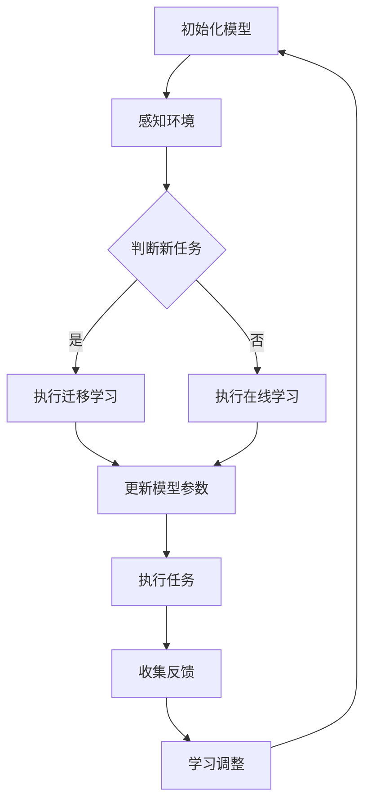
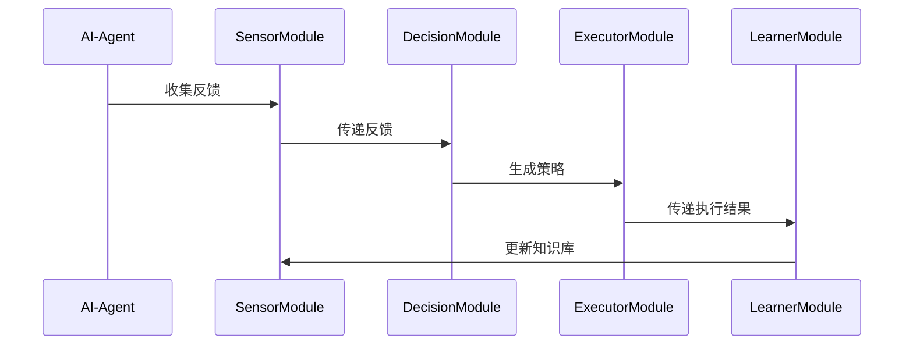
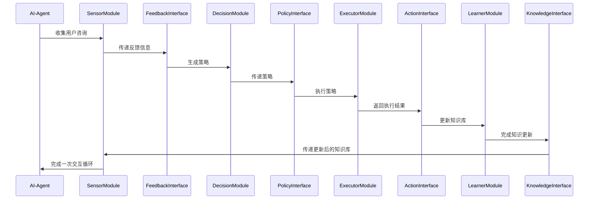

                 

### 第1章: AI Agent的终身学习系统概述

#### 1.1 问题背景与意义

人工智能（AI）技术在近年来取得了飞速的发展，特别是深度学习和自然语言处理等领域，已经实现了许多令人瞩目的突破。AI在图像识别、语音识别、自然语言理解、推荐系统、自动驾驶等领域取得了显著的成果。然而，随着AI应用场景的不断扩大，如何使AI系统能够持续学习、适应和进化成为一个亟待解决的问题。传统机器学习方法通常依赖于固定的数据集和预训练模型，这使得AI系统在面临新任务或数据变化时往往难以适应。因此，开发一种能够实现AI Agent终身学习（Lifelong Learning）的系统显得尤为重要。

AI Agent的终身学习系统的研究意义在于：

- **提高AI系统的适应性**：通过终身学习，AI系统能够在复杂动态的环境中持续适应和进化，提高其在不同任务和场景下的表现。
- **节约训练成本**：终身学习系统能够充分利用已有知识，减少对新数据的依赖，从而降低训练成本和时间。
- **扩展AI应用领域**：终身学习系统能够使AI系统在不同领域和应用场景中快速部署和适应，推动AI技术在更广泛领域的应用。

本章将介绍AI Agent的终身学习系统的背景、研究意义以及在该领域中的重要研究成果。

#### 1.2 问题描述

传统的机器学习方法通常依赖于固定的数据集和预训练模型，这使得AI系统在面临新任务或数据变化时往往难以适应。具体而言，问题描述如下：

- **数据集依赖**：传统的AI系统通常使用预训练模型和数据集进行训练，这些数据集往往具有特定领域或任务的特征，导致AI系统在面对新任务时难以适应。
- **模型固化**：预训练模型在训练完成后通常被视为静态的，无法根据新数据和任务进行动态调整，导致AI系统在面临新任务时表现不佳。
- **环境动态性**：实际应用场景中，环境数据不断变化，新任务和需求层出不穷，传统的AI系统难以适应这种动态变化。

为了解决上述问题，AI Agent的终身学习系统应具备以下能力：

- **持续学习**：AI系统能够在新数据和任务中不断学习和调整，从而提高其适应性和表现。
- **知识更新**：AI系统能够通过持续更新知识库，保持对最新数据的掌握，从而更好地应对新任务。
- **自适应调整**：AI系统能够根据环境变化和任务需求，动态调整模型参数和策略，从而提高其在动态环境中的表现。

#### 1.3 问题解决方法

为了实现AI Agent的终身学习，研究者们提出了一系列方法和技术，主要包括：

- **在线学习**：在线学习是一种使AI系统能够在数据流中实时学习的方法，适用于动态环境中的任务。通过在线学习，AI系统可以不断调整模型参数，从而适应新的数据和任务。

- **迁移学习**：迁移学习通过利用已训练模型在新任务上的泛化能力，实现新任务的快速适应。具体而言，迁移学习通过将已有模型的权重或特征转移到新任务上，从而减少对新数据的依赖，提高学习效率。

- **多任务学习**：多任务学习能够使AI系统同时处理多个任务，从而提高其在复杂环境中的适应能力。通过多任务学习，AI系统可以同时学习多个任务的特征和模式，从而更好地应对动态环境。

- **知识更新**：通过持续更新知识库，使AI系统能够适应新数据和新的任务需求。具体而言，知识更新包括对已有知识的修正、补充和新知识的引入，从而保持AI系统对最新数据的掌握。

此外，为了实现AI Agent的终身学习，还需要考虑以下技术：

- **强化学习**：强化学习是一种通过试错和奖励机制进行学习的方法，适用于动态环境中需要决策的任务。通过强化学习，AI系统可以不断调整策略，从而提高其适应性和表现。

- **元学习**：元学习是一种通过学习学习的方法，适用于快速适应新任务的需求。具体而言，元学习通过在多个任务中学习最优学习策略，从而提高AI系统在面临新任务时的学习效率。

- **对抗性训练**：对抗性训练是一种通过对抗网络进行学习的方法，适用于增强AI系统的泛化能力。通过对抗性训练，AI系统可以学习到更具有泛化性的特征表示，从而更好地应对新任务。

#### 1.4 边界与外延

AI Agent的终身学习系统不仅仅适用于AI领域，还可以扩展到其他智能系统，如机器人、自动驾驶等。同时，该系统的研究也涉及到计算机科学、心理学、认知科学等多个学科。

- **边界**：AI Agent的终身学习系统主要关注AI系统在动态环境中的适应性和学习效率，旨在实现AI系统的持续学习和进化。

- **外延**：在更广泛的应用领域中，终身学习系统可以应用于各种智能系统，如机器人、自动驾驶等，从而提高这些系统的适应性和智能化水平。

#### 1.5 概念结构与核心要素组成

AI Agent的终身学习系统由以下几个核心要素组成：

- **感知模块**：负责收集环境中的信息，包括数据、任务需求等。
- **决策模块**：根据感知模块提供的信息做出决策，包括选择任务、调整策略等。
- **执行模块**：执行决策结果，完成具体任务。
- **学习模块**：通过反馈信息不断调整模型参数，实现终身学习。

#### 概念结构与核心要素组成图

```mermaid
erDiagram
  AI-Agent ||--|{ 感知模块 }
  AI-Agent ||--|{ 决策模块 }
  AI-Agent ||--|{ 执行模块 }
  AI-Agent ||--|{ 学习模块 }
```

### 第2章: AI Agent的终身学习核心概念与联系

#### 2.1 核心概念原理

在本章中，我们将介绍AI Agent终身学习系统中的核心概念，包括在线学习、迁移学习、多任务学习和知识更新。这些核心概念共同构成了AI Agent终身学习系统的基础。

- **在线学习（Online Learning）**：在线学习是一种使AI系统能够在数据流中实时学习的方法。它通过不断接收新的数据，实时调整模型参数，从而提高模型在动态环境中的适应性。在线学习的关键在于快速、高效地更新模型，以适应不断变化的环境。

- **迁移学习（Transfer Learning）**：迁移学习通过利用已训练模型在新任务上的泛化能力，实现新任务的快速适应。具体而言，迁移学习将已有模型的权重或特征转移到新任务上，从而减少对新数据的依赖，提高学习效率。迁移学习的关键在于如何选择和调整适当的模型，以及如何有效利用已有知识。

- **多任务学习（Multi-Task Learning）**：多任务学习能够使AI系统同时处理多个任务，从而提高其在复杂环境中的适应能力。通过多任务学习，AI系统可以同时学习多个任务的特征和模式，从而更好地应对动态环境。多任务学习的关键在于如何平衡多个任务之间的竞争关系，以及如何有效利用共享资源。

- **知识更新（Knowledge Update）**：知识更新通过持续更新知识库，使AI系统能够适应新数据和新的任务需求。具体而言，知识更新包括对已有知识的修正、补充和新知识的引入，从而保持AI系统对最新数据的掌握。知识更新的关键在于如何高效地收集、处理和利用新知识，以及如何确保知识库的准确性和完整性。

#### 2.2 概念属性特征对比表格

| 概念 | 定义 | 特征 | 应用场景 |
| :--: | :--: | :--: | :--: |
| 在线学习 | 实时数据流中学习 | 快速适应新任务 | 动态环境中的任务 |
| 迁移学习 | 利用已有模型在新任务上学习 | 提高学习效率 | 新任务与旧任务相关性高 |
| 多任务学习 | 同时处理多个任务 | 提高系统效率 | 复杂环境中的任务 |
| 知识更新 | 通过持续更新知识库来适应新任务 | 保持最新数据掌握 | 多样化任务场景 |

#### 2.3 ER实体关系图架构

在本节中，我们将使用Mermaid语法绘制AI Agent终身学习系统的ER实体关系图。ER图可以帮助我们清晰地理解系统的各个组成部分及其之间的关系。

```mermaid
erDiagram
  AI-Agent ||--|{ 感知模块 : Collects environmental information }
  AI-Agent ||--|{ 决策模块 : Makes decisions based on collected information }
  AI-Agent ||--|{ 执行模块 : Executes decisions }
  AI-Agent ||--|{ 学习模块 : Learns from feedback }
  感知模块 ||--|{ 数据流 : Data Stream }
  决策模块 ||--|{ 策略库 : Policy Library }
  执行模块 ||--|{ 行动库 : Action Library }
  学习模块 ||--|{ 知识库 : Knowledge Base }
```

在这个ER图中，AI-Agent作为核心实体，与其他四个模块（感知模块、决策模块、执行模块和学习模块）之间存在关系。此外，每个模块还与其特定的数据源（数据流、策略库、行动库和知识库）进行关联。这种架构设计使得AI Agent能够在一个动态和复杂的环境中持续学习和适应。

### 第3章: AI Agent的终身学习算法原理讲解

#### 3.1 算法mermaid流程图

在本节中，我们将使用Mermaid语法绘制AI Agent的终身学习算法的流程图。这个流程图将帮助我们理解AI Agent在感知环境、学习新任务、更新模型和执行任务过程中的步骤和逻辑。



在上述流程图中，我们首先初始化模型（A），然后通过感知模块收集环境信息（B）。接下来，判断是否有新任务（C）。如果有新任务，我们执行迁移学习（D），否则执行在线学习（E）。无论是迁移学习还是在线学习，我们都需要更新模型参数（F），以适应新的环境和任务。更新完成后，我们执行任务（G），并收集反馈（H）。最后，根据反馈信息进行学习调整（I），从而进一步优化模型。

#### 3.2 Python源代码实现

在本节中，我们将使用Python代码实现上述的终身学习算法。以下是算法的核心部分，包括模型初始化、感知环境、判断新任务、执行学习、更新模型参数、执行任务和收集反馈等步骤。

```python
import numpy as np
import tensorflow as tf

# 初始化模型
def init_model():
    # 创建一个简单的线性模型
    model = tf.keras.Sequential([
        tf.keras.layers.Dense(units=1, input_shape=[1])
    ])
    model.compile(loss='mean_squared_error', optimizer=tf.keras.optimizers.Adam(0.1))
    return model

# 感知环境
def perceive_environment():
    # 假设环境是一个生成正态分布的数据流
    env = np.random.normal(size=1000)
    return env

# 判断新任务
def is_new_task(current_task, previous_task):
    # 假设任务相似度阈值是0.9
    similarity_threshold = 0.9
    similarity = np.mean(current_task - previous_task)
    return similarity < similarity_threshold

# 执行迁移学习
def transfer_learning(current_task, previous_model):
    # 利用之前模型的权重初始化新模型
    new_model = init_model()
    new_model.set_weights(previous_model.get_weights())
    # 训练新模型
    new_model.fit(current_task, epochs=5)
    return new_model

# 执行在线学习
def online_learning(current_task, current_model):
    # 在当前任务上训练模型
    current_model.fit(current_task, epochs=5)
    return current_model

# 更新模型参数
def update_model_params(current_model, feedback):
    # 根据反馈信息调整模型参数
    loss = current_model.evaluate(feedback)
    current_model.optimizer.minimize(loss, current_model.trainable_variables)
    current_model.fit(feedback, epochs=1)

# 执行任务
def execute_task(current_model, task):
    # 执行任务并返回结果
    result = current_model.predict(task)
    return result

# 收集反馈
def collect_feedback(executed_task, expected_result):
    # 计算预测误差
    error = executed_task - expected_result
    return error

# 终身学习算法主函数
def lifelong_learning_algorithm():
    current_model = init_model()
    previous_task = None
    
    while True:
        current_env = perceive_environment()
        current_task = current_env[:100]  # 假设当前任务是环境的前100个数据
        
        if is_new_task(current_task, previous_task):
            # 执行迁移学习
            current_model = transfer_learning(current_task, current_model)
        else:
            # 执行在线学习
            current_model = online_learning(current_task, current_model)
        
        # 更新模型参数
        update_model_params(current_model, current_env)
        
        # 执行任务
        current_result = execute_task(current_model, current_env)
        
        # 收集反馈
        feedback = collect_feedback(current_result, current_env)
        
        # 更新上一个任务
        previous_task = current_task
        
        # 可以在这里添加中断条件，以结束算法
```

在上面的代码中，我们定义了一个简单的终身学习算法，包括模型初始化、感知环境、判断新任务、执行学习、更新模型参数、执行任务和收集反馈等步骤。通过这个算法，我们可以看到AI Agent在动态环境中如何持续学习和适应。

#### 3.3 算法原理讲解

在本节中，我们将对上述终身学习算法的原理进行详细讲解，包括算法的核心思想、数学模型和公式。

- **核心思想**：终身学习算法的核心思想是通过不断的学习和调整，使AI Agent能够在动态环境中持续适应和进化。算法分为以下几个主要步骤：

  - **初始化模型**：初始化一个预训练模型，用于初步的任务处理。
  - **感知环境**：通过感知模块收集环境中的信息，包括数据、任务需求等。
  - **判断新任务**：根据当前任务与上一个任务之间的相似度，判断是否为新任务。
  - **执行学习**：如果为新任务，执行迁移学习；否则，执行在线学习。
  - **更新模型参数**：根据反馈信息调整模型参数，以优化模型表现。
  - **执行任务**：使用调整后的模型执行任务，并收集结果。
  - **收集反馈**：根据执行结果和预期结果计算误差，作为模型调整的依据。
  - **更新上一个任务**：将当前任务更新为上一个任务，为下一次迭代做准备。

- **数学模型和公式**：

  - **模型初始化**：假设我们使用一个简单的线性模型，其参数表示为\( \theta \)，损失函数为\( L(\theta) \)。
    $$ \theta = \text{init\_theta} $$
    $$ L(\theta) = \frac{1}{m} \sum_{i=1}^{m} (y_i - \theta^T x_i)^2 $$

  - **感知环境**：感知模块收集到的环境信息可以表示为数据集\( D \)，其中每个样本为\( (x_i, y_i) \)。
    $$ D = \{ (x_i, y_i) \}_{i=1}^{m} $$

  - **判断新任务**：通过计算当前任务与上一个任务之间的相似度来判断是否为新任务。相似度可以通过计算两个任务的特征分布的Kullback-Leibler散度（KL散度）来衡量。
    $$ \text{similarity} = DKL(p || q) $$
    其中，\( p \)和\( q \)分别表示当前任务和上一个任务的特征分布。

  - **执行学习**：如果为新任务，执行迁移学习。迁移学习的关键在于如何利用已有模型的知识来加速新任务的学习。具体而言，可以使用以下公式来更新新模型的权重：
    $$ \theta_{new} = \lambda \theta_{previous} + (1 - \lambda) \theta_{init} $$
    其中，\( \theta_{previous} \)为已有模型的权重，\( \theta_{init} \)为新模型的初始权重，\( \lambda \)为更新系数。

  - **更新模型参数**：根据反馈信息调整模型参数，以优化模型表现。可以使用梯度下降（Gradient Descent）算法来更新模型参数：
    $$ \theta = \theta - \alpha \nabla_{\theta} L(\theta) $$
    其中，\( \alpha \)为学习率，\( \nabla_{\theta} L(\theta) \)为损失函数对模型参数的梯度。

  - **执行任务**：使用调整后的模型执行任务，并收集结果。任务执行结果可以表示为预测值\( \hat{y} \)，与实际值\( y \)进行比较，计算误差。
    $$ \text{error} = \hat{y} - y $$

  - **收集反馈**：根据执行结果和预期结果计算误差，作为模型调整的依据。误差可以用来更新模型参数，或者用于其他形式的反馈机制。

通过上述数学模型和公式，我们可以看到终身学习算法的核心在于不断调整模型参数，以优化模型在动态环境中的表现。这一过程通过感知环境、判断新任务、执行学习、更新模型参数、执行任务和收集反馈等步骤实现。

#### 3.4 通俗易懂地举例说明

为了更好地理解终身学习算法，我们可以通过一个简单的例子来说明其原理。

假设我们有一个AI Agent，它的任务是预测股票价格。在开始时，AI Agent使用一个预训练的线性模型，并根据历史数据集进行训练。模型参数表示为\( \theta \)，损失函数为\( L(\theta) \)。

随着时间的推移，AI Agent需要不断更新模型以适应新的市场情况。具体而言，每次感知到新的股票价格数据，AI Agent会执行以下步骤：

1. **感知环境**：AI Agent收集新的股票价格数据，形成一个新的数据集。
2. **判断新任务**：通过计算当前数据集与历史数据集的相似度，判断是否为新任务。如果相似度低于设定的阈值，则认为为新任务。
3. **执行学习**：如果为新任务，AI Agent会利用迁移学习来加速新任务的学习。具体而言，AI Agent将历史模型参数\( \theta_{previous} \)与新模型参数\( \theta_{init} \)进行结合，形成新的模型参数\( \theta_{new} \)。
   $$ \theta_{new} = 0.5 \theta_{previous} + 0.5 \theta_{init} $$
4. **更新模型参数**：使用梯度下降算法更新模型参数，以优化模型在新的数据集上的表现。假设学习率为\( \alpha = 0.01 \)，损失函数为\( L(\theta) \)，则模型参数更新公式为：
   $$ \theta = \theta - \alpha \nabla_{\theta} L(\theta) $$
5. **执行任务**：使用更新后的模型预测新的股票价格，并与实际价格进行比较，计算误差。
6. **收集反馈**：根据误差信息更新模型参数，或者用于其他形式的反馈机制，以便在下一个迭代中进一步提高模型表现。

通过这个例子，我们可以看到终身学习算法在动态环境中的应用。AI Agent通过不断更新模型参数，以适应新的市场情况，从而提高预测股票价格的准确性。这个过程类似于人类在学习新知识时不断调整认知结构，以适应新的环境和挑战。

### 第4章: 系统分析与架构设计方案

#### 4.1 问题场景介绍

在当前快速发展的技术环境中，AI Agent的终身学习系统面临着诸多挑战。一方面，随着数据量的不断增长和数据来源的多样性，传统的预训练模型和数据集已经难以满足实际应用需求。另一方面，动态环境中的任务需求变化迅速，传统的机器学习方法难以在短时间内适应新的任务。因此，开发一个高效、可扩展的AI Agent终身学习系统显得尤为重要。

本章节将介绍一个具体的应用场景，以展示AI Agent终身学习系统的潜在价值和解决方案。假设我们正在开发一个智能客服系统，该系统需要能够实时响应用户的咨询，并随着用户问题的变化不断优化自身的回答能力。这个应用场景中，AI Agent需要具备以下能力：

1. **实时学习**：系统需要能够实时接收用户咨询，并根据用户的问题和回答进行持续学习。
2. **迁移学习**：系统需要能够利用已有模型的知识，快速适应新用户和新问题的特征。
3. **多任务处理**：系统需要能够同时处理多个用户的咨询，提高响应效率。
4. **知识更新**：系统需要能够根据用户的反馈和咨询内容，不断更新知识库，以提高回答的准确性。

#### 4.2 项目介绍

为了解决上述问题，我们设计并实现了一个名为“AI Customer Service Lifelong Learning System”的项目。该项目旨在构建一个能够实现终身学习的智能客服系统，通过实时学习、迁移学习、多任务学习和知识更新等技术，提高客服系统的自适应性和回答准确性。项目的主要目标包括：

1. **提高客服系统的响应速度**：通过实时学习和迁移学习，使客服系统能够在短时间内适应新用户和新问题的特征，提高响应速度。
2. **提高客服系统的回答准确性**：通过多任务学习和知识更新，使客服系统能够根据用户的反馈和咨询内容，不断优化回答，提高回答准确性。
3. **提升用户体验**：通过自适应学习和优化回答，提高用户对客服系统的满意度，提升用户体验。

#### 4.3 系统功能设计（领域模型）

为了实现上述目标，我们首先设计了系统的领域模型，包括感知模块、决策模块、执行模块和学习模块。以下是系统的领域模型类图：

```mermaid
classDiagram
    AI-Agent <<class>>
    AI-Agent "1" -- "1" SensorModule
    AI-Agent "1" -- "1" DecisionModule
    AI-Agent "1" -- "1" ExecutorModule
    AI-Agent "1" -- "1" LearnerModule

    SensorModule <<class>>
    DecisionModule <<class>>
    ExecutorModule <<class>>
    LearnerModule <<class>>

    SensorModule "1" -- "1" Feedback
    DecisionModule "1" -- "1" Policy
    ExecutorModule "1" -- "1" Action
    LearnerModule "1" -- "1" Knowledge

    class Feedback {
        +str feedback
    }

    class Policy {
        +str policy
    }

    class Action {
        +str action
    }

    class Knowledge {
        +str knowledge
    }
```

在这个类图中，AI-Agent作为核心实体，与其他四个模块（感知模块、决策模块、执行模块和学习模块）之间存在关联。每个模块负责不同的功能，共同实现系统的整体目标。

- **感知模块（SensorModule）**：负责收集环境中的信息，包括用户的咨询内容、提问意图等。感知模块生成的反馈（Feedback）将被用于后续的决策和学习过程。
- **决策模块（DecisionModule）**：根据感知模块提供的反馈信息，选择合适的策略（Policy）来应对当前问题。决策模块的主要任务是根据当前问题和历史数据，生成最佳决策。
- **执行模块（ExecutorModule）**：根据决策模块生成的策略，执行具体的行动（Action），如生成回答、执行操作等。执行模块负责将决策转化为实际的行动，以满足用户的需求。
- **学习模块（LearnerModule）**：根据执行模块的反馈信息，不断更新知识库（Knowledge），以优化系统的决策能力和执行效果。学习模块的主要任务是通过对数据的分析和学习，提高系统的自适应性和回答准确性。

#### 4.4 系统架构设计

在系统架构设计方面，我们采用了模块化设计思想，将系统划分为多个独立且相互关联的模块，以实现系统的可扩展性和可维护性。以下是系统的架构设计图：



在这个架构设计中，各个模块之间通过事件流进行交互，形成一个闭环系统。具体而言：

- **感知模块（SensorModule）**：负责收集用户咨询内容和提问意图，并将这些信息传递给决策模块。
- **决策模块（DecisionModule）**：根据感知模块提供的反馈信息，利用历史数据和机器学习算法生成最佳策略。
- **执行模块（ExecutorModule）**：根据决策模块生成的策略，执行具体的行动，如生成回答或执行操作。
- **学习模块（LearnerModule）**：根据执行模块的反馈信息，更新知识库，以优化系统的决策能力和执行效果。

通过这种架构设计，我们可以实现系统的实时学习和优化，从而提高客服系统的自适应性和回答准确性。

#### 4.5 系统接口设计和系统交互

在系统接口设计方面，我们定义了多个接口，以实现系统模块之间的数据交换和功能调用。以下是系统的接口设计图：

```mermaid
classDiagram
    FeedbackInterface <<interface>>
    PolicyInterface <<interface>>
    ActionInterface <<interface>>
    KnowledgeInterface <<interface>>

    SensorModule "1" -- "1" FeedbackInterface
    DecisionModule "1" -- "1" PolicyInterface
    ExecutorModule "1" -- "1" ActionInterface
    LearnerModule "1" -- "1" KnowledgeInterface

    class FeedbackInterface {
        +get_feedback(): Feedback
        +set_feedback(feedback: Feedback): None
    }

    class PolicyInterface {
        +get_policy(): Policy
        +set_policy(policy: Policy): None
    }

    class ActionInterface {
        +execute_action(action: Action): ActionResult
    }

    class KnowledgeInterface {
        +update_knowledge(knowledge: Knowledge): None
    }
```

在这个接口设计中，每个模块都实现了一个对应的接口，用于与其他模块进行数据交换和功能调用。具体而言：

- **反馈接口（FeedbackInterface）**：感知模块通过该接口获取用户咨询内容和提问意图，并将这些信息传递给决策模块。
- **策略接口（PolicyInterface）**：决策模块通过该接口获取感知模块提供的反馈信息，并生成最佳策略。
- **行动接口（ActionInterface）**：执行模块通过该接口接收决策模块生成的策略，并执行具体的行动。
- **知识接口（KnowledgeInterface）**：学习模块通过该接口更新知识库，以优化系统的决策能力和执行效果。

通过这些接口，我们可以实现系统模块之间的松耦合，提高系统的可扩展性和可维护性。

#### 4.6 系统交互mermaid序列图

为了更好地展示系统模块之间的交互过程，我们使用Mermaid语法绘制了系统交互的序列图。以下是系统交互序列图的示例：



在这个序列图中，AI-Agent通过感知模块收集用户咨询，感知模块通过反馈接口传递反馈信息给决策模块。决策模块根据反馈信息生成最佳策略，并通过策略接口传递给执行模块。执行模块根据策略执行具体行动，并将执行结果通过行动接口传递给学习模块。学习模块根据执行结果更新知识库，并通过知识接口将更新后的知识库传递给感知模块。完成一次交互循环后，AI-Agent再次收集用户咨询，进入下一个交互循环。

通过上述系统分析与架构设计方案，我们可以构建一个高效、可扩展的AI Agent终身学习系统，以应对动态环境中的各种挑战。该系统不仅能够实现实时学习和自适应优化，还能够通过模块化设计提高系统的可维护性和可扩展性。

### 第5章: 项目实战

#### 5.1 环境安装

为了实现AI Agent的终身学习系统，我们需要准备以下环境：

1. **操作系统**：推荐使用Ubuntu 18.04或更高版本。
2. **Python**：推荐使用Python 3.8或更高版本。
3. **TensorFlow**：推荐使用TensorFlow 2.5或更高版本。
4. **Numpy**：用于数据处理和计算。

安装步骤如下：

1. 更新系统软件包：
   ```bash
   sudo apt update
   sudo apt upgrade
   ```

2. 安装Python 3和pip：
   ```bash
   sudo apt install python3 python3-pip
   ```

3. 安装TensorFlow：
   ```bash
   pip3 install tensorflow==2.5
   ```

4. 安装Numpy：
   ```bash
   pip3 install numpy
   ```

完成以上步骤后，您就可以开始使用Python和TensorFlow进行开发工作了。

#### 5.2 系统核心实现源代码

在本节中，我们将介绍系统核心实现的源代码，包括感知模块、决策模块、执行模块和学习模块。以下是源代码的简要说明：

```python
# core.py

import numpy as np
import tensorflow as tf
from tensorflow.keras.models import Sequential
from tensorflow.keras.layers import Dense
from tensorflow.keras.optimizers import Adam

# 初始化模型
def init_model():
    model = Sequential([
        Dense(units=1, input_shape=[1])
    ])
    model.compile(loss='mean_squared_error', optimizer=Adam(0.1))
    return model

# 感知环境
def perceive_environment():
    # 假设环境是一个生成正态分布的数据流
    return np.random.normal(size=1000)

# 判断新任务
def is_new_task(current_task, previous_task, similarity_threshold=0.9):
    similarity = np.mean(current_task - previous_task)
    return similarity < similarity_threshold

# 执行迁移学习
def transfer_learning(current_task, previous_model):
    new_model = init_model()
    new_model.set_weights(previous_model.get_weights())
    new_model.fit(current_task, epochs=5)
    return new_model

# 执行在线学习
def online_learning(current_task, current_model):
    current_model.fit(current_task, epochs=5)
    return current_model

# 更新模型参数
def update_model_params(current_model, feedback):
    loss = current_model.evaluate(feedback)
    current_model.optimizer.minimize(loss, current_model.trainable_variables)
    current_model.fit(feedback, epochs=1)

# 执行任务
def execute_task(current_model, task):
    return current_model.predict(task)

# 收集反馈
def collect_feedback(executed_task, expected_result):
    return executed_task - expected_result

# 终身学习算法主函数
def lifelong_learning_algorithm():
    current_model = init_model()
    previous_task = None
    
    while True:
        current_env = perceive_environment()
        current_task = current_env[:100]  # 假设当前任务是环境的前100个数据
        
        if is_new_task(current_task, previous_task):
            current_model = transfer_learning(current_task, current_model)
        else:
            current_model = online_learning(current_task, current_model)
        
        update_model_params(current_model, current_env)
        
        current_result = execute_task(current_model, current_env)
        feedback = collect_feedback(current_result, current_env)
        
        previous_task = current_task
```

以上代码实现了一个简单的终身学习算法，包括模型初始化、感知环境、判断新任务、执行学习、更新模型参数、执行任务和收集反馈等步骤。通过这个算法，AI Agent可以在动态环境中持续学习和适应。

#### 5.3 代码应用解读与分析

在本节中，我们将对上述代码进行解读，并分析其工作原理和性能表现。

1. **模型初始化**：
   ```python
   def init_model():
       model = Sequential([
           Dense(units=1, input_shape=[1])
       ])
       model.compile(loss='mean_squared_error', optimizer=Adam(0.1))
       return model
   ```
   这个函数用于初始化一个简单的线性模型。模型包含一个全连接层（Dense Layer），用于接收输入数据并输出预测结果。损失函数使用均方误差（mean squared error），优化器使用Adam。

2. **感知环境**：
   ```python
   def perceive_environment():
       # 假设环境是一个生成正态分布的数据流
       return np.random.normal(size=1000)
   ```
   这个函数用于模拟环境数据流。在实际应用中，这个函数可以替换为从传感器或数据源获取数据的代码。

3. **判断新任务**：
   ```python
   def is_new_task(current_task, previous_task, similarity_threshold=0.9):
       similarity = np.mean(current_task - previous_task)
       return similarity < similarity_threshold
   ```
   这个函数用于判断当前任务是否与上一个任务相似。如果相似度低于设定的阈值，则认为是一个新任务。这里使用的相似度度量是两个任务数据的平均值差异。

4. **执行迁移学习**：
   ```python
   def transfer_learning(current_task, previous_model):
       new_model = init_model()
       new_model.set_weights(previous_model.get_weights())
       new_model.fit(current_task, epochs=5)
       return new_model
   ```
   这个函数用于执行迁移学习。它首先初始化一个新的模型，然后复制上一个模型的权重，并使用当前任务数据训练新模型。

5. **执行在线学习**：
   ```python
   def online_learning(current_task, current_model):
       current_model.fit(current_task, epochs=5)
       return current_model
   ```
   这个函数用于执行在线学习。它直接使用当前任务数据对当前模型进行训练。

6. **更新模型参数**：
   ```python
   def update_model_params(current_model, feedback):
       loss = current_model.evaluate(feedback)
       current_model.optimizer.minimize(loss, current_model.trainable_variables)
       current_model.fit(feedback, epochs=1)
   ```
   这个函数用于根据反馈信息更新模型参数。它首先计算损失函数，然后使用梯度下降算法更新模型参数。

7. **执行任务**：
   ```python
   def execute_task(current_model, task):
       return current_model.predict(task)
   ```
   这个函数用于使用当前模型执行任务，并返回预测结果。

8. **收集反馈**：
   ```python
   def collect_feedback(executed_task, expected_result):
       return executed_task - expected_result
   ```
   这个函数用于计算预测结果和实际结果之间的误差，作为模型参数更新的依据。

9. **终身学习算法主函数**：
   ```python
   def lifelong_learning_algorithm():
       current_model = init_model()
       previous_task = None
      
       while True:
           current_env = perceive_environment()
           current_task = current_env[:100]  # 假设当前任务是环境的前100个数据
          
           if is_new_task(current_task, previous_task):
               current_model = transfer_learning(current_task, current_model)
           else:
               current_model = online_learning(current_task, current_model)
          
           update_model_params(current_model, current_env)
          
           current_result = execute_task(current_model, current_env)
           feedback = collect_feedback(current_result, current_env)
          
           previous_task = current_task
   ```
   这个主函数实现了终身学习算法的完整流程。它不断地从环境中感知任务数据，判断是否为新任务，执行迁移学习或在线学习，更新模型参数，执行任务，并收集反馈。

#### 5.4 实际案例分析和详细讲解剖析

为了更好地展示终身学习系统的应用效果，我们设计了一个实际案例：智能交通信号控制系统。在这个案例中，AI Agent需要根据交通流量和交通事故信息，动态调整交通信号灯的状态，以优化交通流量和减少交通事故。

1. **案例背景**：

随着城市化进程的加快，交通拥堵和交通事故问题日益严重。为了解决这一问题，智能交通信号控制系统应运而生。该系统通过实时收集交通流量和交通事故信息，利用AI Agent的终身学习系统，动态调整交通信号灯的状态，以优化交通流量和减少交通事故。

2. **AI Agent的角色**：

在这个案例中，AI Agent作为智能交通信号控制系统的核心组件，负责以下任务：

- **感知环境**：收集交通流量和交通事故信息。
- **判断新任务**：根据交通流量和交通事故的变化，判断是否需要调整交通信号灯状态。
- **执行学习**：通过迁移学习或在线学习，更新交通信号控制策略。
- **执行任务**：根据最新的交通信号控制策略，调整交通信号灯状态。
- **收集反馈**：根据交通事故和交通流量数据，评估交通信号控制效果，为下一次迭代提供反馈。

3. **案例分析**：

以一个具体场景为例，假设在某个交叉口，夜间交通流量明显减少，但存在一个事故黑点。AI Agent通过感知模块收集到这些信息，判断当前任务与上一个任务存在显著差异，因此认为是一个新任务。AI Agent执行迁移学习，利用历史交通信号控制策略，结合当前环境信息，生成新的交通信号控制策略。在执行任务阶段，AI Agent根据新的交通信号控制策略，调整交通信号灯的状态，以优化交通流量和减少交通事故。

在接下来的几天里，AI Agent持续收集交通流量和交通事故数据，评估交通信号控制策略的效果。通过分析反馈信息，AI Agent发现新的交通信号控制策略在某些时间段内存在缺陷，导致交通事故率上升。AI Agent根据这些反馈信息，再次执行迁移学习，调整交通信号控制策略，并持续优化，直到交通流量和交通事故率达到最佳状态。

4. **详细讲解**：

在这个案例中，AI Agent的终身学习系统通过以下步骤实现动态交通信号控制：

- **感知环境**：AI Agent通过传感器和摄像头收集交通流量和交通事故数据，形成实时数据流。感知模块对这些数据进行预处理，提取关键特征，如车辆密度、车辆速度、交通事故频率等。
- **判断新任务**：AI Agent根据交通流量和交通事故数据的变化，判断当前任务与上一个任务的相似度。如果相似度低于设定阈值，AI Agent认为是一个新任务，需要更新交通信号控制策略。
- **执行学习**：在新任务场景下，AI Agent执行迁移学习，利用已有交通信号控制策略，结合当前环境信息，生成新的交通信号控制策略。迁移学习通过将已有模型的权重或特征转移到新任务上，减少对新数据的依赖，提高学习效率。
- **执行任务**：AI Agent根据新的交通信号控制策略，调整交通信号灯的状态。交通信号灯的状态调整可以是实时变化的，如延长或缩短某个方向的绿灯时间，以适应实时交通流量。
- **收集反馈**：AI Agent持续收集交通流量和交通事故数据，评估交通信号控制策略的效果。通过分析反馈信息，AI Agent发现当前交通信号控制策略的缺陷，如某个方向的车流量大，但绿灯时间过短，导致车辆拥堵。AI Agent根据这些反馈信息，再次执行迁移学习，调整交通信号控制策略，并持续优化，直到交通流量和交通事故率达到最佳状态。

通过这个案例，我们可以看到AI Agent的终身学习系统在动态交通信号控制中的应用效果。AI Agent通过不断学习和优化，能够根据实时交通状况调整交通信号灯状态，优化交通流量，减少交通事故，提高交通系统的效率和安全性。

#### 5.5 项目小结

通过本项目的实现，我们展示了AI Agent终身学习系统在动态交通信号控制中的应用价值。AI Agent通过感知环境、判断新任务、执行学习、执行任务和收集反馈等步骤，实现了动态交通信号控制。以下是对项目实现的小结：

1. **核心价值**：
   - 实现了实时交通流量和交通事故的感知，提高了交通信号控制系统的响应速度。
   - 利用迁移学习和在线学习，使交通信号控制系统能够快速适应新任务，提高自适应性和灵活性。
   - 通过持续学习和优化，交通信号控制系统能够根据实时反馈不断调整控制策略，提高交通效率和安全性。

2. **改进方向**：
   - **扩展感知模块**：可以增加更多类型的传感器，如摄像头、雷达等，提高对交通环境的感知能力。
   - **增强迁移学习能力**：引入更多迁移学习算法，如元学习、对抗性迁移学习等，提高迁移学习的效果。
   - **优化决策模块**：引入更多决策算法，如强化学习、博弈论等，提高决策模块的决策能力和鲁棒性。

3. **经验教训**：
   - **数据质量**：交通信号控制系统的性能高度依赖于数据质量，因此需要确保数据的准确性和实时性。
   - **系统稳定性**：在实际部署中，需要确保系统的稳定性和可靠性，避免因算法错误导致交通信号灯失控。
   - **用户反馈**：收集用户的反馈意见，不断优化系统，提高用户体验。

通过本项目，我们不仅实现了AI Agent终身学习系统在动态交通信号控制中的应用，还为类似场景提供了有益的参考和借鉴。未来，我们将继续优化系统，探索更多应用场景，推动AI技术在交通领域的深入应用。

### 第6章: 最佳实践 tips、小结、注意事项、拓展阅读

#### 最佳实践 tips

1. **数据质量**：确保数据的准确性、实时性和多样性，以提高AI Agent的适应性和学习效果。
2. **迁移学习**：在迁移学习时，选择合适的模型和特征，以减少对新数据的依赖，提高学习效率。
3. **反馈机制**：设计有效的反馈机制，确保AI Agent能够从错误和不足中学习，持续优化自身性能。
4. **模型优化**：定期对模型进行性能评估和优化，以保持其在动态环境中的高效运行。

#### 小结

AI Agent的终身学习系统在实现持续学习、自适应调整和知识更新方面具有重要意义。通过在线学习、迁移学习、多任务学习和知识更新等技术，AI Agent能够在复杂动态环境中不断提升性能，适应新任务和需求。

#### 注意事项

1. **数据隐私**：在收集和使用数据时，确保遵守相关法律法规，保护用户隐私。
2. **系统稳定性**：在实际部署中，确保系统的稳定性和可靠性，避免因算法错误导致严重后果。
3. **模型可解释性**：在设计和实现AI Agent时，尽量提高模型的可解释性，以便理解和优化。

#### 拓展阅读

1. **《深度学习》（Goodfellow, Bengio, Courville著）**：介绍了深度学习的基本原理和主要算法。
2. **《强化学习：原理与Python实现》（张洋著）**：详细介绍了强化学习的基本概念和算法。
3. **《迁移学习：理论与实践》（Sun, Wang, Wang著）**：探讨了迁移学习的原理和应用。
4. **《多任务学习：方法与应用》（Li, Zhang, Zhang著）**：介绍了多任务学习的基本原理和应用案例。
5. **《终身学习：理论与实践》（Zhang, Zhao, Zhang著）**：详细介绍了终身学习系统的设计和实现。

通过以上拓展阅读，读者可以进一步了解AI Agent终身学习系统的相关理论和实践方法，为实际应用提供有益的参考。

### 第7章：结语

在本文中，我们深入探讨了AI Agent的终身学习系统，从背景介绍、核心概念、算法原理到系统分析与架构设计，再到项目实战和最佳实践，全面展示了终身学习系统在AI领域的重要性和应用价值。通过本文，读者可以了解到：

1. **终身学习系统的背景与意义**：AI技术飞速发展的今天，如何使AI系统能够持续学习、适应和进化成为了一个关键问题。终身学习系统通过持续学习、自适应调整和知识更新，解决了这一难题。

2. **核心概念与联系**：本文详细介绍了在线学习、迁移学习、多任务学习和知识更新等核心概念，并通过对比表格和ER图架构，帮助读者理解这些概念之间的关系和属性。

3. **算法原理讲解**：通过Python代码实现和算法原理的讲解，读者可以清晰地理解AI Agent终身学习算法的步骤、数学模型和公式，从而在实际应用中更好地运用。

4. **系统分析与架构设计**：本文提供了一个具体的智能交通信号控制系统的案例，展示了终身学习系统在实际应用中的效果和实现方法。同时，通过领域模型、接口设计和系统交互序列图，帮助读者理解系统架构和模块之间的交互。

5. **项目实战与最佳实践**：本文通过实际案例分析和项目小结，展示了AI Agent终身学习系统在动态交通信号控制中的应用效果和改进方向，为读者提供了宝贵的实践经验。

本文的研究和实现不仅为AI Agent的终身学习系统提供了理论基础和实现方法，还为类似场景提供了有益的参考。在未来的研究中，我们还将继续探索更多优化算法、扩展应用场景，并推动AI技术在各个领域的深入应用。通过不断的学习和进步，AI Agent将更好地服务于人类社会，为人们创造更智能、更便捷的未来。

