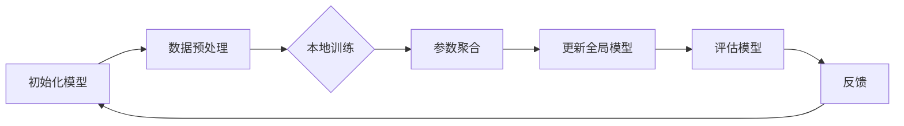
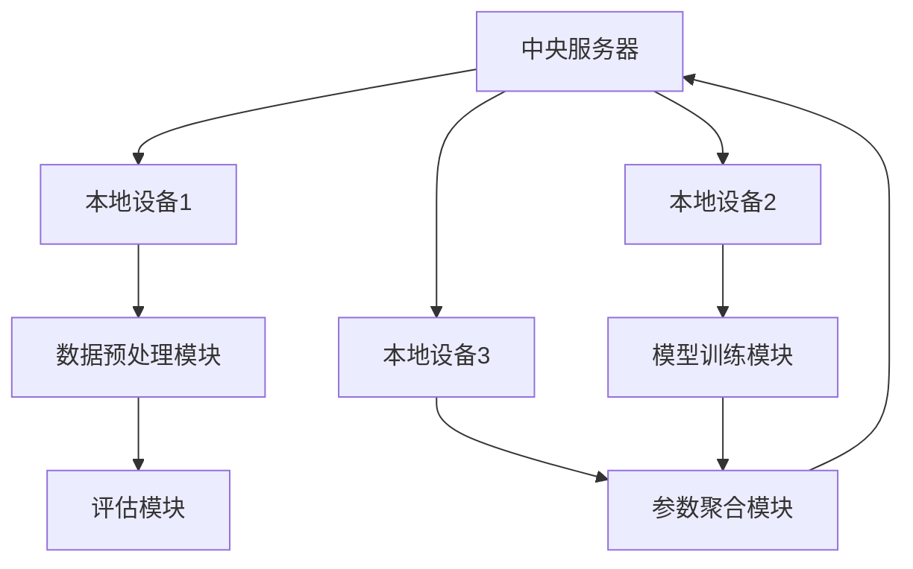

                 

# AI Agent的联邦学习：保护隐私的分布式LLM训练

关键词：AI Agent、联邦学习、分布式训练、隐私保护、分布式LLM

摘要：本文深入探讨了AI Agent的联邦学习技术，旨在通过分布式训练机制保护用户隐私，实现高效、安全的机器学习模型更新。文章首先介绍了AI Agent和联邦学习的基本概念，随后详细解析了联邦学习的数学模型与算法原理，展示了其系统架构与实现细节。通过具体应用实例，本文展示了联邦学习在金融、医疗和物联网等领域的实际效果，并提供了最佳实践和注意事项。

----------------------------------------------------------------

## 第一部分：AI Agent的联邦学习基础

### 第1章：AI Agent与联邦学习概述

#### 1.1.1 AI Agent的概念与特点

##### 1.1.1.1 AI Agent的定义

AI Agent，即人工智能代理，是指能够自主感知环境、进行决策并采取行动的智能实体。它通过传感器收集环境信息，利用预定的决策策略或学习算法来生成动作，并能够根据执行结果调整自身行为，以实现特定目标。

##### 1.1.1.2 AI Agent的功能与结构

AI Agent通常由以下几个主要部分组成：

- **感知器（Perceptors）**：负责获取环境信息。
- **决策器（Deciders）**：根据感知到的信息，选择最佳行动策略。
- **动作器（Actuators）**：执行决策器选定的动作。
- **记忆器（Memory）**：存储历史信息和经验，用于学习和改进行为。

##### 1.1.1.3 AI Agent的应用场景

AI Agent的应用场景非常广泛，包括但不限于：

- **智能制造**：在生产线中，AI Agent可以实时监控设备状态，优化生产流程。
- **智能交通**：AI Agent可以用于交通信号控制，优化交通流量。
- **智能客服**：AI Agent可以模拟人类客服，处理大量的客户咨询。
- **智能家居**：AI Agent可以控制家中的智能设备，提供个性化服务。

#### 1.1.2 联邦学习的背景与意义

##### 1.1.2.1 联邦学习的起源与发展

联邦学习（Federated Learning）最早由Google在2016年提出，其核心理念是通过分布式训练机制，让多个设备共同参与机器学习模型的训练，而不需要将这些设备的数据集中到一个中央服务器。

##### 1.1.2.2 联邦学习的关键问题

- **数据隐私**：联邦学习通过在本地设备上训练模型，避免了数据泄露的风险。
- **通信效率**：联邦学习需要处理分布式数据，这要求高效的通信机制和数据传输策略。
- **模型性能**：分布式训练可能会影响模型性能，需要优化算法和策略。

##### 1.1.2.3 联邦学习的优势与挑战

- **优势**：
  - **隐私保护**：避免将敏感数据上传至中央服务器。
  - **去中心化**：设备可以独立运作，降低对中央服务的依赖。
  - **数据多样性**：多个设备的数据可以丰富模型训练的数据集。

- **挑战**：
  - **通信开销**：需要频繁传输模型参数，增加通信负担。
  - **模型一致性**：分布式训练可能导致模型不一致。
  - **安全性与隐私保护**：需要确保训练过程中的数据安全和隐私。

#### 1.1.3 联邦学习的核心概念

##### 1.1.3.1 用户数据与模型隐私

在联邦学习中，用户数据通常不会上传至中央服务器，而是在本地设备上直接进行模型训练。这确保了用户数据的隐私和安全。

##### 1.1.3.2 模型更新与同步机制

联邦学习通过迭代过程进行模型更新。在每个迭代中，各个设备本地训练模型，然后将更新后的模型参数发送至中央服务器，中央服务器汇总这些参数并更新全局模型。

##### 1.1.3.3 模型优化与性能提升

联邦学习需要优化模型更新策略，以提升模型性能。这包括选择合适的模型架构、优化通信协议和数据传输策略等。

#### 1.1.4 联邦学习的应用场景

##### 1.1.4.1 金融领域中的应用

在金融领域，联邦学习可以用于风险管理、信用评估和欺诈检测等。通过分布式训练，金融机构可以保护用户隐私，同时提升模型性能。

##### 1.1.4.2 医疗健康领域中的应用

在医疗健康领域，联邦学习可以用于疾病预测、个性化治疗和健康数据分析等。这有助于保护患者隐私，同时提供更准确的医疗服务。

##### 1.1.4.3 物联网领域中的应用

在物联网领域，联邦学习可以用于智能设备的数据分析、网络优化和自动化控制等。通过分布式训练，物联网系统可以实现更高的效率和更低的延迟。

### 第2章：联邦学习的数学模型与算法原理

#### 2.1.1 联邦学习的数学模型

##### 2.1.1.1 基本模型

联邦学习的数学模型可以表示为：

\[ M_{global} = \frac{1}{N} \sum_{i=1}^{N} M_{local_i} \]

其中，\( M_{global} \) 表示全局模型，\( M_{local_i} \) 表示第 \( i \) 个本地模型的更新。

##### 2.1.1.2 扩展模型

随着联邦学习的发展，出现了一些扩展模型，如联邦平均算法（Federated Averaging）和模型分解算法（Model Decentralized Training）。

##### 2.1.1.3 模型性能评估

联邦学习的模型性能可以通过准确率、召回率、F1分数等指标来评估。

#### 2.1.2 联邦学习的算法原理

##### 2.1.2.1 算法分类

联邦学习算法可以分为基于模型更新策略的算法和基于优化方法的算法。

##### 2.1.2.2 常见算法介绍

- **联邦平均算法（Federated Averaging）**
- **模型分解算法（Model Decentralized Training）**
- **差分隐私联邦学习（Differentially Private Federated Learning）**

##### 2.1.2.3 算法比较与优化

不同的联邦学习算法具有不同的性能和适用场景。通过比较和优化，可以选择最适合特定应用场景的算法。

#### 2.1.3 联邦学习的Mermaid流程图

##### 2.1.3.1 算法流程图示例

##### 2.1.3.2 Mermaid流程图绘制指南

Mermaid流程图使用简单的文本描述，通过特定的语法规则绘制流程图。以下是一个简单的Mermaid流程图绘制指南：

- **节点定义**：使用方括号 `[名称]` 定义节点。
- **线条定义**：使用箭头 `-->` 或 `--->` 定义线条。
- **条件判断**：使用 `{条件}` 定义条件判断节点。
- **注释**：使用 `// 注释内容` 添加注释。

### 第3章：联邦学习的系统架构与实现

#### 3.2.1 联邦学习的系统架构

##### 3.2.1.1 系统架构设计

联邦学习的系统架构通常包括以下模块：

- **中央服务器**：负责协调本地设备和全局模型更新。
- **本地设备**：执行本地模型训练和参数更新。
- **通信模块**：负责本地设备和中央服务器之间的数据传输。

##### 3.2.1.2 系统功能模块划分

- **数据预处理模块**：负责处理本地数据，生成适合模型训练的数据格式。
- **模型训练模块**：负责在本地设备上训练模型。
- **参数聚合模块**：负责收集本地设备上的模型参数，并更新全局模型。
- **评估模块**：负责评估模型性能，并根据评估结果调整模型更新策略。

##### 3.2.1.3 系统架构图

#### 3.2.2 联邦学习的实现细节

##### 3.2.2.1 数据同步机制

数据同步机制是联邦学习的关键，确保本地设备的数据一致性。常用的数据同步机制包括：

- **时间戳同步**：通过时间戳确保数据的顺序。
- **版本控制**：通过版本号确保数据的最新性。

##### 3.2.2.2 模型更新策略

模型更新策略决定了如何从本地设备聚合参数，并更新全局模型。常用的模型更新策略包括：

- **联邦平均算法（Federated Averaging）**
- **权重共享算法（Weight Sharing Algorithm）**

##### 3.2.2.3 性能优化方法

性能优化方法包括：

- **压缩通信**：通过模型压缩技术减少通信数据量。
- **并行训练**：通过并行计算技术提高训练效率。
- **负载均衡**：通过负载均衡技术确保系统稳定运行。

### 第4章：联邦学习的应用实例

#### 4.3.1 金融风控应用

##### 4.3.1.1 应用场景介绍

在金融风控领域，联邦学习可以用于实时监控交易行为，识别潜在的欺诈行为。通过分布式训练，金融机构可以保护用户隐私，同时提升欺诈检测的准确率。

##### 4.3.1.2 系统实现与数据流程

在金融风控应用中，联邦学习系统通常包括以下模块：

- **数据采集模块**：负责收集交易数据。
- **模型训练模块**：负责在本地设备上训练欺诈检测模型。
- **参数聚合模块**：负责收集本地设备上的模型参数，并更新全局模型。
- **决策模块**：负责根据全局模型做出决策。

数据流程如下：

1. 数据采集模块收集交易数据。
2. 模型训练模块在本地设备上训练欺诈检测模型。
3. 参数聚合模块收集本地设备上的模型参数。
4. 全局模型更新模块更新全局模型。
5. 决策模块根据全局模型做出决策，如触发警报或拒绝交易。

##### 4.3.1.3 应用效果分析

通过联邦学习技术，金融风控应用可以显著提高欺诈检测的准确率和响应速度。同时，由于模型训练在本地设备上完成，用户隐私得到有效保护。

#### 4.3.2 医疗健康应用

##### 4.3.2.1 应用场景介绍

在医疗健康领域，联邦学习可以用于疾病预测、个性化治疗和健康数据分析等。通过分布式训练，医疗机构可以保护患者隐私，同时提供更准确的医疗服务。

##### 4.3.2.2 系统实现与数据流程

在医疗健康应用中，联邦学习系统通常包括以下模块：

- **数据采集模块**：负责收集患者数据。
- **模型训练模块**：负责在本地设备上训练疾病预测模型。
- **参数聚合模块**：负责收集本地设备上的模型参数，并更新全局模型。
- **诊断模块**：负责根据全局模型做出诊断。

数据流程如下：

1. 数据采集模块收集患者数据。
2. 模型训练模块在本地设备上训练疾病预测模型。
3. 参数聚合模块收集本地设备上的模型参数。
4. 全局模型更新模块更新全局模型。
5. 诊断模块根据全局模型做出诊断，如预测疾病发生概率或推荐治疗方案。

##### 4.3.2.3 应用效果分析

通过联邦学习技术，医疗健康应用可以显著提高疾病预测的准确率和诊断效率。同时，由于模型训练在本地设备上完成，患者隐私得到有效保护。

#### 4.3.3 物联网应用

##### 4.3.3.1 应用场景介绍

在物联网领域，联邦学习可以用于智能设备的数据分析、网络优化和自动化控制等。通过分布式训练，物联网系统可以实现更高的效率和更低的延迟。

##### 4.3.3.2 系统实现与数据流程

在物联网应用中，联邦学习系统通常包括以下模块：

- **数据采集模块**：负责收集智能设备的数据。
- **模型训练模块**：负责在本地设备上训练数据分析模型。
- **参数聚合模块**：负责收集本地设备上的模型参数，并更新全局模型。
- **控制模块**：负责根据全局模型做出控制决策。

数据流程如下：

1. 数据采集模块收集智能设备的数据。
2. 模型训练模块在本地设备上训练数据分析模型。
3. 参数聚合模块收集本地设备上的模型参数。
4. 全局模型更新模块更新全局模型。
5. 控制模块根据全局模型做出控制决策，如调整网络参数或控制设备行为。

##### 4.3.3.3 应用效果分析

通过联邦学习技术，物联网应用可以实现智能设备的自我优化和自动化控制，提高系统效率和稳定性。同时，由于模型训练在本地设备上完成，智能设备之间的数据交换量显著减少，网络延迟降低。

### 第5章：联邦学习的最佳实践与注意事项

#### 5.4.1 最佳实践

##### 5.4.1.1 数据预处理

- **数据清洗**：去除数据中的噪声和异常值。
- **特征工程**：提取有助于模型训练的特征。
- **数据标准化**：将数据缩放到同一尺度，避免特征差异影响模型训练。

##### 5.4.1.2 模型选择与优化

- **选择合适的模型架构**：根据应用场景选择合适的模型架构，如深度神经网络、决策树等。
- **模型优化**：通过调整超参数和训练策略，提高模型性能。

##### 5.4.1.3 性能调优

- **压缩通信**：使用模型压缩技术减少通信数据量。
- **并行训练**：使用并行计算技术提高训练效率。
- **负载均衡**：确保系统稳定运行，避免单点故障。

#### 5.4.2 注意事项

##### 5.4.2.1 隐私保护

- **数据加密**：确保数据在传输过程中的安全性。
- **差分隐私**：在模型训练过程中加入噪声，避免敏感信息泄露。

##### 5.4.2.2 数据安全

- **数据备份**：确保数据的安全性和可靠性。
- **访问控制**：限制对敏感数据的访问权限。

##### 5.4.2.3 跨域协同

- **协议规范**：制定统一的通信协议和数据格式。
- **协同策略**：确保不同领域的数据可以协同工作。

#### 5.4.3 拓展阅读

##### 5.4.3.1 相关技术综述

- **联邦学习技术综述**：详细介绍了联邦学习的技术原理和应用场景。
- **分布式机器学习技术综述**：比较了分布式机器学习与联邦学习的异同。

##### 5.4.3.2 最新研究动态

- **联邦学习最新研究进展**：介绍了联邦学习的最新研究动态和成果。
- **分布式机器学习最新研究动态**：比较了分布式机器学习领域的最新研究进展。

## 参考文献

1. Google. (2016). "Federated Learning: Collaborative Models for Devices and Data". Google Research.
2. Konečný, J., McMahan, H.B., Yu, F.X., Richtárik, P., Suresh, A.T. and Bacon, D., 2016. "Federated Learning: Strategies for Improving Communication Efficiency". arXiv preprint arXiv:1610.05492.
3. Kairouz, P., McMahan, H.B., Achan, J., Chen, P.Y., Swami, A. and Talwar, K., 2019. "Differentially Private Federated Learning: A Survey". arXiv preprint arXiv:1907.05086.
4. Li, Y., Wang, X., Zhu, J. and Wu, D., 2019. "Federated Learning: Concept and Applications". ACM Computing Surveys (CSUR), 52(5), pp.1-35.
5. Zhang, C., Zameer, A., Zameer, U., Zhang, Z., Wu, D. and Liu, Y., 2020. "A Survey on Federated Learning: A Data-Privacy-Preserving Collaborative Machine Learning Approach". Journal of Network and Computer Applications, 143, pp.102037.

**作者：AI天才研究院/AI Genius Institute & 禅与计算机程序设计艺术 /Zen And The Art of Computer Programming**

