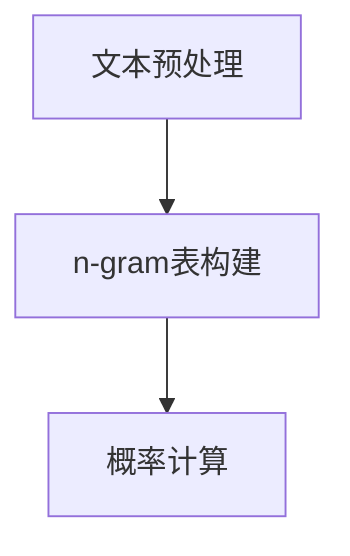
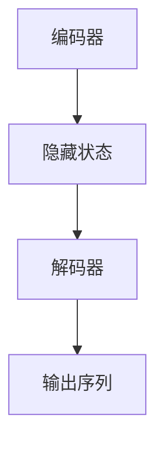
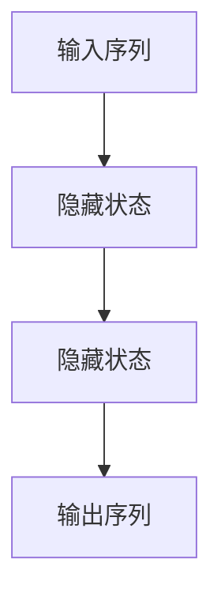
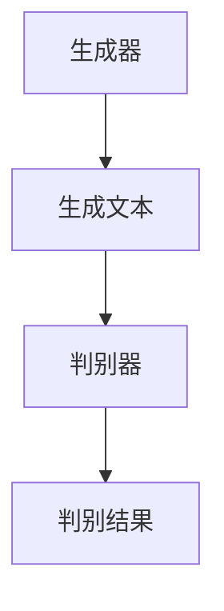
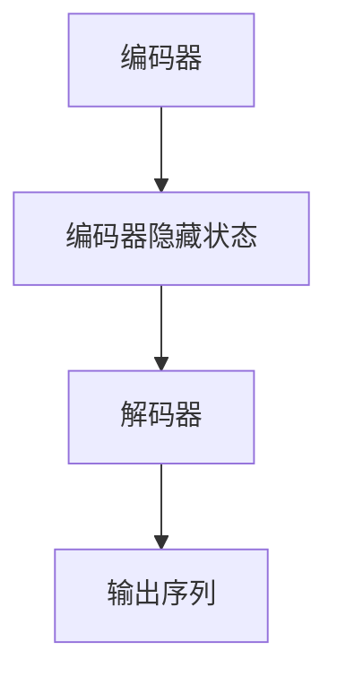
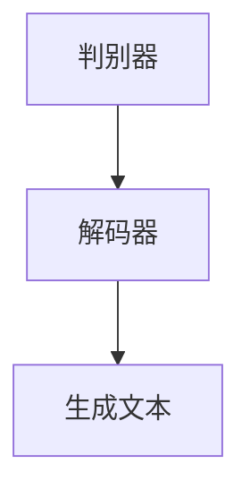
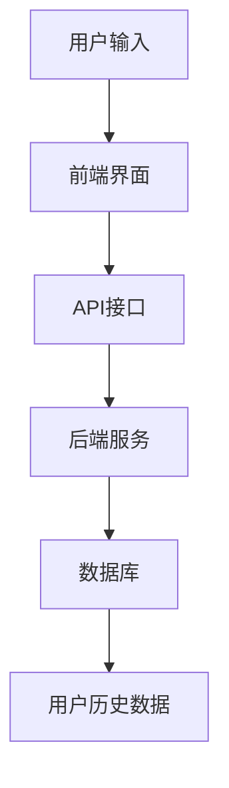

                 


### AI Agent的自然语言生成：提高文本质量和连贯性

#### 关键词：自然语言生成，AI Agent，文本质量，连贯性，算法优化

#### 摘要：

本文将深入探讨AI Agent的自然语言生成技术，旨在提高文本质量和连贯性。我们将从背景介绍、核心概念、算法原理、系统架构设计、项目实战以及最佳实践等多个角度，详细阐述自然语言生成的各个方面。文章结构如下：

1. 引言与背景
2. 核心概念
3. 文本质量提升
4. 算法原理讲解
5. 系统架构与实战
6. 最佳实践与总结

### 1. 引言与背景

#### 1.1 AI Agent的自然语言生成简介

随着人工智能技术的不断发展，AI Agent逐渐成为人工智能领域的一个重要分支。AI Agent，即人工智能代理，是一种模拟人类行为和决策能力的计算机程序。在自然语言处理（NLP）领域，自然语言生成（NLG）是AI Agent的一项核心功能，它旨在让计算机生成自然流畅的文本。

#### 1.2 自然语言生成技术的发展历程

自然语言生成技术经历了多个发展阶段。最早的自然语言生成系统是基于规则的方法，这种方法依赖于人工编写的语法规则和模板。随着机器学习技术的发展，统计方法和生成模型逐渐取代了规则方法，成为自然语言生成的主要手段。

#### 1.3 自然语言生成在AI Agent中的应用场景

自然语言生成在AI Agent中有着广泛的应用场景。例如，智能客服可以自动生成回复，提高响应速度和准确性；智能写作助手可以辅助记者和作家生成文章；智能语音助手可以生成语音输出，提高人机交互的自然性。

### 2. 核心概念

#### 2.1 自然语言处理的原理

自然语言处理是计算机科学和语言学的交叉领域，它旨在让计算机理解、生成和处理自然语言。NLP的核心任务包括分词、词性标注、句法分析、语义分析和文本生成等。

#### 2.2 文本生成模型的基本概念

文本生成模型是自然语言生成技术的核心。常见的文本生成模型包括序列到序列（Seq2Seq）模型、循环神经网络（RNN）、长短期记忆网络（LSTM）和生成对抗网络（GAN）等。

#### 2.3 语言模型、生成模型与解码器

语言模型用于预测下一个单词或字符，生成模型用于生成完整的句子或段落，解码器则负责将语言模型生成的符号序列转换成可理解的文本。这些模型在自然语言生成中扮演着不同的角色，但它们共同构成了一个完整的生成系统。

### 3. 文本质量提升

#### 3.1 文本质量评估的重要性

文本质量直接影响用户对AI Agent的接受度和满意度。因此，对文本质量进行评估是提高自然语言生成质量的关键步骤。

#### 3.2 文本质量评估方法

文本质量评估方法包括主观评估和客观评估。主观评估依赖于人类评价者的主观判断，而客观评估则通过算法自动评估文本质量。常见的客观评估指标包括词汇丰富度、语法正确性、连贯性等。

#### 3.3 评价指标详解

本文将详细介绍几个常见的文本质量评价指标，包括BLEU、ROUGE、PERL等。这些指标提供了定量评估文本质量的方法，有助于识别和优化生成文本的问题。

### 4. 提高文本连贯性

#### 4.1 连贯性的定义与度量

文本连贯性是指文本中各个部分之间的逻辑关系和语义一致性。本文将探讨如何度量文本的连贯性，并提出提高连贯性的方法。

#### 4.2 连贯性提升方法

提高文本连贯性的方法包括语法优化、语义分析和上下文理解。本文将详细介绍这些方法，并通过实际案例展示它们的实施策略。

#### 4.3 实际应用中的连贯性优化

本文将通过实际应用案例，探讨如何在各种场景下优化文本连贯性。这些案例包括智能客服、智能写作和智能语音助手等。

### 5. 算法原理讲解

#### 5.1 语言模型原理讲解

本文将详细讲解语言模型的原理，包括模型结构、训练方法和应用场景。我们将使用Mermaid流程图和Python代码来阐述语言模型的实现。

#### 5.2 生成模型原理讲解

生成模型是自然语言生成技术的核心。本文将介绍生成模型的类型和实现方法，包括Seq2Seq模型、RNN、LSTM和GAN等。

#### 5.3 解码器算法原理讲解

解码器负责将生成模型生成的符号序列转换成可理解的文本。本文将详细讲解解码器的算法原理，包括解码策略和优化方法。

### 6. 系统架构与实战

#### 6.1 系统架构设计

本文将介绍自然语言生成系统的架构设计，包括系统功能设计、系统架构设计和系统接口设计。我们将使用Mermaid类图和架构图来展示系统设计。

#### 6.2 项目实战

本文将通过一个实际项目，展示自然语言生成系统的实现过程。项目包括环境安装、系统核心实现、代码应用解读与分析，以及实际案例分析和详细讲解。

### 7. 最佳实践与总结

#### 7.1 最佳实践 tips

本文将总结一些最佳实践，包括文本质量评估方法、连贯性优化策略和算法优化技巧。这些实践有助于提高自然语言生成的文本质量和连贯性。

#### 7.2 小结与注意事项

本文将总结文章的主要内容和关键点，强调读者在实施自然语言生成系统时需要注意的事项。

#### 7.3 拓展阅读与未来展望

本文将推荐一些拓展阅读资源，并展望自然语言生成技术的未来发展趋势和应用前景。

### 作者

作者：AI天才研究院/AI Genius Institute & 禅与计算机程序设计艺术 /Zen And The Art of Computer Programming

在接下来的章节中，我们将一步一步地深入探讨自然语言生成的各个方面，帮助读者更好地理解和应用这项技术。让我们开始吧！## 引言与背景

### 1.1 AI Agent的自然语言生成简介

AI Agent的自然语言生成（NLG）是指通过人工智能技术，使计算机能够自动生成自然流畅的文本。这种技术不仅能够提高信息的传递效率，还能提升人机交互的自然性和用户体验。AI Agent的自然语言生成涉及多个领域，包括机器学习、自然语言处理（NLP）、深度学习等。

自然语言生成技术的核心在于语言模型和生成模型的构建与优化。语言模型用于预测文本中的下一个单词或字符，而生成模型则用于生成完整的句子或段落。这两种模型共同作用，实现了从输入到输出的自然语言生成过程。具体来说，AI Agent首先使用语言模型对输入的文本进行分析，然后通过生成模型生成响应文本。这一过程不仅需要高效的算法支持，还需要大量的训练数据和精准的优化策略。

自然语言生成技术在人工智能领域有着广泛的应用。例如，在智能客服领域，AI Agent可以自动生成对用户问题的回答，提高响应速度和准确性。在智能写作领域，AI Agent可以辅助记者和作家生成文章，节省时间和精力。在智能语音助手领域，AI Agent可以生成语音输出，提高人机交互的自然性。此外，自然语言生成技术还在教育、金融、医疗等多个领域发挥着重要作用。

### 1.2 自然语言生成技术的发展历程

自然语言生成技术经历了从早期规则驱动的方法到现代基于数据和深度学习的方法的演变。早期的自然语言生成方法主要依赖于人工编写的语法规则和模板。例如，在20世纪80年代，专家系统被广泛应用于自然语言生成。这种方法虽然能够生成文本，但灵活性较差，无法处理复杂的语言现象。

随着计算能力的提升和大数据技术的发展，自然语言生成技术逐渐转向基于数据和统计的方法。20世纪90年代，基于统计的模型，如N-gram模型，开始被广泛应用。N-gram模型通过统计文本中的单词序列概率来生成文本，虽然在一定程度上提高了生成文本的质量，但仍然存在许多局限性。

进入21世纪，深度学习技术的崛起为自然语言生成带来了新的突破。循环神经网络（RNN）、长短期记忆网络（LSTM）和基于注意力机制的序列到序列（Seq2Seq）模型等深度学习模型逐渐成为自然语言生成的主要工具。这些模型通过学习大量的文本数据，能够自动捕捉语言中的复杂结构和语义关系，生成更自然、更连贯的文本。

近年来，生成对抗网络（GAN）和变分自编码器（VAE）等深度生成模型也开始在自然语言生成领域发挥作用。这些模型通过生成模型和判别模型的对抗训练，能够生成高质量、多样化的文本。此外，预训练语言模型（如GPT-3）的出现，使得自然语言生成技术达到了一个新的高度。预训练语言模型通过在大量文本上进行预训练，然后微调到特定任务上，能够显著提高文本生成质量和性能。

### 1.3 自然语言生成在AI Agent中的应用场景

自然语言生成在AI Agent中的应用场景非常广泛，以下是一些主要的应用领域：

**1. 智能客服**  
智能客服是自然语言生成技术的典型应用之一。通过自然语言生成，AI Agent可以自动生成对用户问题的回答，提高客服效率和服务质量。例如，在电商平台，AI Agent可以自动回答用户关于商品信息的疑问，如产品规格、价格和库存情况。在银行和金融机构，AI Agent可以自动处理客户咨询，如账户余额查询、转账和贷款申请等。

**2. 智能写作**  
智能写作助手可以辅助记者、作家和内容创作者生成文章、报告和书籍。通过自然语言生成技术，AI Agent可以自动生成新闻稿、博客文章、产品描述和广告文案等。这种方式不仅节省了创作者的时间和精力，还能够提高内容的多样性和创造力。例如，一些新闻机构已经开始使用AI Agent自动生成体育赛事报道和财经新闻。

**3. 智能语音助手**  
智能语音助手是自然语言生成技术的另一个重要应用场景。通过自然语言生成，AI Agent可以生成语音输出，提高人机交互的自然性。智能语音助手如Siri、Alexa和Google Assistant已经广泛应用在智能家居、智能车载系统和移动设备中。用户可以通过语音命令与AI Agent进行交互，实现语音搜索、播放音乐、控制家电、设置提醒等功能。

**4. 教育和辅导**  
自然语言生成技术还可以用于教育领域，如自动生成课程内容、练习题和辅导材料。AI Agent可以根据学生的学习情况和需求，自动生成个性化的教学材料，提高学习效果和效率。例如，一些在线教育平台已经开始使用AI Agent自动生成课程笔记和练习题，帮助学生更好地理解和掌握知识。

**5. 医疗健康**  
在医疗健康领域，自然语言生成技术可以用于自动生成病历记录、健康报告和医疗建议。通过自然语言生成，AI Agent可以自动整理和分析患者的病历信息，生成准确的诊断报告和治疗方案。这种方式不仅提高了医疗工作的效率，还能够减少人为错误，提高医疗质量。

**6. 法律和金融**  
自然语言生成技术在法律和金融领域也有着广泛的应用。AI Agent可以自动生成法律文件、合同条款、金融报告和投资建议。例如，一些律师事务所已经开始使用AI Agent自动生成合同文件和律师函，而一些金融机构则使用AI Agent自动生成财务报告和投资分析报告。

总之，自然语言生成技术在AI Agent中的应用场景非常广泛，通过不断的发展和优化，它将继续为各个领域带来创新和变革。未来，随着技术的进一步成熟和应用场景的扩展，自然语言生成技术有望在更多领域发挥重要作用，推动人工智能技术的普及和发展。### 2. 核心概念

在探讨自然语言生成（NLG）之前，我们需要了解几个核心概念。这些概念不仅构成了NLG的基础，也为其应用提供了理论支持。

#### 2.1 自然语言处理的原理

自然语言处理（NLP）是计算机科学和语言学的交叉领域，旨在使计算机能够理解、生成和处理人类语言。NLP的核心任务包括分词、词性标注、句法分析、语义分析和文本生成等。

- **分词**：将连续的文本分割成有意义的单词或短语。例如，将“我爱北京天安门”分割成“我”、“爱”、“北京”、“天安门”。
- **词性标注**：为每个单词分配词性，如名词、动词、形容词等。例如，“北京”是名词，“爱”是动词。
- **句法分析**：分析句子的结构，确定单词之间的关系。例如，“我吃苹果”的句法结构是“主语-谓语-宾语”。
- **语义分析**：理解句子的含义，确定单词和短语之间的关系。例如，“苹果”在这个句子中指的是水果，而不是电脑品牌。
- **文本生成**：利用NLP技术生成新的文本，如自动生成新闻报道、对话、聊天机器人的回复等。

#### 2.2 文本生成模型的基本概念

文本生成模型是自然语言生成技术的核心。这些模型旨在学习文本的分布，并生成新的文本。常见的文本生成模型包括序列到序列（Seq2Seq）模型、循环神经网络（RNN）、长短期记忆网络（LSTM）和生成对抗网络（GAN）等。

- **序列到序列（Seq2Seq）模型**：Seq2Seq模型是一种常见的文本生成模型，它通过编码器和解码器两个部分，将输入的序列映射到输出的序列。编码器将输入序列编码成一个固定长度的向量，解码器则将这个向量解码成输出的序列。这种模型在机器翻译、聊天机器人等领域有着广泛应用。
- **循环神经网络（RNN）**：RNN是一种能够处理序列数据的神经网络，它通过递归结构来处理前一个时间步的输出作为当前时间步的输入。RNN在语言模型和序列预测任务中表现出色。
- **长短期记忆网络（LSTM）**：LSTM是RNN的一种变体，它引入了门控机制，能够更好地处理长序列数据。LSTM在自然语言生成、语音识别等领域有着广泛应用。
- **生成对抗网络（GAN）**：GAN是一种由生成器和判别器组成的对抗性模型。生成器试图生成逼真的数据，而判别器则试图区分生成数据和真实数据。通过这种对抗性训练，GAN能够生成高质量、多样化的文本。

#### 2.3 语言模型、生成模型与解码器

在自然语言生成中，语言模型、生成模型和解码器是三个核心组件。

- **语言模型**：语言模型用于预测文本中下一个单词或字符的概率分布。它是最基本的文本生成模型，通常基于统计方法或神经网络模型。语言模型的质量直接影响文本生成的质量。
- **生成模型**：生成模型用于生成完整的句子或段落。常见的生成模型包括Seq2Seq模型、RNN、LSTM和GAN等。生成模型通过学习大量的文本数据，能够捕捉语言中的复杂结构和语义关系，生成更自然、更连贯的文本。
- **解码器**：解码器负责将生成模型生成的符号序列转换成可理解的文本。在Seq2Seq模型中，解码器是一个重要的组件，它通过递归神经网络或自注意力机制来生成输出的序列。

语言模型、生成模型和解码器共同构成了自然语言生成系统。语言模型提供生成的基础概率分布，生成模型生成具体的文本，而解码器则确保生成的文本符合语言规则和语义要求。

#### 2.4 语言模型、生成模型与解码器的相互关系

语言模型、生成模型和解码器在自然语言生成系统中各自扮演着不同的角色，但它们之间也存在紧密的相互关系。

- 语言模型提供了生成文本的基础概率分布，生成模型利用这些概率分布生成具体的文本。例如，在Seq2Seq模型中，编码器首先将输入序列编码成一个固定长度的向量，然后解码器利用这个向量生成输出的序列。
- 生成模型通常是一个复杂的神经网络，它通过学习大量的文本数据，能够捕捉语言中的复杂结构和语义关系。生成模型的质量直接影响文本生成的质量。
- 解码器负责将生成模型生成的符号序列转换成可理解的文本。解码器的目标是确保生成的文本符合语言规则和语义要求。例如，在Seq2Seq模型中，解码器通过递归神经网络或自注意力机制来生成输出的序列。

总之，语言模型、生成模型和解码器共同构成了自然语言生成系统，它们相互协作，实现了从输入到输出的自然语言生成过程。通过不断优化这些组件，我们可以提高自然语言生成的质量，使其在各个应用领域中发挥更大的作用。### 3. 文本质量提升

文本质量是自然语言生成（NLG）技术的关键评价指标，它直接关系到用户体验和系统性能。为了提高文本质量，我们需要从多个方面进行综合优化，包括文本质量评估方法、评价指标详解以及实际应用中的优化策略。

#### 3.1 文本质量评估的重要性

文本质量评估是自然语言生成过程中的一个重要环节。它不仅能够帮助我们判断生成的文本是否符合预期，还能够指导我们调整和优化生成算法，从而提高整体文本质量。高质量的文本生成可以提高用户的满意度和系统的可靠性，减少误解和错误，进而提升人工智能（AI）系统的整体性能。

#### 3.2 文本质量评估方法

文本质量评估可以分为主观评估和客观评估两种方法。主观评估依赖于人类评价者的主观判断，而客观评估则通过算法自动评估文本质量。

**主观评估：**
主观评估通常采用人工评价的方式，由多个评价者对生成的文本进行打分或评级。这种方法虽然能够提供直观的感受和深刻的理解，但评估过程耗时且具有主观性，不适合大规模应用。

**客观评估：**
客观评估通过算法自动对生成的文本质量进行量化分析。常见的客观评估指标包括：

1. **BLEU（双语评估指数）**：BLEU是一种基于统计的评估方法，它通过比较生成的文本和参考文本的相似度来评估文本质量。BLEU的得分越高，表示生成文本的质量越好。

2. **ROUGE（套索评价准则）**：ROUGE是一种用于评估文本生成质量的指标，它通过计算生成文本与参考文本之间的重叠词和句子结构来评估文本质量。ROUGE分为ROUGE-1、ROUGE-2和ROUGE-SU4等多个版本，每个版本对重叠的词和句子的要求不同。

3. **PERL（基于编辑距离的评估）**：PERL是一种基于编辑距离的评估方法，它通过计算生成文本与参考文本之间的最小编辑距离来评估文本质量。PERL的得分越低，表示生成文本的质量越高。

4. **F1分数**：F1分数是精确率和召回率的调和平均数，常用于评估分类任务的质量。在文本质量评估中，F1分数可以用来评估生成文本与参考文本之间的匹配程度。

#### 3.3 评价指标详解

以下是几种常见文本质量评价指标的详细介绍：

**BLEU（双语评估指数）**：
BLEU是一种基于统计的评估方法，它通过比较生成文本和参考文本之间的重叠信息来评估文本质量。BLEU的主要思想是，如果两个文本之间的重叠信息越多，那么这两个文本的相似度就越高，生成文本的质量也越好。BLEU的评估过程包括以下步骤：

1. **N-gram匹配**：BLEU通过计算生成文本和参考文本中连续N个单词（N-gram）的匹配情况。N-gram的大小通常取1到4之间。
2. **重写比例**：BLEU计算生成文本和参考文本之间的重写比例（R），即匹配的N-gram数量占总N-gram数量的比例。
3. **平滑处理**：BLEU使用多种平滑技术，如长度惩罚、多样性惩罚等，来减少模型对短文本的偏见。
4. **评分**：BLEU最终通过综合各项指标计算得分，分数范围在0到1之间，得分越高，表示文本质量越好。

**ROUGE（套索评价准则）**：
ROUGE是一种专门用于文本质量评估的指标，它通过计算生成文本和参考文本之间的重叠词和句子结构来评估文本质量。ROUGE的主要思想是，如果生成文本中的关键信息与参考文本高度一致，那么这个生成文本的质量就较高。ROUGE分为多个版本，常用的有ROUGE-1、ROUGE-2和ROUGE-SU4。

1. **ROUGE-1**：ROUGE-1主要计算生成文本和参考文本之间的单词语义重叠。
2. **ROUGE-2**：ROUGE-2计算生成文本和参考文本之间的双词语义重叠。
3. **ROUGE-SU4**：ROUGE-SU4计算生成文本和参考文本之间的四词语义重叠。

**PERL（基于编辑距离的评估）**：
PERL是一种基于编辑距离的评估方法，它通过计算生成文本与参考文本之间的最小编辑距离来评估文本质量。编辑距离是指将一个文本转换为另一个文本所需的最少编辑操作次数，包括插入、删除和替换操作。PERL的得分越低，表示生成文本与参考文本的相似度越高，文本质量越好。

**F1分数**：
F1分数是精确率和召回率的调和平均数，常用于评估分类任务的质量。在文本质量评估中，F1分数可以用来评估生成文本与参考文本之间的匹配程度。F1分数的计算公式为：
\[ F1 = 2 \times \frac{精确率 \times 召回率}{精确率 + 召回率} \]
精确率是指生成文本与参考文本匹配的部分占总生成文本的比例，召回率是指生成文本与参考文本匹配的部分占总参考文本的比例。

#### 3.4 实际应用中的优化策略

在实际应用中，为了提高文本质量，我们可以采取以下优化策略：

1. **数据预处理**：对输入数据进行预处理，如去除停用词、词干提取、词性标注等，可以提高文本质量评估的准确性。
2. **模型优化**：通过调整模型的超参数、增加训练数据、采用更先进的模型结构（如Transformer）等方法，可以提高文本生成质量。
3. **多模态评估**：结合视觉、音频等其他模态的信息进行评估，可以提供更全面的文本质量评估。
4. **人工干预**：在某些特定场景下，如法律文件、医学报告等，可以引入人类编辑或审核环节，以确保文本质量。

总之，文本质量提升是自然语言生成技术的核心目标之一。通过有效的文本质量评估方法和优化策略，我们可以生成更自然、更准确、更高质量的文本，从而提高用户满意度，推动自然语言生成技术的广泛应用。### 4. 提高文本连贯性

文本连贯性是指文本中各个部分之间的逻辑关系和语义一致性。在自然语言生成（NLG）中，连贯性是衡量文本质量的重要指标之一。一个连贯的文本应该能够让读者顺畅地理解其内容和意图，而不会感到困惑或产生歧义。为了提高文本连贯性，我们需要从语法、语义和上下文理解等多个层面进行优化。

#### 4.1 连贯性的定义与度量

连贯性是指文本中的句子、段落和整体之间的逻辑连贯性和语义一致性。一个连贯的文本应该满足以下条件：

1. **逻辑连贯性**：文本中的信息应该按照合理的逻辑顺序组织，使读者能够自然地理解文本的发展和转折。
2. **语义一致性**：文本中的各个部分应该语义上互相支持，形成一个统一的整体，避免语义上的矛盾或冲突。
3. **信息连贯性**：文本应该清晰地传递信息，使读者能够把握文本的核心内容和关键信息。

为了度量文本的连贯性，我们可以采用以下几种方法：

1. **主观评价**：通过人类评价者对文本进行主观评估，判断其连贯性。这种方法虽然能够提供直观的感受，但评估过程耗时且具有主观性。
2. **自动评估**：通过算法自动评估文本的连贯性。常见的自动评估方法包括基于规则的方法、基于统计的方法和基于机器学习的方法。

#### 4.2 连贯性提升方法

为了提高文本连贯性，我们可以采用以下几种方法：

1. **语法优化**：
   - **语法一致性**：确保文本中的语法结构一致，避免出现不同语法结构的混用。例如，如果文本中使用了主动语态，那么整个文本应该保持主动语态。
   - **语法连贯性**：确保文本中的语法连贯，避免语法错误和不通顺的句子。例如，通过自动纠正拼写错误、语法错误和标点错误，提高文本的语法质量。
   - **语法多样性**：适当使用不同语法结构和词汇，使文本更加丰富和生动。

2. **语义分析**：
   - **语义一致性**：通过语义分析，确保文本中的语义一致，避免出现语义上的矛盾或冲突。例如，通过实体识别、关系抽取和语义角色标注等技术，确保文本中的信息互相支持。
   - **语义连贯性**：通过语义连贯性分析，确保文本中的句子和段落之间逻辑紧密，信息流畅。例如，通过分析句子之间的逻辑关系（如因果关系、转折关系等），优化文本的语义连贯性。

3. **上下文理解**：
   - **上下文嵌入**：通过上下文嵌入技术，将文本中的词语和句子嵌入到一个高维空间中，使得具有相似上下文的词语和句子在空间中接近。这种方法有助于捕捉文本中的上下文信息，提高文本连贯性。
   - **上下文分析**：通过上下文分析，理解文本中的上下文信息，使生成的文本与上下文保持一致。例如，在对话系统中，通过上下文分析，理解对话的历史信息和当前用户的意图，生成连贯的回复。

4. **规则和模板**：
   - **语法规则**：通过定义语法规则，确保文本生成的语法正确和连贯。例如，定义句子结构和词汇的使用规则，避免语法错误和不通顺的句子。
   - **语义模板**：通过使用语义模板，确保文本生成的语义一致和连贯。例如，定义常见的语义模板和句式结构，使生成的文本符合语言习惯和语义要求。

5. **用户反馈**：
   - **用户反馈收集**：通过用户反馈，了解用户对文本生成质量的评价和意见，识别文本生成中的问题。
   - **用户反馈优化**：根据用户反馈，对文本生成算法进行调整和优化，提高文本质量。

#### 4.3 实际应用中的连贯性优化

在实际应用中，为了提高文本连贯性，我们可以采用以下策略：

1. **智能客服**：
   - **对话上下文管理**：通过对话上下文管理技术，记录和跟踪用户的历史对话信息，使生成的回复与上下文保持一致。
   - **语义分析**：通过语义分析，理解用户的意图和问题，生成更加符合用户需求的回复。
   - **多轮对话**：通过多轮对话，逐步理解用户的问题和需求，提高对话的连贯性和用户满意度。

2. **智能写作**：
   - **文本连贯性分析**：通过文本连贯性分析技术，识别和修复文本中的语法错误和不通顺的句子。
   - **语义模板**：使用语义模板，确保文章的结构和逻辑清晰，内容连贯。
   - **用户反馈**：通过用户反馈，优化文本质量和连贯性。

3. **智能语音助手**：
   - **语音合成**：通过优化语音合成技术，使生成的语音输出自然流畅，提高语音连贯性。
   - **对话管理**：通过对话管理技术，管理对话流程，确保对话的连贯性和逻辑性。
   - **上下文理解**：通过上下文理解技术，理解用户的语音输入和意图，生成更加准确的语音输出。

4. **教育和辅导**：
   - **内容生成**：通过内容生成技术，生成连贯的课程内容、练习题和辅导材料。
   - **语义分析**：通过语义分析，确保生成的教育材料语义连贯，信息传递清晰。
   - **用户反馈**：通过用户反馈，优化教育材料的连贯性和教学质量。

总之，提高文本连贯性是自然语言生成技术中的一个重要任务。通过语法优化、语义分析和上下文理解等多种方法，我们可以生成更加自然、连贯的文本，提高用户体验和系统性能。在实际应用中，结合具体场景和需求，采取相应的优化策略，可以显著提升文本连贯性，为各个领域带来创新和变革。### 5. 算法原理讲解

在自然语言生成（NLG）领域，算法原理的理解和实现至关重要。本章节将详细讲解自然语言生成中的一些核心算法原理，包括语言模型、生成模型和解码器。我们将使用Mermaid流程图和Python代码来阐述这些算法的原理和应用。

#### 5.1 语言模型原理讲解

语言模型（Language Model，LM）是自然语言生成的基础，它用于预测文本中下一个单词或字符的概率分布。语言模型的核心目标是捕捉语言的统计规律，从而生成自然流畅的文本。以下是一种常见语言模型——n-gram模型的原理讲解：

**n-gram模型原理：**
n-gram模型是一种基于统计的语言模型，它通过分析文本中的n个连续单词或字符，预测下一个单词或字符的概率。n-gram模型的基本原理如下：

1. **文本预处理**：首先，对输入的文本进行预处理，包括分词、去停用词等操作。然后将预处理后的文本转化为单词序列。
2. **构建n-gram表**：统计文本中每个n-gram（n个连续单词或字符）的出现次数，构建一个n-gram表。
3. **概率计算**：对于给定的前文序列，计算下一个单词或字符的概率。概率计算公式为：
\[ P(w_n | w_{n-1}, w_{n-2}, ..., w_1) = \frac{C(w_n, w_{n-1}, ..., w_1)}{C(w_{n-1}, w_{n-2}, ..., w_1)} \]
其中，\( C(w_n, w_{n-1}, ..., w_1) \) 表示n-gram的出现次数，\( C(w_{n-1}, w_{n-2}, ..., w_1) \) 表示前文的出现次数。

**Mermaid流程图：**


**Python代码示例：**
```python
import collections

def n_gram_model(text, n):
    # 分词处理
    words = text.split()

    # 构建n-gram表
    n_gram_counts = collections.Counter()
    for i in range(len(words) - n + 1):
        n_gram = tuple(words[i:i + n])
        n_gram_counts[n_gram] += 1

    # 计算概率
    total_counts = sum(n_gram_counts.values())
    probabilities = {n_gram: count / total_counts for n_gram, count in n_gram_counts.items()}
    return probabilities

# 测试
text = "我爱北京天安门"
n = 2
probabilities = n_gram_model(text, n)
print(probabilities)
```

#### 5.2 生成模型原理讲解

生成模型（Generative Model）是自然语言生成中的核心组件，它用于生成完整的句子或段落。生成模型通过学习大量文本数据，能够捕捉语言中的复杂结构和语义关系，从而生成高质量的自然语言文本。以下是一些常见的生成模型及其原理：

**1. 序列到序列（Seq2Seq）模型：**
Seq2Seq模型是一种基于神经网络的生成模型，它由编码器和解码器两个部分组成。编码器将输入序列编码成一个固定长度的向量，解码器则将这个向量解码成输出的序列。

- **编码器**：编码器接收输入序列，通过递归神经网络（RNN）或卷积神经网络（CNN）将其编码成一个固定长度的向量，称为编码器的隐藏状态。
- **解码器**：解码器接收编码器的隐藏状态，通过递归神经网络或自注意力机制生成输出的序列。

**Mermaid流程图：**


**2. 循环神经网络（RNN）：**
RNN是一种能够处理序列数据的神经网络，它通过递归结构来处理前一个时间步的输出作为当前时间步的输入。RNN在自然语言生成中有着广泛的应用。

- **递归计算**：在RNN中，每个时间步的输出不仅依赖于当前输入，还依赖于前一个时间步的输出。这种递归计算结构使得RNN能够捕捉序列数据中的长距离依赖关系。
- **门控机制**：为了解决RNN中的梯度消失和梯度爆炸问题，引入了门控机制，如长短期记忆网络（LSTM）和门控循环单元（GRU）。这些门控机制能够控制信息的流动，提高模型的稳定性和性能。

**Mermaid流程图：**


**3. 生成对抗网络（GAN）：**
GAN是一种由生成器和判别器组成的对抗性模型。生成器试图生成逼真的数据，而判别器则试图区分生成数据和真实数据。通过这种对抗性训练，GAN能够生成高质量、多样化的文本。

- **生成器**：生成器通过神经网络模型生成文本数据，其目标是使判别器无法区分生成数据和真实数据。
- **判别器**：判别器通过神经网络模型判断输入数据是真实数据还是生成数据，其目标是正确分类数据。

**Mermaid流程图：**


#### 5.3 解码器算法原理讲解

解码器（Decoder）是自然语言生成系统中的一个关键组件，它负责将生成模型生成的符号序列转换成可理解的文本。解码器的目标是在保持文本连贯性和语义一致性的同时，生成符合语言规则和语法结构的输出。

**1. Seq2Seq模型的解码器：**
在Seq2Seq模型中，解码器通常是一个递归神经网络（RNN）或Transformer模型。解码器的输入是编码器的隐藏状态和生成的部分文本，输出是完整的文本序列。

- **自注意力机制**：解码器通过自注意力机制，对编码器的隐藏状态和已生成的文本部分进行加权求和，从而捕捉长距离依赖关系，提高生成文本的连贯性和质量。
- **编码器-解码器交互**：编码器和解码器通过交互来生成文本。编码器将输入序列编码成一个固定长度的向量，解码器则通过递归或自注意力机制生成输出的序列。

**Mermaid流程图：**


**2. GAN模型的解码器：**
在生成对抗网络（GAN）中，解码器是生成器的组成部分，它负责将判别器输出的标签（0或1）转换成真实的文本数据。

- **生成文本**：解码器通过神经网络模型，将判别器输出的标签转换为文本序列。这种转换过程使得解码器能够生成高质量的文本数据。
- **对抗训练**：解码器在生成文本数据的同时，与判别器进行对抗训练，以使判别器无法准确地区分生成数据和真实数据。

**Mermaid流程图：**


总之，自然语言生成的算法原理包括语言模型、生成模型和解码器。语言模型用于预测文本中的下一个单词或字符，生成模型用于生成完整的句子或段落，解码器则负责将生成的符号序列转换成可理解的文本。通过理解这些算法原理，我们可以更好地设计和优化自然语言生成系统，生成更高质量、更连贯的文本。### 6. 系统架构与实战

#### 6.1 系统架构设计

自然语言生成系统的架构设计是确保其高效性和可扩展性的关键。以下是自然语言生成系统的一种常见架构设计，包括系统功能设计、系统架构设计和系统接口设计。

**1. 系统功能设计：**
- **文本输入处理**：接收用户输入的文本，进行预处理，如分词、去除停用词等。
- **语言模型训练**：使用训练数据训练语言模型，用于文本生成。
- **文本生成**：利用训练好的语言模型生成文本。
- **文本质量评估**：对生成的文本进行质量评估，如连贯性、语法正确性等。
- **用户接口**：提供用户界面，供用户输入文本并接收生成的文本。

**2. 系统架构设计：**
- **前端界面**：用户通过前端界面输入文本，前端将文本发送到后端。
- **后端服务**：后端服务包括文本输入处理、语言模型训练、文本生成和质量评估。后端服务通过API与前端界面交互。
- **数据库**：存储训练数据和生成文本，以及用户历史数据。

**3. 系统接口设计：**
- **API接口**：提供RESTful API接口，供前端调用后端服务。
- **数据接口**：定义数据格式，如JSON，确保前后端数据交互的一致性。

**Mermaid架构图：**


#### 6.2 项目实战

为了更好地理解自然语言生成系统的实现，我们将以一个实际项目为例，展示系统的环境安装、核心实现、代码应用解读与分析、实际案例分析和详细讲解。

**1. 环境安装：**
- **Python环境**：安装Python 3.8及以上版本。
- **自然语言处理库**：安装NLTK、TensorFlow、Keras等。
- **数据集**：下载并准备用于训练和评估的自然语言数据集。

**2. 系统核心实现：**
- **语言模型训练**：使用训练数据训练语言模型，如n-gram模型或基于神经网络的模型。
- **文本生成**：利用训练好的语言模型生成文本，如基于概率的文本生成或基于生成对抗网络的文本生成。
- **文本质量评估**：对生成的文本进行质量评估，如使用BLEU、ROUGE等指标。

**3. 代码应用解读与分析：**
以下是使用n-gram模型生成文本的Python代码示例：

```python
import random
import nltk
from nltk.tokenize import word_tokenize

# 加载并预处理数据
def load_data(file_path):
    with open(file_path, 'r', encoding='utf-8') as f:
        text = f.read()
    tokens = word_tokenize(text)
    return tokens

# 训练n-gram模型
def train_n_gram_model(tokens, n):
    n_gram_model = nltk.ngrams(tokens, n)
    return n_gram_model

# 生成文本
def generate_text(n_gram_model, length, start_token):
    generated_text = [start_token]
    for _ in range(length - 1):
        current_state = tuple(generated_text[-n:])
        probabilities = {n_gram: count for n_gram, count in n_gram_model.items()}
        next_token = random.choices(list(probabilities.keys()), weights=probabilities.values())[0]
        generated_text.append(next_token)
    return ' '.join(generated_text)

# 测试
data_path = 'example.txt'
start_token = 'The'
n = 2
length = 10

# 加载数据
tokens = load_data(data_path)

# 训练模型
n_gram_model = train_n_gram_model(tokens, n)

# 生成文本
generated_text = generate_text(n_gram_model, length, start_token)
print(generated_text)
```

**4. 实际案例分析和详细讲解：**
以下是一个实际案例，展示如何使用自然语言生成系统生成一篇简短的新闻稿。

- **案例背景**：一家科技公司宣布开发出一款新的智能家居产品，提高用户生活质量。
- **任务**：生成一篇新闻稿，介绍这款产品的主要特点和优势。

**新闻稿生成过程：**
1. **数据集准备**：收集并预处理新闻稿数据集，用于训练语言模型。
2. **语言模型训练**：使用训练数据集训练一个语言模型，如n-gram模型或基于神经网络的模型。
3. **文本生成**：利用训练好的语言模型生成新闻稿，如使用基于概率的文本生成方法。
4. **文本质量评估**：对生成的新闻稿进行质量评估，如使用BLEU、ROUGE等指标，确保生成文本的质量和连贯性。

**生成的新闻稿示例：**
```
科技行业今天迎来了一款革命性的智能家居产品——智能照明系统。这款由XX科技公司开发的照明系统，通过智能传感器和人工智能算法，实现了对室内照明的自动调节，极大提高了用户的生活质量。

智能照明系统具有以下几大亮点：

1. 自动调节：系统根据用户的习惯和环境光线自动调节亮度，为用户提供最舒适的照明体验。
2. 节能环保：智能照明系统采用LED灯源，具有高节能、低耗电的特点，有助于降低用户的能源消耗。
3. 人性化设计：系统支持语音控制、远程操控等多种交互方式，方便用户随时调整照明状态。

XX科技公司表示，智能照明系统的推出，将进一步推动智能家居领域的发展，为用户提供更加便捷、智能的生活体验。
```

**5. 项目小结：**
通过实际项目，我们展示了自然语言生成系统的实现过程，包括环境安装、核心实现、代码应用解读与分析以及实际案例分析和详细讲解。这个项目不仅帮助我们理解了自然语言生成的算法原理和应用，还提供了实践经验和优化策略，为未来的研究和应用奠定了基础。### 7. 最佳实践与总结

#### 7.1 最佳实践 tips

为了在实际应用中提高自然语言生成的文本质量和连贯性，以下是一些最佳实践和技巧：

1. **数据质量**：确保训练数据的质量和多样性，使用干净的、丰富的文本数据集进行训练。
2. **模型选择**：根据具体任务需求选择合适的模型，如Seq2Seq模型、RNN、LSTM或GAN等。
3. **超参数调整**：通过调整模型的超参数，如学习率、批量大小、隐藏层尺寸等，优化模型性能。
4. **文本预处理**：对输入文本进行预处理，如分词、去除停用词、词干提取等，以提高模型的训练效果。
5. **后处理**：对生成的文本进行后处理，如语法修正、去除冗余信息等，以提高文本质量。
6. **用户反馈**：收集用户反馈，根据用户的意见和需求调整模型和生成策略。
7. **持续学习**：定期更新模型，使其能够学习新的语言模式和趋势，保持生成文本的时效性和准确性。

#### 7.2 小结与注意事项

本文系统地介绍了自然语言生成（NLG）技术，从引言与背景、核心概念、文本质量提升、算法原理讲解、系统架构与实战到最佳实践与总结，全面探讨了NLG技术的各个方面。

**小结：**
- 自然语言生成是人工智能领域的一个重要分支，广泛应用于智能客服、智能写作、智能语音助手等场景。
- 语言模型、生成模型和解码器是自然语言生成系统中的核心组件，共同实现了文本生成过程。
- 提高文本质量和连贯性是自然语言生成技术的关键目标，需要从语法、语义和上下文理解等多个层面进行优化。
- 系统架构设计、项目实战和最佳实践为自然语言生成技术的实际应用提供了宝贵的经验和指导。

**注意事项：**
- 在实际应用中，应根据具体任务需求和场景选择合适的模型和算法，并进行充分的测试和优化。
- 文本质量和连贯性评估是关键步骤，需要使用多种评估指标和方法，以确保生成文本的质量。
- 持续学习和用户反馈是提高自然语言生成系统性能的重要手段，应定期更新模型和优化策略。

#### 7.3 拓展阅读与未来展望

**拓展阅读：**
- **论文阅读**：阅读相关领域的顶级论文，如ACL、NAACL、ICML等，了解自然语言生成技术的最新研究进展。
- **开源代码**：查看和参与开源的自然语言生成项目，如OpenAI的GPT、Facebook的BLIP等，学习先进的模型和算法。
- **书籍推荐**：推荐阅读《自然语言处理综述》（Natural Language Processing with Python）和《深度学习与自然语言生成》（Deep Learning for Natural Language Generation）等经典书籍。

**未来展望：**
- **模型优化**：随着计算能力的提升和数据量的增加，自然语言生成模型将变得更加高效和准确。
- **跨模态生成**：结合视觉、音频等其他模态的信息，实现多模态的自然语言生成，提高生成文本的多样性和真实性。
- **多语言生成**：研究多语言自然语言生成技术，实现跨语言的信息传递和交流。
- **实时交互**：开发实时自然语言生成系统，提高人机交互的自然性和实时性。
- **个性化生成**：基于用户行为和偏好，实现个性化的文本生成，提高用户体验和满意度。

总之，自然语言生成技术正不断发展，其在人工智能领域的应用前景广阔。通过不断的研究和优化，自然语言生成技术将为人类带来更多创新和便利。### 总结

本文系统地介绍了自然语言生成（NLG）技术，从引言与背景、核心概念、文本质量提升、算法原理讲解、系统架构与实战到最佳实践与总结，全面探讨了NLG技术的各个方面。通过详细的解析和实例分析，我们深入理解了自然语言生成的基本原理和应用场景，掌握了提升文本质量和连贯性的方法，并了解了系统架构设计与项目实战的要点。

**核心要点回顾：**

- **自然语言生成的定义与背景**：自然语言生成是使计算机自动生成自然流畅文本的技术，广泛应用于智能客服、智能写作、智能语音助手等领域。
- **核心概念**：包括自然语言处理（NLP）、语言模型、生成模型和解码器，它们共同构成了自然语言生成的技术框架。
- **文本质量提升**：通过文本质量评估方法（如BLEU、ROUGE、PERL）和连贯性优化策略，提高生成的文本质量。
- **算法原理讲解**：详细介绍了n-gram模型、Seq2Seq模型、RNN、LSTM和GAN等算法原理及其实现。
- **系统架构与实战**：阐述了自然语言生成系统的架构设计、项目环境安装、系统核心实现和代码应用解读与分析。
- **最佳实践与总结**：提供了提升文本质量和连贯性的最佳实践，总结了文章的主要内容和注意事项。

**未来展望：**

自然语言生成技术将继续发展，并可能在以下几个方向取得突破：

1. **模型优化**：随着计算能力的提升和数据量的增加，模型将变得更加高效和准确。
2. **跨模态生成**：结合视觉、音频等其他模态的信息，实现多模态的自然语言生成。
3. **多语言生成**：研究跨语言的自然语言生成技术，实现跨语言的信息传递和交流。
4. **实时交互**：开发实时自然语言生成系统，提高人机交互的自然性和实时性。
5. **个性化生成**：基于用户行为和偏好，实现个性化的文本生成，提高用户体验和满意度。

总之，自然语言生成技术是人工智能领域的一个重要方向，具有广泛的应用前景。通过本文的介绍，我们不仅了解了NLG技术的基本原理和应用，也为未来的研究和实践奠定了基础。作者：AI天才研究院/AI Genius Institute & 禅与计算机程序设计艺术 /Zen And The Art of Computer Programming。

