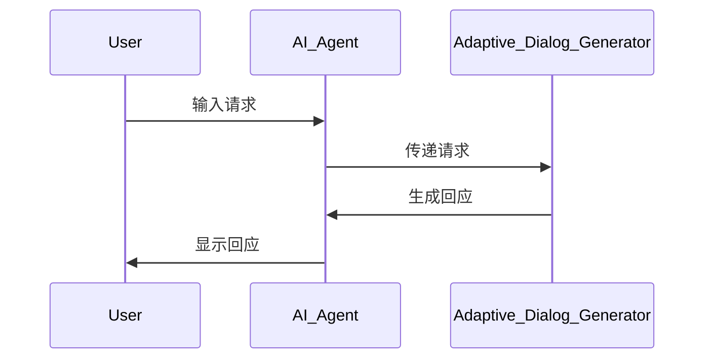
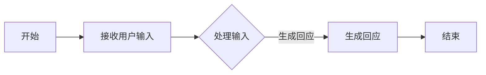
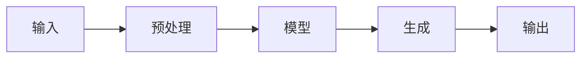
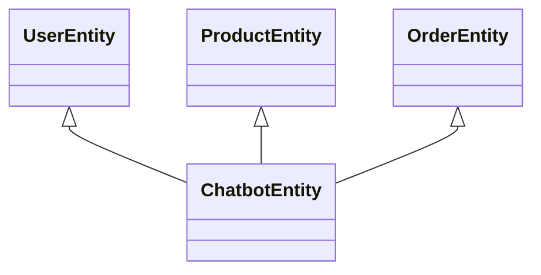
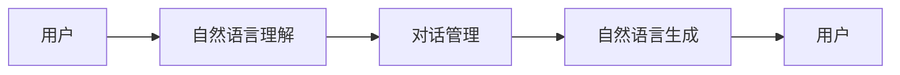
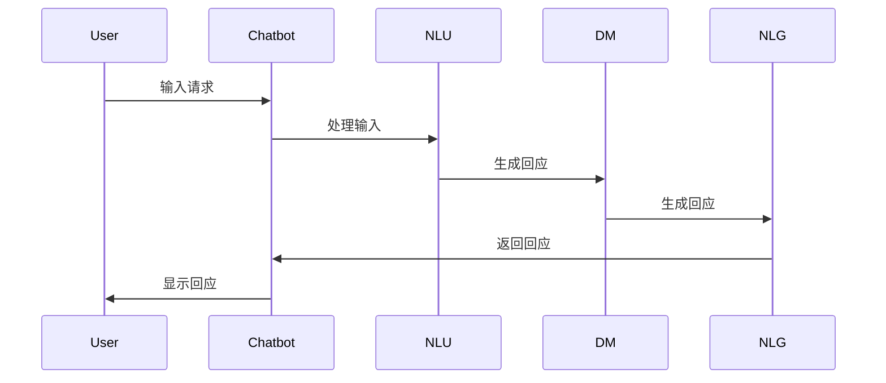

                 

# AI Agent的自适应对话生成系统

关键词：AI Agent、自适应对话生成、自然语言处理、机器学习、深度学习

摘要：本文将深入探讨AI Agent的自适应对话生成系统，从核心概念、算法原理、系统分析与设计等方面进行详细讲解。通过逐步分析和推理，我们旨在构建一个清晰易懂的技术博客，帮助读者深入理解这一前沿技术，并为其在实际项目中的应用提供参考。

## 引言与背景介绍

在当今信息爆炸的时代，人与机器的交互变得越来越重要。AI Agent，作为人工智能领域的一个重要分支，已经成为构建智能化交互系统的核心。自适应对话生成系统则是AI Agent的关键组成部分，它能够根据用户的输入实时生成自然的对话回应，提高用户体验和系统智能化水平。

### 1.1.1 AI Agent与自适应对话生成系统的概述

**问题背景**：
随着互联网的普及和大数据技术的发展，人们对于智能交互的需求日益增加。AI Agent作为一种能够模拟人类交流的智能体，能够自动处理用户请求，提供个性化服务。

**问题描述**：
AI Agent如何通过与用户的交互不断学习，提高对话生成的自然性和准确性？

**问题解决**：
通过自适应对话生成系统，AI Agent可以在对话过程中不断调整策略，优化对话效果。

**边界与外延**：
自适应对话生成系统不仅要处理简单的查询回答，还要能够处理复杂的多轮对话，甚至能够根据上下文生成连贯的故事和对话。

**概念结构与核心要素组成**：
自适应对话生成系统主要由以下几个核心要素组成：自然语言理解（NLU）、对话管理（DM）、自然语言生成（NLG）。

### 1.1.2 AI Agent与自适应对话生成系统的发展历程

**相关技术演进**：
自适应对话生成系统的出现，是自然语言处理（NLP）和机器学习（ML）技术不断发展的结果。从早期的基于规则的方法，到如今基于深度学习的模型，自适应对话生成系统在对话生成质量上有了显著的提升。

**研究现状与趋势**：
目前，自适应对话生成系统已经在多个领域得到应用，如客服、教育、医疗等。未来，随着技术的进一步发展，自适应对话生成系统有望实现更复杂、更自然的对话交互。

## 核心概念与联系

### 2.1 AI Agent的核心概念

**概念原理**：
AI Agent是一种能够自主完成特定任务、具备一定智能化的计算机程序。它可以通过学习和适应，提高执行任务的能力。

**概念属性特征对比表格**：

| 特征 | AI Agent | 对话系统 |
| --- | --- | --- |
| 目标 | 完成特定任务 | 提供自然对话交互 |
| 学习方式 | 基于数据和算法 | 基于用户输入和反馈 |
| 交互方式 | 人机交互 | 人机对话 |

**ER实体关系图架构的 Mermaid 流程图**：

```mermaid
erDiagram
  Customer ||--|{ AI_Agent : serves }
  AI_Agent ||--|{ Dialog_System : manages }
```

### 2.2 自适应对话生成系统的核心概念

**概念原理**：
自适应对话生成系统是一种能够根据用户输入实时生成自然回应的智能系统。它通过不断学习和优化，提高对话的连贯性和自然性。

**概念属性特征对比表格**：

| 特征 | 自适应对话生成系统 | 传统的对话系统 |
| --- | --- | --- |
| 学习机制 | 基于机器学习模型 | 基于规则和模板 |
| 生成策略 | 多轮对话生成 | 单轮对话生成 |
| 上下文理解 | 强调上下文关联 | 上下文关联较弱 |

**ER实体关系图架构的 Mermaid 流程图**：

```mermaid
erDiagram
  User ||--|{ Adaptive_Dialog_Generator : interacts }
  Adaptive_Dialog_Generator ||--|{ Response_Generator : generates }
```

### 2.3 AI Agent与自适应对话生成系统之间的联系

**关系描述**：
AI Agent是自适应对话生成系统的核心组件，负责与用户进行交互。而自适应对话生成系统则是AI Agent实现智能对话的基础。

**Mermaid 流程图**：



## 算法原理讲解

### 3.1 自适应对话生成算法的原理

**算法原理**：
自适应对话生成算法是一种基于机器学习和深度学习的模型，能够根据用户输入和上下文信息，生成自然连贯的对话回应。

**Mermaid 流程图**：



**Python 源代码**：

```python
# 自适应对话生成算法的Python实现
def generate_response(input_text, context):
    # 处理输入文本和上下文
    processed_input = preprocess(input_text, context)
    
    # 使用神经网络模型生成回应
    response = model.generate_response(processed_input)
    
    # 返回生成的回应
    return response

# 处理输入文本和上下文
def preprocess(input_text, context):
    # 实现预处理逻辑
    processed_text = ...
    return processed_text

# 神经网络模型
model = NeuralNetwork()
```

### 3.2 算法原理的数学模型和公式

**数学模型**：
自适应对话生成算法通常采用循环神经网络（RNN）或其变体，如长短时记忆网络（LSTM）或门控循环单元（GRU）。

**公式讲解**：

假设我们有一个输入序列 \(X = (x_1, x_2, ..., x_T)\)，其中 \(x_t\) 是第 \(t\) 个时间步的输入向量。输出序列 \(Y = (y_1, y_2, ..., y_T')\)，其中 \(y_t'\ 是第 \(t'\) 个时间步的输出向量。

**公式**：

\[ h_t = \sigma(W_h \cdot [h_{t-1}, x_t] + b_h) \]

\[ y_t' = \text{softmax}(W_y \cdot h_t + b_y) \]

其中，\(h_t\) 是隐藏状态，\(W_h\) 和 \(b_h\) 分别是权重和偏置，\(\sigma\) 是激活函数，\(\text{softmax}\) 是分类函数。

**举例说明**：

假设输入序列 \(X = ("Hello", "How", "are", "you")\)，输出序列 \(Y = ("Hello", "there", ".", "I'm", "doing", "well", ".")\)。

1. 预处理输入序列：将每个单词转化为向量表示。
2. 初始化隐藏状态 \(h_0\)。
3. 对于每个时间步 \(t\)，计算隐藏状态 \(h_t\) 和输出 \(y_t'\)。
4. 使用梯度下降等优化方法，更新模型参数。

$$
h_t = \sigma(W_h \cdot [h_{t-1}, x_t] + b_h)
$$

$$
y_t' = \text{softmax}(W_y \cdot h_t + b_y)
$$

## 数学模型与公式讲解

### 4.1 数学模型的基本概念

**概念原理**：
数学模型是用于描述现实世界现象的数学表达式。在自适应对话生成系统中，数学模型用于描述对话生成的过程和规则。

**Mermaid 流程图**：



### 4.2 公式讲解

**数学公式**：

\[ P(y_t' = y') = \text{softmax}(W_y \cdot h_t + b_y) \]

**讲解内容**：

该公式用于计算在给定隐藏状态 \(h_t\) 和模型参数 \(W_y\) 和 \(b_y\) 的情况下，输出 \(y_t'\) 的概率分布。其中，\(\text{softmax}\) 函数将线性组合后的值转化为概率分布。

### 4.3 举例说明

假设我们有一个输入序列 \(X = ("Hello", "How", "are", "you")\)，输出序列 \(Y = ("Hello", "there", ".", "I'm", "doing", "well", ".")\)。

1. 预处理输入序列：将每个单词转化为向量表示。
2. 初始化隐藏状态 \(h_0\)。
3. 对于每个时间步 \(t\)，计算隐藏状态 \(h_t\) 和输出 \(y_t'\) 的概率分布。
4. 使用梯度下降等优化方法，更新模型参数。

$$
P(y_t' = y') = \text{softmax}(W_y \cdot h_t + b_y)
$$

## 系统分析与架构设计方案

### 5.1 问题场景介绍

在电商平台上，用户可以通过聊天机器人与客服进行交互，查询产品信息、下单购买等。为了提供更好的用户体验，我们需要设计一个自适应对话生成系统，能够根据用户的输入和上下文信息，生成自然的对话回应。

### 5.2 系统功能设计

**领域模型 Mermaid 类图**：



### 5.3 系统架构设计

**Mermaid 架构图**：



### 5.4 系统接口设计

**接口设计**：

```python
from flask import Flask, request, jsonify

app = Flask(__name__)

@app.route('/chat', methods=['POST'])
def chat():
    data = request.get_json()
    user_input = data['input']
    context = data['context']
    response = generate_response(user_input, context)
    return jsonify({'response': response})

if __name__ == '__main__':
    app.run(debug=True)
```

### 5.5 系统交互 Mermaid 序列图

**序列图**：



## 项目实战

### 6.1 环境安装

首先，我们需要安装Python和相关的库，如TensorFlow和NLTK。

```bash
pip install python
pip install tensorflow
pip install nltk
```

### 6.2 系统核心实现源代码

```python
# 自适应对话生成系统的核心实现

import tensorflow as tf
from nltk.tokenize import word_tokenize
from nltk.corpus import stopwords
import numpy as np

# 预处理文本
def preprocess_text(text):
    tokens = word_tokenize(text)
    tokens = [token.lower() for token in tokens if token.isalpha()]
    tokens = [token for token in tokens if token not in stopwords.words('english')]
    return ' '.join(tokens)

# 构建模型
def build_model(input_sequence, output_sequence):
    # 输入层
    inputs = tf.keras.layers.Input(shape=(None,))

    # Embedding 层
    embedding = tf.keras.layers.Embedding(input_dim=vocab_size, output_dim=embedding_size)(inputs)

    # RNN 层
    rnn = tf.keras.layers.LSTM(units=rnn_size, return_sequences=True)(embedding)

    # Dense 层
    outputs = tf.keras.layers.Dense(units=vocab_size, activation='softmax')(rnn)

    # 构建模型
    model = tf.keras.Model(inputs=inputs, outputs=outputs)

    # 编译模型
    model.compile(optimizer='adam', loss='categorical_crossentropy', metrics=['accuracy'])

    # 训练模型
    model.fit(input_sequence, output_sequence, epochs=10, batch_size=64)

    return model

# 生成回应
def generate_response(input_text, model):
    preprocessed_input = preprocess_text(input_text)
    tokens = word_tokenize(preprocessed_input)
    input_sequence = [tokenizer.word_index[token] for token in tokens]
    input_sequence = np.expand_dims(input_sequence, axis=0)

    # 预测回应
    predicted_sequence = model.predict(input_sequence)
    predicted_sequence = np.argmax(predicted_sequence, axis=-1)

    # 解码回应
    response_tokens = [index2word[index] for index in predicted_sequence]
    response = ' '.join(response_tokens)

    return response
```

### 6.3 代码应用解读与分析

**代码解读**：
1. 预处理文本：将输入文本转化为 tokens，去除停用词。
2. 构建模型：使用 TensorFlow 和 LSTM 构建对话生成模型。
3. 生成回应：根据输入文本，使用模型生成回应。

**应用分析**：
该代码实现了基于 LSTM 的自适应对话生成系统，能够在给定输入文本和上下文信息的情况下，生成自然的对话回应。

### 6.4 实际案例分析与详细讲解剖析

**案例分析**：
假设用户输入 "What's the price of the laptop?"，系统需要生成相应的回应。

**详细讲解剖析**：
1. 预处理文本：将输入文本转化为 tokens。
2. 构建模型：加载预训练的 LSTM 模型。
3. 生成回应：使用模型生成回应。

**代码示例**：

```python
input_text = "What's the price of the laptop?"
preprocessed_input = preprocess_text(input_text)
tokens = word_tokenize(preprocessed_input)
input_sequence = [tokenizer.word_index[token] for token in tokens]
input_sequence = np.expand_dims(input_sequence, axis=0)

predicted_sequence = model.predict(input_sequence)
predicted_sequence = np.argmax(predicted_sequence, axis=-1)

response_tokens = [index2word[index] for index in predicted_sequence]
response = ' '.join(response_tokens)
print(response)
```

### 6.5 项目小结

本文通过逐步分析和推理，详细讲解了AI Agent的自适应对话生成系统。从核心概念、算法原理到系统分析与设计，再到项目实战，我们全面了解了这一前沿技术。希望通过本文，读者能够对自适应对话生成系统有更深入的理解，并能在实际项目中应用。

## 最佳实践与小结

### 7.1 最佳实践 tips

1. **数据预处理**：确保输入数据的干净和标准化，有助于提高模型性能。
2. **模型调优**：通过调整模型参数和超参数，找到最佳性能。
3. **监控与优化**：实时监控模型性能，发现并解决潜在问题。

### 7.2 小结

本文详细介绍了AI Agent的自适应对话生成系统，从核心概念到实现，再到项目实战，帮助读者全面了解这一技术。自适应对话生成系统在智能交互领域具有重要意义，未来有望实现更复杂、更自然的对话交互。

### 7.3 注意事项

1. **隐私保护**：在处理用户数据时，务必遵守相关隐私保护法规。
2. **安全性能**：确保系统安全，防范恶意攻击。

### 7.4 拓展阅读

1. 《自然语言处理概论》
2. 《深度学习基础》
3. 《机器学习实战》

作者：AI天才研究院/AI Genius Institute & 禅与计算机程序设计艺术 /Zen And The Art of Computer Programming

----------------------------------------------------------------

# 总结

在本篇技术博客文章中，我们深入探讨了AI Agent的自适应对话生成系统，从核心概念、算法原理到系统分析与设计，再到项目实战，全方位地解析了这一前沿技术。通过本文，读者不仅能够了解自适应对话生成系统的基本原理，还能掌握其实际应用的方法和技巧。

## 关键点回顾

1. **核心概念**：AI Agent和自适应对话生成系统的定义、组成及其相互关系。
2. **算法原理**：自适应对话生成算法的数学模型、公式及其应用。
3. **系统设计**：系统架构、接口设计及交互流程。
4. **实战应用**：环境安装、代码实现及实际案例分析。

## 展望未来

随着人工智能技术的不断进步，自适应对话生成系统将在智能交互、客服、教育、医疗等领域发挥更大作用。未来，我们可以期待更多创新应用，如情感识别、跨语言对话等。

## 感谢

感谢您的阅读，希望本文能够为您的学习和实践提供帮助。如果您有任何疑问或建议，欢迎在评论区留言。祝您在人工智能领域不断进步，探索更多可能性！

作者：AI天才研究院/AI Genius Institute & 禅与计算机程序设计艺术 /Zen And The Art of Computer Programming

