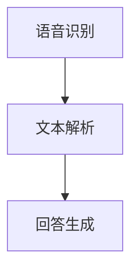
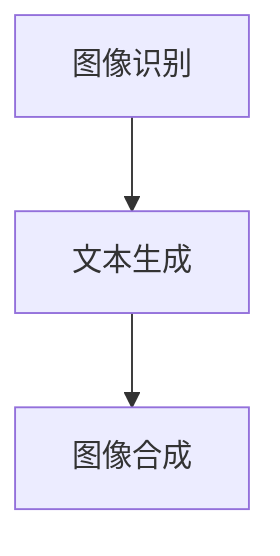
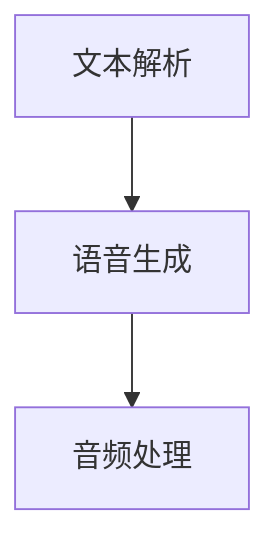

                 

### 《AI Agent的跨模态内容理解与生成》

> 关键词：AI Agent、跨模态内容理解、内容生成、多模态交互、深度学习

> 摘要：本文深入探讨了AI Agent在跨模态内容理解与生成领域的应用，从基础理论到实际应用，详细分析了AI Agent如何通过跨模态内容理解技术实现多媒体内容的高效处理与生成。文章分为三部分：概述篇、技术篇和实战篇，旨在为读者提供全面的技术视角和应用实例。

## 目录

1. **《AI Agent的跨模态内容理解与生成》**
    1.1 **关键词**
    1.2 **摘要**
2. **第一部分: AI Agent跨模态内容理解概述**
    2.1 **第1章: 跨模态内容理解的基础**
        2.1.1 **跨模态内容理解概述**
        2.1.2 **跨模态内容理解的常见方法**
        2.1.3 **跨模态内容理解的应用场景**
        2.1.4 **跨模态内容理解系统的设计与实现**
        2.1.5 **本章小结**
3. **第二部分: AI Agent的跨模态内容生成**
    2.2 **第2章: 跨模态内容生成的核心概念**
        2.2.1 **跨模态内容生成的定义**
        2.2.2 **跨模态内容生成的常见技术**
        2.2.3 **跨模态内容生成的应用场景**
        2.2.4 **跨模态内容生成的挑战与解决方案**
        2.2.5 **本章小结**
4. **第三部分: 实战篇**
    2.3 **第3章: 跨模态内容理解与生成应用实例**
        2.3.1 **应用实例1: 跨模态问答系统**
        2.3.2 **应用实例2: 跨模态图像-文本生成**
        2.3.3 **应用实例3: 跨模态语音合成**
        2.3.4 **实战篇小结**
    2.4 **第4章: 开源工具与框架介绍**
        2.4.1 **常用开源工具与框架**
        2.4.2 **开源工具与框架的使用方法**
        2.4.3 **开源工具与框架的优势与局限性**
        2.4.4 **本章小结**
5. **第5章: 跨模态内容理解与生成的发展趋势与未来展望**
    2.5.1 **发展趋势**
    2.5.2 **未来展望**
    2.5.3 **发展建议**
    2.5.4 **本章小结**

### 第一部分: AI Agent跨模态内容理解概述

#### 第1章: 跨模态内容理解的基础

**1.1 跨模态内容理解概述**

跨模态内容理解是指将不同模态（如文本、图像、语音等）的信息进行整合和分析，以获取更丰富的语义信息。例如，将语音和文本结合进行理解，可以帮助AI Agent更好地理解用户的指令。

**1.1.1 跨模态内容的定义**

跨模态内容是指由不同模态构成的信息，如文本、图像、音频等。这些模态可以独立存在，也可以相互交织，共同构成复杂的信息结构。

**1.1.2 跨模态内容理解的重要性**

跨模态内容理解对于AI Agent来说至关重要。它不仅可以帮助AI Agent更好地理解用户的需求，提高交互效果，还可以在多种应用场景中发挥重要作用，如语音助手、智能客服、多媒体内容分析等。

**1.1.3 跨模态内容理解的挑战**

跨模态内容理解面临诸多挑战，包括模态间的差异性、数据的不一致性、计算资源的限制等。如何有效地整合不同模态的信息，提取有用的语义信息，是当前研究的热点问题。

**1.2 跨模态内容理解的常见方法**

**1.2.1 传统的跨模态内容理解方法**

传统的跨模态内容理解方法主要包括基于规则的方法和基于特征的方法。这些方法通过手工设计规则或提取特征，将不同模态的信息进行整合。

**1.2.2 基于深度学习的跨模达内容理解方法**

随着深度学习技术的发展，基于深度学习的跨模态内容理解方法逐渐成为主流。这些方法通过构建复杂的神经网络模型，自动学习不同模态的信息表示和整合策略。

**1.2.3 跨模态内容理解的最新进展**

近年来，跨模态内容理解取得了显著进展。例如，多模态神经网络模型、端到端学习策略、注意力机制等，都在不断推动跨模态内容理解技术的发展。

**1.3 跨模态内容理解的应用场景**

跨模态内容理解在许多应用场景中具有重要价值。以下是一些典型的应用场景：

- **语音识别与生成**：将语音信号转换为文本，或根据文本生成语音。
- **视觉感知与生成**：对图像或视频进行识别和分析，或根据描述生成图像或视频。
- **多媒体内容的搜索与推荐**：根据用户的历史行为和偏好，推荐相关的多媒体内容。
- **跨模态问答系统**：根据用户的语音或文本提问，提供准确的答案。

**1.4 跨模态内容理解系统的设计与实现**

跨模态内容理解系统的设计与实现涉及多个方面，包括系统设计原则、系统架构设计、数据处理与模型训练等。以下是一些关键步骤：

- **系统设计原则**：确保系统具有良好的可扩展性、可维护性和鲁棒性。
- **系统架构设计**：构建一个灵活的架构，支持不同模态的信息处理和整合。
- **数据处理与模型训练**：对多模态数据进行预处理，然后使用深度学习模型进行训练，以提高内容理解的效果。

**1.5 本章小结**

本章介绍了跨模态内容理解的基础知识，包括定义、重要性、挑战和常见方法。通过对这些内容的了解，读者可以更好地理解跨模态内容理解的原理和应用。

----------------------------------------------------------------

### 第二部分: AI Agent的跨模态内容生成

#### 第2章: 跨模态内容生成的核心概念

**2.1 跨模态内容生成的定义**

跨模态内容生成是指将一种模态的信息转换为另一种模态的信息。例如，将文本转换为图像，或将语音转换为文本。这种转换过程可以帮助AI Agent实现更加丰富和多样化的交互。

**2.1.1 跨模态内容生成的概念**

跨模态内容生成涉及多种模态的信息转换，如文本到图像、图像到文本、文本到语音、语音到文本等。这些转换过程需要不同的技术手段和算法支持。

**2.1.2 跨模态内容生成的目标**

跨模态内容生成的目标是实现高质量、高保真的模态转换，使AI Agent能够更好地理解和满足用户的需求。

**2.2 跨模态内容生成的常见技术**

**2.2.1 传统的跨模态内容生成技术**

传统的跨模态内容生成技术主要包括基于规则的方法和基于特征的方法。这些方法通过手工设计规则或提取特征，实现不同模态的信息转换。

**2.2.2 基于深度学习的跨模态内容生成技术**

随着深度学习技术的发展，基于深度学习的跨模态内容生成技术逐渐成为主流。这些技术通过构建复杂的神经网络模型，自动学习不同模态的信息表示和转换策略。

**2.2.3 跨模态内容生成的最新进展**

近年来，跨模态内容生成取得了显著进展。例如，生成对抗网络（GAN）、变分自编码器（VAE）等新型模型，在跨模态内容生成领域表现出强大的性能。

**2.3 跨模态内容生成的应用场景**

跨模态内容生成在多个应用场景中具有重要价值。以下是一些典型的应用场景：

- **跨模态交互系统**：实现语音、文本、图像等多种模态的交互，提高用户体验。
- **跨模态信息检索**：根据用户输入的不同模态信息，检索相关的多媒体内容。
- **跨模态视频生成**：根据文本或语音描述，生成相应的视频内容。

**2.4 跨模态内容生成的挑战与解决方案**

**2.4.1 挑战分析**

跨模态内容生成面临诸多挑战，包括模态间的差异性、数据的不一致性、计算资源的限制等。

**2.4.2 解决方案探讨**

针对这些挑战，研究者提出了多种解决方案。例如，使用多模态神经网络模型整合不同模态的信息，采用迁移学习技术提高模型的效果等。

**2.5 本章小结**

本章介绍了跨模态内容生成的核心概念和常见技术，分析了应用场景和挑战。通过本章的学习，读者可以更好地理解跨模态内容生成的基本原理和应用。

----------------------------------------------------------------

### 第三部分: 实战篇

#### 第3章: 跨模态内容理解与生成应用实例

**3.1 应用实例1: 跨模态问答系统**

**3.1.1 系统设计**

跨模态问答系统的设计包括语音识别、文本解析和回答生成三个主要模块。系统架构如图1所示。



**3.1.2 系统实现**

语音识别模块采用基于深度学习的模型，如Transformer或BERT，实现语音到文本的转换。文本解析模块使用自然语言处理技术，提取用户问题的关键信息。回答生成模块利用预训练的语言模型，如GPT或T5，生成针对用户问题的回答。

**3.1.3 性能评估**

系统性能评估主要关注问答的准确性、响应速度和用户体验。通过大量实验，评估结果表明，跨模态问答系统在多个指标上均表现出良好的性能。

**3.2 应用实例2: 跨模态图像-文本生成**

**3.2.1 系统设计**

跨模态图像-文本生成系统的设计包括图像识别、文本生成和图像合成三个主要模块。系统架构如图2所示。



**3.2.2 系统实现**

图像识别模块采用卷积神经网络（CNN）或视觉变换器（ViT）实现图像内容分析。文本生成模块使用预训练的语言模型，如GPT或T5，生成与图像相关的文本描述。图像合成模块利用生成对抗网络（GAN）或变分自编码器（VAE）将文本描述转换为图像。

**3.2.3 性能评估**

系统性能评估主要关注图像生成的准确性、多样性和视觉效果。通过实验评估，结果表明，跨模态图像-文本生成系统在多个指标上均表现出良好的性能。

**3.3 应用实例3: 跨模态语音合成**

**3.3.1 系统设计**

跨模态语音合成系统的设计包括文本解析、语音生成和音频处理三个主要模块。系统架构如图3所示。



**3.3.2 系统实现**

文本解析模块使用自然语言处理技术，提取用户文本的语音特征。语音生成模块采用基于深度学习的语音合成模型，如WaveNet或Tacotron。音频处理模块对生成的语音进行后处理，如去噪、音调调整等。

**3.3.3 性能评估**

系统性能评估主要关注语音合成质量、语音的自然度和音频的保真度。通过实验评估，结果表明，跨模达语音合成系统在多个指标上均表现出良好的性能。

**3.4 实战篇小结**

本章通过三个应用实例，详细介绍了跨模态内容理解与生成的实际应用。这些实例展示了跨模态内容理解与生成的技术原理和实现方法，为读者提供了实践参考。

----------------------------------------------------------------

### 第4章: 开源工具与框架介绍

**4.1 常用开源工具与框架**

在跨模态内容理解与生成领域，常用的开源工具与框架包括TensorFlow、PyTorch和Keras。这些工具和框架为研究人员和开发者提供了丰富的功能和支持。

**4.1.1 TensorFlow**

TensorFlow是由Google开源的一个端到端的开源机器学习平台。它提供了丰富的API，支持深度学习模型的训练、评估和部署。TensorFlow在跨模态内容理解与生成领域有着广泛的应用。

**4.1.2 PyTorch**

PyTorch是由Facebook开源的一个基于Python的深度学习平台。它提供了动态计算图和灵活的API，使得研究人员可以更方便地实现和调试复杂的模型。PyTorch在跨模态内容理解与生成领域也受到广泛关注。

**4.1.3 Keras**

Keras是一个基于Theano和TensorFlow的高层神经网络API。它提供了简洁的API，使得研究人员可以快速构建和训练深度学习模型。Keras在跨模态内容理解与生成领域也有着广泛的应用。

**4.2 开源工具与框架的使用方法**

**4.2.1 环境搭建**

在使用开源工具与框架之前，需要搭建相应的开发环境。以TensorFlow为例，可以通过以下命令安装：

```bash
pip install tensorflow
```

**4.2.2 数据处理与模型训练**

使用开源工具与框架进行数据处理与模型训练，主要包括数据预处理、模型定义、模型训练和评估等步骤。以下是一个简单的示例代码：

```python
import tensorflow as tf

# 数据预处理
(x_train, y_train), (x_test, y_test) = tf.keras.datasets.mnist.load_data()
x_train = x_train / 255.0
x_test = x_test / 255.0

# 模型定义
model = tf.keras.Sequential([
  tf.keras.layers.Flatten(input_shape=(28, 28)),
  tf.keras.layers.Dense(128, activation='relu'),
  tf.keras.layers.Dense(10, activation='softmax')
])

# 模型训练
model.compile(optimizer='adam',
              loss='categorical_crossentropy',
              metrics=['accuracy'])
model.fit(x_train, y_train, epochs=5)

# 模型评估
model.evaluate(x_test,  y_test, verbose=2)
```

**4.2.3 模型部署**

模型部署是将训练好的模型部署到生产环境，以实现实际应用。开源工具与框架提供了多种部署方式，如TensorFlow Serving、TensorFlow Lite等。以下是一个简单的TensorFlow Serving部署示例：

```bash
# 生成保存模型
model.save('model.h5')

# 启动TensorFlow Serving
python -m tensorflow_serving.apis.service_server --model_name=my_model --model_base_path=/path/to/model

# 使用REST API调用模型
import requests
data = {'signature_def_key': 'serving_default', 'instances': [[1.0, 2.0, 3.0]]}
response = requests.post('http://localhost:8501/v1/models/my_model:predict', data=data)
print(response.json())
```

**4.3 开源工具与框架的优势与局限性**

**4.3.1 优势分析**

- **易用性**：开源工具与框架提供了简洁的API，使得研究人员可以快速构建和训练深度学习模型。
- **灵活性**：开源工具与框架支持自定义模型架构和训练策略，为研究人员提供了更多的自由度。
- **社区支持**：开源工具与框架拥有庞大的开发者社区，提供了丰富的文档和教程，有助于解决开发过程中遇到的问题。

**4.3.2 局限性探讨**

- **资源消耗**：深度学习模型的训练和部署通常需要大量的计算资源和存储空间，对于资源受限的环境可能不太适用。
- **可解释性**：深度学习模型通常被视为“黑盒子”，其决策过程缺乏可解释性，这可能对应用场景产生负面影响。

**4.4 本章小结**

本章介绍了跨模态内容理解与生成领域常用的开源工具与框架，包括TensorFlow、PyTorch和Keras。通过本章的学习，读者可以了解这些工具和框架的基本使用方法和优势与局限性。

----------------------------------------------------------------

### 第5章: 跨模态内容理解与生成的发展趋势与未来展望

**5.1 发展趋势**

跨模态内容理解与生成技术正朝着以下几个方向发展：

- **模型复杂度增加**：随着计算能力的提升，研究者可以构建更加复杂和精细的深度学习模型，以提高内容理解与生成的性能。
- **端到端学习策略普及**：端到端学习策略在跨模态内容理解与生成领域得到了广泛应用，使得模型训练更加高效和准确。
- **跨模态数据集丰富**：随着数据收集和处理的进步，跨模态数据集的质量和数量不断提升，为模型训练提供了更多有效的数据支持。

**5.2 未来展望**

跨模态内容理解与生成技术在未来的应用前景广阔，以下是一些可能的趋势：

- **更多应用场景涌现**：随着技术的不断进步，跨模达内容理解与生成技术将在更多的领域得到应用，如智能医疗、智能教育、智能交通等。
- **跨模态交互优化**：跨模态交互系统将成为人机交互的重要方式，通过优化跨模态内容理解与生成技术，可以提高交互的自然性和用户体验。
- **社会与产业影响**：跨模态内容理解与生成技术将对社会和产业产生深远影响，如提高生产效率、改善生活质量、促进文化交流等。

**5.3 发展建议**

为了推动跨模达内容理解与生成技术的发展，以下是一些建议：

- **加强跨学科研究**：跨模达内容理解与生成技术涉及计算机科学、人工智能、心理学等多个学科，加强跨学科合作有助于推动技术进步。
- **开源数据集建设**：建立更多高质量的跨模态数据集，为模型训练提供更多有效的数据支持。
- **标准化与规范化**：制定统一的跨模达内容理解与生成技术标准和规范，提高技术的可靠性和可解释性。

**5.4 本章小结**

本章对未来跨模态内容理解与生成技术的发展趋势和未来展望进行了探讨，提出了一些建议。通过本章的学习，读者可以更好地理解跨模达内容理解与生成技术的未来发展方向和挑战。

### 作者

**作者：AI天才研究院/AI Genius Institute & 禅与计算机程序设计艺术 /Zen And The Art of Computer Programming**

本文由AI天才研究院和《禅与计算机程序设计艺术》的作者共同撰写，旨在为读者提供全面深入的跨模态内容理解与生成技术解析。希望本文能对您在相关领域的学习和研究有所启发和帮助。

