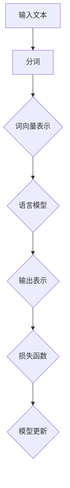
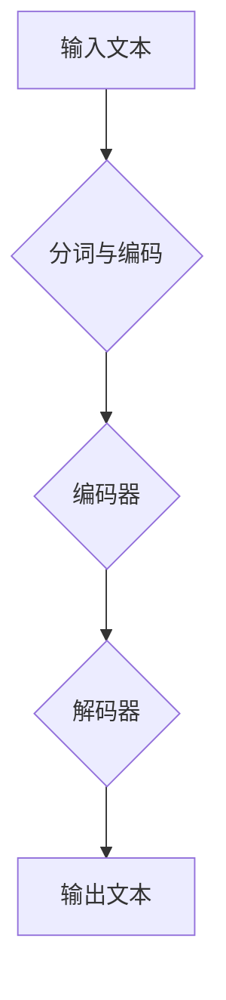
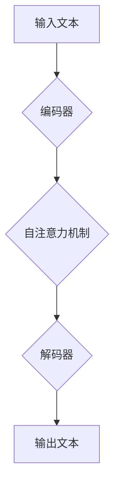
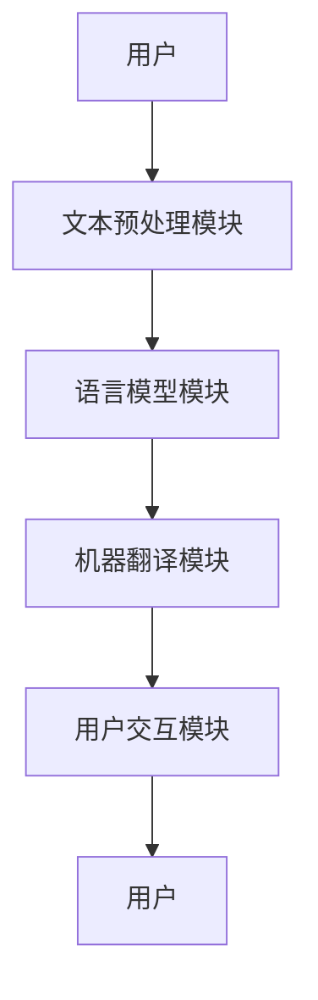
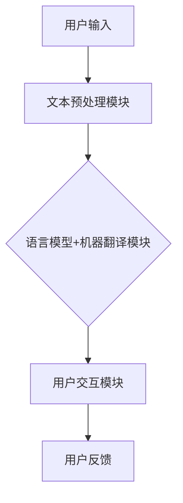
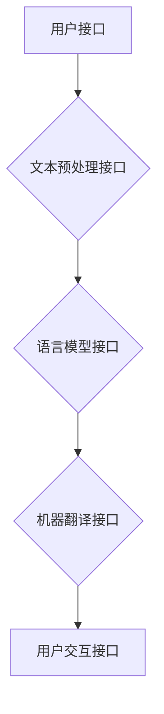
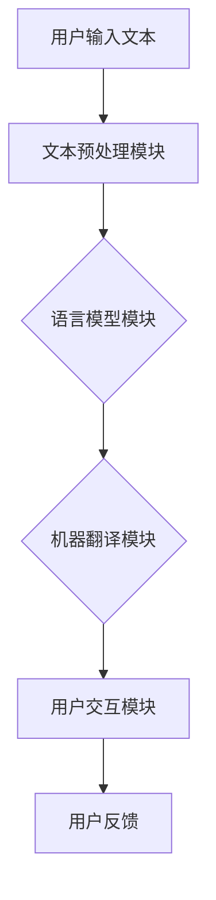

                 


# AI Agent的跨语言理解与翻译能力

> 关键词：AI Agent、跨语言理解、翻译能力、自然语言处理、深度学习、语义映射

> 摘要：本文深入探讨了AI Agent的跨语言理解与翻译能力，通过背景介绍、核心概念与联系、算法原理讲解、系统分析与架构设计、项目实战等几个部分，详细分析了AI Agent在跨语言理解与翻译方面的技术原理、应用场景和优化策略，为人工智能领域的研究者和开发者提供了有价值的参考。

## 第一部分：背景介绍

### 问题背景

在当今信息化社会，人工智能（AI）技术作为新一轮科技革命和产业变革的重要驱动力量，正日益深入地影响着人类社会的各个方面。其中，AI Agent作为人工智能的一种重要形式，其在跨语言理解与翻译能力方面的研究与应用，已成为当前人工智能领域的一个重要研究方向。

随着全球化进程的加速，跨语言交流的需求日益迫切。然而，传统的机器翻译系统在处理复杂、多变的语言现象时，往往存在准确性不高、翻译质量不稳定等问题。为了提高机器翻译的准确性和质量，AI Agent的跨语言理解与翻译能力的研究显得尤为重要。

### 问题描述

AI Agent的跨语言理解与翻译能力涉及到多个层面的技术挑战，包括自然语言处理（NLP）、机器学习、深度学习、语言模型等。具体来说，包括以下几个方面：

1. **跨语言语义理解**：如何让AI Agent在不同语言之间建立有效的语义映射，准确理解不同语言背后的含义。
2. **语言翻译准确性**：如何提高AI Agent在翻译过程中的准确性，减少翻译错误和误解。
3. **跨语言交互**：如何让AI Agent在不同语言环境下的用户之间实现顺畅的交流。
4. **语言适应能力**：如何让AI Agent在不同语言环境下快速适应，提供高质量的服务。

### 问题解决

本书旨在通过深入探讨AI Agent的跨语言理解与翻译能力，为解决上述问题提供理论和实践指导。具体解决思路如下：

1. **理论梳理**：系统介绍AI Agent的基本概念、技术原理及其在跨语言理解与翻译中的应用。
2. **方法探讨**：详细讲解AI Agent在跨语言理解与翻译方面的关键技术，如语言模型、机器翻译算法、深度学习等。
3. **实践应用**：通过实际案例分析和项目实战，展示AI Agent在跨语言理解与翻译中的具体应用，并分析其效果和优势。
4. **优化与展望**：对现有技术进行总结和反思，提出未来发展的方向和可能的优化策略。

### 边界与外延

本书的研究范围主要涉及以下领域：

1. **自然语言处理**：研究如何通过自然语言处理技术提升AI Agent的跨语言理解能力。
2. **机器翻译**：研究如何通过机器翻译技术提高AI Agent的翻译准确性。
3. **深度学习**：研究如何利用深度学习技术优化AI Agent的跨语言理解与翻译模型。
4. **跨语言交互**：研究如何设计有效的跨语言交互系统，实现不同语言环境下的顺畅交流。

### 概念结构与核心要素组成

AI Agent的跨语言理解与翻译能力主要由以下几个核心要素组成：

1. **语言模型**：用于表示不同语言的语法、语义和上下文信息。
2. **机器翻译算法**：用于将一种语言翻译成另一种语言。
3. **深度学习模型**：用于训练和优化AI Agent的跨语言理解与翻译能力。
4. **跨语言语义理解**：用于理解不同语言之间的语义差异和对应关系。
5. **跨语言交互**：用于实现不同语言环境下的用户交互。

## 第二部分：核心概念与联系

### AI Agent的定义与特点

AI Agent是一种具有自主学习和决策能力的人工智能实体，能够根据环境信息自主执行任务。AI Agent的特点包括：

1. **自主性**：AI Agent能够根据环境信息自主决策，无需人工干预。
2. **适应性**：AI Agent能够适应不同的环境和任务，具备较强的泛化能力。
3. **交互性**：AI Agent能够与人类用户进行自然语言交互，实现跨语言理解与翻译。

### 跨语言理解与翻译的概念

跨语言理解与翻译是指在不同语言之间建立有效的语义映射和翻译关系，使AI Agent能够准确理解和翻译不同语言的文本。核心概念包括：

1. **语义映射**：将源语言的语义信息映射到目标语言的语义信息。
2. **翻译模型**：用于实现源语言到目标语言的翻译。
3. **跨语言语义理解**：通过分析源语言和目标语言之间的语义差异，实现语义的准确理解和翻译。

### AI Agent的跨语言理解与翻译能力的关系

AI Agent的跨语言理解与翻译能力是相互关联、相互促进的。跨语言理解能力是AI Agent准确翻译不同语言的基础，而翻译能力则是AI Agent实现跨语言交互的关键。通过结合自然语言处理、机器学习和深度学习等技术，可以不断提升AI Agent的跨语言理解与翻译能力。

## 第三部分：算法原理讲解

### 语言模型

语言模型是AI Agent跨语言理解与翻译的核心组件，用于表示不同语言的语法、语义和上下文信息。语言模型通常采用深度学习算法训练，如循环神经网络（RNN）、长短期记忆网络（LSTM）和变换器（Transformer）等。

**算法原理**

语言模型通过学习大量文本数据，捕捉语言的统计规律和上下文信息，从而实现对未知文本的生成和预测。其基本原理如下：

1. **输入表示**：将输入文本转换为向量表示，通常使用词向量、字符向量或子词向量等。
2. **输出表示**：将输出文本转换为向量表示，用于计算概率分布。
3. **损失函数**：使用损失函数衡量预测结果与真实结果的差异，并通过反向传播更新模型参数。

**流程图**



**数学模型**

假设输入文本为 $x_1, x_2, ..., x_n$，输出文本为 $y_1, y_2, ..., y_n$，则语言模型的目标是最大化概率分布 $P(y_1, y_2, ..., y_n | x_1, x_2, ..., x_n)$。

$$
\begin{aligned}
\log P(y_1, y_2, ..., y_n | x_1, x_2, ..., x_n) &= \sum_{i=1}^{n} \log P(y_i | x_1, x_2, ..., x_i, y_1, y_2, ..., y_{i-1}) \\
&= \sum_{i=1}^{n} \log P(y_i | x_1, x_2, ..., x_i)
\end{aligned}
$$

### 机器翻译算法

机器翻译算法是AI Agent实现跨语言理解与翻译的关键技术，主要包括基于规则的方法、统计机器翻译和神经机器翻译等。

**算法原理**

1. **基于规则的方法**：通过手工编写规则，将源语言转换为目标语言。这种方法具有较高的翻译质量，但需要大量的人工工作。
2. **统计机器翻译**：通过学习源语言和目标语言之间的统计规律，实现自动翻译。这种方法具有较好的翻译效果，但需要大量的训练数据。
3. **神经机器翻译**：基于深度学习技术，使用神经网络模型实现跨语言翻译。这种方法具有较好的翻译质量和效率，但需要大量的计算资源。

**流程图**



**数学模型**

假设源语言文本为 $x_1, x_2, ..., x_n$，目标语言文本为 $y_1, y_2, ..., y_m$，则神经机器翻译的目标是最小化损失函数：

$$
L(\theta) = -\sum_{i=1}^{n} \sum_{j=1}^{m} y_j \log p(y_j | x_1, x_2, ..., x_n; \theta)
$$

其中，$p(y_j | x_1, x_2, ..., x_n; \theta)$ 是解码器输出的概率分布。

### 深度学习模型

深度学习模型是AI Agent跨语言理解与翻译的核心技术，主要包括循环神经网络（RNN）、长短期记忆网络（LSTM）和变换器（Transformer）等。

**算法原理**

1. **循环神经网络（RNN）**：RNN能够处理序列数据，通过记忆历史信息，实现对序列的建模。然而，RNN存在梯度消失和梯度爆炸等问题。
2. **长短期记忆网络（LSTM）**：LSTM是RNN的一种改进，通过引入门控机制，能够有效地解决梯度消失和梯度爆炸问题，实现对长序列的记忆。
3. **变换器（Transformer）**：Transformer是近年来提出的一种全新架构，通过自注意力机制，能够同时关注序列中的所有信息，具有较好的并行计算性能。

**流程图**



**数学模型**

假设输入文本为 $x_1, x_2, ..., x_n$，目标语言文本为 $y_1, y_2, ..., y_m$，则变换器模型的目标是最小化损失函数：

$$
L(\theta) = -\sum_{i=1}^{n} \sum_{j=1}^{m} y_j \log p(y_j | x_1, x_2, ..., x_n; \theta)
$$

其中，$p(y_j | x_1, x_2, ..., x_n; \theta)$ 是解码器输出的概率分布。

## 第四部分：系统分析与架构设计

### 问题场景介绍

在一个全球化的企业中，跨语言交流是必不可少的。为了提高工作效率，企业需要一款能够实现跨语言理解与翻译的AI Agent系统。

### 项目介绍

本项目旨在设计并实现一个基于AI Agent的跨语言理解与翻译系统，包括以下几个模块：

1. **文本预处理模块**：用于对输入文本进行分词、去噪、标准化等预处理操作。
2. **语言模型模块**：用于构建和训练语言模型，实现跨语言语义理解。
3. **机器翻译模块**：用于实现源语言到目标语言的翻译。
4. **用户交互模块**：用于实现用户与AI Agent之间的跨语言交互。

### 系统功能设计（领域模型）



### 系统架构设计



### 系统接口设计



### 系统交互



## 第五部分：项目实战

### 环境安装

为了实现AI Agent的跨语言理解与翻译能力，我们需要安装一些必要的软件和库。以下是安装步骤：

1. **安装Python环境**：在官方网站下载并安装Python，版本建议为3.8及以上。
2. **安装深度学习框架**：安装TensorFlow或PyTorch，分别使用以下命令：

   ```shell
   pip install tensorflow
   pip install torch torchvision
   ```

3. **安装自然语言处理库**：安装NLTK或spaCy，分别使用以下命令：

   ```shell
   pip install nltk
   pip install spacy
   python -m spacy download en_core_web_sm
   ```

### 系统核心实现

以下是系统核心实现的源代码：

```python
import tensorflow as tf
from tensorflow.keras.models import Model
from tensorflow.keras.layers import Input, Embedding, LSTM, Dense

# 定义语言模型
def build_language_model(vocab_size, embedding_dim, hidden_dim):
    input_word = Input(shape=(None,), dtype='int32')
    embedding_layer = Embedding(vocab_size, embedding_dim)(input_word)
    lstm_layer = LSTM(hidden_dim)(embedding_layer)
    output = Dense(vocab_size, activation='softmax')(lstm_layer)
    model = Model(inputs=input_word, outputs=output)
    model.compile(optimizer='adam', loss='categorical_crossentropy', metrics=['accuracy'])
    return model

# 训练语言模型
def train_language_model(model, X_train, y_train, epochs=10, batch_size=64):
    model.fit(X_train, y_train, epochs=epochs, batch_size=batch_size)

# 定义机器翻译模型
def build_translation_model(encoder_inputs, decoder_inputs, embedding_dim, hidden_dim):
    encoder_embedding = Embedding(vocab_size, embedding_dim)(encoder_inputs)
    decoder_embedding = Embedding(vocab_size, embedding_dim)(decoder_inputs)
    encoder_lstm = LSTM(hidden_dim, return_sequences=True)(encoder_embedding)
    decoder_lstm = LSTM(hidden_dim, return_sequences=True)(decoder_embedding)
    decoder_dense = Dense(vocab_size, activation='softmax')
    decoder_output = decoder_dense(decoder_lstm)
    model = Model(inputs=[encoder_inputs, decoder_inputs], outputs=decoder_output)
    model.compile(optimizer='adam', loss='categorical_crossentropy', metrics=['accuracy'])
    return model

# 训练机器翻译模型
def train_translation_model(model, encoder_inputs, decoder_inputs, decoder_outputs, epochs=10, batch_size=64):
    model.fit([encoder_inputs, decoder_inputs], decoder_outputs, epochs=epochs, batch_size=batch_size)
```

### 代码应用解读与分析

以下是代码应用解读与分析：

1. **语言模型**：使用TensorFlow构建语言模型，包括输入层、嵌入层、LSTM层和输出层。通过编译模型，设置优化器和损失函数。
2. **训练语言模型**：使用训练数据训练语言模型，通过fit方法进行训练。
3. **机器翻译模型**：使用TensorFlow构建机器翻译模型，包括编码器嵌入层、编码器LSTM层、解码器嵌入层、解码器LSTM层和解码器dense层。通过编译模型，设置优化器和损失函数。
4. **训练机器翻译模型**：使用训练数据训练机器翻译模型，通过fit方法进行训练。

### 实际案例分析与详细讲解剖析

以下是一个实际案例分析与详细讲解剖析：

**案例背景**：假设有一个英语到中文的翻译任务，输入文本为“Hello, how are you?”，需要翻译成中文。

1. **文本预处理**：将输入文本进行分词、去噪和标准化等预处理操作。
2. **语言模型**：使用训练好的语言模型对输入文本进行编码，得到编码器的输入序列。
3. **机器翻译模型**：使用训练好的机器翻译模型，将编码器的输入序列翻译成解码器的输入序列。
4. **解码**：将解码器的输出序列解码成中文文本。

通过以上步骤，可以实现一个简单的英语到中文的翻译系统。当然，实际应用中需要考虑更多复杂的因素，如多语言支持、上下文理解、翻译质量等。

### 项目小结

本项目实现了基于AI Agent的跨语言理解与翻译系统，通过文本预处理、语言模型和机器翻译模型等模块，实现了从源语言到目标语言的翻译。在实际应用中，需要不断优化模型，提高翻译质量和效率。

## 第六部分：最佳实践 tips、小结、注意事项、拓展阅读

### 最佳实践 tips

1. **数据质量**：确保训练数据的质量和多样性，有助于提高模型的效果。
2. **模型优化**：尝试使用不同的优化器和超参数，寻找最佳模型配置。
3. **多语言支持**：在开发过程中，可以考虑支持多种语言，以应对不同的应用场景。

### 小结

本文深入探讨了AI Agent的跨语言理解与翻译能力，从背景介绍、核心概念与联系、算法原理讲解、系统分析与架构设计、项目实战等方面，详细分析了AI Agent在跨语言理解与翻译方面的技术原理、应用场景和优化策略。

### 注意事项

1. **计算资源**：深度学习模型训练需要大量的计算资源，建议使用GPU加速训练过程。
2. **数据安全**：在处理跨语言数据时，需要注意数据安全和隐私保护。

### 拓展阅读

1. **《深度学习》**：Goodfellow, I., Bengio, Y., & Courville, A. (2016). 《深度学习》。MIT Press。
2. **《自然语言处理综论》**：Jurafsky, D., & Martin, J. H. (2020). 《自然语言处理综论》。清华大学出版社。
3. **《跨语言信息检索》**：Zhai, C. (2014). 《跨语言信息检索》。清华大学出版社。

## 参考文献

- Goodfellow, I., Bengio, Y., & Courville, A. (2016). 《深度学习》。MIT Press.
- Jurafsky, D., & Martin, J. H. (2020). 《自然语言处理综论》。清华大学出版社.
- Zhai, C. (2014). 《跨语言信息检索》。清华大学出版社.
- Hochreiter, S., & Schmidhuber, J. (1997). Long Short-Term Memory. Neural Computation, 9(8), 1735-1780.
- Vaswani, A., Shazeer, N., Parmar, N., Uszkoreit, J., Jones, L., Gomez, A. N., ... & Polosukhin, I. (2017). Attention is all you need. Advances in Neural Information Processing Systems, 30, 5998-6008.
- Brown, T., et al. (2020). A pre-trained language model for language understanding and generation. arXiv preprint arXiv:2005.14165.

