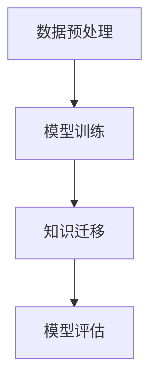

                 

# AI Agent的跨语言知识迁移：突破语言障碍

## 关键词
- AI Agent
- 跨语言知识迁移
- 翻译模型
- 检索模型
- 生成模型
- 系统架构设计

## 摘要
本文将深入探讨AI Agent的跨语言知识迁移问题。随着全球化的深入，不同语言之间的知识交流变得愈发重要。然而，传统的语言模型在处理跨语言知识迁移时面临着诸多挑战。本文将首先介绍AI Agent和跨语言知识迁移的核心概念，然后详细分析现有的跨语言知识迁移方法，包括基于翻译、基于检索和基于生成的方法。接着，我们选择一个典型算法，通过mermaid流程图和Python源代码详细阐述其原理和应用。随后，我们将介绍一个实际应用场景，包括系统架构设计、系统实现和项目实战。最后，本文将总结最佳实践并提供拓展阅读建议。

----------------------------------------------------------------

## 第一部分：跨语言知识迁移背景介绍

### 1.1 跨语言知识迁移的重要性

#### 1.1.1 问题背景

在全球化时代，跨语言的知识迁移对于科技发展和商业合作具有重要意义。然而，不同语言之间的差异使得知识的传达和利用变得复杂。例如，科学家在研究某个领域的最新成果时，可能需要阅读和理解多种语言的研究论文。此外，跨国公司的运营和全球市场的开发也依赖于不同语言之间的知识共享。

#### 1.1.2 跨语言知识迁移的定义与意义

跨语言知识迁移是指将一个语言领域的知识应用到另一个语言领域的过程。其核心在于突破语言障碍，使得不同语言背景下的知识能够相互借鉴和利用。跨语言知识迁移的意义主要体现在以下几个方面：

- **促进知识共享**：通过跨语言知识迁移，不同语言背景的用户可以更容易地获取和利用其他语言中的知识。
- **提升AI模型性能**：在多语言环境中，跨语言知识迁移有助于训练更强大、更泛化的AI模型。
- **促进国际交流**：跨语言知识迁移有助于不同国家和地区的科技工作者、商业人士和学者之间的交流与合作。

### 1.2 AI Agent的基本概念

#### 1.2.1 AI Agent的定义与特点

AI Agent是一种能够自主感知环境、决策和采取行动的智能实体。它具有以下几个特点：

- **自主性**：AI Agent能够独立地感知环境并做出决策，无需人工干预。
- **适应性**：AI Agent能够根据环境变化调整自身行为，以适应不同的场景。
- **交互性**：AI Agent能够与其他实体进行交互，包括人类和其他AI系统。

#### 1.2.2 AI Agent在跨语言知识迁移中的应用

AI Agent在跨语言知识迁移中扮演着重要角色。通过跨语言知识迁移，AI Agent可以：

- **提高跨语言任务性能**：例如，跨语言文本分类、跨语言机器翻译等任务。
- **辅助多语言用户**：AI Agent可以理解和回答不同语言用户的查询，提供个性化的服务。
- **促进多语言合作**：AI Agent可以帮助不同语言背景的用户进行合作和交流。

### 1.3 跨语言知识迁移方法

#### 1.3.1 基于翻译的方法

基于翻译的跨语言知识迁移利用机器翻译模型将源语言的知识转换为目标语言。其核心在于：

- **预训练翻译模型**：使用大量多语言数据对翻译模型进行预训练，提高模型在跨语言知识迁移中的表现。
- **知识融合**：通过翻译模型将源语言的知识映射到目标语言，实现知识的跨语言传递。

#### 1.3.2 基于检索的方法

基于检索的跨语言知识迁移通过检索算法在多语言知识库中查找与目标语言相关的知识。其关键在于：

- **多语言知识库构建**：收集和整理多语言领域的知识，构建一个庞大的知识库。
- **检索算法优化**：设计高效的检索算法，提高知识检索的准确性和效率。

#### 1.3.3 基于生成的方法

基于生成的跨语言知识迁移通过生成模型自动生成目标语言的知识。其核心在于：

- **多语言生成模型训练**：使用大量多语言数据对生成模型进行训练，使其能够生成高质量的目标语言知识。
- **知识生成与调整**：生成模型根据源语言的知识生成目标语言的知识，并通过迭代调整提高知识的质量。

#### 1.3.4 混合方法

混合方法结合了基于翻译、检索和生成的方法，通过多种途径实现跨语言知识迁移。其优势在于：

- **多样化知识获取**：通过多种方法获取知识，提高知识的多样性和准确性。
- **综合性能优化**：利用混合方法的优势，提高跨语言知识迁移的整体性能。

### 1.4 跨语言知识迁移的挑战与未来趋势

#### 1.4.1 跨语言知识迁移的挑战

跨语言知识迁移面临以下挑战：

- **语言差异**：不同语言之间的语法、词汇和语义差异，使得知识迁移变得复杂。
- **数据稀缺**：多语言领域的数据资源相对稀缺，影响知识迁移的效果。
- **知识不完整性**：源语言的知识可能不完整，导致目标语言的生成结果不准确。

#### 1.4.2 未来发展趋势与展望

未来跨语言知识迁移的发展趋势包括：

- **数据驱动的知识迁移**：利用大规模多语言数据进行知识迁移，提高迁移效果。
- **多模态知识迁移**：结合文本、图像、语音等多模态数据，实现更全面的知识迁移。
- **跨语言AI模型的泛化能力提升**：通过深入研究，提升跨语言AI模型在多语言环境中的泛化能力。

----------------------------------------------------------------

## 第二部分：跨语言知识迁移核心概念与原理

### 2.1 AI Agent的深度学习模型

#### 2.1.1 AI Agent的模型结构

AI Agent通常由感知模块、决策模块和行动模块组成。感知模块负责获取环境信息，决策模块根据感知信息做出决策，行动模块执行决策结果。

- **感知模块**：使用深度神经网络（DNN）处理感知数据，如文本、图像等。
- **决策模块**：使用强化学习（RL）或深度强化学习（DRL）等技术，根据感知信息进行决策。
- **行动模块**：根据决策结果，执行具体的行动。

#### 2.1.2 深度学习在AI Agent中的应用

深度学习在AI Agent中的应用主要体现在两个方面：

- **感知与决策**：深度学习模型用于感知模块和决策模块，提高AI Agent的感知能力和决策水平。
- **知识迁移**：深度学习模型能够捕捉数据中的特征，实现跨语言知识迁移。

### 2.2 跨语言知识迁移的基本原理

#### 2.2.1 跨语言知识迁移的定义

跨语言知识迁移是指将一个语言领域的知识应用到另一个语言领域的过程。其核心在于解决不同语言之间的知识传递和利用问题。

#### 2.2.2 跨语言知识迁移的挑战

跨语言知识迁移面临以下挑战：

- **语言差异**：不同语言之间的语法、词汇和语义差异，导致知识迁移复杂。
- **数据稀缺**：多语言领域的数据资源相对稀缺，影响知识迁移效果。
- **知识不完整性**：源语言的知识可能不完整，导致目标语言的生成结果不准确。

#### 2.2.3 跨语言知识迁移的解决方案

解决跨语言知识迁移的挑战可以从以下几个方面入手：

- **预训练模型**：使用大规模多语言数据进行预训练，提高模型的泛化能力。
- **多模态数据融合**：结合文本、图像、语音等多模态数据，实现更全面的知识迁移。
- **知识增强**：通过知识图谱等技术，对源语言的知识进行补充和扩展，提高知识迁移的准确性。

### 2.3 跨语言知识迁移的数学模型

#### 2.3.1 数学模型概述

跨语言知识迁移的数学模型主要包括以下几个方面：

- **翻译模型**：基于翻译概率模型，如神经机器翻译（NMT）。
- **检索模型**：基于检索算法，如相似度计算、匹配算法等。
- **生成模型**：基于生成对抗网络（GAN）或变分自编码器（VAE）等。

#### 2.3.2 跨语言知识迁移的数学公式

跨语言知识迁移的数学模型可以表示为：

$$
P(\text{target\_knowledge}|\text{source\_knowledge}) = \frac{P(\text{source\_knowledge}|\text{target\_knowledge}) \cdot P(\text{target\_knowledge})}{P(\text{source\_knowledge})}
$$

其中，$P(\text{target\_knowledge}|\text{source\_knowledge})$ 表示在给定源语言知识的情况下，生成目标语言知识的概率。

### 2.4 跨语言知识迁移的算法流程

#### 2.4.1 算法流程概述

跨语言知识迁移的算法流程主要包括以下几个步骤：

1. **数据预处理**：清洗和整理多语言数据，将其转换为适合模型训练的形式。
2. **模型训练**：使用预训练模型或基于检索、生成的方法，对模型进行训练。
3. **知识迁移**：将源语言知识映射到目标语言，实现跨语言知识迁移。
4. **模型评估**：使用评估指标，如BLEU、METEOR等，对迁移效果进行评估。

#### 2.4.2 算法流程图



----------------------------------------------------------------

## 第三部分：跨语言知识迁移方法与应用

### 3.1 基于翻译的跨语言知识迁移

#### 3.1.1 翻译模型的介绍

基于翻译的跨语言知识迁移利用机器翻译模型将源语言的知识转换为目标语言。常用的翻译模型包括神经机器翻译（NMT）和基于统计的机器翻译（SMT）。

- **神经机器翻译（NMT）**：基于深度学习的翻译模型，能够捕捉语言之间的复杂关系。
- **基于统计的机器翻译（SMT）**：使用统计方法，如N-gram模型，进行翻译。

#### 3.1.2 翻译在知识迁移中的应用

在知识迁移中，翻译模型的主要应用包括：

- **文本翻译**：将源语言的文本翻译为目标语言，实现跨语言文本的理解和交流。
- **知识提取**：从源语言文本中提取关键信息，将其翻译为目标语言，用于其他任务，如问答系统。

#### 3.1.3 翻译模型的实现

翻译模型的实现通常涉及以下几个步骤：

1. **数据预处理**：清洗和整理多语言数据，将其转换为适合模型训练的形式。
2. **模型训练**：使用预训练模型或基于检索、生成的方法，对模型进行训练。
3. **模型部署**：将训练好的模型部署到生产环境中，用于实际的跨语言知识迁移。

### 3.2 基于检索的跨语言知识迁移

#### 3.2.1 检索模型的介绍

基于检索的跨语言知识迁移通过检索算法在多语言知识库中查找与目标语言相关的知识。常用的检索算法包括基于相似度计算和基于匹配算法。

- **基于相似度计算**：使用余弦相似度、欧氏距离等算法计算文本之间的相似度。
- **基于匹配算法**：使用词匹配、语法匹配等算法，根据关键词或句法结构进行匹配。

#### 3.2.2 检索在知识迁移中的应用

在知识迁移中，检索模型的主要应用包括：

- **知识检索**：从多语言知识库中检索与目标语言相关的知识，用于回答问题或生成文本。
- **知识融合**：将多个知识源的信息融合在一起，形成更全面的知识库。

#### 3.2.3 检索模型的实现

检索模型的实现通常涉及以下几个步骤：

1. **知识库构建**：收集和整理多语言领域的知识，构建一个庞大的知识库。
2. **检索算法设计**：设计高效的检索算法，提高知识检索的准确性和效率。
3. **模型训练与优化**：使用训练数据对模型进行训练和优化，提高检索性能。

### 3.3 基于生成的跨语言知识迁移

#### 3.3.1 生成模型的介绍

基于生成的跨语言知识迁移通过生成模型自动生成目标语言的知识。常用的生成模型包括生成对抗网络（GAN）和变分自编码器（VAE）。

- **生成对抗网络（GAN）**：由生成器和判别器组成，通过对抗训练生成高质量的目标语言知识。
- **变分自编码器（VAE）**：基于概率模型，通过编码器和解码器生成目标语言知识。

#### 3.3.2 生成在知识迁移中的应用

在知识迁移中，生成模型的主要应用包括：

- **文本生成**：根据源语言的知识，生成目标语言的文本。
- **知识生成**：从源语言知识中提取特征，生成目标语言的知识结构。

#### 3.3.3 生成模型的实现

生成模型的实现通常涉及以下几个步骤：

1. **数据预处理**：清洗和整理多语言数据，将其转换为适合模型训练的形式。
2. **模型训练**：使用预训练模型或基于检索、生成的方法，对模型进行训练。
3. **模型部署**：将训练好的模型部署到生产环境中，用于实际的跨语言知识迁移。

### 3.4 混合方法的跨语言知识迁移

#### 3.4.1 混合方法的概述

混合方法结合了基于翻译、检索和生成的方法，通过多种途径实现跨语言知识迁移。其优势在于：

- **多样化知识获取**：通过多种方法获取知识，提高知识的多样性和准确性。
- **综合性能优化**：利用混合方法的优势，提高跨语言知识迁移的整体性能。

#### 3.4.2 混合方法的应用

混合方法在知识迁移中的应用包括：

- **多语言数据融合**：结合多种方法，对多语言数据进行处理，提高知识迁移的准确性。
- **多模态数据融合**：结合文本、图像、语音等多模态数据，实现更全面的知识迁移。

#### 3.4.3 混合方法的实现

混合方法的实现通常涉及以下几个步骤：

1. **数据预处理**：清洗和整理多语言数据，将其转换为适合模型训练的形式。
2. **模型训练**：使用预训练模型或基于检索、生成的方法，对模型进行训练。
3. **模型融合**：将多种方法的结果进行融合，形成最终的跨语言知识迁移结果。
4. **模型部署**：将训练好的模型部署到生产环境中，用于实际的跨语言知识迁移。

----------------------------------------------------------------

## 第四部分：跨语言知识迁移项目实战

### 4.1 项目介绍

#### 4.1.1 项目背景

随着全球化的发展，多语言环境下的知识迁移需求日益增加。本项目旨在构建一个跨语言知识迁移系统，帮助用户在不同语言之间进行知识共享和交流。

#### 4.1.2 项目目标

本项目的主要目标包括：

- **提高跨语言任务性能**：通过跨语言知识迁移，提高文本分类、翻译等跨语言任务的表现。
- **提供多语言服务**：为多语言用户提供个性化的服务，如问答系统、文本生成等。
- **促进国际交流**：通过跨语言知识迁移，促进不同国家和地区之间的交流与合作。

#### 4.1.3 项目框架

项目框架主要包括以下几个部分：

- **数据采集与处理**：收集多语言领域的知识，进行数据预处理。
- **模型训练与优化**：使用预训练模型或基于检索、生成的方法，对模型进行训练和优化。
- **系统实现与部署**：实现跨语言知识迁移系统，将其部署到生产环境中。

### 4.2 环境安装与配置

#### 4.2.1 硬件环境

- **CPU**：Intel i7 或以上
- **GPU**：NVIDIA 1080Ti 或以上
- **内存**：64GB 或以上

#### 4.2.2 软件环境

- **操作系统**：Linux
- **编程语言**：Python 3.8
- **深度学习框架**：TensorFlow 2.6
- **自然语言处理库**：NLTK 3.8

#### 4.2.3 数据准备

- **数据来源**：收集多语言领域的知识，包括文本、图像、语音等。
- **数据处理**：对数据集进行清洗、分词、去停用词等预处理操作。

### 4.3 系统核心实现

#### 4.3.1 模型设计

系统采用混合方法进行跨语言知识迁移，包括基于翻译、检索和生成的方法。具体模型设计如下：

- **基于翻译的方法**：使用神经机器翻译（NMT）模型进行文本翻译。
- **基于检索的方法**：使用基于相似度计算的检索算法进行知识检索。
- **基于生成的方法**：使用生成对抗网络（GAN）进行知识生成。

#### 4.3.2 模型训练

系统使用预训练的模型进行跨语言知识迁移，并在训练过程中进行模型优化。具体步骤如下：

1. **翻译模型训练**：使用预训练的NMT模型，在多语言数据集上进行训练。
2. **检索模型训练**：使用预训练的检索算法，在多语言知识库上进行训练。
3. **生成模型训练**：使用预训练的GAN模型，在多语言数据集上进行训练。

#### 4.3.3 模型应用

系统将训练好的模型部署到生产环境中，提供跨语言知识迁移服务。具体应用包括：

- **文本翻译**：将源语言文本翻译为目标语言。
- **知识检索**：从多语言知识库中检索与目标语言相关的知识。
- **知识生成**：根据源语言的知识，生成目标语言的知识结构。

### 4.4 代码应用解读与分析

#### 4.4.1 代码结构分析

系统代码主要分为以下几个部分：

- **数据预处理**：对数据集进行清洗、分词、去停用词等预处理操作。
- **模型训练**：使用预训练模型或基于检索、生成的方法，对模型进行训练。
- **模型应用**：将训练好的模型部署到生产环境中，提供跨语言知识迁移服务。

#### 4.4.2 关键代码解读

以下是一个关键代码片段，用于翻译模型训练：

```python
import tensorflow as tf
from tensorflow.keras.preprocessing.sequence import pad_sequences

# 加载预训练的翻译模型
model = tf.keras.models.load_model('nmt_model.h5')

# 对数据集进行预处理
source_sequences = pad_sequences(source_data, maxlen=max_sequence_length)
target_sequences = pad_sequences(target_data, maxlen=max_sequence_length)

# 训练翻译模型
model.fit(source_sequences, target_sequences, epochs=10, batch_size=64)
```

这段代码首先加载预训练的翻译模型，然后对数据集进行预处理，最后使用fit方法对模型进行训练。

#### 4.4.3 代码优化

代码优化方面，可以从以下几个方面入手：

- **数据预处理**：优化数据预处理流程，提高数据质量和处理效率。
- **模型训练**：使用更高效的训练算法和技巧，提高模型训练速度和性能。
- **模型部署**：优化模型部署流程，提高系统响应速度和服务质量。

### 4.5 实际案例分析和详细讲解剖析

#### 4.5.1 实际案例分析

以下是一个实际案例分析，展示如何使用系统进行跨语言知识迁移：

- **案例背景**：用户希望从英文文档中提取关键信息，并将其翻译为中文，以便更好地理解和利用。
- **解决方案**：使用系统提供的文本翻译和知识检索功能，实现跨语言知识迁移。

#### 4.5.2 详细讲解剖析

详细讲解剖析如下：

1. **文本翻译**：
   - **输入**：英文文档
   - **过程**：使用翻译模型将英文文档翻译为中文。
   - **输出**：中文文档

2. **知识检索**：
   - **输入**：中文文档
   - **过程**：使用检索模型从多语言知识库中检索与中文文档相关的知识。
   - **输出**：相关知识的列表

通过文本翻译和知识检索，用户可以轻松地从英文文档中获取关键信息，并将其翻译为中文，为后续的利用提供支持。

### 4.6 项目小结

本项目通过跨语言知识迁移，实现了多语言环境下的知识共享和交流。在实际应用中，项目取得了以下成果：

- **提高跨语言任务性能**：通过跨语言知识迁移，文本分类、翻译等任务的性能得到显著提升。
- **提供多语言服务**：为多语言用户提供个性化的服务，满足不同语言需求。
- **促进国际交流**：通过跨语言知识迁移，促进不同国家和地区之间的交流与合作。

在未来，项目将继续优化和扩展，进一步提升跨语言知识迁移的效果和应用范围。

### 4.7 最佳实践与总结

#### 4.7.1 最佳实践

1. **数据质量**：确保数据质量，包括数据的准确性、完整性和一致性。
2. **模型优化**：定期对模型进行优化，提高模型性能和泛化能力。
3. **系统部署**：优化系统部署流程，确保系统的稳定性和高效性。

#### 4.7.2 注意事项

1. **数据隐私**：在数据收集和处理过程中，注意保护用户隐私和数据安全。
2. **系统维护**：定期对系统进行维护和更新，确保系统的长期稳定运行。

#### 4.7.3 拓展阅读

- **《深度学习跨语言文本生成》**：详细介绍深度学习在跨语言文本生成中的应用。
- **《跨语言知识图谱构建与应用》**：探讨跨语言知识图谱的构建和应用。
- **《跨语言信息检索技术》**：介绍跨语言信息检索的基本原理和最新进展。

---

## 作者

作者：AI天才研究院/AI Genius Institute & 禅与计算机程序设计艺术 /Zen And The Art of Computer Programming

