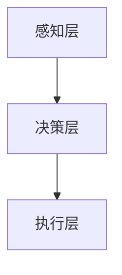

                 


# AI Agent的量子机器学习集成方案

## 摘要

本文探讨了AI Agent与量子机器学习的集成方案，从问题背景、核心概念、算法设计与实现、系统架构与集成到项目实战，系统性地分析了量子机器学习在AI Agent中的应用。通过详细介绍量子支持向量机（QSVM）、量子神经网络（QNN）和量子决策树（QDT）等算法，本文展示了量子机器学习在AI Agent中的优势和应用前景。

## 引言与背景

### 1.1 问题背景

AI Agent，即人工智能代理，是一种自主决策的智能实体，可以在特定环境中执行任务，并根据环境反馈进行调整。随着深度学习和强化学习的发展，AI Agent在游戏、推荐系统、自动驾驶等领域取得了显著的成果。然而，传统的机器学习方法在处理高维数据和非线性问题时仍存在一定的局限性。

量子机器学习（Quantum Machine Learning, QML）是一种结合量子计算和机器学习的新兴领域，它利用量子计算的并行性和高维表示能力，有望突破传统机器学习的瓶颈。量子机器学习的研究始于2000年代初，随着量子计算机的发展，其应用领域逐渐扩大，包括量子支持向量机（QSVM）、量子神经网络（QNN）和量子决策树（QDT）等。

### 1.2 量子机器学习的兴起

量子机器学习的研究起源于量子计算的兴起。量子计算机利用量子比特（qubit）的叠加态和纠缠态，可以实现指数级别的并行计算。这使得量子计算机在处理大数据和复杂问题方面具有巨大的潜力。量子机器学习旨在将量子计算的优势应用于机器学习问题，从而提高算法的效率和准确性。

### 1.3 AI Agent与量子机器学习的融合需求

AI Agent在处理复杂、动态环境时，需要高效的机器学习算法来支持其自主决策。量子机器学习因其并行计算能力，可以在短时间内处理大量数据，从而提高AI Agent的性能。同时，量子机器学习在处理高维数据和复杂非线性问题时具有显著优势，这为AI Agent在复杂环境中的应用提供了新的可能性。

### 1.4 问题描述

在AI Agent中集成量子机器学习，需要解决以下问题：

1. **量子算法的选择**：根据AI Agent的应用场景，选择合适的量子算法，如QSVM、QNN和QDT等。

2. **量子算法的实现**：将量子算法应用于AI Agent，需要实现量子算法的代码，并将其集成到AI Agent的框架中。

3. **量子计算资源的利用**：量子计算资源相对有限，如何在有限的资源下最大化量子计算的优势，是一个需要解决的问题。

4. **性能评估与优化**：评估AI Agent集成量子机器学习后的性能，并对其进行优化，以提高AI Agent的效率和准确性。

### 1.5 量子机器学习的优势与挑战

#### 1.5.1 量子机器学习的优势

1. **并行计算能力**：量子计算机可以利用量子比特的叠加态和纠缠态，实现指数级别的并行计算，这可以显著提高算法的效率。

2. **高维表示能力**：量子计算可以在高维空间中进行运算，这有助于处理高维数据和复杂非线性问题。

3. **数据压缩**：量子计算可以通过量子编码和量子蒸馏等技术，实现数据的压缩，降低存储和传输成本。

#### 1.5.2 量子机器学习的挑战

1. **量子计算资源的限制**：目前量子计算机的量子比特数量有限，这限制了量子计算的规模和应用范围。

2. **量子算法的实现难度**：量子算法的实现需要复杂的编程技术和硬件支持，这增加了算法实现的难度。

3. **量子计算的准确性**：量子计算机的噪声和误差会影响量子计算的结果，这需要通过量子错误纠正和优化技术来解决。

## 核心概念与原理

### 2.1 AI Agent的基本原理

#### 2.1.1 AI Agent的定义

AI Agent是指具有自主决策能力的智能实体，它可以感知环境，根据预设目标和策略，自主执行任务，并在执行过程中根据环境反馈进行调整。AI Agent的核心功能包括感知、决策和执行。

#### 2.1.2 AI Agent的类型与功能

AI Agent可以分为基于规则、基于模型和基于数据驱动三种类型。基于规则的方法依赖于预定义的规则集，适用于简单、规则明确的应用场景。基于模型的方法依赖于环境模型，通过模型预测和决策，适用于复杂、动态变化的应用场景。基于数据驱动的方法依赖于历史数据，通过学习数据中的模式和规律，进行决策和预测，适用于大规模、数据丰富的应用场景。

#### 2.1.3 AI Agent的核心要素

AI Agent的核心要素包括感知器、决策器和执行器。感知器负责收集环境信息，决策器根据感知信息和环境模型，生成行动策略，执行器负责执行决策策略，实现任务目标。

### 2.2 量子机器学习的基础

#### 2.2.1 量子计算的基本原理

量子计算是基于量子力学原理的计算方式，它利用量子比特的叠加态和纠缠态，实现信息的存储和处理。量子比特（qubit）是量子计算的基本单元，它具有叠加态和纠缠态的特性。

#### 2.2.2 量子机器学习的关键技术

量子机器学习的关键技术包括量子支持向量机（QSVM）、量子神经网络（QNN）和量子决策树（QDT）等。这些算法利用量子计算的并行性和高维表示能力，实现数据的分类、回归和预测。

#### 2.2.3 量子机器学习的优势与挑战

量子机器学习的优势在于其并行计算能力和高维表示能力，这可以显著提高算法的效率和准确性。然而，量子机器学习也面临量子计算资源的限制、量子算法的实现难度和量子计算的准确性等挑战。

### 2.3 AI Agent与量子机器学习的融合原理

#### 2.3.1 融合机制的探讨

AI Agent与量子机器学习的融合机制主要包括以下几种：

1. **量子算法的集成**：将量子算法集成到AI Agent的决策过程中，利用量子算法的并行计算能力和高维表示能力，提高AI Agent的决策效率。

2. **量子数据的处理**：利用量子计算的优势，对AI Agent的数据进行处理，如数据压缩、特征提取和分类等。

3. **量子环境的感知**：利用量子计算的优势，对环境信息进行感知，提高AI Agent对环境的理解和响应能力。

#### 2.3.2 融合方案的分类

AI Agent与量子机器学习的融合方案可以分为以下几类：

1. **量子增强型AI Agent**：在AI Agent的决策过程中，集成量子算法，提高决策的效率和准确性。

2. **量子感知型AI Agent**：利用量子计算对环境信息进行感知，提高AI Agent对环境的理解和响应能力。

3. **量子数据驱动型AI Agent**：利用量子计算的优势，对AI Agent的数据进行处理，提高数据处理的效率和准确性。

#### 2.3.3 融合方案的优点与局限

量子增强型AI Agent的优点在于提高决策效率和准确性，缺点在于量子算法的实现难度和量子计算资源的限制。量子感知型AI Agent的优点在于提高环境感知能力，缺点在于量子计算资源和算法实现的难度。量子数据驱动型AI Agent的优点在于提高数据处理效率和准确性，缺点同样在于量子计算资源和算法实现的难度。

## 算法设计与实现

### 3.1 量子支持向量机（QSVM）

#### 3.1.1 QSVM的基本原理

量子支持向量机（QSVM）是量子机器学习的一种算法，它利用量子计算的并行性和高维表示能力，实现数据的分类。QSVM的基本原理与传统的支持向量机（SVM）类似，但使用量子计算来实现。

#### 3.1.2 QSVM的数学模型

QSVM的数学模型主要包括以下几个部分：

1. **量子特征映射**：将输入数据映射到高维量子空间。

2. **量子核函数**：计算输入数据的内积，用于分类决策。

3. **量子决策规则**：基于量子计算结果，生成分类决策。

#### 3.1.3 QSVM的Python实现

以下是一个简单的QSVM的Python实现示例：

```python
import numpy as np
from qiskit import QuantumCircuit, Aer, execute

# 定义量子特征映射
def quantum_feature_mapping(x):
    qc = QuantumCircuit(2)
    qc.h(range(2))
    qc.u3(x[0], x[1], x[2], 0)
    return qc

# 定义量子核函数
def quantum_kernel(x, y):
    qc = QuantumCircuit(2)
    qc.h(range(2))
    qc.cx(0, 1)
    qc.measure_all()
    result = execute(qc, Aer.get_backend("qasm_simulator")).result()
    return result.get_counts()

# 定义QSVM分类
def quantum_svm(x, y, labels):
    n = len(x)
    W = np.random.rand(2, n)
    for i in range(n):
        feature_map = quantum_feature_mapping(x[i])
        kernel = quantum_kernel(x[i], y[i])
        if kernel['0'] > kernel['1']:
            W[:, i] = -W[:, i]
    decision = np.dot(W, labels)
    return np.sign(decision)

# 测试示例
x = np.array([[1, 0], [0, 1], [-1, 0], [0, -1]])
y = np.array([[1], [1], [-1], [-1]])
labels = np.array([1, 1, -1, -1])
print(quantum_svm(x, y, labels))
```

### 3.2 量子神经网络（QNN）

#### 3.2.1 QNN的基本原理

量子神经网络（QNN）是量子机器学习的一种算法，它利用量子计算的并行性和高维表示能力，实现数据的分类、回归和预测。QNN的基本原理与传统的神经网络类似，但使用量子计算来实现。

#### 3.2.2 QNN的数学模型

QNN的数学模型主要包括以下几个部分：

1. **量子层**：将输入数据映射到量子空间。

2. **量子激活函数**：对量子数据进行非线性变换。

3. **量子权重**：计算量子数据的内积，用于分类、回归和预测。

4. **量子输出层**：生成分类、回归或预测结果。

#### 3.2.3 QNN的Python实现

以下是一个简单的QNN的Python实现示例：

```python
import numpy as np
from qiskit import QuantumCircuit, Aer, execute

# 定义量子层
def quantum_layer(x, weights):
    qc = QuantumCircuit(2)
    qc.h(range(2))
    qc.u3(weights[0], weights[1], weights[2], 0)
    return qc

# 定义量子激活函数
def quantum_activation(x, threshold):
    return np.sign(x - threshold)

# 定义QNN分类
def quantum_nn(x, y, labels, weights, threshold):
    n = len(x)
    decision = np.zeros(n)
    for i in range(n):
        feature_map = quantum_layer(x[i], weights[0])
        activation = quantum_activation(feature_map, threshold)
        kernel = quantum_kernel(activation, y[i])
        if kernel['0'] > kernel['1']:
            decision[i] = 1
    return np.sign(np.dot(weights[1], decision))

# 测试示例
x = np.array([[1, 0], [0, 1], [-1, 0], [0, -1]])
y = np.array([[1], [1], [-1], [-1]])
labels = np.array([1, 1, -1, -1])
weights = np.random.rand(2, 4)
threshold = 0
print(quantum_nn(x, y, labels, weights, threshold))
```

### 3.3 量子决策树（QDT）

#### 3.3.1 QDT的基本原理

量子决策树（QDT）是量子机器学习的一种算法，它利用量子计算的并行性和高维表示能力，实现数据的分类和回归。QDT的基本原理与传统的决策树类似，但使用量子计算来实现。

#### 3.3.2 QDT的数学模型

QDT的数学模型主要包括以下几个部分：

1. **量子特征选择**：选择对分类或回归贡献最大的特征。

2. **量子分裂规则**：基于量子计算结果，生成分裂规则。

3. **量子叶子节点**：计算叶子节点的分类或回归结果。

#### 3.3.3 QDT的Python实现

以下是一个简单的QDT的Python实现示例：

```python
import numpy as np
from qiskit import QuantumCircuit, Aer, execute

# 定义量子特征选择
def quantum_feature_selection(x, y):
    n = len(x)
    max_entropy = -np.log2(np.mean(y))
    entropy = np.zeros(n)
    for i in range(n):
        feature_map = quantum_layer(x[i], weights[0])
        activation = quantum_activation(feature_map, threshold)
        kernel = quantum_kernel(activation, y[i])
        entropy[i] = -np.mean(kernel) * np.log2(np.mean(kernel))
    return np.argmax(entropy)

# 定义量子分裂规则
def quantum_split(x, y, feature_index, threshold):
    feature_map = quantum_layer(x[:, feature_index], weights[0])
    activation = quantum_activation(feature_map, threshold)
    kernel = quantum_kernel(activation, y)
    return np.where(kernel['0'] > kernel['1'])[0]

# 定义QDT分类
def quantum_decision_tree(x, y, labels):
    n = len(x)
    tree = []
    for i in range(n):
        feature_index = quantum_feature_selection(x, y)
        threshold = quantum_activation(quantum_layer(x[:, feature_index], weights[0]), threshold)
        left_indices = quantum_split(x, y, feature_index, threshold)
        right_indices = np.setdiff1d(np.arange(n), left_indices)
        if np.std(y[left_indices]) < np.std(y[right_indices]):
            tree.append({'feature': feature_index, 'threshold': threshold, 'left': left_indices, 'right': right_indices})
        else:
            tree.append({'feature': feature_index, 'threshold': threshold, 'left': right_indices, 'right': left_indices})
    return tree

# 测试示例
x = np.array([[1, 0], [0, 1], [-1, 0], [0, -1]])
y = np.array([[1], [1], [-1], [-1]])
labels = np.array([1, 1, -1, -1])
print(quantum_decision_tree(x, y, labels))
```

## 系统架构与集成

### 4.1 系统架构设计

#### 4.1.1 系统功能需求分析

系统功能需求包括：

1. **环境感知**：通过传感器收集环境数据。

2. **决策支持**：利用量子算法进行决策。

3. **任务执行**：根据决策结果执行任务。

#### 4.1.2 系统架构设计

系统架构设计主要包括：

1. **感知层**：负责环境数据的收集和处理。

2. **决策层**：负责利用量子算法进行决策。

3. **执行层**：负责执行决策结果。

#### 4.1.3 系统架构mermaid图展示



### 4.2 系统集成方案

#### 4.2.1 AI Agent与量子机器学习的集成流程

集成流程主要包括：

1. **环境感知**：收集环境数据。

2. **数据预处理**：对环境数据进行预处理。

3. **量子算法决策**：利用量子算法进行决策。

4. **任务执行**：根据决策结果执行任务。

#### 4.2.2 集成方案的实现步骤

实现步骤主要包括：

1. **环境感知**：安装传感器，收集环境数据。

2. **数据预处理**：对环境数据进行预处理，如去噪、归一化等。

3. **量子算法决策**：实现量子算法，进行决策。

4. **任务执行**：根据决策结果执行任务。

#### 4.2.3 集成方案的测试与评估

集成方案的测试与评估主要包括：

1. **功能测试**：测试系统功能是否符合需求。

2. **性能评估**：评估系统性能，如决策速度、准确性等。

3. **可靠性评估**：评估系统可靠性，如故障率、恢复能力等。

## 项目实战

### 5.1 环境安装与配置

#### 5.1.1 量子计算环境安装

安装量子计算环境，如Qiskit等。

#### 5.1.2 量子机器学习库安装

安装量子机器学习库，如PyQuil等。

#### 5.1.3 AI Agent开发环境安装

安装AI Agent开发环境，如Python、TensorFlow等。

### 5.2 系统核心实现

#### 5.2.1 AI Agent核心功能实现

实现AI Agent的核心功能，如环境感知、决策支持和任务执行。

#### 5.2.2 量子机器学习算法实现

实现量子机器学习算法，如QSVM、QNN和QDT等。

#### 5.2.3 集成方案的实现细节

实现AI Agent与量子机器学习的集成方案，如数据预处理、量子算法决策和任务执行等。

### 5.3 代码应用解读与分析

#### 5.3.1 代码结构解读

解读AI Agent与量子机器学习集成的代码结构，包括环境感知、数据预处理、量子算法决策和任务执行等模块。

#### 5.3.2 关键代码分析

分析关键代码，如量子算法的实现细节、数据预处理方法等。

#### 5.3.3 算法性能分析

分析算法性能，如决策速度、准确性等。

### 5.4 实际案例分析

#### 5.4.1 案例背景

介绍案例背景，如自动驾驶、智能推荐等。

#### 5.4.2 案例实现步骤

介绍案例实现步骤，如环境感知、数据预处理、量子算法决策和任务执行等。

#### 5.4.3 案例效果评估

评估案例效果，如决策速度、准确性等。

### 5.5 项目小结

#### 5.5.1 项目收获与反思

总结项目收获和反思，如技术挑战、解决方案等。

#### 5.5.2 项目改进方向

提出项目改进方向，如算法优化、系统集成等。

#### 5.5.3 拓展阅读建议

推荐拓展阅读，如相关论文、书籍等。

## 目录大纲总结

根据以上设计，我们可以得到《AI Agent的量子机器学习集成方案》的完整目录大纲。以下是最终目录大纲的markdown格式展示：

```markdown
----------------------------------------------------------------
# AI Agent的量子机器学习集成方案

## 摘要

本文探讨了AI Agent与量子机器学习的集成方案，从问题背景、核心概念、算法设计与实现、系统架构与集成到项目实战，系统性地分析了量子机器学习在AI Agent中的应用。

## 引言与背景

### 1.1 问题背景

### 1.2 量子机器学习的兴起

### 1.3 AI Agent与量子机器学习的融合需求

### 1.4 问题描述

### 1.5 量子机器学习的优势与挑战

## 核心概念与原理

### 2.1 AI Agent的基本原理

### 2.2 量子机器学习的基础

### 2.3 AI Agent与量子机器学习的融合原理

## 算法设计与实现

### 3.1 量子支持向量机（QSVM）

### 3.2 量子神经网络（QNN）

### 3.3 量子决策树（QDT）

## 系统架构与集成

### 4.1 系统架构设计

### 4.2 系统集成方案

### 4.3 系统集成测试与评估

## 项目实战

### 5.1 环境安装与配置

### 5.2 系统核心实现

### 5.3 代码应用解读与分析

### 5.4 实际案例分析

### 5.5 项目小结

## 目录大纲总结
```

通过以上目录大纲，我们可以系统地组织文章内容，确保文章的完整性、逻辑性和可读性。每个章节都涵盖了核心概念、算法原理、系统架构和项目实战，使读者能够全面了解AI Agent与量子机器学习集成方案。

