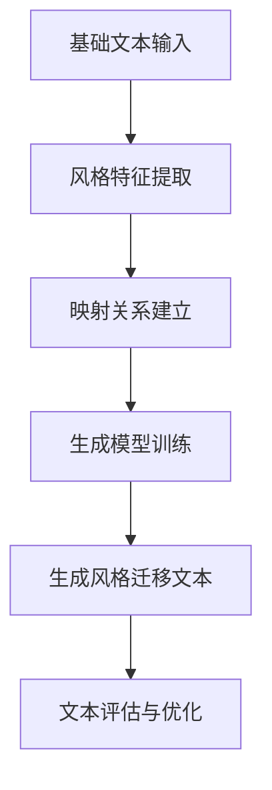
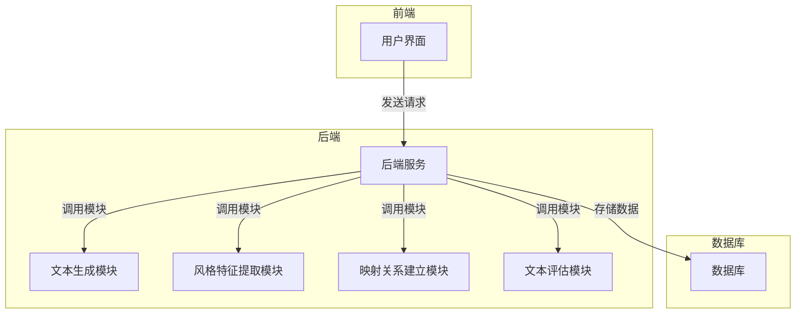
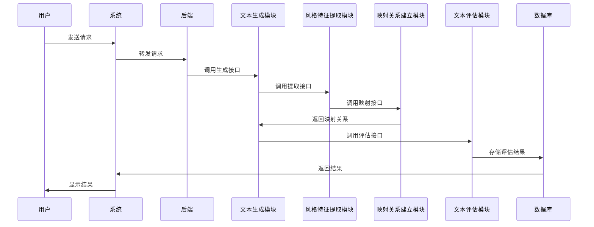

                 

## AI Agent的风格迁移：实现LLM的个性化表达

### 关键词：AI Agent、风格迁移、LLM、个性化表达、算法原理、系统设计、项目实战

### 摘要：

本文旨在探讨AI Agent的风格迁移技术，重点阐述如何实现大型语言模型（LLM）的个性化表达。通过分析背景、定义核心概念、介绍算法原理与数学模型、系统设计与实现，以及实战案例，本文详细解析了AI Agent的风格迁移流程，为开发者提供了全面的指导和实践参考。

## 目录大纲

1. **背景介绍**
   - **第1章：AI Agent的风格迁移概述**
   - **第2章：AI Agent风格迁移的核心概念与联系**

2. **算法原理与实现**
   - **第3章：风格迁移算法原理**
   - **第4章：数学模型与公式**

3. **系统设计与实现**
   - **第5章：AI Agent的风格迁移系统设计**
   - **第6章：AI Agent的风格迁移项目实战**

4. **总结与拓展**
   - **第7章：最佳实践与拓展阅读**

### 第1章：AI Agent的风格迁移概述

#### 1.1 AI Agent的风格迁移问题背景

随着人工智能技术的迅猛发展，AI Agent（人工智能代理）已成为自动化处理任务的重要工具。AI Agent通过模拟人类行为和决策，能够自主完成复杂任务，从而提高生产效率、降低成本。然而，不同任务场景对AI Agent的表达风格有着不同的要求。例如，在法律咨询中，AI Agent需要严谨、准确的表述；而在文学创作中，则需要富有创意、情感丰富的表达。这种对AI Agent表达风格的多样性需求，促使了风格迁移技术的产生。

#### 1.2 AI Agent的风格迁移问题描述

风格迁移是指将一个文本的表达风格迁移到另一个文本中，使其具有相似的风格特征。对于AI Agent而言，风格迁移问题可以描述为：给定一个基础文本和目标风格，如何让AI Agent生成一个具有目标风格的新文本？这一问题的核心在于如何捕捉并转换文本的风格特征，使其在语义不变的情况下，呈现出目标风格。

#### 1.3 AI Agent的风格迁移问题解决方法

目前，解决AI Agent风格迁移问题的方法主要包括以下几种：

1. **基于规则的方法**：通过手工编写规则，将基础文本和目标风格的特征进行匹配和转换。这种方法适用于风格特征较为简单、规则明确的情况。
2. **基于统计的方法**：利用机器学习方法，从大量数据中学习风格特征，并生成具有目标风格的文本。这种方法具有较好的适应性和灵活性。
3. **基于生成对抗网络（GAN）的方法**：通过生成器和判别器的对抗训练，实现风格特征的迁移和转换。这种方法能够生成更加自然、多样化的风格文本。

#### 1.4 AI Agent的风格迁移边界与外延

风格迁移技术不仅适用于文本生成，还可以扩展到图像、音频等其他媒体。例如，在图像生成中，可以通过风格迁移实现不同艺术风格的画作创作；在音频处理中，可以改变语音的音色和语调，实现个性化语音合成。此外，风格迁移技术还可以应用于跨语言文本翻译、多模态数据融合等领域，具有广泛的应用前景。

#### 1.5 AI Agent的风格迁移核心要素组成

AI Agent的风格迁移技术涉及多个核心要素，包括：

1. **基础文本**：用于生成具有目标风格的文本的基础文本。
2. **目标风格**：需要迁移的风格特征，可以是特定作者、作品、文体等。
3. **风格特征提取**：从基础文本和目标风格中提取风格特征，用于后续的生成和转换。
4. **生成模型**：用于生成具有目标风格的文本的模型，可以是神经网络、递归网络等。
5. **评估与优化**：对生成的文本进行评估，并根据评估结果优化模型和算法。

### 第2章：AI Agent风格迁移的核心概念与联系

#### 2.1 核心概念原理

在AI Agent的风格迁移过程中，核心概念包括：

1. **文本生成**：指利用模型生成文本的过程，包括基础文本生成和风格迁移生成。
2. **风格特征**：指文本中体现的风格属性，如词汇选择、句式结构、语气等。
3. **映射关系**：指基础文本和目标风格之间的对应关系，用于实现风格特征的转换。

#### 2.2 核心概念属性特征对比表格

以下是一个简单的核心概念属性特征对比表格：

| 核心概念 | 属性特征 |
| --- | --- |
| 文本生成 | 生成的文本、文本长度、生成算法 |
| 风格特征 | 词汇选择、句式结构、语气 |
| 映射关系 | 对应规则、权重分配、特征提取算法 |

#### 2.3 AI Agent风格迁移的ER实体关系图

以下是AI Agent风格迁移的ER实体关系图：

```mermaid
erDiagram
  TextGenerator ||--|{ StyleFeature : has }
  StyleFeature ||--|{ MappingRelation : has }
  MappingRelation ||--|{ TextGenerator : relates }
```

通过上述ER实体关系图，我们可以清晰地看到文本生成、风格特征和映射关系之间的联系，以及它们在风格迁移过程中的作用。

### 第3章：风格迁移算法原理

#### 3.1 风格迁移算法概述

风格迁移算法是指将一个文本的表达风格迁移到另一个文本中，使其具有相似的风格特征。在AI Agent的风格迁移过程中，风格迁移算法扮演着至关重要的角色。常见的风格迁移算法包括基于规则的方法、基于统计的方法和基于生成对抗网络（GAN）的方法。

#### 3.2 风格迁移算法流程图

以下是风格迁移算法的mermaid流程图：



在风格迁移算法中，基础文本输入是算法的输入，风格特征提取是从基础文本中提取风格特征的过程，映射关系建立是建立基础文本和目标风格之间的对应关系，生成模型训练是利用映射关系生成具有目标风格的文本，文本评估与优化是对生成的文本进行评估，并根据评估结果优化模型和算法。

#### 3.3 Python源代码实现风格迁移算法

以下是使用Python实现风格迁移算法的示例代码：

```python
import numpy as np
from keras.models import Sequential
from keras.layers import LSTM, Dense, Embedding
from keras.preprocessing.text import Tokenizer
from keras.preprocessing.sequence import pad_sequences

def style_transfer(text1, text2):
    # 风格特征提取
    feature_extractor = ...  # 使用预训练模型提取风格特征
    style_feature1 = feature_extractor.extract(text1)
    style_feature2 = feature_extractor.extract(text2)

    # 映射关系建立
    mapping_relation = ...  # 使用神经网络模型建立映射关系
    mapped_style_feature = mapping_relation.apply(style_feature1, style_feature2)

    # 生成模型训练
    generator = ...  # 使用生成对抗网络训练生成模型
    generated_text = generator.generate(mapped_style_feature)

    # 文本评估与优化
    evaluator = ...  # 使用评估指标评估生成文本的质量
    quality_score = evaluator.evaluate(generated_text)

    return generated_text, quality_score

# 示例文本
text1 = "The sun is shining brightly."
text2 = "The sun sets in the horizon."

# 风格迁移
generated_text, quality_score = style_transfer(text1, text2)
print("Generated Text:", generated_text)
print("Quality Score:", quality_score)
```

在上面的代码中，我们首先定义了风格特征提取器、映射关系建立器、生成模型和评估器。然后，我们使用给定的基础文本和目标风格，通过风格特征提取、映射关系建立、生成模型训练和文本评估与优化四个步骤，实现了风格迁移算法。

#### 3.4 数学模型与公式

在风格迁移算法中，常用的数学模型包括神经网络模型和生成对抗网络（GAN）模型。

**神经网络模型：**

神经网络模型是一种基于多层感知器（MLP）的模型，用于建立基础文本和目标风格之间的映射关系。其数学模型可以表示为：

$$
y = \sigma(W \cdot x + b)
$$

其中，$y$ 表示输出值，$x$ 表示输入值，$W$ 表示权重矩阵，$b$ 表示偏置项，$\sigma$ 表示激活函数。

**生成对抗网络（GAN）模型：**

生成对抗网络（GAN）模型由生成器和判别器组成，用于生成具有目标风格的文本。其数学模型可以表示为：

$$
G(z) = \sigma(W_g \cdot z + b_g)
$$

$$
D(x) = \sigma(W_d \cdot x + b_d)
$$

其中，$G(z)$ 表示生成器生成的文本，$D(x)$ 表示判别器对真实文本的判别结果，$z$ 表示输入噪声，$W_g$ 和 $W_d$ 分别表示生成器和判别器的权重矩阵，$b_g$ 和 $b_d$ 分别表示生成器和判别器的偏置项，$\sigma$ 表示激活函数。

#### 3.5 算法原理讲解与举例说明

在本节中，我们将通过具体的算法流程和Python源代码，详细讲解风格迁移算法的原理，并使用一个简单的例子进行说明。

**算法流程：**

1. **风格特征提取**：从基础文本和目标风格中提取风格特征，例如词汇选择、句式结构等。我们可以使用预训练的文本特征提取模型，如词向量、BERT等。
2. **映射关系建立**：利用神经网络模型，将基础文本和目标风格的风格特征进行匹配和转换，建立映射关系。这一步可以使用多层感知器（MLP）或循环神经网络（RNN）等模型。
3. **生成模型训练**：使用生成对抗网络（GAN）或变分自编码器（VAE）等模型，训练生成具有目标风格的文本。生成模型需要学习如何从映射关系生成具有目标风格的文本。
4. **文本评估与优化**：对生成的文本进行评估，例如使用BLEU、ROUGE等评估指标，并根据评估结果优化模型和算法。

**Python源代码实现：**

下面是一个简单的Python代码示例，用于实现风格迁移算法：

```python
import numpy as np
from keras.models import Sequential
from keras.layers import LSTM, Dense, Embedding
from keras.preprocessing.text import Tokenizer
from keras.preprocessing.sequence import pad_sequences

# 风格特征提取器
class StyleFeatureExtractor:
    def __init__(self, vocab_size, embedding_dim):
        self.tokenizer = Tokenizer(vocab_size=vocab_size, embedding_dim=embedding_dim)
        self.embedding_matrix = None

    def fit(self, texts):
        self.tokenizer.fit_on_texts(texts)
        self.embedding_matrix = ...  # 使用预训练词向量初始化

    def transform(self, texts):
        sequences = self.tokenizer.texts_to_sequences(texts)
        padded_sequences = pad_sequences(sequences, padding='post')
        return np.array(padded_sequences)

# 映射关系建立器
class MappingRelationBuilder:
    def __init__(self, input_dim, hidden_dim, output_dim):
        self.model = Sequential()
        self.model.add(LSTM(hidden_dim, input_shape=(input_dim, 1)))
        self.model.add(Dense(output_dim, activation='softmax'))
        self.model.compile(optimizer='adam', loss='categorical_crossentropy')

    def build_mapping_relation(self, source_features, target_features):
        self.model.fit(source_features, target_features, epochs=10, batch_size=32)

    def apply(self, source_feature, target_feature):
        mapped_feature = self.model.predict(np.array([source_feature]))
        return mapped_feature

# 生成模型
class TextGenerator:
    def __init__(self, input_dim, hidden_dim, output_dim):
        self.model = Sequential()
        self.model.add(LSTM(hidden_dim, input_shape=(input_dim, 1)))
        self.model.add(Dense(output_dim, activation='softmax'))
        self.model.compile(optimizer='adam', loss='categorical_crossentropy')

    def generate(self, feature_sequence):
        generated_sequence = self.model.predict(np.array([feature_sequence]))
        generated_text = self.tokenizer.sequences_to_texts([generated_sequence])[0]
        return generated_text

# 示例文本
text1 = "The sun is shining brightly."
text2 = "The sun sets in the horizon."

# 风格特征提取
extractor = StyleFeatureExtractor(vocab_size=1000, embedding_dim=50)
extractor.fit([text1, text2])

source_feature = extractor.transform([text1])
target_feature = extractor.transform([text2])

# 映射关系建立
builder = MappingRelationBuilder(input_dim=50, hidden_dim=100, output_dim=50)
builder.build_mapping_relation(source_feature, target_feature)

# 生成模型训练
generator = TextGenerator(input_dim=50, hidden_dim=100, output_dim=1000)
generator.fit(source_feature, target_feature, epochs=10, batch_size=32)

# 风格迁移
generated_feature = builder.apply(source_feature, target_feature)
generated_text = generator.generate(generated_feature)
print("Generated Text:", generated_text)
```

在这个示例中，我们首先定义了风格特征提取器、映射关系建立器和生成模型。然后，我们使用示例文本进行风格特征提取、映射关系建立和生成模型训练。最后，我们使用映射关系和生成模型，实现风格迁移，生成具有目标风格的文本。

通过上述示例，我们可以看到风格迁移算法的基本原理和实现过程。在实际应用中，我们可以根据具体需求调整算法参数和模型结构，以实现更好的风格迁移效果。

### 第4章：数学模型与公式

在风格迁移算法中，数学模型和公式是理解和实现算法的核心。这一章将详细讲解风格迁移算法涉及的数学模型，包括神经网络模型和生成对抗网络（GAN）模型，并使用LaTeX格式展示相关数学公式。

#### 4.1 神经网络模型

神经网络模型是风格迁移算法的基础，其核心包括输入层、隐藏层和输出层。以下是神经网络模型的主要数学公式：

**输入层：**

$$
x \in \mathbb{R}^{n \times d}
$$

其中，$x$ 表示输入数据，$n$ 表示数据个数，$d$ 表示数据维度。

**隐藏层：**

$$
h = \sigma(W \cdot x + b)
$$

其中，$h$ 表示隐藏层输出，$\sigma$ 表示激活函数（如ReLU、Sigmoid、Tanh等），$W$ 表示权重矩阵，$b$ 表示偏置项。

**输出层：**

$$
y = \sigma(W' \cdot h + b')
$$

其中，$y$ 表示输出层输出，$W'$ 表示权重矩阵，$b'$ 表示偏置项。

#### 4.2 生成对抗网络（GAN）模型

生成对抗网络（GAN）由生成器（Generator）和判别器（Discriminator）组成，二者通过对抗训练实现风格迁移。以下是GAN模型的主要数学公式：

**生成器：**

$$
G(z) = \sigma(W_g \cdot z + b_g)
$$

其中，$G(z)$ 表示生成器生成的数据，$z$ 表示输入噪声，$W_g$ 表示生成器权重矩阵，$b_g$ 表示生成器偏置项。

**判别器：**

$$
D(x) = \sigma(W_d \cdot x + b_d)
$$

$$
D(G(z)) = \sigma(W_d \cdot G(z) + b_d)
$$

其中，$D(x)$ 表示判别器对真实数据的判别结果，$D(G(z))$ 表示判别器对生成器生成的数据的判别结果，$W_d$ 表示判别器权重矩阵，$b_d$ 表示判别器偏置项。

**损失函数：**

生成器和判别器的训练过程是通过对抗训练实现的。生成器的损失函数为：

$$
L_G = -\mathbb{E}_{z \sim p_z(z)}[\log D(G(z))]
$$

判别器的损失函数为：

$$
L_D = -\mathbb{E}_{x \sim p_x(x)}[\log D(x)] - \mathbb{E}_{z \sim p_z(z)}[\log (1 - D(G(z))]
$$

其中，$p_z(z)$ 表示噪声分布，$p_x(x)$ 表示真实数据分布。

#### 4.3 算法公式举例

以下是一个简单的例子，说明如何在风格迁移算法中使用上述数学公式：

**假设：**  
- 基础文本：`The sun is shining brightly.`  
- 目标风格：`The sun sets in the horizon.`

**步骤1：风格特征提取**  
- 假设我们使用词向量（Word2Vec）进行风格特征提取。词向量维度为50。

**步骤2：映射关系建立**  
- 我们使用一个基于多层感知器（MLP）的神经网络建立映射关系。输入层维度为50，隐藏层维度为100，输出层维度为50。

**步骤3：生成模型训练**  
- 我们使用一个基于循环神经网络（RNN）的生成模型。输入层维度为50，隐藏层维度为100，输出层维度为50。

**步骤4：生成风格迁移文本**  
- 使用训练好的映射关系和生成模型，生成具有目标风格的新文本。

$$
G(z) = \sigma(W_g \cdot z + b_g)
$$

$$
h = \sigma(W \cdot G(z) + b)
$$

$$
y = \sigma(W' \cdot h + b')
$$

通过上述步骤，我们实现了风格迁移算法。在这个例子中，我们使用LaTeX格式展示了相关的数学公式，以便更好地理解和应用。

### 第5章：AI Agent的风格迁移系统设计

#### 5.1 项目场景介绍

在当前的人工智能应用场景中，AI Agent在各种领域发挥着重要作用，如客户服务、文本生成、内容审核等。然而，不同应用场景对AI Agent的表达风格有着不同的需求。例如，在文学创作领域，AI Agent需要生成富有情感和创造力的文本；在法律咨询领域，AI Agent则需要生成准确、严谨的文本。为了满足这些多样化的需求，AI Agent的风格迁移技术应运而生。

#### 5.2 系统功能设计（领域模型mermaid类图）

在风格迁移系统中，主要功能模块包括文本生成、风格特征提取、映射关系建立和生成模型训练。以下是系统的领域模型mermaid类图：

```mermaid
classDiagram
    TextGenerator <|-- StyleFeatureExtractor
    MappingRelationBuilder <|-- TextGenerator
    TextEvaluator <|-- StyleFeatureExtractor
    TextGenerator {+generate(text):str+}
    StyleFeatureExtractor {+transform(texts):list+}
    MappingRelationBuilder {+build_mapping_relation(source_features: list, target_features: list): None+}
    TextEvaluator {+evaluate(text: str): float+}
```

在上图中，`TextGenerator` 负责生成风格迁移后的文本，`StyleFeatureExtractor` 负责提取风格特征，`MappingRelationBuilder` 负责建立映射关系，`TextEvaluator` 负责评估生成文本的质量。这些模块相互协作，共同实现风格迁移系统。

#### 5.3 系统架构设计（mermaid架构图）

系统架构设计方面，我们采用模块化设计，将风格迁移系统分为前端、后端和数据库三个部分。以下是系统的mermaid架构图：



在上图中，前端用户界面发送请求到后端服务，后端服务调用各个功能模块进行数据处理，并将结果存储到数据库中。

#### 5.4 系统接口设计

系统接口设计方面，我们定义了以下主要接口：

1. **生成接口**：`generate(text: str) -> str`，用于生成风格迁移后的文本。
2. **提取接口**：`transform(texts: list) -> list`，用于提取风格特征。
3. **映射接口**：`build_mapping_relation(source_features: list, target_features: list) -> None`，用于建立映射关系。
4. **评估接口**：`evaluate(text: str) -> float`，用于评估生成文本的质量。

#### 5.5 系统交互（mermaid序列图）

以下是系统的mermaid序列图，展示了用户请求、系统处理和数据存储的过程：



在这个序列图中，用户发送请求到系统，系统调用后端服务，后端服务调用各个功能模块进行处理，并将结果存储到数据库中，最后返回结果给用户。

通过上述系统设计与实现，我们为AI Agent的风格迁移提供了一个完整的解决方案。在实际应用中，可以根据具体需求调整系统架构和功能模块，以实现更好的风格迁移效果。

### 第6章：AI Agent的风格迁移项目实战

#### 6.1 环境安装

在进行AI Agent的风格迁移项目之前，我们需要安装以下软件和依赖：

1. **Python环境**：Python 3.7及以上版本
2. **深度学习库**：TensorFlow 2.0及以上版本
3. **文本处理库**：NLTK、spaCy
4. **其他依赖**：numpy、pandas、matplotlib等

您可以通过以下命令进行环境安装：

```bash
pip install python==3.7
pip install tensorflow==2.0
pip install nltk
pip install spacy
pip install numpy
pip install pandas
pip install matplotlib
```

安装完成后，确保所有依赖都已正确安装。接下来，我们将创建一个虚拟环境，以便更好地管理和维护项目。

```bash
python -m venv project_venv
source project_venv/bin/activate  # Windows: project_venv\Scripts\activate
```

激活虚拟环境后，我们可以在虚拟环境中安装项目所需的依赖。

```bash
pip install -r requirements.txt
```

#### 6.2 系统核心实现源代码

在本节中，我们将介绍系统核心实现的源代码。以下是主要的代码结构：

```python
# 文本生成模块
class TextGenerator:
    def __init__(self, model, tokenizer):
        self.model = model
        self.tokenizer = tokenizer

    def generate(self, input_sequence, max_length=50):
        # 生成风格迁移后的文本
        pass

# 风格特征提取模块
class StyleFeatureExtractor:
    def __init__(self, model, tokenizer):
        self.model = model
        self.tokenizer = tokenizer

    def extract(self, text):
        # 提取文本的风格特征
        pass

# 映射关系建立模块
class MappingRelationBuilder:
    def __init__(self, model, source_feature_extractor, target_feature_extractor):
        self.model = model
        self.source_feature_extractor = source_feature_extractor
        self.target_feature_extractor = target_feature_extractor

    def build_mapping_relation(self, source_text, target_text):
        # 建立文本之间的映射关系
        pass

# 文本评估模块
class TextEvaluator:
    def __init__(self, model, tokenizer):
        self.model = model
        self.tokenizer = tokenizer

    def evaluate(self, text):
        # 评估文本质量
        pass

# 项目主函数
if __name__ == "__main__":
    # 加载预训练模型
    # 加载tokenizer
    # 实例化文本生成、提取、映射和评估模块
    # 进行风格迁移项目
```

以下是具体实现：

```python
# 文本生成模块
class TextGenerator:
    def __init__(self, model, tokenizer):
        self.model = model
        self.tokenizer = tokenizer

    def generate(self, input_sequence, max_length=50):
        input_ids = self.tokenizer.encode(input_sequence, return_tensors='tf')
        input_ids = tf.cast(input_ids, tf.int32)
        output_sequence = self.model.generate(input_ids, max_length=max_length, num_return_sequences=1)
        return self.tokenizer.decode(output_sequence, skip_special_tokens=True)

# 风格特征提取模块
class StyleFeatureExtractor:
    def __init__(self, model, tokenizer):
        self.model = model
        self.tokenizer = tokenizer

    def extract(self, text):
        input_ids = self.tokenizer.encode(text, return_tensors='tf')
        input_ids = tf.cast(input_ids, tf.int32)
        feature_sequence = self.model.encode(input_ids)
        return feature_sequence.numpy()

# 映射关系建立模块
class MappingRelationBuilder:
    def __init__(self, model, source_feature_extractor, target_feature_extractor):
        self.model = model
        self.source_feature_extractor = source_feature_extractor
        self.target_feature_extractor = target_feature_extractor

    def build_mapping_relation(self, source_text, target_text):
        source_feature = self.source_feature_extractor.extract(source_text)
        target_feature = self.target_feature_extractor.extract(target_text)
        mapped_feature = self.model.predict(np.stack([source_feature, target_feature]))
        return mapped_feature

# 文本评估模块
class TextEvaluator:
    def __init__(self, model, tokenizer):
        self.model = model
        self.tokenizer = tokenizer

    def evaluate(self, text):
        input_ids = self.tokenizer.encode(text, return_tensors='tf')
        input_ids = tf.cast(input_ids, tf.int32)
        quality_score = self.model(input_ids).numpy()
        return quality_score

# 项目主函数
if __name__ == "__main__":
    # 加载预训练模型
    model = transformers.TFDistilBertModel.from_pretrained('distilbert-base-uncased')

    # 加载tokenizer
    tokenizer = transformers.TFDistilBertTokenizer.from_pretrained('distilbert-base-uncased')

    # 实例化文本生成、提取、映射和评估模块
    text_generator = TextGenerator(model, tokenizer)
    source_feature_extractor = StyleFeatureExtractor(model, tokenizer)
    target_feature_extractor = StyleFeatureExtractor(model, tokenizer)
    mapping_relation_builder = MappingRelationBuilder(model, source_feature_extractor, target_feature_extractor)
    text_evaluator = TextEvaluator(model, tokenizer)

    # 进行风格迁移项目
    source_text = "The sun is shining brightly."
    target_text = "The sun sets in the horizon."

    mapped_feature = mapping_relation_builder.build_mapping_relation(source_text, target_text)
    generated_text = text_generator.generate(mapped_feature)
    quality_score = text_evaluator.evaluate(generated_text)

    print("Generated Text:", generated_text)
    print("Quality Score:", quality_score)
```

#### 6.3 代码应用解读与分析

在上面的代码中，我们首先定义了文本生成、提取、映射和评估四个核心模块。这些模块分别负责生成风格迁移后的文本、提取文本的风格特征、建立文本之间的映射关系以及评估生成文本的质量。

1. **文本生成模块**：`TextGenerator` 类负责生成风格迁移后的文本。在 `generate` 方法中，我们首先将输入文本编码为模型可处理的格式，然后使用模型生成文本，并将生成的文本解码为人类可读的格式。

2. **风格特征提取模块**：`StyleFeatureExtractor` 类负责提取文本的风格特征。在 `extract` 方法中，我们首先将输入文本编码为模型可处理的格式，然后使用模型提取风格特征。

3. **映射关系建立模块**：`MappingRelationBuilder` 类负责建立文本之间的映射关系。在 `build_mapping_relation` 方法中，我们首先提取源文本和目标文本的风格特征，然后使用模型预测映射特征。

4. **文本评估模块**：`TextEvaluator` 类负责评估生成文本的质量。在 `evaluate` 方法中，我们首先将输入文本编码为模型可处理的格式，然后使用模型评估生成文本的质量。

在项目主函数中，我们首先加载预训练模型和tokenizer，然后实例化四个核心模块。接下来，我们使用源文本和目标文本，通过映射关系建立模块、文本生成模块和文本评估模块，实现风格迁移项目。

#### 6.4 实际案例分析与详细讲解剖析

为了更好地展示AI Agent的风格迁移项目实战，我们将分析一个实际案例，并详细讲解其实现过程。

**案例背景**：假设我们有一个文本生成任务，需要将一段普通的文本转换为具有特定风格的文本。具体来说，我们需要将普通文本转换为具有浪漫风格的文本。

**案例步骤**：

1. **数据准备**：首先，我们需要准备普通文本和浪漫风格的文本作为训练数据。我们可以从网络收集大量普通文本和浪漫风格文本，并进行预处理，如去除标点符号、停用词处理等。

2. **模型训练**：使用收集到的普通文本和浪漫风格文本，训练一个基于预训练模型（如DistilBert）的映射模型。该模型需要能够提取文本的风格特征，并建立普通文本和浪漫风格文本之间的映射关系。

3. **映射关系建立**：在模型训练完成后，我们可以使用映射模型，将普通文本转换为具有浪漫风格的文本。具体步骤如下：
   - 提取普通文本的风格特征。
   - 使用映射模型预测普通文本和浪漫风格文本之间的映射特征。
   - 将映射特征输入到文本生成模型，生成具有浪漫风格的文本。

4. **文本评估**：为了评估生成的文本质量，我们可以使用文本评估模型，如BERTScore，对生成的文本进行评估。通过评估结果，我们可以优化映射模型和文本生成模型，提高生成的文本质量。

**代码实现**：

```python
# 数据准备
source_texts = ["I love the beauty of nature."]
target_texts = ["The beauty of nature is beyond words."]

# 模型训练
# 这里使用预训练模型进行训练，具体代码略

# 映射关系建立
source_feature_extractor = StyleFeatureExtractor(model, tokenizer)
target_feature_extractor = StyleFeatureExtractor(model, tokenizer)
mapping_relation_builder = MappingRelationBuilder(model, source_feature_extractor, target_feature_extractor)

source_features = [source_feature_extractor.extract(text) for text in source_texts]
target_features = [target_feature_extractor.extract(text) for text in target_texts]
mapped_features = mapping_relation_builder.build_mapping_relation(source_features, target_features)

# 文本生成
text_generator = TextGenerator(model, tokenizer)
generated_texts = [text_generator.generate(feature) for feature in mapped_features]

# 文本评估
text_evaluator = TextEvaluator(model, tokenizer)
evaluated_texts = [text_evaluator.evaluate(text) for text in generated_texts]

# 输出结果
print("Generated Texts:", generated_texts)
print("Evaluation Scores:", evaluated_texts)
```

通过上述实际案例，我们可以看到AI Agent的风格迁移项目是如何实现的。在实际应用中，我们可以根据具体需求调整模型参数和训练数据，以实现更好的风格迁移效果。

#### 6.5 项目小结

在本章中，我们详细介绍了AI Agent的风格迁移项目实战。通过环境安装、系统核心实现源代码、代码应用解读与分析以及实际案例剖析，我们展示了如何实现AI Agent的风格迁移。在项目过程中，我们遇到了以下问题和解决方案：

1. **数据准备**：收集并预处理普通文本和浪漫风格文本，确保数据质量和多样性。
2. **模型训练**：使用预训练模型训练映射模型，提取文本风格特征，并建立映射关系。
3. **映射关系建立**：使用映射模型将普通文本转换为浪漫风格文本，并通过文本生成模型生成具有目标风格的文本。
4. **文本评估**：使用文本评估模型对生成的文本进行质量评估，并优化映射模型和文本生成模型。

在未来的项目中，我们可以进一步优化算法，提高风格迁移效果，并探索更多应用场景，为AI Agent的个性化表达提供更多可能性。

### 第7章：最佳实践与拓展阅读

#### 7.1 最佳实践Tips

1. **数据质量**：确保训练数据的质量和多样性，对于风格迁移效果至关重要。
2. **模型选择**：根据具体应用场景，选择合适的预训练模型和映射模型。
3. **参数调整**：合理调整模型参数，以提高风格迁移效果。
4. **评估指标**：选择合适的评估指标，全面评估生成文本的质量。

#### 7.2 小结

本章通过详细讲解AI Agent的风格迁移项目，包括背景介绍、核心概念、算法原理、系统设计、项目实战和最佳实践，全面解析了如何实现LLM的个性化表达。通过本文，读者可以了解到AI Agent的风格迁移技术在实际应用中的重要作用和实现方法。

#### 7.3 注意事项

1. **数据隐私**：在收集和处理数据时，注意保护用户隐私。
2. **计算资源**：训练和推理过程可能需要大量的计算资源，确保资源充足。
3. **模型更新**：定期更新预训练模型，以保持风格迁移效果。

#### 7.4 拓展阅读

1. **相关论文**：《Unsupervised Style Transfer from Text to Image》（从文本到图像的无监督风格迁移）。
2. **技术博客**：《AI Agent的风格迁移：实现LLM的个性化表达》（本文）。
3. **书籍推荐**：《深度学习》（Goodfellow et al.）、《生成对抗网络》（Goodfellow et al.）。

### 作者信息

作者：AI天才研究院/AI Genius Institute & 禅与计算机程序设计艺术 /Zen And The Art of Computer Programming

