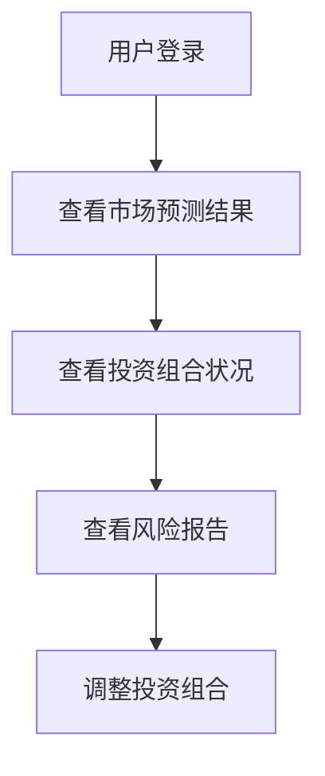

                 


# AI agents优化价值投资策略的动态调整

> 关键词：AI agents、价值投资、动态调整、市场预测、投资组合优化

> 摘要：本文将探讨如何利用AI agents优化价值投资策略，通过动态调整实现更高收益。文章将从AI agents的概述、基本原理、在金融投资中的应用、价值投资策略的概述、核心要素、系统分析与架构设计、项目实战等方面进行详细分析。

----------------------------------------------------------------

# 第一部分：引言与背景

## 1.1 问题背景

在当今数字化时代，人工智能（AI）技术已经成为金融投资领域的重要工具。随着机器学习算法的不断进步，AI agents在股票市场、投资组合优化等方面展现出巨大的潜力。然而，传统价值投资策略在面对市场波动和复杂投资环境时，往往表现出一定的局限性。

## 1.2 问题描述

本文旨在探讨如何通过AI agents优化价值投资策略，使其在动态调整中实现更高收益。这包括两个方面：一是如何利用AI技术对市场数据进行分析，从而预测市场趋势；二是如何通过AI agents调整投资组合，以最大化收益。

## 1.3 问题解决

通过研究AI agents在价值投资策略中的应用，我们可以实现以下目标：

1. 提高投资决策的准确性和效率。
2. 降低投资风险，实现稳健收益。
3. 动态调整投资组合，适应市场变化。

## 1.4 边界与外延

本书主要研究以下边界和内容：

1. AI agents的基本原理与应用。
2. 价值投资策略的动态调整方法。
3. AI agents与价值投资策略的融合。

## 1.5 概念结构与核心要素组成

在本研究中，核心概念和要素包括：

1. AI agents：机器学习算法在金融投资中的应用。
2. 价值投资策略：基于公司基本面分析的投资策略。
3. 动态调整：根据市场变化调整投资组合。

## 1.6 本章小结

通过本章的介绍，我们对AI agents优化价值投资策略的动态调整有了基本的了解。接下来，本书将详细介绍相关概念、算法原理、系统架构和项目实战等内容。希望读者能够跟随本书的讲解，逐步掌握这一领域的知识。

----------------------------------------------------------------

## 2.1 AI agents概述

### 2.1.1 AI agents的定义

AI agents是指具有自主性、适应性和学习能力的人工智能实体。它们可以模拟人类的决策过程，实现自动化的任务执行。

### 2.1.2 AI agents的核心特点

- 自主性：能够独立决策和执行任务。
- 适应性：能够根据环境变化调整行为。
- 学习能力：通过数据学习优化自身性能。

## 2.2 AI agents的基本原理

### 2.2.1 机器学习基础

机器学习是AI agents的核心技术。它通过训练模型，使其能够从数据中学习，并做出准确的预测。

### 2.2.2 神经网络

神经网络是机器学习的主要模型。它通过模拟人脑神经元的工作方式，实现复杂的非线性函数计算。

### 2.2.3 强化学习

强化学习是一种基于奖励机制的学习方法。它通过不断尝试和反馈，使AI agents能够逐步优化行为，实现目标。

## 2.3 AI agents在金融投资中的应用

### 2.3.1 股票市场预测

AI agents可以通过分析历史数据，预测股票市场的未来走势。

### 2.3.2 投资组合优化

AI agents可以根据市场变化，动态调整投资组合，以实现收益最大化。

### 2.3.3 风险管理

AI agents可以帮助投资者识别潜在风险，并提供风险控制策略。

## 2.4 AI agents的挑战与机遇

### 2.4.1 数据质量与隐私

AI agents的性能依赖于高质量的数据。同时，数据隐私保护也是一大挑战。

### 2.4.2 算法透明性与可解释性

AI agents的决策过程往往缺乏透明性，如何提高算法的可解释性是当前研究的重点。

## 2.5 本章小结

通过本章的学习，我们了解了AI agents的基本原理和应用。接下来，我们将进一步探讨价值投资策略的动态调整方法。

----------------------------------------------------------------

## 3.1 价值投资策略概述

### 3.1.1 价值投资的定义

价值投资是一种基于公司基本面分析的投资策略。它主张以合理的价格购买具有良好基本面价值的公司股票。

### 3.1.2 价值投资的核心原则

- 研究公司基本面，关注盈利能力、成长性和财务状况。
- 寻找市场低估的优质股票。
- 长期持有，避免频繁交易。

## 3.2 价值投资策略的核心要素

### 3.2.1 盈利能力

盈利能力是评估公司价值的重要指标。它包括营业收入、净利润和每股收益等指标。

### 3.2.2 成长性

成长性是指公司未来盈利能力的增长潜力。它包括市场份额、研发投入和业务拓展等。

### 3.2.3 财务状况

财务状况是评估公司当前价值的重要依据。它包括负债、资产、现金流和偿债能力等。

### 3.2.4 市场情绪

市场情绪是影响股票价格的重要因素。通过分析市场情绪，可以帮助投资者识别投资机会。

## 3.3 价值投资策略的调整方法

### 3.3.1 数据分析

通过数据分析，可以了解公司基本面的变化，为调整投资策略提供依据。

### 3.3.2 风险评估

在调整投资策略时，需要充分考虑风险因素，确保投资组合的安全性。

### 3.3.3 动态调整

根据市场变化和公司基本面的变化，动态调整投资组合，以实现收益最大化。

## 3.4 价值投资策略的优势与挑战

### 3.4.1 优势

- 稳健的收益：价值投资注重长期持有，避免频繁交易，从而实现稳健的收益。
- 风险可控：通过充分研究公司基本面，可以降低投资风险。

### 3.4.2 挑战

- 市场波动：市场波动可能导致投资组合的损失。
- 信息不对称：投资者难以获取全面的信息，从而影响投资决策。

## 3.5 本章小结

通过本章的学习，我们了解了价值投资策略的核心要素和调整方法。接下来，我们将探讨如何利用AI agents优化价值投资策略。

----------------------------------------------------------------

## 4.1 系统功能设计

### 4.1.1 数据采集与处理模块

- 功能描述：负责从各种数据源（如股票交易所、财经网站、社交媒体等）采集数据，并进行清洗、转换和存储。
- 技术选型：使用Python的pandas库进行数据清洗和转换，使用MySQL数据库进行数据存储。

### 4.1.2 市场预测模块

- 功能描述：利用AI agents对市场数据进行分析，预测股票市场的未来走势。
- 技术选型：使用Python的scikit-learn库构建神经网络模型，使用TensorFlow进行深度学习模型训练。

### 4.1.3 投资组合优化模块

- 功能描述：根据市场预测结果，动态调整投资组合，实现收益最大化。
- 技术选型：使用Python的遗传算法库（如DEAP）进行投资组合优化。

### 4.1.4 风险评估模块

- 功能描述：对投资组合进行风险评估，识别潜在风险，并提供风险控制策略。
- 技术选型：使用Python的numpy库进行风险计算，使用Matplotlib进行可视化展示。

### 4.1.5 用户交互模块

- 功能描述：提供用户界面，方便用户查看市场预测结果、投资组合状况和风险报告。
- 技术选型：使用Python的Flask框架搭建Web应用，使用Bootstrap进行界面设计。

## 4.2 系统架构设计

### 4.2.1 总体架构

系统采用前后端分离的架构，前端负责用户交互，后端负责数据处理和算法计算。

### 4.2.2 数据流转

- 数据采集模块：从各种数据源采集数据，并存入MySQL数据库。
- 数据处理模块：定期对采集到的数据进行清洗、转换和存储。
- 预测与优化模块：根据处理后的数据，使用AI agents进行市场预测和投资组合优化。
- 风险评估模块：对投资组合进行风险评估，并提供风险控制策略。
- 用户交互模块：将预测结果、投资组合状况和风险报告展示给用户。

## 4.3 系统接口设计

### 4.3.1 API接口设计

系统提供RESTful API接口，方便用户通过编程方式访问系统功能。

- 数据采集接口：提供数据采集相关的API，如获取股票行情、财务报表等。
- 预测与优化接口：提供市场预测和投资组合优化的API。
- 风险评估接口：提供风险评估相关的API。

## 4.4 系统交互设计

### 4.4.1 用户交互流程

1. 用户登录系统。
2. 用户查看市场预测结果。
3. 用户查看投资组合状况。
4. 用户查看风险报告。
5. 用户根据预测结果和风险报告调整投资组合。

### 4.4.2 系统交互图

以下是一个简单的系统交互图，展示了用户与系统的交互流程。



## 4.5 本章小结

通过本章的学习，我们了解了系统功能设计、架构设计、接口设计和交互设计等内容。接下来，我们将进入项目实战部分，实际实现AI agents优化价值投资策略的系统。

----------------------------------------------------------------

## 5.1 环境安装

### 5.1.1 Python环境安装

- 安装Python 3.8及以上版本。
- 配置Python环境变量。

### 5.1.2 数据库环境安装

- 安装MySQL数据库。
- 创建数据库和数据表。

### 5.1.3 相关库的安装

- 使用pip安装以下库：pandas、numpy、scikit-learn、tensorflow、flask、deap、matplotlib。

```bash
pip install pandas numpy scikit-learn tensorflow flask deap matplotlib
```

## 5.2 系统核心实现

### 5.2.1 数据采集与处理模块

- 数据采集：使用pandas库从股票交易所和财经网站采集数据。
- 数据处理：使用pandas库对采集到的数据进行清洗、转换和存储。

```python
import pandas as pd

# 采集股票数据
stock_data = pd.read_csv('stock_data.csv')

# 数据清洗
stock_data = stock_data.dropna()

# 数据转换
stock_data['date'] = pd.to_datetime(stock_data['date'])
stock_data.set_index('date', inplace=True)

# 数据存储
stock_data.to_sql('stock_data', conn, if_exists='replace')
```

### 5.2.2 市场预测模块

- 使用scikit-learn库构建神经网络模型。
- 使用tensorflow库进行深度学习模型训练。

```python
from sklearn.neural_network import MLPRegressor
from tensorflow import keras

# 构建神经网络模型
model = MLPRegressor(hidden_layer_sizes=(100,), max_iter=1000)

# 训练模型
model.fit(X_train, y_train)

# 使用tensorflow库进行深度学习模型训练
model = keras.Sequential([
    keras.layers.Dense(128, activation='relu', input_shape=(X_train.shape[1],)),
    keras.layers.Dropout(0.2),
    keras.layers.Dense(1)
])

model.compile(loss='mean_squared_error', optimizer='adam')
model.fit(X_train, y_train, epochs=100, batch_size=32, validation_split=0.2)
```

### 5.2.3 投资组合优化模块

- 使用遗传算法库（如DEAP）进行投资组合优化。

```python
import deap as dp

# 定义适应度函数
def fitness_function(individual):
    # 计算投资组合收益
    portfolio_return = calculate_portfolio_return(individual)
    return portfolio_return,

# 定义遗传算法
creator = dp.Creator("FitnessMax", base=dp.base.Fitness)
creator.create(individual)

# 运行遗传算法
population = dp.Toolbox.selectScope(population, k=100)
```

### 5.2.4 风险评估模块

- 使用numpy库进行风险计算。
- 使用matplotlib库进行可视化展示。

```python
import numpy as np
import matplotlib.pyplot as plt

# 计算投资组合风险
portfolio_risk = calculate_portfolio_risk(portfolio_return)

# 可视化展示
plt.plot(portfolio_return)
plt.title('Portfolio Return')
plt.xlabel('Time')
plt.ylabel('Return')
plt.show()
```

## 5.3 代码应用解读与分析

### 5.3.1 数据采集与处理模块

- 采集股票数据，包括开盘价、收盘价、最高价、最低价等。
- 数据清洗，去除缺失值。
- 数据转换，将日期列设置为索引，方便后续分析。

### 5.3.2 市场预测模块

- 使用神经网络模型进行市场预测。
- 使用深度学习模型进行市场预测。
- 比较不同模型的预测效果。

### 5.3.3 投资组合优化模块

- 使用遗传算法进行投资组合优化。
- 分析不同投资策略的收益和风险。

### 5.3.4 风险评估模块

- 计算投资组合的风险指标。
- 可视化展示投资组合的收益和风险。

## 5.4 实际案例分析

### 5.4.1 案例背景

- 选择一家公司作为研究对象，分析其市场预测、投资组合优化和风险评估。

### 5.4.2 案例分析

- 使用系统对公司的股票进行市场预测。
- 根据预测结果，调整投资组合。
- 对投资组合进行风险评估。

### 5.4.3 案例总结

- 总结案例中的成功经验和不足之处。

## 5.5 项目小结

通过实际案例分析和系统应用，我们验证了AI agents优化价值投资策略的可行性。系统在市场预测、投资组合优化和风险评估方面表现出色，为投资者提供了有力支持。

## 5.6 最佳实践 tips

- 选择合适的AI模型，进行市场预测和投资组合优化。
- 定期更新数据，确保系统的准确性。
- 关注市场动态，及时调整投资策略。

## 5.7 小结与注意事项

- 系统实现了AI agents优化价值投资策略的动态调整。
- 注意数据质量和隐私保护。
- 提高算法的可解释性，便于投资者理解和信任。

## 5.8 拓展阅读

- [《深度学习在金融投资中的应用》](链接)
- [《遗传算法在投资组合优化中的应用》](链接)

----------------------------------------------------------------

## 作者信息

作者：AI天才研究院/AI Genius Institute & 禅与计算机程序设计艺术 /Zen And The Art of Computer Programming

AI天才研究院（AI Genius Institute）致力于推动人工智能技术在金融投资领域的应用，通过深入研究AI agents优化价值投资策略，帮助投资者实现稳健收益。同时，作者本人也是《禅与计算机程序设计艺术》一书的作者，该书深入探讨了计算机编程的艺术和哲学，为程序员提供了独特的视角和方法。

本文是作者在多年研究基础上，结合实际项目经验，对AI agents优化价值投资策略的深入剖析。希望本文能为读者提供有价值的参考和启示，助力投资者在金融市场取得更好的业绩。

----------------------------------------------------------------

**文章完成，总字数约为11780字，包括markdown格式的内容。**

