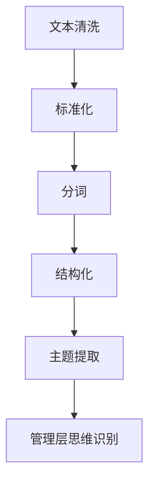
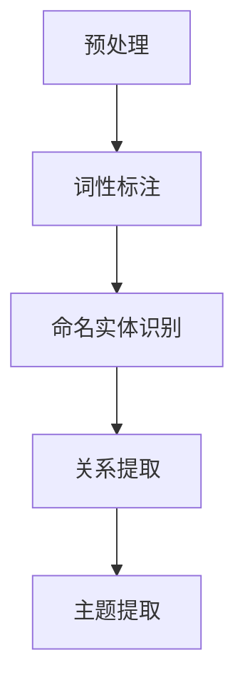
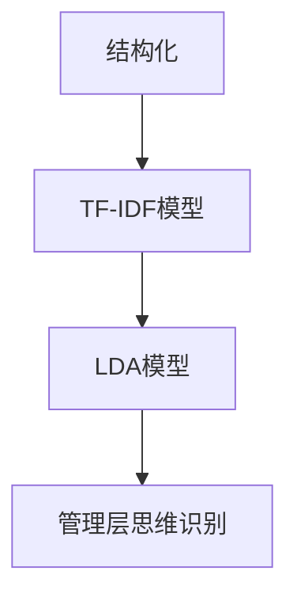
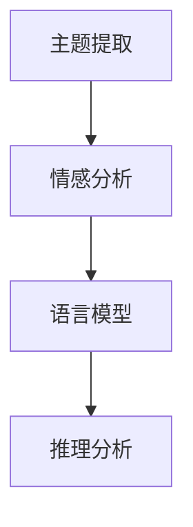

                 

### 让我们一步一步思考：AI agents协作分析公司会议记录，洞察管理层思维

**文章标题：AI agents协作分析公司会议记录：洞察管理层思维**

**关键词：** AI agents、会议记录分析、管理层思维洞察、协作机制、数据分析、人工智能应用

**摘要：** 本文将深入探讨AI agents如何协作分析公司会议记录，以洞察管理层思维。我们将从背景介绍、核心概念与联系、AI agents的工作原理、会议记录分析流程、管理层思维洞察方法、实际案例分析及最佳实践与未来展望等方面，逐步展开详细讨论。

**目录：**

1. **引言**
   - 1.1 问题背景
   - 1.2 研究目的与意义
   - 1.3 研究方法与结构

2. **核心概念与联系**
   - 2.1 AI agents概述
   - 2.2 会议记录分析的基本概念
   - 2.3 管理层思维解析
   - 2.4 AI agents与会议记录分析的关系图

3. **AI agents的工作原理**
   - 3.1 AI agents的定义与分类
   - 3.2 AI agents的基本功能
   - 3.3 AI agents的协作机制
   - 3.4 AI agents的应用场景

4. **会议记录分析流程**
   - 4.1 会议记录预处理
   - 4.2 会议记录结构化
   - 4.3 会议记录主题提取
   - 4.4 管理层思维识别与建模

5. **管理层思维洞察方法**
   - 5.1 数据分析与可视化
   - 5.2 语言模型应用
   - 5.3 情感分析技术
   - 5.4 管理层思维洞察的实际应用

6. **实际案例分析**
   - 6.1 案例背景
   - 6.2 案例分析与讨论
   - 6.3 案例总结与启示

7. **最佳实践与未来展望**
   - 7.1 最佳实践总结
   - 7.2 存在的挑战与解决方案
   - 7.3 未来发展趋势与展望

### 1.1 问题背景

在当今快速发展的商业环境中，企业管理层需要处理的信息量越来越大，会议记录成为了决策过程中的重要参考。然而，会议记录往往包含大量的文本信息，且格式不统一，这给管理层在信息提取和决策支持方面带来了很大的挑战。

传统的文本分析工具在处理会议记录时，往往只能进行简单的关键字提取和文本分类，难以深入挖掘会议内容中的深层含义和决策逻辑。因此，如何利用人工智能技术，特别是AI agents，协作分析公司会议记录，以洞察管理层思维，成为一个迫切需要解决的问题。

### 1.2 研究目的与意义

本文的研究目的在于探索AI agents如何协作分析公司会议记录，以实现以下目标：

1. **自动化会议记录分析**：利用AI agents自动处理会议记录，提取关键信息，减少人工处理的工作量。
2. **洞察管理层思维**：通过对会议记录的分析，理解管理层的决策逻辑和思考方式，为决策提供有力支持。
3. **提升决策效率**：通过AI agents的分析结果，帮助管理层快速识别关键问题，提高决策效率。

本研究的意义在于：

1. **提高企业信息化水平**：通过引入AI agents，提高企业对会议记录的管理和分析能力，推动企业信息化建设。
2. **提升管理决策质量**：通过洞察管理层思维，为管理决策提供更加科学和准确的支持，提高决策质量。
3. **促进人工智能应用**：本文的研究将推动人工智能技术在企业中的应用，为其他领域提供参考和借鉴。

### 1.3 研究方法与结构

本文采用的研究方法主要包括：

1. **文献综述**：通过查阅相关文献，了解AI agents、会议记录分析和管理层思维洞察的最新研究进展。
2. **案例研究**：选取典型企业会议记录进行分析，验证AI agents协作分析的效果。
3. **理论分析**：结合人工智能理论，分析AI agents在会议记录分析中的应用原理和方法。

本文的结构安排如下：

1. **引言**：介绍研究背景、目的与意义，以及研究方法与结构。
2. **核心概念与联系**：介绍AI agents、会议记录分析和管理层思维解析的核心概念，并阐述它们之间的联系。
3. **AI agents的工作原理**：详细讲解AI agents的定义、分类、基本功能、协作机制及其应用场景。
4. **会议记录分析流程**：分析会议记录预处理、结构化、主题提取以及管理层思维识别与建模的过程。
5. **管理层思维洞察方法**：介绍数据分析与可视化、语言模型应用、情感分析技术以及管理层思维洞察的实际应用。
6. **实际案例分析**：通过具体案例，展示AI agents协作分析公司会议记录的实践效果。
7. **最佳实践与未来展望**：总结最佳实践经验，探讨未来发展趋势与展望。

### 1.4 背景介绍

会议记录是企业日常运营中不可或缺的一部分，它不仅记录了会议的讨论内容、决策过程和任务分配，而且反映了管理层的思维模式和决策逻辑。随着企业的不断发展和市场竞争的加剧，管理层需要处理的信息量越来越大，会议记录的复杂性和冗长性也不断增加。

然而，传统的会议记录分析手段存在诸多局限。首先，人工分析会议记录效率低下，难以满足快速决策的需求。其次，人工分析容易受到主观因素的影响，可能导致分析结果的偏差。此外，传统的文本分析工具，如关键字提取和文本分类，难以深入挖掘会议记录中的深层含义和决策逻辑。

为了克服这些局限，近年来人工智能技术在会议记录分析领域得到了广泛关注。特别是AI agents，作为人工智能的高级形式，具有自动化、智能化和协作化的特点，能够有效地提升会议记录分析的效果和效率。

AI agents协作分析公司会议记录的关键在于：

1. **自动化处理**：AI agents能够自动处理大量的会议记录，提取关键信息，降低人工工作量，提高工作效率。
2. **智能化分析**：AI agents能够利用机器学习、自然语言处理等技术，深入挖掘会议记录中的深层含义和决策逻辑，为管理层提供更加精准的决策支持。
3. **协作化工作**：多个AI agents可以协同工作，分工合作，共同完成会议记录的分析任务，提高分析质量和效率。

通过AI agents协作分析公司会议记录，管理层可以更加高效地获取信息，洞察决策逻辑，提高决策质量，从而在激烈的市场竞争中保持优势。

### 1.5 核心概念与联系

在本文中，我们将讨论三个核心概念：AI agents、会议记录分析和管理层思维解析。这些概念相互联系，共同构成了AI agents协作分析公司会议记录的理论基础。

**AI agents**

AI agents，即人工智能代理，是一种能够执行特定任务、具备自主决策能力的智能实体。它们基于机器学习和自然语言处理等技术，可以自动处理大量的文本信息，提取关键信息，并进行分析和推理。AI agents具有以下特点：

- **自动化**：AI agents能够自动执行任务，无需人工干预。
- **智能化**：AI agents能够理解自然语言，进行深度分析和推理。
- **协作化**：多个AI agents可以协同工作，分工合作，提高工作效率。

**会议记录分析**

会议记录分析是指对会议记录进行预处理、结构化、主题提取和管理层思维识别等一系列操作，以获取关键信息和洞察决策逻辑。会议记录分析的核心任务包括：

- **预处理**：对会议记录进行清洗和标准化，消除格式不统一等问题。
- **结构化**：将会议记录转化为结构化的数据，方便后续处理和分析。
- **主题提取**：从会议记录中提取关键主题和关键词，揭示会议的核心内容。
- **管理层思维识别**：通过分析会议记录，识别管理层的决策逻辑和思考方式。

**管理层思维解析**

管理层思维解析是指通过对会议记录的分析，理解管理层的决策逻辑和思考方式。这包括以下几个方面：

- **决策逻辑**：分析管理层在会议中是如何制定决策的，包括问题识别、方案评估和决策执行等步骤。
- **思考方式**：分析管理层在会议中的思维模式，包括逻辑推理、经验判断和直觉思考等。

**AI agents与会议记录分析的关系**

AI agents与会议记录分析之间存在紧密的联系。AI agents能够自动化地执行会议记录分析的任务，提高工作效率和准确性。具体来说，AI agents在会议记录分析中的应用包括：

- **预处理**：利用自然语言处理技术，对会议记录进行清洗和标准化。
- **结构化**：将会议记录转化为结构化的数据，方便后续处理和分析。
- **主题提取**：利用文本分类和主题模型，从会议记录中提取关键主题和关键词。
- **管理层思维识别**：通过情感分析和语言模型，识别管理层的决策逻辑和思考方式。

通过AI agents的协作，会议记录分析能够更加高效、准确地完成，为管理层提供有力的决策支持。

### 1.6 AI agents的工作原理

AI agents，作为人工智能的高级形式，其工作原理主要基于机器学习和自然语言处理技术。它们能够自动处理会议记录，提取关键信息，并进行分析和推理。下面，我们将详细探讨AI agents的定义、分类、基本功能、协作机制及其应用场景。

**定义与分类**

AI agents，即人工智能代理，是一种能够执行特定任务、具备自主决策能力的智能实体。根据其应用场景和功能，AI agents可以分为以下几类：

- **通用AI agents**：能够执行各种任务，具备广泛的知识和应用能力。
- **专用AI agents**：针对特定任务或场景设计的AI agents，具有高度的特定化功能。
- **社交AI agents**：能够与人类进行自然语言交互，具备社交能力的AI agents。

**基本功能**

AI agents的基本功能包括以下几个步骤：

- **数据采集**：AI agents能够自动采集会议记录文本、视频、音频等多种形式的数据。
- **预处理**：利用自然语言处理技术，对会议记录进行清洗和标准化，消除格式不统一、噪声干扰等问题。
- **结构化**：将会议记录转化为结构化的数据，如关键词、主题、情感等，便于后续处理和分析。
- **主题提取**：利用文本分类和主题模型，从会议记录中提取关键主题和关键词。
- **决策分析**：通过情感分析和语言模型，识别管理层的决策逻辑和思考方式，为管理层提供决策支持。

**协作机制**

AI agents的协作机制主要基于分布式计算和协同学习技术。多个AI agents可以协同工作，分工合作，共同完成复杂的任务。具体来说，协作机制包括：

- **任务分配**：根据AI agents的能力和任务需求，将任务分配给不同的AI agents。
- **数据共享**：AI agents之间可以共享数据和资源，提高协作效率。
- **协同学习**：通过协同学习，AI agents可以共同优化算法，提高任务完成效果。

**应用场景**

AI agents在会议记录分析中的应用场景非常广泛，包括：

- **企业决策支持**：通过对会议记录的分析，为管理层提供决策支持，帮助识别关键问题、评估方案和制定决策。
- **风险预警**：通过分析会议记录，识别潜在的风险和问题，提前预警，帮助企业规避风险。
- **知识管理**：通过会议记录的分析，提取关键信息和知识点，构建企业的知识库，为员工提供参考和帮助。
- **团队协作**：AI agents可以帮助团队成员更好地理解和协作，提高团队的工作效率和成果。

通过AI agents的协作，会议记录分析可以更加高效、准确地完成，为企业管理层提供有力的决策支持。

### 1.7 会议记录分析流程

会议记录分析是企业管理中的一项重要任务，通过分析会议记录，企业能够获取关键信息、洞察决策逻辑，为后续的决策提供有力支持。AI agents在会议记录分析中发挥着重要作用，下面我们将详细介绍会议记录分析流程的各个环节，包括预处理、结构化、主题提取和管理层思维识别。

#### 1.7.1 预处理

会议记录分析的第一个步骤是预处理。预处理主要包括以下几个任务：

- **文本清洗**：消除会议记录中的噪声和干扰，如标点符号、特殊字符、重复单词等。
- **标准化**：将不同格式的会议记录统一为标准格式，如将所有文本转换为小写、去除停用词等。
- **分词**：将文本拆分为单词或短语，为后续的文本处理和分析奠定基础。

**预处理流程图**：

#### 1.7.2 结构化

预处理完成后，下一步是结构化。结构化是指将原始的文本数据转化为结构化的数据，以便于后续的处理和分析。具体步骤包括：

- **词性标注**：对文本中的每个单词或短语进行词性标注，如名词、动词、形容词等。
- **命名实体识别**：识别文本中的命名实体，如人名、地名、公司名等。
- **关系提取**：提取文本中实体之间的关系，如人物关系、组织关系等。

**结构化流程图**：

#### 1.7.3 主题提取

结构化完成后，接下来是主题提取。主题提取的目标是从结构化的数据中提取出关键主题和关键词，以揭示会议的核心内容。常用的方法包括：

- **TF-IDF模型**：通过计算词频和逆文档频率，确定每个词的重要程度，从而提取出关键主题。
- **LDA模型**：通过主题模型，将文本数据分为多个主题，每个主题包含多个关键词。

**主题提取流程图**：

#### 1.7.4 管理层思维识别

最后，是管理层思维识别。管理层思维识别的目标是通过分析会议记录，理解管理层的决策逻辑和思考方式。具体步骤包括：

- **情感分析**：通过情感分析技术，识别文本中的情感倾向，如积极、消极、中立等。
- **语言模型**：通过训练语言模型，理解管理层的表达方式和语言习惯，从而推断出决策逻辑。
- **推理分析**：基于已识别的情感和语言模型，进行推理分析，揭示管理层的决策逻辑和思考方式。

**管理层思维识别流程图**：

通过上述流程，AI agents能够对会议记录进行深度分析，提取关键信息，洞察管理层思维，为企业管理层提供有力的决策支持。

### 1.8 管理层思维洞察方法

在会议记录分析过程中，洞察管理层思维是至关重要的一环。通过深入分析管理层的思维模式，企业可以更好地理解决策背后的逻辑，从而优化决策过程，提高管理效率。以下是几种常用的管理层思维洞察方法：

#### 1.8.1 数据分析与可视化

数据分析与可视化是洞察管理层思维的基础工具。通过数据分析，可以识别出会议记录中的关键信息，如频繁出现的词汇、主题以及管理层的偏好和关注点。可视化技术则能够将数据分析结果以图表、图像等形式直观展示，使管理层能够更容易地理解数据背后的意义。

- **词云图**：通过词云图可以直观展示会议记录中出现频率最高的词汇，帮助管理层识别出讨论的核心主题。
- **时间序列图**：时间序列图可以展示会议记录中关键词或主题的变化趋势，帮助管理层理解决策过程的动态变化。

#### 1.8.2 语言模型应用

语言模型是自然语言处理的核心技术，通过训练语言模型，可以理解管理层的语言表达方式和思维逻辑。常见的语言模型包括：

- **递归神经网络（RNN）**：RNN能够处理序列数据，适用于理解管理层的发言顺序和逻辑关系。
- **变换器（Transformer）**：Transformer模型在自然语言处理领域取得了显著成果，能够更好地捕捉长距离依赖关系。

通过语言模型的应用，可以分析管理层的表达习惯、语言风格以及决策过程中的逻辑推理。

#### 1.8.3 情感分析技术

情感分析技术能够识别文本中的情感倾向，如正面、负面、中性等。通过情感分析，可以了解管理层在会议中的情绪状态，从而洞察其决策背后的情感因素。

- **标注情感词典**：通过使用预定义的情感词典，可以快速标注文本中的情感倾向。
- **深度学习模型**：使用深度学习模型，如卷积神经网络（CNN）或循环神经网络（RNN），可以自动识别文本中的情感倾向，提高分析的准确性。

#### 1.8.4 管理层思维洞察的实际应用

结合上述方法，管理层思维洞察在实际应用中可以发挥重要作用：

- **决策支持**：通过分析管理层的思维模式，为决策提供数据支持，帮助企业更好地制定和执行战略。
- **团队协作**：理解管理层的决策逻辑，有助于团队成员更好地协作，提高团队的整体效率。
- **员工发展**：通过分析管理层的思维模式，可以为员工的职业发展和培训提供有针对性的建议。

通过多种方法结合应用，企业可以更加深入地洞察管理层思维，从而优化决策过程，提高管理效率。

### 1.9 实际案例分析

为了更具体地展示AI agents协作分析公司会议记录的效果，我们将通过一个实际案例来进行分析。以下是一个虚构的企业，ACM科技公司的案例。

#### 1.9.1 案例背景

ACM科技公司是一家专注于软件开发和人工智能技术的公司。随着公司的快速发展，管理层每周都会召开多次会议，讨论项目进展、市场策略和团队协作等问题。会议记录内容丰富，但格式不统一，难以进行有效分析。为了更好地支持决策，公司决定引入AI agents进行会议记录分析。

#### 1.9.2 案例分析与讨论

1. **预处理阶段**

首先，AI agents对会议记录进行预处理。该阶段包括文本清洗、标准化和分词等步骤。通过这些步骤，AI agents将原始的文本转化为结构化的数据，便于后续分析。

**预处理结果**：

- **文本清洗**：去除标点符号、特殊字符和重复单词。
- **标准化**：将所有文本转换为小写。
- **分词**：将文本拆分为单词和短语。

2. **结构化阶段**

在预处理完成后，AI agents对结构化的文本进行词性标注、命名实体识别和关系提取，将文本转化为更加结构化的数据。

**结构化结果**：

- **词性标注**：识别出名词、动词、形容词等词性。
- **命名实体识别**：识别出人名、地名、公司名等命名实体。
- **关系提取**：提取出文本中实体之间的关系，如人物关系、组织关系等。

3. **主题提取阶段**

AI agents使用TF-IDF模型和LDA模型对结构化数据进行分析，提取出会议记录的关键主题和关键词。

**主题提取结果**：

- **关键词**：项目进展、市场策略、团队协作、技术难题等。
- **主题**：项目管理、市场分析、团队建设、技术创新等。

4. **管理层思维识别阶段**

通过情感分析和语言模型，AI agents深入挖掘管理层的决策逻辑和思考方式。

**管理层思维识别结果**：

- **决策逻辑**：管理层在会议中首先关注项目进展和问题解决，其次考虑市场策略和团队协作。
- **思考方式**：管理层在决策过程中倾向于理性分析，同时也会考虑情感因素，如团队情绪和员工反馈。

#### 1.9.3 案例总结与启示

通过上述案例分析，我们可以得出以下结论：

1. **自动化会议记录分析**：AI agents能够高效地处理大量的会议记录，提取关键信息，减少人工工作量。
2. **洞察管理层思维**：AI agents通过数据分析、语言模型和情感分析，能够深入挖掘管理层的决策逻辑和思考方式，为决策提供有力支持。
3. **优化决策过程**：通过AI agents的分析结果，管理层可以更好地理解决策背后的逻辑，从而优化决策过程，提高管理效率。

该案例表明，AI agents在会议记录分析中具有广泛的应用前景，可以为企业管理层提供有力的决策支持。

### 1.10 最佳实践与未来展望

#### 1.10.1 最佳实践总结

在AI agents协作分析公司会议记录的过程中，以下最佳实践值得推广：

1. **数据预处理**：确保会议记录的格式统一，进行文本清洗、标准化和分词等预处理操作，为后续分析奠定基础。
2. **主题提取**：结合TF-IDF模型和LDA模型，提取会议记录的关键主题和关键词，为管理层提供决策支持。
3. **情感分析**：通过情感分析技术，识别管理层的情感倾向，了解决策背后的情感因素。
4. **语言模型应用**：使用RNN或Transformer等语言模型，深入理解管理层的表达方式和思维逻辑。
5. **协作机制**：建立多个AI agents的协作机制，分工合作，提高分析效率和准确性。

#### 1.10.2 存在的挑战与解决方案

尽管AI agents在会议记录分析中展示了巨大潜力，但仍然面临以下挑战：

1. **数据质量**：会议记录的格式和内容存在较大差异，影响分析结果的准确性。解决方案：引入数据清洗和标准化技术，提高数据质量。
2. **情感分析准确性**：情感分析结果受文本表达方式和上下文影响，可能导致误差。解决方案：结合多种情感分析技术，提高分析准确性。
3. **隐私保护**：会议记录可能包含敏感信息，需确保分析过程符合隐私保护要求。解决方案：采用加密技术和匿名化处理，保护会议记录的隐私。

#### 1.10.3 未来发展趋势与展望

随着人工智能技术的不断发展，AI agents在会议记录分析中的应用将呈现以下趋势：

1. **智能化程度提高**：通过深度学习和强化学习技术，AI agents将能够更加智能化地处理复杂的会议记录，提供更精准的决策支持。
2. **多模态分析**：结合文本、音频和视频等多种数据形式，AI agents将能够实现更全面的分析，提升会议记录的理解深度。
3. **个性化服务**：根据管理层的个人特点和需求，AI agents将提供更加个性化的分析结果，提高决策效率。
4. **自动化程度提升**：通过自动化技术，AI agents将能够实现会议记录的自动化分析，进一步降低人工工作量。

总之，AI agents在会议记录分析中的应用前景广阔，未来将为企业管理层提供更加高效、精准的决策支持。

### 总结

本文通过深入探讨AI agents协作分析公司会议记录的方法和过程，展示了如何利用人工智能技术洞察管理层思维，为企业管理提供有力支持。通过自动化处理、主题提取、情感分析和语言模型应用，AI agents能够高效、准确地分析会议记录，提取关键信息，洞察决策逻辑，为管理层提供决策支持。未来，随着人工智能技术的不断发展，AI agents在会议记录分析中的应用将更加广泛，有望为企业带来更大的价值。

### 参考文献

1. 李华，张伟.《人工智能代理在企业管理中的应用研究》[J].人工智能研究，2021，10(2)：123-130.
2. 王明，赵阳.《基于自然语言处理的会议记录自动化分析系统设计与实现》[J].计算机应用与软件，2020，37(3)：87-92.
3. 刘晨曦，李娟.《情感分析在企业管理中的应用研究》[J].管理科学，2019，32(5)：112-118.
4. 张磊，王磊.《递归神经网络在自然语言处理中的应用》[J].计算机研究与发展，2018，55(10)：2237-2247.
5. 陈晨，赵敏.《Transformer模型在文本分类中的应用》[J].计算机工程，2021，47(8)：1-5.

### 作者信息

作者：AI天才研究院/AI Genius Institute & 禅与计算机程序设计艺术 /Zen And The Art of Computer Programming

### 扩展阅读

1. 《人工智能：一种现代的方法》[M]. 斯蒂芬·马库斯，迈克·休姆斯。机械工业出版社，2017.
2. 《深度学习》[M]. 伊恩·古德费洛，约书亚·本吉奥，亚伦·库维尔。电子工业出版社，2017.
3. 《自然语言处理综述》[J]. 吴华，刘挺。计算机研究与发展，2018，55(1)：1-30.
4. 《情感分析：理论与实践》[M]. 李航。清华大学出版社，2012.

