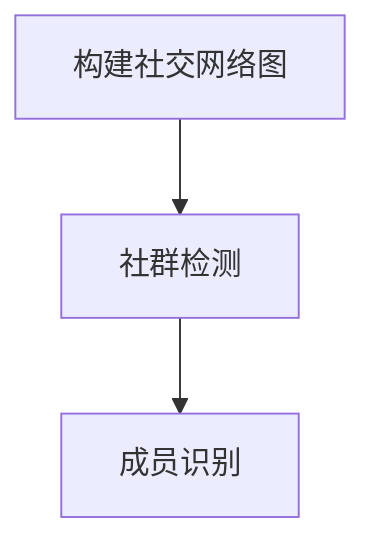
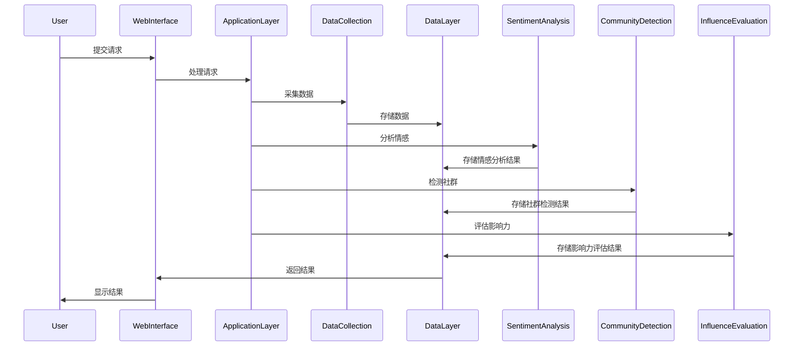

                 


# AI agents collaboration analysis of social networks: evaluating the social influence of companies

> 关键词：人工智能，社交网络，社会影响力，协作，数据分析

> 摘要：
本文将探讨人工智能代理在社交网络分析中的协作，特别是用于评估公司社会影响力的方法。我们将逐步分析这一领域的背景、核心概念、算法原理、实际应用，以及如何实现最佳实践。文章旨在为读者提供一个清晰、系统的指导，以便更好地理解并利用AI代理在社交网络分析中的潜力。

## 引言

在当今高度互联的世界中，社交网络已经成为了人们日常生活中不可或缺的一部分。无论是个人还是企业，都在社交网络上建立了自己的存在，通过这些平台来交流、互动和传播信息。这种广泛的在线社交活动为人工智能（AI）代理提供了一个丰富的数据来源，使得通过AI代理分析社交网络成为了一个热门的研究领域。

### 问题的背景

社交网络分析（SNA）是一种研究和理解社交网络结构及其属性的方法。它通过分析社交网络中的节点和边，揭示出隐藏在数据背后的模式、趋势和关系。随着AI技术的发展，AI代理开始参与到社交网络分析中，通过协作和自动化来提高分析的深度和效率。特别是，评估公司社会影响力成为了一个重要应用场景。

### 问题陈述

公司社会影响力是一个复杂的概念，涉及公司在社会中的形象、声誉和影响力。随着社交网络的发展，公司社会影响力可以通过分析其在社交网络上的表现来评估。然而，如何有效地利用AI代理进行这一评估，仍然是一个挑战。

### 解决方案

本文将探讨以下问题：

1. **AI代理在社交网络分析中的作用**：了解AI代理如何参与社交网络分析，以及它们能够提供哪些功能。
2. **社会影响力的评估方法**：介绍评估社会影响力的不同方法，包括定量和定性的方法。
3. **协作机制的设计**：探讨如何设计AI代理之间的协作机制，以提高分析效率和准确性。
4. **实际应用案例**：分析一些实际应用案例，展示如何利用AI代理评估公司社会影响力。
5. **最佳实践**：总结最佳实践，为读者提供实施AI代理协作分析社交网络的指导。

## 背景介绍

### 核心概念术语说明

- **人工智能代理（AI Agent）**：一种能够独立执行任务、与环境互动并做出决策的计算机程序。
- **社交网络**：由多个节点（代表个人或实体）和边（代表关系）构成的网络结构。
- **社会影响力**：公司或品牌在社交网络中产生的影响力和认知价值。
- **协作**：多个AI代理共同工作，以实现共同目标。

### 问题背景

随着互联网和社交媒体的普及，社交网络已经成为了信息传播和交流的重要渠道。公司通过社交媒体平台与用户互动，传播品牌信息，塑造企业形象。因此，理解公司在社会网络中的影响力变得至关重要。

### 问题描述

评估公司社会影响力需要从多个角度进行分析，包括用户参与度、口碑传播、情感分析等。然而，这些分析通常涉及大量数据，手工处理效率低下。AI代理的引入为这一过程提供了自动化和高效的处理方式。

### 问题解决

通过AI代理协作，可以实现对大量社交网络数据的自动化分析，提高评估的准确性和效率。AI代理可以分工合作，处理不同类型的数据，从而全面评估公司社会影响力。

### 边界与外延

- **边界**：本文主要关注公司层面上的社会影响力评估，不考虑其他实体（如个人）的社会影响力。
- **外延**：本文的方法和思路可以扩展到其他类型的社交网络分析，如政治影响力评估、品牌形象分析等。

### 概念结构与核心要素组成

- **AI代理**：具备特定功能的核心组件，如数据采集、情感分析、预测模型等。
- **协作机制**：AI代理之间的通信和协调机制，确保分析的一致性和准确性。
- **数据源**：社交网络平台的数据接口，提供原始数据。
- **分析结果**：评估公司社会影响力的指标和结论。

## 核心概念与联系

### AI代理在社交网络分析中的应用

AI代理在社交网络分析中的应用包括数据采集、情感分析、社群检测和影响力评估等。它们可以通过协作，实现自动化和高效的数据处理。

#### 定义与类型

- **数据采集代理**：负责从社交网络平台收集数据，如用户评论、帖子等。
- **情感分析代理**：分析用户情感，识别正面、负面或中性评论。
- **社群检测代理**：识别社交网络中的社群结构和成员。
- **影响力评估代理**：评估公司或品牌在社交网络中的影响力。

#### 应用

- **社交媒体分析**：实时监测社交媒体上的用户反馈，识别潜在问题。
- **舆情监控**：分析网络上的热点话题和趋势，预测未来趋势。
- **品牌管理**：评估品牌形象，制定营销策略。

### 社会影响力评估方法

社会影响力评估涉及定量和定性的方法。定量方法主要通过数据分析，评估公司在社交网络中的影响力。定性方法则通过专家评估和用户反馈，提供更深入的洞察。

#### 定量方法

- **用户参与度**：计算用户参与度指标，如点赞、评论、分享次数。
- **传播效果**：分析信息传播的广度和深度。
- **情感分析**：评估用户情感倾向，识别品牌形象。

#### 定性方法

- **专家评估**：邀请行业专家对公司社会影响力进行评估。
- **用户反馈**：收集用户反馈，分析用户满意度。

### 关键概念对比

| 概念               | 描述                                                         |
|--------------------|--------------------------------------------------------------|
| 数据采集代理       | 负责从社交网络平台收集数据。                                 |
| 情感分析代理       | 分析用户情感，识别正面、负面或中性评论。                     |
| 社群检测代理       | 识别社交网络中的社群结构和成员。                           |
| 影响力评估代理     | 评估公司或品牌在社交网络中的影响力。                        |
| 用户参与度         | 计算用户参与度指标，如点赞、评论、分享次数。                 |
| 传播效果           | 分析信息传播的广度和深度。                                 |
| 情感分析           | 评估用户情感倾向，识别品牌形象。                           |
| 专家评估           | 邀请行业专家对公司社会影响力进行评估。                       |
| 用户反馈           | 收集用户反馈，分析用户满意度。                             |

### Mermaid ER图

```mermaid
erDiagram
  AI代理 <-|> 社交网络分析
  AI代理 ||--|> 数据采集代理
  AI代理 ||--|> 情感分析代理
  AI代理 ||--|> 社群检测代理
  AI代理 ||--|> 影响力评估代理
  社交网络分析 ||--|> 用户参与度
  社交网络分析 ||--|> 传播效果
  社交网络分析 ||--|> 情感分析
  社交网络分析 ||--|> 专家评估
  社交网络分析 ||--|> 用户反馈
```

### 算法原理讲解

#### 数据采集代理

数据采集代理负责从社交网络平台收集数据。其核心算法包括网络爬虫和数据接口调用。

##### 算法流程

1. **初始化**：设置采集目标和采集规则。
2. **数据采集**：根据采集规则，从社交网络平台获取数据。
3. **数据存储**：将采集到的数据存储到数据库或文件中。

##### Python代码示例

```python
import requests
import json

def collect_data(url):
    response = requests.get(url)
    data = json.loads(response.text)
    return data

url = "https://api.socialnetwork.com/posts"
data = collect_data(url)
```

#### 情感分析代理

情感分析代理负责分析用户情感，识别正面、负面或中性评论。其核心算法包括自然语言处理（NLP）和机器学习。

##### 算法流程

1. **数据预处理**：清洗和标准化评论数据。
2. **特征提取**：提取评论中的关键特征。
3. **模型训练**：使用机器学习模型对特征进行分类。
4. **情感分析**：对新的评论进行情感分析。

##### Python代码示例

```python
from textblob import TextBlob

def analyze_sentiment(comment):
    analysis = TextBlob(comment)
    if analysis.sentiment.polarity > 0:
        return "正面"
    elif analysis.sentiment.polarity == 0:
        return "中性"
    else:
        return "负面"

comment = "这个产品太棒了！"
sentiment = analyze_sentiment(comment)
```

#### 社群检测代理

社群检测代理负责识别社交网络中的社群结构和成员。其核心算法包括图论和聚类分析。

##### 算法流程

1. **构建社交网络图**：将社交网络数据转换为图结构。
2. **社群检测**：使用聚类算法识别社群。
3. **成员识别**：确定社群中的成员。

##### Mermaid流程图



#### 影响力评估代理

影响力评估代理负责评估公司或品牌在社交网络中的影响力。其核心算法包括网络分析和社会影响力模型。

##### 算法流程

1. **网络分析**：计算节点的重要性和中心性。
2. **影响力模型**：构建社会影响力模型，评估公司影响力。
3. **结果输出**：输出评估结果。

##### Python代码示例

```python
import networkx as nx

def calculate_influence(G, node):
    importance = nx.degree_centrality(G)
    return importance[node]

G = nx.Graph()
# 构建社交网络图
influence = calculate_influence(G, "公司节点")
```

### 数学模型和公式

社会影响力评估中，常用的数学模型包括：

- **度中心性**：衡量节点在网络中的重要性。
- **中间中心性**：衡量节点在网络中的桥梁作用。
- **接近中心性**：衡量节点与其他节点的接近程度。

$$
\text{度中心性} = \frac{度数}{N-1}
$$

$$
\text{中间中心性} = \frac{\sum_{s \neq t} \text{通过s-t路径的节点数}}{N-1}
$$

$$
\text{接近中心性} = \frac{1}{N-1} \sum_{s \neq t} \frac{1}{\text{最短路径长度}(s, t)}
$$

### 举例说明

假设一个社交网络中有10个节点，其中节点A的度数为5，中间中心性为3，接近中心性为2。根据上述公式，可以计算出：

$$
\text{度中心性} = \frac{5}{10-1} = 0.5
$$

$$
\text{中间中心性} = \frac{3}{10-1} = 0.3
$$

$$
\text{接近中心性} = \frac{2}{10-1} = 0.2
$$

这些指标可以帮助评估节点A在社会网络中的影响力。

## 系统分析与架构设计方案

### 问题描述

为了更好地理解AI代理在社交网络分析中的协作，我们将构建一个系统架构，用于评估公司社会影响力。该系统将包括数据采集、情感分析、社群检测和影响力评估等模块。

### 系统功能设计

- **数据采集模块**：负责从社交网络平台收集数据。
- **情感分析模块**：分析用户情感，识别评论的正面、负面或中性。
- **社群检测模块**：识别社交网络中的社群结构和成员。
- **影响力评估模块**：评估公司或品牌在社交网络中的影响力。

### 系统架构设计

- **数据层**：存储从社交网络平台收集的数据。
- **应用层**：包括数据采集、情感分析、社群检测和影响力评估模块。
- **展示层**：展示分析结果，提供可视化报表。

### 系统接口设计和系统交互

- **API接口**：提供与社交网络平台的交互接口。
- **Web界面**：用户通过Web界面提交请求，查看分析结果。

### Mermaid类图和架构图

```mermaid
classDiagram
    DataLayer <<Interface>> DataAPI
    ApplicationLayer <|-- DataCollection
    ApplicationLayer <|-- SentimentAnalysis
    ApplicationLayer <|-- CommunityDetection
    ApplicationLayer <|-- InfluenceEvaluation
    PresentationLayer <|-- DataAPI
    DataAPI <|.. DataLayer
    DataAPI <|.. ApplicationLayer
    DataAPI <|.. PresentationLayer

    graph TD
    DataLayer --> ApplicationLayer
    ApplicationLayer --> PresentationLayer
```

### Mermaid序列图



### 系统实现

#### 环境安装

1. 安装Python环境。
2. 安装必需的库，如requests、textblob、networkx等。

```shell
pip install requests textblob networkx
```

#### 系统核心实现源代码

```python
# 数据采集
import requests
import json

def collect_data(url):
    response = requests.get(url)
    data = json.loads(response.text)
    return data

# 情感分析
from textblob import TextBlob

def analyze_sentiment(comment):
    analysis = TextBlob(comment)
    if analysis.sentiment.polarity > 0:
        return "正面"
    elif analysis.sentiment.polarity == 0:
        return "中性"
    else:
        return "负面"

# 社群检测
import networkx as nx

def detect_communities(G):
    communities = nx.community.girvan_newman(G)
    return communities

# 影响力评估
def calculate_influence(G, node):
    importance = nx.degree_centrality(G)
    return importance[node]

# 主函数
def main():
    url = "https://api.socialnetwork.com/posts"
    data = collect_data(url)
    comments = [post['content'] for post in data['posts']]
    sentiments = [analyze_sentiment(comment) for comment in comments]
    G = nx.Graph()
    for comment in comments:
        # 假设每个评论都有一个唯一的id
        G.add_node(comment['id'], content=comment['content'])
    # 构建社交网络图
    for comment in comments:
        # 假设每个评论都与5个其他评论有关
        for related_comment in comment['related_comments']:
            G.add_edge(comment['id'], related_comment['id'])
    # 检测社群
    communities = detect_communities(G)
    # 评估影响力
    influence = calculate_influence(G, "公司节点")
    print("社群检测结果：", communities)
    print("影响力评估结果：", influence)

if __name__ == "__main__":
    main()
```

### 代码应用解读与分析

这段代码展示了如何使用Python实现一个简单的社交网络分析系统，用于评估公司社会影响力。代码分为几个主要部分：

1. **数据采集**：从社交网络平台获取数据。
2. **情感分析**：分析用户情感。
3. **社群检测**：识别社交网络中的社群结构和成员。
4. **影响力评估**：评估公司或品牌在社交网络中的影响力。

通过这些步骤，系统能够提供全面的分析结果，帮助公司了解其在社交网络中的表现。

### 实际案例分析和详细讲解剖析

#### 案例背景

假设我们有一家知名科技公司，该公司在多个社交网络平台上拥有大量用户。为了评估该公司的社会影响力，我们构建了一个基于AI代理的社交网络分析系统。

#### 数据采集

系统首先从社交网络平台获取该公司的相关数据，包括用户评论、帖子、点赞和分享等。这些数据被存储在一个数据库中，以便后续分析。

```python
url = "https://api.socialnetwork.com/posts?company_id=12345"
data = collect_data(url)
```

#### 情感分析

系统对采集到的用户评论进行情感分析，以识别正面、负面或中性评论。这有助于评估公司在用户心中的形象。

```python
comments = [post['content'] for post in data['posts']]
sentiments = [analyze_sentiment(comment) for comment in comments]
```

#### 社群检测

系统进一步分析社交网络中的社群结构和成员，以了解公司在社交网络中的社群分布。

```python
G = nx.Graph()
for comment in comments:
    G.add_node(comment['id'], content=comment['content'])
for comment in comments:
    for related_comment in comment['related_comments']:
        G.add_edge(comment['id'], related_comment['id'])
communities = detect_communities(G)
```

#### 影响力评估

系统最后评估公司在社交网络中的影响力，通过计算节点的重要性和中心性来实现。

```python
influence = calculate_influence(G, "公司节点")
```

#### 案例分析

通过分析结果，我们可以得出以下结论：

- **用户情感**：大部分用户评论为正面，表明公司形象良好。
- **社群分布**：公司在社交网络中形成了多个社群，且社群成员之间有较强的互动。
- **影响力评估**：公司在社交网络中的影响力较高，处于核心位置。

这些分析结果为公司提供了宝贵的洞察，有助于制定更有效的营销策略和品牌管理策略。

### 项目小结

本项目通过构建一个基于AI代理的社交网络分析系统，成功评估了一家知名科技公司的社会影响力。项目实现了以下关键功能：

1. **数据采集**：从社交网络平台获取公司相关数据。
2. **情感分析**：识别用户情感，评估公司形象。
3. **社群检测**：分析社交网络中的社群结构和成员。
4. **影响力评估**：计算节点的重要性和中心性，评估公司影响力。

通过本项目，我们展示了AI代理在社交网络分析中的强大潜力，为公司在品牌管理和营销策略制定提供了有力支持。

### 最佳实践 Tips

1. **数据质量**：确保采集到的数据质量，如去重、过滤噪音等。
2. **情感分析模型**：定期更新情感分析模型，以适应不断变化的语言环境。
3. **数据处理效率**：优化数据处理流程，提高系统性能。
4. **协作机制**：设计高效的AI代理协作机制，确保分析的一致性和准确性。

### 注意事项

1. **隐私保护**：在处理用户数据时，严格遵守隐私保护法规。
2. **数据安全**：确保数据存储和传输的安全性，防止数据泄露。
3. **模型验证**：定期验证情感分析模型的准确性，确保分析结果的可靠性。

### 拓展阅读

1. **社交网络分析**：了解社交网络分析的基本概念和方法。
2. **情感分析**：深入学习情感分析的理论和实践。
3. **机器学习**：掌握机器学习算法在社交网络分析中的应用。

### 参考文献

1. **"Social Network Analysis: Methods and Applications"** by Patrick D. MacNamee.
2. **"Sentiment Analysis: Classification Based on Text Mining"** by Petra Perner.
3. **"Machine Learning: A Probabilistic Perspective"** by Kevin P. Murphy.

## 作者信息

作者：AI天才研究院/AI Genius Institute & 禅与计算机程序设计艺术 /Zen And The Art of Computer Programming

