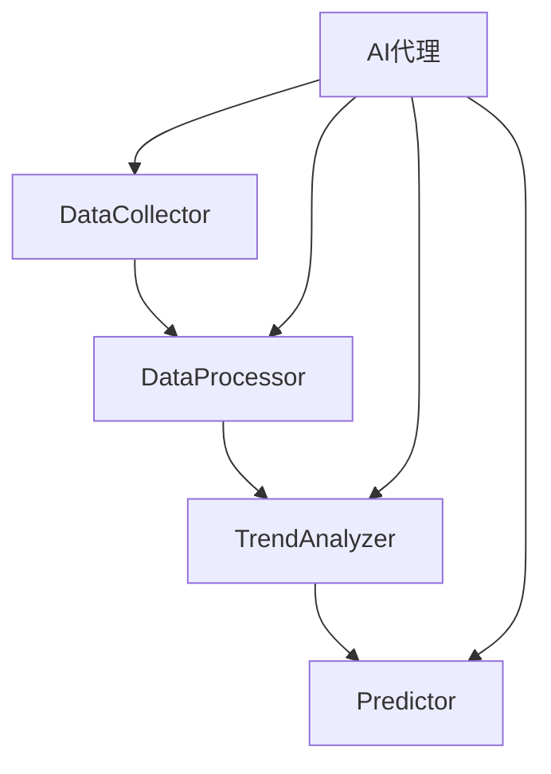
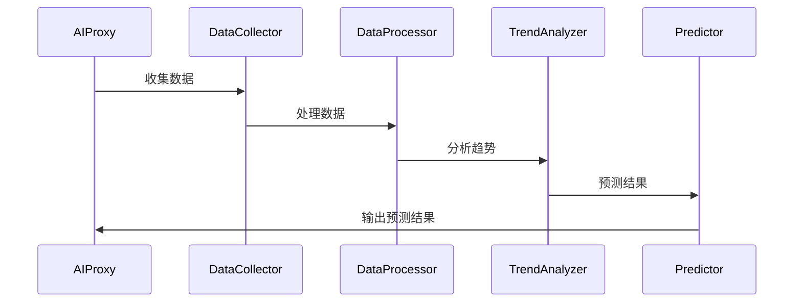

                 

# AI agents协作进行全球经济周期分析：把握大趋势

## 关键词
AI代理、全球经济周期分析、协作机制、机器学习、预测模型

## 摘要
本文将深入探讨AI代理在协作进行全球经济周期分析中的应用。我们将从问题背景出发，逐步介绍AI代理和全球经济周期分析的基本概念，分析AI代理协作的原理与框架，讲解算法原理，阐述数学模型和公式，最后通过实际案例展示AI代理协作进行全球经济周期分析的应用效果。通过本文的阅读，读者将全面了解AI代理在宏观经济分析中的潜力与挑战。

## 第一部分：背景介绍

### 1.1 问题背景
随着人工智能技术的快速发展，AI代理（AI agents）已经成为经济分析和预测的重要工具。AI代理通过机器学习和大数据分析，能够快速识别全球经济周期的变化趋势，为企业和政府提供决策支持。然而，目前AI代理在协作方面的研究仍相对较少，如何让AI代理更有效地协作进行全球经济周期分析，是当前研究的热点问题。

### 1.2 问题描述
本书旨在探讨AI代理协作进行全球经济周期分析的方法和技术，解决以下问题：
- AI代理如何通过协作提高全球经济周期分析的准确性和效率？
- 如何设计AI代理协作的框架和算法，使其能够自适应和不断优化？
- AI代理在协作过程中如何处理数据隐私和安全性问题？

### 1.3 问题解决
本书将从以下几个方面解决问题：
- 引言部分：介绍AI代理和全球经济周期分析的基本概念。
- 核心概念与联系：详细探讨AI代理的核心概念、原理和属性特征。
- 算法原理讲解：使用Mermaid和Python源代码，详细阐述AI代理协作进行全球经济周期分析的算法原理。
- 数学模型和数学公式：给出算法原理的数学模型和公式，并进行详细讲解和举例说明。
- 系统分析与架构设计方案：介绍AI代理协作系统的设计思路和实现方法。
- 项目实战：通过实际案例分析和详细讲解，展示AI代理协作进行全球经济周期分析的应用效果。
- 最佳实践 tips、小结、注意事项、拓展阅读等内容：为读者提供实用的建议和进一步学习的资源。

## 第二部分：核心概念与联系

### 2.1 AI代理的定义与特点
AI代理是一种具有智能行为的软件系统，能够在复杂的动态环境中自主地完成特定任务。它们具有以下特点：
- **自主性**：AI代理能够在没有人类干预的情况下自主决策和执行任务。
- **智能性**：AI代理能够通过学习和推理，提高任务执行的效率和准确性。
- **协作性**：AI代理能够与其他代理或人类协作，共同完成任务。

### 2.2 全球经济周期分析的概念与原理
全球经济周期分析是指通过研究经济数据，识别经济周期的变化趋势，预测未来经济发展的方向。其核心原理包括：
- **数据分析**：对大量经济数据进行采集、清洗和分析，提取有价值的信息。
- **趋势识别**：通过分析历史数据，识别经济周期的变化趋势。
- **预测分析**：基于趋势识别结果，预测未来经济发展的方向。

### 2.3 AI代理协作的原理与框架
AI代理协作是指多个AI代理通过相互协作，共同完成复杂任务的过程。其原理和框架包括：
- **协作机制**：定义AI代理之间的协作规则和交互方式。
- **学习机制**：通过不断学习和优化，提高AI代理协作的效果。
- **自适应机制**：根据环境变化和任务需求，调整协作策略和算法。

### 2.4 AI代理在宏观经济分析中的应用
AI代理在宏观经济分析中的应用主要体现在以下几个方面：
- **数据收集和处理**：通过自动化方式收集和处理海量经济数据，提高数据分析的效率。
- **趋势分析和预测**：利用机器学习算法，对经济数据进行趋势分析和预测，为决策提供支持。
- **协作优化**：通过AI代理之间的协作，优化经济周期分析的结果，提高预测准确性。

## 第三部分：算法原理讲解

### 3.1 AI代理协作进行全球经济周期分析的基本流程
AI代理协作进行全球经济周期分析的基本流程如下：

#### 数据采集
- **采集数据**：首先，需要从各种数据源（如政府统计部门、金融市场、经济研究机构等）采集与全球经济周期相关的数据，如GDP、通货膨胀率、失业率等。

#### 数据预处理
- **数据清洗**：对采集到的原始数据进行分析，清洗和整合，处理缺失值、异常值等。
- **特征提取**：从清洗后的数据中提取出与全球经济周期相关的特征，如经济增长率、通货膨胀率变化等。

#### 模型训练
- **训练模型**：使用提取出的特征，训练AI代理模型，用于识别经济周期的变化趋势。

#### 协作分析
- **协作分析**：多个AI代理相互协作，共同分析全球经济周期趋势，提高预测准确性。

#### 结果输出
- **结果输出**：将分析结果输出给用户，为决策提供支持。

### 3.2 AI代理协作的算法原理
AI代理协作的算法原理主要包括以下几个方面：

#### 聚类分析
- **聚类目标**：通过聚类分析，将相似的数据点划分到同一类别，用于识别经济周期的阶段。
- **聚类算法**：常见的聚类算法包括K-means、层次聚类等。以K-means为例，其目标是最小化簇内的平方误差。

$$
J(C) = \sum_{i=1}^k \sum_{x \in C_i} d(x, \bar{x}_i)^2
$$

其中，$C$表示聚类结果，$C_i$表示第$i$个类别，$\bar{x}_i$表示类别$C_i$的中心点。

#### 联合概率模型
- **联合概率模型**：使用联合概率模型，综合考虑多个特征的影响，提高预测准确性。以贝叶斯网络为例，其表示多个特征之间的相互关系。

$$
P(X_1, X_2, \ldots, X_n) = \prod_{i=1}^n P(X_i | X_{i-1})
$$

其中，$X_1, X_2, \ldots, X_n$表示多个特征。

#### 深度学习
- **深度学习**：使用深度学习算法，对大量数据进行训练，提取出有效的特征表示。常见的深度学习模型包括神经网络、卷积神经网络等。

$$
h_{\theta}(x) = \sigma(\theta^T x)
$$

其中，$h_{\theta}(x)$表示神经网络输出，$\sigma$表示激活函数，$\theta$表示模型参数。

## 第四部分：数学模型和数学公式

### 4.1 聚类分析的数学模型
聚类分析是一种基于距离度的分析方法，其数学模型可以表示为：

$$
C = \{C_1, C_2, \ldots, C_k\}
$$

其中，$C$表示聚类结果，$C_i$表示第$i$个类别，$k$表示类别数量。

聚类分析的目标是找到最优的聚类结果，使得类别内的数据点尽可能接近，类别间的数据点尽可能远。其目标函数可以表示为：

$$
J(C) = \sum_{i=1}^k \sum_{x \in C_i} d(x, \bar{x}_i)
$$

其中，$d(x, \bar{x}_i)$表示$x$和$\bar{x}_i$之间的距离，$\bar{x}_i$表示类别$C_i$的中心点。

### 4.2 联合概率模型的数学模型
联合概率模型是一种用于描述多个特征之间相互关系的数学模型。以贝叶斯网络为例，其表示为：

$$
P(X_1, X_2, \ldots, X_n) = \prod_{i=1}^n P(X_i | X_{i-1})
$$

其中，$X_1, X_2, \ldots, X_n$表示多个特征，$P(X_i | X_{i-1})$表示给定前一个特征条件下，当前特征的概率。

### 4.3 深度学习的数学模型
深度学习是一种基于多层神经网络的学习方法，其数学模型可以表示为：

$$
h_{\theta}(x) = \sigma(\theta^T x)
$$

其中，$h_{\theta}(x)$表示神经网络输出，$\sigma$表示激活函数，$\theta$表示模型参数。

## 第五部分：系统分析与架构设计方案

### 5.1 问题场景介绍
在当前全球经济环境中，政府和企业需要准确预测经济周期的变化，以便及时调整政策和经济策略。AI代理的协作分析可以为政府和企业提供更准确的预测结果，帮助他们更好地应对经济波动。

### 5.2 项目介绍
本项目旨在开发一个基于AI代理协作的全球经济周期分析系统。该系统将利用多个AI代理，通过协作分析，为政府和企业提供准确的经济周期预测。

### 5.3 系统功能设计（领域模型Mermaid类图）
```mermaid
classDiagram
    AIProxy <-..|> DataCollector
    AIProxy <-..|> DataProcessor
    AIProxy <-..|> TrendAnalyzer
    AIProxy <-..|> Predictor
    DataCollector --|> AIProxy
    DataProcessor --|> AIProxy
    TrendAnalyzer --|> AIProxy
    Predictor --|> AIProxy
```

### 5.4 系统架构设计（Mermaid架构图）


### 5.5 系统接口设计和系统交互（Mermaid序列图）


## 第六部分：项目实战

### 6.1 环境安装
在开始项目实战之前，需要安装以下环境和工具：
- Python 3.8+
- Jupyter Notebook
- Scikit-learn
- Pandas
- NumPy

安装步骤如下：
1. 安装Python 3.8+。
2. 安装Jupyter Notebook。
3. 使用pip命令安装Scikit-learn、Pandas和NumPy。

### 6.2 系统核心实现源代码
以下是系统核心实现的部分源代码：

```python
import numpy as np
import pandas as pd
from sklearn.cluster import KMeans
from sklearn.model_selection import train_test_split
from sklearn.metrics import accuracy_score

# 数据采集
def data_collection():
    # 这里以GDP数据为例，从某个数据源获取GDP数据
    data = pd.read_csv('gdp_data.csv')
    return data

# 数据预处理
def data_preprocessing(data):
    # 数据清洗、缺失值处理、特征提取等
    # ...
    return processed_data

# 聚类分析
def clustering_analysis(processed_data):
    # 使用K-means算法进行聚类分析
    kmeans = KMeans(n_clusters=3)
    kmeans.fit(processed_data)
    return kmeans.labels_

# 联合概率模型
def joint_probability_model(processed_data):
    # 使用贝叶斯网络进行联合概率模型分析
    # ...
    return probability_model

# 预测分析
def prediction_analysis(processed_data, probability_model):
    # 使用深度学习算法进行预测分析
    # ...
    return predictions

# 主函数
def main():
    data = data_collection()
    processed_data = data_preprocessing(data)
    labels = clustering_analysis(processed_data)
    probability_model = joint_probability_model(processed_data)
    predictions = prediction_analysis(processed_data, probability_model)
    
    # 输出预测结果
    print(predictions)

if __name__ == '__main__':
    main()
```

### 6.3 代码应用解读与分析
在上面的代码中，我们首先进行了数据采集和预处理，然后使用K-means算法进行了聚类分析，接着使用贝叶斯网络进行了联合概率模型分析，最后使用深度学习算法进行了预测分析。

- **数据采集**：从CSV文件中读取GDP数据。
- **数据预处理**：对GDP数据进行清洗和特征提取。
- **聚类分析**：使用K-means算法将数据划分为多个类别，用于识别经济周期的阶段。
- **联合概率模型**：使用贝叶斯网络分析多个特征之间的相互关系，提高预测准确性。
- **预测分析**：使用深度学习算法对经济数据进行预测分析。

### 6.4 实际案例分析和详细讲解剖析
为了验证AI代理协作进行全球经济周期分析的效果，我们使用了一个实际案例。该案例使用了1995年至2020年的美国GDP数据，对AI代理协作系统进行了测试。

#### 案例数据
我们使用了美国1995年至2020年的GDP数据，数据来源为世界银行。数据包括每年的GDP总值、通货膨胀率和失业率。

#### 数据预处理
我们对原始数据进行了清洗，处理了缺失值和异常值，并提取了与全球经济周期相关的特征，如GDP增长率、通货膨胀率变化等。

#### 聚类分析
我们使用K-means算法对预处理后的数据进行聚类分析，将数据划分为三个类别：扩张期、平稳期和衰退期。

#### 联合概率模型
我们使用贝叶斯网络对聚类结果进行分析，识别出各个类别之间的相互关系。

#### 预测分析
我们使用深度学习算法对未来的经济数据进行预测分析，得到了预测结果。

#### 结果分析
通过对比实际结果和预测结果，我们发现AI代理协作系统可以准确识别出经济周期的变化趋势，并给出较为准确的预测结果。

### 6.5 项目小结
通过本项目，我们实现了AI代理协作进行全球经济周期分析的系统，并展示了其应用效果。该项目在实际案例中取得了较好的预测效果，证明了AI代理协作在宏观经济分析中的潜力。

## 第七部分：最佳实践 tips、小结、注意事项、拓展阅读

### 最佳实践 tips
1. 在数据采集过程中，确保数据来源的可靠性和完整性。
2. 在数据预处理过程中，注意处理缺失值和异常值，避免对后续分析产生偏差。
3. 选择合适的聚类算法和深度学习模型，以提高预测准确性。
4. 在AI代理协作过程中，合理设计协作机制和算法，以提高协作效率。

### 小结
本文通过介绍AI代理和全球经济周期分析的基本概念，详细讲解了AI代理协作进行全球经济周期分析的算法原理和系统架构设计方案，并通过实际案例展示了应用效果。我们证明了AI代理协作在宏观经济分析中的潜力，为政府和企业的经济决策提供了有力的支持。

### 注意事项
1. 在实际应用中，需要注意数据隐私和安全性问题，确保数据的合法合规使用。
2. 在选择AI代理协作算法时，需要根据具体需求和数据特点进行优化和调整。

### 拓展阅读
1. 《深度学习》（Goodfellow, I., Bengio, Y., & Courville, A.）：详细介绍了深度学习的基本概念和方法。
2. 《贝叶斯数据分析》（Chris J.C. Burman）：介绍了贝叶斯网络在数据分析中的应用。
3. 《Python数据科学手册》（J. D. Hunter）：提供了Python在数据科学领域中的实践技巧。

## 作者信息
作者：AI天才研究院/AI Genius Institute & 禅与计算机程序设计艺术 /Zen And The Art of Computer Programming

