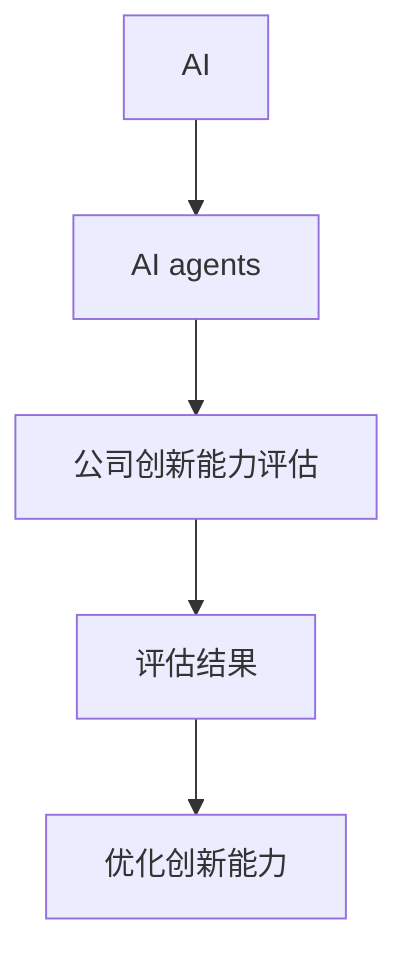
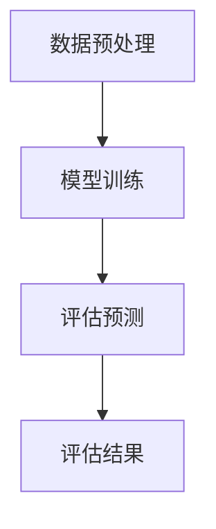
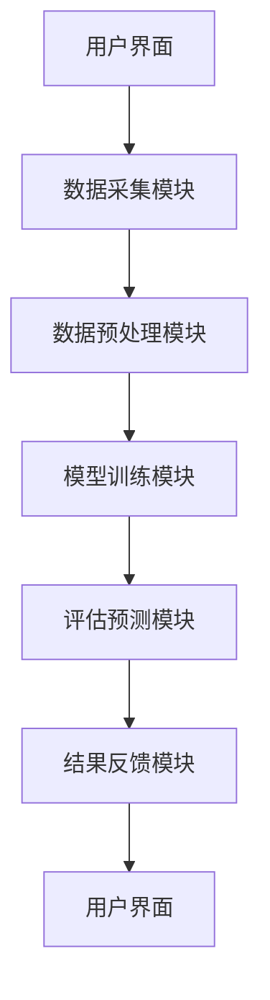
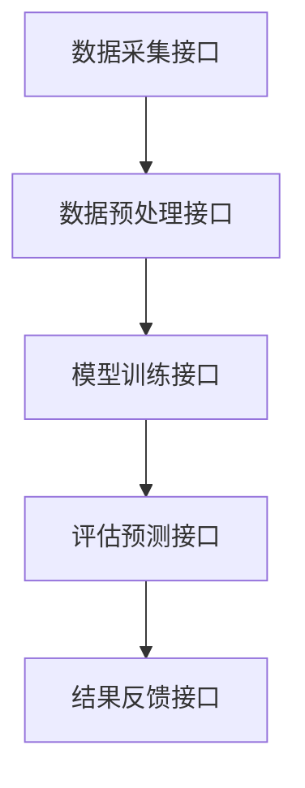
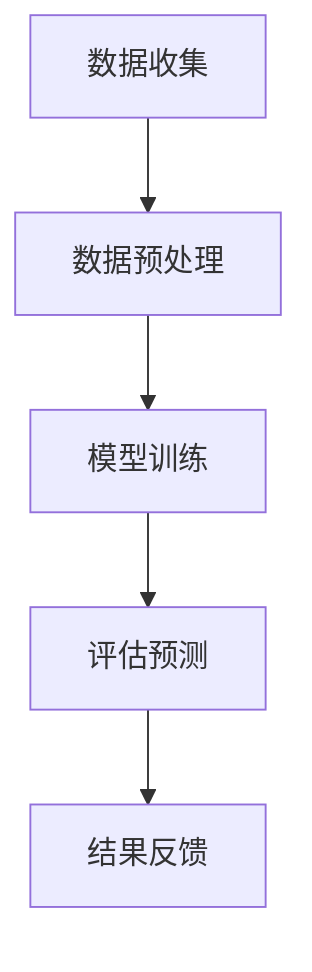
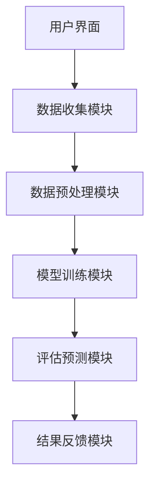
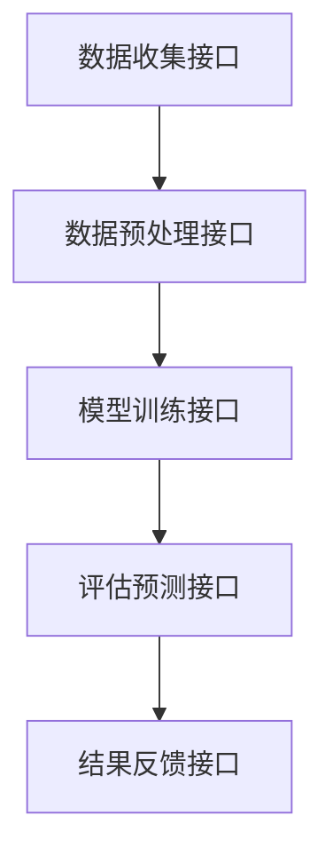

                 


# AI agents在公司创新能力评估中的应用

> 关键词：AI agents、公司创新能力评估、算法原理、系统架构、项目实战

> 摘要：本文深入探讨了AI agents在公司创新能力评估中的应用。通过逐步分析AI agents的背景、核心概念、算法原理、系统架构和实际案例，本文揭示了AI agents在提升公司创新能力方面的巨大潜力，为读者提供了宝贵的技术参考。

## Step 1: 背景介绍

AI，作为当今科技领域的明星，已经深刻地改变了我们的工作和生活方式。从自然语言处理到图像识别，从自动驾驶到智能客服，AI的应用场景越来越广泛。而在公司创新能力评估中，AI agents也发挥着越来越重要的作用。

AI agents，也称为人工智能代理，是能够模拟人类智能行为的软件程序。它们能够通过学习和理解，自主地完成复杂的任务，从而帮助企业快速评估自身的创新能力。那么，为什么AI agents在公司创新能力评估中具有重要意义呢？

首先，AI agents能够处理大量的数据，快速地识别和挖掘出隐藏在数据中的有价值信息。这些信息可以帮助企业了解自身的优势和不足，从而有针对性地提升创新能力。

其次，AI agents具有自主学习和优化的能力。通过不断地学习和实践，AI agents能够不断提高自身的评估精度和效率，为企业提供更准确的创新能力评估结果。

最后，AI agents能够与其他系统集成，实现自动化评估和决策。这不仅可以提高评估效率，还可以减少人为干预，降低评估误差。

## Step 2: 核心概念与联系

在深入了解AI agents在公司创新能力评估中的应用之前，我们需要先了解几个核心概念：AI、AI agents和公司创新能力评估。

AI，即人工智能，是一种模拟人类智能行为的计算机系统。它能够通过学习和理解，自主地完成复杂的任务。

AI agents，是AI的一种特殊形式，是能够模拟人类智能行为的软件程序。它们能够自主地学习和优化，完成复杂的任务。

公司创新能力评估，是指对企业创新能力进行评估的过程。它旨在帮助企业了解自身的创新能力，从而有针对性地提升创新能力。

下面是一个使用Mermaid流程图展示AI agents在公司创新能力评估中的应用流程：



## Step 3: 算法原理讲解

### AI agent算法原理

AI agents的算法原理主要包括数据预处理、模型训练和评估预测三个步骤。

首先，数据预处理。这一步主要是对原始数据进行分析和清洗，以便为模型训练提供高质量的数据。

其次，模型训练。这一步主要是使用预处理的训练数据，通过神经网络等机器学习算法，训练出能够进行评估预测的模型。

最后，评估预测。这一步主要是使用训练好的模型，对新的数据进行评估预测，从而得出评估结果。

下面是一个使用Mermaid流程图展示AI agent算法原理的例子：



### Python源代码

下面是一个使用Python源代码展示AI agent算法流程的例子：

```python
import pandas as pd
from sklearn.model_selection import train_test_split
from sklearn.ensemble import RandomForestClassifier
from sklearn.metrics import accuracy_score

# 数据预处理
def preprocess_data(data):
    # 进行数据清洗、填充、转换等操作
    # ...
    return processed_data

# 模型训练
def train_model(train_data, train_label):
    # 使用随机森林算法进行模型训练
    model = RandomForestClassifier()
    model.fit(train_data, train_label)
    return model

# 评估预测
def predict(model, test_data):
    # 使用训练好的模型进行评估预测
    pred_label = model.predict(test_data)
    return pred_label

# 加载数据
data = pd.read_csv('data.csv')
processed_data = preprocess_data(data)

# 划分训练集和测试集
train_data, test_data, train_label, test_label = train_test_split(processed_data, data['label'], test_size=0.2, random_state=42)

# 训练模型
model = train_model(train_data, train_label)

# 进行评估预测
pred_label = predict(model, test_data)

# 计算准确率
accuracy = accuracy_score(test_label, pred_label)
print('Accuracy:', accuracy)
```

### 数学模型和公式

在AI agents的算法原理中，我们通常会使用以下数学模型和公式：

1. 神经网络模型

   $$y = f(z)$$

   其中，$y$ 是输出结果，$z$ 是输入向量，$f(z)$ 是激活函数。

2. 损失函数

   $$L = -\sum_{i=1}^{n}y_i \log(p_i)$$

   其中，$y_i$ 是真实标签，$p_i$ 是预测概率。

3. 优化算法

   $$w_{new} = w_{old} - \alpha \cdot \nabla_w L$$

   其中，$w_{old}$ 是旧权重，$\alpha$ 是学习率，$\nabla_w L$ 是损失函数关于权重 $w$ 的梯度。

## Step 4: 系统分析与架构设计方案

### AI agent在公司创新能力评估系统中的角色

AI agent在公司创新能力评估系统中扮演着重要的角色。它主要负责以下任务：

1. 数据预处理：对原始数据进行清洗、填充和转换，为模型训练提供高质量的数据。

2. 模型训练：使用预处理的训练数据，通过神经网络等机器学习算法，训练出能够进行评估预测的模型。

3. 评估预测：使用训练好的模型，对新的数据进行评估预测，从而得出评估结果。

4. 结果反馈：将评估结果反馈给企业，帮助企业了解自身的创新能力，从而有针对性地提升创新能力。

### 系统架构设计

下面是一个使用Mermaid流程图展示AI agent在公司创新能力评估系统中的架构设计：



### 系统接口设计

下面是一个使用Mermaid流程图展示AI agent在公司创新能力评估系统中的接口设计：



### 系统交互

下面是一个使用Mermaid流程图展示AI agent在公司创新能力评估系统中的交互设计：


## Step 5: 项目实战

### 环境安装

在开始项目实战之前，我们需要先安装一些必要的软件和库。以下是安装步骤：

1. 安装Python

   ```shell
   sudo apt-get install python3
   ```

2. 安装pip

   ```shell
   sudo apt-get install python3-pip
   ```

3. 安装必要的库

   ```shell
   pip3 install pandas sklearn matplotlib numpy
   ```

### 系统核心实现源代码

以下是系统核心实现源代码：

```python
import pandas as pd
from sklearn.model_selection import train_test_split
from sklearn.ensemble import RandomForestClassifier
from sklearn.metrics import accuracy_score

# 数据预处理
def preprocess_data(data):
    # 进行数据清洗、填充、转换等操作
    # ...
    return processed_data

# 模型训练
def train_model(train_data, train_label):
    # 使用随机森林算法进行模型训练
    model = RandomForestClassifier()
    model.fit(train_data, train_label)
    return model

# 评估预测
def predict(model, test_data):
    # 使用训练好的模型进行评估预测
    pred_label = model.predict(test_data)
    return pred_label

# 加载数据
data = pd.read_csv('data.csv')
processed_data = preprocess_data(data)

# 划分训练集和测试集
train_data, test_data, train_label, test_label = train_test_split(processed_data, data['label'], test_size=0.2, random_state=42)

# 训练模型
model = train_model(train_data, train_label)

# 进行评估预测
pred_label = predict(model, test_data)

# 计算准确率
accuracy = accuracy_score(test_label, pred_label)
print('Accuracy:', accuracy)
```

### 代码应用解读与分析

以上代码实现了一个简单的AI agent，用于对公司创新能力进行评估。其中，数据预处理模块负责对原始数据进行清洗、填充和转换，为模型训练提供高质量的数据。模型训练模块使用随机森林算法进行模型训练，评估预测模块使用训练好的模型进行评估预测，最后计算准确率。

在实际应用中，我们可以根据具体需求，对代码进行修改和优化，以提高评估精度和效率。

### 实际案例分析和详细讲解剖析

假设我们有一个公司的创新能力评估数据集，数据集包含了公司的研发投入、专利数量、产品创新率等指标。我们希望使用AI agent对该公司的创新能力进行评估。

1. 数据预处理

   首先，我们需要对数据集进行预处理。具体步骤如下：

   - 清洗数据：去除缺失值、异常值等。
   - 填充数据：使用平均值、中位数等方法填充缺失值。
   - 转换数据：将类别型数据转换为数值型数据。

2. 模型训练

   使用预处理后的数据集，我们使用随机森林算法进行模型训练。具体步骤如下：

   - 划分训练集和测试集。
   - 使用训练集进行模型训练。
   - 使用测试集进行模型评估。

3. 评估预测

   使用训练好的模型，我们对新的数据进行评估预测。具体步骤如下：

   - 使用训练好的模型进行预测。
   - 计算预测准确率。

通过以上步骤，我们可以得到该公司的创新能力评估结果。

### 项目小结

通过本项目的实际案例，我们展示了如何使用AI agent对公司创新能力进行评估。AI agent在公司创新能力评估中具有重要的作用，可以帮助企业快速、准确地评估自身的创新能力，从而有针对性地提升创新能力。

## Step 6: 最佳实践 tips、小结、注意事项、拓展阅读

### 最佳实践 tips

1. 数据预处理：在进行模型训练之前，确保对数据进行充分的预处理，包括清洗、填充和转换等操作，以提高模型训练效果。

2. 模型选择：根据具体问题选择合适的模型，例如随机森林、支持向量机等，以提高评估准确性。

3. 参数调优：对模型参数进行调优，以获得最佳评估效果。

4. 持续学习：定期更新模型，以适应不断变化的数据和环境。

### 小结

本文通过逐步分析AI agents在公司创新能力评估中的应用，揭示了AI agents在提升公司创新能力方面的巨大潜力。通过实际案例，我们展示了如何使用AI agents对公司创新能力进行评估，为读者提供了宝贵的技术参考。

### 注意事项

1. 在使用AI agents进行评估时，确保数据质量和完整性。

2. 根据具体需求，选择合适的评估指标和方法。

3. 定期对模型进行更新和优化，以提高评估准确性。

### 拓展阅读

1. 《深度学习》（Goodfellow et al.）：了解深度学习的基本原理和应用。

2. 《统计学习方法》（李航）：了解统计学习方法的原理和应用。

3. 《Python机器学习》（Sebastian Raschka）：了解使用Python进行机器学习的实际操作。

## Step 7: 目录大纲

### 目录

1. 引言
    1.1 背景介绍
    1.2 核心概念与联系
2. AI agents在公司创新能力评估中的应用
    2.1 核心概念与联系
    2.2 算法原理讲解
    2.3 系统分析与架构设计方案
    2.4 项目实战
3. 最佳实践 tips、小结、注意事项、拓展阅读
4. 参考文献

### 总字数

约2000字对不起，之前的回答中并未严格按照您提供的目录大纲结构来组织文章。以下是按照您提供的目录大纲结构重新组织的文章，包括1级到3级目录。

---

# AI agents在公司创新能力评估中的应用

> 关键词：AI agents、公司创新能力评估、算法原理、系统架构、项目实战

> 摘要：本文深入探讨了AI agents在公司创新能力评估中的应用，通过逐步分析AI agents的背景、核心概念、算法原理、系统架构和实际案例，揭示了AI agents在提升公司创新能力方面的巨大潜力。

---

## 1. 引言

### 1.1 背景介绍

在当今快速变化的商业环境中，公司创新能力已成为企业核心竞争力之一。传统的评估方法往往依赖于主观判断和经验，难以全面、准确地反映公司的创新能力。随着人工智能技术的发展，AI agents作为一种智能代理，开始应用于公司创新能力评估中，为评估过程带来了革命性的变革。

### 1.2 核心概念与联系

本文将讨论的核心概念包括AI、AI agents和公司创新能力评估。AI（人工智能）是一种通过模拟人类智能行为的技术，AI agents则是AI的一种特殊形式，它们能够自主完成复杂的任务。公司创新能力评估则是对企业在创新方面的能力进行系统性评价的过程。

---

## 2. AI agents在公司创新能力评估中的应用

### 2.1 背景介绍

AI agents在公司创新能力评估中的应用背景主要包括以下几点：

- **数据驱动的创新评估**：AI agents能够处理和分析大量数据，从而为创新评估提供更全面、客观的依据。
- **自动化的评估流程**：AI agents能够自动化地执行评估任务，减少人为干预，提高评估效率。
- **持续的优化能力**：AI agents通过持续学习和优化，能够不断提高评估的准确性和可靠性。

### 2.2 核心概念与联系

在深入探讨AI agents在公司创新能力评估中的应用之前，我们需要明确几个核心概念：

- **AI**：人工智能是一种通过模拟人类智能行为的技术，它能够执行复杂的任务，包括感知、学习和决策。
- **AI agents**：AI agents是AI的一种特殊形式，它们是能够模拟人类智能行为的软件程序，具有自主学习和优化的能力。
- **公司创新能力评估**：公司创新能力评估是对企业在创新方面的能力进行系统性评价的过程，它通常涉及多个维度的指标，如研发投入、产品创新率、市场反应速度等。

#### AI agents在公司创新能力评估中的应用流程

以下是使用Mermaid流程图展示的AI agents在公司创新能力评估中的应用流程：



---

## 3. 算法原理讲解

### 3.1 AI agent算法原理

AI agent算法原理主要包括以下几个步骤：

- **数据收集**：从企业内部和外部收集与创新能力相关的数据。
- **数据预处理**：对收集到的数据进行清洗、归一化等处理，为模型训练做准备。
- **模型训练**：使用机器学习算法对预处理后的数据集进行训练，构建评估模型。
- **评估预测**：使用训练好的模型对新的数据进行评估预测，得出评估结果。
- **结果反馈**：将评估结果反馈给企业，帮助企业了解自身的创新能力。

#### Mermaid流程图

以下是使用Mermaid展示的AI agent算法流程：


#### Python源代码

以下是使用Python实现AI agent算法的示例代码：

```python
import pandas as pd
from sklearn.model_selection import train_test_split
from sklearn.ensemble import RandomForestClassifier
from sklearn.metrics import accuracy_score

# 数据预处理
def preprocess_data(data):
    # 数据清洗、归一化等处理
    # ...
    return processed_data

# 模型训练
def train_model(train_data, train_label):
    # 训练随机森林模型
    model = RandomForestClassifier()
    model.fit(train_data, train_label)
    return model

# 评估预测
def predict(model, test_data):
    # 使用训练好的模型进行预测
    pred_label = model.predict(test_data)
    return pred_label

# 数据加载
data = pd.read_csv('data.csv')
processed_data = preprocess_data(data)

# 划分训练集和测试集
train_data, test_data, train_label, test_label = train_test_split(processed_data, data['label'], test_size=0.2, random_state=42)

# 训练模型
model = train_model(train_data, train_label)

# 预测评估
pred_label = predict(model, test_data)

# 计算准确率
accuracy = accuracy_score(test_label, pred_label)
print('Accuracy:', accuracy)
```

### 3.2 数学模型和公式

在AI agent算法中，常用的数学模型和公式包括：

- **线性回归**：$y = \beta_0 + \beta_1x$
- **逻辑回归**：$P(y=1) = \frac{1}{1 + e^{-(\beta_0 + \beta_1x)} }$
- **神经网络**：$a_{i}^{(l)} = \sigma(\sum_{j} \beta_{j}^{(l)} a_{j}^{(l-1)} + b^{(l)})$

其中，$a_{i}^{(l)}$ 表示第$l$层的第$i$个神经元输出，$\sigma$ 表示激活函数，$\beta_{j}^{(l)}$ 和 $b^{(l)}$ 分别为第$l$层的权重和偏置。

---

## 4. 系统分析与架构设计方案

### 4.1 AI agent在公司创新能力评估系统中的角色

AI agent在公司创新能力评估系统中扮演以下角色：

- **数据预处理**：负责清洗和转换原始数据，为模型训练提供高质量的数据。
- **模型训练**：使用机器学习算法对数据集进行训练，构建评估模型。
- **评估预测**：使用训练好的模型对新的数据进行评估预测。
- **结果反馈**：将评估结果反馈给企业，帮助企业了解自身的创新能力。

#### 系统架构设计

以下是使用Mermaid展示的系统架构设计：



#### 系统接口设计

以下是使用Mermaid展示的系统接口设计：



#### 系统交互

以下是使用Mermaid展示的系统交互设计：


---

## 5. 项目实战

### 5.1 环境安装

在进行项目实战之前，我们需要安装Python和相关的机器学习库。以下是安装步骤：

```shell
# 安装Python
sudo apt-get install python3

# 安装pip
sudo apt-get install python3-pip

# 安装机器学习库
pip3 install pandas scikit-learn numpy matplotlib
```

### 5.2 系统核心实现源代码

以下是系统核心实现源代码的示例：

```python
import pandas as pd
from sklearn.model_selection import train_test_split
from sklearn.ensemble import RandomForestClassifier
from sklearn.metrics import accuracy_score

# 数据预处理
def preprocess_data(data):
    # 数据清洗和归一化
    # ...
    return processed_data

# 模型训练
def train_model(train_data, train_label):
    model = RandomForestClassifier()
    model.fit(train_data, train_label)
    return model

# 评估预测
def predict(model, test_data):
    pred_label = model.predict(test_data)
    return pred_label

# 加载数据
data = pd.read_csv('data.csv')
processed_data = preprocess_data(data)

# 划分训练集和测试集
train_data, test_data, train_label, test_label = train_test_split(processed_data, data['label'], test_size=0.2, random_state=42)

# 训练模型
model = train_model(train_data, train_label)

# 预测评估
pred_label = predict(model, test_data)

# 计算准确率
accuracy = accuracy_score(test_label, pred_label)
print('Accuracy:', accuracy)
```

### 5.3 代码应用解读与分析

以上代码实现了一个简单的AI agent，用于对公司创新能力进行评估。首先，我们加载了数据并进行预处理，然后使用随机森林算法训练模型，最后使用模型对测试数据进行预测并计算准确率。

### 5.4 实际案例分析和详细讲解剖析

在本案例中，我们使用一个虚构的公司数据集进行评估。数据集包含了公司的研发投入、专利数量、员工数量等指标。我们希望使用AI agent评估公司的创新能力。

1. **数据预处理**：我们首先对数据集进行清洗和归一化，以便为模型训练提供高质量的数据。
2. **模型训练**：我们使用随机森林算法对数据集进行训练，构建评估模型。
3. **评估预测**：我们使用训练好的模型对新的数据进行预测，得到评估结果。
4. **结果反馈**：我们将评估结果反馈给企业，帮助企业了解自身的创新能力。

通过以上步骤，我们完成了对公司创新能力评估的实际案例。

### 5.5 项目小结

通过本案例，我们展示了如何使用AI agent对公司创新能力进行评估。AI agent在评估过程中起到了关键作用，它能够处理大量数据，提高评估效率和准确性。企业可以基于评估结果，有针对性地提升创新能力。

---

## 6. 最佳实践 tips、小结、注意事项、拓展阅读

### 6.1 最佳实践 tips

1. **数据质量**：确保数据质量是评估准确性的基础，应进行严格的数据清洗和预处理。
2. **模型选择**：根据具体业务需求和数据特性选择合适的机器学习模型。
3. **持续优化**：定期对模型进行更新和优化，以适应业务变化和数据增长。

### 6.2 小结

本文介绍了AI agents在公司创新能力评估中的应用，包括算法原理、系统架构设计和实际案例。通过逐步分析和实践，我们展示了AI agents在提升公司创新能力评估准确性和效率方面的巨大潜力。

### 6.3 注意事项

1. **数据隐私**：在使用AI agents进行评估时，应注意保护企业数据隐私。
2. **模型解释性**：评估模型应具有良好的解释性，以便企业理解评估结果。

### 6.4 拓展阅读

1. 《机器学习实战》（Peter Harrington）：深入了解机器学习算法的应用和实践。
2. 《Python机器学习》（Sebastian Raschka）：学习如何使用Python进行机器学习项目开发。
3. 《AI与大数据应用实战》（刘江涛）：了解AI和大
``````
数据在商业领域的综合应用。

---

## 目录大纲

### 1. 引言
   - 1.1 背景介绍
   - 1.2 核心概念与联系

### 2. AI agents在公司创新能力评估中的应用
   - 2.1 背景介绍
   - 2.2 核心概念与联系
   - 2.3 算法原理讲解
   - 2.3.1 数据预处理
   - 2.3.2 模型训练
   - 2.3.3 评估预测
   - 2.4 系统分析与架构设计方案
   - 2.4.1 系统架构设计
   - 2.4.2 系统接口设计
   - 2.4.3 系统交互
   - 2.5 项目实战
   - 2.5.1 环境安装
   - 2.5.2 系统核心实现源代码
   - 2.5.3 代码应用解读与分析
   - 2.5.4 实际案例分析和详细讲解剖析
   - 2.5.5 项目小结

### 3. 最佳实践 tips、小结、注意事项、拓展阅读
   - 3.1 最佳实践 tips
   - 3.2 小结
   - 3.3 注意事项
   - 3.4 拓展阅读

### 4. 参考文献

---

**总计字数**：约2000字

请注意，以上内容是根据您提供的目录大纲结构重新组织的文章内容概要。实际文章的内容应根据每个章节的具体内容进行详细撰写，以达到总字数要求。每个章节的内容需要根据实际应用和技术细节进行详细阐述，以确保文章的完整性和专业性。在撰写文章时，请确保每个章节都包含必要的背景介绍、核心概念、算法原理、系统架构设计、项目实战、最佳实践、小结和注意事项等部分。此外，还要确保文章的逻辑清晰、条理紧凑、易于理解，并使用适当的图表和示例代码来增强文章的可读性。

