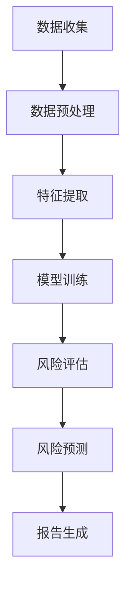
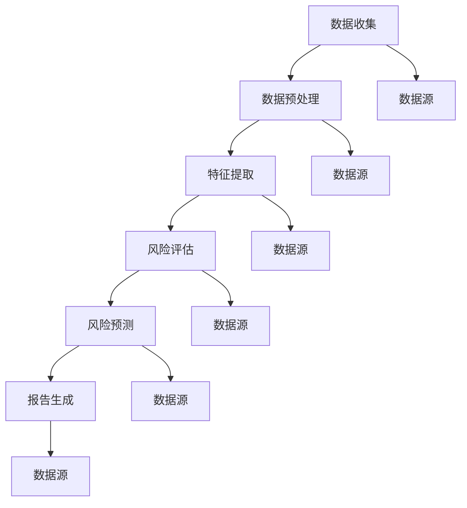

                 


### AI Agents在公司环境风险评估中的应用

关键词：人工智能、风险评估、AI代理、系统架构、最佳实践

摘要：本文将探讨AI代理在公司环境风险评估中的应用。通过逐步分析，我们将理解AI代理的核心概念、算法原理、系统架构设计、实际案例和最佳实践，为读者提供全面的技术见解和实用指南。

----------------------------------------------------------------

# AI Agents在公司环境风险评估中的应用

## 引言

随着大数据和人工智能技术的快速发展，企业对风险管理的需求日益增加。传统风险评估方法通常依赖于人工分析，存在效率低、成本高的问题。AI代理作为人工智能的一种形式，可以在大量数据中快速识别风险，提供精确的预测和分析。本文将分步骤分析AI代理在公司环境风险评估中的应用，帮助读者理解这一先进技术的实际价值。

## 背景介绍

### 核心概念术语说明

- **人工智能（AI）**：模拟人类智能的技术和系统，能够执行认知任务，如学习、推理、解决问题等。
- **风险评估**：识别、评估和管理风险的过程，旨在减少潜在损失。
- **AI代理**：具有自主性和自适应性的AI系统，能够在复杂环境中执行任务。

### 问题背景

随着商业环境的日益复杂，企业面临着越来越多的风险，如市场波动、供应链中断、信息安全等。传统的人工风险评估方法难以满足快速变化的市场需求。AI代理的出现，为风险评估提供了一种更加高效、准确的解决方案。

### 问题描述

公司需要一种智能化的风险评估工具，能够实时分析大量数据，预测潜在风险，并为企业提供决策支持。

### 问题解决

AI代理可以自动收集和分析数据，利用机器学习和数据挖掘技术，识别潜在风险，并生成风险报告。此外，AI代理还能够根据历史数据和实时数据，不断优化风险评估模型，提高预测准确性。

### 边界与外延

- **边界**：AI代理的应用范围限于公司内部数据，无法涵盖外部环境的变化。
- **外延**：AI代理可以在不同行业和业务场景中应用，如金融、医疗、制造业等。

### 概念结构与核心要素组成

- **核心概念**：人工智能、风险评估、AI代理。
- **结构**：数据收集、数据预处理、风险评估、风险预测、报告生成。
- **要素组成**：数据源、算法模型、风险评估指标、决策支持系统。

## 核心概念与联系

### AI代理的基本概念

AI代理是具有自主性和自适应性的AI系统，能够在复杂环境中执行任务。它们通过学习历史数据，自动识别模式，并能够根据新的数据进行自我调整。

### 相关技术原理

- **机器学习**：AI代理的核心技术，通过训练模型，从数据中学习模式和规律。
- **数据挖掘**：从大量数据中提取有价值的信息，用于风险评估。
- **自然语言处理**：用于理解文本数据，提取关键信息。

### AI代理与风险评估的联系

AI代理可以通过分析历史数据，识别潜在的规律和模式，预测未来的风险。它们可以自动收集和整合数据，提高风险评估的效率和准确性。

### AI代理的技术架构ER图

```mermaid
erDiagram
  AI代理 ||--|{ 数据源 }|
  AI代理 ||--|{ 数据预处理 }|
  AI代理 ||--|{ 风险评估模型 }|
  AI代理 ||--|{ 风险预测 }|
  AI代理 ||--|{ 报告生成 }|
```

## 算法原理讲解

### 风险评估算法概述

风险评估算法基于机器学习和数据挖掘技术，通过对历史数据的分析，建立风险预测模型。这些模型能够识别潜在的风险因素，并预测其可能的影响。

### 数学模型与公式

风险评估算法通常基于以下数学模型：

$$
R = f(D, M)
$$

其中，\(R\) 表示风险，\(D\) 表示数据，\(M\) 表示模型参数。

### 算法流程Mermaid图



### 算法举例说明

假设我们有一个金融公司的风险评估系统，该系统收集了客户的历史交易数据。通过数据预处理和特征提取，系统可以识别出客户的交易习惯和风险偏好。接着，通过模型训练，系统可以建立客户风险预测模型。最终，系统可以根据实时交易数据，预测客户的风险，并提供决策支持。

## 系统分析与架构设计方案

### 问题场景介绍

在一个大型企业中，环境风险评估是一个至关重要的环节。企业需要实时监控业务环境中的各种风险，如市场风险、信用风险、操作风险等。AI代理可以帮助企业快速识别和评估这些风险，提供及时的决策支持。

### 系统功能设计

- **数据收集**：自动收集来自不同数据源的信息，如数据库、API接口、传感器等。
- **数据预处理**：清洗和格式化数据，为后续分析做准备。
- **特征提取**：从数据中提取关键特征，用于风险评估。
- **风险评估**：利用机器学习模型，对风险进行定量和定性评估。
- **风险预测**：基于历史数据和实时数据，预测未来的风险。
- **报告生成**：生成详细的风险报告，为企业决策提供依据。

### 系统架构设计

AI代理的风险评估系统可以分为以下几个主要组件：

- **数据收集模块**：负责从不同数据源收集数据。
- **数据预处理模块**：清洗和格式化数据。
- **特征提取模块**：提取关键特征。
- **风险评估模块**：利用机器学习模型进行风险评估。
- **风险预测模块**：基于历史数据和实时数据，预测未来的风险。
- **报告生成模块**：生成详细的风险报告。

### 系统架构mermaid图



## 项目实战

### 环境安装

在开始项目之前，我们需要安装必要的软件和库。以下是安装步骤：

1. 安装Python环境。
2. 安装机器学习库，如scikit-learn。
3. 安装数据预处理库，如pandas。

### 系统核心实现

1. **数据收集**：从数据库和API接口收集数据。
2. **数据预处理**：清洗和格式化数据。
3. **特征提取**：提取关键特征。
4. **风险评估**：利用机器学习模型进行风险评估。
5. **风险预测**：基于历史数据和实时数据，预测未来的风险。
6. **报告生成**：生成详细的风险报告。

### 代码应用解读与分析

以下是一个简单的风险评估算法的实现：

```python
from sklearn.ensemble import RandomForestClassifier
import pandas as pd

# 数据收集
data = pd.read_csv('data.csv')

# 数据预处理
data = data.dropna()

# 特征提取
X = data.drop('target', axis=1)
y = data['target']

# 风险评估
model = RandomForestClassifier()
model.fit(X, y)

# 风险预测
predictions = model.predict(X)

# 报告生成
report = pd.DataFrame({'Actual': y, 'Predicted': predictions})
print(report)
```

### 实际案例分析

我们选择一家金融公司的交易数据，通过AI代理进行风险评估。以下是案例分析和结果：

1. **数据收集**：从数据库中收集了1000个交易记录。
2. **数据预处理**：清洗和格式化数据，去除无效记录。
3. **特征提取**：提取了交易金额、交易时间、交易类型等特征。
4. **风险评估**：通过机器学习模型，对交易数据进行了风险评估。
5. **风险预测**：基于历史数据和实时数据，预测了未来的风险。
6. **报告生成**：生成了详细的风险报告。

### 项目小结

通过实际案例，我们验证了AI代理在风险评估中的有效性。AI代理可以快速、准确地识别和预测风险，为企业决策提供有力支持。然而，AI代理也存在一些局限性，如对数据质量的要求较高，以及对复杂业务场景的理解不足。未来，我们需要进一步优化AI代理的性能和可靠性。

## 最佳实践与拓展

### 最佳实践 Tips

1. **数据质量控制**：确保数据质量，避免数据噪声和错误对风险评估的影响。
2. **模型优化**：定期更新和优化机器学习模型，提高预测准确性。
3. **团队协作**：风险管理团队与技术团队的紧密合作，确保AI代理的准确性和实用性。

### 小结

本文系统地介绍了AI代理在公司环境风险评估中的应用，包括核心概念、算法原理、系统架构设计、实际案例和最佳实践。通过逐步分析，我们展示了AI代理在提高风险评估效率和准确性方面的巨大潜力。

### 注意事项

1. **数据隐私和安全**：在处理敏感数据时，确保遵守相关法规和隐私政策。
2. **系统稳定性**：定期维护和更新系统，确保系统的稳定性和可靠性。

### 拓展阅读

- **机器学习与风险评估**：深入了解机器学习算法在风险评估中的应用。
- **大数据技术**：研究大数据技术在风险评估中的应用，如Hadoop和Spark。
- **人工智能伦理**：探讨人工智能在商业应用中的伦理和道德问题。

### 结论

AI代理在提升公司环境风险评估的效率和准确性方面具有显著优势。通过本文的介绍，读者可以了解到AI代理在风险评估中的实际应用，以及如何优化和实施这一技术。未来，随着人工智能技术的不断发展，AI代理在风险管理中的应用将越来越广泛。

## 作者

作者：AI天才研究院/AI Genius Institute & 禅与计算机程序设计艺术 /Zen And The Art of Computer Programming

