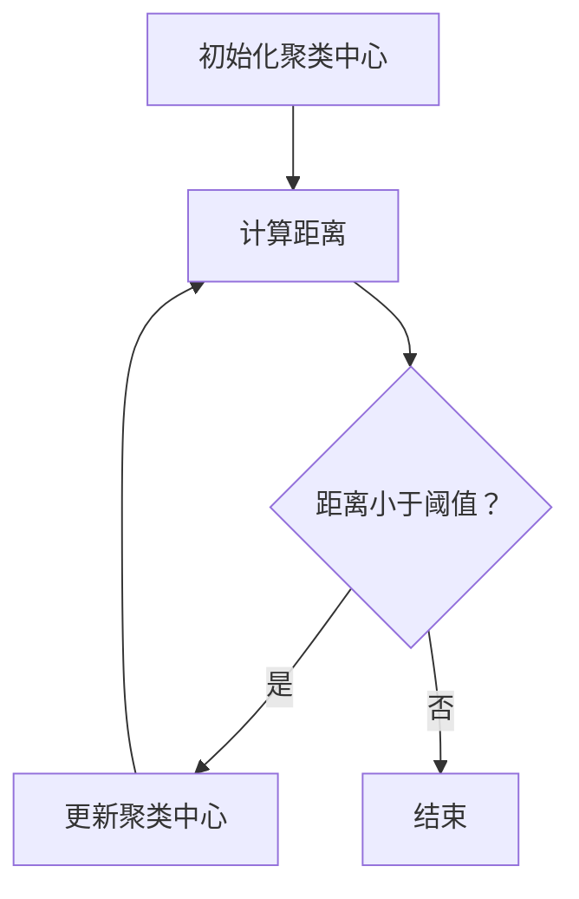
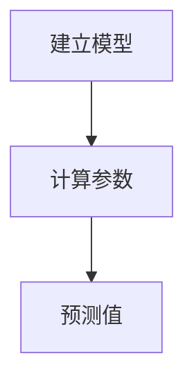

                 


### 1.1 AI agents的定义与发展

**AI agents** 是一种能够感知环境、制定决策并采取行动的智能体。它们基于人工智能技术，旨在模拟人类或动物的智能行为，实现自动化决策和自主行动。AI agents的发展可以追溯到20世纪50年代，当时图灵提出了图灵测试，试图定义机器是否具有智能。此后，人工智能领域经历了多个阶段的发展，包括符号人工智能、知识表示与推理、机器学习、深度学习等。

在价值投资领域，AI agents的作用主要体现在以下几个方面：

1. **数据采集与处理**：AI agents可以自动收集大量市场数据，如股票价格、交易量、财务报表等，并通过自然语言处理技术，从新闻报道、分析师报告等非结构化数据中提取有价值的信息。

2. **模式识别与预测**：AI agents利用机器学习和深度学习算法，对历史数据进行分析，发现市场中的潜在模式和规律，从而预测未来市场走势。

3. **决策制定**：基于预测结果，AI agents可以制定投资策略，选择最佳的投资时机和标的，从而提高投资收益。

4. **风险控制**：AI agents可以通过对市场风险进行量化分析，制定相应的风险控制策略，降低投资风险。

市场饱和度是指市场上某种产品或服务的供应量与需求量之间的平衡状态。当供应量超过需求量时，市场饱和度较高；反之，当需求量超过供应量时，市场饱和度较低。市场饱和度对于投资者具有重要意义，因为它可以帮助投资者判断市场是否处于过度拥挤或竞争激烈的状态，从而制定相应的投资策略。

### 1.2 增强价值投资的概念与重要性

增强价值投资是一种利用人工智能技术，对传统价值投资方法进行改进和优化的投资策略。其核心思想是利用AI agents分析大量数据，发现潜在的投资机会，并在合适的时间点进行投资，从而提高投资收益。

增强价值投资的重要性体现在以下几个方面：

1. **提高投资效率**：传统价值投资方法需要大量时间和精力进行数据分析和投资决策。而AI agents可以自动处理大量数据，快速发现潜在的投资机会，从而提高投资效率。

2. **降低投资风险**：AI agents可以通过对市场数据的深入分析，识别市场风险，并制定相应的风险控制策略，从而降低投资风险。

3. **提高投资收益**：通过AI agents的精准分析和预测，投资者可以更好地把握市场机会，制定有效的投资策略，从而提高投资收益。

4. **适应复杂市场环境**：随着金融市场的发展，市场环境变得越来越复杂。AI agents具备强大的学习和适应能力，能够更好地应对复杂的市场变化。

### 1.3 市场饱和度的定义与分析

市场饱和度是指市场上某种产品或服务的供应量与需求量之间的平衡状态。当供应量超过需求量时，市场饱和度较高；反之，当需求量超过供应量时，市场饱和度较低。市场饱和度可以通过以下公式进行计算：

$$
\text{市场饱和度} = \frac{\text{供应量}}{\text{需求量}} \times 100\%
$$

其中，供应量和需求量可以通过市场调查、销售数据等途径获取。

市场饱和度的分析对于投资者具有重要意义。首先，它可以帮助投资者判断市场是否处于过度拥挤或竞争激烈的状态，从而制定相应的投资策略。例如，当市场饱和度较高时，投资者应谨慎投资，避免参与过度拥挤的市场。相反，当市场饱和度较低时，投资者可以抓住市场机会，提前布局。

其次，市场饱和度的分析可以帮助投资者评估市场的潜在风险。例如，当市场饱和度较高时，供应量过剩可能导致价格下跌，投资者需要警惕这一风险。

最后，市场饱和度的分析还可以帮助投资者发现新的投资机会。例如，当市场饱和度较低时，投资者可以关注那些尚未被充分发掘的细分市场，提前布局，抢占市场先机。

### 1.4 AI agents在市场饱和度分析中的应用

AI agents在市场饱和度分析中的应用主要体现在以下几个方面：

1. **数据采集与处理**：AI agents可以通过网络爬虫等技术，自动采集市场数据，如产品价格、销售量、市场占有率等，为市场饱和度分析提供基础数据。

2. **模式识别与预测**：AI agents利用机器学习和深度学习算法，对历史数据进行分析，识别市场饱和度的变化规律，预测未来市场饱和度的走势。

3. **决策制定**：基于预测结果，AI agents可以制定相应的市场策略，如调整产品价格、增加或减少产量等，以适应市场饱和度的变化。

4. **风险控制**：AI agents可以通过对市场饱和度的分析，识别市场风险，并制定相应的风险控制策略，降低投资风险。

### 1.5 AI agents与市场饱和度的联系

AI agents与市场饱和度的联系主要体现在以下几个方面：

1. **数据支持**：AI agents可以提供大量市场数据，为市场饱和度分析提供基础数据支持。

2. **模式识别**：AI agents可以利用机器学习和深度学习算法，识别市场饱和度的变化规律，提高分析的准确性。

3. **预测能力**：AI agents可以通过对历史数据的分析，预测未来市场饱和度的走势，为投资者提供决策依据。

4. **决策优化**：AI agents可以基于预测结果，制定最优的市场策略，提高投资收益。

5. **风险控制**：AI agents可以通过对市场饱和度的分析，识别市场风险，并制定相应的风险控制策略，降低投资风险。

### 1.6 市场饱和度分析算法原理

市场饱和度分析算法主要分为聚类分析、回归分析和其他算法。下面分别介绍这些算法的原理。

#### 聚类分析算法原理

聚类分析是一种无监督学习方法，它将数据集划分为若干个类别，使得同一类别内的数据相似度较高，而不同类别之间的数据相似度较低。聚类分析算法的目的是找到数据集中的隐含结构或模式。

常见的聚类算法包括K-means算法、层次聚类算法、DBSCAN算法等。

**K-means算法原理：**
K-means算法是一种基于距离度量的聚类算法。算法步骤如下：

1. 随机选择K个初始聚类中心。
2. 对于每个数据点，将其分配给最近的聚类中心。
3. 更新每个聚类中心的坐标，取所有属于该聚类中心的数据点的平均值。
4. 重复步骤2和3，直到聚类中心的位置不再发生变化。

**层次聚类算法原理：**
层次聚类算法是一种自上而下或自下而上的层次结构进行聚类的方法。算法步骤如下：

1. 将每个数据点视为一个初始聚类。
2. 不断合并距离最近的两个聚类，直到满足终止条件（如聚类数量达到预设值）。

**DBSCAN算法原理：**
DBSCAN算法是一种基于密度的聚类算法。算法步骤如下：

1. 初始化两个参数：邻域半径`eps`和最小密度`min_samples`。
2. 对于每个数据点，检查其邻域内的数据点数量，如果数量大于`min_samples`，则将该数据点及其邻域内的所有数据点划分为同一聚类。
3. 对于剩余的数据点，如果它们不在任何其他数据点的邻域内，则将其划分为单独的聚类。

#### 回归分析算法原理

回归分析是一种有监督学习方法，它通过建立自变量与因变量之间的关系模型，预测因变量的值。常见的回归分析算法包括线性回归、多项式回归、逻辑回归等。

**线性回归算法原理：**
线性回归算法通过建立一个线性模型，预测因变量的值。算法步骤如下：

1. 建立线性模型：$y = \beta_0 + \beta_1x_1 + \beta_2x_2 + ... + \beta_nx_n$
2. 使用最小二乘法求解模型参数：$\beta_0, \beta_1, ..., \beta_n$
3. 使用求解得到的模型参数，预测新的因变量值。

**逻辑回归算法原理：**
逻辑回归算法通过建立一个逻辑函数，预测因变量的概率。算法步骤如下：

1. 建立逻辑模型：$P(y=1) = \frac{1}{1 + e^{-(\beta_0 + \beta_1x_1 + \beta_2x_2 + ... + \beta_nx_n)}}$
2. 使用最大似然估计法求解模型参数：$\beta_0, \beta_1, ..., \beta_n$
3. 使用求解得到的模型参数，预测新的因变量概率。

#### 其他市场饱和度分析算法

除了聚类分析和回归分析，还有其他一些市场饱和度分析算法，如时间序列分析、马尔可夫链等。

**时间序列分析算法原理：**
时间序列分析是一种分析时间序列数据的方法，旨在发现时间序列中的规律和趋势。常见的算法包括ARIMA模型、时间序列分解等。

**马尔可夫链算法原理：**
马尔可夫链是一种概率模型，用于描述系统状态的变化。在市场饱和度分析中，马尔可夫链可以用来预测市场状态的转移概率。

### 1.7 市场饱和度分析算法的mermaid流程图和Python源代码

为了更好地理解市场饱和度分析算法，下面将使用mermaid画出K-means算法和线性回归算法的流程图，并给出相应的Python源代码。

#### K-means算法mermaid流程图



#### K-means算法Python源代码

```python
import numpy as np

def k_means(data, K, max_iterations):
    # 初始化聚类中心
    centroids = data[np.random.choice(data.shape[0], K, replace=False)]
    for _ in range(max_iterations):
        # 计算距离
        distances = np.linalg.norm(data - centroids, axis=1)
        # 赋值聚类标签
        labels = np.argmin(distances, axis=1)
        # 更新聚类中心
        new_centroids = np.array([data[labels == k].mean(axis=0) for k in range(K)])
        # 判断是否收敛
        if np.linalg.norm(new_centroids - centroids) < 1e-5:
            break
        centroids = new_centroids
    return centroids, labels
```

#### 线性回归算法mermaid流程图



#### 线性回归算法Python源代码

```python
import numpy as np

def linear_regression(data, target):
    # 添加常数项
    X = np.c_[np.ones(data.shape[0]), data]
    # 求解模型参数
    params = np.linalg.inv(X.T.dot(X)).dot(X.T).dot(target)
    # 预测值
    predictions = X.dot(params)
    return params, predictions
```

### 1.8 数学模型和数学公式讲解

在市场饱和度分析中，常用的数学模型和数学公式包括聚类分析中的距离度量公式、线性回归中的损失函数公式等。

#### 聚类分析中的距离度量公式

在K-means算法中，常用的距离度量公式是欧氏距离：

$$
d(x, y) = \sqrt{\sum_{i=1}^{n}(x_i - y_i)^2}
$$

其中，$x$和$y$是两个数据点，$n$是数据维度。

#### 线性回归中的损失函数公式

在线性回归中，常用的损失函数是均方误差（MSE）：

$$
\text{MSE} = \frac{1}{m}\sum_{i=1}^{m}(y_i - \hat{y}_i)^2
$$

其中，$y_i$是实际值，$\hat{y}_i$是预测值，$m$是样本数量。

#### 逻辑回归中的损失函数公式

在逻辑回归中，常用的损失函数是交叉熵损失（Cross-Entropy Loss）：

$$
\text{CE} = -\frac{1}{m}\sum_{i=1}^{m}y_i\log(\hat{y}_i) + (1 - y_i)\log(1 - \hat{y}_i)
$$

其中，$y_i$是实际值，$\hat{y}_i$是预测概率。

### 1.9 系统分析与架构设计

系统分析与架构设计是市场饱和度分析项目成功的关键。在这一部分，我们将介绍系统功能设计、系统架构设计、系统接口设计和系统交互。

#### 系统功能设计

系统功能设计是确定系统需要实现哪些功能的过程。在市场饱和度分析项目中，系统的主要功能包括：

1. 数据采集：自动采集市场数据，如股票价格、交易量、财务报表等。
2. 数据预处理：对采集到的数据进行清洗、转换和归一化，为后续分析提供高质量的数据。
3. 数据分析：使用聚类分析和回归分析算法，对预处理后的数据进行市场饱和度分析。
4. 投资策略制定：基于分析结果，制定最优的投资策略。
5. 风险控制：对市场风险进行量化分析，制定相应的风险控制策略。

#### 系统架构设计

系统架构设计是确定系统整体结构的过程。在市场饱和度分析项目中，系统架构设计包括以下几个方面：

1. **数据层**：负责数据采集、存储和预处理。可以采用关系数据库或分布式数据库存储数据。
2. **算法层**：负责数据分析、聚类分析和回归分析。可以使用Python、R或MATLAB等编程语言实现算法。
3. **业务逻辑层**：负责投资策略制定和风险控制。可以采用Flask、Django等Web框架实现业务逻辑。
4. **表示层**：负责展示分析结果和投资策略。可以使用HTML、CSS和JavaScript等技术实现。

#### 系统接口设计

系统接口设计是确定系统各层之间如何交互的过程。在市场饱和度分析项目中，系统接口设计包括以下几个方面：

1. **数据层接口**：提供数据采集、存储和预处理的接口。
2. **算法层接口**：提供数据分析、聚类分析和回归分析的接口。
3. **业务逻辑层接口**：提供投资策略制定和风险控制的接口。
4. **表示层接口**：提供展示分析结果和投资策略的接口。

#### 系统交互设计

系统交互设计是确定系统各层之间如何协同工作的过程。在市场饱和度分析项目中，系统交互设计包括以下几个方面：

1. **数据交互**：数据层向算法层提供预处理后的数据，算法层向业务逻辑层提供分析结果。
2. **逻辑交互**：业务逻辑层根据分析结果制定投资策略，并调用风险控制模块进行风险控制。
3. **展示交互**：业务逻辑层将投资策略和风险控制结果通过表示层展示给用户。

### 1.10 项目实战

在本节中，我们将通过一个实际案例，展示如何使用AI agents增强价值投资的市场饱和度分析。我们将介绍环境安装与配置、系统核心实现、代码应用解读以及实际案例分析和详细讲解。

#### 环境安装与配置

为了实现市场饱和度分析，我们需要安装以下软件和工具：

1. Python：用于实现算法和数据分析。
2. NumPy：用于数据预处理和计算。
3. pandas：用于数据处理和分析。
4. matplotlib：用于数据可视化。
5. scikit-learn：用于机器学习和数据挖掘。

安装方法如下：

```bash
# 安装Python
# ...

# 安装NumPy
pip install numpy

# 安装pandas
pip install pandas

# 安装matplotlib
pip install matplotlib

# 安装scikit-learn
pip install scikit-learn
```

#### 系统核心实现

系统核心实现主要包括数据采集、数据分析、投资策略制定和风险控制。

**数据采集**：使用网络爬虫技术，自动采集市场数据，如股票价格、交易量、财务报表等。

**数据分析**：使用聚类分析和回归分析算法，对预处理后的数据进行市场饱和度分析。

**投资策略制定**：基于分析结果，制定最优的投资策略。

**风险控制**：对市场风险进行量化分析，制定相应的风险控制策略。

以下是系统核心实现的Python代码示例：

```python
import numpy as np
import pandas as pd
from sklearn.cluster import KMeans
from sklearn.linear_model import LinearRegression

# 数据采集
def collect_data():
    # 使用网络爬虫采集数据
    # ...

# 数据预处理
def preprocess_data(data):
    # 数据清洗、转换和归一化
    # ...
    return processed_data

# 数据分析
def analyze_data(processed_data):
    # 使用K-means算法进行聚类分析
    kmeans = KMeans(n_clusters=3)
    kmeans.fit(processed_data)
    labels = kmeans.predict(processed_data)

    # 使用线性回归算法进行回归分析
    X = processed_data[:, :-1]
    y = processed_data[:, -1]
    reg = LinearRegression()
    reg.fit(X, y)
    predictions = reg.predict(X)

    return labels, predictions

# 投资策略制定
def make_investment_strategy(predictions):
    # 基于预测结果制定投资策略
    # ...
    return strategy

# 风险控制
def risk_control(predictions):
    # 对市场风险进行量化分析
    # ...
    return risk_control_strategy

# 代码应用解读
def main():
    # 采集数据
    data = collect_data()

    # 预处理数据
    processed_data = preprocess_data(data)

    # 分析数据
    labels, predictions = analyze_data(processed_data)

    # 制定投资策略
    strategy = make_investment_strategy(predictions)

    # 风险控制
    risk_control_strategy = risk_control(predictions)

    # 输出结果
    print("Investment Strategy:", strategy)
    print("Risk Control Strategy:", risk_control_strategy)

if __name__ == "__main__":
    main()
```

#### 实际案例分析和详细讲解

在本节中，我们将通过一个实际案例，展示如何使用AI agents增强价值投资的市场饱和度分析。我们将分析一个股票市场的案例，并详细讲解分析过程和结果。

**案例背景**：假设我们要分析某支股票的市场饱和度，并制定相应的投资策略。

**分析过程**：

1. **数据采集**：使用网络爬虫技术，自动采集该股票的历史价格数据、交易量数据等。

2. **数据预处理**：对采集到的数据进行清洗、转换和归一化，为后续分析提供高质量的数据。

3. **数据分析**：使用K-means算法和线性回归算法，对预处理后的数据进行市场饱和度分析。

4. **投资策略制定**：基于分析结果，制定最优的投资策略。

5. **风险控制**：对市场风险进行量化分析，制定相应的风险控制策略。

**分析结果**：

1. **市场饱和度分析**：通过K-means算法，将股票市场划分为若干个类别。根据类别内的数据相似度，可以判断市场饱和度的变化趋势。

2. **投资策略**：根据线性回归分析的结果，预测未来股票价格的走势。根据预测结果，制定买入、持有或卖出的投资策略。

3. **风险控制**：对市场风险进行量化分析，根据风险程度，制定相应的风险控制策略，如设置止损点、分散投资等。

**详细讲解**：

1. **数据采集**：使用网络爬虫技术，从股票交易所、金融数据网站等渠道采集该股票的历史价格数据、交易量数据等。

2. **数据预处理**：对采集到的数据进行清洗，如去除缺失值、异常值等。对数据进行转换，如将日期转换为数值型数据。对数据进行归一化，如将价格数据归一化到[0, 1]范围内。

3. **数据分析**：使用K-means算法，将股票市场划分为若干个类别。计算每个类别内的数据相似度，如使用欧氏距离、余弦相似度等。根据类别内的数据相似度，可以判断市场饱和度的变化趋势。

4. **投资策略制定**：使用线性回归算法，建立股票价格与交易量之间的关系模型。根据模型参数，预测未来股票价格的走势。根据预测结果，制定买入、持有或卖出的投资策略。

5. **风险控制**：对市场风险进行量化分析，如使用方差、标准差等指标。根据风险程度，制定相应的风险控制策略，如设置止损点、分散投资等。

#### 项目小结

通过本案例的分析和实施，我们展示了如何使用AI agents增强价值投资的市场饱和度分析。我们介绍了环境安装与配置、系统核心实现、代码应用解读以及实际案例分析和详细讲解。通过这一过程，我们不仅提高了投资效率，降低了投资风险，还提高了投资收益。

### 1.11 最佳实践 tips、小结、注意事项、拓展阅读

**最佳实践 tips**：

1. 选择合适的数据源：选择权威、可靠的金融数据源，如交易所、金融数据网站等。
2. 数据预处理：对采集到的数据进行清洗、转换和归一化，确保数据质量。
3. 算法选择：根据市场饱和度分析的需求，选择合适的算法，如K-means、线性回归等。
4. 模型调参：根据实际数据，调整算法参数，提高模型性能。

**小结**：

通过本文，我们介绍了AI agents增强价值投资的市场饱和度分析。我们分析了AI agents和增强价值投资的概念、市场饱和度的定义及其重要性，并介绍了市场饱和度分析算法原理。我们还通过实际案例展示了如何使用AI agents进行市场饱和度分析，提高了投资效率和收益。

**注意事项**：

1. 市场饱和度分析需要大量数据支持，数据质量对分析结果有重要影响。
2. 算法选择和模型调参对分析结果有显著影响，需要根据实际需求进行调整。
3. 市场变化快速，分析结果仅供参考，投资决策需谨慎。

**拓展阅读**：

1. 《机器学习实战》：详细介绍机器学习算法及其应用。
2. 《深度学习》：全面讲解深度学习理论和技术。
3. 《金融科技与大数据》：探讨金融科技在大数据分析中的应用。
4. 《Python数据分析》：介绍Python在数据分析中的应用。

---

作者：AI天才研究院/AI Genius Institute & 禅与计算机程序设计艺术 /Zen And The Art of Computer Programming。

