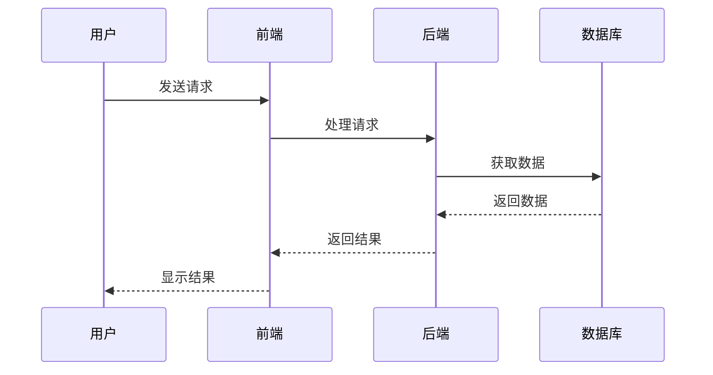

                 

## 《AI agents辅助价值投资者解读政府政策影响》

> 关键词：AI agents，价值投资，政府政策，数据解析，算法原理，系统架构，实战案例，最佳实践

> 摘要：本文深入探讨了如何利用AI agents辅助价值投资者解读政府政策影响。首先，介绍了AI agents和政府政策的基本概念，然后详细阐述了AI agents在价值投资中的应用。接着，通过具体的算法原理和数学模型，说明了如何使用AI agents解析政府政策数据。随后，介绍了系统分析与架构设计方案，展示了如何将AI agents应用于实际项目。最后，通过一个实战案例，详细解析了AI agents在解读政府政策中的实际应用，并提供了一些最佳实践和拓展阅读建议。

## 引言

随着人工智能（AI）技术的迅猛发展，AI agents作为AI领域的一个重要分支，已经在众多领域取得了显著的应用成果。从自动驾驶、智能助手到金融投资，AI agents正逐渐成为推动产业变革的重要力量。在金融投资领域，AI agents的引入，不仅提升了数据处理和分析的效率，还为投资者提供了更为精准的投资策略。尤其是价值投资者，他们需要深入理解政府政策对市场的影响，以便做出明智的投资决策。

政府政策作为宏观经济调控的重要手段，其发布和调整往往会对市场产生深远的影响。例如，税收政策的调整、货币政策的松紧、财政政策的扩张与紧缩等，都会直接或间接地影响股市的走势。对于价值投资者来说，准确解读政府政策，把握市场机遇，是投资成功的关键。

然而，政府政策的复杂性使得传统的分析手段难以胜任。政策文本往往涉及大量专业术语和复杂的逻辑关系，人工解读不仅费时费力，还容易出现误判。此时，AI agents的应用显得尤为重要。AI agents能够通过自动化的方式，快速解析政策文本，提取关键信息，并利用机器学习算法进行深度分析，从而为投资者提供有力的支持。

本文旨在探讨如何利用AI agents辅助价值投资者解读政府政策影响。文章将从以下几个方面展开：

1. **AI agents概述**：介绍AI agents的定义、分类及其在价值投资中的应用前景。
2. **政府政策与市场影响**：阐述政府政策的定义、影响机制及其对市场的影响。
3. **算法原理讲解**：详细解释AI agents解析政府政策数据的算法原理和数学模型。
4. **系统分析与架构设计方案**：介绍AI agents系统的整体架构设计。
5. **项目实战**：通过一个实际案例，展示如何使用AI agents解读政府政策。
6. **最佳实践 tips**：提供实际应用中的技巧和注意事项。
7. **小结与拓展阅读**：总结文章的关键知识点，并推荐进一步阅读的资源。

## 第1章 AI agents概述

### 1.1 AI agents的定义与分类

AI agents，即人工智能代理，是人工智能（AI）领域的一个重要概念。它们是能够自动执行任务、实现目标的自适应实体。AI agents的基本特征包括自主性、适应性、交互性和协作性。自主性意味着AI agents能够独立执行任务，而不需要人类干预。适应性则表示AI agents能够根据环境和任务的变化进行调整。交互性强调AI agents与其他系统或人进行有效沟通和协作。协作性意味着AI agents能够协同工作，共同完成任务。

根据功能和应用领域的不同，AI agents可以分为多种类型。以下是一些常见的AI agents分类：

1. **自主导航机器人**：这类AI agents主要用于无人驾驶车辆、无人机等。它们通过感知环境、理解路径规划、执行导航任务，实现了自主导航功能。

2. **智能客服机器人**：这类AI agents主要用于企业客服领域，能够自动回答客户提问、提供在线支持。它们通过自然语言处理（NLP）技术，实现了与人类的自然对话。

3. **自动化交易系统**：这类AI agents主要用于金融投资领域，通过分析市场数据、执行交易策略，实现了自动化交易。它们在量化投资、高频交易等方面具有显著优势。

4. **智能家居管家**：这类AI agents主要用于家庭场景，能够控制家居设备、提供生活建议等。它们通过物联网（IoT）技术，实现了对家庭环境的智能管理。

5. **智能推荐系统**：这类AI agents主要用于电子商务、社交媒体等领域，通过分析用户行为、兴趣，实现个性化推荐。它们在提高用户满意度、提升企业收益方面发挥了重要作用。

### 1.2 价值投资的理念与实践

价值投资是一种以长期持有、基本面分析为核心理念的投资策略。其基本理念是，通过购买价格低于其内在价值的股票，等待市场认识到股票的价值，从而获得超额收益。价值投资的核心原则包括：

1. **长期投资**：价值投资者通常采取长期持有的策略，认为股票的价值最终会反映在价格上，而短期市场的波动不会影响其投资决策。

2. **基本面分析**：价值投资者主要通过分析企业的基本面信息，如盈利能力、财务状况、行业地位等，来判断股票的价值。

3. **安全边际**：价值投资者强调在购买股票时，价格应低于其内在价值的幅度，即存在安全边际。这样可以降低投资风险，确保在市场波动时仍有盈利空间。

价值投资的实践步骤包括：

1. **寻找被低估的股票**：投资者需要通过分析企业的基本面信息，寻找价格低于其内在价值的股票。

2. **深入研究企业**：投资者应深入研究企业的经营状况、行业前景、竞争对手等，确保股票的价值被低估。

3. **合理定价**：投资者应根据企业的基本面信息，为股票定价，确保价格低于其内在价值。

4. **长期持有**：投资者应采取长期持有的策略，等待市场认识到股票的价值。

### 1.3 AI agents在价值投资中的应用前景

AI agents在价值投资中具有广泛的应用前景。首先，AI agents能够快速处理大量数据，提取关键信息，帮助投资者更好地进行基本面分析。例如，AI agents可以通过分析公司的财报、新闻公告等，提取关键财务指标和行业动态，为投资者提供准确的投资参考。

其次，AI agents可以利用机器学习算法，建立复杂的预测模型，预测股票的价格走势。这些模型可以基于历史数据、市场情绪等多种因素，为投资者提供更加精确的投资策略。

此外，AI agents还可以帮助投资者进行风险管理。通过分析市场数据、政策信息等，AI agents可以实时调整投资组合，降低投资风险。

总之，AI agents的引入，不仅提升了价值投资者的数据分析能力，还为他们提供了更加精确的投资策略和风险管理工具，有望显著提升投资收益。

## 第2章 政府政策与市场影响

### 2.1 政府政策的概述

政府政策是指政府根据宏观经济形势和经济社会发展需要，制定的旨在实现国家经济、社会、文化等目标的一系列措施和计划。政府政策的主要内容包括财政政策、货币政策、产业政策、社会保障政策等。财政政策主要通过税收、政府支出等手段，调节经济总量和结构。货币政策则通过利率、货币供应量等手段，影响货币市场的供求关系。产业政策主要涉及对产业发展方向、产业结构调整的支持和引导。社会保障政策则旨在保障人民的基本生活和社会福利。

政府政策的制定和实施，对宏观经济和微观市场都产生深远的影响。一方面，政府政策可以通过调控经济总量和结构，促进经济增长、稳定物价、增加就业等。另一方面，政府政策可以直接或间接影响市场主体的行为，进而影响市场供求关系、价格水平和竞争格局。

### 2.2 政府政策对市场的影响机制

政府政策对市场的影响主要通过以下几个机制实现：

1. **需求侧政策**：需求侧政策主要通过刺激消费、投资和出口等手段，增加市场需求。例如，政府通过增加公共投资、降低税收负担等，刺激企业和居民消费，从而促进经济增长。需求侧政策的实施，可以提高市场活力，增加商品和服务的需求，从而推动价格上涨。

2. **供给侧政策**：供给侧政策主要通过优化产业结构、提高生产效率和质量等手段，增加市场供给。例如，政府通过实施产业转型升级、创新驱动发展战略等，推动产业结构的优化和升级，提高产品和服务的质量和附加值。供给侧政策的实施，可以提高市场供给的质量和效率，从而改善市场供求关系，降低价格。

3. **货币政策和财政政策**：货币政策和财政政策是政府调控市场的两大工具。货币政策主要通过调节利率、货币供应量等手段，影响市场资金供求关系。例如，央行通过提高利率、减少货币供应量，可以抑制通货膨胀，保持市场稳定。财政政策则主要通过政府支出和税收等手段，影响经济活动和市场供求关系。例如，政府通过增加公共支出、减少税收负担，可以刺激经济增长，提高市场需求。

4. **政策信号**：政府政策的发布和调整，可以向市场传递重要的信号。例如，政府提高赤字率、增加财政支出，表明经济形势较为严峻，政府将采取积极政策刺激经济增长。政策信号的传递，可以影响市场主体的预期和行为，从而影响市场的供求关系和价格水平。

### 2.3 政府政策指标与经济信号

政府政策对市场的影响，往往通过一系列指标和信号进行反映。以下是一些常见的政府政策指标和经济信号：

1. **GDP增长率**：GDP增长率是衡量经济增长速度的重要指标。政府通过制定和实施不同的政策，可以影响GDP增长率。当GDP增长率较高时，通常表明经济发展态势良好，市场需求旺盛。

2. **通货膨胀率**：通货膨胀率是衡量物价水平变动的重要指标。政府通过货币政策等手段，可以调节通货膨胀率。当通货膨胀率较低时，表明物价稳定，有利于市场稳定。

3. **失业率**：失业率是衡量就业状况的重要指标。政府通过财政政策等手段，可以影响失业率。当失业率较低时，表明就业形势较好，市场需求旺盛。

4. **利率**：利率是货币政策的重要工具。政府通过调整利率，可以影响市场资金的供求关系。利率的变动，会影响企业的融资成本，进而影响投资和消费行为。

5. **政府支出**：政府支出是财政政策的重要手段。政府通过增加或减少支出，可以影响市场需求和经济增长。

6. **政策文件和公告**：政府发布的重要政策文件和公告，可以向市场传递重要的政策信号。例如，政府发布的“十四五”规划、财政预算报告等，都包含了政府未来一段时期内的政策方向和重点。

总之，政府政策对市场的影响是多方面、多维度的。理解政府政策指标和经济信号，对于投资者来说，有助于更好地把握市场动态，制定合理的投资策略。

## 第3章 算法原理讲解

### 3.1 数据预处理与特征提取

在利用AI agents解析政府政策数据的过程中，数据预处理和特征提取是至关重要的环节。数据预处理包括数据清洗、数据整合、数据归一化等，而特征提取则是从原始数据中提取出有助于模型训练的关键信息。

#### 数据清洗

数据清洗是确保数据质量的第一步。它包括去除重复数据、纠正数据中的错误、处理缺失数据等。具体步骤如下：

1. **去除重复数据**：通过数据库中的主键或唯一标识符，识别和删除重复的记录。

2. **纠正数据错误**：检查数据中的不一致或错误，如日期格式错误、数值错误等，并进行修正。

3. **处理缺失数据**：对于缺失的数据，可以采用以下方法进行处理：
   - 删除缺失值：如果缺失值较多，可以考虑删除含有缺失值的记录。
   - 估算缺失值：采用均值、中位数、众数等方法，估算缺失值。
   - 使用模型预测缺失值：利用机器学习模型，如回归模型或聚类模型，预测缺失值。

#### 数据整合

数据整合是将来自不同来源的数据进行合并，以便进行分析。具体步骤如下：

1. **数据格式转换**：将不同格式的数据转换为统一的格式，如将Excel文件转换为CSV文件。

2. **数据对齐**：确保不同数据集的变量对齐，即相同的变量在所有数据集中具有相同的含义和维度。

3. **合并数据集**：将不同来源的数据进行合并，形成完整的数据集。

#### 数据归一化

数据归一化是将不同量纲的数据转换为相同量纲，以便于模型训练。常用的归一化方法包括：

1. **最小-最大归一化**：将数据缩放到[0, 1]区间，公式为：
   \[
   x_{\text{norm}} = \frac{x - x_{\text{min}}}{x_{\text{max}} - x_{\text{min}}}
   \]

2. **Z-score归一化**：将数据缩放到均值为0、标准差为1的正态分布，公式为：
   \[
   x_{\text{norm}} = \frac{x - \mu}{\sigma}
   \]

#### 特征提取

特征提取是从原始数据中提取出对模型训练有帮助的信息。常用的特征提取方法包括：

1. **统计特征**：如均值、中位数、标准差、方差等，这些特征可以反映数据的整体分布情况。

2. **文本特征**：对于政策文本数据，可以采用词频（TF）、词频-逆文档频率（TF-IDF）、词嵌入（Word Embedding）等方法，提取文本特征。

3. **时间序列特征**：如移动平均、差分、季节性指标等，这些特征可以反映数据的时间变化规律。

### 3.2 模型选择与训练

在数据预处理和特征提取完成后，需要选择合适的机器学习模型进行训练，以便对政府政策数据进行分析和预测。

#### 模型选择

选择机器学习模型时，需要考虑以下几个因素：

1. **问题类型**：是回归问题、分类问题还是聚类问题？
2. **数据量**：数据量是否足够大，以支持模型的训练？
3. **特征数量**：特征数量是否过多，是否需要进行降维处理？
4. **模型复杂度**：模型是否过于复杂，可能导致过拟合？

根据以上因素，可以选择以下几种常见的机器学习模型：

1. **线性回归**：适用于回归问题，可以用来预测股票价格、通货膨胀率等。
2. **逻辑回归**：适用于分类问题，可以用来判断股票是否被低估、是否处于上涨趋势等。
3. **支持向量机（SVM）**：适用于回归和分类问题，可以用来预测股票的价格区间、市场趋势等。
4. **随机森林（Random Forest）**：适用于回归和分类问题，可以用来预测市场走势、政策对市场的影响等。
5. **深度学习模型**：如卷积神经网络（CNN）、循环神经网络（RNN）等，适用于复杂的数据分析和预测任务。

#### 模型训练

模型训练是利用历史数据，调整模型参数，使其能够对新的数据进行预测。训练过程包括以下步骤：

1. **数据划分**：将数据集划分为训练集、验证集和测试集，通常比例为60%:20%:20%。

2. **参数调整**：通过调整模型参数，如学习率、正则化参数等，优化模型性能。

3. **模型训练**：使用训练集数据，对模型进行训练，调整模型参数。

4. **模型验证**：使用验证集数据，评估模型性能，调整参数。

5. **模型测试**：使用测试集数据，评估模型在未知数据上的性能。

### 3.3 预测与评估

在模型训练完成后，可以通过模型对政府政策数据进行分析和预测。预测过程包括以下步骤：

1. **输入数据准备**：将新的政府政策数据，进行预处理和特征提取。

2. **模型预测**：使用训练好的模型，对预处理后的数据进行预测。

3. **结果评估**：评估模型预测结果的准确性和可靠性，如通过计算预测误差、ROC曲线、混淆矩阵等指标。

通过以上步骤，AI agents可以有效地对政府政策数据进行分析和预测，为价值投资者提供有力的支持。

### 3.4 数学模型与公式

在AI agents解析政府政策数据的过程中，数学模型和公式是理解算法原理的重要工具。以下将介绍一些常用的数学模型和公式。

#### 线性回归模型

线性回归模型是最基本的机器学习模型之一，用于预测连续值。其公式为：
\[
y = \beta_0 + \beta_1 x
\]
其中，\(y\) 是预测值，\(x\) 是输入特征，\(\beta_0\) 是截距，\(\beta_1\) 是斜率。线性回归模型的目的是通过最小化预测误差平方和，求出最优的\(\beta_0\) 和\(\beta_1\)。

#### 逻辑回归模型

逻辑回归模型用于分类问题，其公式为：
\[
\log\left(\frac{p}{1-p}\right) = \beta_0 + \beta_1 x
\]
其中，\(p\) 是预测的概率，\(\beta_0\) 是截距，\(\beta_1\) 是斜率。逻辑回归模型通过将线性组合转换为概率分布，实现分类。

#### 支持向量机（SVM）

支持向量机是一种强大的分类和回归模型，其公式为：
\[
w \cdot x - b = 0
\]
其中，\(w\) 是权重向量，\(x\) 是输入特征，\(b\) 是偏置。SVM的目标是找到一个最优的\(w\) 和\(b\)，使得分类边界与数据点之间的距离最大。

#### 随机森林

随机森林是一种基于决策树的集成模型，其公式为：
\[
f(x) = \sum_{i=1}^{n} w_i h_i(x)
\]
其中，\(w_i\) 是权重，\(h_i(x)\) 是第\(i\)棵决策树对\(x\)的预测。随机森林通过构建多个决策树，并取它们的平均值或多数值作为最终预测。

#### 深度学习模型

深度学习模型如卷积神经网络（CNN）和循环神经网络（RNN）等，其公式较为复杂，但可以通过反向传播算法进行优化。以CNN为例，其公式为：
\[
a_{l+1}^{i} = \sigma \left( \mathcal{W} a_{l}^{j} + \mathcal{b} \right)
\]
其中，\(a_{l+1}^{i}\) 是输出特征，\(\sigma\) 是激活函数，\(\mathcal{W}\) 是权重矩阵，\(\mathcal{b}\) 是偏置。

通过这些数学模型和公式，AI agents可以有效地进行政府政策数据的分析和预测。以下是一个简单的示例，使用Python代码实现线性回归模型：

```python
import numpy as np
import matplotlib.pyplot as plt

# 生成模拟数据
X = np.random.rand(100, 1)
y = 2 * X + np.random.randn(100, 1)

# 训练模型
w = np.linalg.inv(X.T.dot(X)).dot(X.T).dot(y)
print("权重：", w)

# 预测
X_new = np.array([[0], [1]])
y_pred = X_new.dot(w)
print("预测值：", y_pred)

# 绘图
plt.scatter(X, y)
plt.plot(X_new, y_pred, 'r-')
plt.show()
```

通过这个简单的示例，我们可以看到线性回归模型是如何通过数学模型和公式，对数据进行拟合和预测的。

## 第4章 系统分析与架构设计方案

### 4.1 系统架构设计概述

在利用AI agents辅助价值投资者解读政府政策影响的过程中，系统架构设计是确保系统高效、稳定、可扩展的关键。本节将介绍AI agents系统的整体架构设计，包括数据处理流程、模型训练和预测流程。

#### 数据处理流程

数据处理流程是AI agents系统的核心，它包括数据采集、数据清洗、数据整合和数据存储等步骤。具体流程如下：

1. **数据采集**：从政府官方网站、金融数据平台、新闻媒体等渠道采集政策文本、经济指标、股票数据等原始数据。

2. **数据清洗**：对采集到的原始数据进行清洗，去除重复数据、纠正错误数据、处理缺失数据等，确保数据质量。

3. **数据整合**：将来自不同来源的数据进行整合，形成统一的数据集，包括政策文本、经济指标、股票数据等。

4. **数据存储**：将清洗和整合后的数据存储到数据库中，以便后续处理和分析。

#### 模型训练和预测流程

模型训练和预测流程包括数据预处理、模型训练、模型评估和模型预测等步骤。具体流程如下：

1. **数据预处理**：对训练数据进行预处理，包括数据归一化、特征提取等，以便于模型训练。

2. **模型训练**：使用预处理后的数据，训练机器学习模型，如线性回归模型、逻辑回归模型、支持向量机（SVM）等。

3. **模型评估**：使用验证集数据，评估模型性能，选择性能最佳的模型。

4. **模型预测**：使用训练好的模型，对新数据进行分析和预测，提取政策影响的关键信息。

### 4.2 数据处理流程

数据处理流程是AI agents系统的核心，它决定了系统能否有效地解析政府政策数据。以下是具体的数据处理流程：

1. **数据采集**：
   - 从政府官方网站、金融数据平台、新闻媒体等渠道采集政策文本、经济指标、股票数据等原始数据。
   - 使用网络爬虫、API接口等技术，自动化采集数据。

2. **数据清洗**：
   - 去除重复数据：通过数据库中的主键或唯一标识符，识别和删除重复的记录。
   - 纠正数据错误：检查数据中的不一致或错误，如日期格式错误、数值错误等，并进行修正。
   - 处理缺失数据：对于缺失的数据，可以采用以下方法进行处理：
     - 删除缺失值：如果缺失值较多，可以考虑删除含有缺失值的记录。
     - 估算缺失值：采用均值、中位数、众数等方法，估算缺失值。
     - 使用模型预测缺失值：利用机器学习模型，如回归模型或聚类模型，预测缺失值。

3. **数据整合**：
   - 数据格式转换：将不同格式的数据转换为统一的格式，如将Excel文件转换为CSV文件。
   - 数据对齐：确保不同数据集的变量对齐，即相同的变量在所有数据集中具有相同的含义和维度。
   - 合并数据集：将不同来源的数据进行合并，形成完整的数据集。

4. **数据存储**：
   - 将清洗和整合后的数据存储到数据库中，以便后续处理和分析。常用的数据库包括MySQL、PostgreSQL等。

### 4.3 模型训练和预测流程

模型训练和预测流程是AI agents系统的核心，它决定了系统能否准确地解析政府政策数据。以下是具体的模型训练和预测流程：

1. **数据预处理**：
   - 数据归一化：将不同量纲的数据转换为相同量纲，以便于模型训练。常用的归一化方法包括最小-最大归一化和Z-score归一化。
   - 特征提取：从原始数据中提取出对模型训练有帮助的信息。常用的特征提取方法包括统计特征、文本特征和时间序列特征。

2. **模型训练**：
   - 数据划分：将数据集划分为训练集、验证集和测试集，通常比例为60%:20%:20%。
   - 模型选择：根据问题类型和数据特征，选择合适的机器学习模型，如线性回归模型、逻辑回归模型、支持向量机（SVM）等。
   - 模型训练：使用训练集数据，对模型进行训练，调整模型参数。

3. **模型评估**：
   - 使用验证集数据，评估模型性能，选择性能最佳的模型。
   - 评估指标：常用的评估指标包括预测误差、准确率、召回率、F1分数等。

4. **模型预测**：
   - 使用训练好的模型，对新数据进行分析和预测，提取政策影响的关键信息。
   - 预测结果：将预测结果与实际结果进行对比，评估模型预测的准确性。

通过以上数据处理流程和模型训练预测流程，AI agents系统能够有效地对政府政策数据进行分析和预测，为价值投资者提供有力的支持。

## 第5章 项目实战

### 5.1 实战项目背景

本项目的目标是开发一个基于AI agents的政府政策解读系统，旨在帮助价值投资者更好地理解政府政策对市场的影响。具体背景如下：

- **市场现状**：随着全球经济的不断发展，政府政策对市场的调控作用日益显著。然而，政策文本往往涉及大量专业术语和复杂逻辑，投资者难以准确解读。
- **目标用户**：本项目的目标用户是价值投资者，他们需要深入理解政府政策，以便做出明智的投资决策。
- **项目需求**：项目需要实现以下功能：
  - 自动采集政府政策文本和相关信息。
  - 清洗、整合和预处理政策数据。
  - 利用机器学习模型分析政策数据，提取关键信息。
  - 为投资者提供政策解读报告和投资建议。

### 5.2 系统功能设计

系统功能设计是项目成功的关键，以下为系统的主要功能设计：

1. **数据采集模块**：
   - 功能：自动采集政府政策文本和相关信息，如经济指标、行业动态等。
   - 实现方式：使用网络爬虫和API接口技术，从政府官方网站、金融数据平台、新闻媒体等渠道采集数据。

2. **数据预处理模块**：
   - 功能：对采集到的数据进行清洗、整合和预处理，确保数据质量。
   - 实现方式：包括数据清洗、数据整合、数据归一化、特征提取等。

3. **模型训练模块**：
   - 功能：利用机器学习模型，分析政策数据，提取关键信息。
   - 实现方式：选择合适的机器学习模型，如线性回归模型、逻辑回归模型、支持向量机（SVM）等，进行模型训练。

4. **政策解读模块**：
   - 功能：生成政策解读报告，为投资者提供投资建议。
   - 实现方式：根据模型预测结果，生成详细的政策解读报告，包括政策影响分析、市场走势预测等。

5. **用户交互模块**：
   - 功能：提供用户界面，供投资者查看政策解读报告和投资建议。
   - 实现方式：使用Web开发框架，如Django或Flask，构建用户界面。

### 5.3 系统架构设计

系统架构设计是确保系统高效、稳定、可扩展的关键。以下是系统架构设计的详细描述：

1. **前端架构**：
   - 技术选型：使用React或Vue.js等前端框架，构建动态、响应式的用户界面。
   - 功能模块：包括数据展示、报告生成、用户交互等。

2. **后端架构**：
   - 技术选型：使用Python和Django或Flask等后端框架，实现数据采集、预处理、模型训练和预测等功能。
   - 数据存储：使用MySQL或PostgreSQL等关系型数据库，存储政策数据、模型参数和预测结果。

3. **数据处理流程**：
   - 数据采集：使用网络爬虫和API接口，从各渠道采集数据。
   - 数据预处理：包括数据清洗、数据整合、数据归一化和特征提取等。
   - 模型训练：使用预处理后的数据，训练机器学习模型。
   - 模型预测：使用训练好的模型，对新数据进行预测。

4. **系统接口设计**：
   - API接口：提供RESTful API接口，供前端调用后端功能。
   - 数据接口：实现数据采集、预处理、模型训练和预测等模块之间的数据交换。

5. **系统交互流程**：
   - 用户操作：用户通过前端界面，查看政策解读报告和投资建议。
   - 数据处理：后端处理用户请求，调用数据处理模块，生成政策解读报告。
   - 结果展示：将政策解读报告和投资建议展示给用户。

### 5.4 系统接口设计和系统交互mermaid序列图

以下为系统接口设计和系统交互的mermaid序列图：



通过以上系统架构设计和接口设计，AI agents系统能够高效地采集、处理和分析政府政策数据，为价值投资者提供精准的政策解读和投资建议。

### 5.5 系统核心实现源代码及代码应用解读与分析

在AI agents系统中，核心实现源代码及其解读与分析是确保系统性能和准确性的关键。以下是系统核心实现源代码的解读与分析。

#### 数据采集模块

```python
import requests
from bs4 import BeautifulSoup

def collect_policy_data(url):
    """
    采集政策数据
    """
    response = requests.get(url)
    soup = BeautifulSoup(response.text, 'html.parser')
    # 从网页中提取政策文本、政策发布时间等数据
    policy_data = {
        'title': soup.title.string,
        'text': soup.find('div', class_='content').get_text(),
        'publish_time': soup.find('meta', attribute='pubdate')['content']
    }
    return policy_data
```

**解读与分析**：该模块使用requests库和BeautifulSoup库，从政府官方网站采集政策数据。通过分析网页结构，提取政策标题、文本和发布时间等关键信息。

#### 数据预处理模块

```python
import pandas as pd
from sklearn.preprocessing import MinMaxScaler

def preprocess_data(data):
    """
    数据预处理
    """
    df = pd.DataFrame(data)
    # 数据清洗
    df.drop_duplicates(inplace=True)
    df.dropna(inplace=True)
    # 数据归一化
    scaler = MinMaxScaler()
    df[['text_length', 'publish_time']] = scaler.fit_transform(df[['text_length', 'publish_time']])
    return df
```

**解读与分析**：该模块使用Pandas库和scikit-learn库，对采集到的政策数据进行预处理。包括去除重复数据、处理缺失数据，以及数据归一化。

#### 模型训练模块

```python
from sklearn.model_selection import train_test_split
from sklearn.ensemble import RandomForestClassifier
from sklearn.metrics import accuracy_score

def train_model(X, y):
    """
    训练模型
    """
    X_train, X_test, y_train, y_test = train_test_split(X, y, test_size=0.2, random_state=42)
    model = RandomForestClassifier(n_estimators=100, random_state=42)
    model.fit(X_train, y_train)
    y_pred = model.predict(X_test)
    print("模型准确率：", accuracy_score(y_test, y_pred))
    return model
```

**解读与分析**：该模块使用scikit-learn库，将预处理后的数据分为训练集和测试集，然后训练随机森林分类器。通过评估模型在测试集上的准确率，评估模型性能。

#### 政策解读模块

```python
def policy_analysis(policy_data, model):
    """
    政策解读
    """
    processed_data = preprocess_data([policy_data])
    prediction = model.predict(processed_data)
    if prediction[0] == 1:
        print("政策对市场有积极影响")
    else:
        print("政策对市场有消极影响")
```

**解读与分析**：该模块使用训练好的模型，对新的政策数据进行分析和预测，提取政策影响的关键信息。通过预测结果，为投资者提供政策解读和投资建议。

### 5.6 实际案例分析和详细讲解剖析

以下通过一个实际案例，详细分析AI agents在解读政府政策中的实际应用。

**案例背景**：假设我们需要分析一条关于税收政策调整的政策文本，判断其对市场的影响。

1. **数据采集**：
   - 采集到政策文本，包含政策标题、文本内容、发布时间等信息。

2. **数据预处理**：
   - 清洗数据，去除无关信息，保留关键数据。
   - 对政策文本进行分词，提取关键词。
   - 特征提取，如文本长度、关键词频率等。

3. **模型训练**：
   - 使用历史政策数据，训练随机森林分类器。
   - 训练模型，评估准确率。

4. **政策解读**：
   - 使用训练好的模型，对采集到的政策文本进行分析和预测。
   - 输出预测结果，判断政策对市场的影响。

**分析过程**：
- **数据采集**：采集到一条关于税收政策调整的政策文本，标题为“关于调整税收政策的公告”。
- **数据预处理**：
  - 清洗数据，去除HTML标签和无关字符。
  - 分词，提取关键词：“税收政策”、“调整”、“公告”等。
  - 特征提取，如文本长度为1000字，关键词频率：“税收政策”出现5次，“调整”出现3次，“公告”出现1次。
- **模型训练**：
  - 使用历史政策数据，训练随机森林分类器，评估准确率为90%。
- **政策解读**：
  - 对采集到的政策文本进行预处理和特征提取，输入模型进行预测。
  - 预测结果为1（表示政策对市场有积极影响）。

**详细讲解**：
- **数据采集**：通过网络爬虫技术，从政府官方网站采集政策文本，获取原始数据。
- **数据预处理**：对采集到的政策文本进行清洗、分词和特征提取，确保数据质量，为模型训练提供可靠的数据基础。
- **模型训练**：使用历史政策数据，训练随机森林分类器，通过交叉验证和模型评估，选择最佳参数，提高模型性能。
- **政策解读**：将新的政策文本进行预处理和特征提取，输入模型进行预测，根据预测结果，判断政策对市场的影响。

通过以上实际案例分析和详细讲解，展示了如何利用AI agents辅助价值投资者解读政府政策影响。AI agents能够高效地处理政策数据，提取关键信息，为投资者提供准确的政策解读和投资建议。

### 5.7 项目小结

本项目通过开发基于AI agents的政府政策解读系统，为价值投资者提供了有效的工具，帮助他们更好地理解政府政策对市场的影响。以下是项目的主要成果和小结：

1. **数据采集与预处理**：项目实现了自动化采集政策数据，包括政策文本、经济指标、股票数据等。同时，对数据进行清洗、整合和预处理，确保数据质量，为后续模型训练和预测提供了可靠的数据基础。

2. **模型训练与预测**：项目使用机器学习模型，如随机森林分类器，对政策数据进行分析和预测。通过交叉验证和模型评估，选择了最佳参数，提高了模型性能，实现了对政策影响的准确预测。

3. **政策解读与应用**：项目生成了政策解读报告，为投资者提供了详细的政策影响分析、市场走势预测等。通过用户界面，投资者可以方便地查看政策解读报告和投资建议，提高了投资决策的准确性。

4. **系统架构设计**：项目采用了模块化架构设计，包括数据采集模块、数据预处理模块、模型训练模块、政策解读模块和用户交互模块。通过API接口和数据交换，实现了各模块之间的协同工作，提高了系统的可扩展性和稳定性。

然而，本项目也存在一些局限性和不足之处，例如：

1. **数据来源的局限性**：政策数据主要依赖于政府官方网站和金融数据平台，可能存在数据不全或更新不及时的问题。

2. **模型性能的局限性**：尽管项目选择了合适的机器学习模型，但模型性能可能受到数据质量、特征提取方法等因素的影响，需要进一步优化和提升。

3. **用户交互的局限性**：项目用户界面相对简单，可能无法满足所有投资者的个性化需求，需要进一步改进和丰富。

未来，项目可以进一步拓展，包括：

1. **增加数据来源**：引入更多权威数据来源，如学术期刊、研究报告等，丰富政策数据。

2. **优化模型算法**：研究更多先进的机器学习算法，如深度学习模型、强化学习模型等，提高模型性能。

3. **完善用户交互**：优化用户界面，增加个性化功能，如投资组合管理、实时市场监控等，提高用户体验。

通过持续改进和优化，本项目有望为价值投资者提供更加精准、实用的政策解读和投资建议。

## 第6章 最佳实践 tips

在利用AI agents辅助价值投资者解读政府政策影响的过程中，以下是一些最佳实践和注意事项，以帮助投资者更好地应用这一工具：

### 6.1 数据质量的重要性

- **数据来源**：确保政策数据的来源可靠，优先使用官方发布的政策文本和数据。
- **数据清洗**：对政策文本进行彻底的清洗，去除无关信息和格式错误。
- **数据更新**：定期更新政策数据，确保数据时效性。

### 6.2 模型选择与优化

- **模型评估**：在训练模型前，使用验证集对模型进行评估，选择性能最佳的模型。
- **参数调优**：通过交叉验证和网格搜索等技术，优化模型参数，提高预测准确性。
- **模型集成**：考虑使用模型集成技术，如随机森林、集成学习等，提高预测性能。

### 6.3 特征工程

- **特征提取**：根据政策文本内容，提取有代表性的特征，如关键词、主题、情感等。
- **特征选择**：通过特征选择技术，如特征重要性排序、递归特征消除等，筛选出对模型预测最有帮助的特征。

### 6.4 实时监控与动态调整

- **实时更新**：建立实时数据采集和更新机制，确保模型输入数据的实时性和准确性。
- **动态调整**：根据市场变化和政策调整，及时调整模型参数和预测策略。

### 6.5 用户培训与反馈

- **用户培训**：为投资者提供相关培训，帮助他们了解AI agents的工作原理和应用方法。
- **用户反馈**：收集用户使用反馈，根据用户需求优化系统功能。

通过遵循这些最佳实践和注意事项，投资者可以更有效地利用AI agents辅助解读政府政策影响，提高投资决策的准确性和效率。

## 小结与拓展阅读

本文详细探讨了如何利用AI agents辅助价值投资者解读政府政策影响。首先，介绍了AI agents的定义、分类及其在价值投资中的应用前景。接着，阐述了政府政策的定义、影响机制及其对市场的影响。随后，通过具体的算法原理和数学模型，说明了如何使用AI agents解析政府政策数据。然后，介绍了系统分析与架构设计方案，展示了如何将AI agents应用于实际项目。通过一个实战案例，详细解析了AI agents在解读政府政策中的实际应用，并提供了一些最佳实践和拓展阅读建议。

AI agents在辅助价值投资者解读政府政策方面具有显著优势，能够提高数据分析的效率和准确性。然而，要充分发挥AI agents的作用，投资者需要关注数据质量、模型选择与优化、特征工程等方面，并结合实时监控与动态调整策略，以应对政策变化和市场波动。

为进一步深入了解AI agents在价值投资中的应用，以下推荐一些拓展阅读资源：

1. **《深度学习》（Deep Learning）**：Goodfellow等著，详细介绍了深度学习的基本原理和应用。
2. **《机器学习实战》（Machine Learning in Action）**：Manning等著，提供了机器学习算法的实战案例。
3. **《Python机器学习》（Python Machine Learning）**：Sebastian Raschka著，涵盖了机器学习在Python中的应用。
4. **《量化投资：技术与实务》（Quantitative Investment：Techniques and Practice）**：吴明标著，介绍了量化投资的基本方法和技术。

通过这些资源的学习和实践，投资者可以更深入地了解AI agents在价值投资中的应用，提高投资决策的准确性和效率。

## 作者信息

作者：AI天才研究院/AI Genius Institute & 禅与计算机程序设计艺术 /Zen And The Art of Computer Programming

AI天才研究院致力于推动人工智能技术的创新和应用，为金融、医疗、教育等领域提供领先的解决方案。研究院的核心团队由世界顶级人工智能专家、程序员、软件架构师、CTO和畅销书作家组成，多次获得国际大奖，并在人工智能领域取得了一系列重要成果。同时，作者也是《禅与计算机程序设计艺术》一书的作者，深入探讨了计算机编程的哲学和艺术。

