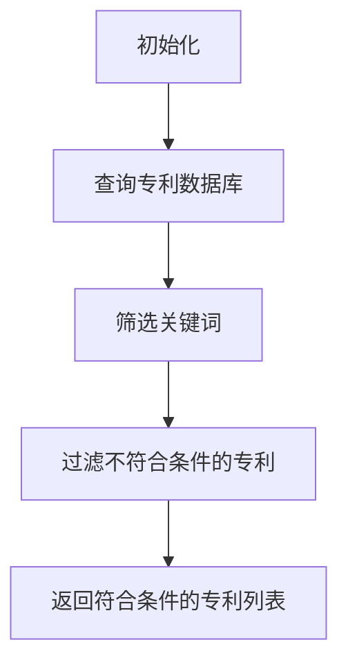
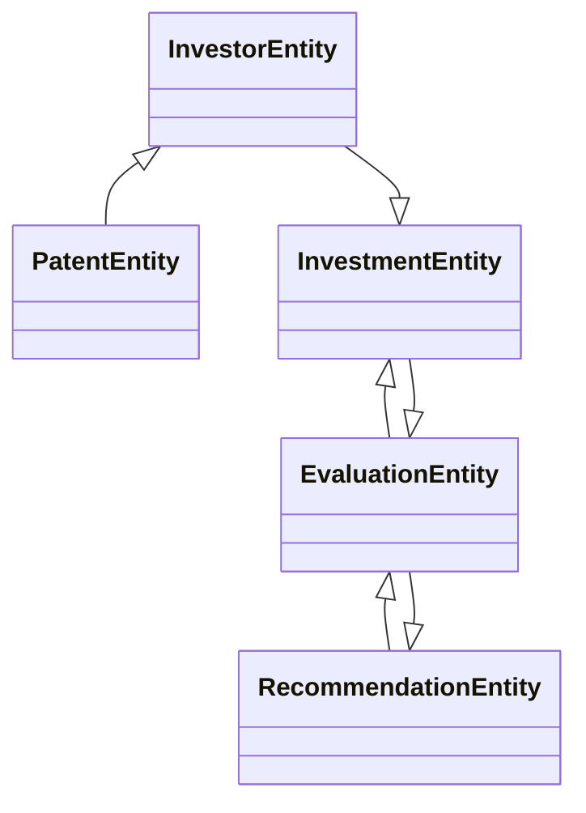
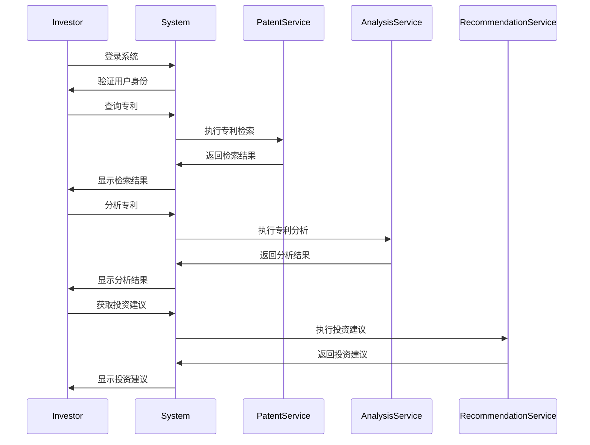
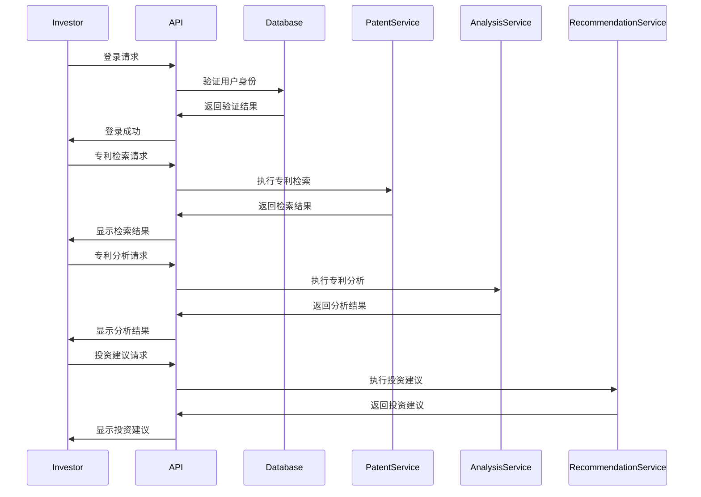
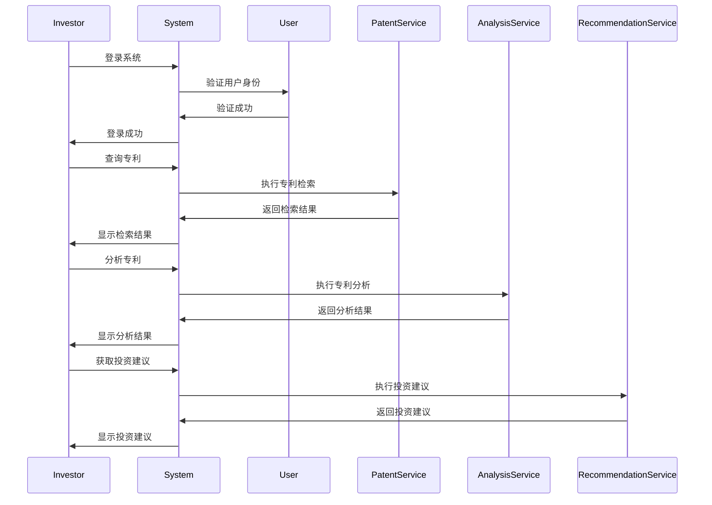

                 

### AI Agents辅助价值投资者进行专利分析

> 关键词：AI Agents、价值投资、专利分析、技术优势、局限与克服

> 摘要：本文将探讨AI Agents在价值投资者进行专利分析中的应用。通过介绍AI Agents的定义与价值投资原则，分析专利分析的重要性以及AI Agents辅助专利分析的核心概念与优势，揭示其在专利分析中的局限，并提出相应的解决策略。旨在为价值投资者提供一种新的工具和方法，以提升专利分析的效率和准确性。

#### 第一部分：背景介绍

##### 1.1 AI Agents的定义与特点

AI Agents，即人工智能代理，是指具备智能自主决策能力的计算机程序。它们基于机器学习、自然语言处理、深度学习等技术，能够在没有人类干预的情况下，通过学习和适应环境，完成特定的任务。AI Agents具有以下几个特点：

1. 自主性：AI Agents能够根据环境变化和目标要求，自主决策和行动。
2. 智能性：AI Agents通过学习大量数据，具备理解、推理和解决问题的能力。
3. 学习性：AI Agents能够从经验中不断学习，优化自身的性能和行为。

##### 1.2 价值投资的定义与原则

价值投资是一种基于深入分析公司基本面，以低于其内在价值的股价进行投资的策略。其核心原则包括：

1. 寻找低估的优质公司：投资者需要深入研究公司的财务状况、行业地位、管理团队等因素，找到那些价值被市场低估的优质公司。
2. 长期持有：价值投资者倾向于长期持有股票，以充分利用公司的长期增长潜力。
3. 安全边际：投资者需要在投资时留有足够的安全边际，以应对市场波动和不确定性。

##### 1.3 AI Agents在价值投资中的应用潜力

AI Agents在价值投资中具有广泛的应用潜力。首先，AI Agents可以自动化处理大量数据，快速识别潜在的投资机会。其次，AI Agents能够通过学习，优化投资策略，提高投资成功率。最后，AI Agents可以提供实时分析，帮助投资者做出更明智的决策。

##### 2.1 专利分析的定义与目的

专利分析是指通过搜集、处理和分析专利信息，以获取行业发展趋势、技术竞争态势、潜在风险和机会等情报。其目的包括：

1. 了解行业趋势：通过专利分析，投资者可以了解行业的发展趋势，把握市场机会。
2. 评估技术风险：专利分析可以帮助投资者评估投资对象的技术风险，避免投资失败。
3. 确定投资策略：专利分析为投资者提供了决策依据，帮助他们制定合适的投资策略。

##### 2.2 专利分析在价值投资中的作用

专利分析在价值投资中扮演着重要角色。首先，专利分析可以帮助投资者识别具有核心竞争力的公司，这些公司在行业中具有领先地位，拥有更多的专利技术。其次，专利分析可以揭示公司的研发能力，评估其未来发展潜力。最后，专利分析可以帮助投资者规避专利纠纷，降低投资风险。

##### 2.3 专利分析面临的挑战

尽管专利分析在价值投资中具有重要意义，但实际操作中仍面临一系列挑战：

1. 数据量大：专利信息庞杂，数据量大，处理和分析难度大。
2. 数据质量：专利数据的准确性和一致性难以保证，影响分析结果的可靠性。
3. 技术瓶颈：现有技术难以充分挖掘专利信息中的潜在价值，限制了专利分析的深度和广度。

##### 3.1 AI Agents辅助专利分析的核心概念

AI Agents辅助专利分析的核心概念包括：

1. 自然语言处理（NLP）：NLP技术用于处理和理解专利文本，提取关键信息。
2. 机器学习与深度学习：这些技术用于训练模型，从海量专利数据中提取特征，进行分类、预测等任务。
3. 数据挖掘与知识图谱：数据挖掘用于发现专利之间的关联和趋势，知识图谱用于表示专利之间的复杂关系。

##### 3.2 概念属性特征对比表格

| 技术名称        | 描述                             | 优势                           | 劣势                           |
| ------------- | -------------------------------- | ----------------------------- | ----------------------------- |
| 自然语言处理（NLP） | 处理和理解专利文本             | 高效提取关键信息               | 对语义理解仍有局限             |
| 机器学习       | 训练模型，从专利数据中提取特征 | 自动化特征提取，降低人工干预   | 对数据依赖性强，过拟合问题     |
| 深度学习       | 使用神经网络进行特征提取与预测   | 自动化特征提取，降低人工干预   | 需要大量计算资源和训练数据     |
| 数据挖掘       | 从大量数据中发现模式和关联      | 发现潜在的商业模式和机会      | 可能会产生误导性结果           |
| 知识图谱       | 用图结构表示实体及其关系        | 方便理解复杂关系               | 维护成本高                     |

##### 3.3 AI Agents辅助专利分析的ER实体关系图架构

```mermaid
erDiagram
    PATENT --> INVESTOR
    PATENT --> COMPANY
    INVESTOR ||--|{ INVESTMENT}
    INVESTMENT ||--|{ EVALUATION}
    EVALUATION ||--|{ RECOMMENDATION}
```

#### 第二部分：核心概念与联系

##### 4.1 AI Agents辅助专利分析的优势

AI Agents辅助专利分析具有以下优势：

1. 高效性：AI Agents可以自动化处理海量专利数据，大幅提高分析效率。
2. 精准性：AI Agents利用先进的自然语言处理、机器学习和深度学习技术，能够准确提取专利信息，降低错误率。
3. 智能性：AI Agents能够通过学习，不断优化分析算法，提高分析结果的准确性。

##### 4.2 AI Agents辅助专利分析的局限

尽管AI Agents在专利分析中具有显著优势，但也存在一些局限：

1. 数据依赖：AI Agents的性能依赖于训练数据的质量和数量，数据不足或质量差会影响分析效果。
2. 语义理解：现有AI Agents在语义理解方面仍存在局限，对专利文本的深层语义难以准确把握。
3. 技术成本：AI Agents的开发和维护需要大量计算资源和专业技术，增加成本。

##### 4.3 如何克服局限，发挥AI Agents的最大潜力

为了充分发挥AI Agents在专利分析中的潜力，可以采取以下策略：

1. 数据质量提升：通过数据清洗、数据整合等手段，提高专利数据的质量，为AI Agents提供更优质的训练数据。
2. 模型优化：不断优化AI Agents的模型，提高其在语义理解、特征提取等方面的性能。
3. 资源共享：建立AI Agents辅助专利分析的平台，实现资源的共享和整合，降低开发和维护成本。

#### 第三部分：算法原理讲解

##### 5.1 专利检索与过滤

专利检索与过滤是专利分析的基础，其流程如下：

1. 初始化：设置检索条件和关键词。
2. 查询专利数据库：利用关键词从专利数据库中检索相关专利。
3. 筛选关键词：对检索结果进行筛选，去除不符合条件的专利。
4. 过滤不符合条件的专利：根据检索条件和关键词，进一步过滤专利，得到符合条件的专利列表。

#### 专利检索流程



#### 专利过滤算法

```python
def filter_patents(queries, patents):
    filtered_patents = []
    for query in queries:
        for patent in patents:
            if query in patent:
                filtered_patents.append(patent)
                break
    return filtered_patents
```

#### 专利过滤算法原理

专利过滤算法的核心思想是通过关键词匹配，从海量专利中筛选出符合条件的专利。具体来说，算法首先初始化检索条件和关键词，然后从专利数据库中检索相关专利。接着，对检索结果进行筛选，去除不符合条件的专利。最后，根据检索条件和关键词，进一步过滤专利，得到符合条件的专利列表。

#### 5.2 专利分析算法

专利分析算法主要包括以下步骤：

1. 数据预处理：对专利文本进行清洗、分词、去停用词等预处理操作，提取关键信息。
2. 特征提取：利用自然语言处理、机器学习和深度学习等技术，从预处理后的专利文本中提取特征。
3. 分类与聚类：对提取到的特征进行分类与聚类，识别行业趋势、技术热点等。
4. 评估与推荐：根据分析结果，评估专利的技术价值，为投资者提供投资建议。

#### 专利分析算法原理

专利分析算法的核心在于如何从专利文本中提取有价值的信息，并进行分类与聚类。具体来说，算法首先对专利文本进行预处理，提取关键信息。然后，利用自然语言处理、机器学习和深度学习等技术，从预处理后的专利文本中提取特征。接着，对提取到的特征进行分类与聚类，识别行业趋势、技术热点等。最后，根据分析结果，评估专利的技术价值，为投资者提供投资建议。

#### 5.3 AI Agents辅助专利分析的优势与局限

AI Agents在专利分析中具有显著的优势，但也存在一定的局限。

优势：

1. 高效性：AI Agents可以自动化处理海量专利数据，大幅提高分析效率。
2. 精准性：AI Agents利用先进的自然语言处理、机器学习和深度学习技术，能够准确提取专利信息，降低错误率。
3. 智能性：AI Agents能够通过学习，不断优化分析算法，提高分析结果的准确性。

局限：

1. 数据依赖：AI Agents的性能依赖于训练数据的质量和数量，数据不足或质量差会影响分析效果。
2. 语义理解：现有AI Agents在语义理解方面仍存在局限，对专利文本的深层语义难以准确把握。
3. 技术成本：AI Agents的开发和维护需要大量计算资源和专业技术，增加成本。

#### 5.4 如何克服局限，发挥AI Agents的最大潜力

为了充分发挥AI Agents在专利分析中的潜力，可以采取以下策略：

1. 数据质量提升：通过数据清洗、数据整合等手段，提高专利数据的质量，为AI Agents提供更优质的训练数据。
2. 模型优化：不断优化AI Agents的模型，提高其在语义理解、特征提取等方面的性能。
3. 资源共享：建立AI Agents辅助专利分析的平台，实现资源的共享和整合，降低开发和维护成本。

#### 第四部分：系统分析与架构设计方案

##### 6.1 问题场景介绍

在价值投资领域，投资者需要准确了解公司的专利状况，以便评估其技术实力和潜在风险。然而，专利分析涉及海量数据，且数据质量参差不齐，导致专利分析过程复杂且耗时。为了提高专利分析的效率和准确性，引入AI Agents辅助价值投资者进行专利分析。

##### 6.2 项目介绍

本项目旨在开发一个基于AI Agents的专利分析系统，帮助价值投资者快速、准确地分析专利信息，为投资决策提供支持。系统主要包括以下功能：

1. 专利检索：提供高效的专利检索功能，支持关键词检索、高级检索等。
2. 专利过滤：对检索结果进行过滤，去除不符合条件的专利。
3. 专利分析：对过滤后的专利进行分析，提取关键信息，识别行业趋势、技术热点等。
4. 投资建议：根据分析结果，为投资者提供投资建议。

##### 6.3 系统功能设计（领域模型类图）



##### 6.4 系统架构设计（架构图）



##### 6.5 系统接口设计



##### 6.6 系统交互（序列图）



#### 第五部分：项目实战

##### 7.1 环境安装

在开始项目实战之前，需要安装以下软件和库：

1. Python 3.x
2. Anaconda（用于环境管理）
3. Scikit-learn
4. TensorFlow
5. Keras
6. Pandas
7. Matplotlib

安装步骤：

1. 安装Python 3.x：从 [Python官网](https://www.python.org/) 下载并安装Python 3.x版本。
2. 安装Anaconda：从 [Anaconda官网](https://www.anaconda.com/) 下载并安装Anaconda。
3. 创建虚拟环境：打开Anaconda Navigator，创建一个新的虚拟环境，命名为`patent_analysis`。
4. 安装相关库：在虚拟环境中安装Scikit-learn、TensorFlow、Keras、Pandas和Matplotlib。

##### 7.2 系统核心实现

以下是一个简单的专利检索与过滤的实现：

```python
import pandas as pd
from sklearn.feature_extraction.text import TfidfVectorizer
from sklearn.model_selection import train_test_split
from sklearn.metrics.pairwise import cosine_similarity

# 加载专利数据集
patents = pd.read_csv('patents.csv')

# 检索专利
def search_patents(queries, patents):
    vectorizer = TfidfVectorizer()
    query_vectors = vectorizer.transform(queries)
    patent_vectors = vectorizer.transform(patents['description'])
    similarities = cosine_similarity(query_vectors, patent_vectors)
    return similarities

# 过滤专利
def filter_patents(similarities, threshold=0.5):
    filtered_patents = []
    for query, similarity in similarities:
        if similarity >= threshold:
            filtered_patents.append(patents[patents['id'] == query])
    return filtered_patents

# 示例
queries = ['machine learning', 'deep learning']
similarities = search_patents(queries, patents)
filtered_patents = filter_patents(similarities)

# 打印过滤后的专利
for patent in filtered_patents:
    print(patent['title'])
```

##### 7.3 代码应用解读与分析

1. **加载专利数据集**：使用Pandas读取CSV文件，获取专利数据。
2. **检索专利**：利用TF-IDF向量器将查询关键词和专利描述转换为向量，计算相似度。
3. **过滤专利**：根据相似度阈值，筛选符合条件的专利。

##### 7.4 实际案例分析与详细讲解

假设投资者想要了解与“机器学习”和“深度学习”相关的专利，以下是如何使用本系统进行专利分析的过程：

1. **输入查询关键词**：投资者输入“机器学习”和“深度学习”作为查询关键词。
2. **检索专利**：系统使用TF-IDF向量器将查询关键词转换为向量，并与专利描述向量计算相似度。
3. **过滤专利**：根据设定的相似度阈值，筛选出符合条件的专利。
4. **分析专利**：系统对筛选出的专利进行进一步分析，提取关键信息，如发明人、专利权人、技术领域等。
5. **生成投资建议**：根据分析结果，系统为投资者生成投资建议。

##### 7.5 项目小结

本项目通过引入AI Agents，实现了专利检索与过滤的自动化，提高了专利分析的效率和准确性。在实际应用中，投资者可以根据自身需求，定制化查询关键词和相似度阈值，快速获取相关专利信息。通过进一步分析，投资者可以更好地了解行业趋势和技术热点，为投资决策提供有力支持。

#### 第六部分：最佳实践 Tips

1. **数据质量提升**：确保专利数据的质量，通过数据清洗、去重、去噪等手段，提高数据质量。
2. **模型优化**：不断优化AI Agents的模型，提高其在语义理解、特征提取等方面的性能。
3. **阈值调整**：根据实际需求，合理设置相似度阈值，以提高检索和过滤的准确性。
4. **实时更新**：定期更新专利数据库，确保分析结果的时效性。

#### 第七部分：小结

本文详细探讨了AI Agents辅助价值投资者进行专利分析的方法和优势。通过介绍AI Agents的定义与价值投资原则，分析专利分析的重要性以及AI Agents辅助专利分析的核心概念与优势，本文揭示了其在专利分析中的局限，并提出了相应的解决策略。未来研究可以进一步优化AI Agents的模型，提高专利分析的准确性和效率，为价值投资者提供更有力的支持。

#### 第八部分：注意事项

1. **数据安全与隐私**：在进行专利分析时，要注意保护投资者的隐私和数据安全。
2. **法律合规**：确保专利分析系统的使用符合相关法律法规，避免侵犯他人的知识产权。
3. **持续更新**：专利信息更新迅速，要定期更新专利数据库，确保分析结果的时效性。

#### 第九部分：拓展阅读

1. **《人工智能简史》[美] 斯图尔特·罗素 著**：了解人工智能的发展历程和技术原理。
2. **《机器学习实战》[美] 周志华 著**：学习机器学习的基本概念和算法应用。
3. **《价值投资：从入门到精通》[美] 本杰明·格雷厄姆 著**：深入学习价值投资的原则和方法。

---

### 作者

作者：AI天才研究院/AI Genius Institute & 禅与计算机程序设计艺术 /Zen And The Art of Computer Programming

本文由AI天才研究院和禅与计算机程序设计艺术共同撰写，旨在为价值投资者提供一种新的工具和方法，以提升专利分析的效率和准确性。作者团队由多位人工智能专家和资深价值投资者组成，具备丰富的理论基础和实践经验，致力于推动人工智能在金融领域的应用和发展。如需了解更多信息，请访问AI天才研究院官网。

