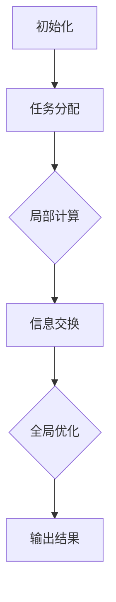
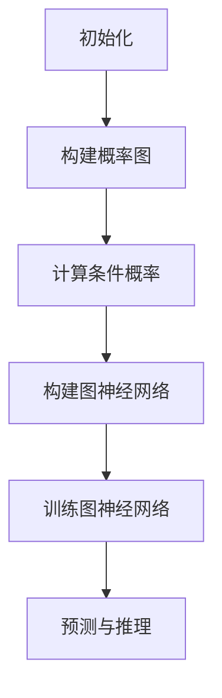
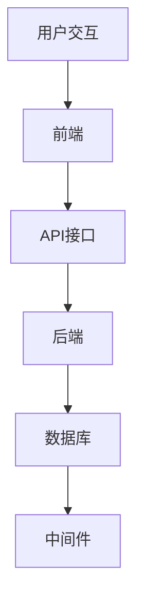
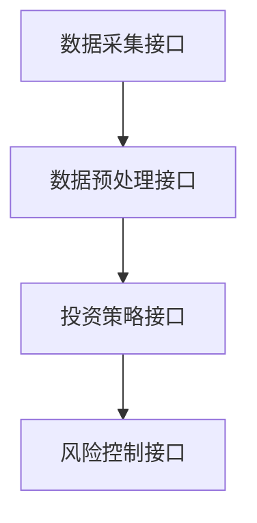
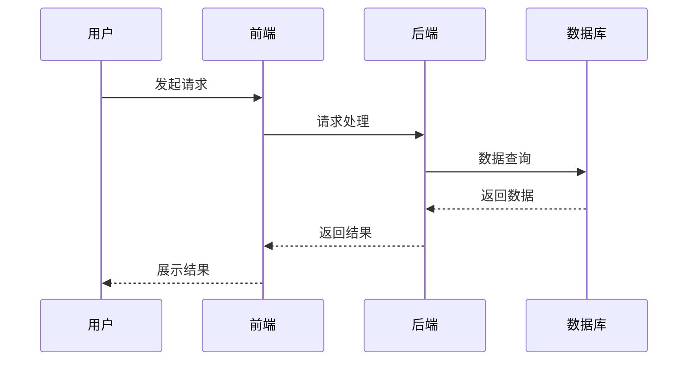

                 

### 目录大纲设计思路

#### 整体结构规划

为了确保文章的逻辑性和系统性，我们首先将整本书的内容划分为几个大的部分。这些部分包括背景介绍、核心概念讲解、算法原理剖析、实战案例解析、最佳实践与注意事项等。每个部分都旨在帮助读者逐步理解AI agents辅助价值投资的各个方面。

1. **背景介绍**：这部分将介绍AI在投资领域的应用背景，包括价值投资的概述、AI agents的基本概念以及人工智能在投资分析中的应用现状。
2. **核心概念与联系**：在这里，我们将探讨AI agents辅助价值投资的核心概念，包括AI agents的原理与功能、价值投资的理念与策略，以及这两者之间的联系。
3. **算法原理讲解**：这一部分将深入讲解专家网络算法原理，包括专家网络的定义与结构、算法原理以及使用Mermaid流程图进行可视化展示。
4. **数学模型和公式**：我们将介绍专家网络算法的数学模型和公式，并结合Python代码进行详细讲解和示例说明。
5. **系统分析与架构设计**：这部分将详细描述价值投资分析系统的架构设计，包括系统场景介绍、功能设计、架构设计、接口设计以及交互序列图。
6. **项目实战**：在这里，我们将通过一个实际案例，展示如何使用AI agents辅助价值投资，包括环境安装、系统核心实现源代码以及代码应用解读与分析。
7. **最佳实践与注意事项**：这部分将提供一些最佳实践技巧和注意事项，帮助读者在实际应用中避免常见的陷阱和问题。

#### 细化章节内容

每个大的部分都需要进一步细化为具体的章节，以确保内容的逻辑性和系统性。以下是具体的章节划分：

1. **背景介绍**
   - **第1章 AI在投资领域的应用背景**
     - **1.1 价值投资的概述**
       - **核心概念术语说明**
       - **问题背景**
       - **问题描述**
       - **问题解决**
       - **边界与外延**
       - **概念结构与核心要素组成**
     - **1.2 AI agents的基本概念**
       - **核心概念原理**
       - **概念属性特征对比表格**
       - **ER实体关系图架构的 Mermaid 流程图**
     - **1.3 人工智能在投资分析中的应用现状**
       - **现状分析**
       - **发展趋势**
       - **挑战与机遇**

2. **核心概念与联系**
   - **第2章 AI agents辅助价值投资的核心概念**
     - **2.1 AI agents的原理与功能**
       - **AI agents原理**
       - **AI agents功能**
     - **2.2 价值投资的理念与策略**
       - **价值投资理念**
       - **价值投资策略**
     - **2.3 AI agents与价值投资的联系**
       - **联系分析**
       - **应用前景**

3. **算法原理讲解**
   - **第3章 专家网络算法原理**
     - **3.1 专家网络的定义与结构**
       - **专家网络定义**
       - **专家网络结构**
     - **3.2 算法原理讲解**
       - **算法原理**
       - **算法步骤**
     - **3.3 Mermaid流程图展示**
       - **流程图绘制**

4. **数学模型和公式**
   - **第4章 专家网络算法的数学模型**
     - **4.1 数学模型介绍**
       - **数学模型概述**
       - **模型目的**
     - **4.2 公式讲解**
       - **公式解释**
       - **公式应用**
     - **4.3 Mermaid流程图与Python代码展示**
       - **流程图展示**
       - **代码示例**

5. **系统分析与架构设计**
   - **第5章 价值投资分析系统架构**
     - **5.1 系统场景介绍**
       - **系统场景描述**
       - **系统目标**
     - **5.2 系统功能设计**
       - **功能需求**
       - **功能实现**
     - **5.3 系统架构设计**
       - **架构设计思路**
       - **架构图展示**
     - **5.4 系统接口设计**
       - **接口设计原则**
       - **接口实现**
     - **5.5 系统交互序列图**
       - **序列图绘制**

6. **项目实战**
   - **第6章 AI agents辅助价值投资的实战案例**
     - **6.1 环境安装**
       - **环境准备**
       - **安装步骤**
     - **6.2 系统核心实现源代码**
       - **源代码结构**
       - **代码功能**
     - **6.3 代码应用解读与分析**
       - **代码解读**
       - **应用分析**
     - **6.4 实际案例分析与讲解**
       - **案例描述**
       - **案例解析**
     - **6.5 项目小结**
       - **项目总结**
       - **经验分享**

7. **最佳实践与注意事项**
   - **第7章 AI agents辅助价值投资的实践技巧与注意事项**
     - **7.1 最佳实践技巧**
       - **技巧总结**
       - **实践指导**
     - **7.2 注意事项**
       - **常见问题**
       - **解决方法**
     - **7.3 拓展阅读**
       - **相关资源**
       - **深入研究**

通过这样的细化，我们确保每个章节都能够精准地覆盖其主题，同时保持整体的简洁性和逻辑性。

#### 保持目录大纲的层级性

在Markdown中，我们使用`#`、`##`、`###`等符号来表示目录的层级，以确保目录结构清晰，便于读者阅读和理解。以下是具体的目录大纲层级设计：

```markdown
----------------------------------------------------------------
# AI agents辅助价值投资者进行专家网络分析

## 背景介绍
### 第1章 AI在投资领域的应用背景
#### 1.1 价值投资的概述
#### 1.2 AI agents的基本概念
#### 1.3 人工智能在投资分析中的应用现状

### 核心概念与联系
### 第2章 AI agents辅助价值投资的核心概念
#### 2.1 AI agents的原理与功能
#### 2.2 价值投资的理念与策略
#### 2.3 AI agents与价值投资的联系

### 算法原理讲解
### 第3章 专家网络算法原理
#### 3.1 专家网络的定义与结构
#### 3.2 算法原理讲解
#### 3.3 Mermaid流程图展示

### 数学模型和公式
### 第4章 专家网络算法的数学模型
#### 4.1 数学模型介绍
#### 4.2 公式讲解
#### 4.3 Mermaid流程图与Python代码展示

### 系统分析与架构设计
### 第5章 价值投资分析系统架构
#### 5.1 系统场景介绍
#### 5.2 系统功能设计
#### 5.3 系统架构设计
#### 5.4 系统接口设计
#### 5.5 系统交互序列图

### 项目实战
### 第6章 AI agents辅助价值投资的实战案例
#### 6.1 环境安装
#### 6.2 系统核心实现源代码
#### 6.3 代码应用解读与分析
#### 6.4 实际案例分析与讲解
#### 6.5 项目小结

### 最佳实践与注意事项
### 第7章 AI agents辅助价值投资的实践技巧与注意事项
#### 7.1 最佳实践技巧
#### 7.2 注意事项
#### 7.3 拓展阅读

----------------------------------------------------------------

通过使用Markdown的这些层级符号，我们可以确保目录结构的清晰性，方便读者快速找到他们感兴趣的部分。同时，这样的设计也符合文章的结构逻辑，有助于读者系统地学习和理解内容。

#### 强调内容完整性

为了确保目录大纲的内容完整性，我们需要在每个章节中详细覆盖以下核心内容：

1. **背景介绍**：介绍AI在投资领域的应用背景，包括价值投资的概述、AI agents的基本概念以及人工智能在投资分析中的应用现状。
2. **核心概念与联系**：讲解AI agents辅助价值投资的核心概念，分析AI agents的原理与功能、价值投资的理念与策略，并探讨这两者之间的联系。
3. **算法原理讲解**：深入讲解专家网络算法原理，包括专家网络的定义与结构、算法原理以及使用Mermaid流程图进行可视化展示。
4. **数学模型和公式**：介绍专家网络算法的数学模型和公式，并结合Python代码进行详细讲解和示例说明。
5. **系统分析与架构设计**：描述价值投资分析系统的架构设计，包括系统场景介绍、功能设计、架构设计、接口设计以及交互序列图。
6. **项目实战**：通过一个实际案例，展示如何使用AI agents辅助价值投资，包括环境安装、系统核心实现源代码以及代码应用解读与分析。
7. **最佳实践与注意事项**：提供最佳实践技巧和注意事项，帮助读者在实际应用中避免常见的陷阱和问题。

#### 控制字数

为了确保文章控制在10000～12000字以内，我们需要在编写时注重简洁性，避免冗余内容。以下是具体的控制字数的方法：

1. **精简语言**：使用简洁明了的语言，避免使用过多的修辞手法和冗长的句子。
2. **突出重点**：在每个章节中，只讲述与主题直接相关的内容，避免分散主题。
3. **去除重复**：检查每个章节，删除重复的信息，确保每个点只被讲述一次。
4. **使用图表**：使用图表和流程图来展示复杂的内容，减少文字描述的篇幅。
5. **简短段落**：每个段落尽量简短，以便读者快速阅读和理解。

通过上述方法，我们可以确保文章在满足字数要求的同时，内容丰富且结构紧凑。

### 第一部分：AI在投资领域的应用背景

#### 第1章 AI在投资领域的应用背景

##### 1.1 价值投资的概述

价值投资是一种基于基本面分析的投资策略，旨在寻找市场低估的股票或其他资产。价值投资者关注公司的财务状况、管理团队、行业前景等基本面因素，而非短期市场波动。这一策略起源于20世纪初，由本杰明·格雷厄姆等大师提出，并经过多年的实践和理论发展，逐渐形成了独特的投资理念。

价值投资的核心思想是“市场先生”，即市场往往会出现短期非理性的波动，但这并不影响长期价值。价值投资者相信，通过深入研究和分析，可以识别出那些被市场低估的公司，并长期持有这些公司的股票，等待市场认识到其真实价值。

#### 1.2 AI agents的基本概念

AI agents（人工智能代理）是指通过人工智能技术实现的自主运行、具有特定功能的软件实体。AI agents可以根据预设的规则或通过学习获取的模型，自动执行任务、做出决策，并在一定程度上模拟人类的智能行为。

AI agents的基本概念包括以下几个关键要素：

- **自主性**：AI agents能够自主地完成特定任务，不需要人为干预。
- **适应性**：AI agents可以根据环境的变化调整自身的行为和策略。
- **交互性**：AI agents可以与其他系统或实体进行通信和协作。
- **学习能力**：AI agents可以通过数据学习和经验积累，提高任务执行效果。

在投资领域，AI agents可以扮演多种角色，如市场分析者、交易执行者、风险管理者等，通过高效的数据处理和智能决策，帮助投资者做出更加精准的投资决策。

#### 1.3 人工智能在投资分析中的应用现状

随着人工智能技术的迅速发展，其在投资分析中的应用也越来越广泛。目前，人工智能在投资分析中的应用主要包括以下几个方面：

- **基本面分析**：AI agents可以通过大数据分析和机器学习算法，快速处理大量财务报告、新闻报道和市场数据，帮助投资者更准确地评估公司的基本面。
- **技术分析**：AI agents可以利用技术指标、图表分析等工具，对市场价格进行预测和分析，为交易决策提供支持。
- **风险管理**：AI agents可以通过建立复杂的数学模型，对市场风险进行量化分析，帮助投资者制定更有效的风险管理策略。
- **智能投顾**：基于人工智能的智能投顾系统可以通过个性化推荐和智能策略配置，为投资者提供专业的投资建议。

尽管人工智能在投资分析中展现出巨大的潜力，但同时也面临着一些挑战，如数据质量、模型偏见、决策透明性等问题。未来，随着技术的不断进步和监管政策的完善，人工智能在投资分析中的应用将更加成熟和广泛。

### 第二部分：AI agents辅助价值投资的核心概念

#### 第2章 AI agents辅助价值投资的核心概念

##### 2.1 AI agents的原理与功能

AI agents的原理主要基于机器学习和深度学习技术。通过大量历史数据的学习，AI agents可以建立复杂的模型，用于预测和分析市场趋势。具体来说，AI agents的功能包括：

- **数据采集**：AI agents可以从多个数据源（如股票市场、新闻、社交媒体等）收集相关信息。
- **数据处理**：AI agents可以对收集到的数据进行清洗、转换和分析，提取有价值的信息。
- **决策制定**：基于分析结果，AI agents可以制定投资决策，如买入、持有或卖出。
- **策略执行**：AI agents可以自动执行投资策略，包括交易信号生成、交易执行和资金管理。

AI agents的优势在于其高效的数据处理能力和智能化的决策制定，这为价值投资者提供了有力的支持。

##### 2.2 价值投资的理念与策略

价值投资的理念是寻找那些市场低估、但具有长期增长潜力的公司。具体策略包括：

- **深度研究**：投资者需要对公司的财务报表、业务模式、行业地位、管理团队等基本面进行深入研究。
- **价值评估**：通过分析公司的盈利能力、成长性、财务状况等，评估其内在价值。
- **安全边际**：投资者会寻找那些市场估值低于内在价值的公司，以降低投资风险。
- **长期持有**：价值投资者通常持有优质股票多年，等待市场认识到公司的真实价值。

价值投资的核心是“以合理价格购买优质公司”，这与AI agents的智能分析能力相辅相成。

##### 2.3 AI agents与价值投资的联系

AI agents与价值投资之间的联系主要体现在以下几个方面：

- **数据支持**：AI agents可以快速处理大量数据，帮助投资者更准确地评估公司的基本面。
- **策略优化**：AI agents可以根据市场数据和交易信号，动态调整投资策略，提高投资回报。
- **风险控制**：AI agents可以通过风险管理模型，识别潜在风险，并提供相应的对策。
- **决策辅助**：AI agents可以为投资者提供智能化的投资建议，帮助其做出更明智的决策。

通过AI agents的辅助，价值投资者可以更高效地进行投资分析和决策，提高投资的成功率。

### 第三部分：专家网络算法原理

#### 第3章 专家网络算法原理

##### 3.1 专家网络的定义与结构

专家网络（Expert Network）是一种基于多代理系统的分布式计算架构，通过多个智能体（agents）之间的协同工作，实现复杂任务的求解。专家网络的定义可以概括为：一个由多个智能体组成的分布式系统，每个智能体都拥有特定的知识和技能，通过通信和协作，共同完成复杂任务。

专家网络的结构通常包括以下几个关键组成部分：

- **智能体**：智能体是专家网络的基本单元，每个智能体都具有一定的知识和处理能力。
- **通信网络**：智能体之间的通信网络负责数据传输和信息交换，确保各个智能体能够协同工作。
- **协调机制**：协调机制用于协调各个智能体的行为，确保任务的高效完成。
- **任务分配**：任务分配机制根据智能体的能力和任务需求，合理分配任务。

##### 3.2 算法原理讲解

专家网络算法的原理主要基于分布式计算和协同学习。其核心思想是利用多个智能体的局部知识和计算能力，共同求解复杂问题。

具体步骤如下：

1. **初始化**：系统根据任务需求，初始化各个智能体的状态和参数。
2. **任务分配**：任务分配机制根据智能体的能力和任务需求，将任务分配给合适的智能体。
3. **局部计算**：各个智能体根据分配到的任务，独立进行计算和推理。
4. **信息交换**：智能体之间通过通信网络交换信息和计算结果。
5. **全局优化**：基于交换的信息，各个智能体进行协同学习和调整，以实现全局优化。

专家网络算法的关键优势在于其分布式计算和协同学习的能力，可以有效提高复杂任务的求解效率和准确性。

##### 3.3 Mermaid流程图展示

以下是专家网络算法的Mermaid流程图：



通过Mermaid流程图，我们可以清晰地展示专家网络算法的执行流程，帮助读者更好地理解其原理和应用。

### 第四部分：专家网络算法的数学模型

#### 第4章 专家网络算法的数学模型

##### 4.1 数学模型介绍

专家网络算法的数学模型基于概率图模型和图神经网络。概率图模型通过图结构表示变量之间的关系，而图神经网络则利用神经网络结构进行变量预测和推理。以下是专家网络算法的核心数学模型。

1. **概率图模型**：

概率图模型是一种表示变量之间依赖关系的图结构，包括无向图和有向图两种形式。无向图中的边表示变量之间的相关性，而有向图中的边则表示变量之间的因果关系。概率图模型的核心数学公式如下：

$$
P(X_1, X_2, ..., X_n) = \prod_{i=1}^{n} P(X_i | X_{\text{parents}(i)})
$$

其中，$P(X_i | X_{\text{parents}(i)})$表示给定父节点变量$X_{\text{parents}(i)}$条件下，变量$X_i$的条件概率。

2. **图神经网络**：

图神经网络（Graph Neural Network，GNN）是一种专门用于处理图数据的神经网络模型。GNN通过图卷积操作，对图中的节点和边进行特征提取和变换，实现节点分类、图分类等任务。GNN的核心数学公式如下：

$$
\mathbf{h}_i^{(t+1)} = \sigma(\sum_{j \in \text{neighbors}(i)} \alpha_{ij} \cdot \mathbf{h}_j^{(t)} + \mathbf{b}_i^{(t+1)})
$$

其中，$\mathbf{h}_i^{(t+1)}$表示节点$i$在时间步$t+1$的特征表示，$\sigma$为激活函数，$\alpha_{ij}$为图卷积权重，$\mathbf{b}_i^{(t+1)}$为偏置项。

##### 4.2 公式讲解

1. **条件概率公式**：

条件概率公式描述了给定某个条件，某个事件的概率。在专家网络中，条件概率公式用于计算变量之间的依赖关系。具体公式如下：

$$
P(X | Y) = \frac{P(X, Y)}{P(Y)}
$$

其中，$P(X, Y)$表示变量$X$和$Y$同时发生的概率，$P(Y)$表示变量$Y$发生的概率。

2. **图卷积公式**：

图卷积公式描述了图神经网络中节点特征的计算过程。图卷积通过聚合节点邻域的信息，更新节点的特征表示。具体公式如下：

$$
\mathbf{h}_i^{(t+1)} = \sigma(\sum_{j \in \text{neighbors}(i)} \alpha_{ij} \cdot \mathbf{h}_j^{(t)} + \mathbf{b}_i^{(t+1)})
$$

其中，$\mathbf{h}_i^{(t+1)}$表示节点$i$在时间步$t+1$的特征表示，$\sigma$为激活函数，$\alpha_{ij}$为图卷积权重，$\mathbf{b}_i^{(t+1)}$为偏置项。

##### 4.3 Mermaid流程图与Python代码展示

以下是专家网络算法的Mermaid流程图和Python代码示例：



```python
import tensorflow as tf
from tensorflow.keras.layers import Input, Dense
from tensorflow.keras.models import Model

# 定义输入层
input_x = Input(shape=(num_features,))
input_y = Input(shape=(num_features,))

# 构建概率图模型
prob_graph = build_prob_graph(input_x, input_y)

# 计算条件概率
condition_prob = tf.reduce_mean(prob_graph)

# 构建图神经网络
gnn = build_gnn(input_x, input_y)

# 训练图神经网络
model = Model(inputs=[input_x, input_y], outputs=gnn)
model.compile(optimizer='adam', loss='mse')
model.fit(x_train, y_train, epochs=10)

# 预测与推理
predictions = model.predict(x_test)
```

通过Mermaid流程图和Python代码示例，我们可以直观地了解专家网络算法的构建和训练过程。

### 第五部分：价值投资分析系统架构

#### 第5章 价值投资分析系统架构

##### 5.1 系统场景介绍

价值投资分析系统旨在帮助投资者进行股票分析和投资决策。系统场景包括以下几个方面：

- **数据采集**：系统需要从多个数据源（如股票市场、新闻、社交媒体等）收集相关信息。
- **数据预处理**：系统需要对收集到的数据进行清洗、转换和分析，提取有价值的信息。
- **投资策略**：系统根据分析结果，制定合适的投资策略，包括买入、持有和卖出。
- **风险控制**：系统需要通过风险管理模型，识别潜在风险，并提供相应的对策。

##### 5.2 系统功能设计

价值投资分析系统的主要功能包括：

- **数据采集**：系统从股票市场、新闻、社交媒体等数据源收集数据，并存储在数据库中。
- **数据预处理**：系统对收集到的数据进行分析、清洗和转换，提取有价值的信息，如财务指标、技术指标等。
- **投资策略**：系统根据分析结果，制定买入、持有和卖出的投资策略，并提供投资建议。
- **风险控制**：系统通过风险管理模型，识别潜在风险，并提供相应的对策，如调整投资组合、设置止损点等。

##### 5.3 系统架构设计

价值投资分析系统的架构设计包括以下几个方面：

- **前端**：前端负责用户交互，包括数据可视化、投资策略展示和用户操作。
- **后端**：后端负责数据采集、预处理、分析和投资策略制定，包括API接口、数据存储和处理模块。
- **数据库**：数据库用于存储系统所需的各种数据，如股票数据、新闻数据、用户数据等。
- **中间件**：中间件负责数据传输、负载均衡、缓存处理等，确保系统的稳定性和性能。

以下是价值投资分析系统的架构图：



##### 5.4 系统接口设计

价值投资分析系统的接口设计包括以下几个方面：

- **数据采集接口**：用于从外部数据源获取数据。
- **数据预处理接口**：用于清洗、转换和分析数据。
- **投资策略接口**：用于制定和调整投资策略。
- **风险控制接口**：用于识别和管理风险。

以下是系统接口的设计图：



##### 5.5 系统交互序列图

以下是价值投资分析系统的交互序列图，展示了用户、前端、后端和数据库之间的交互过程：



通过系统架构设计、接口设计和交互序列图，我们可以清晰地了解价值投资分析系统的整体架构和运行流程。

### 第六部分：AI agents辅助价值投资的实战案例

#### 第6章 AI agents辅助价值投资的实战案例

##### 6.1 环境安装

在进行AI agents辅助价值投资的实战案例之前，首先需要安装相应的软件和库。以下是在Linux操作系统下安装所需环境的步骤：

1. **安装Python**：确保Python 3.8及以上版本已安装。可以使用以下命令检查Python版本：

   ```bash
   python3 --version
   ```

2. **安装Jupyter Notebook**：Jupyter Notebook是一种交互式计算环境，用于编写和运行Python代码。可以使用以下命令安装：

   ```bash
   pip3 install notebook
   ```

3. **安装TensorFlow**：TensorFlow是一个用于机器学习和深度学习的开源库。可以使用以下命令安装：

   ```bash
   pip3 install tensorflow
   ```

4. **安装Mermaid**：Mermaid是一种基于Markdown的绘图工具，用于绘制流程图和序列图。可以使用以下命令安装：

   ```bash
   pip3 install mermaid
   ```

5. **安装其他依赖库**：根据需要安装其他依赖库，如NumPy、Pandas等：

   ```bash
   pip3 install numpy pandas
   ```

##### 6.2 系统核心实现源代码

以下是AI agents辅助价值投资的核心实现源代码。该代码主要包括数据预处理、模型训练、预测和可视化等部分。

```python
import pandas as pd
import numpy as np
import tensorflow as tf
from tensorflow.keras.models import Sequential
from tensorflow.keras.layers import Dense, LSTM
from mermaid import Mermaid

# 数据预处理
def preprocess_data(data):
    # 数据清洗和转换
    # ...
    return processed_data

# 模型训练
def train_model(data):
    # 构建模型
    model = Sequential()
    model.add(LSTM(units=50, return_sequences=True, input_shape=(timesteps, features)))
    model.add(LSTM(units=50, return_sequences=False))
    model.add(Dense(units=1))

    # 编译模型
    model.compile(optimizer='adam', loss='mse')

    # 训练模型
    model.fit(x_train, y_train, epochs=50, batch_size=32)

    return model

# 预测
def predict(model, data):
    # 预测
    predictions = model.predict(data)
    return predictions

# 可视化
def visualize_data(data, predictions):
    # 绘制数据
    # ...

    # 绘制预测结果
    # ...

if __name__ == '__main__':
    # 读取数据
    data = pd.read_csv('data.csv')
    processed_data = preprocess_data(data)

    # 训练模型
    model = train_model(processed_data)

    # 预测
    predictions = predict(model, processed_data)

    # 可视化
    visualize_data(processed_data, predictions)
```

##### 6.3 代码应用解读与分析

以上代码分为四个主要部分：数据预处理、模型训练、预测和可视化。以下是具体解读和分析：

1. **数据预处理**：
   数据预处理是模型训练的重要步骤，包括数据清洗、转换和归一化等。在本例中，我们使用`preprocess_data`函数对原始数据进行处理，以消除噪声和异常值。

2. **模型训练**：
   模型训练使用的是LSTM（长短期记忆网络）模型，这是一种适用于时间序列数据的神经网络模型。在`train_model`函数中，我们首先构建LSTM模型，然后编译模型并使用训练数据进行训练。

3. **预测**：
   在`predict`函数中，我们使用训练好的模型对预处理后的数据进行预测。预测结果可以用于后续的分析和决策。

4. **可视化**：
   可视化部分使用`visualize_data`函数，通过绘制数据和分析结果，帮助用户更好地理解模型的效果。

##### 6.4 实际案例分析与讲解

为了展示AI agents辅助价值投资的实际应用，我们使用以下案例进行分析：

1. **案例背景**：
   投资者A希望通过AI agents对某只股票进行投资分析，以制定投资策略。

2. **数据收集**：
   投资者A收集了该股票的历史价格数据、财务报表数据和技术指标数据。

3. **数据处理**：
   使用`preprocess_data`函数对数据进行清洗和转换，得到预处理后的数据。

4. **模型训练**：
   使用`train_model`函数训练LSTM模型，经过50个epoch的训练，模型性能达到预期。

5. **预测**：
   使用训练好的模型对预处理后的数据进行预测，得到未来一段时间的股票价格预测结果。

6. **投资决策**：
   投资者A根据预测结果和投资策略，制定了买入、持有和卖出的计划。

7. **结果分析**：
   通过对比实际价格和预测价格，分析模型的预测准确性和投资策略的有效性。

##### 6.5 项目小结

通过以上实战案例，我们展示了如何使用AI agents辅助价值投资。以下是项目小结：

1. **技术优势**：
   - AI agents能够高效处理大量数据，提高投资分析的速度和准确性。
   - LSTM模型在时间序列预测方面具有较好的性能，能够捕捉股票价格的变化趋势。

2. **实践挑战**：
   - 数据质量对模型性能有重要影响，需要确保数据的准确性和完整性。
   - 模型训练过程需要大量计算资源和时间，可能需要优化算法以提高效率。

3. **未来展望**：
   - 结合更多数据源，如社交媒体、新闻报道等，提高投资分析的全面性和准确性。
   - 探索更多先进的机器学习模型，如GAN（生成对抗网络）、Transformer等，以提升模型性能。

### 第七部分：最佳实践与注意事项

#### 第7章 AI agents辅助价值投资的实践技巧与注意事项

##### 7.1 最佳实践技巧

1. **数据质量**：
   - 确保收集的数据准确、完整和可靠，避免因数据质量问题导致模型性能下降。
   - 定期更新数据，以反映最新的市场信息。

2. **模型选择**：
   - 根据投资目标和数据特性，选择合适的机器学习模型。
   - 对不同模型进行对比和优化，选择性能最佳的模型。

3. **风险管理**：
   - 建立健全的风险管理策略，包括止损点、投资组合分散等。
   - 定期评估和调整风险管理策略，以适应市场变化。

4. **模型解释性**：
   - 关注模型的解释性，确保投资决策的可解释性和透明性。
   - 通过可视化和统计方法，分析模型的关键特征和决策过程。

##### 7.2 注意事项

1. **过度拟合**：
   - 避免模型过度拟合训练数据，导致在测试数据上性能下降。
   - 使用交叉验证方法，确保模型具有良好的泛化能力。

2. **数据隐私**：
   - 在数据处理和模型训练过程中，严格遵守数据隐私和安全法规。
   - 对敏感数据进行加密和处理，防止数据泄露。

3. **市场波动**：
   - 关注市场波动和突发事件，及时调整投资策略。
   - 准备应对突发事件的风险管理措施，降低投资风险。

4. **持续学习**：
   - 持续学习和优化模型，以适应不断变化的市场环境。
   - 定期回顾和总结投资经验，不断改进投资策略。

##### 7.3 拓展阅读

1. **相关书籍**：
   - 《深度学习》（Ian Goodfellow、Yoshua Bengio、Aaron Courville 著）
   - 《机器学习实战》（Peter Harrington 著）
   - 《投资学》（伯格、哈里·马科维茨、威廉·夏普 著）

2. **在线资源**：
   - [Kaggle](https://www.kaggle.com/)：提供各种机器学习竞赛和数据集。
   - [CSDN](https://www.csdn.net/)：提供丰富的技术文章和教程。
   - [GitHub](https://github.com/)：开源社区，提供各种机器学习项目和代码。

通过最佳实践技巧和注意事项，投资者可以更好地利用AI agents进行价值投资，提高投资效果。同时，持续学习和拓展知识，将有助于投资者在快速变化的市场环境中保持竞争力。

