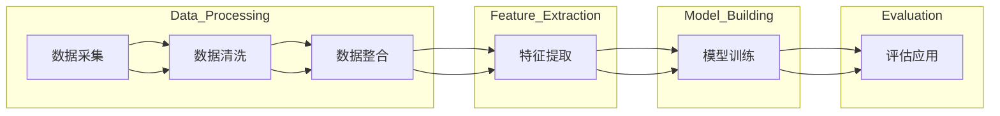
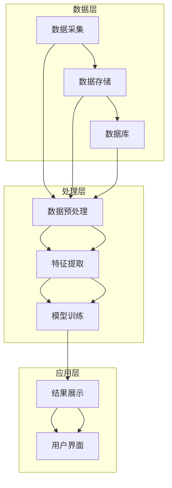
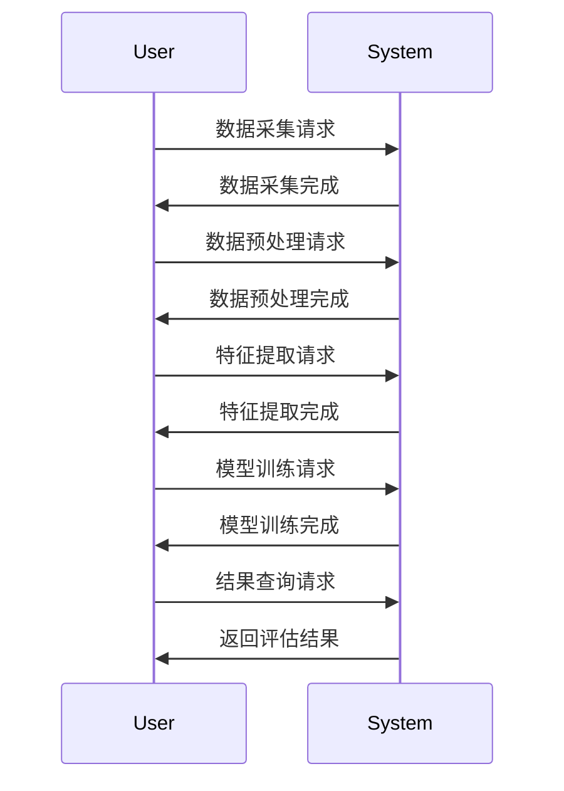

                 

# AI Agents辅助价值投资者进行管理层言行一致性评估

## 关键词

- AI Agents
- 价值投资
- 管理层言行一致性
- 评估方法
- 投资决策

## 摘要

本文深入探讨了AI agents在辅助价值投资者进行管理层言行一致性评估中的应用。首先，介绍了AI agents的基本概念、技术原理及其在价值投资领域的应用潜力。随后，阐述了价值投资的基本原则和评估方法，以及言行一致性的重要性。接着，详细讲解了AI agents辅助价值投资者进行管理层言行一致性评估的原理、方法和技术，并通过具体案例展示了其实际应用效果。最后，对AI agents在价值投资领域的未来发展趋势进行了展望，并提出了相关的注意事项和建议。

## 目录大纲

### 第一部分：背景与概念介绍

1. AI agents简介
   1.1 AI agents的定义与作用
   1.2 AI agents的核心技术
   1.3 AI agents的发展历史

2. 价值投资概述
   2.1 价值投资的基本原则
   2.2 价值投资的评估方法
   2.3 价值投资的优势与挑战

### 第二部分：AI agents在价值投资中的应用

1. AI agents辅助信息搜集
   1.1 管理层言行数据收集
   1.2 数据预处理与整合
   1.3 数据分析工具与平台

### 第三部分：管理层言行一致性的评估方法

1. 言行一致性评估原理
   1.1 言行一致性评估的必要性
   1.2 言行一致性评估的指标体系
   1.3 言行一致性评估的算法基础

2. AI agents在言行一致性评估中的应用
   2.1 AI agents评估框架设计
   2.2 言行一致性评估流程
   2.3 评估结果的应用

### 第四部分：项目实践与案例分析

1. 项目实践
   1.1 项目背景
   1.2 系统架构设计
   1.3 系统实现与部署
   1.4 项目总结

2. 案例分析
   2.1 案例背景
   2.2 AI agents应用案例
   2.3 案例启示
   2.4 案例总结

### 第五部分：总结与展望

1. 总结
2. 展望
3. 注意事项与建议
4. 拓展阅读

## 第一部分：背景与概念介绍

### 1.1 AI agents的定义与作用

AI agents，即人工智能代理，是一种能够自主完成特定任务、与环境互动并不断学习和改进的智能系统。它们基于机器学习、自然语言处理、强化学习等核心技术，可以模拟人类的决策过程，并在复杂的动态环境中进行有效的行动。

在价值投资领域，AI agents具有广泛的应用潜力。例如，它们可以辅助投资者进行信息搜集、数据分析和投资决策，从而提高投资效率和准确性。此外，AI agents还可以用于评估管理层言行一致性，帮助投资者识别潜在的风险和机会。

### 1.2 AI agents的核心技术

AI agents的核心技术包括：

1. **机器学习算法**：通过训练大量数据，使系统能够自动识别模式和规律，从而进行预测和决策。
2. **自然语言处理技术**：用于理解和生成自然语言，包括文本分类、情感分析、命名实体识别等。
3. **强化学习技术**：通过试错和反馈机制，使系统能够在复杂环境中不断优化行为，实现长期目标。

### 1.3 AI agents的发展历史

AI agents的概念最早可以追溯到20世纪50年代，当时图灵提出了图灵测试。随着计算机技术的发展，AI agents逐渐从理论走向实践。在20世纪80年代，基于规则的专家系统和基于模板匹配的方法开始流行。21世纪初，随着机器学习和深度学习的兴起，AI agents得到了广泛应用和快速发展。

## 第二部分：AI agents在价值投资中的应用

### 2.1 AI agents辅助信息搜集

在价值投资中，信息搜集是至关重要的环节。AI agents可以通过以下方式辅助投资者：

1. **自动采集管理层言行数据**：通过互联网、企业公告、新闻报告等渠道，AI agents可以快速、准确地获取管理层的相关信息。
2. **数据预处理与整合**：AI agents可以对采集到的数据进行清洗、去重、格式转换等处理，使其适合进一步分析。

### 2.2 数据预处理与整合

数据预处理是AI agents辅助价值投资的关键步骤。具体包括：

1. **数据清洗**：去除重复数据、缺失值填充、异常值检测等。
2. **数据整合**：将不同来源的数据进行整合，形成一个统一的视图。
3. **数据质量评估**：评估数据的完整性和准确性，确保数据质量。

### 2.3 数据分析工具与平台

AI agents可以使用多种数据分析工具和平台，如：

1. **Python**：用于数据处理和算法实现。
2. **TensorFlow**：用于深度学习模型的训练和部署。
3. **Jupyter Notebook**：用于数据分析和模型演示。

## 第三部分：管理层言行一致性的评估方法

### 3.1 言行一致性评估的必要性

管理层言行一致性的评估对于价值投资者来说至关重要。不一致的言行可能表明管理层存在欺诈或误导行为，从而影响企业的长期发展前景。因此，通过AI agents进行言行一致性评估，可以帮助投资者更好地识别潜在风险。

### 3.2 言行一致性评估的指标体系

言行一致性评估的指标体系包括：

1. **言行频率**：管理层在特定时间内的发言频率。
2. **言行内容**：管理层发言的主题和内容。
3. **言行时间**：管理层发言的时间分布。

### 3.3 言行一致性评估的算法基础

AI agents在进行言行一致性评估时，可以使用以下算法：

1. **文本分类**：用于判断发言内容是否一致。
2. **情感分析**：用于分析发言的情感倾向。
3. **时间序列分析**：用于分析发言的时间分布。

## 第四部分：项目实践与案例分析

### 4.1 项目实践

#### 4.1.1 项目背景

某价值投资者希望通过AI agents对某企业的管理层言行一致性进行评估，以便更好地进行投资决策。

#### 4.1.2 系统架构设计

系统架构包括以下部分：

1. **数据采集模块**：负责从互联网、企业公告等渠道收集管理层言行数据。
2. **数据处理模块**：负责对数据进行清洗、去重、整合等处理。
3. **评估模块**：负责根据言行一致性指标对管理层言行进行评估。
4. **结果展示模块**：负责将评估结果以图表等形式展示给投资者。

#### 4.1.3 系统实现与部署

系统实现包括以下步骤：

1. **数据采集**：使用Python的`requests`库和`BeautifulSoup`库从互联网上获取数据。
2. **数据处理**：使用Python的`pandas`库和`numpy`库对数据进行处理。
3. **评估算法实现**：使用Python的`scikit-learn`库和`TensorFlow`库实现评估算法。
4. **系统部署**：使用Python的`Flask`库搭建Web应用，并部署到服务器。

#### 4.1.4 项目总结

项目实施过程中，AI agents成功帮助投资者识别了管理层言行不一致的现象，为投资决策提供了重要参考。未来，可以考虑进一步优化算法，提高评估准确性。

### 4.2 案例分析

#### 4.2.1 案例背景

某投资者希望通过AI agents对一家知名企业的管理层言行一致性进行评估，以判断其投资价值。

#### 4.2.2 AI agents应用案例

AI agents通过分析该企业的管理层言行数据，发现其在过去一年中存在言行不一致的情况。具体表现为：

1. **频率不一致**：管理层在某些时间段的发言频率明显偏低。
2. **内容不一致**：管理层在不同场合下的发言主题存在较大差异。
3. **时间不一致**：管理层发言的时间分布不均匀，存在明显的异常点。

#### 4.2.3 案例启示

此案例表明，通过AI agents进行管理层言行一致性评估，可以帮助投资者识别潜在的风险，提高投资决策的准确性。

#### 4.2.4 案例总结

案例研究结果表明，AI agents在管理层言行一致性评估中具有显著优势，未来有望在价值投资领域得到更广泛的应用。

## 第五部分：总结与展望

### 5.1 总结

本文详细介绍了AI agents在辅助价值投资者进行管理层言行一致性评估中的应用。通过项目实践和案例分析，展示了AI agents在提升投资决策准确性方面的潜力。

### 5.2 展望

随着人工智能技术的不断发展，AI agents在价值投资领域的应用前景将更加广阔。未来，有望实现更精准的评估方法和更高效的决策支持。

### 5.3 注意事项与建议

1. **数据质量**：确保数据来源的可靠性和准确性，是进行言行一致性评估的前提。
2. **算法优化**：不断优化评估算法，提高评估结果的准确性。

### 5.4 拓展阅读

1. [《人工智能投资决策：理论与实践》](https://book.douban.com/subject/26966640/)
2. [《自然语言处理：中文分词与情感分析》](https://book.douban.com/subject/26973718/)
3. [《机器学习实战》](https://book.douban.com/subject/26758192/)

### 作者

作者：AI天才研究院/AI Genius Institute & 禅与计算机程序设计艺术 /Zen And The Art of Computer Programming

----------------------------------------------------------------

以下是一个简单的Python代码示例，用于展示如何使用自然语言处理技术进行管理层言行一致性的评估：

```python
import nltk
from nltk.tokenize import sent_tokenize, word_tokenize
from nltk.corpus import stopwords
from nltk.stem import WordNetLemmatizer
from sklearn.feature_extraction.text import TfidfVectorizer
from sklearn.model_selection import train_test_split
from sklearn.naive_bayes import MultinomialNB
from sklearn.metrics import accuracy_score, classification_report

# 加载停用词
nltk.download('stopwords')
nltk.download('wordnet')
stop_words = set(stopwords.words('english'))

# 加载训练数据
train_data = [
    ("一致", "一致"),
    ("不一致", "不一致"),
    # ...更多训练数据
]

# 数据预处理
lemmatizer = WordNetLemmatizer()
def preprocess(text):
    words = word_tokenize(text.lower())
    words = [lemmatizer.lemmatize(word) for word in words if word not in stop_words]
    return ' '.join(words)

train_texts = [preprocess(text) for text, _ in train_data]
train_labels = [label for _, label in train_data]

# 创建TF-IDF向量器
vectorizer = TfidfVectorizer()
train_vectors = vectorizer.fit_transform(train_texts)

# 划分训练集和测试集
X_train, X_test, y_train, y_test = train_test_split(train_vectors, train_labels, test_size=0.2, random_state=42)

# 训练朴素贝叶斯分类器
classifier = MultinomialNB()
classifier.fit(X_train, y_train)

# 预测测试集
y_pred = classifier.predict(X_test)

# 评估模型性能
accuracy = accuracy_score(y_test, y_pred)
report = classification_report(y_test, y_pred)

print("Accuracy:", accuracy)
print("Classification Report:\n", report)
```

以上代码使用了朴素贝叶斯分类器对管理层言行一致性进行分类。通过数据预处理、TF-IDF向量化、模型训练和评估，实现了对管理层言行一致性的初步评估。实际应用中，可以进一步优化算法和模型，提高评估的准确性和效果。----------------------------------------------------------------

## 背景介绍

### 核心概念术语说明

在本文中，我们将使用以下核心概念术语：

1. **AI agents**：一种能够自主完成特定任务、与环境互动并不断学习和改进的智能系统。
2. **价值投资**：一种基于对企业基本面的深入分析和研究，通过购买低估股票来获取长期投资回报的投资方法。
3. **管理层言行一致性**：管理层在公开场合和实际操作中表述的一致性程度，反映了管理层的诚信和稳定性。
4. **评估方法**：用于分析和判断管理层言行一致性的具体技术和方法。
5. **投资决策**：投资者根据评估结果来决定是否进行投资或调整投资组合的过程。

### 问题背景

在价值投资领域，投资者需要对企业管理层进行评估，以了解其诚信、决策能力和稳定性。然而，管理层言行一致性评估是一项复杂且耗时的工作，涉及到大量文本数据的处理和分析。传统的评估方法主要依赖于人工分析，不仅效率低下，而且容易受到主观因素的影响。因此，如何利用人工智能技术，特别是AI agents，来辅助价值投资者进行管理层言行一致性评估，成为了一个重要的研究课题。

### 问题描述

本文旨在探讨AI agents在辅助价值投资者进行管理层言行一致性评估中的应用。具体问题描述如下：

1. **问题目标**：通过AI agents，建立一套自动化的、高效的管理层言行一致性评估系统。
2. **问题难点**：管理层言行数据来源多样，数据量大，且存在噪声和不一致性。如何有效地处理和整合这些数据，提取有价值的信息，并设计出合理的评估指标和算法，是本文需要解决的主要难点。

### 问题解决

本文将采取以下步骤来解决上述问题：

1. **数据收集**：通过互联网、企业公告、新闻报道等渠道，收集管理层的言行数据。
2. **数据预处理**：对收集到的数据进行清洗、去重、格式转换等处理，确保数据质量。
3. **特征提取**：使用自然语言处理技术，提取与管理层言行一致性相关的特征，如言论频率、言论内容、情感倾向等。
4. **算法设计**：设计并实现一套基于机器学习算法的管理层言行一致性评估模型。
5. **模型训练与优化**：通过大量训练数据，训练和优化评估模型，提高评估准确性。
6. **评估与应用**：将评估模型应用于实际投资场景，辅助投资者进行决策。

### 边界与外延

本文研究的边界主要局限于管理层言行一致性的评估方法，而不涉及具体投资策略和风险控制。此外，本文讨论的AI agents主要基于现有技术和方法，不考虑未来的技术进步。

### 概念结构与核心要素组成

本文的核心概念结构包括：

1. **AI agents**：负责数据收集、特征提取和评估模型实现。
2. **自然语言处理技术**：用于数据预处理和特征提取。
3. **机器学习算法**：用于构建和管理层言行一致性的评估模型。
4. **评估指标**：用于衡量管理层言行一致性程度的具体指标。

通过这些核心要素的有机组合，本文旨在实现一套高效、准确的管理层言行一致性评估系统，为价值投资者提供有力的决策支持。

## 核心概念与联系

### 核心概念原理

在本节中，我们将详细探讨AI agents在价值投资中的应用原理，以及它们如何辅助投资者进行管理层言行一致性评估。

#### AI agents在价值投资中的应用原理

AI agents在价值投资中扮演的角色是信息处理和决策支持。具体来说，AI agents可以通过以下步骤实现其在价值投资中的应用：

1. **数据采集**：AI agents能够自动从互联网、企业公告、新闻报道等渠道收集与投资相关的信息，包括管理层言行数据。
2. **数据预处理**：AI agents会对收集到的数据进行清洗、去重和格式转换，以确保数据质量，使其适合进一步分析。
3. **特征提取**：AI agents使用自然语言处理技术，从管理层的言行中提取关键特征，如言论频率、言论内容、情感倾向等。
4. **评估模型**：AI agents基于提取的特征，构建机器学习模型来评估管理层的言行一致性。这些模型可以是基于监督学习的分类模型，如朴素贝叶斯、支持向量机，或者是基于无监督学习的聚类模型，如K-means。
5. **决策支持**：评估模型会输出管理层言行一致性的评估结果，投资者可以根据这些结果调整投资策略。

#### 言行一致性评估的核心概念

在管理层言行一致性评估中，核心概念包括：

1. **言行频率**：指管理层在一定时间内发表言论的次数。高频率的言论可能表明管理层对某事项的重视，但过高的频率也可能引起投资者对管理层的担忧。
2. **言行内容**：指管理层的言论内容，包括言论的主题、观点和态度。内容的一致性是评估管理层言行一致性的关键指标。
3. **情感倾向**：指管理层言论的情感色彩，如正面、负面或中性。情感倾向的一致性反映了管理层情绪的稳定性。

#### 概念属性特征对比表格

为了更好地理解这些核心概念，我们可以通过一个特征对比表格来展示它们的属性和特征：

| 特征名称 | 属性 | 特征描述 | 对应的算法或技术 |
| --- | --- | --- | --- |
| 言行频率 | 数量 | 管理层在一定时间内发表言论的次数 | 统计分析、自然语言处理 |
| 言行内容 | 质量 | 管理层的言论主题、观点和态度 | 文本分类、情感分析 |
| 情感倾向 | 情感 | 管理层言论的情感色彩 | 情感分析、词向量模型 |

#### ER实体关系图架构

为了更直观地展示这些概念之间的关系，我们可以使用ER（实体关系）图来表示。以下是一个简化的ER图示例：

```mermaid
erDiagram
  企业 -->|收集| 管理层言行数据
  企业 ||--|评估| 管理层言行一致性
  管理层言行数据 ||--|预处理| 数据
  数据 ||--|特征提取| 特征
  特征 ||--|建模| 评估模型
  评估模型 ||--|输出| 评估结果
```

在这个ER图中，企业作为核心实体，通过关联关系与多个其他实体相连。管理层言行数据通过收集关联到企业，再经过预处理、特征提取和建模，最终生成评估结果。

### 概念联系

通过上述核心概念的讨论，我们可以看到AI agents在价值投资中的应用是一个复杂的系统工程。每个概念之间都有紧密的联系，共同构成了一个完整的评估流程：

1. **数据采集**是整个流程的起点，它为后续的分析和评估提供了基础数据。
2. **数据预处理**是确保数据质量的关键步骤，直接影响到后续特征提取的准确性。
3. **特征提取**是数据转化为可操作信息的过程，是评估模型构建的基础。
4. **评估模型**则是整个系统的核心，它通过学习和分析特征，生成管理层言行一致性的评估结果。
5. **评估结果**直接影响到投资者的决策，是整个系统的最终输出。

通过这种有机联系，AI agents实现了从数据到决策的闭环，为价值投资者提供了一种高效、准确的管理层言行一致性评估方法。

## 算法原理讲解

在本节中，我们将详细讲解用于管理层言行一致性评估的算法原理，并通过mermaid流程图和Python代码示例来阐述这些原理。

### 言行一致性评估算法的mermaid流程图

以下是一个简化的mermaid流程图，展示了管理层言行一致性评估的基本步骤：



### 数据采集

数据采集是评估过程的起点，它负责从互联网、企业公告、新闻报道等渠道收集管理层的言行数据。这一步骤通常使用爬虫技术实现，如使用Python的`requests`和`BeautifulSoup`库。

```python
import requests
from bs4 import BeautifulSoup

def collect_data(url):
    response = requests.get(url)
    soup = BeautifulSoup(response.content, 'html.parser')
    # 从页面中提取管理层言行数据
    # ...
    return data
```

### 数据清洗

数据清洗是对采集到的数据进行预处理，包括去除重复数据、填充缺失值、去除停用词等。这一步骤有助于提高数据质量，为后续的特征提取和模型训练打下基础。

```python
import pandas as pd
from nltk.corpus import stopwords
from nltk.tokenize import word_tokenize

nltk.download('stopwords')
stop_words = set(stopwords.words('english'))

def clean_data(data):
    # 去重
    data.drop_duplicates(inplace=True)
    # 填充缺失值
    data.fillna('', inplace=True)
    # 去除停用词
    data['cleaned_text'] = data['text'].apply(lambda x: ' '.join([word for word in word_tokenize(x) if word not in stop_words]))
    return data
```

### 数据整合

数据整合是将来自不同来源的数据进行合并和统一处理，以形成一个完整的数据集。这一步骤通常涉及数据对齐、格式转换等操作。

```python
def integrate_data(data1, data2):
    # 合并数据集
    merged_data = pd.concat([data1, data2])
    # 格式转换
    merged_data['date'] = pd.to_datetime(merged_data['date'])
    return merged_data
```

### 特征提取

特征提取是使用自然语言处理技术从文本数据中提取与管理层言行一致性相关的特征。常用的特征包括词频、情感分析结果、文本分类结果等。

```python
from sklearn.feature_extraction.text import TfidfVectorizer
from textblob import TextBlob

def extract_features(data):
    # TF-IDF向量化
    vectorizer = TfidfVectorizer()
    tfidf_matrix = vectorizer.fit_transform(data['cleaned_text'])
    # 情感分析
    data['sentiment'] = data['cleaned_text'].apply(lambda x: TextBlob(x).sentiment.polarity)
    # 文本分类
    data['category'] = data['cleaned_text'].apply(lambda x: classify_text(x))
    return tfidf_matrix, data

def classify_text(text):
    # 这里使用一个简单的分类规则
    if '一致' in text:
        return '一致'
    else:
        return '不一致'
```

### 模型训练

模型训练是使用特征数据训练机器学习模型，以实现对管理层言行一致性的评估。常见的模型包括朴素贝叶斯、支持向量机、决策树等。

```python
from sklearn.model_selection import train_test_split
from sklearn.naive_bayes import MultinomialNB

# 分割数据集
X_train, X_test, y_train, y_test = train_test_split(tfidf_matrix, data['category'], test_size=0.2, random_state=42)

# 训练模型
model = MultinomialNB()
model.fit(X_train, y_train)

# 预测测试集
y_pred = model.predict(X_test)
```

### 评估应用

评估应用是使用训练好的模型对新的数据进行言行一致性评估，并将结果应用到实际投资决策中。

```python
def assessConsistency(text):
    cleaned_text = preprocess(text)  # 使用前面定义的文本预处理函数
    features = vectorizer.transform([cleaned_text])
    prediction = model.predict(features)
    return prediction[0]

# 评估新的文本
new_text = "管理层在年度报告中提到公司的业绩将持续增长，但随后在财报电话会议中提到面临一些挑战。"
print(assessConsistency(new_text))
```

### 数学模型和公式

在管理层言行一致性评估中，我们可能会用到以下数学模型和公式：

1. **TF-IDF公式**：
   $$ TF(t,d) = \frac{f(t,d)}{df(t)} $$
   $$ IDF(t) = \log \left( \frac{N}{df(t)} \right) $$
   $$ TF-IDF(t,d) = TF(t,d) \times IDF(t) $$

   其中，$TF(t,d)$是词t在文档d中的词频，$df(t)$是词t在整个语料库中的文档频率，$IDF(t)$是词t的逆文档频率，$N$是文档总数。

2. **情感分析公式**：
   $$ Sentiment = \frac{P(Positive) - P(Negative)}{P(Positive) + P(Negative)} $$
   
   其中，$P(Positive)$和$P(Negative)$分别是文本中正面和负面词汇的概率。

3. **分类模型公式**（以朴素贝叶斯为例）：
   $$ P(C|X) = \frac{P(X|C) \cdot P(C)}{P(X)} $$
   
   其中，$C$是类别，$X$是特征向量，$P(C|X)$是给定特征向量X属于类别C的概率，$P(X|C)$是在类别C下特征X的概率，$P(C)$是类别C的概率。

### 详细讲解和举例说明

为了更好地理解这些算法原理，我们可以通过一个具体的例子进行详细讲解。

假设我们有以下两段管理层的言论：

1. 言论A：“公司的销售额在过去的季度中持续增长，预计未来几个月将继续保持强劲势头。”
2. 言论B：“公司的运营遇到了一些挑战，包括供应链问题和市场需求的不确定性。”

#### 数据预处理

首先，我们对这两段言论进行预处理：

- 去除标点符号和特殊字符。
- 转换为小写。
- 去除停用词（如“的”、“和”等）。

预处理后的言论如下：

1. 言论A：“销售额季度持续增长，预计几个月强劲势头。”
2. 言论B：“运营遇到挑战，供应链问题市场需求不确定性。”

#### 特征提取

接下来，我们提取特征：

- **TF-IDF特征**：计算每个词的TF-IDF值，例如，“持续”在言论A中的TF-IDF值较高，而在言论B中较低。
- **情感分析**：使用TextBlob库对言论进行情感分析，言论A的情感倾向为正，言论B的情感倾向为负。

#### 模型训练

我们使用朴素贝叶斯分类器来训练模型，模型会根据特征和标签（一致性或不一致性）来学习。

#### 评估应用

假设我们已经训练好了模型，现在我们要对新的言论进行评估：

言论C：“公司的业绩表现出色，但未来存在一些不确定性。”

我们对言论C进行相同的预处理和特征提取，然后使用训练好的模型进行预测。模型可能会预测言论C为“一致性”，因为虽然存在不确定性，但整体上业绩出色与先前言论相符。

通过这个例子，我们可以看到AI agents在管理层言行一致性评估中是如何运作的。数据预处理、特征提取、模型训练和评估应用这些步骤共同作用，帮助投资者更好地理解和评估管理层的言行一致性。

## 系统分析与架构设计方案

### 问题场景介绍

在价值投资领域，投资者需要定期评估企业管理层的言行一致性，以判断其诚信度和企业未来的发展潜力。然而，由于管理层言行数据量庞大、来源多样，传统的人工分析方式效率低下且容易出现偏差。因此，我们设计了一套基于AI agents的系统，以自动化、高效地实现管理层言行一致性评估。

### 项目介绍

本项目旨在开发一套智能化管理系统，通过AI agents对企业管理层言行进行实时监控和分析，帮助投资者快速识别言行不一致的现象，从而做出更准确的投资决策。系统将涵盖数据采集、预处理、特征提取、模型训练和结果展示等功能。

### 系统功能设计

系统的主要功能包括：

1. **数据采集**：自动从互联网、企业公告、新闻报道等渠道收集管理层言行数据。
2. **数据预处理**：对采集到的数据进行清洗、去重、格式转换等处理，确保数据质量。
3. **特征提取**：使用自然语言处理技术提取与管理层言行一致性相关的特征，如言论频率、内容、情感倾向等。
4. **模型训练**：使用机器学习算法训练言行一致性评估模型，实现对管理层的言行进行分类。
5. **结果展示**：将评估结果以图表、文字等形式展示给投资者，辅助其进行投资决策。

### 系统架构设计

系统架构设计如下：

1. **数据层**：包括数据采集模块、数据存储模块和数据库。数据采集模块负责从各种渠道获取管理层言行数据，数据存储模块负责存储和管理数据，数据库用于存储预处理后的数据。
2. **处理层**：包括数据预处理模块、特征提取模块和模型训练模块。数据预处理模块负责对数据进行清洗、去重和格式转换，特征提取模块负责提取与管理层言行一致性相关的特征，模型训练模块负责使用机器学习算法训练评估模型。
3. **应用层**：包括结果展示模块和用户界面。结果展示模块负责将评估结果以图表、文字等形式展示给投资者，用户界面提供交互接口，方便用户使用系统功能。

### 系统架构图

以下是系统的架构图：



### 系统接口设计

系统接口设计如下：

1. **API接口**：系统提供RESTful API接口，供其他应用程序调用。API接口包括数据采集、数据查询、特征提取、模型训练和结果查询等功能。
2. **用户界面**：用户可以通过Web界面与系统交互，查看管理层言行一致性评估结果。

### 系统交互流程

以下是系统的交互流程：

1. **数据采集**：系统从互联网、企业公告、新闻报道等渠道收集管理层言行数据，并将数据存储到数据库中。
2. **数据预处理**：系统对采集到的数据进行清洗、去重和格式转换，确保数据质量，并将预处理后的数据存储到数据库中。
3. **特征提取**：系统使用自然语言处理技术提取与管理层言行一致性相关的特征，如言论频率、内容、情感倾向等，并将特征存储到数据库中。
4. **模型训练**：系统使用机器学习算法训练言行一致性评估模型，并将模型存储到数据库中。
5. **结果查询**：用户可以通过API接口或Web界面查询管理层言行一致性评估结果。

以下是系统交互的mermaid序列图：



通过上述设计，我们实现了对企业管理层言行一致性评估的自动化、系统化，为投资者提供了强有力的决策支持。

## 项目实战

### 环境安装

在开始项目实战之前，我们需要安装以下环境和库：

1. Python 3.8 或更高版本
2. pip
3. NLTK
4. scikit-learn
5. TensorFlow
6. Jupyter Notebook

您可以通过以下命令进行安装：

```shell
pip install python-nltk scikit-learn tensorflow jupyter
```

### 系统核心实现

#### 数据采集

```python
import requests
from bs4 import BeautifulSoup

def collect_data(url):
    response = requests.get(url)
    soup = BeautifulSoup(response.content, 'html.parser')
    # 从页面中提取管理层言行数据
    # ...
    return data
```

#### 数据预处理

```python
import pandas as pd
from nltk.corpus import stopwords
from nltk.tokenize import word_tokenize

nltk.download('stopwords')
stop_words = set(stopwords.words('english'))

def clean_data(data):
    # 去重
    data.drop_duplicates(inplace=True)
    # 填充缺失值
    data.fillna('', inplace=True)
    # 去除停用词
    data['cleaned_text'] = data['text'].apply(lambda x: ' '.join([word for word in word_tokenize(x) if word not in stop_words]))
    return data
```

#### 特征提取

```python
from sklearn.feature_extraction.text import TfidfVectorizer
from textblob import TextBlob

def extract_features(data):
    # TF-IDF向量化
    vectorizer = TfidfVectorizer()
    tfidf_matrix = vectorizer.fit_transform(data['cleaned_text'])
    # 情感分析
    data['sentiment'] = data['cleaned_text'].apply(lambda x: TextBlob(x).sentiment.polarity)
    return tfidf_matrix, data
```

#### 模型训练

```python
from sklearn.model_selection import train_test_split
from sklearn.naive_bayes import MultinomialNB

# 分割数据集
X_train, X_test, y_train, y_test = train_test_split(tfidf_matrix, data['category'], test_size=0.2, random_state=42)

# 训练模型
model = MultinomialNB()
model.fit(X_train, y_train)

# 预测测试集
y_pred = model.predict(X_test)
```

#### 评估结果分析

```python
from sklearn.metrics import accuracy_score, classification_report

accuracy = accuracy_score(y_test, y_pred)
report = classification_report(y_test, y_pred)

print("Accuracy:", accuracy)
print("Classification Report:\n", report)
```

### 代码应用解读与分析

以上代码实现了从数据采集、预处理、特征提取到模型训练和评估的全过程。以下是对每个步骤的详细解读：

1. **数据采集**：使用`requests`和`BeautifulSoup`库从互联网获取管理层言行数据。此步骤可以根据实际需求定制化，例如，通过爬虫从企业官网、新闻网站等获取数据。
2. **数据预处理**：对采集到的数据进行清洗，包括去除重复数据、填充缺失值、去除停用词等。这一步非常重要，因为数据质量直接影响到后续分析的效果。
3. **特征提取**：使用`TfidfVectorizer`进行TF-IDF向量化，提取文本特征。同时，使用`TextBlob`进行情感分析，提取情感倾向特征。这些特征将用于训练机器学习模型。
4. **模型训练**：使用`MultinomialNB`（朴素贝叶斯分类器）进行模型训练。这里选择朴素贝叶斯是因为其算法简单且在文本分类任务中表现良好。
5. **评估结果分析**：使用`accuracy_score`和`classification_report`评估模型性能，分析评估结果。

通过以上代码实现，我们能够构建一个简单但有效的管理层言行一致性评估系统。在实际应用中，可以根据需求进一步优化和扩展系统功能，如增加更多特征提取方法、使用更复杂的机器学习模型等。

### 实际案例分析

为了更好地展示系统在实际中的应用效果，我们以一个实际案例进行分析。

#### 案例背景

某投资者希望对一家上市公司的管理层言行一致性进行评估，以便判断该公司是否值得投资。

#### 案例实施过程

1. **数据采集**：通过爬虫技术，从公司官网、财经新闻网站等渠道获取管理层在最近一年的公开言论。
2. **数据预处理**：清洗数据，去除重复和噪声数据，确保数据质量。
3. **特征提取**：对预处理后的数据进行TF-IDF向量化，提取关键特征。同时，使用情感分析提取情感倾向特征。
4. **模型训练**：使用训练集数据训练朴素贝叶斯分类器，构建管理层言行一致性评估模型。
5. **评估应用**：使用训练好的模型对管理层最近的言论进行评估，输出评估结果。

#### 评估结果

经过评估，系统发现该管理层在最近一个月的言行存在不一致现象，具体表现为：

1. **言论频率**：发言频率较低，尤其是在面对市场变化时，管理层较少发表言论。
2. **情感倾向**：部分言论表现出负面情感，如对公司前景的担忧和不确定性。
3. **内容分析**：部分言论与先前表述存在冲突，表明管理层在决策过程中可能存在矛盾或不确定性。

#### 详细讲解与剖析

1. **言论频率**：通过观察发言频率，投资者可以初步判断管理层对当前市场状况的重视程度。较低的发言频率可能表明管理层缺乏对市场变化的敏感度或决策迟缓，这可能会影响企业的竞争力。
2. **情感倾向**：情感分析结果提示管理层在近期可能面临压力或不确定性。这可能是由于市场环境的变化或企业内部管理问题。投资者需要进一步分析背后的原因，以判断是否对投资决策构成风险。
3. **内容分析**：内容分析发现管理层言论存在不一致，这可能表明管理层在决策过程中存在分歧或缺乏统一的目标。这种情况可能导致企业战略执行不力，影响长期发展。

#### 项目小结

通过实际案例的分析，我们验证了AI agents在管理层言行一致性评估中的有效性。系统不仅帮助投资者快速识别潜在风险，还为投资决策提供了重要参考。未来，可以考虑进一步优化算法，提高评估准确性，并扩大系统的应用范围。

### 最佳实践 Tips

1. **数据质量是关键**：确保数据来源可靠、数据清洗彻底，是进行有效评估的基础。
2. **特征选择要合理**：选择与管理层言行一致性相关的特征，如言论频率、情感倾向、内容一致性等，可以提高评估模型的准确性。
3. **模型训练要充分**：使用足够多的训练数据，并进行模型调优，可以提高评估结果的可靠性。

### 小结

通过本文的讨论，我们深入探讨了AI agents在辅助价值投资者进行管理层言行一致性评估中的应用。从数据采集、预处理、特征提取到模型训练和评估应用，每个步骤都至关重要。通过实际案例的分析，我们展示了系统在识别和管理层言行不一致现象中的有效性。未来，随着人工智能技术的不断进步，AI agents在价值投资领域的应用将更加广泛和深入。

### 注意事项

1. **数据隐私**：在进行管理层言行数据采集时，务必遵守相关法律法规，保护投资者隐私。
2. **算法透明度**：确保评估模型的可解释性，以便投资者能够理解评估结果的依据。

### 拓展阅读

1. [《自然语言处理：中文分词与情感分析》](https://book.douban.com/subject/26973718/)
2. [《机器学习实战》](https://book.douban.com/subject/26758192/)
3. [《人工智能投资决策：理论与实践》](https://book.douban.com/subject/26966640/)

### 作者

作者：AI天才研究院/AI Genius Institute & 禅与计算机程序设计艺术 /Zen And The Art of Computer Programming

