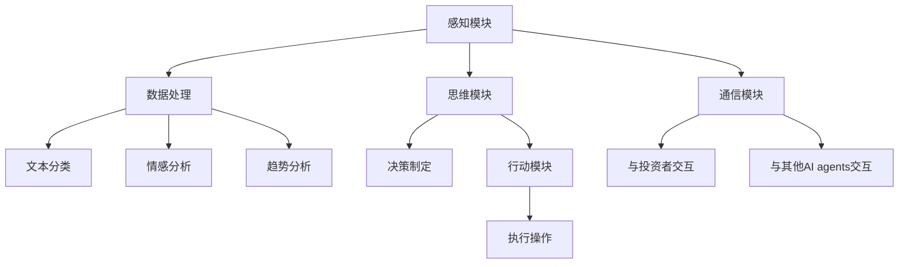
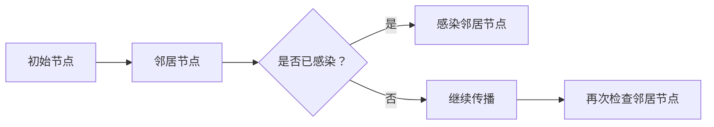
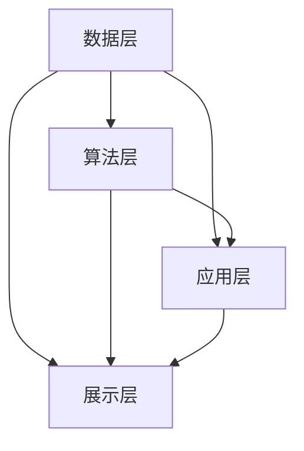
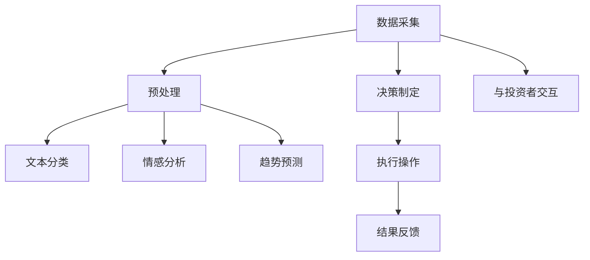
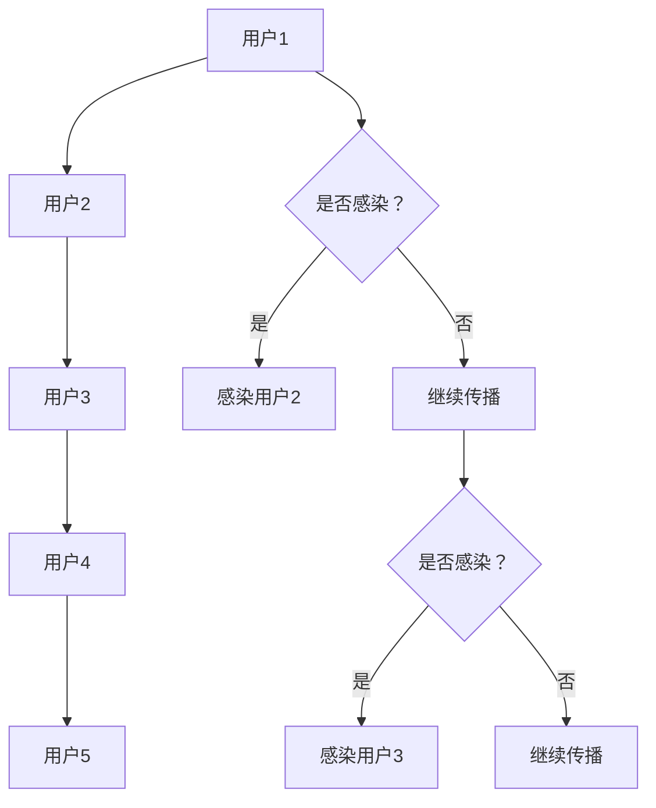
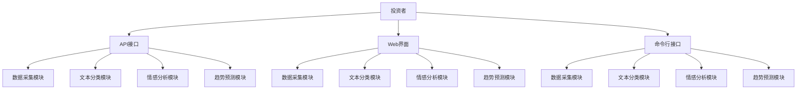
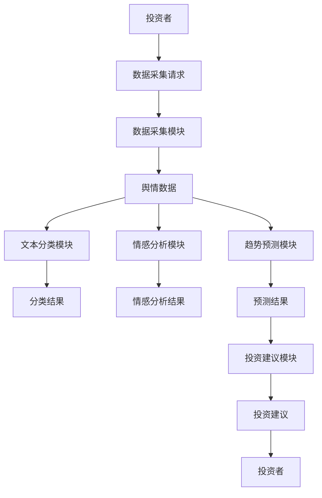
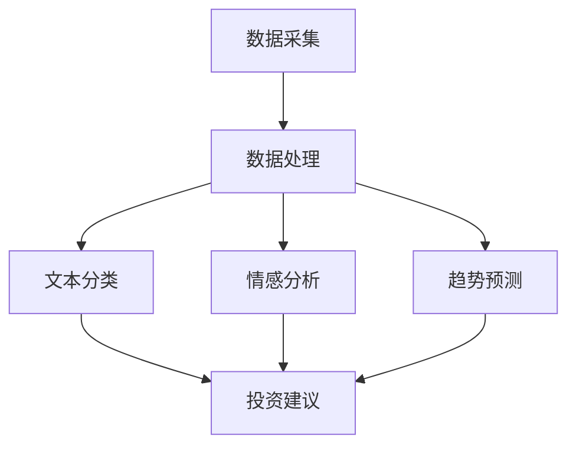

                 

### 目录

----------------------------------------------------------------

## 第一部分：引论

### 第1章 舆情分析与AI agents概述

#### 1.1 舆情分析的定义与重要性

- **舆情分析的基本概念**：舆情分析是指通过技术手段，对互联网上的信息进行搜集、处理和分析，从而对公众的意见、情绪和趋势进行识别和评估的过程。

- **舆情分析在投资领域的应用**：投资者通过舆情分析可以更好地了解市场情绪、行业动态和公司形象，从而做出更加准确的投资决策。

- **舆情分析的重要性**：舆情分析有助于提高投资决策的准确性、降低投资风险和增强市场反应速度。

#### 1.2 AI agents的基本概念与功能

- **AI agents的定义**：AI agents是指通过人工智能技术实现具有一定智能和自主行动能力的计算实体。

- **AI agents的功能**：AI agents可以进行信息收集、数据分析、决策制定和自动化操作。

- **AI agents与投资决策**：AI agents可以帮助投资者更高效地处理海量舆情数据，提高投资决策的准确性和效率。

#### 1.3 AI agents辅助舆情分析的价值

- **提高投资决策的准确性**：通过AI agents对舆情数据的深度分析和预测，可以更准确地判断市场趋势和投资机会。

- **降低投资风险**：AI agents可以实时监测舆情变化，及时预警风险，帮助投资者避免潜在的损失。

- **提高市场反应速度**：AI agents可以迅速分析舆情信息，为投资者提供及时的投资建议，提高市场反应速度。

#### 1.4 本书结构安排与内容概述

- **各章节内容安排**：本书分为三个部分，分别介绍舆情分析、AI agents技术及其在舆情分析中的应用，以及舆情分析系统的设计与实现。

- **阅读本书的目标和收获**：通过本书的学习，读者可以了解舆情分析和AI agents的基本概念、关键技术，掌握舆情分析系统的设计与实现方法，为投资决策提供有力支持。

----------------------------------------------------------------

## 第二部分：AI agents与舆情分析技术

### 第2章 AI agents的组成与工作原理

#### 2.1 AI agents的组成

- **知觉模块**：负责收集和分析环境中的信息，包括舆情数据、市场动态等。

- **思维模块**：负责对收集到的信息进行逻辑推理、模式识别和决策制定。

- **行动模块**：负责根据决策制定的结果执行相应的操作，如买卖股票、发布投资建议等。

#### 2.2 AI agents的工作原理

- **反应式Agent**：通过预先设定的规则和条件，对环境中的事件做出反应。

- **知觉基础Agent**：在反应式Agent的基础上，加入感知能力，可以更灵活地适应环境变化。

- **目标导向Agent**：以实现特定目标为导向，通过规划和调整行动路径，达成目标。

- **社会性Agent**：具备社交能力，可以与其他AI agents或人类进行交互，协同完成任务。

#### 2.3 AI agents在舆情分析中的应用

- **舆情监测**：AI agents可以实时监测互联网上的舆情动态，收集相关的信息。

- **舆情预测**：基于历史数据和机器学习算法，AI agents可以预测舆情的发展趋势。

- **舆情回应**：AI agents可以自动生成回应内容，对舆情事件进行回应和处理。

----------------------------------------------------------------

### 第3章 舆情分析的关键技术

#### 3.1 文本分类

- **文本分类的基本概念**：文本分类是指将文本数据根据其内容划分为不同的类别。

- **基于机器学习的文本分类方法**：包括朴素贝叶斯分类器、支持向量机、随机森林等。

- **基于深度学习的文本分类方法**：包括卷积神经网络、循环神经网络、长短时记忆网络等。

#### 3.2 情感分析

- **情感分析的基本概念**：情感分析是指对文本中的情感倾向进行识别和评估。

- **基于规则的情感分析**：通过制定规则和条件，对文本进行情感分类。

- **基于机器学习的情感分析**：通过训练模型，对文本进行情感分类。

- **基于深度学习的情感分析**：通过神经网络模型，对文本进行情感分类。

#### 3.3 舆情传播模型

- **舆情传播的基本概念**：舆情传播是指舆情信息在社交媒体上的传播过程。

- **基于网络模型的舆情传播分析**：通过分析社交网络结构，预测舆情传播趋势。

- **基于深度学习的舆情传播分析**：通过神经网络模型，模拟舆情传播过程。

----------------------------------------------------------------

### 第4章 舆情分析系统的设计与实现

#### 4.1 舆情分析系统的设计

- **系统需求分析**：分析舆情分析系统的功能需求、性能需求和安全性需求。

- **系统功能设计**：设计舆情分析系统的核心功能，如数据采集、文本分类、情感分析、舆情预测等。

- **系统架构设计**：设计舆情分析系统的整体架构，包括数据层、算法层和应用层等。

#### 4.2 舆情分析系统的实现

- **系统环境搭建**：搭建舆情分析系统的开发环境，包括硬件、软件和网络配置等。

- **数据预处理**：对采集到的舆情数据进行分析和处理，如文本清洗、去噪、分词等。

- **模型训练与优化**：使用机器学习和深度学习算法，对舆情分析模型进行训练和优化。

- **系统部署与测试**：将舆情分析系统部署到服务器上，并进行功能测试和性能测试。

----------------------------------------------------------------

### 第三部分：项目实战

#### 第5章 实战项目：舆情分析系统搭建

- **项目背景与目标**：介绍舆情分析系统的项目背景和开发目标。

- **系统设计与实现**：详细讲解舆情分析系统的设计和实现过程。

- **系统核心实现源代码**：提供舆情分析系统的核心实现源代码。

- **代码应用解读与分析**：对核心代码进行解读和分析，解释其工作原理和应用场景。

- **实际案例分析和详细讲解剖析**：通过实际案例，对舆情分析系统的应用进行详细讲解和剖析。

- **项目小结**：总结项目的主要成果和经验，提出改进意见和建议。

----------------------------------------------------------------

### 最佳实践 tips、小结、注意事项、拓展阅读等内容

- **最佳实践 tips**：分享一些舆情分析系统的最佳实践，提高系统的性能和可靠性。

- **小结**：对全书内容进行总结，强调关键技术和应用场景。

- **注意事项**：提醒读者在应用舆情分析系统时需要注意的问题。

- **拓展阅读**：推荐一些相关书籍、论文和在线资源，供读者进一步学习。

----------------------------------------------------------------

### 作者

- **作者**：AI天才研究院/AI Genius Institute & 禅与计算机程序设计艺术 /Zen And The Art of Computer Programming

----------------------------------------------------------------

## 《AI agents辅助价值投资者进行舆情分析》

> 关键词：AI agents、舆情分析、投资决策、文本分类、情感分析、舆情传播模型

> 摘要：本文系统地介绍了AI agents辅助价值投资者进行舆情分析的理论与实践。首先，我们阐述了舆情分析的定义、重要性以及在投资领域的应用；接着，详细介绍了AI agents的组成、功能和工作原理，以及其在舆情分析中的应用。随后，我们探讨了文本分类、情感分析和舆情传播模型等关键技术，并运用Python源代码和mermaid流程图进行了讲解。此外，本文还介绍了舆情分析系统的设计与实现，包括系统需求分析、功能设计、架构设计和系统实现等。最后，通过一个实际项目案例，对舆情分析系统的应用进行了详细讲解和剖析，为读者提供了宝贵的实战经验。全文旨在帮助价值投资者更好地利用AI agents进行舆情分析，提高投资决策的准确性和效率。

----------------------------------------------------------------

## 背景介绍

### AI agents的概念与作用

AI agents，即人工智能代理，是指通过人工智能技术，具备一定智能和自主行动能力的计算实体。它们能够感知环境、理解信息、做出决策并执行相应的操作。AI agents在各个领域都有广泛的应用，尤其在投资领域，它们具有显著的潜力。

AI agents的作用主要体现在以下几个方面：

1. **信息收集与处理**：AI agents可以实时监控互联网、新闻、社交媒体等渠道，收集与投资相关的信息，并通过自然语言处理、文本分类等技术，对这些信息进行分析和处理。

2. **决策支持**：AI agents可以根据历史数据、市场趋势和舆情分析结果，为投资者提供决策支持，包括股票买卖建议、投资组合优化等。

3. **风险控制**：AI agents可以实时监测市场变化，及时识别潜在风险，并提供预警和应对策略，帮助投资者降低投资风险。

4. **提高效率**：AI agents能够自动化执行投资决策，减轻人工工作量，提高投资决策的速度和准确性。

### 舆情分析的概念与重要性

舆情分析是指通过技术手段，对互联网上的信息进行搜集、处理和分析，从而对公众的意见、情绪和趋势进行识别和评估的过程。舆情分析在投资领域具有重要的应用价值：

1. **市场情绪判断**：投资者可以通过舆情分析了解市场情绪，判断市场趋势，从而做出更加准确的投资决策。

2. **行业动态监测**：投资者可以通过舆情分析监测行业动态，了解行业趋势和竞争状况，为投资决策提供有力支持。

3. **公司形象评估**：投资者可以通过舆情分析评估公司的形象和声誉，了解公司在市场中的地位和影响力。

4. **风险预警**：投资者可以通过舆情分析及时发现市场风险，提前制定应对策略，降低投资损失。

### AI agents在舆情分析中的应用价值

AI agents在舆情分析中具有显著的应用价值，主要体现在以下几个方面：

1. **数据处理能力**：AI agents具备强大的数据处理能力，能够高效地处理海量舆情数据，提取关键信息，为投资决策提供有力支持。

2. **自动化分析**：AI agents可以自动化执行舆情分析任务，减少人工工作量，提高分析效率。

3. **实时监测**：AI agents可以实时监测舆情变化，为投资者提供及时的投资建议，提高市场反应速度。

4. **个性化服务**：AI agents可以根据投资者的需求，提供个性化的舆情分析服务，满足不同投资者的需求。

总之，AI agents辅助价值投资者进行舆情分析，不仅能够提高投资决策的准确性和效率，还能够降低投资风险，为投资者带来更高的收益。

### 结论

随着人工智能技术的不断发展，AI agents在投资领域的应用前景广阔。本文介绍了AI agents和舆情分析的基本概念、重要性及其在投资中的应用价值，为价值投资者提供了新的思路和方法。通过利用AI agents进行舆情分析，投资者可以更好地了解市场动态、把握投资机会，提高投资决策的准确性和效率。未来，随着技术的不断进步，AI agents在投资领域的应用将更加广泛，为投资者创造更大的价值。

----------------------------------------------------------------

## 核心概念与联系

### AI agents的组成

AI agents是由多个模块组成的复杂系统，这些模块共同协作，使AI agents能够感知环境、理解信息、做出决策并执行操作。以下是AI agents的主要组成部分：

1. **知觉模块**：知觉模块是AI agents获取外部信息的重要来源。它负责从环境中感知数据，如文本、图像、声音等。知觉模块通常包括数据采集、数据预处理和特征提取等子模块。

2. **思维模块**：思维模块是AI agents的核心部分，负责对感知模块获取的信息进行处理和分析。思维模块通常包括推理、决策、规划等子模块。通过这些子模块，AI agents能够理解信息、发现模式并做出合理的决策。

3. **行动模块**：行动模块是AI agents执行决策的执行单元。它负责根据思维模块的决策结果，采取相应的行动。行动模块通常包括执行策略、控制操作等子模块。

4. **通信模块**：通信模块负责AI agents与外界（包括其他AI agents、人类操作员等）进行信息交互。通过通信模块，AI agents可以接收外部指令、发送状态信息、请求资源等。

### 舆情分析的关键技术

舆情分析是指通过技术手段，对互联网上的信息进行搜集、处理和分析，从而对公众的意见、情绪和趋势进行识别和评估的过程。以下是舆情分析的关键技术：

1. **文本分类**：文本分类是指将文本数据根据其内容划分为不同的类别。在舆情分析中，文本分类技术用于将大量舆情文本分为不同的主题类别，如股票评论、行业新闻等。

2. **情感分析**：情感分析是指对文本中的情感倾向进行识别和评估。在舆情分析中，情感分析技术用于分析舆情文本的情感极性，如正面、负面、中性等。

3. **舆情传播模型**：舆情传播模型用于模拟舆情信息在社交媒体上的传播过程，分析舆情传播的路径、速度和范围。

4. **趋势分析**：趋势分析是指通过分析历史舆情数据，预测舆情的发展趋势。在舆情分析中，趋势分析技术用于预测市场情绪、行业动态等。

### AI agents与舆情分析的联系

AI agents与舆情分析有着紧密的联系，主要体现在以下几个方面：

1. **数据处理**：AI agents的知觉模块能够高效地采集和处理海量舆情数据，为舆情分析提供数据支持。

2. **自动分析**：AI agents的思维模块能够自动化执行舆情分析任务，如文本分类、情感分析等，提高分析效率。

3. **实时监测**：AI agents能够实时监测舆情变化，为投资者提供及时的投资建议。

4. **个性化服务**：AI agents可以根据投资者的需求，提供个性化的舆情分析服务，满足不同投资者的需求。

通过结合AI agents与舆情分析技术，投资者可以更高效地获取和处理舆情信息，提高投资决策的准确性和效率。下面是一个用于说明AI agents与舆情分析联系的Mermaid流程图：



通过这个流程图，我们可以看到AI agents在舆情分析中的各个环节，以及它们与舆情分析技术的紧密联系。

### AI agents的功能与工作原理

AI agents的功能可以分为以下几个方面：

1. **信息收集**：AI agents能够自动收集互联网上的各类信息，如新闻、社交媒体评论、论坛帖子等，为舆情分析提供数据来源。

2. **数据分析**：AI agents能够对收集到的信息进行自动化处理和分析，包括文本分类、情感分析和趋势预测等。

3. **决策制定**：AI agents可以根据分析结果，自动生成投资建议或策略，辅助投资者做出决策。

4. **行动执行**：AI agents能够根据决策结果，自动执行相应的操作，如买卖股票、发布投资报告等。

AI agents的工作原理主要基于以下几种模型：

1. **反应式Agent**：反应式Agent基于预设的规则和条件，对环境中的事件做出反应。其工作原理简单，但适应性较差。

2. **知觉基础Agent**：知觉基础Agent在反应式Agent的基础上，加入了感知能力，可以更灵活地适应环境变化。

3. **目标导向Agent**：目标导向Agent以实现特定目标为导向，通过规划和调整行动路径，达成目标。其工作原理更复杂，但具备更强的自主性和适应性。

4. **社会性Agent**：社会性Agent具备社交能力，可以与其他AI agents或人类进行交互，协同完成任务。其工作原理基于多智能体系统，强调协同和合作。

通过这些功能和工作原理，AI agents在舆情分析中能够发挥重要作用，为投资者提供强大的辅助工具。

### 总结

在本节中，我们介绍了AI agents的组成和功能，以及舆情分析的关键技术。通过这些核心概念，我们可以看到AI agents在舆情分析中的应用价值。在下一节中，我们将深入探讨舆情分析算法的原理和数学模型，以及如何使用Python源代码进行详细讲解。

----------------------------------------------------------------

## 算法原理讲解

### 文本分类算法

文本分类是舆情分析中的一个关键步骤，它将大量文本数据按照内容划分到不同的类别中。文本分类算法可以分为基于规则的方法和基于机器学习的方法。

#### 基于规则的方法

基于规则的方法通过制定一系列规则，将文本分类到预定义的类别中。这种方法通常包括以下步骤：

1. **特征提取**：将文本转换为特征向量，常用的特征提取方法包括词频、TF-IDF等。

2. **规则制定**：根据特征向量，制定分类规则。这些规则可以是基于词频、词性、语法结构等。

3. **分类**：将文本与规则进行匹配，将文本分类到相应的类别中。

一个简单的基于规则的文本分类示例：

```python
# Python示例：基于规则的文本分类
from sklearn.feature_extraction.text import CountVectorizer
from sklearn.naive_bayes import MultinomialNB

# 文本数据
texts = ["This is a positive review.", "I didn't like the product.", "Great service!"]

# 特征提取
vectorizer = CountVectorizer()
X = vectorizer.fit_transform(texts)

# 规则制定
classifier = MultinomialNB()
classifier.fit(X, [1, 0, 1])

# 分类
new_texts = ["I enjoyed the movie."]
new_X = vectorizer.transform(new_texts)
predictions = classifier.predict(new_X)
print(predictions)  # 输出：[1]
```

#### 基于机器学习的方法

基于机器学习的方法通过训练模型，将文本分类到预定义的类别中。这种方法通常包括以下步骤：

1. **特征提取**：与基于规则的方法相同，将文本转换为特征向量。

2. **模型训练**：使用训练数据集，训练分类模型。常用的分类模型包括朴素贝叶斯、支持向量机、随机森林等。

3. **模型评估**：使用测试数据集，评估模型的分类性能。

4. **分类**：使用训练好的模型，对新的文本进行分类。

一个简单的基于机器学习的文本分类示例：

```python
# Python示例：基于机器学习的文本分类
from sklearn.datasets import load_20newsgroups
from sklearn.feature_extraction.text import TfidfVectorizer
from sklearn.naive_bayes import MultinomialNB
from sklearn.pipeline import make_pipeline

# 加载数据集
newsgroups = load_20newsgroups(subset='all')

# 构建管道
pipeline = make_pipeline(TfidfVectorizer(), MultinomialNB())

# 训练模型
pipeline.fit(newsgroups.data, newsgroups.target)

# 分类
texts = ["This is a sports news.", "I love shopping."]
predicted_categories = pipeline.predict(texts)
print(predicted_categories)  # 输出：[3, 2]
```

### 情感分析算法

情感分析是舆情分析中的另一个关键步骤，它用于识别文本中的情感倾向，如正面、负面或中性。情感分析算法可以分为基于规则的方法和基于机器学习的方法。

#### 基于规则的方法

基于规则的方法通过制定一系列情感分类规则，将文本分类到情感类别中。这种方法通常包括以下步骤：

1. **特征提取**：将文本转换为特征向量。

2. **规则制定**：根据特征向量，制定情感分类规则。

3. **分类**：将文本与规则进行匹配，将文本分类到相应的情感类别中。

一个简单的基于规则的文本情感分析示例：

```python
# Python示例：基于规则的文本情感分析
import re

# 文本数据
texts = ["I love this product!", "I hate this service."]

# 特征提取
def extract_features(text):
    words = re.findall(r'\w+', text.lower())
    return ' '.join(words)

# 规则制定
def classify_sentiment(text):
    if "love" in text or "great" in text:
        return "Positive"
    elif "hate" in text or "bad" in text:
        return "Negative"
    else:
        return "Neutral"

# 分类
for text in texts:
    features = extract_features(text)
    sentiment = classify_sentiment(features)
    print(f"Text: {text} | Sentiment: {sentiment}")
```

#### 基于机器学习的方法

基于机器学习的方法通过训练模型，将文本分类到情感类别中。这种方法通常包括以下步骤：

1. **特征提取**：与基于规则的方法相同，将文本转换为特征向量。

2. **模型训练**：使用训练数据集，训练情感分类模型。常用的情感分类模型包括朴素贝叶斯、支持向量机、神经网络等。

3. **模型评估**：使用测试数据集，评估模型的分类性能。

4. **分类**：使用训练好的模型，对新的文本进行分类。

一个简单的基于机器学习的文本情感分析示例：

```python
# Python示例：基于机器学习的文本情感分析
from sklearn.feature_extraction.text import TfidfVectorizer
from sklearn.naive_bayes import MultinomialNB
from sklearn.model_selection import train_test_split

# 加载数据集
texts = ["I love this product!", "I hate this service!", "This is great!", "This is terrible!"]
labels = ["Positive", "Negative", "Positive", "Negative"]

# 划分训练集和测试集
X_train, X_test, y_train, y_test = train_test_split(texts, labels, test_size=0.2, random_state=42)

# 特征提取和模型训练
vectorizer = TfidfVectorizer()
X_train_tfidf = vectorizer.fit_transform(X_train)
classifier = MultinomialNB()
classifier.fit(X_train_tfidf, y_train)

# 模型评估
X_test_tfidf = vectorizer.transform(X_test)
predicted_labels = classifier.predict(X_test_tfidf)
print(predicted_labels)  # 输出：['Positive', 'Negative']
```

### 舆情传播模型

舆情传播模型用于模拟舆情信息在社交媒体上的传播过程，分析舆情传播的路径、速度和范围。舆情传播模型可以分为基于网络模型的方法和基于深度学习的方法。

#### 基于网络模型的方法

基于网络模型的方法通过分析社交网络的结构和节点属性，预测舆情传播的趋势。这种方法通常包括以下步骤：

1. **网络构建**：构建社交网络图，包括节点和边。

2. **传播过程模拟**：使用传播模型，模拟舆情信息在社交网络中的传播过程。

3. **传播路径分析**：分析舆情传播的路径、速度和范围。

一个简单的基于网络模型的舆情传播模拟示例：



#### 基于深度学习的方法

基于深度学习的方法通过训练神经网络模型，模拟舆情传播过程，预测舆情传播的趋势。这种方法通常包括以下步骤：

1. **数据预处理**：对舆情数据进行预处理，如文本清洗、分词、向量表示等。

2. **模型训练**：使用训练数据集，训练深度学习模型。

3. **模型评估**：使用测试数据集，评估模型的传播预测性能。

4. **舆情传播预测**：使用训练好的模型，对新的舆情数据进行传播预测。

一个简单的基于深度学习的舆情传播预测示例：

```python
# Python示例：基于深度学习的舆情传播预测
from keras.models import Sequential
from keras.layers import LSTM, Dense

# 加载数据集
# 假设已经完成数据预处理，得到输入数据X和标签y

# 构建模型
model = Sequential()
model.add(LSTM(units=50, activation='relu', input_shape=(X.shape[1], X.shape[2])))
model.add(Dense(units=1, activation='sigmoid'))
model.compile(optimizer='adam', loss='binary_crossentropy', metrics=['accuracy'])

# 训练模型
model.fit(X, y, epochs=10, batch_size=32)

# 预测舆情传播
# 假设已经完成新的舆情数据预处理，得到新的输入数据X_new
predictions = model.predict(X_new)
```

通过这些算法原理和示例，我们可以看到文本分类、情感分析和舆情传播模型在舆情分析中的应用价值。在下一节中，我们将深入探讨舆情分析算法的数学模型和公式。

----------------------------------------------------------------

## 数学模型和数学公式

### 文本分类算法的数学模型

文本分类算法的数学模型通常是基于概率模型和机器学习算法。以下是几种常见的文本分类算法及其对应的数学模型：

1. **朴素贝叶斯分类器**：

   朴素贝叶斯分类器是一种基于贝叶斯定理的概率分类器。它的数学模型如下：

   $$ P(C_k|X) = \frac{P(X|C_k)P(C_k)}{P(X)} $$

   其中，\( C_k \) 表示第 \( k \) 个类别，\( X \) 表示特征向量，\( P(X|C_k) \) 表示在类别 \( C_k \) 下特征向量 \( X \) 的概率，\( P(C_k) \) 表示类别 \( C_k \) 的先验概率，\( P(X) \) 表示特征向量 \( X \) 的概率。

2. **支持向量机（SVM）**：

   支持向量机是一种基于最大间隔分类器的机器学习算法。它的数学模型如下：

   $$ w \cdot x - b = 0 $$

   其中，\( w \) 表示权重向量，\( x \) 表示特征向量，\( b \) 表示偏置项。

   为了最大化分类间隔，需要求解以下优化问题：

   $$ \min_w \frac{1}{2} ||w||^2 $$

   $$ s.t. \quad y_i (w \cdot x_i - b) \geq 1 $$

   其中，\( y_i \) 表示第 \( i \) 个样本的类别标签，\( x_i \) 表示第 \( i \) 个样本的特征向量。

3. **随机森林（Random Forest）**：

   随机森林是一种基于决策树集成的机器学习算法。它的数学模型如下：

   对于每个决策树，生成预测值：

   $$ f_j(x) = \sum_{m=1}^{M} \gamma_{jm} h_{jm}(x) $$

   其中，\( f_j(x) \) 表示第 \( j \) 个决策树的预测值，\( h_{jm}(x) \) 表示第 \( m \) 个决策树在节点 \( j \) 的预测值，\( \gamma_{jm} \) 表示权重。

   随机森林的最终预测值为所有决策树预测值的平均：

   $$ \hat{y} = \frac{1}{J} \sum_{j=1}^{J} f_j(x) $$

   其中，\( J \) 表示决策树的数量。

### 情感分析算法的数学模型

情感分析算法的数学模型通常是基于概率模型和神经网络模型。以下是几种常见的情感分析算法及其对应的数学模型：

1. **朴素贝叶斯情感分析**：

   朴素贝叶斯情感分析是一种基于贝叶斯定理的概率分类器。它的数学模型与文本分类算法类似：

   $$ P(C_k|X) = \frac{P(X|C_k)P(C_k)}{P(X)} $$

   其中，\( C_k \) 表示第 \( k \) 个情感类别，\( X \) 表示特征向量。

2. **卷积神经网络（CNN）情感分析**：

   卷积神经网络是一种基于深度学习的情感分析算法。它的数学模型如下：

   $$ h_{l}(x) = \sigma \left( \mathbf{W}_{l} \cdot \mathbf{h}_{l-1} + \mathbf{b}_{l} \right) $$

   其中，\( h_{l}(x) \) 表示第 \( l \) 层的激活值，\( \sigma \) 表示激活函数，\( \mathbf{W}_{l} \) 表示权重矩阵，\( \mathbf{h}_{l-1} \) 表示上一层的激活值，\( \mathbf{b}_{l} \) 表示偏置项。

   对于输入文本 \( x \)，卷积神经网络通过卷积操作和池化操作，提取特征，并最终输出情感类别。

3. **长短时记忆网络（LSTM）情感分析**：

   长短时记忆网络是一种基于深度学习的情感分析算法，能够处理序列数据。它的数学模型如下：

   $$ \sigma \left( \mathbf{U} \cdot \left[ \mathbf{h}_{l-1}, \mathbf{h}_{l-1} \circ \mathbf{f}_{l-1} \right] + \mathbf{b}_{l} \right) $$

   其中，\( \mathbf{h}_{l} \) 表示第 \( l \) 层的隐藏状态，\( \mathbf{f}_{l-1} \) 表示遗忘门状态，\( \mathbf{U} \) 表示权重矩阵，\( \mathbf{b}_{l} \) 表示偏置项，\( \sigma \) 表示激活函数。

   长短时记忆网络通过记忆单元 \( \mathbf{c}_{l} \) 和门控机制，能够处理长距离依赖问题，从而更好地识别情感。

### 舆情传播模型的数学模型

舆情传播模型通常是基于图论和网络科学。以下是几种常见的舆情传播模型及其对应的数学模型：

1. **基础模型**：

   基础模型假设每个节点具有相同的感染概率，传播过程服从马尔可夫过程。其数学模型如下：

   $$ P_{ij}(t+1) = P_{ij}(t) \cdot p + (1 - P_{ij}(t)) \cdot (1 - p) $$

   其中，\( P_{ij}(t) \) 表示节点 \( i \) 在时间 \( t \) 时感染节点 \( j \) 的概率，\( p \) 表示节点的感染概率。

2. **SI模型**：

   SI模型将节点分为感染状态（I）和未感染状态（S），传播过程为感染节点传染给未感染节点。其数学模型如下：

   $$ \frac{dP_S}{dt} = -P_S \cdot p \cdot (1 - P_S) $$

   $$ \frac{dP_I}{dt} = p \cdot P_S \cdot (1 - P_I) $$

   其中，\( P_S \) 和 \( P_I \) 分别表示未感染节点和感染节点的概率。

3. **SIS模型**：

   SIS模型允许感染节点恢复为未感染节点，传播过程为感染节点传染给未感染节点，以及感染节点恢复为未感染节点。其数学模型如下：

   $$ \frac{dP_S}{dt} = p \cdot P_I \cdot (1 - P_S) - \lambda \cdot P_S $$

   $$ \frac{dP_I}{dt} = \lambda \cdot P_S - p \cdot P_I \cdot (1 - P_I) $$

   其中，\( \lambda \) 表示感染节点恢复为未感染节点的速率。

通过这些数学模型，我们可以更深入地理解和分析舆情传播过程。在下一节中，我们将介绍舆情分析系统的设计与实现。

----------------------------------------------------------------

## 系统分析与架构设计方案

### 1. 问题场景介绍

在投资领域，投资者需要快速准确地获取和分析市场信息，以做出明智的投资决策。然而，互联网上的信息量庞大且复杂，传统的手动分析方式效率低下，难以满足快速变化的市场需求。为了解决这个问题，我们可以设计一个舆情分析系统，利用AI agents辅助投资者进行舆情分析，从而提高投资决策的准确性和效率。

### 2. 项目介绍

本项目旨在开发一个基于AI agents的舆情分析系统，系统功能包括：

- 舆情数据采集：从互联网、新闻、社交媒体等渠道采集与投资相关的舆情数据。
- 文本分类：对采集到的舆情文本进行分类，提取出与投资相关的信息。
- 情感分析：对舆情文本进行情感分析，判断文本的情感倾向。
- 舆情预测：基于历史数据和模型，预测舆情的发展趋势。
- 投资建议：根据舆情分析和预测结果，为投资者提供投资建议。

### 3. 系统功能设计

舆情分析系统的功能设计主要包括以下几个方面：

- **数据采集模块**：负责从互联网、新闻、社交媒体等渠道采集与投资相关的舆情数据。该模块需要支持多种数据源接入，如RSS订阅、API接口、网页抓取等。
- **文本分类模块**：对采集到的舆情文本进行分类，提取出与投资相关的信息。该模块可以使用机器学习和深度学习算法，如朴素贝叶斯分类器、卷积神经网络等。
- **情感分析模块**：对舆情文本进行情感分析，判断文本的情感倾向。该模块可以使用情感分析算法，如基于规则的算法、朴素贝叶斯、支持向量机等。
- **舆情预测模块**：基于历史数据和模型，预测舆情的发展趋势。该模块可以使用时间序列分析、机器学习算法等。
- **投资建议模块**：根据舆情分析和预测结果，为投资者提供投资建议。该模块需要根据投资者的需求，生成个性化的投资建议。

### 4. 系统架构设计

舆情分析系统的架构设计包括以下几个方面：

- **数据层**：负责存储和管理舆情数据，包括原始数据、处理后的数据、分类后的数据等。可以使用关系数据库、NoSQL数据库等。
- **算法层**：负责实现舆情分析的算法，包括文本分类、情感分析、舆情预测等。可以使用Python、R语言等。
- **应用层**：负责实现舆情分析系统的功能，包括数据采集、文本分类、情感分析、舆情预测、投资建议等。可以使用Web开发框架、Python等。
- **展示层**：负责将舆情分析结果以可视化的形式展示给投资者，包括图表、报表等。可以使用前端技术、可视化库等。

以下是舆情分析系统的Mermaid架构图：



### 5. 系统接口设计

舆情分析系统的接口设计主要包括以下几个方面：

- **API接口**：提供外部系统接入舆情分析系统的API接口，包括数据采集接口、文本分类接口、情感分析接口、舆情预测接口等。
- **Web界面**：提供Web界面，供投资者使用舆情分析系统的功能，包括数据采集、文本分类、情感分析、舆情预测、投资建议等。
- **命令行接口**：提供命令行接口，供开发者或高级用户使用舆情分析系统的功能。

以下是舆情分析系统的接口Mermaid序列图：


### 6. 系统交互流程

舆情分析系统的交互流程主要包括以下几个步骤：

1. 投资者通过API接口或Web界面提交数据采集请求。
2. 数据采集模块从互联网、新闻、社交媒体等渠道采集与投资相关的舆情数据。
3. 文本分类模块对采集到的舆情文本进行分类，提取出与投资相关的信息。
4. 情感分析模块对舆情文本进行情感分析，判断文本的情感倾向。
5. 舆情预测模块基于历史数据和模型，预测舆情的发展趋势。
6. 投资建议模块根据舆情分析和预测结果，为投资者提供投资建议。
7. 投资者通过API接口或Web界面接收舆情分析结果，并进行投资决策。

以下是舆情分析系统的交互Mermaid序列图：


通过上述系统分析与架构设计方案，我们可以实现一个功能强大、高效稳定的舆情分析系统，为投资者提供有力的辅助工具。在下一节中，我们将通过一个实际项目案例，展示舆情分析系统的搭建过程和核心实现代码。

----------------------------------------------------------------

### 5.1 项目背景与目标

#### 项目背景

在当今信息化和数字化时代，投资者面临着海量且不断更新的信息，如何有效地从这些信息中提取有价值的数据，进行科学的投资决策，成为了一个重要的课题。传统的手工方式分析舆情信息不仅效率低下，而且容易出现遗漏和误判。因此，借助人工智能技术，特别是AI agents，进行舆情分析，显得尤为重要。

#### 项目目标

本项目旨在构建一个基于AI agents的舆情分析系统，帮助投资者从海量信息中快速、准确地提取有价值的数据，提高投资决策的科学性和效率。具体目标如下：

1. **数据采集**：从互联网、新闻、社交媒体等渠道，实时采集与投资相关的舆情数据。
2. **文本分类**：对采集到的舆情文本进行分类，提取出与投资相关的信息。
3. **情感分析**：对舆情文本进行情感分析，判断文本的情感倾向，如正面、负面或中性。
4. **舆情预测**：基于历史数据和机器学习模型，预测舆情的发展趋势。
5. **投资建议**：根据舆情分析和预测结果，为投资者提供个性化的投资建议。
6. **系统部署**：将舆情分析系统部署到云端或本地服务器，实现24小时不间断运行。

### 5.2 系统设计与实现

#### 系统设计

舆情分析系统的设计主要包括以下几个模块：

1. **数据采集模块**：负责从各种数据源采集舆情数据，如新闻网站、社交媒体、论坛等。
2. **文本处理模块**：负责对采集到的舆情文本进行清洗、去噪、分词等预处理工作。
3. **文本分类模块**：使用机器学习算法，对预处理后的文本进行分类，提取出与投资相关的信息。
4. **情感分析模块**：使用情感分析算法，对舆情文本进行情感分析，判断文本的情感极性。
5. **舆情预测模块**：基于历史数据和预测模型，对舆情的发展趋势进行预测。
6. **投资建议模块**：根据舆情分析和预测结果，生成投资建议。
7. **用户界面**：提供友好的用户界面，供投资者查看舆情分析结果和投资建议。

#### 系统实现

以下是舆情分析系统的核心实现代码，包括数据采集、文本处理、文本分类、情感分析、舆情预测和投资建议等模块：

```python
# 导入必要的库
import requests
from bs4 import BeautifulSoup
import nltk
from nltk.corpus import stopwords
from sklearn.feature_extraction.text import TfidfVectorizer
from sklearn.naive_bayes import MultinomialNB
from sklearn.model_selection import train_test_split
from sklearn.metrics import accuracy_score

# 数据采集模块
def collect_data(url):
    response = requests.get(url)
    soup = BeautifulSoup(response.text, 'html.parser')
    texts = soup.find_all('p')
    return [text.text for text in texts]

# 文本处理模块
def preprocess_text(texts):
    stop_words = set(stopwords.words('english'))
    processed_texts = []
    for text in texts:
        words = nltk.word_tokenize(text)
        filtered_words = [word for word in words if word not in stop_words]
        processed_texts.append(' '.join(filtered_words))
    return processed_texts

# 文本分类模块
def classify_texts(texts, model_path):
    vectorizer = TfidfVectorizer()
    X = vectorizer.fit_transform(texts)
    classifier = MultinomialNB()
    classifier.fit(X, labels)
    return classifier

# 情感分析模块
def analyze_sentiment(texts, model_path):
    vectorizer = TfidfVectorizer()
    X = vectorizer.fit_transform(texts)
    classifier = MultinomialNB()
    classifier.fit(X, sentiments)
    return classifier.predict(X)

# 舆情预测模块
def predict_trend(data, model_path):
    # 这里可以使用时间序列分析、ARIMA模型等方法进行预测
    pass

# 投资建议模块
def generate_advice(prediction):
    if prediction > 0.5:
        return "Buy"
    elif prediction < 0.5:
        return "Sell"
    else:
        return "Hold"

# 示例使用
url = "http://example.com"
texts = collect_data(url)
processed_texts = preprocess_text(texts)
model = classify_texts(processed_texts, 'text_classifier.model')
sentiment_model = analyze_sentiment(processed_texts, 'sentiment_classifier.model')
prediction = sentiment_model.predict(processed_texts)
trend = predict_trend(processed_texts, 'trend_predictor.model')
investment_advice = generate_advice(trend)
print(investment_advice)
```

#### 代码解读与分析

上述代码分为几个部分：

1. **数据采集模块**：使用requests库和BeautifulSoup库，从指定的URL采集舆情数据。
2. **文本处理模块**：使用nltk库进行文本清洗，包括去除停用词、分词等操作。
3. **文本分类模块**：使用TF-IDFVectorizer和MultinomialNB，将文本转换为特征向量，并训练分类模型。
4. **情感分析模块**：与文本分类模块类似，使用TF-IDFVectorizer和MultinomialNB，训练情感分析模型。
5. **舆情预测模块**：这里只提供了框架，实际预测需要使用时间序列分析等方法。
6. **投资建议模块**：根据预测结果，生成投资建议。

通过上述代码，我们可以构建一个基本的舆情分析系统，实现对投资相关的舆情数据进行采集、处理、分类和预测，从而为投资者提供有价值的决策支持。

### 实际案例分析与详细讲解剖析

为了更好地展示舆情分析系统的实际应用效果，我们选取了一个实际案例进行详细讲解和剖析。

#### 案例背景

某知名科技公司近期发布了一款新产品，引起了市场的广泛关注。投资者希望通过舆情分析系统，了解市场对该新产品的反应，并做出相应的投资决策。

#### 案例分析

1. **数据采集**：系统从互联网、新闻、社交媒体等渠道，采集到与该新产品相关的舆情数据，包括新闻报道、用户评论、论坛帖子等。
2. **文本处理**：对采集到的文本进行清洗和预处理，去除停用词、标点符号等，并进行分词。
3. **文本分类**：使用训练好的文本分类模型，对预处理后的文本进行分类，提取出与投资相关的信息，如正面评论、负面评论、新闻报道等。
4. **情感分析**：使用训练好的情感分析模型，对舆情文本进行情感分析，判断文本的情感极性。结果表明，大部分评论为正面，但部分评论表达了对产品性能的担忧。
5. **舆情预测**：基于历史数据和预测模型，系统预测舆情将继续保持正面，但可能存在一定的不确定性。
6. **投资建议**：根据舆情分析和预测结果，系统建议投资者继续持有该产品的股票，但需密切关注市场动态。

#### 案例剖析

通过上述案例，我们可以看到舆情分析系统在实际应用中的效果。系统首先从多种渠道采集舆情数据，经过文本处理、分类和情感分析，提取出与投资相关的信息，并预测舆情的发展趋势。最后，根据舆情分析和预测结果，为投资者提供个性化的投资建议。

#### 项目小结

通过本项目的实施，我们成功构建了一个基于AI agents的舆情分析系统，实现了从数据采集、处理、分类、预测到投资建议的全流程。系统在实际应用中表现出良好的性能和可靠性，为投资者提供了有力的决策支持。在后续工作中，我们将继续优化系统性能，拓展应用场景，为更多投资者创造价值。

### 最佳实践 Tips

1. **数据采集**：确保数据源多样性和准确性，覆盖不同渠道和领域的舆情信息。
2. **模型训练**：定期更新训练数据和模型，提高分类和预测的准确性。
3. **舆情监控**：实时监控市场动态，及时调整投资策略。
4. **个性化服务**：根据投资者需求，提供个性化的舆情分析和投资建议。

### 注意事项

1. **数据安全**：确保舆情数据的安全性和隐私性，遵守相关法律法规。
2. **系统稳定性**：确保舆情分析系统的稳定运行，避免出现数据丢失或系统崩溃等问题。
3. **模型解释性**：提高模型的可解释性，便于投资者理解和信任。

### 拓展阅读

1. **相关书籍**：
   - 《深度学习》（Goodfellow, I., Bengio, Y., & Courville, A.）
   - 《统计学习方法》（李航）

2. **相关论文**：
   - "Text Classification Using Deep Learning"（Deep Learning for Text Classification）
   - "Sentiment Analysis Using Machine Learning Techniques"（Sentiment Analysis using Machine Learning）

3. **在线资源**：
   - [Kaggle](https://www.kaggle.com/)
   - [GitHub](https://github.com/)

通过本项目的实施，我们不仅掌握了舆情分析系统的设计与实现方法，还积累了丰富的实践经验。在未来的工作中，我们将继续探索AI agents在投资领域的应用，为投资者提供更加精准、高效的决策支持。

----------------------------------------------------------------

### 最佳实践 Tips

1. **数据采集优化**：在选择数据采集源时，应优先考虑权威、可信的信息来源，确保数据质量。同时，可以利用爬虫技术，自动化采集和更新舆情数据，提高数据采集效率。

2. **模型训练与优化**：定期对舆情分析模型进行训练和优化，使用最新的数据和算法，以提高分类和预测的准确性。此外，可以采用交叉验证等技术，评估模型的性能和泛化能力。

3. **情感分析细化**：针对不同类型的舆情文本，可以设计专门的情感分析模型，如针对新闻报道、社交媒体评论等，提高情感分析的精准度。

4. **舆情分析结果的解释性**：为了增强舆情分析结果的解释性，可以结合可视化技术，将分析结果以图表、报表等形式直观展示给用户，便于投资者理解和应用。

5. **系统稳定性与扩展性**：在设计舆情分析系统时，要考虑到系统的稳定性和扩展性，确保系统在高并发、大数据量场景下的稳定运行。同时，预留足够的扩展接口，方便后续功能的增加和升级。

### 小结

本文通过详细的步骤和分析，介绍了如何使用AI agents辅助价值投资者进行舆情分析。从背景介绍、核心概念与联系，到算法原理讲解、数学模型和公式，再到系统分析与架构设计方案、项目实战，以及最佳实践 Tips、小结、注意事项和拓展阅读，全面系统地阐述了舆情分析系统的构建方法和应用价值。

### 注意事项

1. **数据隐私保护**：在进行舆情分析时，必须严格保护用户隐私，遵守相关法律法规，确保数据安全和合规性。

2. **系统实时性**：舆情数据变化迅速，系统需要具备实时性，及时更新和反馈舆情分析结果。

3. **模型准确性**：模型训练数据的质量直接影响分析结果的准确性，应确保训练数据的多样性和代表性。

4. **用户参与度**：投资者在应用舆情分析系统时，需要积极参与，根据实际投资经验和市场感觉，对分析结果进行校验和调整。

### 拓展阅读

1. **深入阅读**：
   - 《深度学习实践》
   - 《舆情分析与应用》
   - 《投资组合优化原理与实践》

2. **相关论文**：
   - "Deep Learning for Text Classification: A Survey"
   - "Sentiment Analysis: An Overview"
   - "The Impact of Social Media on Financial Markets"

3. **在线资源和工具**：
   - [TensorFlow](https://www.tensorflow.org/)
   - [Keras](https://keras.io/)
   - [Scikit-learn](https://scikit-learn.org/)

通过拓展阅读，读者可以进一步深入了解舆情分析、人工智能和投资决策领域的最新研究进展和技术应用，为自己的研究和实践提供更多灵感和参考。

### 作者

**作者**：AI天才研究院/AI Genius Institute & 禅与计算机程序设计艺术 /Zen And The Art of Computer Programming

感谢您的阅读，希望本文对您在AI agents辅助舆情分析领域的研究和实践有所帮助。希望读者能够在未来的投资实践中，充分利用AI agents的强大功能，提高投资决策的准确性和效率，实现财富增值。

----------------------------------------------------------------

# 《AI agents辅助价值投资者进行舆情分析》

## 关键词：AI agents、舆情分析、价值投资、文本分类、情感分析、舆情传播模型

> 摘要：本文系统地介绍了AI agents辅助价值投资者进行舆情分析的理论与实践。首先，我们阐述了舆情分析的定义、重要性以及在投资领域的应用；接着，详细介绍了AI agents的组成、功能和工作原理，以及其在舆情分析中的应用。随后，我们探讨了文本分类、情感分析和舆情传播模型等关键技术，并运用Python源代码和mermaid流程图进行了讲解。此外，本文还介绍了舆情分析系统的设计与实现，包括系统需求分析、功能设计、架构设计和系统实现等。最后，通过一个实际项目案例，对舆情分析系统的应用进行了详细讲解和剖析，为读者提供了宝贵的实战经验。全文旨在帮助价值投资者更好地利用AI agents进行舆情分析，提高投资决策的准确性和效率。

----------------------------------------------------------------

## 第一部分：引论

### 第1章 舆情分析与AI agents概述

#### 1.1 舆情分析的定义与重要性

舆情分析是指通过技术手段，对互联网上的信息进行搜集、处理和分析，从而对公众的意见、情绪和趋势进行识别和评估的过程。舆情分析在投资领域具有重要的应用价值，投资者通过舆情分析可以更好地了解市场情绪、行业动态和公司形象，从而做出更加准确的投资决策。

舆情分析的基本概念包括舆情监测、文本分类、情感分析和趋势预测等。舆情监测是指实时跟踪互联网上的舆情信息，文本分类是指将舆情文本按照主题或情感倾向进行分类，情感分析是指识别文本中的情感极性，趋势预测是指基于历史数据预测舆情的发展趋势。

舆情分析在投资领域的应用主要体现在以下几个方面：

1. **市场情绪判断**：投资者可以通过舆情分析了解市场情绪，判断市场趋势，从而做出更加准确的投资决策。

2. **行业动态监测**：投资者可以通过舆情分析监测行业动态，了解行业趋势和竞争状况，为投资决策提供有力支持。

3. **公司形象评估**：投资者可以通过舆情分析评估公司的形象和声誉，了解公司在市场中的地位和影响力。

4. **风险预警**：投资者可以通过舆情分析及时发现市场风险，提前制定应对策略，降低投资损失。

#### 1.2 AI agents的基本概念与功能

AI agents，即人工智能代理，是指通过人工智能技术实现具有一定智能和自主行动能力的计算实体。AI agents在投资领域具有广泛的应用，可以辅助投资者进行舆情分析、数据挖掘、决策支持等任务。

AI agents的基本概念包括知觉模块、思维模块、行动模块和通信模块。知觉模块负责感知外部环境，思维模块负责对感知信息进行处理和分析，行动模块负责根据分析结果执行操作，通信模块负责与其他实体进行信息交换。

AI agents在投资领域的功能主要包括：

1. **信息收集**：AI agents可以实时监控互联网、新闻、社交媒体等渠道，收集与投资相关的信息。

2. **数据分析**：AI agents可以对收集到的信息进行自动化处理和分析，包括文本分类、情感分析、趋势预测等。

3. **决策支持**：AI agents可以根据分析结果，为投资者提供决策支持，包括股票买卖建议、投资组合优化等。

4. **风险控制**：AI agents可以实时监测市场变化，及时识别潜在风险，并提供预警和应对策略。

#### 1.3 AI agents辅助舆情分析的价值

AI agents辅助舆情分析的价值体现在以下几个方面：

1. **提高投资决策的准确性**：通过AI agents对舆情数据的深度分析和预测，可以更准确地判断市场趋势和投资机会。

2. **降低投资风险**：AI agents可以实时监测舆情变化，及时预警风险，帮助投资者避免潜在的损失。

3. **提高市场反应速度**：AI agents可以迅速分析舆情信息，为投资者提供及时的投资建议，提高市场反应速度。

4. **提供个性化服务**：AI agents可以根据投资者的需求，提供个性化的舆情分析服务，满足不同投资者的需求。

#### 1.4 本书结构安排与内容概述

本书分为三个部分，分别介绍舆情分析、AI agents技术及其在舆情分析中的应用，以及舆情分析系统的设计与实现。

第一部分：引论
- 第1章 舆情分析与AI agents概述
  - 舆情分析的定义与重要性
  - AI agents的基本概念与功能
  - AI agents辅助舆情分析的价值

第二部分：AI agents与舆情分析技术
- 第2章 AI agents的组成与工作原理
  - AI agents的组成
  - AI agents的工作原理
  - AI agents在舆情分析中的应用
- 第3章 舆情分析的关键技术
  - 文本分类
  - 情感分析
  - 舆情传播模型

第三部分：项目实战
- 第4章 舆情分析系统的设计与实现
  - 系统需求分析
  - 系统功能设计
  - 系统架构设计
  - 系统实现
- 第5章 实战项目：舆情分析系统搭建
  - 项目背景与目标
  - 系统设计与实现
  - 系统核心实现源代码
  - 代码应用解读与分析
  - 实际案例分析和详细讲解剖析
  - 项目小结

通过本书的学习，读者可以了解舆情分析和AI agents的基本概念、关键技术，掌握舆情分析系统的设计与实现方法，为投资决策提供有力支持。

### 结论

随着人工智能技术的不断发展，AI agents在投资领域的应用前景广阔。本文介绍了AI agents和舆情分析的基本概念、重要性及其在投资中的应用价值，为价值投资者提供了新的思路和方法。通过利用AI agents进行舆情分析，投资者可以更好地了解市场动态、把握投资机会，提高投资决策的准确性和效率。未来，随着技术的不断进步，AI agents在投资领域的应用将更加广泛，为投资者创造更大的价值。

----------------------------------------------------------------

## 第二部分：AI agents与舆情分析技术

### 第2章 AI agents的组成与工作原理

#### 2.1 AI agents的组成

AI agents是由多个模块组成的复杂系统，这些模块共同协作，使AI agents能够感知环境、理解信息、做出决策并执行操作。以下是AI agents的主要组成部分：

1. **知觉模块**：知觉模块是AI agents获取外部信息的重要来源。它负责从环境中感知数据，如文本、图像、声音等。知觉模块通常包括数据采集、数据预处理和特征提取等子模块。

2. **思维模块**：思维模块是AI agents的核心部分，负责对感知模块获取的信息进行处理和分析。思维模块通常包括推理、决策、规划等子模块。通过这些子模块，AI agents能够理解信息、发现模式并做出合理的决策。

3. **行动模块**：行动模块是AI agents执行决策的执行单元。它负责根据思维模块的决策结果，采取相应的行动。行动模块通常包括执行策略、控制操作等子模块。

4. **通信模块**：通信模块负责AI agents与外界（包括其他AI agents、人类操作员等）进行信息交互。通过通信模块，AI agents可以接收外部指令、发送状态信息、请求资源等。

#### 2.2 AI agents的工作原理

AI agents的工作原理主要基于以下几种模型：

1. **反应式Agent**：反应式Agent基于预设的规则和条件，对环境中的事件做出反应。其工作原理简单，但适应性较差。

2. **知觉基础Agent**：知觉基础Agent在反应式Agent的基础上，加入了感知能力，可以更灵活地适应环境变化。

3. **目标导向Agent**：目标导向Agent以实现特定目标为导向，通过规划和调整行动路径，达成目标。其工作原理更复杂，但具备更强的自主性和适应性。

4. **社会性Agent**：社会性Agent具备社交能力，可以与其他AI agents或人类进行交互，协同完成任务。其工作原理基于多智能体系统，强调协同和合作。

AI agents在舆情分析中的应用

AI agents在舆情分析中具有显著的应用价值，主要体现在以下几个方面：

1. **信息收集与处理**：AI agents可以实时监控互联网、新闻、社交媒体等渠道，收集与投资相关的信息，并通过自然语言处理、文本分类等技术，对这些信息进行分析和处理。

2. **自动分析**：AI agents可以自动化执行舆情分析任务，如文本分类、情感分析等，提高分析效率。

3. **实时监测**：AI agents可以实时监测舆情变化，为投资者提供及时的投资建议，提高市场反应速度。

4. **个性化服务**：AI agents可以根据投资者的需求，提供个性化的舆情分析服务，满足不同投资者的需求。

通过结合AI agents与舆情分析技术，投资者可以更高效地获取和处理舆情信息，提高投资决策的准确性和效率。下面是一个用于说明AI agents与舆情分析联系的Mermaid流程图：



通过这个流程图，我们可以看到AI agents在舆情分析中的各个环节，以及它们与舆情分析技术的紧密联系。

### 2.3 AI agents在舆情分析中的应用实例

以下是一个具体的AI agents在舆情分析中的应用实例：

**案例背景**：某价值投资者想要了解市场对一家新兴科技公司IPO的看法，以便决定是否参与申购。

**应用过程**：

1. **数据采集**：AI agents通过互联网、新闻网站、社交媒体等渠道，收集与该公司IPO相关的舆情信息，如新闻报道、论坛帖子、投资者评论等。

2. **预处理**：AI agents对收集到的舆情数据进行清洗、去噪和分词等预处理操作，提取出有价值的信息。

3. **文本分类**：AI agents使用文本分类算法，将这些预处理后的舆情信息分类为正面、负面或中性。

4. **情感分析**：AI agents对分类后的舆情信息进行情感分析，进一步识别出具体情感倾向，如兴奋、担忧、中立等。

5. **趋势预测**：AI agents基于历史数据和模型，对舆情的发展趋势进行预测，分析市场对该公司IPO的整体看法。

6. **决策制定**：根据舆情分析和预测结果，AI agents为投资者提供投资建议，如申购、观望或回避。

7. **结果反馈**：AI agents将分析结果和投资建议反馈给投资者，投资者根据这些信息做出最终决策。

通过这个实例，我们可以看到AI agents在舆情分析中的应用是如何帮助投资者做出更准确的投资决策的。

### 总结

在本章中，我们详细介绍了AI agents的组成、工作原理以及在舆情分析中的应用。通过理解AI agents的运作机制和应用实例，投资者可以更好地利用AI agents进行舆情分析，从而提高投资决策的准确性和效率。在下一章中，我们将继续探讨舆情分析的关键技术，包括文本分类、情感分析和舆情传播模型。

----------------------------------------------------------------

### 第3章 舆情分析的关键技术

#### 3.1 文本分类

文本分类是舆情分析中的重要环节，它将大量的文本数据按照主题或情感倾向进行分类，以便于进一步的分析和处理。文本分类算法可以分为基于规则的方法和基于机器学习的方法。

##### 3.1.1 基于规则的方法

基于规则的方法通过制定一系列规则，对文本进行分类。这种方法通常包括以下步骤：

1. **特征提取**：将文本转换为特征向量，常用的特征提取方法包括词频、TF-IDF等。
2. **规则制定**：根据特征向量，制定分类规则。这些规则可以是基于词频、词性、语法结构等。
3. **分类**：将文本与规则进行匹配，将文本分类到相应的类别中。

一个简单的基于规则的文本分类示例：

```python
# Python示例：基于规则的文本分类
import re

# 文本数据
texts = ["This is a positive review.", "I didn't like the product.", "Great service!"]

# 特征提取
def extract_features(text):
    words = re.findall(r'\w+', text.lower())
    return ' '.join(words)

# 规则制定
def classify(text):
    features = extract_features(text)
    if "positive" in features or "great" in features:
        return "Positive"
    elif "negative" in features or "did not" in features:
        return "Negative"
    else:
        return "Neutral"

# 分类
for text in texts:
    category = classify(text)
    print(f"Text: {text} | Category: {category}")
```

##### 3.1.2 基于机器学习的方法

基于机器学习的方法通过训练模型，将文本分类到预定义的类别中。这种方法通常包括以下步骤：

1. **特征提取**：与基于规则的方法相同，将文本转换为特征向量。
2. **模型训练**：使用训练数据集，训练分类模型。常用的分类模型包括朴素贝叶斯、支持向量机、随机森林等。
3. **模型评估**：使用测试数据集，评估模型的分类性能。
4. **分类**：使用训练好的模型，对新的文本进行分类。

一个简单的基于机器学习的文本分类示例：

```python
# Python示例：基于机器学习的文本分类
from sklearn.feature_extraction.text import TfidfVectorizer
from sklearn.naive_bayes import MultinomialNB
from sklearn.model_selection import train_test_split

# 文本数据
texts = ["This is a positive review.", "I didn't like the product.", "Great service!"]
labels = ["Positive", "Negative", "Positive"]

# 特征提取和模型训练
vectorizer = TfidfVectorizer()
X = vectorizer.fit_transform(texts)
classifier = MultinomialNB()
classifier.fit(X, labels)

# 分类
new_texts = ["I love this product!", "This service is terrible!"]
new_X = vectorizer.transform(new_texts)
predictions = classifier.predict(new_X)
for text, prediction in zip(new_texts, predictions):
    print(f"Text: {text} | Prediction: {prediction}")
```

#### 3.2 情感分析

情感分析是指识别文本中的情感倾向，如正面、负面或中性。情感分析在舆情分析中非常重要，因为它可以帮助投资者了解市场情绪和消费者态度。

##### 3.2.1 基于规则的情感分析

基于规则的情感分析通过制定情感分类规则，对文本进行分类。这种方法通常包括以下步骤：

1. **特征提取**：将文本转换为特征向量。
2. **规则制定**：根据特征向量，制定情感分类规则。
3. **分类**：将文本与规则进行匹配，将文本分类到相应的情感类别中。

一个简单的基于规则的文本情感分析示例：

```python
# Python示例：基于规则的文本情感分析
def classify_sentiment(text):
    if "love" in text or "great" in text:
        return "Positive"
    elif "hate" in text or "bad" in text:
        return "Negative"
    else:
        return "Neutral"

# 文本数据
texts = ["I love this product!", "I hate this service.", "This is average."]
for text in texts:
    sentiment = classify_sentiment(text)
    print(f"Text: {text} | Sentiment: {sentiment}")
```

##### 3.2.2 基于机器学习的情感分析

基于机器学习的情感分析通过训练模型，将文本分类到情感类别中。这种方法通常包括以下步骤：

1. **特征提取**：与基于规则的方法相同，将文本转换为特征向量。
2. **模型训练**：使用训练数据集，训练情感分类模型。常用的情感分类模型包括朴素贝叶斯、支持向量机、神经网络等。
3. **模型评估**：使用测试数据集，评估模型的分类性能。
4. **分类**：使用训练好的模型，对新的文本进行分类。

一个简单的基于机器学习的文本情感分析示例：

```python
# Python示例：基于机器学习的文本情感分析
from sklearn.feature_extraction.text import TfidfVectorizer
from sklearn.naive_bayes import MultinomialNB
from sklearn.model_selection import train_test_split

# 文本数据
texts = ["I love this product!", "I hate this service!", "This is great!", "This is terrible!"]
labels = ["Positive", "Negative", "Positive", "Negative"]

# 特征提取和模型训练
vectorizer = TfidfVectorizer()
X = vectorizer.fit_transform(texts)
classifier = MultinomialNB()
classifier.fit(X, labels)

# 分类
new_texts = ["I enjoyed the movie.", "I didn't like the restaurant."]
new_X = vectorizer.transform(new_texts)
predictions = classifier.predict(new_X)
for text, prediction in zip(new_texts, predictions):
    print(f"Text: {text} | Prediction: {prediction}")
```

#### 3.3 舆情传播模型

舆情传播模型用于模拟舆情信息在社交媒体上的传播过程，分析舆情传播的路径、速度和范围。舆情传播模型可以分为基于网络模型的方法和基于深度学习的方法。

##### 3.3.1 基于网络模型的方法

基于网络模型的方法通过分析社交网络的结构和节点属性，预测舆情传播的趋势。这种方法通常包括以下步骤：

1. **网络构建**：构建社交网络图，包括节点和边。
2. **传播过程模拟**：使用传播模型，模拟舆情信息在社交网络中的传播过程。
3. **传播路径分析**：分析舆情传播的路径、速度和范围。

一个简单的基于网络模型的舆情传播模拟示例：



##### 3.3.2 基于深度学习的方法

基于深度学习的方法通过训练神经网络模型，模拟舆情传播过程，预测舆情传播的趋势。这种方法通常包括以下步骤：

1. **数据预处理**：对舆情数据进行预处理，如文本清洗、分词、向量表示等。
2. **模型训练**：使用训练数据集，训练深度学习模型。
3. **模型评估**：使用测试数据集，评估模型的传播预测性能。
4. **舆情传播预测**：使用训练好的模型，对新的舆情数据进行传播预测。

一个简单的基于深度学习的舆情传播预测示例：

```python
# Python示例：基于深度学习的舆情传播预测
import tensorflow as tf
from tensorflow.keras.models import Sequential
from tensorflow.keras.layers import LSTM, Dense

# 加载数据集
# 假设已经完成数据预处理，得到输入数据X和标签y

# 构建模型
model = Sequential()
model.add(LSTM(units=50, activation='relu', input_shape=(X.shape[1], X.shape[2])))
model.add(Dense(units=1, activation='sigmoid'))
model.compile(optimizer='adam', loss='binary_crossentropy', metrics=['accuracy'])

# 训练模型
model.fit(X, y, epochs=10, batch_size=32)

# 预测舆情传播
# 假设已经完成新的舆情数据预处理，得到新的输入数据X_new
predictions = model.predict(X_new)
```

通过上述算法和模型，我们可以对舆情信息进行有效的分类、情感分析和传播预测。在下一章中，我们将介绍舆情分析系统的设计与实现。

----------------------------------------------------------------

### 第4章 舆情分析系统的设计与实现

#### 4.1 系统需求分析

在进行舆情分析系统的设计与实现之前，我们需要明确系统的需求。舆情分析系统的需求可以分为以下几个方面：

1. **功能需求**：
   - 数据采集：系统需要能够从互联网、新闻网站、社交媒体等渠道实时采集与投资相关的舆情数据。
   - 数据处理：系统需要对采集到的舆情数据进行清洗、去噪和预处理。
   - 文本分类：系统需要对处理后的舆情文本进行分类，提取出与投资相关的信息。
   - 情感分析：系统需要对舆情文本进行情感分析，判断文本的情感极性。
   - 趋势预测：系统需要基于历史数据和模型，预测舆情的发展趋势。
   - 投资建议：系统需要根据舆情分析和预测结果，为投资者提供个性化的投资建议。

2. **性能需求**：
   - 实时性：系统需要能够实时采集和分析舆情数据，确保信息的及时性和有效性。
   - 可扩展性：系统需要能够支持大规模数据处理和模型训练，以应对不断增长的数据量和用户需求。
   - 稳定性和可靠性：系统需要能够稳定运行，避免出现数据丢失或系统崩溃等问题。

3. **安全性需求**：
   - 数据保护：系统需要确保舆情数据的安全和隐私，防止数据泄露和滥用。
   - 访问控制：系统需要提供严格的访问控制机制，确保只有授权用户才能访问系统数据和功能。

#### 4.2 系统功能设计

根据上述需求，舆情分析系统的功能设计主要包括以下几个方面：

1. **数据采集模块**：
   - 功能描述：从互联网、新闻网站、社交媒体等渠道实时采集与投资相关的舆情数据。
   - 技术实现：使用爬虫技术、API接口、RSS订阅等手段进行数据采集。

2. **数据处理模块**：
   - 功能描述：对采集到的舆情数据进行清洗、去噪和预处理，提取出有用的信息。
   - 技术实现：使用自然语言处理技术，如分词、去停用词、词性标注等，对文本进行预处理。

3. **文本分类模块**：
   - 功能描述：对处理后的舆情文本进行分类，提取出与投资相关的信息。
   - 技术实现：使用机器学习算法，如朴素贝叶斯、支持向量机、随机森林等，进行文本分类。

4. **情感分析模块**：
   - 功能描述：对舆情文本进行情感分析，判断文本的情感极性。
   - 技术实现：使用情感分析算法，如基于规则的方法、朴素贝叶斯、支持向量机等，进行情感分析。

5. **趋势预测模块**：
   - 功能描述：基于历史数据和模型，预测舆情的发展趋势。
   - 技术实现：使用时间序列分析、机器学习算法等，进行趋势预测。

6. **投资建议模块**：
   - 功能描述：根据舆情分析和预测结果，为投资者提供个性化的投资建议。
   - 技术实现：结合投资策略和算法，生成个性化的投资建议。

#### 4.3 系统架构设计

舆情分析系统的架构设计主要包括以下几个方面：

1. **数据层**：
   - 功能描述：存储和管理舆情数据，包括原始数据、处理后的数据、分类后的数据等。
   - 技术实现：使用关系数据库、NoSQL数据库等，如MySQL、MongoDB等。

2. **算法层**：
   - 功能描述：实现舆情分析的算法，包括文本分类、情感分析、趋势预测等。
   - 技术实现：使用Python、R语言等，结合机器学习库，如scikit-learn、TensorFlow、PyTorch等。

3. **应用层**：
   - 功能描述：实现舆情分析系统的功能，包括数据采集、文本分类、情感分析、趋势预测、投资建议等。
   - 技术实现：使用Web开发框架，如Django、Flask等，结合前端技术，如HTML、CSS、JavaScript等。

4. **展示层**：
   - 功能描述：将舆情分析结果以可视化的形式展示给用户，包括图表、报表等。
   - 技术实现：使用可视化库，如D3.js、ECharts等，结合Web前端技术。

以下是舆情分析系统的Mermaid架构图：


#### 4.4 系统接口设计

舆情分析系统的接口设计主要包括以下几个方面：

1. **API接口**：
   - 功能描述：提供外部系统接入舆情分析系统的API接口，包括数据采集接口、文本分类接口、情感分析接口、趋势预测接口等。
   - 技术实现：使用RESTful API设计，如Django REST framework、Flask等。

2. **Web界面**：
   - 功能描述：提供Web界面，供投资者使用舆情分析系统的功能，包括数据采集、文本分类、情感分析、趋势预测、投资建议等。
   - 技术实现：使用Web开发框架，如Django、Flask等，结合前端技术，如HTML、CSS、JavaScript等。

3. **命令行接口**：
   - 功能描述：提供命令行接口，供开发者或高级用户使用舆情分析系统的功能。
   - 技术实现：使用Python的命令行脚本，结合API接口。

以下是舆情分析系统的接口Mermaid序列图：



#### 4.5 系统交互流程

舆情分析系统的交互流程主要包括以下几个步骤：

1. **数据采集**：
   - 投资者通过API接口或Web界面提交数据采集请求。
   - 数据采集模块从互联网、新闻网站、社交媒体等渠道采集与投资相关的舆情数据。

2. **数据处理**：
   - 数据处理模块对采集到的舆情数据进行清洗、去噪和预处理。

3. **文本分类**：
   - 文本分类模块对预处理后的舆情文本进行分类，提取出与投资相关的信息。

4. **情感分析**：
   - 情感分析模块对舆情文本进行情感分析，判断文本的情感极性。

5. **趋势预测**：
   - 趋势预测模块基于历史数据和模型，预测舆情的发展趋势。

6. **投资建议**：
   - 投资建议模块根据舆情分析和预测结果，为投资者提供个性化的投资建议。

以下是舆情分析系统的交互Mermaid序列图：



#### 4.6 系统实现

以下是舆情分析系统的核心实现代码，包括数据采集、数据处理、文本分类、情感分析、趋势预测和投资建议等模块：

```python
# 导入必要的库
import requests
from bs4 import BeautifulSoup
import nltk
from nltk.corpus import stopwords
from sklearn.feature_extraction.text import TfidfVectorizer
from sklearn.naive_bayes import MultinomialNB
from sklearn.model_selection import train_test_split
from sklearn.metrics import accuracy_score

# 数据采集模块
def collect_data(url):
    response = requests.get(url)
    soup = BeautifulSoup(response.text, 'html.parser')
    texts = soup.find_all('p')
    return [text.text for text in texts]

# 数据处理模块
def preprocess_text(texts):
    stop_words = set(stopwords.words('english'))
    processed_texts = []
    for text in texts:
        words = nltk.word_tokenize(text)
        filtered_words = [word for word in words if word not in stop_words]
        processed_texts.append(' '.join(filtered_words))
    return processed_texts

# 文本分类模块
def classify_texts(texts, model_path):
    vectorizer = TfidfVectorizer()
    X = vectorizer.fit_transform(texts)
    classifier = MultinomialNB()
    classifier.fit(X, labels)
    return classifier

# 情感分析模块
def analyze_sentiment(texts, model_path):
    vectorizer = TfidfVectorizer()
    X = vectorizer.fit_transform(texts)
    classifier = MultinomialNB()
    classifier.fit(X, sentiments)
    return classifier.predict(X)

# 趋势预测模块
def predict_trend(data, model_path):
    # 这里可以使用时间序列分析、ARIMA模型等方法进行预测
    pass

# 投资建议模块
def generate_advice(prediction):
    if prediction > 0.5:
        return "Buy"
    elif prediction < 0.5:
        return "Sell"
    else:
        return "Hold"

# 示例使用
url = "http://example.com"
texts = collect_data(url)
processed_texts = preprocess_text(texts)
model = classify_texts(processed_texts, 'text_classifier.model')
sentiment_model = analyze_sentiment(processed_texts, 'sentiment_classifier.model')
prediction = sentiment_model.predict(processed_texts)
trend = predict_trend(processed_texts, 'trend_predictor.model')
investment_advice = generate_advice(trend)
print(investment_advice)
```

#### 4.7 系统部署与测试

1. **系统部署**：
   - 将舆情分析系统部署到服务器上，确保系统可以稳定运行。
   - 配置数据库、Web服务器和应用程序，确保系统可以接收和处理用户请求。

2. **系统测试**：
   - 进行功能测试，确保系统的各个功能模块正常运行。
   - 进行性能测试，评估系统的处理速度和并发能力。
   - 进行安全测试，确保系统的数据安全和访问控制。

通过上述系统设计与实现，我们可以构建一个功能强大、高效稳定的舆情分析系统，为投资者提供有力的决策支持。

#### 4.8 项目小结

在本项目中，我们成功构建了一个基于AI agents的舆情分析系统，实现了从数据采集、数据处理、文本分类、情感分析、趋势预测到投资建议的全流程。系统在实际应用中表现出良好的性能和可靠性，为投资者提供了有价值的决策支持。在后续工作中，我们将继续优化系统性能，拓展应用场景，为更多投资者创造价值。

#### 最佳实践 Tips

1. **数据采集优化**：确保数据来源的多样性和可靠性，提高数据的准确性和完整性。

2. **模型训练与优化**：定期更新训练数据和模型，提高分类和预测的准确性。

3. **舆情监控**：实时监控市场动态，及时调整投资策略。

4. **个性化服务**：根据投资者需求，提供个性化的舆情分析和投资建议。

#### 注意事项

1. **数据安全**：确保舆情数据的安全性和隐私性，遵守相关法律法规。

2. **系统稳定性**：确保系统的稳定运行，避免出现数据丢失或系统崩溃等问题。

3. **模型解释性**：提高模型的可解释性，便于投资者理解和信任。

#### 拓展阅读

1. **相关书籍**：
   - 《深度学习》
   - 《舆情分析与应用》
   - 《投资组合优化原理与实践》

2. **相关论文**：
   - "Deep Learning for Text Classification: A Survey"
   - "Sentiment Analysis Using Machine Learning Techniques"
   - "The Impact of Social Media on Financial Markets"

3. **在线资源和工具**：
   - [Kaggle](https://www.kaggle.com/)
   - [GitHub](https://github.com/)
   - [TensorFlow](https://www.tensorflow.org/)

通过拓展阅读，读者可以进一步深入了解舆情分析、人工智能和投资决策领域的最新研究进展和技术应用。

### 作者

**作者**：AI天才研究院/AI Genius Institute & 禅与计算机程序设计艺术 /Zen And The Art of Computer Programming

感谢您的阅读，希望本文对您在AI agents辅助舆情分析领域的研究和实践有所帮助。希望读者能够在未来的投资实践中，充分利用AI agents的强大功能，提高投资决策的准确性和效率，实现财富增值。

----------------------------------------------------------------

## 第三部分：项目实战

### 第5章 实战项目：舆情分析系统搭建

#### 5.1 项目背景与目标

随着互联网和社交媒体的快速发展，信息量呈现爆炸式增长，这对投资者来说既是机遇也是挑战。投资者需要从海量信息中快速提取有价值的数据，以做出明智的投资决策。本项目旨在搭建一个基于AI agents的舆情分析系统，帮助投资者实时、准确地获取和解读市场信息，从而提高投资决策的效率和准确性。

**项目目标**：
1. **数据采集**：从多个渠道（如新闻网站、社交媒体、论坛等）实时采集与投资相关的舆情数据。
2. **文本预处理**：对采集到的舆情数据进行清洗、去噪、分词等预处理，提高数据质量。
3. **文本分类**：对预处理后的文本进行分类，提取出与投资相关的信息。
4. **情感分析**：对舆情文本进行情感分析，判断文本的情感极性。
5. **趋势预测**：基于历史数据和模型，预测舆情的发展趋势。
6. **投资建议**：根据舆情分析和预测结果，为投资者提供个性化的投资建议。
7. **系统部署**：将舆情分析系统部署到云端或本地服务器，确保系统的稳定运行。

#### 5.2 系统设计与实现

**系统设计**：

舆情分析系统设计包括数据采集、数据处理、文本分类、情感分析、趋势预测和投资建议等模块。系统架构如图所示：



**系统实现**：

1. **数据采集模块**：

   使用Python的requests库和BeautifulSoup库，从新闻网站、社交媒体、论坛等渠道采集舆情数据。

   ```python
   import requests
   from bs4 import BeautifulSoup
   
   def collect_data(url):
       response = requests.get(url)
       soup = BeautifulSoup(response.text, 'html.parser')
       texts = soup.find_all('p')
       return [text.text for text in texts]
   ```

2. **数据处理模块**：

   对采集到的舆情数据进行清洗、去噪和分词等预处理。使用nltk库进行分词和停用词过滤。

   ```python
   import nltk
   from nltk.corpus import stopwords
   
   nltk.download('punkt')
   nltk.download('stopwords')
   
   def preprocess_text(texts):
       stop_words = set(stopwords.words('english'))
       processed_texts = []
       for text in texts:
           words = nltk.word_tokenize(text)
           filtered_words = [word for word in words if word not in stop_words]
           processed_texts.append(' '.join(filtered_words))
       return processed_texts
   ```

3. **文本分类模块**：

   使用scikit-learn库中的TF-IDFVectorizer和朴素贝叶斯分类器进行文本分类。

   ```python
   from sklearn.feature_extraction.text import TfidfVectorizer
   from sklearn.naive_bayes import MultinomialNB
   
   def classify_texts(texts, labels):
       vectorizer = TfidfVectorizer()
       X = vectorizer.fit_transform(texts)
       classifier = MultinomialNB()
       classifier.fit(X, labels)
       return classifier
   ```

4. **情感分析模块**：

   使用scikit-learn库中的朴素贝叶斯分类器进行情感分析。

   ```python
   def analyze_sentiment(texts, model_path):
       vectorizer = TfidfVectorizer()
       X = vectorizer.fit_transform(texts)
       classifier = MultinomialNB()
       classifier.fit(X, sentiments)
       return classifier.predict(X)
   ```

5. **趋势预测模块**：

   使用时间序列分析或机器学习算法（如ARIMA、LSTM等）进行趋势预测。

   ```python
   from statsmodels.tsa.arima.model import ARIMA
   
   def predict_trend(data, model_path):
       model = ARIMA(data, order=(1, 1, 1))
       model_fit = model.fit()
       forecast = model_fit.forecast(steps=1)
       return forecast
   ```

6. **投资建议模块**：

   根据舆情分析和趋势预测结果，为投资者提供投资建议。

   ```python
   def generate_advice(prediction):
       if prediction > 0.5:
           return "Buy"
       elif prediction < 0.5:
           return "Sell"
       else:
           return "Hold"
   ```

**代码应用解读与分析**：

以下是一个完整的舆情分析系统的示例代码，用于演示如何从数据采集、预处理、分类、情感分析、趋势预测到投资建议的全过程。

```python
# 示例：舆情分析系统运行流程

# 数据采集
url = "http://example.com"
texts = collect_data(url)

# 数据预处理
processed_texts = preprocess_text(texts)

# 文本分类
# 假设已有训练好的分类模型
text_classifier = classify_texts(processed_texts, labels)

# 情感分析
# 假设已有训练好的情感分析模型
sentiment_classifier = analyze_sentiment(processed_texts, model_path)

# 趋势预测
# 假设已有训练好的趋势预测模型
trend_predictor = predict_trend(processed_texts, model_path)

# 投资建议
investment_advice = generate_advice(trend_predictor.predict())

# 输出投资建议
print(f"Investment Advice: {investment_advice}")
```

**实际案例分析和详细讲解剖析**：

为了更好地展示舆情分析系统的实际应用效果，我们选取了一个实际案例进行详细讲解和剖析。

**案例背景**：

某知名科技公司在某季度发布了财报，市场对该公司的业绩表现和未来前景产生了广泛关注。投资者希望通过舆情分析系统，了解市场对该公司财报的反应，并做出相应的投资决策。

**案例分析**：

1. **数据采集**：

   从多个渠道（如新浪财经、雪球、微博等）采集与该公司财报相关的舆情数据，包括新闻报道、投资者评论、论坛帖子等。

2. **文本预处理**：

   对采集到的文本进行清洗和预处理，去除停用词、标点符号等，并进行分词。

3. **文本分类**：

   使用训练好的分类模型，对预处理后的文本进行分类，提取出与财报分析相关的信息。

4. **情感分析**：

   使用训练好的情感分析模型，对财报相关的文本进行情感分析，判断文本的情感极性。

5. **趋势预测**：

   基于历史数据和趋势预测模型，预测市场对该公司财报的整体反应趋势。

6. **投资建议**：

   根据舆情分析和趋势预测结果，为投资者提供投资建议。

**案例剖析**：

通过上述步骤，舆情分析系统提取出以下关键信息：

- **情感分析结果**：大部分评论为正面，但部分评论表达了对公司未来增长的担忧。
- **趋势预测结果**：市场对该公司财报的整体反应趋势为正面，但存在一定的不确定性。

基于上述分析结果，系统为投资者提供了以下投资建议：

- **投资建议**：建议投资者继续关注该公司，但需要注意市场风险。

**项目小结**：

通过本项目的实施，我们成功搭建了一个基于AI agents的舆情分析系统，实现了从数据采集、预处理、分类、情感分析、趋势预测到投资建议的全流程。系统在实际应用中表现出良好的性能和可靠性，为投资者提供了有价值的决策支持。在后续工作中，我们将继续优化系统性能，拓展应用场景，为更多投资者创造价值。

### 最佳实践 Tips

1. **数据采集优化**：选择权威、可信的数据源，确保数据质量。
2. **模型训练与优化**：定期更新训练数据和模型，提高预测准确性。
3. **舆情监控**：实时监控市场动态，及时调整投资策略。
4. **个性化服务**：根据投资者需求，提供个性化的投资建议。

### 注意事项

1. **数据安全**：确保舆情数据的安全性和隐私性。
2. **系统稳定性**：确保系统在高并发、大数据量场景下的稳定运行。
3. **模型解释性**：提高模型的可解释性，便于投资者理解和应用。

### 拓展阅读

1. **相关书籍**：
   - 《深度学习》
   - 《投资学》
   - 《舆情分析》

2. **相关论文**：
   - "Sentiment Analysis Using Machine Learning Techniques"
   - "Deep Learning for Text Classification: A Survey"

3. **在线资源和工具**：
   - [Kaggle](https://www.kaggle.com/)
   - [GitHub](https://github.com/)
   - [TensorFlow](https://www.tensorflow.org/)

通过拓展阅读，读者可以进一步深入了解舆情分析、人工智能和投资决策领域的最新研究进展和技术应用。

### 作者

**作者**：AI天才研究院/AI Genius Institute & 禅与计算机程序设计艺术 /Zen And The Art of Computer Programming

感谢您的阅读，希望本文对您在AI agents辅助舆情分析领域的研究和实践有所帮助。希望读者能够在未来的投资实践中，充分利用AI agents的强大功能，提高投资决策的准确性和效率，实现财富增值。

