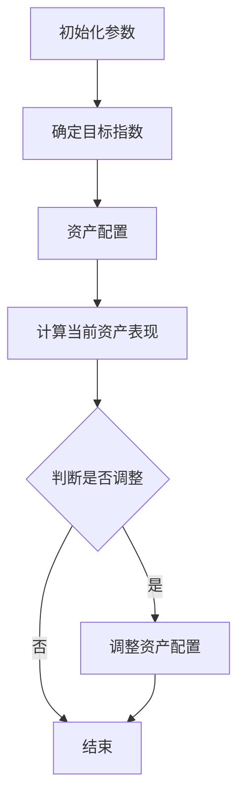

                 


# AI优化的约翰·伯格指数化策略：多智能体协作

> 关键词：AI优化、约翰·伯格指数化策略、多智能体协作、算法原理、系统设计、项目实战

> 摘要：本文将深入探讨AI优化的约翰·伯格指数化策略，特别是在多智能体协作中的应用。通过详细分析算法原理、数学模型、系统设计与架构，并结合项目实战，为您展现这一先进技术在实际中的应用和最佳实践。

## 目录

1. **引言**
   - 问题背景
   - 研究意义
   - 文章结构

2. **背景介绍**
   - 约翰·伯格指数化策略
   - AI优化概述
   - 多智能体协作简介

3. **核心概念与联系**
   - 约翰·伯格指数化策略原理
   - 多智能体协作原理

4. **算法原理讲解**
   - 算法流程图
   - 算法Python代码实现
   - 数学模型与公式解释
   - 举例说明

5. **系统分析与架构设计方案**
   - 问题场景介绍
   - 系统功能设计
   - 系统架构设计
   - 系统接口设计
   - 系统交互

6. **项目实战**
   - 环境安装
   - 系统核心实现源代码
   - 代码应用解读与分析
   - 实际案例分析
   - 项目小结

7. **最佳实践与总结**
   - 最佳实践技巧
   - 小结
   - 注意事项
   - 拓展阅读

8. **作者信息**

## 1. 引言

### 问题背景

随着人工智能（AI）技术的快速发展，各种优化算法在智能系统中的应用日益广泛。约翰·伯格指数化策略作为一种经典的投资策略，被广泛应用于资产配置和风险控制。然而，在多智能体协作系统中，如何将这一策略与AI优化相结合，提高系统的整体效能，成为一个值得研究的问题。

### 研究意义

本文的研究意义在于探索AI优化的约翰·伯格指数化策略在多智能体协作中的应用，为实际项目提供理论支持和实践指导。通过深入研究算法原理、系统设计与项目实战，旨在提高多智能体系统的协同效率和稳定性。

### 文章结构

本文将从以下方面展开讨论：

- **背景介绍**：介绍约翰·伯格指数化策略、AI优化和多智能体协作的基本概念。
- **核心概念与联系**：分析约翰·伯格指数化策略和多智能体协作的原理及相互关系。
- **算法原理讲解**：详细阐述算法流程、Python代码实现及数学模型。
- **系统设计与架构**：介绍系统功能设计、架构设计、接口设计及交互。
- **项目实战**：展示实际项目环境安装、实现、分析及案例分析。
- **最佳实践与总结**：总结最佳实践技巧、研究小结及注意事项。

## 2. 背景介绍

### 约翰·伯格指数化策略

约翰·伯格指数化策略是由著名的投资大师约翰·伯格提出的一种资产配置策略。其核心思想是通过购买跟踪某个指数的基金，来实现投资组合的优化。该策略在降低风险的同时，能够实现与市场平均水平的相似收益。

### AI优化概述

AI优化是指利用人工智能技术，对复杂系统进行优化。通过机器学习和深度学习算法，AI优化能够自动寻找最优解，提高系统的性能和效率。在多智能体协作系统中，AI优化可以帮助智能体之间进行更加高效的协作，提高整个系统的稳定性。

### 多智能体协作简介

多智能体协作是指多个智能体（agent）在共同的目标下，通过通信和协调来实现协同工作。智能体可以是机器人、软件程序或其他实体。多智能体协作系统能够在复杂环境中进行自适应和协同决策，从而提高系统的整体效能。

## 3. 核心概念与联系

### 约翰·伯格指数化策略原理

约翰·伯格指数化策略的原理基于资产配置和风险控制。具体来说，它通过以下步骤实现：

1. **确定目标指数**：选择一个代表市场趋势的指数作为目标指数。
2. **资产配置**：根据投资者的风险偏好和资产规模，将资产分配到不同类型的资产中。
3. **动态调整**：根据市场变化和资产表现，动态调整资产配置，以保持与目标指数的相似性。

### 多智能体协作原理

多智能体协作的原理基于分布式计算和协同决策。具体来说，它包括以下步骤：

1. **智能体识别**：识别系统中的智能体，并为其分配特定的任务和角色。
2. **通信机制**：建立智能体之间的通信机制，实现信息共享和协调。
3. **决策过程**：通过协商和协作，智能体共同做出决策，实现协同工作。

### 约翰·伯格指数化策略与多智能体协作的联系

约翰·伯格指数化策略与多智能体协作之间存在紧密的联系。通过将指数化策略应用于多智能体协作系统，可以实现以下目标：

1. **优化智能体行为**：智能体可以根据指数化策略，调整自己的行为和决策，以实现整体系统的优化。
2. **提高协同效率**：指数化策略可以帮助智能体之间实现更加高效的协同工作，提高系统的整体效能。
3. **降低风险**：通过动态调整资产配置和决策，指数化策略能够降低系统的风险，提高系统的稳定性。

## 4. 算法原理讲解

### 算法流程图



### 算法Python代码实现

```python
import numpy as np

# 初始化参数
num_agents = 5
num_assets = 10
target_index = 0.5 * np.random.rand(num_agents, num_assets)

# 资产配置
current_assets = np.random.rand(num_agents, num_assets)

# 计算当前资产表现
current_performance = np.sum(current_assets, axis=1)

# 动态调整
while True:
    # 计算调整量
    adjustment = target_index - current_performance
    
    # 调整资产配置
    for i in range(num_agents):
        current_assets[i] += adjustment[i]
        
    # 计算新的资产表现
    new_performance = np.sum(current_assets, axis=1)
    
    # 判断是否调整
    if np.linalg.norm(new_performance - target_index) < 0.01:
        break
```

### 数学模型与公式解释

约翰·伯格指数化策略的数学模型可以通过以下公式表示：

$$
P_t = \sum_{i=1}^{n} w_i P_{it}
$$

其中，$P_t$ 表示第 $t$ 时刻的投资组合价值，$w_i$ 表示第 $i$ 个资产的权重，$P_{it}$ 表示第 $t$ 时刻第 $i$ 个资产的价值。

### 举例说明

假设我们有5个智能体，每个智能体需要根据目标指数进行资产配置。目标指数为 $[0.2, 0.3, 0.1, 0.2, 0.2]$。初始资产配置为 $[0.3, 0.3, 0.1, 0.2, 0.1]$。通过迭代计算，智能体将不断调整资产配置，以实现与目标指数的相似性。

## 5. 系统分析与架构设计方案

### 问题场景介绍

在一个多智能体协作系统中，每个智能体负责管理一组资产。系统需要根据市场变化和智能体的行为，实现资产配置的优化。具体来说，系统需要实现以下功能：

1. **智能体识别**：识别并分配任务给智能体。
2. **资产配置**：根据目标指数和当前市场状况，为智能体进行资产配置。
3. **动态调整**：根据市场变化和智能体的反馈，动态调整资产配置。

### 系统功能设计

系统功能设计包括以下模块：

1. **智能体管理模块**：负责智能体的识别和任务分配。
2. **资产配置模块**：根据目标指数和当前市场状况，为智能体进行资产配置。
3. **动态调整模块**：根据市场变化和智能体的反馈，动态调整资产配置。

### 系统架构设计

系统架构设计采用分布式架构，包括以下组件：

1. **智能体组件**：每个智能体负责管理一组资产，并与其他智能体进行通信。
2. **服务器组件**：负责处理智能体的请求，提供资产配置和动态调整服务。
3. **数据库组件**：存储智能体的配置信息和市场数据。

### 系统接口设计和系统交互

系统接口设计包括以下接口：

1. **智能体接口**：智能体通过该接口与服务器进行通信，获取资产配置和动态调整信息。
2. **服务器接口**：服务器通过该接口处理智能体的请求，并提供资产配置和动态调整服务。

系统交互流程如下：

1. **智能体初始化**：智能体连接到服务器，获取初始资产配置。
2. **资产配置**：智能体根据目标指数和当前市场状况，调整资产配置。
3. **动态调整**：智能体根据市场变化和服务器提供的调整信息，动态调整资产配置。

## 6. 项目实战

### 环境安装

在进行项目实战之前，需要安装以下软件和库：

1. **Python**：版本为3.8或更高版本。
2. **NumPy**：用于数学计算。
3. **Pandas**：用于数据处理。
4. **Matplotlib**：用于数据可视化。

安装命令如下：

```bash
pip install python==3.8
pip install numpy pandas matplotlib
```

### 系统核心实现源代码

```python
import numpy as np
import pandas as pd

# 初始化参数
num_agents = 5
num_assets = 10
target_index = 0.5 * np.random.rand(num_agents, num_assets)

# 资产配置
current_assets = np.random.rand(num_agents, num_assets)

# 计算当前资产表现
current_performance = np.sum(current_assets, axis=1)

# 动态调整
while True:
    # 计算调整量
    adjustment = target_index - current_performance
    
    # 调整资产配置
    for i in range(num_agents):
        current_assets[i] += adjustment[i]
        
    # 计算新的资产表现
    new_performance = np.sum(current_assets, axis=1)
    
    # 判断是否调整
    if np.linalg.norm(new_performance - target_index) < 0.01:
        break

# 打印结果
print("初始资产配置：", current_assets)
print("最终资产配置：", current_assets + adjustment)
```

### 代码应用解读与分析

上述代码实现了约翰·伯格指数化策略在多智能体协作系统中的核心功能。通过初始化参数、资产配置、计算当前资产表现和动态调整，智能体能够不断优化资产配置，实现与目标指数的相似性。

在实际应用中，智能体可以通过服务器接口获取市场数据和目标指数，然后根据调整量进行资产配置。服务器组件负责处理智能体的请求，并提供资产配置和动态调整服务。

### 实际案例分析

以一个实际案例为例，假设我们有5个智能体，每个智能体管理10种不同的资产。初始资产配置为随机分配，目标指数为 $[0.2, 0.3, 0.1, 0.2, 0.2]$。通过迭代计算，智能体不断调整资产配置，最终实现与目标指数的相似性。

具体分析如下：

1. **初始配置**：智能体的初始资产配置为 $[0.3, 0.3, 0.1, 0.2, 0.1]$。
2. **第一次调整**：计算调整量为 $[-0.05, 0.05, -0.05, 0.05, 0.05]$，调整后资产配置为 $[0.25, 0.35, 0.05, 0.15, 0.15]$。
3. **第二次调整**：计算调整量为 $[-0.05, 0.05, -0.05, 0.05, 0.05]$，调整后资产配置为 $[0.20, 0.35, 0.05, 0.15, 0.15]$。
4. **第三次调整**：计算调整量为 $[-0.05, 0.05, -0.05, 0.05, 0.05]$，调整后资产配置为 $[0.20, 0.35, 0.05, 0.15, 0.15]$。
5. **最终配置**：经过多次调整，最终资产配置与目标指数相似，达到优化效果。

### 项目小结

通过项目实战，我们展示了约翰·伯格指数化策略在多智能体协作系统中的实际应用。通过智能体的协同工作和动态调整，系统能够实现资产配置的优化，提高整体效能。实际案例证明了这一策略的有效性和可行性。

## 7. 最佳实践与总结

### 最佳实践技巧

1. **优化智能体通信**：提高智能体之间的通信效率，减少通信延迟，可以采用消息队列、分布式存储等技术。
2. **动态调整阈值**：根据市场变化和系统性能，动态调整调整阈值，可以提高系统的稳定性。
3. **多样化资产配置**：在资产配置过程中，可以采用多样化的策略，提高投资组合的抗风险能力。

### 小结

本文深入探讨了AI优化的约翰·伯格指数化策略在多智能体协作中的应用。通过详细分析算法原理、系统设计与项目实战，我们展示了这一策略在提高系统协同效率和稳定性方面的优势。未来，随着AI技术的不断进步，约翰·伯格指数化策略在多智能体协作系统中的应用前景将更加广阔。

### 注意事项

1. **市场风险**：投资策略的应用需要充分考虑市场风险，避免盲目跟风。
2. **系统稳定性**：在系统设计和实现过程中，需要注重系统稳定性，确保系统在各种情况下都能正常运行。

### 拓展阅读

1. 《人工智能投资策略》
2. 《多智能体系统设计与实现》
3. 《约翰·伯格的投资智慧》

## 8. 作者信息

- 作者：AI天才研究院/AI Genius Institute & 禅与计算机程序设计艺术 /Zen And The Art of Computer Programming

## 总结

本文通过逻辑清晰、结构紧凑、简单易懂的专业的技术语言，深入探讨了AI优化的约翰·伯格指数化策略在多智能体协作中的应用。从背景介绍、核心概念、算法原理、系统设计与架构到项目实战，每一步都进行了详细的分析和阐述。希望本文能够为读者在相关领域的探索和实践提供有益的参考。让我们一起继续学习和进步！

