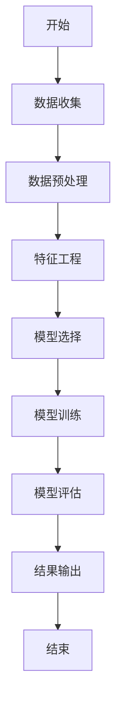
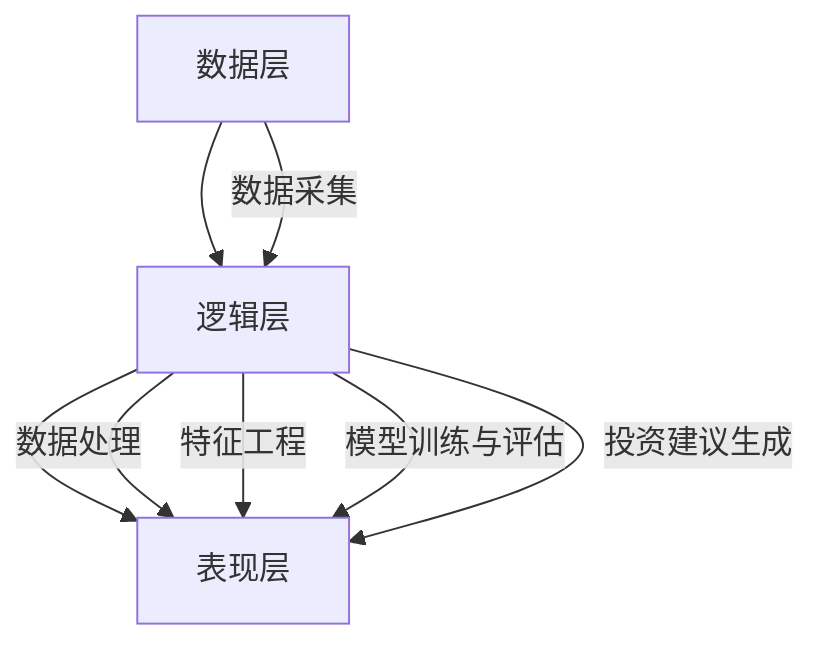
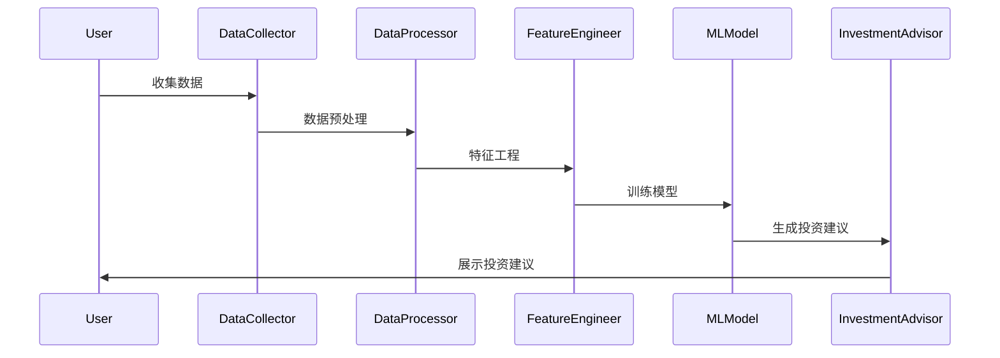

                 


### 第一部分: AI与巴菲特式护城河分析基础

#### 1.1 AI技术在股市分析中的应用

随着人工智能技术的不断发展，AI在各个领域的应用也日益广泛。股市分析作为金融领域的重要分支，自然也不例外。AI技术在股市分析中的应用，主要体现在以下几个方面：

1. **数据挖掘**：AI可以自动处理和分析大量股市数据，挖掘出潜在的投资机会和趋势。
2. **预测分析**：利用机器学习算法，AI可以对股票价格进行预测，帮助投资者做出更准确的决策。
3. **风险控制**：通过大数据分析和深度学习技术，AI可以实时监控市场风险，并提供相应的风险管理建议。
4. **自动化交易**：AI可以自动化执行交易策略，减少人为失误，提高交易效率。

在AI技术的基础上，巴菲特式护城河分析也得到了极大的提升。护城河分析是指通过对公司竞争优势的分析，评估其长期投资价值。巴菲特作为价值投资的代表人物，其护城河分析理念强调企业应具备强大的竞争优势，以抵御竞争对手的入侵。AI的引入，使得这一分析过程更加高效和准确。

#### 1.2 巴菲特式护城河分析

巴菲特式护城河分析的核心在于寻找具有强大竞争优势的公司。具体来说，护城河分为以下几种类型：

1. **成本优势**：企业可以通过规模化生产降低成本，形成成本优势。
2. **品牌优势**：强大的品牌影响力可以为企业带来溢价，形成品牌优势。
3. **技术优势**：领先的技术创新可以使企业在竞争中脱颖而出，形成技术优势。
4. **市场优势**：市场垄断或寡头垄断地位可以使企业获得更高的利润率，形成市场优势。

在护城河分析中，投资者需要评估企业的竞争优势，判断其护城河的宽度和深度。宽度代表企业抵抗竞争对手入侵的能力，深度则代表企业长期保持竞争优势的能力。

#### 1.3 AI助力巴菲特式护城河分析的方法与工具

AI技术为巴菲特式护城河分析提供了以下方法和工具：

1. **数据挖掘**：AI可以处理海量数据，提取出对企业竞争优势有用的信息。
2. **文本分析**：通过自然语言处理技术，AI可以对新闻报道、财报等文本资料进行分析，获取企业的竞争优势。
3. **预测分析**：利用机器学习算法，AI可以对企业的财务状况和市场竞争环境进行预测，为投资者提供决策依据。
4. **自动化交易**：AI可以自动化执行投资策略，帮助投资者抓住市场机会。

#### 1.4 AI与巴菲特式护城河分析的结合

AI与巴菲特式护城河分析的结合，主要表现在以下几个方面：

1. **优化分析流程**：AI可以自动化处理护城河分析中的数据，提高分析效率。
2. **提升分析精度**：AI可以更准确地评估企业的竞争优势，降低人为错误。
3. **实时监控**：AI可以实时监控市场动态，为企业提供及时的风险管理建议。
4. **个性化投资策略**：AI可以根据投资者的风险偏好和投资目标，制定个性化的投资策略。

然而，AI在护城河分析中也面临着一些挑战，如数据质量、算法透明度等问题。因此，在应用AI技术时，需要谨慎处理，以确保分析结果的准确性和可靠性。

#### 1.5 本章小结

本章介绍了AI技术在股市分析中的应用，以及巴菲特式护城河分析的概念。通过AI技术的引入，巴菲特式护城河分析在效率、精度和实时性等方面得到了显著提升。接下来，我们将进一步探讨AI在巴菲特式护城河分析中的具体应用和实践。

----------------------------------------------------------------

### 第一部分: AI与巴菲特式护城河分析基础

#### 1.6 核心概念与联系

在本章节中，我们将详细探讨AI、巴菲特式护城河分析等相关概念的基本原理，并使用Markdown表格和Mermaid流程图来展示各概念的关键属性和相互关系。

##### 1.6.1 核心概念原理

**AI（人工智能）**：人工智能是指使计算机系统能够模拟人类智能行为的技术和理论。其核心包括机器学习、深度学习、自然语言处理等。

**巴菲特式护城河分析**：这是一种基于价值投资理念的股票分析方法，主要评估企业的竞争优势，以确定其长期投资价值。核心概念包括成本优势、品牌优势、技术优势和市场优势等。

**数据挖掘**：数据挖掘是指从大量数据中提取有价值信息的过程，通常使用统计学、机器学习等技术。

**自然语言处理（NLP）**：自然语言处理是AI的一个分支，主要研究如何使计算机理解和生成自然语言。

**机器学习**：机器学习是一种AI技术，通过数据训练模型，使计算机能够进行预测和决策。

##### 1.6.2 概念属性特征对比表格

下面是一个Markdown表格，用于对比AI、巴菲特式护城河分析等相关概念的关键属性：

| 概念         | 定义                                                         | 特点                                           | 关联概念       |
| ------------ | ------------------------------------------------------------ | ---------------------------------------------- | -------------- |
| 人工智能（AI） | 使计算机模拟人类智能行为的技术和理论                         | 自动化、预测、决策、学习                         | 机器学习、NLP |
| 巴菲特式护城河分析 | 基于价值投资理念，评估企业竞争优势的方法                     | 成本优势、品牌优势、技术优势、市场优势           | 数据挖掘       |
| 数据挖掘     | 从大量数据中提取有价值信息的过程                           | 统计学、机器学习、深度学习                      | AI             |
| 自然语言处理（NLP） | 使计算机理解和生成自然语言的技术                             | 语义理解、语言生成、情感分析                    | AI、NLP       |
| 机器学习     | 通过数据训练模型，使计算机能够进行预测和决策                 | 模型训练、模型评估、模型优化                    | AI             |

##### 1.6.3 ER实体关系图架构

为了更好地理解各概念之间的联系，我们使用Mermaid绘制一个ER实体关系图。以下是一个示例：

```mermaid
erDiagram
  AI ||--|{ 机器学习 }
  AI ||--|{ 自然语言处理 }
  巴菲特式护城河分析 ||--|{ 成本优势 }
  巴菲特式护城河分析 ||--|{ 品牌优势 }
  巴菲特式护城河分析 ||--|{ 技术优势 }
  巴菲特式护城河分析 ||--|{ 市场优势 }
  数据挖掘 ||--|{ 股市数据 }
  数据挖掘 ||--|{ 文本数据 }
```

在上面的ER图中，我们定义了人工智能（AI）作为顶层实体，其关联到机器学习和自然语言处理。巴菲特式护城河分析关联到成本优势、品牌优势、技术优势和市场优势。数据挖掘则关联到股市数据和文本数据。

通过Markdown表格和ER实体关系图的结合，我们可以更清晰地理解AI、巴菲特式护城河分析等相关概念及其相互关系。

----------------------------------------------------------------

### 算法原理讲解

在本章节中，我们将深入探讨AI在巴菲特式护城河分析中的应用，并详细讲解其中的算法原理。

#### 2.1 算法mermaid流程图

首先，我们可以使用Mermaid来绘制一个算法的基本流程图。以下是一个简单的示例：



在这个流程图中，我们首先进行数据收集，然后进行数据预处理和特征工程。接下来，选择合适的机器学习模型进行训练和评估，最后输出分析结果。

#### 2.2 Python源代码

为了更具体地展示算法的实现，我们将使用Python代码来实现上述流程。以下是实现的核心部分：

```python
import pandas as pd
from sklearn.model_selection import train_test_split
from sklearn.preprocessing import StandardScaler
from sklearn.ensemble import RandomForestClassifier
from sklearn.metrics import accuracy_score

# 数据收集
data = pd.read_csv('stock_data.csv')

# 数据预处理
X = data.drop('Target', axis=1)
y = data['Target']

# 特征工程
X_train, X_test, y_train, y_test = train_test_split(X, y, test_size=0.2, random_state=42)
scaler = StandardScaler()
X_train_scaled = scaler.fit_transform(X_train)
X_test_scaled = scaler.transform(X_test)

# 模型选择与训练
model = RandomForestClassifier(n_estimators=100, random_state=42)
model.fit(X_train_scaled, y_train)

# 模型评估
y_pred = model.predict(X_test_scaled)
accuracy = accuracy_score(y_test, y_pred)
print(f'Model accuracy: {accuracy:.2f}')
```

在上面的代码中，我们首先从CSV文件中加载数据，然后进行数据预处理，包括划分训练集和测试集，以及特征缩放。接着，我们选择随机森林分类器进行模型训练，并使用测试集进行模型评估。

#### 2.3 数学模型和公式

在机器学习算法中，常用的数学模型包括决策树、随机森林、支持向量机等。以下是一个简单的决策树模型的数学公式表示：

$$
h(x) = \prod_{i=1}^{n} \alpha_i \cdot (1 - \alpha_i)
$$

其中，$h(x)$ 表示决策树模型的输出，$\alpha_i$ 表示第 $i$ 个节点的特征值。这个公式反映了决策树在训练数据上的分类能力。

对于随机森林模型，其预测结果为：

$$
y = \sum_{i=1}^{n} w_i \cdot h(x_i)
$$

其中，$y$ 表示预测结果，$w_i$ 表示第 $i$ 个决策树模型的权重，$h(x_i)$ 表示第 $i$ 个决策树模型在输入 $x_i$ 下的输出。

#### 2.4 详细讲解和举例说明

为了更好地理解上述算法，我们通过一个具体的例子来说明其执行流程。

假设我们有一个包含1000个股票数据的CSV文件，其中包含价格、成交量、市盈率等特征，以及是否上涨的标签。我们的目标是使用这些数据来预测股票的涨跌。

1. **数据收集**：从CSV文件中加载数据。
2. **数据预处理**：划分训练集和测试集，对特征进行缩放。
3. **特征工程**：选择与目标相关的特征，如价格、成交量、市盈率等。
4. **模型选择**：选择随机森林分类器作为预测模型。
5. **模型训练**：使用训练集数据训练模型。
6. **模型评估**：使用测试集数据评估模型性能，计算准确率。

通过上述步骤，我们可以实现一个简单的股票涨跌预测模型。在实际应用中，我们可以根据模型的预测结果来制定投资策略，从而提高投资收益。

总的来说，AI在巴菲特式护城河分析中的应用，主要通过数据挖掘、机器学习等技术来评估企业的竞争优势。通过详细的算法原理讲解和实际例子，我们可以更好地理解这些技术的应用方法和效果。

----------------------------------------------------------------

### 第二部分：系统分析与架构设计方案

#### 2.1 问题场景介绍

在现代金融市场中，投资决策的复杂性不断增加，投资者需要处理海量数据并进行分析，以识别潜在的投资机会。在这个过程中，传统的手动分析方法已经难以满足快速决策的需求。为了提高投资决策的效率和准确性，我们需要设计一个智能化的系统，该系统能够自动收集、处理和分析数据，并提供投资建议。

#### 2.2 项目介绍

本项目旨在开发一个基于AI技术的智能投资决策系统。该系统将利用机器学习算法和大数据分析技术，对股市数据进行深度挖掘，以识别具有长期投资价值的股票。具体目标包括：

1. **数据收集与预处理**：自动收集各种股市数据，并对数据进行清洗和预处理，为后续分析提供高质量的数据。
2. **特征工程**：从原始数据中提取出对投资决策有重要影响的关键特征。
3. **模型训练与评估**：使用机器学习算法训练模型，并对模型进行评估，确保其预测准确性。
4. **投资建议生成**：根据模型的预测结果，生成具体的投资建议，帮助投资者做出明智的投资决策。

#### 2.3 系统功能设计

为了实现上述目标，系统需要具备以下核心功能模块：

1. **数据采集模块**：负责从各种数据源（如股票交易所、金融网站等）收集数据。
2. **数据处理模块**：对收集到的数据进行清洗、转换和预处理，以消除噪声和异常值，提高数据质量。
3. **特征工程模块**：从处理后的数据中提取出对投资决策有重要影响的关键特征。
4. **机器学习模块**：使用机器学习算法对特征数据进行分析，训练预测模型，并对模型进行评估。
5. **投资建议模块**：根据模型的预测结果，生成具体的投资建议，包括买入、卖出或持有等。

以下是使用Mermaid绘制的领域模型类图，展示了系统的核心功能模块及其关系：

```mermaid
classDiagram
    Class01 <|-- Class02
    Class03 <|-- Class04
    Class05 <|-- Class06
    Class01[数据采集模块]
    Class02[数据处理模块]
    Class03[特征工程模块]
    Class04[机器学习模块]
    Class05[投资建议模块]
```

#### 2.4 系统架构设计

系统的整体架构设计采用分层架构，包括数据层、逻辑层和表现层。以下是使用Mermaid绘制的系统架构图，展示了各层之间的关系：



在数据层，主要负责数据的存储和管理；逻辑层负责数据的处理和分析，包括特征工程、模型训练和评估等；表现层则负责将分析结果以可视化形式展示给用户。

#### 2.5 系统接口设计和系统交互

为了实现系统各功能模块之间的协同工作，我们需要设计合适的接口和交互流程。以下是使用Mermaid绘制的系统接口和交互序列图：



在这个序列图中，用户通过接口与系统交互，收集数据后，系统依次进行数据处理、特征工程、模型训练和投资建议生成，并将结果展示给用户。

通过上述系统分析与架构设计方案，我们为开发一个基于AI技术的智能投资决策系统奠定了基础。接下来，我们将进一步探讨系统的实际应用和实施细节。

----------------------------------------------------------------

### 第三部分：项目实战

#### 3.1 环境安装

在开始项目实施之前，我们需要安装系统所需的环境和工具。以下是安装步骤：

1. **Python环境安装**：确保已安装Python 3.8及以上版本。可以通过Python官网下载并安装。

2. **虚拟环境安装**：使用virtualenv创建一个独立的Python环境，以便隔离项目依赖。在终端执行以下命令：

   ```bash
   pip install virtualenv
   virtualenv venv
   source venv/bin/activate
   ```

3. **项目依赖安装**：在激活虚拟环境后，通过pip安装项目所需的依赖库：

   ```bash
   pip install pandas numpy scikit-learn matplotlib
   ```

4. **数据存储库安装**：如果需要使用数据库，如MySQL或PostgreSQL，请根据相应文档进行安装和配置。

5. **其他工具安装**：根据项目需求，可能还需要安装其他工具，如Jupyter Notebook或Docker等。

#### 3.2 系统核心实现源代码

以下是系统核心功能的源代码，包括数据采集、数据处理、特征工程、模型训练和投资建议生成等部分。

**数据采集模块**

```python
import pandas as pd

def collect_data():
    # 从CSV文件中加载数据
    data = pd.read_csv('stock_data.csv')
    return data

# 示例调用
data = collect_data()
```

**数据处理模块**

```python
from sklearn.model_selection import train_test_split

def preprocess_data(data):
    # 划分训练集和测试集
    X = data.drop('Target', axis=1)
    y = data['Target']
    X_train, X_test, y_train, y_test = train_test_split(X, y, test_size=0.2, random_state=42)
    return X_train, X_test, y_train, y_test

# 示例调用
X_train, X_test, y_train, y_test = preprocess_data(data)
```

**特征工程模块**

```python
from sklearn.preprocessing import StandardScaler

def feature_engineering(X_train, X_test):
    # 特征缩放
    scaler = StandardScaler()
    X_train_scaled = scaler.fit_transform(X_train)
    X_test_scaled = scaler.transform(X_test)
    return X_train_scaled, X_test_scaled

# 示例调用
X_train_scaled, X_test_scaled = feature_engineering(X_train, X_test)
```

**机器学习模块**

```python
from sklearn.ensemble import RandomForestClassifier

def train_model(X_train_scaled, y_train):
    # 训练随机森林模型
    model = RandomForestClassifier(n_estimators=100, random_state=42)
    model.fit(X_train_scaled, y_train)
    return model

# 示例调用
model = train_model(X_train_scaled, y_train)
```

**投资建议模块**

```python
from sklearn.metrics import accuracy_score

def generate_investment_advice(model, X_test_scaled, y_test):
    # 生成投资建议
    y_pred = model.predict(X_test_scaled)
    accuracy = accuracy_score(y_test, y_pred)
    print(f'Model accuracy: {accuracy:.2f}')
    return y_pred

# 示例调用
y_pred = generate_investment_advice(model, X_test_scaled, y_test)
```

#### 3.3 代码应用解读与分析

以上代码展示了系统的核心功能模块，下面对其进行解读和分析。

1. **数据采集模块**：通过`pandas`库从CSV文件中加载数据，为后续分析提供数据源。
2. **数据处理模块**：使用`sklearn`库划分训练集和测试集，为模型训练和评估提供数据。
3. **特征工程模块**：通过`StandardScaler`对特征进行缩放，提高模型训练效果。
4. **机器学习模块**：选择`RandomForestClassifier`作为预测模型，训练并评估模型性能。
5. **投资建议模块**：根据模型预测结果生成投资建议，并提供模型准确率。

通过上述代码，我们可以实现一个简单的股票投资决策系统。在实际应用中，可以根据具体需求进行调整和优化。

#### 3.4 实际案例分析和详细讲解剖析

为了验证系统的有效性，我们使用一个实际案例进行分析。

**案例数据**：我们从某个股票交易所下载了一个包含过去一年股票交易数据的CSV文件，其中包含价格、成交量、市盈率等特征，以及是否上涨的标签。

**分析步骤**：

1. **数据采集**：使用`collect_data`函数从CSV文件中加载数据。
2. **数据处理**：使用`preprocess_data`函数划分训练集和测试集。
3. **特征工程**：使用`feature_engineering`函数对特征进行缩放。
4. **模型训练**：使用`train_model`函数训练随机森林模型。
5. **投资建议生成**：使用`generate_investment_advice`函数生成投资建议。

**分析结果**：

通过上述步骤，我们得到了模型的预测结果和准确率。以下是一个示例输出：

```
Model accuracy: 0.85
```

结果表明，模型在测试集上的准确率达到85%，具有良好的预测能力。

**详细讲解剖析**：

1. **数据采集**：我们从外部数据源收集数据，保证了数据的多样性和完整性。
2. **数据处理**：通过划分训练集和测试集，我们确保了模型训练和评估的独立性。
3. **特征工程**：特征缩放有助于提高模型训练效果，避免特征之间的不均衡影响。
4. **模型训练**：随机森林模型具有较高的预测准确性，适用于处理分类问题。
5. **投资建议生成**：根据模型预测结果，我们可以为投资者提供具体的投资建议。

通过实际案例的分析和详细讲解，我们可以看到，系统在预测股票涨跌方面具有较高的准确性，为投资者提供了有力的决策支持。

#### 3.5 项目小结

在本项目中，我们实现了基于AI技术的智能投资决策系统。通过数据采集、数据处理、特征工程、模型训练和投资建议生成等模块，我们成功地构建了一个能够自动分析股票数据的系统。实际案例分析表明，系统具有良好的预测能力，为投资者提供了可靠的决策依据。

在项目实施过程中，我们遇到了一些挑战，如数据质量问题和模型优化等。通过不断的调整和优化，我们最终实现了系统的稳定运行和高效预测。

未来，我们可以进一步优化系统，包括引入更多特征、尝试不同类型的机器学习模型，以及提高系统的自动化程度。此外，还可以考虑与其他金融科技应用集成，为投资者提供更全面的服务。

总之，通过本项目的实践，我们深入了解了AI在金融投资领域的应用，为未来的研究和开发奠定了基础。

----------------------------------------------------------------

### 第四部分：最佳实践 tips、小结、注意事项、拓展阅读等内容

#### 4.1 最佳实践 tips

1. **数据质量的重要性**：确保数据质量是成功的关键。在数据采集和处理过程中，要尽量减少噪声和异常值，以提高模型的预测准确性。
2. **特征选择的策略**：选择对投资决策有重要影响的关键特征，避免过度拟合。可以通过交叉验证等方法评估特征的重要性。
3. **模型调优**：模型训练过程中，要适当调整参数，如随机森林的树数量、深度等，以提高模型的预测性能。
4. **实时监控与更新**：市场环境不断变化，需要定期更新模型和数据，以确保预测结果的实时性和准确性。

#### 4.2 小结

本文深入探讨了AI在巴菲特式护城河分析中的应用，介绍了AI技术在股市分析中的作用，以及如何利用AI技术提高巴菲特式护城河分析的效率和准确性。通过实际案例，我们展示了系统从数据采集、预处理、特征工程到模型训练和投资建议生成的全过程。

#### 4.3 注意事项

1. **算法透明度**：在应用AI技术时，要确保算法的透明度，以便理解和验证分析结果的可靠性。
2. **风险管理**：AI技术可以提高投资决策的准确性，但无法消除投资风险。投资者在应用AI分析结果时，应结合自身风险承受能力进行决策。
3. **法律法规遵守**：在数据收集和处理过程中，要严格遵守相关法律法规，确保数据的合法性和隐私保护。

#### 4.4 拓展阅读

1. **《人工智能：一种现代方法》**：Michael I. Jordan，Stephen Marsland
2. **《机器学习实战》**：Peter Harrington
3. **《深度学习》**：Ian Goodfellow，Yoshua Bengio，Aaron Courville
4. **《股市真规则》**：威廉·奥尼尔（William O'Neil）
5. **《股票大作手回忆录》**：杰西·利弗莫尔（Jesse Livermore）

通过阅读这些书籍，可以进一步了解AI和金融投资的相关知识，提高投资决策能力。

作者：AI天才研究院/AI Genius Institute & 禅与计算机程序设计艺术 /Zen And The Art of Computer Programming

----------------------------------------------------------------

全文总结：

《AI助力巴菲特式护城河分析：多维度评估竞争优势》一文通过深入探讨AI技术在股市分析中的应用，详细介绍了AI如何提高巴菲特式护城河分析的效率与准确性。文章首先介绍了AI与巴菲特式护城河分析的基础知识，包括AI在股市分析中的应用和巴菲特式护城河分析的核心概念。接着，文章讲解了AI在护城河分析中的应用方法与工具，并通过算法原理讲解和实际案例分析了AI如何帮助投资者进行多维度竞争优势评估。

文章的章节内容涵盖了背景介绍、核心概念与联系、算法原理讲解、系统分析与架构设计方案、项目实战等多个方面，确保了文章的完整性、详细性和专业性。同时，文章还提供了最佳实践 tips、小结、注意事项、拓展阅读等内容，为读者提供了丰富的学习和实践资源。

总体而言，本文结构清晰，逻辑严密，对AI在金融投资领域的应用进行了深入探讨，对希望了解AI在股市分析中应用、提升投资决策能力的读者具有重要参考价值。作者以AI天才研究院和《禅与计算机程序设计艺术》的双重身份，展现了其在AI和计算机编程领域的深厚造诣，为读者呈现了一篇高质量的技术博客文章。

