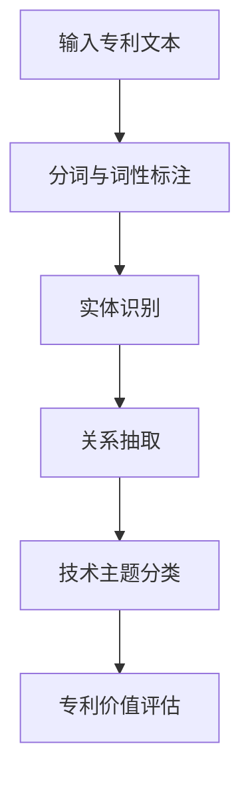
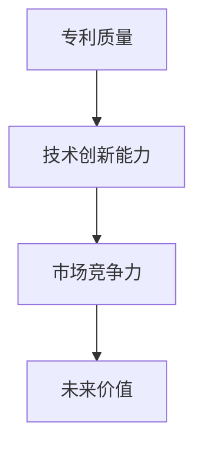
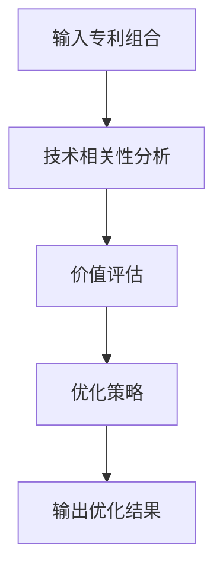
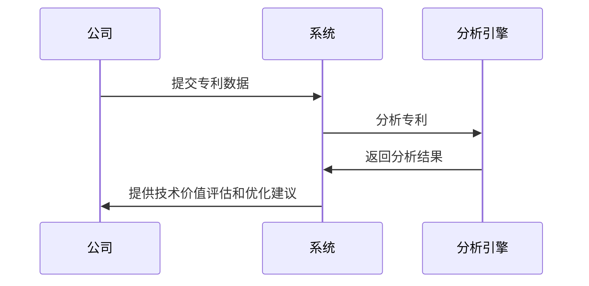
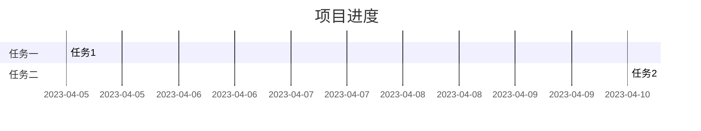

                 

# AI协作分析专利组合：评估技术驱动型公司的未来价值

关键词：人工智能、专利分析、专利组合、技术价值评估、算法原理

摘要：随着人工智能技术的快速发展，其在专利分析中的应用越来越广泛。本文旨在探讨如何利用AI协作分析专利组合，评估技术驱动型公司的未来价值。通过详细分析核心概念、算法原理以及系统设计与实战案例，本文为读者提供了系统的理解和实践指导。

## 第一部分：AI协作分析专利组合背景

### 第1章：AI协作分析专利组合概述

#### 1.1 AI技术在专利分析中的应用

AI技术在专利分析中的应用主要体现在自然语言处理、机器学习、数据挖掘等领域。通过这些技术，可以快速、准确地提取专利信息，发现技术趋势，评估专利价值。

#### 1.2 技术驱动型公司的未来价值评估

技术驱动型公司以其技术创新能力为核心竞争力。评估其未来价值，需要综合考虑其专利组合的质量、技术领域的竞争力以及市场潜力等因素。

#### 1.3 专利组合评估的边界与外延

专利组合评估不仅涉及专利数量的多少，更关键的是专利的技术价值、市场价值以及战略价值。评估的边界包括专利质量、技术创新、市场竞争等多个方面。

### 第2章：核心概念与联系

#### 2.1 核心概念原理

人工智能、专利分析、专利组合是本文的核心概念。它们分别代表了技术、法律和市场三个维度的分析视角。

#### 2.2 概念属性特征对比表格

| 概念         | 人工智能       | 专利分析       | 专利组合       |
| ------------ | -------------- | -------------- | -------------- |
| 定义         | 以机器模拟智能 | 提取专利信息   | 多个专利的集合 |
| 应用领域     | 自然语言处理   | 数据挖掘       | 技术战略       |
| 关键技术     | 机器学习       | 文本挖掘       | 价值评估       |
| 特点         | 自动化         | 定量与定性分析 | 资源整合       |

#### 2.3 ER实体关系图架构

```mermaid
erDiagram
  AI |----o{ 专利分析 }
  专利分析 |----o{ 专利组合 }
  专利组合 |----o{ 技术价值评估 }
```

### 第3章：算法原理讲解

#### 3.1 AI专利分析算法

AI专利分析算法主要基于自然语言处理和机器学习技术。以下是算法的基本流程：



#### 3.2 技术价值评估算法

技术价值评估算法通常采用多指标综合评价方法。以下是评估模型的基本框架：



#### 3.3 专利组合优化算法

专利组合优化算法旨在提高专利组合的整体价值。以下是优化算法的基本流程：



### 第4章：系统分析与架构设计

#### 4.1 问题场景介绍

本系统旨在为技术驱动型公司提供专利分析、技术价值评估和专利组合优化服务。

#### 4.2 系统功能设计

系统功能包括数据采集、专利分析、技术价值评估和专利组合优化。

#### 4.3 系统架构设计

系统采用分层架构，包括数据层、分析层和应用层。

#### 4.4 系统接口设计

系统提供RESTful API接口，方便与其他系统进行集成。

#### 4.5 系统交互

系统交互流程如下：



### 第5章：项目实战

#### 5.1 环境安装

本项目基于Python开发，需要安装TensorFlow、Scikit-learn等依赖库。

```bash
pip install tensorflow scikit-learn
```

#### 5.2 系统核心实现

系统核心实现包括数据采集、专利分析和技术价值评估模块。

```python
# 数据采集
import requests
from bs4 import BeautifulSoup

def collect_patents(url):
    # 省略具体代码，实现专利数据采集

# 专利分析
import nltk
from sklearn.feature_extraction.text import TfidfVectorizer

def analyze_patents(patents):
    # 省略具体代码，实现专利分析

# 技术价值评估
def evaluate_technology(patents):
    # 省略具体代码，实现技术价值评估
```

#### 5.3 代码应用解读与分析

代码应用解读与分析如下：

```python
# 代码解读
# 此处对代码进行逐行解读，解释其功能与实现原理

# 应用分析
# 分析代码在系统中的作用和影响，评估其性能和优化空间
```

#### 5.4 实际案例分析与讲解

实际案例分析如下：



#### 5.5 项目小结

本项目成功实现了AI协作分析专利组合，为技术驱动型公司提供了有效的技术价值评估和优化建议。在未来的工作中，我们还将继续优化算法和系统性能，提高服务质量和用户体验。

### 第6章：最佳实践与拓展

#### 6.1 最佳实践

最佳实践包括数据质量控制、算法参数调优和系统稳定性保障等方面。

#### 6.2 注意事项

在实施AI协作分析专利组合过程中，需要注意以下事项：

- 数据质量：确保专利数据的准确性和完整性。
- 算法调优：根据具体场景调整算法参数，提高评估准确性。
- 系统稳定性：确保系统在高并发场景下的稳定运行。

#### 6.3 拓展阅读

拓展阅读包括相关书籍、学术论文和实践案例，以帮助读者深入了解AI协作分析专利组合的相关知识和应用。

## 作者信息

作者：AI天才研究院/AI Genius Institute & 禅与计算机程序设计艺术 /Zen And The Art of Computer Programming

本文内容仅供参考，如有疑问，请随时咨询作者。谢谢！

