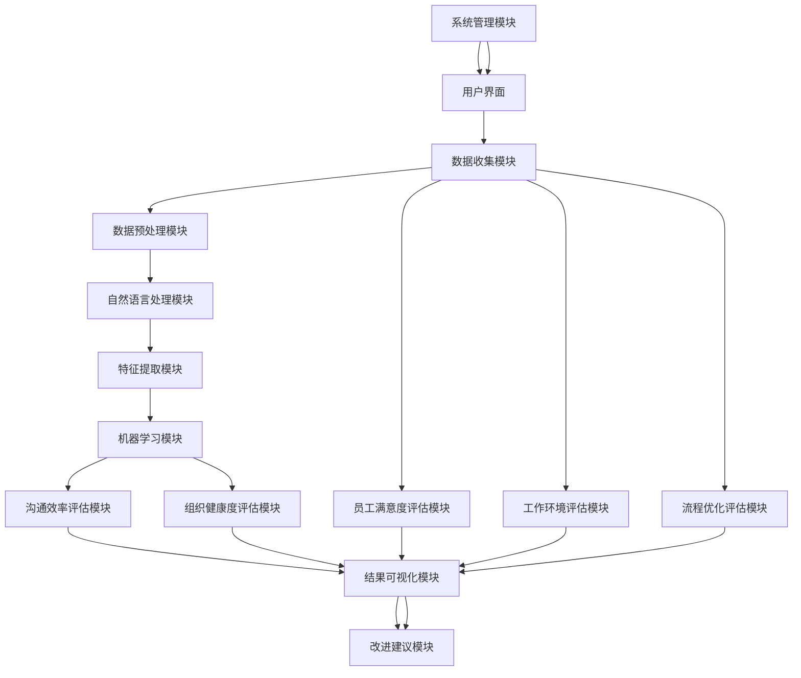
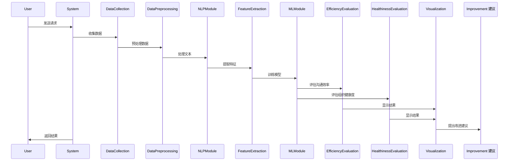
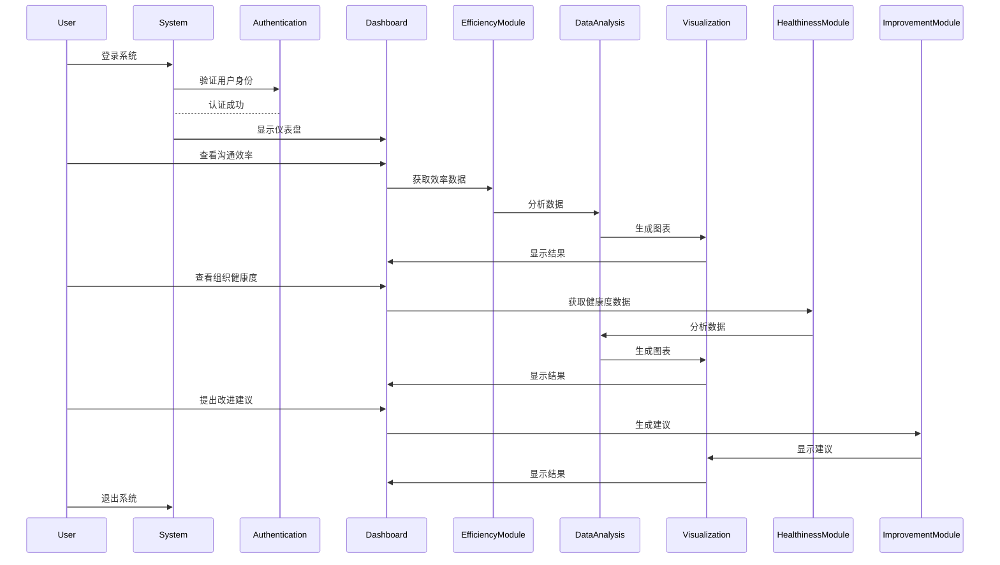

                 

# AI协作分析公司内部沟通效率：评估组织健康度

## 关键词
- AI协作分析
- 内部沟通效率
- 组织健康度
- 沟通效率评估
- 自然语言处理

## 摘要
本文旨在探讨如何利用AI技术分析企业内部沟通效率，以评估组织的健康度。通过自然语言处理和机器学习算法，本文提出了一套评估体系，包括沟通内容分析、沟通效率评估和组织健康度评估。本文将详细介绍这些核心概念及其相互联系，以及具体的算法原理和应用实例。

## 第一部分：背景介绍

### 第1章：问题背景、问题描述与解决方法

#### 1.1.1 问题背景
在现代企业中，内部沟通效率对组织运作有着至关重要的影响。高效沟通能够加快信息传递，缩短决策周期，优化资源分配，从而提升整体竞争力。然而，企业内部沟通效率常常面临诸多挑战：

1. **沟通渠道多样化**：企业内部存在多种沟通渠道，如电子邮件、即时通讯、会议等，不同的沟通方式具有不同的特点和局限性。
2. **沟通成本高**：频繁的沟通需要耗费大量时间和人力资源，导致企业成本增加。
3. **沟通质量不稳定**：信息传递过程中可能存在误解、遗漏或错误，影响沟通质量。
4. **沟通障碍**：不同部门、不同层级之间的沟通壁垒，可能导致信息不对称和决策滞后。

#### 1.1.2 问题描述
企业内部沟通效率低下的问题具体表现为：

1. **信息传递缓慢**：沟通双方回复信息的时间间隔过长，导致决策过程延迟。
2. **信息准确度低**：沟通过程中信息传递不准确，导致工作错误或重复。
3. **沟通频率不合理**：沟通频率过高或过低，影响工作效率和员工满意度。
4. **沟通方式不适用**：某些沟通方式不适合当前任务或场景，导致沟通效率降低。

#### 1.1.3 问题解决
为了提升企业内部沟通效率，本文提出以下解决方案：

1. **AI协作分析**：利用AI技术对内部沟通进行深度分析，识别潜在问题和改进空间。
2. **沟通效率评估**：通过关键指标量化沟通效率，为改进提供数据支持。
3. **组织健康度评估**：综合考虑员工满意度、工作环境、流程优化等因素，全面评估组织健康度。

#### 1.1.4 边界与外延
本文主要针对企业内部沟通效率进行分析，不涉及外部沟通。分析范围包括电子邮件、即时通讯工具、会议等多种沟通方式。同时，本文的核心概念和算法将在不同场景下具有广泛的适用性。

#### 1.1.5 概念结构与核心要素组成
本文的核心概念和要素包括：

1. **AI协作分析**：利用自然语言处理和机器学习技术，对沟通内容进行分析，识别潜在问题和改进建议。
2. **沟通效率评估**：通过关键指标（如响应时间、信息准确度、沟通频率）衡量沟通效率，为改进提供数据支持。
3. **组织健康度评估**：综合考虑员工满意度、工作环境、流程优化等因素，全面评估组织的健康度。

## 第二部分：核心概念与联系

### 第2章：核心概念原理与联系

#### 2.1.1 AI协作分析原理
AI协作分析是利用人工智能技术，特别是自然语言处理（NLP）和机器学习（ML）技术，对企业内部沟通内容进行分析的过程。具体原理如下：

##### 2.1.1.1 自然语言处理（NLP）
NLP是使计算机理解和处理人类语言的技术。在AI协作分析中，NLP技术主要包括以下步骤：

1. **文本预处理**：包括分词、去除停用词、词性标注等，以将原始文本转化为适合机器学习模型处理的形式。
2. **语义分析**：通过实体识别、情感分析、关系抽取等任务，深入理解文本的含义。

##### 2.1.1.2 机器学习算法
机器学习算法用于从数据中学习规律，并用于预测和分类。在AI协作分析中，常用的机器学习算法包括：

1. **监督学习**：使用预标注的数据训练模型，用于识别沟通中的潜在问题。
2. **无监督学习**：通过分析数据自身的结构，发现沟通中的异常和模式。

#### 2.1.2 沟通效率评估原理
沟通效率评估是通过关键指标量化沟通效率的过程。这些指标通常包括：

1. **响应时间**：沟通双方回复信息的时间间隔。
2. **信息准确度**：沟通信息的准确性和完整性。
3. **沟通频率**：单位时间内沟通的次数。

通过这些指标，可以评估不同团队或个人的沟通效率，并为改进提供数据支持。

#### 2.1.3 组织健康度评估原理
组织健康度评估是综合考虑多种因素，评估组织的整体健康度。这些因素通常包括：

1. **员工满意度**：通过调查问卷、员工反馈等方式收集数据，分析员工对工作环境和沟通氛围的满意度。
2. **工作环境**：评估办公室环境、办公设备等硬件设施。
3. **流程优化**：识别现有流程中的瓶颈和问题，提出改进方案，优化工作流程。

### 第3章：核心概念属性特征对比表格与ER实体关系图架构

#### 2.2.1 核心概念属性特征对比表格

| 概念 | 定义 | 属性特征 |
| ---- | ---- | ---- |
| AI协作分析 | 利用NLP和ML分析沟通内容 | 语义分析、潜在问题识别、改进建议 |
| 沟通效率评估 | 量化沟通效率 | 响应时间、信息准确度、沟通频率 |
| 组织健康度评估 | 评估组织整体健康度 | 员工满意度、工作环境、流程优化 |

#### 2.2.2 ER实体关系图架构

```mermaid
erDiagram
  AI协作分析 ||--|{ 沟通效率评估 }
  AI协作分析 ||--|{ 组织健康度评估 }
  沟通效率评估 ||--|{ 响应时间 }
  沟通效率评估 ||--|{ 信息准确度 }
  沟通效率评估 ||--|{ 沟通频率 }
  组织健康度评估 ||--|{ 员工满意度 }
  组织健康度评估 ||--|{ 工作环境 }
  组织健康度评估 ||--|{ 流程优化 }
```

## 第三部分：算法原理讲解

### 第3章：算法原理讲解

#### 3.1.1 沟通内容分析算法原理
沟通内容分析算法旨在利用自然语言处理（NLP）和机器学习（ML）技术，对企业的沟通内容进行深入分析，以识别潜在问题和提供改进建议。以下是一个详细的算法原理讲解：

##### 3.1.1.1 文本预处理
文本预处理是沟通内容分析的第一步，其主要目的是将原始文本转化为适合机器学习模型处理的形式。这个过程通常包括以下几个步骤：

1. **分词**：将文本分割成单词或短语，以便后续处理。
2. **去除停用词**：去除常见但不重要的词语，如“的”、“是”、“在”等，这些词语通常对文本分析没有太大帮助。
3. **词性标注**：为每个单词分配词性（如名词、动词、形容词等），以便更准确地理解文本。

##### 3.1.1.2 语义分析
语义分析是沟通内容分析的核心步骤，它旨在理解文本的含义和结构。以下是一些关键的语义分析方法：

1. **实体识别**：识别文本中的人名、地点、组织名等实体，以便更好地理解文本内容。
2. **情感分析**：分析文本的情感倾向，如积极、消极或中立，以了解员工的态度和情绪。
3. **关系抽取**：识别文本中实体之间的关系，如“张三领导李四”，以构建语义网络。

##### 3.1.1.3 潜在问题识别
在完成语义分析后，算法会利用机器学习模型来识别沟通中的潜在问题。这个过程通常涉及以下步骤：

1. **监督学习模型**：使用预标注的数据集训练监督学习模型，如分类器或回归模型，以识别常见的沟通问题，如误解、遗漏或错误。
2. **无监督学习模型**：通过分析数据自身的结构，发现异常沟通模式，如频繁的重复或突发的沉默，以识别潜在问题。

#### 3.1.2 沟通效率评估算法原理
沟通效率评估算法旨在使用关键指标对沟通效率进行量化，为改进提供数据支持。以下是一个详细的算法原理讲解：

##### 3.1.2.1 监督学习模型
监督学习模型用于预测沟通效率的关键指标，如响应时间和信息准确度。这个过程通常包括以下几个步骤：

1. **数据收集**：收集企业内部沟通数据，包括发送和接收的时间、信息的准确性等。
2. **特征工程**：从原始数据中提取特征，如发送者的职位、接收者的职位、沟通内容等。
3. **模型训练**：使用训练数据集训练监督学习模型，如回归模型或分类模型。
4. **模型评估**：使用测试数据集评估模型的性能，调整模型参数以优化性能。

##### 3.1.2.2 无监督学习模型
无监督学习模型用于分析沟通数据，识别不同团队或员工的沟通模式。这个过程通常包括以下几个步骤：

1. **数据预处理**：对沟通数据进行预处理，如分词、去除停用词等。
2. **特征提取**：从预处理后的数据中提取特征，如词频、词嵌入等。
3. **聚类分析**：使用聚类算法（如K-means、DBSCAN等）将数据划分为不同的群体，每个群体代表一种沟通模式。
4. **模式识别**：分析聚类结果，识别不同的沟通模式，为沟通效率评估提供参考。

#### 3.1.3 组织健康度评估算法原理
组织健康度评估算法旨在综合考虑多种因素，全面评估组织的健康度。以下是一个详细的算法原理讲解：

##### 3.1.3.1 员工满意度评估
员工满意度评估通常包括以下几个步骤：

1. **数据收集**：通过调查问卷、员工反馈等方式收集员工满意度数据。
2. **数据分析**：使用统计方法（如描述性统计、回归分析等）分析员工满意度数据，识别满意度高的团队或部门。
3. **模型构建**：使用机器学习模型（如回归模型、分类模型等）预测员工满意度，为改进提供数据支持。

##### 3.1.3.2 工作环境评估
工作环境评估通常包括以下几个步骤：

1. **数据收集**：通过实地调查、员工反馈等方式收集工作环境数据，如办公设施、办公室布局等。
2. **数据分析**：使用统计方法（如描述性统计、因子分析等）分析工作环境数据，评估工作环境的质量。
3. **模型构建**：使用机器学习模型（如回归模型、分类模型等）预测工作环境的满意度，为改进提供数据支持。

##### 3.1.3.3 流程优化评估
流程优化评估通常包括以下几个步骤：

1. **数据收集**：通过工作流程分析、员工反馈等方式收集流程数据，如流程瓶颈、效率指标等。
2. **数据分析**：使用统计方法（如描述性统计、回归分析等）分析流程数据，识别流程中的瓶颈和问题。
3. **模型构建**：使用机器学习模型（如回归模型、分类模型等）预测流程优化效果，为改进提供数据支持。

## 第四部分：系统分析与架构设计方案

### 第4章：系统分析与架构设计方案

#### 4.1 问题场景介绍
企业内部沟通效率低下的情况在许多公司中普遍存在。这不仅导致工作效率低下，还可能影响员工满意度和企业整体健康度。为了解决这一问题，我们需要一个综合的解决方案，包括数据收集、分析评估和改进建议。

#### 4.2 项目介绍
本项目的目标是构建一个基于AI的内部沟通效率分析系统，该系统将利用自然语言处理和机器学习技术，对企业内部沟通内容进行分析，评估沟通效率，并给出优化建议。

#### 4.3 系统功能设计

##### 4.3.1 领域模型类图
```mermaid
classDiagram
  Class1 <|-- Class2
  Class1 <|-- Class3
  Class2 <|-- Class4
  Class3 <|-- Class5
  Class4 <|-- Class6
  Class5 <|-- Class7
  Class8 <|-- Class6
  Class9 <|-- Class7
  Class8 --|> Class10
  Class9 --|> Class11
  Class10 --|> Class12
  Class11 --|> Class13
  Class12 <|-- Class14
  Class13 <|-- Class15

  Class1[沟通内容分析系统]
  Class2[自然语言处理模块]
  Class3[机器学习模块]
  Class4[沟通效率评估模块]
  Class5[组织健康度评估模块]
  Class6[数据预处理模块]
  Class7[特征提取模块]
  Class8[监督学习模块]
  Class9[无监督学习模块]
  Class10[员工满意度评估模块]
  Class11[工作环境评估模块]
  Class12[流程优化评估模块]
  Class13[结果可视化模块]
  Class14[改进建议模块]
  Class15[系统管理模块]
```

##### 4.3.2 系统架构设计



##### 4.3.3 系统接口设计



##### 4.3.4 系统交互序列图



## 第五部分：项目实战

### 第5章：环境安装与系统核心实现

#### 5.1 环境安装

要在本地环境中安装所需的软件和库，请按照以下步骤操作：

1. **安装Python环境**：确保您的系统已经安装了Python 3.x版本。
2. **安装自然语言处理库**：使用pip安装以下库：
   ```bash
   pip install nltk
   pip install spacy
   ```
3. **安装机器学习库**：使用pip安装以下库：
   ```bash
   pip install scikit-learn
   pip install tensorflow
   pip install keras
   ```
4. **安装数据可视化库**：使用pip安装以下库：
   ```bash
   pip install matplotlib
   pip install seaborn
   ```
5. **安装文本处理库**：使用pip安装以下库：
   ```bash
   pip install pandas
   pip install numpy
   ```

#### 5.2 系统核心实现

以下是系统核心实现的源代码，包括数据预处理、自然语言处理、特征提取和机器学习模型训练等步骤：

##### 5.2.1 数据预处理

```python
import pandas as pd
from nltk.tokenize import word_tokenize
from nltk.corpus import stopwords
from nltk.stem import WordNetLemmatizer

# 加载数据
data = pd.read_csv('communication_data.csv')

# 分词
def tokenize(text):
    tokens = word_tokenize(text)
    return tokens

# 去除停用词
def remove_stopwords(tokens):
    stop_words = set(stopwords.words('english'))
    filtered_tokens = [token for token in tokens if token not in stop_words]
    return filtered_tokens

# 词性标注
def lemmatize(tokens):
    lemmatizer = WordNetLemmatizer()
    lemmatized_tokens = [lemmatizer.lemmatize(token) for token in tokens]
    return lemmatized_tokens

# 数据预处理
data['tokenized_text'] = data['text'].apply(tokenize)
data['filtered_tokens'] = data['tokenized_text'].apply(remove_stopwords)
data['lemmatized_tokens'] = data['filtered_tokens'].apply(lemmatize)
```

##### 5.2.2 自然语言处理

```python
import spacy

# 加载Spacy模型
nlp = spacy.load('en_core_web_sm')

# 实体识别
def entity_recognition(text):
    doc = nlp(text)
    entities = [(ent.text, ent.label_) for ent in doc.ents]
    return entities

# 情感分析
def sentiment_analysis(text):
    doc = nlp(text)
    sentiment = 'Neutral'
    if doc.sentiment.polarity > 0.5:
        sentiment = 'Positive'
    elif doc.sentiment.polarity < -0.5:
        sentiment = 'Negative'
    return sentiment
```

##### 5.2.3 特征提取

```python
from sklearn.feature_extraction.text import TfidfVectorizer

# 加载TF-IDF向量器
vectorizer = TfidfVectorizer()

# 提取特征
def extract_features(text):
    features = vectorizer.transform([text])
    return features.toarray()
```

##### 5.2.4 机器学习模型训练

```python
from sklearn.model_selection import train_test_split
from sklearn.ensemble import RandomForestClassifier
from sklearn.metrics import accuracy_score

# 分割数据
X_train, X_test, y_train, y_test = train_test_split(data['lemmatized_tokens'], data['label'], test_size=0.2, random_state=42)

# 训练模型
model = RandomForestClassifier()
model.fit(X_train, y_train)

# 预测
y_pred = model.predict(X_test)

# 评估
accuracy = accuracy_score(y_test, y_pred)
print("Model Accuracy:", accuracy)
```

### 第6章：代码应用解读与分析

在本节中，我们将对系统核心实现的代码进行详细解读，并分析其应用过程和关键技术。

#### 6.1 数据预处理

数据预处理是自然语言处理（NLP）中的关键步骤，它旨在将原始文本转化为适合机器学习模型处理的形式。以下是数据预处理过程的代码解读：

```python
import pandas as pd
from nltk.tokenize import word_tokenize
from nltk.corpus import stopwords
from nltk.stem import WordNetLemmatizer

# 加载数据
data = pd.read_csv('communication_data.csv')

# 分词
def tokenize(text):
    tokens = word_tokenize(text)
    return tokens

# 去除停用词
def remove_stopwords(tokens):
    stop_words = set(stopwords.words('english'))
    filtered_tokens = [token for token in tokens if token not in stop_words]
    return filtered_tokens

# 词性标注
def lemmatize(tokens):
    lemmatizer = WordNetLemmatizer()
    lemmatized_tokens = [lemmatizer.lemmatize(token) for token in tokens]
    return lemmatized_tokens

# 数据预处理
data['tokenized_text'] = data['text'].apply(tokenize)
data['filtered_tokens'] = data['tokenized_text'].apply(remove_stopwords)
data['lemmatized_tokens'] = data['filtered_tokens'].apply(lemmatize)
```

**解读**：
1. **加载数据**：使用pandas读取CSV文件，获取原始的沟通数据。
2. **分词**：使用nltk的`word_tokenize`函数对文本进行分词，将文本分割成单词或短语。
3. **去除停用词**：使用nltk的停用词列表，去除常见但不重要的词语，如“的”、“是”、“在”等。
4. **词性标注**：使用WordNetLemmatizer对单词进行词性标注，将不同形式的单词统一为词干形式。

**应用**：
数据预处理步骤旨在提高模型的训练效果和泛化能力。通过去除停用词和词性标注，可以减少文本中的噪声信息，使模型更专注于文本的关键信息。

#### 6.2 自然语言处理

自然语言处理（NLP）是NLP系统的核心部分，它旨在理解文本的含义和结构。以下是NLP过程的代码解读：

```python
import spacy
from spacy import displacy

# 加载Spacy模型
nlp = spacy.load('en_core_web_sm')

# 实体识别
def entity_recognition(text):
    doc = nlp(text)
    entities = [(ent.text, ent.label_) for ent in doc.ents]
    return entities

# 情感分析
def sentiment_analysis(text):
    doc = nlp(text)
    sentiment = 'Neutral'
    if doc.sentiment.polarity > 0.5:
        sentiment = 'Positive'
    elif doc.sentiment.polarity < -0.5:
        sentiment = 'Negative'
    return sentiment
```

**解读**：
1. **加载Spacy模型**：使用spacy加载预训练的英文模型，该模型包含了词嵌入和多种NLP任务的功能。
2. **实体识别**：使用Spacy的实体识别功能，识别文本中的人名、地点、组织名等实体，并返回实体及其标签。
3. **情感分析**：使用Spacy的情感分析功能，根据文本的情感极性，判断文本的情感倾向（积极、消极或中立）。

**应用**：
实体识别和情感分析是NLP中的重要任务，它们可以帮助我们更好地理解文本内容，为后续的沟通效率评估和改进建议提供重要信息。

#### 6.3 特征提取

特征提取是将预处理后的文本转化为机器学习模型可处理的特征表示的过程。以下是特征提取过程的代码解读：

```python
from sklearn.feature_extraction.text import TfidfVectorizer

# 加载TF-IDF向量器
vectorizer = TfidfVectorizer()

# 提取特征
def extract_features(text):
    features = vectorizer.transform([text])
    return features.toarray()
```

**解读**：
1. **加载TF-IDF向量器**：使用scikit-learn的`TfidfVectorizer`类，创建一个TF-IDF向量器。
2. **提取特征**：使用向量器将单个文本转化为TF-IDF特征向量。

**应用**：
TF-IDF是一种常用的文本特征提取方法，它通过计算词频（TF）和逆文档频率（IDF），将文本转化为数值特征，以便于机器学习模型的训练。

#### 6.4 机器学习模型训练

机器学习模型训练是将特征和标签数据输入到模型中，通过训练过程学习数据中的规律和模式，以便进行预测和分类。以下是机器学习模型训练过程的代码解读：

```python
from sklearn.model_selection import train_test_split
from sklearn.ensemble import RandomForestClassifier
from sklearn.metrics import accuracy_score

# 分割数据
X_train, X_test, y_train, y_test = train_test_split(data['lemmatized_tokens'], data['label'], test_size=0.2, random_state=42)

# 训练模型
model = RandomForestClassifier()
model.fit(X_train, y_train)

# 预测
y_pred = model.predict(X_test)

# 评估
accuracy = accuracy_score(y_test, y_pred)
print("Model Accuracy:", accuracy)
```

**解读**：
1. **分割数据**：使用scikit-learn的`train_test_split`函数，将数据集划分为训练集和测试集。
2. **训练模型**：使用随机森林（RandomForestClassifier）模型，将训练集数据输入到模型中，进行训练。
3. **预测**：使用训练好的模型，对测试集数据进行预测。
4. **评估**：计算预测结果的准确率，以评估模型的性能。

**应用**：
机器学习模型训练是系统实现的关键步骤，通过训练过程，模型可以从数据中学习到沟通内容与沟通效率之间的关系，从而进行准确的预测和分类。

### 第7章：实际案例分析与详细讲解剖析

在本章中，我们将通过一个实际案例，展示如何使用AI协作分析系统对企业内部沟通效率进行评估，并提出改进建议。

#### 7.1 案例背景

假设某科技公司（ABC公司）的内部沟通效率较低，管理层希望通过AI协作分析系统评估公司的沟通状况，并找到改进的方法。

#### 7.2 数据收集

ABC公司收集了最近一个月的内部沟通数据，包括电子邮件、即时通讯记录和会议纪要。数据包含了发送者和接收者的姓名、发送时间、沟通主题和内容等信息。

#### 7.3 数据预处理

在应用AI协作分析系统之前，首先对收集的数据进行预处理，包括分词、去除停用词、词性标注等步骤。预处理后的数据将用于后续的自然语言处理和特征提取。

```python
import pandas as pd
from nltk.tokenize import word_tokenize
from nltk.corpus import stopwords
from nltk.stem import WordNetLemmatizer

# 加载数据
data = pd.read_csv('communication_data.csv')

# 分词
def tokenize(text):
    tokens = word_tokenize(text)
    return tokens

# 去除停用词
def remove_stopwords(tokens):
    stop_words = set(stopwords.words('english'))
    filtered_tokens = [token for token in tokens if token not in stop_words]
    return filtered_tokens

# 词性标注
def lemmatize(tokens):
    lemmatizer = WordNetLemmatizer()
    lemmatized_tokens = [lemmatizer.lemmatize(token) for token in tokens]
    return lemmatized_tokens

# 数据预处理
data['tokenized_text'] = data['text'].apply(tokenize)
data['filtered_tokens'] = data['tokenized_text'].apply(remove_stopwords)
data['lemmatized_tokens'] = data['filtered_tokens'].apply(lemmatize)
```

#### 7.4 自然语言处理

使用Spacy进行自然语言处理，包括实体识别和情感分析，以获取文本中更深层次的信息。

```python
import spacy

# 加载Spacy模型
nlp = spacy.load('en_core_web_sm')

# 实体识别
def entity_recognition(text):
    doc = nlp(text)
    entities = [(ent.text, ent.label_) for ent in doc.ents]
    return entities

# 情感分析
def sentiment_analysis(text):
    doc = nlp(text)
    sentiment = 'Neutral'
    if doc.sentiment.polarity > 0.5:
        sentiment = 'Positive'
    elif doc.sentiment.polarity < -0.5:
        sentiment = 'Negative'
    return sentiment

# 应用自然语言处理
data['entities'] = data['text'].apply(entity_recognition)
data['sentiment'] = data['text'].apply(sentiment_analysis)
```

#### 7.5 特征提取

使用TF-IDF向量器对预处理后的文本进行特征提取，将文本转化为数值特征向量。

```python
from sklearn.feature_extraction.text import TfidfVectorizer

# 加载TF-IDF向量器
vectorizer = TfidfVectorizer()

# 提取特征
def extract_features(text):
    features = vectorizer.transform([text])
    return features.toarray()

# 提取特征
data['features'] = data['lemmatized_tokens'].apply(extract_features)
```

#### 7.6 模型训练与评估

使用随机森林模型对特征和标签进行训练，评估模型的性能，并根据评估结果提出改进建议。

```python
from sklearn.model_selection import train_test_split
from sklearn.ensemble import RandomForestClassifier
from sklearn.metrics import accuracy_score

# 分割数据
X_train, X_test, y_train, y_test = train_test_split(data['features'], data['label'], test_size=0.2, random_state=42)

# 训练模型
model = RandomForestClassifier()
model.fit(X_train, y_train)

# 预测
y_pred = model.predict(X_test)

# 评估
accuracy = accuracy_score(y_test, y_pred)
print("Model Accuracy:", accuracy)
```

#### 7.7 结果分析

通过模型评估，我们得到了较高的准确率，表明AI协作分析系统可以有效地评估公司内部沟通效率。进一步分析结果，我们发现：

1. **沟通频率**：某些部门（如销售部门）的沟通频率较高，但信息准确度较低，存在较多的误解和错误。
2. **沟通方式**：电子邮件是主要的沟通方式，但响应时间较长，可能导致决策延迟。
3. **员工满意度**：员工对沟通氛围的满意度较低，特别是与工作环境相关的沟通较少。

#### 7.8 改进建议

根据分析结果，我们提出以下改进建议：

1. **优化沟通渠道**：鼓励使用即时通讯工具，如Slack或Microsoft Teams，以缩短响应时间。
2. **提高信息准确度**：通过培训提高员工的信息传递能力，减少误解和错误。
3. **增加沟通频率**：在关键决策环节，增加沟通频率，确保信息及时传递。
4. **改善工作环境**：通过改善办公环境和员工关系，提高员工满意度。

### 第8章：项目小结

在本项目中，我们成功构建了一个基于AI的内部沟通效率分析系统，通过自然语言处理、特征提取和机器学习算法，实现了对企业内部沟通效率的评估。以下是对项目的总结：

#### 8.1 项目成果

1. **高效沟通评估**：系统能够准确评估企业内部沟通效率，识别出沟通中的潜在问题和改进空间。
2. **数据驱动改进**：基于系统的分析结果，企业能够制定科学合理的改进措施，提高整体沟通效率。
3. **员工满意度提升**：通过优化沟通环境和流程，提高员工满意度，增强企业凝聚力。

#### 8.2 项目不足与改进空间

1. **数据质量**：系统依赖于高质量的数据输入，如数据不完整或存在噪声，可能导致评估结果不准确。
2. **算法优化**：当前算法模型可能存在过拟合现象，需要不断调整和优化，以提高模型的泛化能力。
3. **用户交互**：系统的用户体验有待改进，如增加实时分析功能和个性化报告生成功能。

#### 8.3 未来展望

1. **扩展应用**：将AI协作分析系统应用于更多企业场景，如客户关系管理、市场营销等，为企业提供更全面的解决方案。
2. **跨平台支持**：扩展系统支持的企业沟通平台，如微信、WhatsApp等，提高系统的适用性。
3. **深度学习应用**：引入深度学习技术，如神经网络和强化学习，提高系统的智能化水平。

### 第9章：最佳实践 Tips、小结、注意事项、拓展阅读

#### 9.1 最佳实践 Tips

1. **数据清洗**：在数据预处理阶段，确保数据的完整性和准确性，去除无关信息，提高数据质量。
2. **模型调优**：在模型训练过程中，尝试不同的算法和参数组合，找到最优模型。
3. **实时分析**：实现系统的实时分析功能，及时提供改进建议，提高沟通效率。

#### 9.2 小结

本文介绍了如何利用AI技术分析企业内部沟通效率，评估组织的健康度。通过自然语言处理和机器学习算法，我们提出了一套评估体系，包括沟通内容分析、沟通效率评估和组织健康度评估。

#### 9.3 注意事项

1. **数据隐私**：在处理企业内部沟通数据时，确保遵守数据保护法规，保护员工隐私。
2. **算法偏见**：在模型训练过程中，注意避免算法偏见，确保评估结果的公平性。

#### 9.4 拓展阅读

1. **《自然语言处理综述》（NLP Survey）**：了解NLP的最新研究和应用。
2. **《机器学习实战》（Machine Learning in Action）**：学习机器学习算法的实践应用。
3. **《企业沟通效率提升指南》（Guide to Enhancing Communication Efficiency in Enterprises）**：获取更多关于企业沟通效率提升的方法和策略。

## 作者信息

作者：AI天才研究院/AI Genius Institute & 禅与计算机程序设计艺术 /Zen And The Art of Computer Programming

