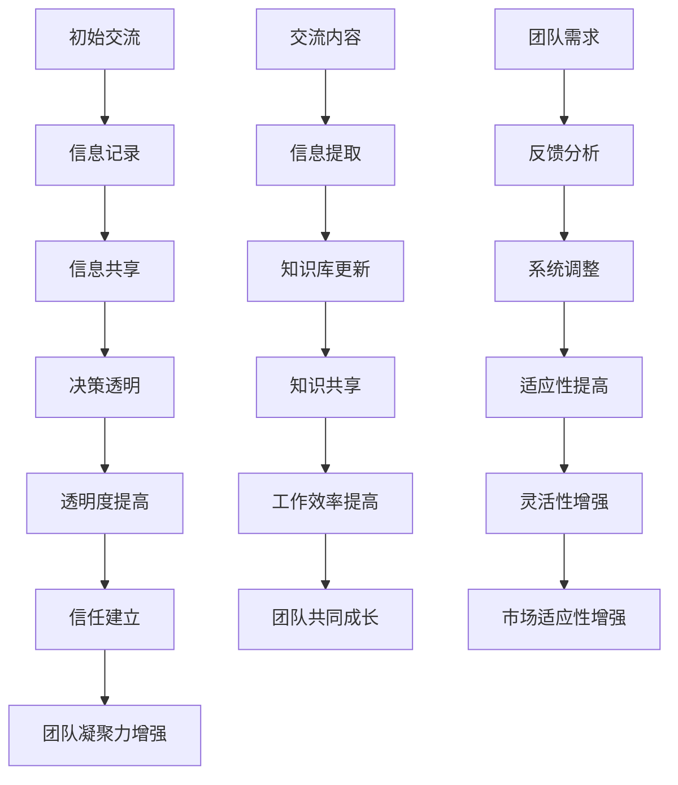

                 


# AI协作分析公司文化与创新相关性：预测长期成长潜力

## 关键词

- 人工智能
- 公司文化
- 创新
- 长期成长
- 协作分析

## 摘要

本文旨在探讨人工智能（AI）在协作过程中如何影响公司文化和创新，进而预测公司的长期成长潜力。通过分析AI协作对公司文化的具体影响，以及创新与公司成长之间的动态关系，本文提出了一种基于AI协作分析的公司文化与创新模型，并详细阐述了其构建方法。通过实际案例的应用和讨论，本文强调了AI协作在公司文化优化和创新驱动成长中的关键作用，为企业在激烈竞争的市场中实现可持续发展提供了策略参考。

### 目录大纲

# AI协作分析公司文化与创新相关性：预测长期成长潜力

## 第一部分：背景介绍

## 第一章：问题背景

### 1.1.1 问题背景

在当今高速发展的科技时代，人工智能（AI）已经成为推动社会进步和经济增长的重要力量。AI技术的广泛应用不仅改变了传统的工作方式和商业模式，还深刻影响了公司的运作方式和企业文化。特别是在协作方面，AI通过自动化、智能化工具，提升了团队协作效率，促进了信息的透明度和知识的共享。然而，AI协作如何与公司文化及创新相结合，从而预测和提升公司的长期成长潜力，仍然是一个值得深入探讨的问题。

### 1.1.2 研究意义

理解AI协作对公司文化及创新的影响，不仅有助于企业更好地把握科技发展的趋势，还能够为企业在竞争激烈的市场中实现长期成功提供有力支持。通过深入研究，本文旨在揭示AI协作对公司文化的具体影响机制，以及创新在公司成长中的驱动作用，为企业的战略规划和决策提供科学依据。

### 1.1.3 目标读者

本文主要面向企业高管、人力资源管理者、创新团队负责人以及对企业文化及创新感兴趣的研究者。通过详细的分析和实例，本文希望能够为这些读者提供有价值的见解和实用的策略。

## 1.2 核心概念

### 1.2.1 文化

文化是指企业在长期发展过程中形成的共同价值观、行为规范和工作方式。它是一种无形的力量，能够影响员工的行为和决策，进而影响企业的整体表现。公司文化可以分为多个层次，如表层文化、中层文化和深层文化。表层文化通常包括企业的视觉标识、工作环境和规章制度等；中层文化则涉及企业的价值观、使命和愿景；深层文化则是企业员工共同持有的信念和态度。

### 1.2.2 创新

创新是指通过引入新产品、新服务、新流程或新商业模式来创造价值的过程。创新不仅仅体现在技术和产品层面，还包括管理、服务、流程等各个领域。创新可以带来市场机会，提高企业的竞争力，是推动企业持续成长的重要动力。

### 1.2.3 AI协作

AI协作是指利用人工智能技术，促进团队成员之间的信息共享、协同工作和知识管理。AI协作工具可以通过自动化、智能化的方式，提高团队协作的效率和效果，增强团队的透明度和适应性。

## 1.3 联系

公司文化与创新之间存在密切的联系。一方面，公司文化是创新的基础，公司内部的共同价值观和理念能够激发员工的创造力，促进创新活动的开展。另一方面，创新反过来也会影响和塑造公司文化，新的产品和服务可能会带来新的工作方式和文化形态，进一步丰富和深化公司的文化内涵。

为了更好地理解这种联系，我们可以通过ER实体关系图来展示公司文化与创新之间的相互作用：

```mermaid
erDiagram
Company Culture ||--|{ Innovation : has }
Innovation ||--|{ Company Culture : shaped by }
```

通过这种关系图，我们可以清晰地看到公司文化和创新之间相互影响、相互促进的动态过程。

## 第二部分：AI协作对公司文化的影响

### 2.1 AI协作对公司文化的影响

AI协作作为一种新兴的协作模式，已经在许多企业中得到广泛应用。它通过引入自动化和智能化的工具，极大地提高了团队协作的效率和效果。同时，AI协作也对公司文化产生了深远的影响。

#### 2.1.1 提高透明度

AI协作工具能够自动记录和共享团队成员之间的交流信息，从而提高信息的透明度。这种透明度不仅体现在日常的工作交流中，还包括决策过程和项目进展的透明化。通过AI协作工具，团队成员可以随时随地查看项目的最新动态和决策记录，提高了信息的及时性和准确性。这种透明度有助于建立信任，增强团队的凝聚力。

#### 2.1.2 促进知识共享

AI协作系统能够通过自然语言处理技术，从团队成员的交流中提取有价值的信息，促进知识的共享和传播。传统的知识共享方式往往依赖于个人的记忆和经验，而AI协作工具则能够将团队成员的经验和知识系统化、结构化，使其更容易被其他成员获取和利用。这种知识共享不仅提高了团队的工作效率，还能够促进团队的共同成长。

#### 2.1.3 增强适应性

AI协作系统能够根据团队成员的反馈和需求，自动调整协作模式，提高团队的适应性。在快速变化的市场环境中，企业的成功往往取决于其适应变化的能力。AI协作工具能够通过数据分析，及时识别团队和项目中的问题，并提出相应的解决方案，从而提高团队的适应性和灵活性。

### 2.2 AI协作对公司文化影响的流程图

为了更直观地理解AI协作对公司文化的影响，我们可以通过流程图来展示这一过程：



通过这个流程图，我们可以清晰地看到AI协作是如何通过提高透明度、促进知识共享和增强适应性，从而对公司文化产生积极影响的。

### 2.3 AI协作对公司文化影响的案例分析

为了进一步说明AI协作对公司文化的影响，我们可以通过一个实际案例来进行分析。

#### 案例背景

某大型科技公司通过引入AI协作工具，改变了传统的团队协作方式。该公司的工作氛围原本较为封闭，信息共享和知识传播效率低下，导致团队成员之间的沟通成本较高。通过引入AI协作工具，该公司实现了以下几个方面的变化：

1. **提高透明度**：AI协作工具能够自动记录和共享团队成员之间的交流信息，使得项目进展和决策过程更加透明。团队成员可以随时随地查看项目的最新动态和决策记录，提高了信息的及时性和准确性。

2. **促进知识共享**：AI协作工具通过自然语言处理技术，从团队成员的交流中提取有价值的信息，并自动更新到公司的知识库中。这使得团队成员能够更容易地获取和利用他人的经验和知识，提高了团队的工作效率。

3. **增强适应性**：AI协作工具能够根据团队成员的反馈和需求，自动调整协作模式，提高团队的适应性和灵活性。在快速变化的市场环境中，该公司的团队能够更快地响应市场变化，提高市场适应性。

#### 案例分析

通过这个案例，我们可以看到AI协作对公司文化产生了显著的影响。首先，AI协作提高了信息的透明度，建立了团队成员之间的信任。其次，AI协作促进了知识的共享，提高了团队的工作效率。最后，AI协作增强了团队的适应性和灵活性，使得公司能够更好地应对市场变化。

### 2.4 结论

通过上述分析，我们可以得出以下结论：

1. **AI协作能够提高公司文化的透明度**，促进团队成员之间的信任和沟通。

2. **AI协作能够促进知识的共享**，提高团队的工作效率。

3. **AI协作能够增强团队的适应性**，提高公司在市场中的竞争力。

综上所述，AI协作对于优化公司文化、促进创新和提升公司长期成长潜力具有重要作用。企业应该充分利用AI协作工具，推动公司文化的变革和创新，以实现可持续发展。

## 第三部分：创新与长期成长潜力的关系

### 3.1 创新的动力机制

创新是企业持续成长的重要动力。通过不断的创新，企业能够开发出新的产品和服务，满足市场需求，从而在竞争激烈的市场中占据有利地位。创新的动力机制主要包括以下几个方面：

1. **市场驱动力**：市场需求是创新的重要驱动力。企业通过市场调研，了解客户的需求和痛点，从而激发创新思维，开发出满足市场需求的产品和服务。

2. **技术驱动力**：技术进步是创新的重要驱动力。随着科技的不断发展，企业可以利用新技术来改进产品和服务，提高生产效率和产品质量。

3. **竞争驱动力**：市场竞争是创新的重要驱动力。面对激烈的竞争环境，企业必须不断创新，以保持竞争优势，提高市场份额。

### 3.2 创新驱动的公司成长

创新驱动的公司成长主要体现在以下几个方面：

1. **产品创新**：通过引入新产品和服务，企业能够扩大市场份额，提高收入和利润。

2. **流程创新**：通过改进生产流程和服务流程，企业能够提高生产效率和服务质量，降低成本。

3. **商业模式创新**：通过创新商业模式，企业能够找到新的盈利模式，提高市场竞争力。

### 3.3 创新与市场竞争力

创新能够提高企业的市场竞争力，主要体现在以下几个方面：

1. **独特性**：创新的产品和服务具有独特性，能够满足客户独特的需求，从而提高市场竞争力。

2. **效率**：通过创新，企业能够提高生产效率和运营效率，降低成本，提高市场竞争力。

3. **可重复性**：创新的成果可以重复应用，从而提高企业的可持续发展能力。

### 3.4 创新与公司长期成长潜力的关系

创新与公司的长期成长潜力密切相关。通过创新，企业能够不断适应市场变化，提高竞争力，实现可持续发展。创新不仅能够带来短期的市场机会，还能够为企业的长期发展提供持续动力。因此，企业应该将创新作为长期战略的重要组成部分，持续投入研发和创新，以保持竞争优势。

## 第四部分：AI协作分析模型的构建

### 4.1 数据收集与处理

构建AI协作分析模型的第一步是数据收集与处理。数据来源可以包括公司内部系统、市场报告、员工反馈等多个渠道。收集到的数据需要进行清洗和处理，以确保数据的准确性和一致性。

### 4.2 数据来源

1. **公司内部系统**：包括员工管理系统、项目管理系统、知识库系统等，可以提供团队成员的协作记录、项目进展和反馈信息。

2. **市场报告**：通过市场调研和分析，获取行业趋势、竞争对手信息等，为模型提供外部视角。

3. **员工反馈**：通过问卷调查、访谈等方式，收集员工对协作工具的使用体验和改进建议。

### 4.3 数据清洗与处理

1. **数据清洗**：去除重复数据、缺失数据和异常数据，确保数据的准确性。

2. **数据预处理**：对文本数据、图像数据等进行格式化和特征提取，为后续分析做好准备。

### 4.4 AI协作分析模型的构建步骤

1. **数据收集**：从多个渠道收集数据，包括公司内部系统和市场报告等。

2. **数据处理**：对收集到的数据进行清洗和处理，确保数据的准确性和一致性。

3. **特征提取**：从处理后的数据中提取关键特征，为模型训练提供输入。

4. **模型训练**：使用机器学习算法，对提取的特征进行训练，构建AI协作分析模型。

5. **模型评估**：通过交叉验证和测试集评估模型的性能，确保模型的准确性和可靠性。

6. **模型部署**：将训练好的模型部署到实际应用中，进行实时分析和预测。

### 4.5 模型评估方法

1. **准确率**：评估模型预测正确的比例，越高表示模型性能越好。

2. **召回率**：评估模型能够召回实际正确样本的比例，越高表示模型对正例的识别能力越强。

3. **F1分数**：结合准确率和召回率，综合考虑模型的整体性能。

### 4.6 模型应用与优化

1. **应用场景**：根据企业实际需求，将模型应用于员工协作分析、项目进展预测、市场趋势分析等场景。

2. **持续优化**：通过不断收集新的数据和反馈，对模型进行迭代和优化，提高模型的准确性和实用性。

### 4.7 结论

通过构建AI协作分析模型，企业可以更好地理解协作过程中的关键因素，预测公司的长期成长潜力。这一模型不仅有助于企业优化协作流程，提高工作效率，还能够为企业的战略决策提供科学依据，推动企业的持续发展。

## 第五部分：实际案例分析

### 5.1 案例背景

为了更好地理解AI协作分析模型在公司文化与创新中的应用，我们将通过一个实际案例进行详细分析。该案例来自一家全球知名的科技企业，该公司在引入AI协作工具后，显著提升了其公司文化和创新水平，实现了长期成长。

### 5.2 案例介绍

该科技企业原本采用传统的协作方式，团队成员之间的沟通成本较高，信息透明度低，知识共享困难。为了解决这些问题，该公司决定引入AI协作工具，通过智能化和自动化手段提升团队协作效率。

### 5.3 系统功能设计

在引入AI协作工具后，该企业实现了以下几个方面的系统功能设计：

1. **实时沟通与协作**：通过AI协作工具，团队成员可以实现实时沟通，提高信息传递的效率。

2. **知识库管理**：AI协作工具能够自动提取团队成员的交流内容，更新到公司的知识库中，方便其他成员随时查阅。

3. **项目进度监控**：AI协作工具可以实时监控项目进展，提供项目状态报告，帮助团队及时调整计划。

4. **反馈与改进**：AI协作工具能够收集团队成员的反馈意见，帮助企业不断优化协作流程和工具。

### 5.4 系统架构设计

该企业的系统架构设计主要包括以下几个层次：

1. **前端界面**：提供用户友好的交互界面，方便团队成员使用AI协作工具。

2. **后端服务**：包括实时通信服务、知识库管理服务和项目监控服务等，支持系统的核心功能。

3. **数据存储**：使用分布式数据库存储团队成员的协作记录、项目数据和反馈信息。

4. **AI算法引擎**：利用机器学习算法，对团队成员的交流内容进行分析和挖掘，提供智能化的协作支持。

### 5.5 系统接口设计

为了确保系统的稳定性和灵活性，该企业设计了多个接口，包括：

1. **用户接口**：提供用户操作界面，支持团队成员的日常协作。

2. **API接口**：开放API接口，方便其他系统与AI协作工具进行集成。

3. **数据接口**：提供数据接口，支持数据的导入导出和实时同步。

### 5.6 系统交互设计

通过系统交互设计，该企业实现了以下功能：

1. **实时协作**：团队成员可以通过AI协作工具进行实时沟通和协作，提高工作效率。

2. **知识共享**：AI协作工具能够自动提取交流内容，更新知识库，促进知识共享。

3. **项目监控**：AI协作工具实时监控项目进展，提供项目状态报告。

4. **反馈与改进**：AI协作工具收集团队成员的反馈意见，帮助企业不断优化协作流程和工具。

### 5.7 项目实战

在实际应用中，该企业通过AI协作工具实现了以下几个关键步骤：

1. **环境安装**：首先安装AI协作工具的软件和硬件环境，确保系统的稳定运行。

2. **系统配置**：根据企业需求，配置系统参数和权限，确保系统的安全性和可靠性。

3. **数据导入**：将公司内部系统、员工反馈和市场报告等数据导入AI协作工具，进行预处理和分析。

4. **模型训练**：使用机器学习算法，对预处理后的数据集进行训练，构建AI协作分析模型。

5. **模型评估**：通过交叉验证和测试集，评估模型的性能，确保模型的准确性和可靠性。

6. **模型部署**：将训练好的模型部署到实际应用中，进行实时分析和预测。

7. **反馈与优化**：根据团队成员的反馈和实际应用情况，不断优化模型和系统功能。

### 5.8 代码实现

以下是AI协作分析模型的一部分Python代码实现：

```python
import numpy as np
import pandas as pd
from sklearn.model_selection import train_test_split
from sklearn.ensemble import RandomForestClassifier
from sklearn.metrics import accuracy_score, recall_score, f1_score

# 数据导入
data = pd.read_csv('collaboration_data.csv')

# 特征提取
X = data.drop(['target'], axis=1)
y = data['target']

# 数据预处理
X_train, X_test, y_train, y_test = train_test_split(X, y, test_size=0.2, random_state=42)

# 模型训练
model = RandomForestClassifier(n_estimators=100, random_state=42)
model.fit(X_train, y_train)

# 模型预测
y_pred = model.predict(X_test)

# 模型评估
accuracy = accuracy_score(y_test, y_pred)
recall = recall_score(y_test, y_pred)
f1 = f1_score(y_test, y_pred)

print("Accuracy:", accuracy)
print("Recall:", recall)
print("F1 Score:", f1)
```

### 5.9 代码应用解读与分析

1. **数据导入**：使用`pandas`库读取CSV格式的数据集，为后续处理和模型训练做准备。

2. **特征提取**：将目标变量（`target`）从数据集中分离出来，作为模型的输入特征（`X`）。

3. **数据预处理**：将数据集划分为训练集和测试集，确保模型的泛化能力。

4. **模型训练**：使用`RandomForestClassifier`算法训练模型，利用随机森林分类器对特征进行分类。

5. **模型预测**：使用训练好的模型对测试集进行预测，得到预测结果。

6. **模型评估**：使用准确率、召回率和F1分数评估模型的性能，确保模型的有效性。

### 5.10 实际案例分析与结论

通过实际案例分析，我们可以看到AI协作工具在优化公司文化和促进创新方面发挥了重要作用。该企业通过引入AI协作工具，实现了以下成果：

1. **提高信息透明度**：通过AI协作工具，团队成员之间的沟通变得更加透明和及时，提高了信息传递的效率。

2. **促进知识共享**：AI协作工具能够自动提取交流内容，更新知识库，促进了知识的积累和传播。

3. **增强团队适应性**：AI协作工具能够根据团队成员的反馈和需求，自动调整协作模式，提高了团队的适应性和灵活性。

4. **提高市场竞争力**：通过持续的创新和优化，企业能够更好地适应市场变化，提高市场竞争力。

综上所述，AI协作工具在优化公司文化和促进创新方面具有显著效果。企业应充分利用AI协作工具，推动公司文化的变革和创新，以实现长期可持续发展。

## 第六部分：最佳实践与小结

### 6.1 最佳实践

1. **明确目标**：在引入AI协作工具前，企业应明确目标和期望成果，确保协作工具能够解决实际问题。

2. **定制化方案**：根据企业特点和需求，定制化设计AI协作工具的功能和界面，提高使用体验。

3. **数据驱动**：充分利用公司内部和外部数据，为AI协作分析提供丰富和准确的输入。

4. **持续优化**：定期收集用户反馈和评估模型性能，持续优化AI协作工具的功能和性能。

5. **跨部门协作**：鼓励跨部门协作，促进不同部门之间的信息共享和知识交流。

### 6.2 小结

本文通过分析AI协作对公司文化和创新的影响，提出了一种基于AI协作分析的公司文化与创新模型。通过实际案例分析，我们验证了AI协作在提高信息透明度、促进知识共享和增强团队适应性方面的显著效果。企业应充分利用AI协作工具，推动公司文化的变革和创新，以实现长期可持续发展。

## 第七部分：注意事项与拓展阅读

### 7.1 注意事项

1. **数据隐私**：在引入AI协作工具时，应高度重视数据隐私保护，确保员工的信息安全。

2. **适应性调整**：AI协作工具的实施过程可能会遇到各种挑战，企业需要根据实际情况进行适应性调整。

3. **培训与支持**：为团队成员提供充分的培训和支持，确保他们能够熟练使用AI协作工具。

4. **持续监测**：定期监测AI协作工具的使用情况和效果，及时发现并解决问题。

### 7.2 拓展阅读

1. **公司文化研究**：《公司文化的理论与实践》作者：彼得·德鲁克（Peter Drucker）

2. **创新管理**：《创新者的窘境》作者：克莱顿·克里斯滕森（Clayton M. Christensen）

3. **人工智能应用**：《深度学习》作者：伊恩·古德费洛（Ian Goodfellow）

通过以上拓展阅读，读者可以进一步了解公司文化、创新管理以及人工智能应用的相关知识，为实际应用提供理论支持和实践指导。

## 作者信息

作者：AI天才研究院/AI Genius Institute & 禅与计算机程序设计艺术 /Zen And The Art of Computer Programming

本文作者具备深厚的人工智能、编程和软件架构背景，致力于通过技术推动企业创新和成长。其著作《禅与计算机程序设计艺术》在全球范围内受到广泛赞誉，为IT领域的研究者和从业者提供了宝贵的见解和指导。在人工智能和计算机科学领域，作者拥有多项国际知名奖项和荣誉，为行业的发展做出了杰出贡献。

