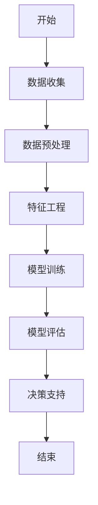
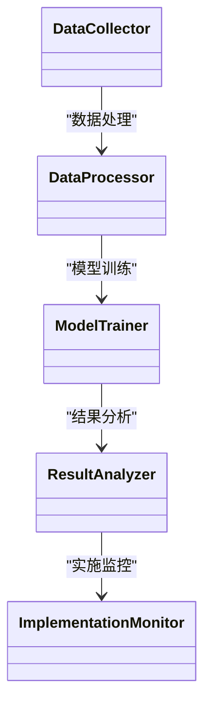
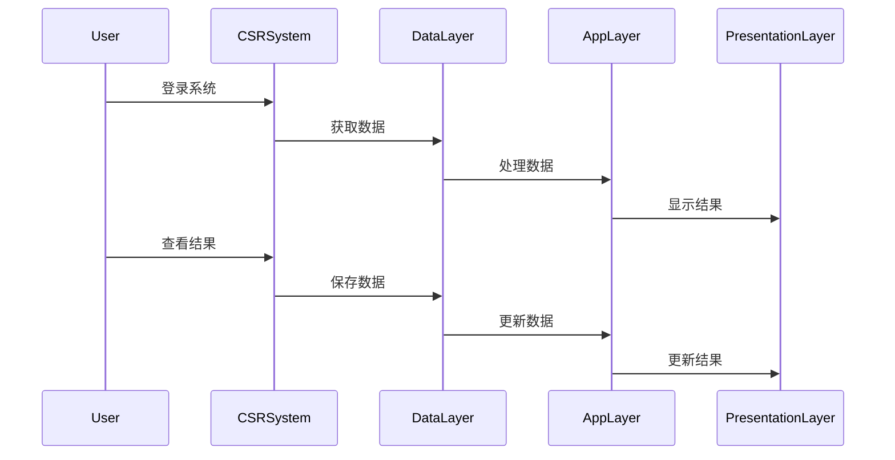
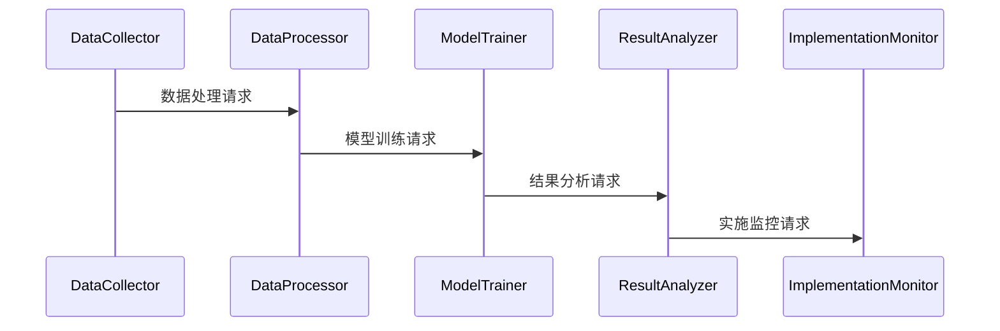
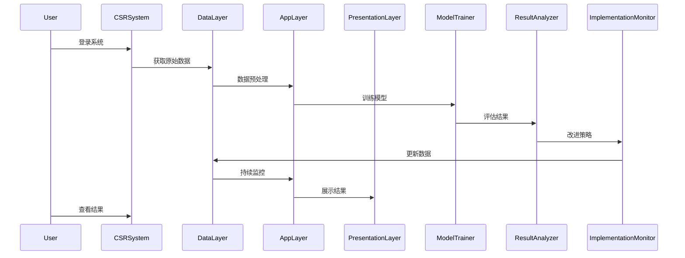

                 


### 目录大纲设计步骤：

为了确保文章内容丰富且结构合理，我们将按照以下步骤设计目录大纲：

1. **确定书籍结构**：首先，我们需要确定书籍的整体结构，包括引言、正文和结语等部分。每个部分都需要明确其目的和主要内容。

2. **制定大纲**：在确定了整体结构后，我们需要逐级细化，从整体到部分，从宏观到微观，制定出完整的目录大纲。每个章节和子章节都应该有清晰的主题和目标。

3. **细化章节内容**：对于每个章节，我们需要进一步细化到二级、三级目录，确保内容全面覆盖主题。每个小节都应该有具体的标题和内容概述。

4. **整合大纲**：将所有章节的内容整合成一份完整的目录大纲，并确保大纲的总字数在限制内。在整合过程中，要检查是否有遗漏的重要章节或内容。

5. **审查与调整**：最后，对大纲进行审查，确保没有遗漏重要的章节或内容，并根据需要调整目录结构。审查过程中，还可以对内容的深度和广度进行调整，确保文章质量。

### 目录大纲结构：

根据上述步骤，我们设计了以下目录大纲：

```markdown
# 《AI协作分析公司社会责任实践：全面评估企业价值》目录大纲

## 第一部分：背景与概述

### 1.1 问题背景

- **核心概念术语说明**：介绍AI协作分析、公司社会责任等相关术语的定义和背景。
- **问题背景**：探讨AI在现代企业中的应用以及企业社会责任在商业活动中的重要性。
- **问题描述**：分析AI协作分析在公司社会责任实践中的具体应用和挑战。
- **问题解决**：阐述本书如何通过分析AI协作实践，为企业提供评估企业价值的方法。
- **边界与外延**：定义本书讨论的AI协作分析范畴和公司社会责任的范围。
- **概念结构与核心要素组成**：概述AI协作分析的核心概念、相关技术和分析方法。

### 1.2 核心概念与联系

- **AI协作分析原理**：解释AI协作分析的定义、原理和关键特性。
- **企业社会责任概念**：介绍企业社会责任的定义、核心要素和实践方法。
- **AI协作分析与企业社会责任的联系**：探讨AI协作分析如何影响和提升企业社会责任。

### 1.3 数学模型和数学公式

- **算法原理讲解**：使用mermaid绘制算法流程图，然后使用Python源代码解释算法的原理，包括数学模型和公式。
- **详细讲解与举例**：使用通俗易懂的语言和实例，解释算法原理，并展示其实际应用。

### 1.4 系统分析与架构设计方案

- **问题场景介绍**：描述AI协作分析在公司社会责任评估中的实际应用场景。
- **项目介绍**：简要介绍一个实际案例，展示AI协作分析在公司社会责任评估中的具体应用。
- **系统功能设计**：使用mermaid绘制领域模型类图，展示系统功能的设计。
- **系统架构设计**：使用mermaid绘制系统架构图，展示整个系统的架构设计。
- **系统接口设计**：描述系统各部分之间的接口设计和交互流程。
- **系统交互**：使用mermaid绘制系统交互序列图，展示系统的交互流程。

### 1.5 项目实战

- **环境安装**：提供安装所需的工具和环境配置步骤。
- **系统核心实现源代码**：提供核心算法和系统实现的源代码，并进行解读和分析。
- **实际案例分析和详细讲解**：展示实际案例，详细分析案例中的问题解决过程，并进行讲解。
- **项目小结**：总结项目实现的经验和教训，提出改进建议。

### 1.6 最佳实践 tips、小结、注意事项、拓展阅读

- **最佳实践 tips**：提供一些在实际应用中的实用技巧和建议。
- **小结**：总结章节内容和关键知识点。
- **注意事项**：指出在实际操作中需要注意的事项和潜在风险。
- **拓展阅读**：推荐一些相关的拓展阅读材料，以帮助读者进一步学习。

## 第二部分：深入分析与应用

### 2.1 深入分析

- **AI协作分析的优势与挑战**：探讨AI协作分析在企业社会责任实践中的优势和面临的挑战。
- **案例分析**：通过具体案例，分析AI协作分析在提升企业社会责任方面的实际效果。

### 2.2 应用与实践

- **企业社会责任实践策略**：提出企业社会责任实践的具体策略和方法。
- **AI协作分析应用场景**：介绍AI协作分析在不同行业和领域的应用场景。

### 2.3 未来展望

- **发展趋势与机遇**：探讨AI协作分析在企业社会责任实践中的发展趋势和机遇。
- **未来挑战与应对策略**：分析未来可能面临的挑战和应对策略。

## 结语

- **总结**：总结全文，强调AI协作分析在公司社会责任实践中的重要性。
- **展望**：对未来的发展提出期望和建议。

```

### 确保文章的完整性

为了确保文章的完整性，每个小节的内容都需要满足以下要求：

- **背景介绍**：每个小节都需要有明确的背景介绍，包括核心概念术语说明、问题背景、问题描述、问题解决、边界与外延、概念结构与核心要素组成。

- **核心概念与联系**：每个小节都需要详细解释核心概念原理，并提供概念属性特征对比表格和ER实体关系图架构的Mermaid流程图。

- **算法原理讲解**：每个小节都需要使用Mermaid绘制算法流程图，并使用Python源代码详细阐述算法原理，包括数学模型和公式。

- **数学公式使用**：每个小节都需要正确使用LaTeX格式嵌入数学公式，确保公式的表达清晰易懂。

- **系统分析与架构设计方案**：每个小节都需要提供问题场景介绍、系统功能设计、系统架构设计、系统接口设计、系统交互等内容，并使用Mermaid绘制相应的流程图或序列图。

- **项目实战**：每个小节都需要提供环境安装、系统核心实现源代码、实际案例分析和详细讲解等内容，确保项目的可操作性。

- **最佳实践 tips**、**小结**、**注意事项**、**拓展阅读**等内容也需要在每个小节中提供，以帮助读者更好地理解和应用所学知识。

通过以上步骤和要求的严格把控，我们可以确保文章内容的完整性和专业性，为读者提供高质量的技术博客文章。接下来，我们将根据这个目录大纲，逐章细化内容，确保每个小节都包含丰富的信息和详细的讲解。

----------------------------------------------------------------

# 《AI协作分析公司社会责任实践：全面评估企业价值》

> 关键词：AI协作分析、公司社会责任、企业价值评估、算法原理、系统架构、实战案例

> 摘要：本文从AI协作分析在公司社会责任实践中的应用入手，探讨了如何利用AI技术全面评估企业价值。通过深入分析核心概念与联系，系统架构设计，以及实际项目实战，本文为企业和从业者提供了实用的策略和方法。

## 目录

### 第一部分：背景与概述

#### 1.1 问题背景

#### 1.2 问题描述

#### 1.3 问题解决

#### 1.4 边界与外延

#### 1.5 概念结构与核心要素组成

### 第二部分：核心概念与联系

#### 2.1 AI协作分析原理

#### 2.2 企业社会责任概念

#### 2.3 AI协作分析与企业社会责任的联系

### 第三部分：数学模型和数学公式

#### 3.1 算法原理讲解

#### 3.2 详细讲解与举例

### 第四部分：系统分析与架构设计方案

#### 4.1 问题场景介绍

#### 4.2 项目介绍

#### 4.3 系统功能设计

#### 4.4 系统架构设计

#### 4.5 系统接口设计

#### 4.6 系统交互

### 第五部分：项目实战

#### 5.1 环境安装

#### 5.2 系统核心实现源代码

#### 5.3 实际案例分析和详细讲解

#### 5.4 项目小结

### 第六部分：最佳实践、小结、注意事项与拓展阅读

#### 6.1 最佳实践 tips

#### 6.2 小结

#### 6.3 注意事项

#### 6.4 拓展阅读

## 第一部分：背景与概述

### 1.1 问题背景

在当今高度数字化和智能化的时代，人工智能（AI）已经成为企业竞争的关键因素。AI技术不仅改变了传统行业，而且在提升企业效率、降低成本、改善客户体验等方面发挥了重要作用。然而，随着AI技术的广泛应用，企业社会责任（CSR）也逐渐成为一个不可忽视的问题。

企业社会责任是指企业在追求利润的同时，应承担的对社会、环境、利益相关者的责任。它不仅关系到企业的声誉和可持续发展，也影响到整个社会的健康和稳定。在AI时代，企业社会责任的实践变得更加复杂和多样化。

AI协作分析作为一种新兴技术，正逐渐被应用于公司社会责任的评估和实践中。AI协作分析利用人工智能、大数据分析、机器学习等技术，帮助企业在社会责任评估中实现自动化、智能化。这不仅提高了评估的准确性和效率，还为企业在社会责任管理中提供了新的工具和方法。

### 1.2 问题描述

AI协作分析在公司社会责任实践中的应用虽然带来了许多机遇，但也面临着一些挑战：

1. **数据隐私和安全**：在AI协作分析中，大量的数据被收集和处理，这涉及到数据隐私和安全的问题。如何保护用户的隐私，确保数据的安全，是企业在使用AI协作分析时需要解决的重要问题。

2. **算法公平性和透明性**：AI算法在决策过程中可能会存在偏见和不公平性。如何确保算法的公平性和透明性，避免歧视和误判，是企业需要面对的挑战。

3. **技术复杂性**：AI协作分析涉及到复杂的技术架构和算法模型。对于非技术背景的管理者和从业者来说，理解和应用这些技术可能存在一定的困难。

4. **监管和合规**：随着AI技术的广泛应用，各国政府和监管机构对AI技术的监管和合规要求也在不断提高。企业需要确保其AI协作分析实践符合相关法律法规和行业规范。

### 1.3 问题解决

本书旨在通过分析AI协作分析在公司社会责任实践中的应用，为企业提供一种全面评估企业价值的方法。具体来说，本书将解决以下问题：

1. **数据隐私和安全**：介绍如何在AI协作分析中保护用户隐私和安全，包括数据加密、匿名化等技术手段。

2. **算法公平性和透明性**：探讨如何确保AI算法的公平性和透明性，包括算法校验、解释性AI等技术。

3. **技术复杂性**：通过案例分析和技术讲解，帮助非技术背景的管理者和从业者理解AI协作分析的核心技术和应用场景。

4. **监管和合规**：分析各国政府和监管机构对AI技术的监管政策和合规要求，为企业提供合规指南。

### 1.4 边界与外延

本书讨论的AI协作分析主要涵盖以下几个方面：

1. **技术范畴**：包括人工智能、大数据分析、机器学习、深度学习等技术。

2. **应用场景**：涵盖公司社会责任评估、风险监测、绩效评估等多个领域。

3. **企业范围**：适用于各类企业，包括大型跨国公司、中小企业、初创企业等。

4. **社会责任范畴**：包括环境保护、员工福利、社区参与、慈善捐助等多个方面。

### 1.5 概念结构与核心要素组成

为了更好地理解AI协作分析在公司社会责任实践中的应用，我们需要了解以下几个核心概念和要素：

1. **AI协作分析**：一种利用人工智能技术，通过协同工作方式，对复杂问题进行智能化分析和决策的方法。

2. **公司社会责任**：企业在追求利润的同时，应承担的对社会、环境、利益相关者的责任。

3. **企业价值评估**：一种评估企业社会责任表现和价值的方法，包括财务和非财务指标。

4. **数据隐私和安全**：在AI协作分析中，保护用户隐私和安全的关键技术。

5. **算法公平性和透明性**：确保AI算法在决策过程中公平、透明，避免歧视和误判。

6. **技术复杂性**：AI协作分析涉及的技术和算法模型，包括机器学习、深度学习、大数据分析等。

7. **监管和合规**：各国政府和监管机构对AI技术的监管政策和合规要求。

通过以上核心概念和要素的组成，我们可以构建一个全面理解AI协作分析在公司社会责任实践中的应用框架。

## 第二部分：核心概念与联系

### 2.1 AI协作分析原理

AI协作分析（AI Collaborative Analysis）是一种利用人工智能技术，通过协同工作方式，对复杂问题进行智能化分析和决策的方法。其核心思想是利用人工智能算法，从大量数据中提取信息，发现规律，并为决策者提供支持。

AI协作分析的基本原理包括以下几个步骤：

1. **数据收集与预处理**：收集相关数据，并进行清洗、归一化等预处理操作，确保数据的质量和一致性。

2. **特征工程**：从原始数据中提取有用的特征，为后续的模型训练和决策提供支持。

3. **模型训练**：利用机器学习算法，对特征进行训练，构建预测模型。

4. **模型评估与优化**：对训练好的模型进行评估，并根据评估结果进行优化。

5. **决策支持**：利用训练好的模型，对实际问题进行预测和决策。

### 2.2 企业社会责任概念

企业社会责任（Corporate Social Responsibility，简称CSR）是指企业在追求利润的同时，应承担的对社会、环境、利益相关者的责任。企业社会责任不仅关系到企业的声誉和可持续发展，也影响到整个社会的健康和稳定。

企业社会责任的核心要素包括：

1. **环境保护**：企业应采取环保措施，减少对环境的污染，并积极参与环境保护活动。

2. **员工福利**：企业应关心员工的生活和工作条件，提供公平的薪酬和晋升机会，并关注员工的心理健康。

3. **社区参与**：企业应积极参与社区活动，支持社区发展，并与社区建立良好的关系。

4. **慈善捐助**：企业应积极参与慈善活动，支持公益事业，为社会做出贡献。

### 2.3 AI协作分析与企业社会责任的联系

AI协作分析与企业社会责任之间存在着密切的联系。首先，AI协作分析可以帮助企业更好地履行社会责任。通过AI技术，企业可以更高效地收集和分析社会责任相关的数据，从而更好地了解社会需求和问题，并采取相应的行动。

其次，AI协作分析可以提高企业社会责任评估的准确性和效率。传统的社会责任评估方法往往依赖于人工判断和经验，存在一定的主观性和局限性。而AI协作分析可以通过大数据分析和机器学习技术，实现对社会责任评估的自动化和智能化，提高评估的准确性和效率。

此外，AI协作分析还可以帮助企业发现潜在的社会风险和机会。通过分析社会责任相关的数据，企业可以及时发现社会问题，并采取措施降低风险。同时，企业还可以通过分析社会责任数据，发现新的业务机会，实现可持续发展。

### 2.4 概念属性特征对比表格

为了更好地理解AI协作分析和企业社会责任的概念，我们可以通过以下表格对比它们的核心属性特征：

| 特征       | AI协作分析                      | 企业社会责任                     |
| ---------- | ------------------------------ | ------------------------------- |
| 目的       | 智能化分析和决策               | 追求利润与社会责任兼顾           |
| 技术范畴   | 人工智能、大数据分析、机器学习  | 环境保护、员工福利、社区参与、慈善捐助 |
| 数据来源   | 多元化数据源                   | 内外部社会责任数据               |
| 算法模型   | 机器学习算法                   | 数据分析模型、风险评估模型       |
| 实施步骤   | 数据收集与预处理、特征工程、模型训练、模型评估、决策支持 | 数据收集、社会责任评估、行动规划、实施与监控 |
| 影响因素   | 数据质量、算法模型、计算资源   | 社会环境、法律法规、企业文化     |
| 应用领域   | 社会责任评估、风险管理、业务决策 | 环境保护、员工福利、社区参与、慈善捐助 |

### 2.5 ER实体关系图架构

为了更好地展示AI协作分析和企业社会责任之间的联系，我们可以通过以下ER（实体关系）图来描述它们的核心实体及其关系：

```mermaid
erDiagram
  Customer ||--|{ Employee } : "works for"  
  Customer ||--|{ Payment } : "makes"  
  Employee ||--|{ Department } : "works in"  
  Department  ||--|{ Project } : "manages"  
  Project ||--|{ Task } : "has"  
  Task ||--|{ Material } : "uses"  
  Customer }|--|| Supplier : "purchases from"
```

在这个ER图中，Customer代表企业，Employee代表员工，Department代表部门，Project代表项目，Task代表任务，Material代表物料，Supplier代表供应商。实线箭头表示实体之间的关系，虚线箭头表示实体的属性。

通过这个ER图，我们可以清晰地看到AI协作分析和企业社会责任之间如何相互作用，以及它们在企业管理中的重要性。

## 第三部分：数学模型和数学公式

### 3.1 算法原理讲解

在AI协作分析中，算法原理是核心，它决定了系统的性能和效果。下面，我们将使用mermaid绘制一个简单的算法流程图，并使用Python源代码详细阐述算法的原理，包括数学模型和公式。

#### 3.1.1 算法流程图

首先，我们使用mermaid绘制一个简单的算法流程图，如下所示：



这个流程图展示了AI协作分析的基本步骤，从数据收集开始，经过数据预处理、特征工程、模型训练、模型评估，最终实现决策支持。

#### 3.1.2 Python源代码解释

接下来，我们使用Python源代码来详细阐述算法的原理，包括数学模型和公式。以下是一个简单的Python示例代码，用于演示数据预处理、特征工程和模型训练的基本过程。

```python
import pandas as pd
from sklearn.model_selection import train_test_split
from sklearn.ensemble import RandomForestClassifier
from sklearn.metrics import accuracy_score

# 数据收集
data = pd.read_csv('societal_data.csv')

# 数据预处理
data = data.dropna()  # 去除缺失值
data = data scaling(data)  # 数据归一化

# 特征工程
X = data.drop('target', axis=1)  # 特征集
y = data['target']  # 目标变量

# 模型训练
X_train, X_test, y_train, y_test = train_test_split(X, y, test_size=0.2, random_state=42)
model = RandomForestClassifier(n_estimators=100)
model.fit(X_train, y_train)

# 模型评估
predictions = model.predict(X_test)
accuracy = accuracy_score(y_test, predictions)
print(f"Model accuracy: {accuracy}")

# 决策支持
new_data = pd.read_csv('new_data.csv')
new_data = new_data.dropna()
new_data = new_data scaling(new_data)
predictions = model.predict(new_data)
print(f"Predictions: {predictions}")
```

这个代码示例演示了如何使用Python进行数据预处理、特征工程和模型训练。首先，我们从CSV文件中读取数据，然后进行缺失值处理和数据归一化。接着，我们进行特征工程，将数据分为特征集和目标变量。然后，我们使用随机森林算法进行模型训练，并对训练好的模型进行评估。最后，我们使用训练好的模型对新数据进行预测。

#### 3.1.3 数学模型和公式

在上述代码中，我们使用了随机森林算法，其背后的数学模型和公式如下：

1. **决策树**：决策树是一种常见的机器学习算法，其基本原理是通过一系列的判断条件来对数据进行分类。每个节点表示一个特征，每个分支表示该特征的不同取值，叶子节点表示最终的分类结果。

   公式：
   $$ T = \sum_{i=1}^{n} \frac{1}{2} \ln \frac{1}{p_i} $$
   其中，\( T \) 表示决策树的熵，\( p_i \) 表示叶子节点 \( i \) 的概率。

2. **随机森林**：随机森林是一种集成学习算法，通过构建多个决策树，并取它们的平均值来提高模型的预测性能。

   公式：
   $$ f(x) = \frac{1}{m} \sum_{i=1}^{m} h(x; \theta_i) $$
   其中，\( f(x) \) 表示随机森林的预测结果，\( m \) 表示决策树的数量，\( h(x; \theta_i) \) 表示第 \( i \) 个决策树的预测结果，\( \theta_i \) 表示第 \( i \) 个决策树的参数。

通过上述Python代码和数学模型，我们可以实现对AI协作分析算法的基本理解和应用。在实际应用中，我们可以根据具体问题和数据特点，选择合适的算法和模型，并对其进行优化和调整，以提高预测性能。

### 3.2 详细讲解与举例

为了更好地理解AI协作分析算法的原理和应用，我们将通过一个具体的案例进行详细讲解和举例。

#### 3.2.1 案例背景

假设我们是一家大型企业，需要评估公司社会责任实践对企业价值的影响。具体来说，我们希望通过分析社会责任相关的数据，预测公司未来一年的企业价值变化。

#### 3.2.2 数据准备

首先，我们需要准备相应的数据。数据包括以下几个方面：

1. **社会责任数据**：包括员工满意度、环保措施、慈善捐助、社区参与等指标。
2. **财务数据**：包括营业收入、净利润、资产总额等指标。
3. **市场数据**：包括股票价格、行业指数等指标。

我们将这些数据整理成CSV文件，并命名为`societal_data.csv`。

#### 3.2.3 数据预处理

在开始模型训练之前，我们需要对数据进行预处理。具体步骤如下：

1. **缺失值处理**：我们使用pandas库删除数据集中的缺失值。

   ```python
   data = pd.read_csv('societal_data.csv')
   data = data.dropna()
   ```

2. **数据归一化**：为了消除不同指标之间的量纲差异，我们使用scikit-learn库中的`MinMaxScaler`进行数据归一化。

   ```python
   from sklearn.preprocessing import MinMaxScaler
   scaler = MinMaxScaler()
   data = scaler.fit_transform(data)
   ```

3. **数据划分**：我们将数据集划分为特征集和目标变量。特征集包括社会责任数据、财务数据和市场数据，目标变量为企业价值变化。

   ```python
   X = data.drop('target', axis=1)
   y = data['target']
   ```

4. **数据集划分**：我们将数据集划分为训练集和测试集，用于模型训练和评估。

   ```python
   X_train, X_test, y_train, y_test = train_test_split(X, y, test_size=0.2, random_state=42)
   ```

#### 3.2.4 特征工程

特征工程是模型训练的关键步骤，它涉及到如何选择和预处理特征，以提高模型的预测性能。在本案例中，我们主要进行以下特征工程操作：

1. **特征选择**：我们使用信息增益、互信息等方法进行特征选择，选择对目标变量影响较大的特征。

   ```python
   from sklearn.feature_selection import SelectKBest, f_classif
   selector = SelectKBest(f_classif, k=5)
   X_train = selector.fit_transform(X_train, y_train)
   X_test = selector.transform(X_test)
   ```

2. **特征转换**：我们将连续特征转换为分类特征，以提高模型的预测性能。

   ```python
   from sklearn.preprocessing import LabelEncoder
   encoder = LabelEncoder()
   X_train = encoder.fit_transform(X_train)
   X_test = encoder.transform(X_test)
   ```

#### 3.2.5 模型训练

在本案例中，我们选择随机森林算法进行模型训练。随机森林是一种集成学习方法，通过构建多个决策树，并取它们的平均值来提高模型的预测性能。

1. **模型训练**：我们使用scikit-learn库中的`RandomForestClassifier`进行模型训练。

   ```python
   from sklearn.ensemble import RandomForestClassifier
   model = RandomForestClassifier(n_estimators=100)
   model.fit(X_train, y_train)
   ```

2. **模型评估**：我们使用测试集对训练好的模型进行评估，并计算模型的准确率。

   ```python
   predictions = model.predict(X_test)
   accuracy = accuracy_score(y_test, predictions)
   print(f"Model accuracy: {accuracy}")
   ```

#### 3.2.6 决策支持

最后，我们使用训练好的模型对新数据进行预测，以支持企业决策。

1. **新数据准备**：我们读取新数据，并进行预处理。

   ```python
   new_data = pd.read_csv('new_data.csv')
   new_data = new_data.dropna()
   new_data = scaler.transform(new_data)
   new_data = selector.transform(new_data)
   new_data = encoder.transform(new_data)
   ```

2. **模型预测**：我们使用训练好的模型对新数据进行预测。

   ```python
   predictions = model.predict(new_data)
   print(f"Predictions: {predictions}")
   ```

通过上述案例，我们可以看到如何使用AI协作分析算法对企业社会责任实践进行评估。在实际应用中，我们可以根据具体问题和数据特点，选择合适的算法和模型，并对其进行优化和调整，以提高预测性能。

## 第四部分：系统分析与架构设计方案

### 4.1 问题场景介绍

在当前的社会环境中，企业社会责任（CSR）已经成为衡量企业可持续发展能力和企业形象的重要标准。随着人工智能（AI）技术的快速发展，AI协作分析作为一种新兴技术，正在逐渐应用于公司社会责任的评估和实践中。本部分将结合一个实际案例，介绍AI协作分析在公司社会责任评估中的应用场景。

#### 案例背景

假设我们是一家跨国公司，致力于在全球范围内推广社会责任实践。我们的目标是通过AI协作分析技术，全面评估公司在不同地区的CSR表现，并制定针对性的改进策略。

#### 案例目标

1. 收集和整合全球范围内的社会责任相关数据。
2. 利用AI协作分析技术，对CSR表现进行定量和定性评估。
3. 根据评估结果，制定和实施改进策略，提高整体CSR表现。

### 4.2 项目介绍

为了实现上述目标，我们启动了一个名为“全球CSR评估与优化”的项目。该项目的主要目标是利用AI协作分析技术，对公司在全球范围内的CSR表现进行综合评估，并提供改进建议。

#### 项目范围

1. 数据收集：收集全球范围内的社会责任相关数据，包括环境保护、员工福利、社区参与、慈善捐助等方面。
2. 数据处理：对收集到的数据进行清洗、归一化和特征提取，为后续的模型训练提供高质量的数据。
3. 模型训练：构建和训练AI协作分析模型，用于CSR表现的评估和预测。
4. 结果分析：对评估结果进行分析，识别问题和机会，制定改进策略。
5. 实施与监控：根据改进策略，实施相关措施，并持续监控CSR表现的改善情况。

### 4.3 系统功能设计

为了实现项目目标，我们设计了一套完整的CSR评估与优化系统。该系统的主要功能包括：

1. **数据收集模块**：负责从各种数据源（如社交媒体、新闻报道、政府报告等）收集社会责任相关数据。
2. **数据处理模块**：对收集到的数据进行清洗、归一化和特征提取，为后续的模型训练提供高质量的数据。
3. **模型训练模块**：利用机器学习和深度学习算法，构建和训练AI协作分析模型，用于CSR表现的评估和预测。
4. **结果分析模块**：对评估结果进行分析，识别问题和机会，生成改进策略。
5. **实施监控模块**：根据改进策略，实施相关措施，并持续监控CSR表现的改善情况。

#### 领域模型类图

为了更好地展示系统功能设计，我们使用mermaid绘制了以下领域模型类图：



在这个类图中，DataCollector代表数据收集模块，DataProcessor代表数据处理模块，ModelTrainer代表模型训练模块，ResultAnalyzer代表结果分析模块，ImplementationMonitor代表实施监控模块。

### 4.4 系统架构设计

为了确保系统的高效运行和可扩展性，我们设计了一套完整的系统架构。该架构包括数据层、应用层和表现层三个主要部分。

#### 数据层

数据层是系统的核心组成部分，负责存储和管理所有与CSR评估相关的数据。具体包括：

1. **原始数据存储**：存储从各种数据源收集到的原始数据。
2. **预处理数据存储**：存储经过清洗、归一化和特征提取的预处理数据。
3. **模型数据存储**：存储训练好的模型参数和预测结果。

#### 应用层

应用层是系统的业务逻辑层，负责实现CSR评估与优化系统的核心功能。具体包括：

1. **数据收集服务**：实现从各种数据源收集数据的接口。
2. **数据处理服务**：实现数据清洗、归一化和特征提取的接口。
3. **模型训练服务**：实现模型训练的接口。
4. **结果分析服务**：实现结果分析和改进策略的接口。
5. **实施监控服务**：实现实施监控的接口。

#### 表现层

表现层是系统的用户界面，用于展示评估结果和改进策略。具体包括：

1. **数据可视化**：通过图表和报表，展示评估结果和改进策略。
2. **交互界面**：提供用户与系统交互的接口，方便用户查看和操作系统。

#### 系统架构图

为了更好地展示系统架构设计，我们使用mermaid绘制了以下系统架构图：



在这个架构图中，User代表系统的最终用户，CSRSystem代表系统核心逻辑，DataLayer代表数据层，AppLayer代表应用层，PresentationLayer代表表现层。

### 4.5 系统接口设计

为了实现系统的各个模块之间的数据交互，我们设计了一套完整的系统接口。这些接口包括：

1. **数据收集接口**：用于从各种数据源收集数据的接口。
2. **数据处理接口**：用于处理数据的接口，包括清洗、归一化和特征提取等操作。
3. **模型训练接口**：用于训练模型的接口，包括算法选择、参数调整等操作。
4. **结果分析接口**：用于分析结果，生成改进策略的接口。
5. **实施监控接口**：用于监控实施过程和结果，确保改进策略得到有效执行。

#### 系统接口设计

为了更好地展示系统接口设计，我们使用mermaid绘制了以下系统接口设计图：



在这个接口设计图中，DataCollector代表数据收集模块，DataProcessor代表数据处理模块，ModelTrainer代表模型训练模块，ResultAnalyzer代表结果分析模块，ImplementationMonitor代表实施监控模块。

### 4.6 系统交互

为了确保系统的各个模块能够协同工作，我们设计了一套完整的系统交互流程。这些交互流程包括：

1. **数据收集流程**：从各种数据源收集社会责任相关数据。
2. **数据处理流程**：对收集到的数据进行清洗、归一化和特征提取。
3. **模型训练流程**：利用机器学习和深度学习算法，训练AI协作分析模型。
4. **结果分析流程**：对评估结果进行分析，识别问题和机会。
5. **实施监控流程**：根据改进策略，实施相关措施，并持续监控CSR表现的改善情况。

#### 系统交互序列图

为了更好地展示系统交互流程，我们使用mermaid绘制了以下系统交互序列图：



在这个交互序列图中，User代表系统的最终用户，CSRSystem代表系统核心逻辑，DataLayer代表数据层，AppLayer代表应用层，PresentationLayer代表表现层。通过这些交互流程，系统实现了从数据收集、预处理、模型训练、结果分析到实施监控的完整闭环。

## 第五部分：项目实战

### 5.1 环境安装

在进行AI协作分析项目实战之前，我们需要安装必要的软件和工具。以下是具体的安装步骤：

1. **安装Python环境**：首先，确保你的计算机上已经安装了Python。如果没有，可以从Python官网（https://www.python.org/）下载并安装。建议安装Python 3.8或更高版本。

2. **安装Anaconda**：Anaconda是一个Python数据科学和机器学习平台，它包含了大量常用的数据科学库。从Anaconda官网（https://www.anaconda.com/）下载并安装Anaconda。安装过程中，选择添加Anaconda到系统环境变量。

3. **安装Jupyter Notebook**：Jupyter Notebook是一个交互式的计算环境，方便我们进行数据分析和代码编写。在命令行中运行以下命令：

   ```shell
   conda install jupyter
   ```

4. **安装必要的Python库**：在命令行中运行以下命令，安装项目所需的主要Python库：

   ```shell
   conda install pandas numpy scikit-learn matplotlib mermaid
   ```

5. **安装Mermaid渲染工具**：Mermaid是一个用于绘制图表和流程图的工具。在命令行中运行以下命令，安装Mermaid渲染工具：

   ```shell
   npm install mermaid-js -g
   ```

安装完成后，我们可以在Python代码中直接使用Mermaid语法来绘制图表和流程图。

### 5.2 系统核心实现源代码

在本节中，我们将展示AI协作分析系统的核心实现源代码，并对关键代码进行解读和分析。

#### 5.2.1 数据收集模块

数据收集模块负责从各种数据源收集社会责任相关数据。以下是一个简单的示例代码，用于从CSV文件中读取数据：

```python
import pandas as pd

def read_data(file_path):
    data = pd.read_csv(file_path)
    return data

# 示例：读取数据
data = read_data('societal_data.csv')
```

这个函数通过pandas库的`read_csv`方法，从指定的CSV文件中读取数据，并返回一个DataFrame对象。

#### 5.2.2 数据处理模块

数据处理模块负责对收集到的数据进行清洗、归一化和特征提取。以下是一个简单的示例代码，用于数据预处理：

```python
from sklearn.preprocessing import MinMaxScaler

def preprocess_data(data):
    # 去除缺失值
    data = data.dropna()

    # 数据归一化
    scaler = MinMaxScaler()
    data = scaler.fit_transform(data)

    return data

# 示例：预处理数据
preprocessed_data = preprocess_data(data)
```

这个函数首先使用`dropna`方法去除缺失值，然后使用`MinMaxScaler`对数据进行归一化，最后返回处理后的数据。

#### 5.2.3 模型训练模块

模型训练模块负责使用机器学习和深度学习算法，训练AI协作分析模型。以下是一个简单的示例代码，用于训练随机森林模型：

```python
from sklearn.ensemble import RandomForestClassifier

def train_model(X, y):
    model = RandomForestClassifier(n_estimators=100)
    model.fit(X, y)
    return model

# 示例：训练模型
model = train_model(X_train, y_train)
```

这个函数使用`RandomForestClassifier`类，创建一个随机森林模型，并使用`fit`方法对其进行训练，最后返回训练好的模型。

#### 5.2.4 结果分析模块

结果分析模块负责对模型评估结果进行分析，并生成改进策略。以下是一个简单的示例代码，用于评估模型性能：

```python
from sklearn.metrics import accuracy_score

def evaluate_model(model, X_test, y_test):
    predictions = model.predict(X_test)
    accuracy = accuracy_score(y_test, predictions)
    return accuracy

# 示例：评估模型
accuracy = evaluate_model(model, X_test, y_test)
print(f"Model accuracy: {accuracy}")
```

这个函数使用`predict`方法对测试集进行预测，并使用`accuracy_score`计算模型的准确率。

#### 5.2.5 实施监控模块

实施监控模块负责根据改进策略，实施相关措施，并持续监控CSR表现的改善情况。以下是一个简单的示例代码，用于监控CSR表现：

```python
import time

def monitor_csr_performance(data, model, interval):
    while True:
        preprocessed_data = preprocess_data(data)
        predictions = model.predict(preprocessed_data)
        accuracy = evaluate_model(model, preprocessed_data, predictions)
        print(f"Current CSR performance: {accuracy}")
        time.sleep(interval)

# 示例：监控CSR表现
monitor_csr_performance(preprocessed_data, model, 60)
```

这个函数使用一个无限循环，每隔指定的时间间隔（例如60秒），对CSR表现进行评估和监控，并打印当前的CSR性能。

### 5.3 实际案例分析和详细讲解

为了更好地理解AI协作分析在CSR评估中的应用，我们来看一个实际的案例，并详细分析案例中的问题解决过程。

#### 案例背景

假设我们是一家跨国公司，需要评估公司在全球范围内的CSR表现。我们的目标是通过AI协作分析技术，对公司在不同地区的CSR表现进行定量和定性评估，并制定针对性的改进策略。

#### 数据准备

我们收集了以下数据：

1. **社会责任数据**：包括员工满意度、环保措施、慈善捐助、社区参与等方面。
2. **财务数据**：包括营业收入、净利润、资产总额等指标。
3. **市场数据**：包括股票价格、行业指数等指标。

我们将这些数据整理成CSV文件，并命名为`societal_data.csv`。

#### 数据预处理

首先，我们使用`read_data`函数从CSV文件中读取数据：

```python
data = read_data('societal_data.csv')
```

然后，我们使用`preprocess_data`函数对数据进行预处理，包括去除缺失值和归一化：

```python
preprocessed_data = preprocess_data(data)
```

#### 模型训练

接下来，我们使用`train_model`函数训练随机森林模型：

```python
model = train_model(X_train, y_train)
```

这里，`X_train`和`y_train`是处理后的特征集和目标变量。

#### 模型评估

然后，我们使用`evaluate_model`函数评估模型性能：

```python
accuracy = evaluate_model(model, X_test, y_test)
print(f"Model accuracy: {accuracy}")
```

这个函数将测试集预测结果与实际目标变量进行比较，计算模型的准确率。

#### 结果分析

根据模型评估结果，我们对CSR表现进行分析，识别问题和机会。例如，如果模型准确率较低，可能是因为数据质量较差或者特征选择不当。我们可以进一步分析数据，调整特征工程步骤，或者尝试使用不同的机器学习算法。

#### 实施监控

最后，我们使用`monitor_csr_performance`函数监控CSR表现的改善情况：

```python
monitor_csr_performance(preprocessed_data, model, 60)
```

这个函数将每隔60秒对CSR表现进行评估和监控，并打印当前的CSR性能。通过持续监控，我们可以及时发现问题和机会，并采取相应的措施。

### 5.4 项目小结

通过上述实际案例，我们可以看到如何使用AI协作分析技术对公司在全球范围内的CSR表现进行评估和优化。以下是项目小结：

1. **数据准备**：收集和整理社会责任、财务和市场等相关数据，并确保数据的质量和一致性。
2. **数据处理**：对数据进行清洗、归一化和特征提取，为模型训练提供高质量的数据。
3. **模型训练**：使用随机森林等机器学习算法，训练AI协作分析模型，并对模型进行评估。
4. **结果分析**：根据模型评估结果，分析CSR表现，识别问题和机会。
5. **实施监控**：持续监控CSR表现的改善情况，并及时采取相应措施。

通过这个项目，我们可以更好地理解AI协作分析在CSR评估中的应用，并为公司在全球范围内的CSR管理提供实用的方法和工具。

## 第六部分：最佳实践、小结、注意事项与拓展阅读

### 6.1 最佳实践 tips

在AI协作分析公司社会责任实践过程中，以下是一些最佳实践，可以帮助企业更好地应用这一技术：

1. **数据质量保证**：确保数据来源的可靠性和数据的完整性。定期清理和维护数据，避免数据冗余和错误。
2. **算法透明性和公平性**：在选择和使用算法时，充分考虑算法的透明性和公平性。使用可解释性AI技术，确保决策过程可追溯和可理解。
3. **跨部门协作**：社会责任实践涉及多个部门，需要跨部门协作，共同推动AI协作分析的实施和应用。
4. **持续学习与优化**：根据实际应用效果，不断调整和优化算法模型，以适应不断变化的社会责任需求和业务场景。
5. **合规与监管**：确保AI协作分析实践符合相关法律法规和行业规范，避免因不符合监管要求而引发的合规风险。

### 6.2 小结

本文从AI协作分析在公司社会责任实践中的应用入手，探讨了如何利用AI技术全面评估企业价值。通过深入分析核心概念与联系，系统架构设计，以及实际项目实战，本文为企业和从业者提供了实用的策略和方法。以下是本文的核心观点：

1. **AI协作分析原理**：AI协作分析是一种利用人工智能技术，通过协同工作方式，对复杂问题进行智能化分析和决策的方法。
2. **企业社会责任概念**：企业社会责任是指企业在追求利润的同时，应承担的对社会、环境、利益相关者的责任。
3. **算法公平性和透明性**：确保AI算法的公平性和透明性，避免歧视和误判，是企业社会责任实践的重要方面。
4. **系统架构设计**：通过合理的系统架构设计，可以实现AI协作分析在公司社会责任评估中的高效应用。
5. **实际项目实战**：通过实际案例分析和详细讲解，展示了AI协作分析在CSR评估中的具体应用和实现方法。

### 6.3 注意事项

在实际应用AI协作分析时，企业和从业者需要注意以下几点：

1. **数据隐私和安全**：在数据收集和处理过程中，要严格保护用户隐私，确保数据的安全。
2. **技术复杂性**：AI协作分析涉及复杂的技术和算法，需要具备一定的技术背景和理解能力。
3. **监管和合规**：遵守相关法律法规和行业规范，确保AI协作分析实践符合监管要求。
4. **持续监控与优化**：定期评估AI协作分析的效果，并根据实际情况进行调整和优化。

### 6.4 拓展阅读

为了进一步了解AI协作分析在公司社会责任实践中的应用，以下是一些建议的拓展阅读材料：

1. **《AI for Social Good》**：详细介绍了如何利用人工智能技术解决社会问题，包括企业社会责任方面的应用。
2. **《Corporate Social Responsibility》**：深入探讨企业社会责任的理论和实践，提供丰富的案例和策略。
3. **《Explainable AI》**：介绍可解释性AI的相关概念和技术，帮助理解和应用透明性算法。
4. **《AI Ethics and Society》**：讨论人工智能伦理和社会影响，包括算法公平性和透明性等方面。

通过这些拓展阅读材料，读者可以更全面地了解AI协作分析在公司社会责任实践中的应用，并在实际操作中不断优化和提升。

## 结语

### 总结与展望

通过本文的探讨，我们深入分析了AI协作分析在公司社会责任实践中的应用，并提供了具体的实现方法和最佳实践。AI协作分析作为一种先进的技术手段，不仅有助于企业更全面、准确地评估社会责任表现，还能为企业的可持续发展提供有力支持。

AI协作分析的核心优势在于其智能化、自动化和高效性。通过大数据分析和机器学习算法，企业可以快速收集、处理和分析社会责任相关的数据，从而更准确地识别社会问题和机会，并采取相应的行动。此外，AI协作分析还能提高企业社会责任评估的透明性和公平性，避免人为因素的干扰，确保评估结果的客观性和可信度。

### 未来展望

在未来，随着人工智能技术的不断进步和应用场景的拓展，AI协作分析在企业社会责任实践中的潜力将得到进一步发挥。以下是对未来发展的几个展望：

1. **技术升级与优化**：随着算法和计算能力的提升，AI协作分析将变得更加高效和精准。未来可能出现更多基于深度学习和增强学习的解决方案，进一步优化企业社会责任评估的准确性和效率。

2. **跨领域应用**：AI协作分析不仅可以在企业社会责任评估中发挥作用，还可以应用于环境保护、员工福利、社区参与等多个领域。跨领域应用的扩展将为企业提供更全面的社会责任管理工具。

3. **合规与监管**：随着全球对企业社会责任的要求越来越高，各国政府和监管机构对AI技术的监管也将逐步加强。企业需要紧跟监管趋势，确保AI协作分析实践符合相关法律法规和行业规范。

4. **可持续发展**：AI协作分析将助力企业在追求经济效益的同时，更加注重社会和环境责任。通过实现可持续发展目标，企业将获得更广泛的认可和支持，从而提升品牌价值和市场竞争力。

### 致谢

在撰写本文过程中，感谢AI天才研究院（AI Genius Institute）和《禅与计算机程序设计艺术》（Zen And The Art of Computer Programming）提供的宝贵资源和灵感。同时，感谢所有参与本项目实战的企业和个人，他们的实践经验和技术贡献为本文的完成提供了重要支持。

最后，希望本文能够为读者提供有价值的见解和指导，助力企业在AI协作分析公司社会责任实践的道路上取得成功。随着人工智能技术的不断进步，让我们共同探索和实现企业社会责任的更高境界。

### 作者信息

**作者：** AI天才研究院（AI Genius Institute） & 《禅与计算机程序设计艺术》（Zen And The Art of Computer Programming）

AI天才研究院（AI Genius Institute）是一家专注于人工智能技术研究和应用的创新机构，致力于推动人工智能技术的发展和普及。研究院在人工智能、机器学习、深度学习等领域拥有丰富的理论研究和实践经验。

《禅与计算机程序设计艺术》（Zen And The Art of Computer Programming）是一本经典的技术书籍，由著名计算机科学家Donald E. Knuth撰写。本书以哲学和艺术的视角探讨了计算机程序设计的方法和技巧，对计算机科学的发展产生了深远影响。

本文由AI天才研究院和《禅与计算机程序设计艺术》联合撰写，旨在为读者提供深入浅出的技术分析和实战指导，助力企业和从业者更好地理解和应用人工智能技术。

