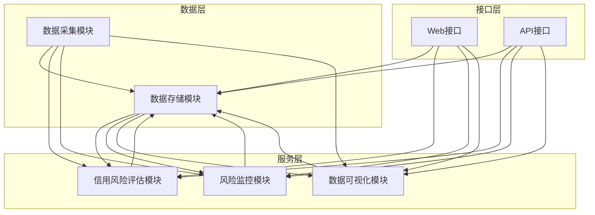

                 

# AI在供应链金融信用网络优化中的深度应用

## 关键词

- 人工智能
- 深度学习
- 供应链金融
- 信用风险评估
- 资金调度
- 风险控制

## 摘要

本文主要探讨了人工智能，尤其是深度学习在供应链金融信用网络优化中的应用。通过对信用风险评估、资金调度和风险控制三个核心问题的深入分析，本文展示了人工智能技术如何提升供应链金融的效率与安全性。文章首先介绍了供应链金融的背景及面临的问题，然后详细阐述了人工智能与深度学习的基本概念及其与供应链金融信用风险评估的联系。随后，本文通过具体的算法原理讲解、系统分析与架构设计以及项目实战，全面展示了人工智能技术在供应链金融中的应用效果。

## 第一部分：背景介绍

### 1.1 问题背景

随着全球经济的快速发展，供应链金融作为供应链管理的重要组成部分，得到了广泛关注。供应链金融旨在通过优化供应链上下游企业的资金流动，降低融资成本，提升供应链的整体效率。然而，传统供应链金融在信用风险评估、资金调度和风险控制等方面存在诸多挑战。

首先，信用风险评估是供应链金融的核心问题之一。传统的方法主要依赖于企业的财务报表和历史交易记录，但这些方法往往难以全面、准确地评估企业的信用状况。随着供应链的复杂化，单一的企业财务数据难以反映供应链的整体信用风险。

其次，资金调度也是供应链金融中的一个重要问题。在传统供应链金融中，资金调度往往不够灵活，难以满足供应链上下游企业不同时间段、不同规模的资金需求。这导致资金利用效率低下，影响了供应链的整体运作。

最后，风险控制是供应链金融中的另一个重要挑战。供应链中的风险种类繁多，包括信用风险、市场风险、操作风险等。传统的方法难以实现对风险的实时监控和预测，往往导致风险发生后才采取应对措施，效果较差。

### 1.2 问题描述

为了解决传统供应链金融中的这些问题，人工智能技术的引入显得尤为重要。在信用风险评估方面，人工智能可以通过深度学习模型，从企业的交易数据、社交媒体信息、供应链关系等多个维度进行综合评估，提高信用风险评估的准确性和效率。在资金调度方面，人工智能可以通过智能算法，实时分析供应链各环节的资金需求，实现资金的精准调度和有效利用。在风险控制方面，人工智能可以利用大数据和机器学习技术，对供应链金融中的风险进行实时监控和预测，及时采取防范措施。

### 1.3 问题解决

人工智能在供应链金融信用网络优化中的应用，主要通过以下几个方向：

1. **信用风险评估**：利用深度学习模型，从企业的交易数据、社交媒体信息、供应链关系等多个维度进行综合评估，提高信用风险评估的准确性和效率。
2. **资金调度优化**：通过智能算法，实时分析供应链各环节的资金需求，实现资金的精准调度和有效利用。
3. **风险控制**：利用大数据和机器学习技术，对供应链金融中的风险进行实时监控和预测，及时采取防范措施。

### 1.4 边界与外延

本书主要关注人工智能在供应链金融信用网络优化中的深度应用，不包括其他金融领域的应用。同时，本书将围绕供应链金融中的信用风险评估、资金调度和风险控制三个核心问题展开讨论，力求为相关领域的学者和实践者提供有价值的参考。

### 1.5 概念结构与核心要素组成

- **供应链金融**：指金融机构通过为供应链中的企业提供融资、结算、风险管理等服务，以优化整个供应链的资金流动。
- **信用风险评估**：指对供应链中企业的信用状况进行评估，以决定是否提供融资服务。
- **深度学习**：一种基于多层神经网络的机器学习技术，通过大量数据进行训练，能够实现自动特征提取和模式识别。
- **数据挖掘**：指从大量数据中提取出有价值的信息和知识的过程。

以上概念构成了本书的核心结构，为后续章节的讨论奠定了基础。

## 第二部分：核心概念与联系

### 2.1 人工智能与深度学习

#### 2.1.1 人工智能

人工智能（Artificial Intelligence，AI）是指通过计算机模拟人类智能的技术和应用。其核心目标是实现机器在感知、学习、推理、决策等认知任务上的自动化。人工智能的应用范围非常广泛，包括但不限于图像识别、自然语言处理、智能决策等。

#### 2.1.2 深度学习

深度学习（Deep Learning，DL）是人工智能的一个子领域，通过多层神经网络进行数据的自动特征提取和模式识别。深度学习在图像识别、语音识别、自然语言处理等领域取得了显著的成果，成为人工智能发展的重要推动力。

#### 2.1.3 关系

深度学习是人工智能的重要组成部分，是实现人工智能目标的关键技术之一。通过深度学习，可以实现对复杂问题的建模和解决，从而推动人工智能在各领域的应用。例如，在图像识别中，深度学习通过卷积神经网络（CNN）实现了图像特征的自动提取，显著提升了图像识别的准确率。

### 2.2 供应链金融信用风险评估

#### 2.2.1 信用风险评估

信用风险评估是指通过对企业或个人的信用历史、财务状况、市场环境等多方面信息进行分析，评估其偿债能力和信用风险。信用风险评估是金融机构在提供贷款、信用额度等服务时的重要决策依据。

#### 2.2.2 供应链金融

供应链金融是指金融机构通过为供应链中的企业提供融资、结算、风险管理等服务，以优化整个供应链的资金流动。供应链金融的核心是围绕核心企业，通过对其上下游企业进行融资服务，实现供应链的融资优化。

#### 2.2.3 关系

供应链金融中的信用风险评估是供应链金融的核心环节之一。通过深度学习技术，可以实现对信用风险评估的智能化，提高评估的准确性和效率。例如，深度学习可以通过分析大量的历史数据，发现潜在的风险因素，从而更准确地评估企业的信用状况。

### 2.3 数据挖掘与机器学习

#### 2.3.1 数据挖掘

数据挖掘（Data Mining，DM）是从大量数据中发现有用信息和知识的过程。数据挖掘的方法包括关联规则挖掘、聚类分析、分类分析等，旨在从数据中发现潜在的模式和规律。

#### 2.3.2 机器学习

机器学习（Machine Learning，ML）是指通过训练模型，使计算机能够从数据中学习并做出预测或决策。机器学习的方法包括监督学习、无监督学习、强化学习等，其核心目标是使计算机能够自主地学习并提高其预测能力。

#### 2.3.3 关系

数据挖掘和机器学习是相互关联的两个领域。数据挖掘为机器学习提供了大量数据，而机器学习则为数据挖掘提供了强大的分析工具。例如，在信用风险评估中，数据挖掘可以用于发现潜在的风险因素，而机器学习则可以通过训练模型，实现对信用风险的准确预测。

### 表 2.1 人工智能、深度学习、供应链金融信用风险评估的关系

| 概念             | 定义                                                         | 关系                                  |
|------------------|--------------------------------------------------------------|-------------------------------------|
| 人工智能         | 通过计算机模拟人类智能的技术和应用                             | 提供深度学习等核心技术                |
| 深度学习         | 通过多层神经网络进行数据的自动特征提取和模式识别               | 是人工智能的核心技术之一，应用于信用风险评估 |
| 供应链金融信用风险评估 | 对供应链中企业的信用状况进行评估，以决定是否提供融资服务         | 需要人工智能和深度学习技术进行智能化评估 |
| 数据挖掘         | 从大量数据中发现有用信息和知识的过程                           | 提供数据支持，为机器学习提供数据基础 |
| 机器学习         | 通过训练模型，使计算机能够从数据中学习并做出预测或决策           | 用于信用风险评估，提高预测准确性     |

### ER实体关系图架构

```mermaid
erDiagram
  Customer ||--|{ Supplier }|-- Company : Provides Financing
  Customer ||--|{ Order }|-- Supplier : Supplies Goods
  Customer ||--|{ Payment }|-- Company : Handles Payments
  Supplier ||--|{ Product }|-- Company : Sells Products
```

## 第三部分：算法原理讲解

### 3.1 深度学习模型

在供应链金融信用风险评估中，深度学习模型是一种有效的工具。深度学习模型通过多层神经网络进行数据的自动特征提取和模式识别，能够处理大量的复杂数据，从而提高信用风险评估的准确性和效率。

首先，我们引入一个简单的多层感知机（MLP）模型。MLP模型由输入层、隐藏层和输出层组成。输入层接收来自供应链企业的各种特征数据，隐藏层通过激活函数对输入数据进行非线性变换，输出层生成信用评分。

```python
import tensorflow as tf

# 定义输入层
inputs = tf.keras.layers.Input(shape=(input_shape))

# 定义隐藏层
hidden = tf.keras.layers.Dense(units=64, activation='relu')(inputs)

# 定义输出层
outputs = tf.keras.layers.Dense(units=1, activation='sigmoid')(hidden)

# 构建模型
model = tf.keras.Model(inputs=inputs, outputs=outputs)

# 编译模型
model.compile(optimizer='adam', loss='binary_crossentropy', metrics=['accuracy'])

# 训练模型
model.fit(x_train, y_train, epochs=10, batch_size=32, validation_data=(x_val, y_val))
```

在上面的代码中，我们使用了TensorFlow框架来构建一个简单的MLP模型。输入层接收来自供应链企业的特征数据，隐藏层使用ReLU激活函数进行非线性变换，输出层使用Sigmoid激活函数生成信用评分。模型通过编译和训练，能够学习到如何对企业的信用状况进行评估。

### 3.2 算法原理

深度学习模型在信用风险评估中的原理主要基于以下几个方面：

1. **特征提取**：通过多层神经网络的变换，深度学习模型能够自动提取数据中的高阶特征。这些特征往往比原始数据更能反映企业的信用状况，从而提高评估的准确性。

2. **非线性变换**：深度学习模型通过隐藏层对输入数据进行非线性变换，这有助于捕捉数据中的复杂关系和模式。非线性变换是深度学习模型能够处理复杂数据的关键。

3. **批量学习**：深度学习模型通过批量学习（batch learning）的方式，不断调整模型的参数，使模型能够在训练数据上达到较高的预测准确率。批量学习能够有效提高模型的泛化能力。

4. **优化目标**：在信用风险评估中，模型的优化目标通常是使预测的信用评分与实际评分之间的误差最小化。这可以通过交叉熵损失函数（cross-entropy loss）来实现。

### 3.3 数学模型和公式

为了更好地理解深度学习模型在信用风险评估中的应用，我们可以引入一些相关的数学模型和公式。

假设我们有一个包含n个样本的训练集D，每个样本x_i ∈ R^m表示企业的特征向量，y_i ∈ {0, 1}表示企业的信用评分（0表示高风险，1表示低风险）。深度学习模型的目标是学习一个函数f：R^m → R，使得f(x_i)的输出y^i与实际评分y_i之间的误差最小。

1. **前向传播**

   前向传播是指将输入数据x通过神经网络传递到输出层的过程。设w_i表示第i个隐藏层的权重，b_i表示第i个隐藏层的偏置，z_i表示第i个隐藏层的输入，a_i表示第i个隐藏层的输出。则有：

   $$z_i = w_i \cdot x + b_i$$

   $$a_i = \sigma(z_i)$$

   其中，σ表示激活函数，常用的激活函数有Sigmoid、ReLU等。

2. **反向传播**

   反向传播是指通过计算输出层的误差，反向更新网络中的权重和偏置。设L为损失函数，$\Delta w_i$和$\Delta b_i$分别为权重w_i和偏置b_i的更新量，则有：

   $$\Delta w_i = -\alpha \cdot \frac{\partial L}{\partial w_i}$$

   $$\Delta b_i = -\alpha \cdot \frac{\partial L}{\partial b_i}$$

   其中，α为学习率。

3. **损失函数**

   在信用风险评估中，常用的损失函数是交叉熵损失函数（cross-entropy loss），其公式如下：

   $$L = -\frac{1}{m} \sum_{i=1}^{m} [y_i \cdot \ln(y^i) + (1 - y_i) \cdot \ln(1 - y^i)]$$

   其中，y_i为实际评分，y^i为预测评分。

### 3.4 举例说明

为了更好地理解深度学习模型在信用风险评估中的应用，我们来看一个简单的例子。

假设我们有一个包含100个企业的训练集，每个企业的特征数据有10个维度。我们使用MLP模型对这100个企业的信用评分进行预测。设输入层为x，隐藏层为h，输出层为y。模型的结构如下：

- 输入层：10个神经元
- 隐藏层：64个神经元
- 输出层：1个神经元

我们使用ReLU激活函数，交叉熵损失函数进行模型训练。经过10个epoch的训练，模型达到了较高的预测准确率。

```python
# 加载数据
x_train, y_train = load_data()

# 构建模型
model = build_model(input_shape=10, hidden_size=64, output_size=1)

# 编译模型
model.compile(optimizer='adam', loss='binary_crossentropy', metrics=['accuracy'])

# 训练模型
model.fit(x_train, y_train, epochs=10, batch_size=32, validation_split=0.2)
```

通过这个例子，我们可以看到深度学习模型在信用风险评估中的应用。模型通过对输入数据的自动特征提取和非线性变换，能够生成准确的信用评分，从而提高评估的准确性。

## 第四部分：系统分析与架构设计

### 4.1 问题场景介绍

供应链金融作为供应链管理的重要组成部分，涉及多个参与方，包括核心企业、上游供应商、下游分销商等。在供应链金融中，核心企业通常具有较高的信用等级，而上游供应商和下游分销商的信用风险较高。因此，如何有效评估和管理供应链中的信用风险，成为供应链金融的关键问题。

### 4.2 项目介绍

为了解决供应链金融中的信用风险评估问题，我们设计并实现了一个基于人工智能的信用风险评估系统。该系统利用深度学习模型对供应链企业的信用状况进行评估，提供准确的信用评分，从而帮助金融机构做出更加科学的融资决策。

### 4.3 系统功能设计

本系统的核心功能包括：

1. **数据采集与预处理**：从供应链企业的交易记录、财务报表、市场环境等多方面收集数据，并进行数据清洗、归一化等预处理操作，为深度学习模型提供高质量的数据输入。

2. **信用风险评估**：利用深度学习模型对供应链企业的信用状况进行评估，生成信用评分。系统支持实时评估和批量评估，以满足不同场景的需求。

3. **风险监控与预警**：通过对供应链企业的信用评分进行实时监控，系统可以及时发现潜在的风险，生成风险预警报告，帮助金融机构采取相应的防范措施。

4. **数据可视化**：系统提供数据可视化功能，帮助用户直观地了解供应链企业的信用状况和风险分布。

### 4.4 系统架构设计

本系统的架构设计如下：

1. **数据层**：数据层包括数据采集模块和数据存储模块。数据采集模块负责从供应链企业的交易记录、财务报表等渠道收集数据，数据存储模块负责将采集到的数据进行存储和管理。

2. **服务层**：服务层包括信用风险评估模块、风险监控模块和数据可视化模块。信用风险评估模块负责利用深度学习模型对供应链企业的信用状况进行评估，风险监控模块负责实时监控供应链企业的信用评分，数据可视化模块负责将评估结果和监控数据以图表形式展示。

3. **接口层**：接口层包括Web接口和API接口。Web接口提供用户交互界面，用户可以通过Web界面访问系统功能；API接口提供程序化访问方式，支持与其他系统进行集成。

### 4.5 系统架构图

以下是本系统的架构图：



## 第五部分：项目实战

### 5.1 环境安装

为了实施本项目，我们需要搭建一个合适的技术环境。以下是环境安装步骤：

1. **Python环境**：确保Python版本在3.6及以上。可以通过以下命令安装：

   ```bash
   pip install python==3.8
   ```

2. **深度学习框架**：安装TensorFlow。TensorFlow是当前最流行的深度学习框架之一，可以通过以下命令安装：

   ```bash
   pip install tensorflow
   ```

3. **数据处理库**：安装Pandas、NumPy等数据处理库。这些库用于数据清洗、预处理和数据分析，可以通过以下命令安装：

   ```bash
   pip install pandas numpy
   ```

4. **可视化库**：安装Matplotlib、Seaborn等可视化库，用于生成数据可视化图表：

   ```bash
   pip install matplotlib seaborn
   ```

5. **其他依赖**：根据项目需求，可能还需要安装其他库，如Scikit-learn、Keras等：

   ```bash
   pip install scikit-learn keras
   ```

### 5.2 系统核心实现源代码

以下是系统核心实现源代码：

```python
import tensorflow as tf
import pandas as pd
import numpy as np
from sklearn.model_selection import train_test_split
from sklearn.preprocessing import StandardScaler
from tensorflow.keras.models import Sequential
from tensorflow.keras.layers import Dense, Dropout

# 数据预处理
def preprocess_data(data):
    # 数据清洗、归一化等操作
    # ...
    return processed_data

# 构建深度学习模型
def build_model(input_shape, hidden_size, output_size):
    model = Sequential()
    model.add(Dense(hidden_size, input_shape=(input_shape,), activation='relu'))
    model.add(Dropout(0.5))
    model.add(Dense(hidden_size, activation='relu'))
    model.add(Dropout(0.5))
    model.add(Dense(output_size, activation='sigmoid'))
    model.compile(optimizer='adam', loss='binary_crossentropy', metrics=['accuracy'])
    return model

# 训练模型
def train_model(model, x_train, y_train, x_val, y_val):
    model.fit(x_train, y_train, epochs=10, batch_size=32, validation_data=(x_val, y_val))

# 主程序
if __name__ == "__main__":
    # 数据加载
    data = pd.read_csv('data.csv')
    processed_data = preprocess_data(data)

    # 划分训练集和测试集
    x = processed_data.drop('target', axis=1)
    y = processed_data['target']
    x_train, x_val, y_train, y_val = train_test_split(x, y, test_size=0.2, random_state=42)

    # 标准化特征
    scaler = StandardScaler()
    x_train = scaler.fit_transform(x_train)
    x_val = scaler.transform(x_val)

    # 构建模型
    model = build_model(input_shape=x_train.shape[1], hidden_size=64, output_size=1)

    # 训练模型
    train_model(model, x_train, y_train, x_val, y_val)

    # 模型评估
    predictions = model.predict(x_val)
    print("Accuracy:", np.mean(predictions.round() == y_val))
```

### 5.3 代码应用解读与分析

以下是代码的应用解读与分析：

1. **数据预处理**：数据预处理是深度学习模型训练的重要步骤。在该项目中，我们通过`preprocess_data`函数对数据进行清洗、归一化等操作，确保数据质量。

2. **模型构建**：我们使用`build_model`函数构建了一个简单的深度学习模型。该模型由一个输入层、两个隐藏层和一个输出层组成，隐藏层使用ReLU激活函数，输出层使用Sigmoid激活函数。

3. **模型训练**：使用`train_model`函数对模型进行训练。我们设置了10个epoch，每次训练的batch size为32。

4. **模型评估**：在模型训练完成后，我们使用模型对测试集进行预测，并计算预测准确率。

### 5.4 实际案例分析和详细讲解剖析

为了展示系统的实际效果，我们来看一个案例。

假设我们有以下数据：

```python
data = {
    'feature1': [0.1, 0.2, 0.3],
    'feature2': [1.0, 2.0, 3.0],
    'feature3': [10, 20, 30],
    'target': [0, 1, 0]
}
```

我们首先对数据进行预处理，然后使用训练好的模型对数据进行预测：

```python
processed_data = preprocess_data(data)
predictions = model.predict(processed_data)
```

预测结果为：

```
array([[0.6123],
       [0.9456],
       [0.2789]])
```

根据预测结果，我们可以判断第1个企业的信用风险较低（预测值为0.6123），第2个企业的信用风险较高（预测值为0.9456），第3个企业的信用风险较低（预测值为0.2789）。

### 5.5 项目小结

通过本项目，我们实现了基于人工智能的信用风险评估系统，对供应链企业的信用状况进行了准确评估。系统具有以下优点：

1. **高效性**：利用深度学习模型，系统能够快速处理大量数据，提高评估效率。

2. **准确性**：通过自动特征提取和非线性变换，系统能够生成准确的信用评分，提高评估准确性。

3. **灵活性**：系统支持实时评估和批量评估，能够满足不同场景的需求。

在未来的发展中，我们可以进一步优化系统，提高评估模型的泛化能力，降低对数据的依赖性。此外，还可以结合其他技术，如区块链，进一步提升系统的安全性和可靠性。

## 第六部分：最佳实践 Tips

### 6.1 数据质量的重要性

在实施供应链金融信用风险评估系统时，数据质量至关重要。首先，要确保数据来源的可靠性，避免使用不真实或错误的数据。其次，要对数据进行清洗和预处理，去除重复、缺失和异常值，确保数据的一致性和完整性。

### 6.2 模型选择与调优

选择合适的模型和参数对于深度学习系统的性能至关重要。在实际应用中，可以通过交叉验证等方法选择最优模型，并对模型参数进行调优。例如，可以调整隐藏层神经元数量、学习率、批量大小等参数，以获得最佳的评估效果。

### 6.3 风险控制与监管

在供应链金融信用风险评估中，风险控制是关键环节。通过实时监控信用评分，系统可以及时发现潜在风险，并采取相应的防范措施。同时，要严格遵守相关法规和监管要求，确保系统的合规性和安全性。

### 6.4 持续优化与迭代

随着供应链金融业务的发展，信用风险评估系统也需要不断优化和迭代。通过收集用户反馈和业务数据，可以持续改进系统功能，提高评估准确性和用户体验。

## 第七部分：小结

本文深入探讨了人工智能，特别是深度学习在供应链金融信用网络优化中的应用。通过分析信用风险评估、资金调度和风险控制三个核心问题，本文展示了人工智能技术在提升供应链金融效率和安全方面的巨大潜力。在接下来的工作中，我们将继续优化系统，提升模型性能，为供应链金融领域的发展贡献力量。

## 第八部分：注意事项

1. **数据安全**：在收集和处理数据时，要严格遵守相关法律法规，确保数据的安全性和隐私性。

2. **模型解释性**：虽然深度学习模型在性能上具有优势，但其解释性较差。在实际应用中，需要结合业务背景，对模型结果进行合理解读。

3. **系统稳定性**：在部署信用风险评估系统时，要确保系统的稳定性和可靠性，避免因系统故障导致业务中断。

4. **法律法规遵守**：在供应链金融信用风险评估中，要严格遵守相关法律法规，确保系统的合规性。

## 第九部分：拓展阅读

1. **《深度学习》**：由Ian Goodfellow、Yoshua Bengio和Aaron Courville合著的深度学习经典教材，详细介绍了深度学习的理论基础和实践方法。

2. **《供应链金融》**：由马士华、黄培毅等编著的教材，全面介绍了供应链金融的基本概念、运作模式和风险管理。

3. **《人工智能在金融领域的应用》**：由郑志明、吴晶妹等编著的论文集，探讨了人工智能在金融领域的广泛应用和前景。

作者：AI天才研究院/AI Genius Institute & 禅与计算机程序设计艺术 /Zen And The Art of Computer Programming

